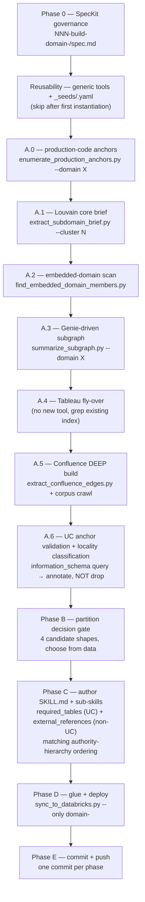

# Domain Build Spec Template

> Per-domain build template instantiated from spec 007 (Package Agent Domains) for each individual super-domain skill build. This template encodes the **statistical + operational + governance flow** that produced the first 5 deployed domains (Payments, Revenue & Fees, Customer & Identity, Trading, Cross-Domain). Future per-domain specs (011-build-domain-compliance-aml, future 012-build-domain-finance-treasury, etc.) instantiate this template.

**Feature Branch**: `[NNN-build-domain-<name>]`
**Created**: [DATE]
**Parent Spec**: 007-package-agent-domains
**Reusability Lineage**: First instantiated by 011-build-domain-compliance-aml (introduces generic tools `tools/skills/enumerate_production_anchors.py`, `tools/skills/summarize_subgraph.py`, `tools/skills/find_embedded_domain_members.py`, `tools/skills/extract_confluence_edges.py`, and the `tools/skills/_seeds/<domain>.yaml` convention).

## Authority hierarchy (NON-NEGOTIABLE)

Every domain build ranks evidence by authority, not by source uniformity. See [`knowledge/skills/_AUTHORITY_HIERARCHY.md`](../../knowledge/skills/_AUTHORITY_HIERARCHY.md) for the canonical statement. Summary:

1. **etoro_kpi / etoro_kpi_prep view DDL** — production SQL, executed daily, IS the semantic model
2. **Genie space configurations** — production-blessed curated table sets
3. **Confluence canonical pages** (Handbook / Framework / Glossary / Policy titles, ≤2 levels deep in space tree, many backlinks)
4. **Wiki §3.3 Common JOINs** — sampling-derived, drifts
5. **Confluence non-canonical pages** (Drafts, Sandbox, recent edits with low backlinks)
6. **Tableau custom SQL** — analyst-authored, often experimental

## User Scenarios & Testing

### User Story 1 — Domain skill is grounded in production code (Priority: P1)

As an agent answering a domain-scoped question, I need the skill to anchor on the production artifacts (KPI views, Genie spaces) that already encode the semantic model, so that my answers reflect what the business ACTUALLY does today, not what documents from a year ago describe.

**Why this priority**: Production code is the only source that cannot disagree with itself. Wiki and Confluence drift.

**Independent Test**: For each KPI view referenced in `tools/skills/_seeds/<domain>.yaml`, the skill MUST list it in `required_tables` and treat its DDL as authoritative when conflicts arise with wiki/Confluence content.

### User Story 2 — Cluster partition is data-driven, not pre-prescribed (Priority: P1)

As a skill author, I need the sub-skill partition (hub vs single overlay vs atomic-pair) to be derived from the statistical model (Louvain cluster + Genie ownership + KPI coverage), so that small domains don't get inflated into hubs and large domains don't get crammed into one file.

**Why this priority**: Pre-prescribing a file shape leads to either bloat or missing coverage.

**Independent Test**: The semantic-model outputs (`_<domain>_production_anchors.md`, `_brief_cluster_*.md`, `_<domain>_subgraph.md`) must precede authoring; the partition decision is logged in the spec's Phase B gate.

### User Story 3 — Build is reusable for future domains (Priority: P2)

As a future skill author building domain D+1, I need every tool from this spec to run with `--domain <name>` and a seed YAML, so that I don't re-author scripts per domain.

**Why this priority**: Per-domain script forking is the main cause of drift between deployed skills.

**Independent Test**: Run the same tool used by this spec against another domain's seed YAML; output must be schema-identical.

## Phases (mandatory)

### Phase A.6 — UC anchor validation + locality classification (NEVER-DROP rule)

For every anchor surfaced by phases A.0 through A.5, query `system.information_schema.tables` to confirm it exists in UC. **The output of A.6 is a 4-bucket classification, NOT a filter.**

| Bucket | Action in Phase C |
|---|---|
| `UC` (default) — exists in `system.information_schema.tables` | Add to `required_tables:` |
| `synapse_only` — does not exist in UC; exists in `sql_dp_prod_we` / DWH / BI_DB / OLTP databases | Add to `external_references:` with `locality: synapse_only`; document in `## External Data Sources` body section |
| `hybrid_synapse_uc` — exists in both, but the UC bronze drops columns / lags / projects differently | Add to BOTH `required_tables:` (for the bronze) AND `external_references:` with `locality: hybrid_synapse_uc` (for the Synapse master); explain the projection gap |
| `external_system` — Actimize / ComplyAdvantage / Salesforce / Tableau custom SQL / Excel | Add to `external_references:` with `locality: external_system`; bridge_strategy explains vendor UI / Fivetran / etc. |
| `manual_only` — Synapse stored proc / runbook step / manual ticket-routing rule | Add to `external_references:` with `locality: manual_only` |

**The NEVER-DROP rule.** A.6's classification MUST NOT delete any anchor surfaced in A.0–A.5. The only reason to drop an anchor is if its owning team has retired it (replaced / deprecated). For anything still producing business value — even if it lives in Synapse, Actimize, Salesforce, a spreadsheet, or only as a stored proc — annotate locality and keep it in the skill. The consumer asking "where does AML risk score 200 come from?" still needs the answer even if the actual decision happens in Actimize and the trigger table is Synapse-only. See [`knowledge/skills/_AUTHORITY_HIERARCHY.md`](../../knowledge/skills/_AUTHORITY_HIERARCHY.md) "Locality is orthogonal to authority" for the full rationale.

The output of A.6 is a section appended to `_<domain>_staleness.md` titled `## Locality classification` with one row per anchor and one column per bucket.

## Requirements

### Functional Requirements

- **FR-001**: System MUST produce a `_<domain>_production_anchors.md` listing every table referenced by the domain's KPI views (tier 1) and Genie spaces (tier 2) BEFORE any cluster brief is read.
- **FR-002**: System MUST surface Louvain-leak (AML-named tables embedded in non-AML clusters) via a generic `find_embedded_domain_members.py` scan.
- **FR-003**: System MUST emit a `_<domain>_subgraph.md` Genie-seeded subgraph (not just Louvain-cluster-seeded) using the generic `summarize_subgraph.py`.
- **FR-004**: System MUST include Confluence as a first-class signal source via `extract_confluence_edges.py` with stability-weighted page selection (Handbook/Framework/Glossary titles favored; recent low-backlink pages de-weighted).
- **FR-005**: System MUST cross-check Confluence claims, wiki §3.3 JOINs, and UC `information_schema` for staleness; output to `_<domain>_staleness.md` with explicit verdicts per discrepancy.
- **FR-005a** (NEVER-DROP): Phase A.6 MUST classify every anchor into one of `{UC, synapse_only, hybrid_synapse_uc, external_system, manual_only}` and append a `## Locality classification` section to `_<domain>_staleness.md`. The classification MUST be additive — anchors that fail UC presence are annotated, not deleted, unless the owning team has explicitly retired them.
- **FR-006**: System MUST defer the file-shape (hub-with-sub-skills vs single-overlay vs atomic-pair vs B-embedded) decision to Phase B, with the choice driven by the semantic-model outputs, not by uniform-format convention.
- **FR-007**: Every SKILL.md emitted MUST conform to spec 007 FR-009 (DataPlatform DE skill-creator schema; `tools/skills/lint_skill.py` exit 0).
- **FR-007a** (locality routing): Every SKILL.md whose Phase A.6 produced any anchor outside the `UC` bucket MUST populate `external_references:` in frontmatter (validated by `lint_skill.py`) AND include a `## External Data Sources` body section that names the source system, the bridge strategy, and any operational caveats per entry.
- **FR-008**: All tooling MUST be parameterized — no domain-specific hardcoding. New tools introduced by this template's first instantiation become reusable for every subsequent domain build.
- **FR-009**: Commit cadence MUST be one commit per phase on a feature branch named after the spec; final push gated on lint + deploy verification.

### Key Entities

- **DomainSeedYAML**: `tools/skills/_seeds/<domain>.yaml` containing `kpi_seeds`, `genie_seeds`, `hub_tables`, `embedded_scan_patterns`, `confluence_query_terms`.
- **ProductionAnchorReport**: `_<domain>_production_anchors.md` listing tier-1 (KPI-touched) and tier-2 (Genie-only) nodes.
- **SubgraphReport**: `_<domain>_subgraph.md` — Genie-seeded subgraph with intra-domain edges + cross-edges to sibling domains.
- **StalenessReport**: `_<domain>_staleness.md` with verdicts (Confluence-vs-wiki, dead-table refs, stale KPI sources).
- **PartitionDecision**: logged in the spec's Phase B section; cites the semantic-model outputs that justify the chosen shape.

## Success Criteria

### Measurable Outcomes

- **SC-001**: `_<domain>_production_anchors.md` exists and references every KPI view from the seed YAML's `kpi_seeds`.
- **SC-002**: `_<domain>_subgraph.md` lists every node touched by every Genie in `genie_seeds`.
- **SC-003**: `_<domain>_staleness.md` flags ≥1 discrepancy OR explicitly states "no staleness found across N pages" with N ≥ 10.
- **SC-004**: All `tools/skills/*.py` introduced by this template's first instantiation run on at least 2 distinct domains' seed YAMLs without code changes.
- **SC-005**: `tools/skills/lint_skill.py` exits 0 on every authored skill file.
- **SC-006**: Deployed skill is queryable at `/Workspace/databricks/data-skills/skills/domain-<name>/SKILL.md` (or other workspace base if user configures `--workspace-base`).
- **SC-007**: One commit per phase on the feature branch with explicit `feat(skills):` / `feat(skills/tools):` / `feat(spec):` messages; never `git add .`.
