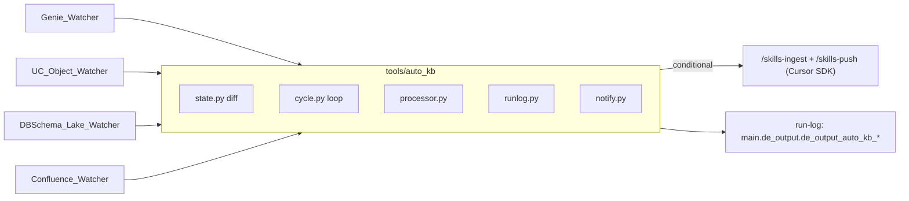

# Knowledge-Base Watchers (auto_kb)

Four independent, diff-driven autonomous flows that keep the skills/domains
knowledge base in sync with the live platform. Each replicates the proven
`skills-autoloop` pattern but **without a Databricks app and without user input**
-- pure `diff -> evaluate -> conditional push`. They share one engine,
[tools/auto_kb/](../tools/auto_kb), and each has its own state, run-log, and
README.



## The five apps

| App | Detects | Source of "current" | Action |
|---|---|---|---|
| [Genie_Watcher](Genie_Watcher/README.md) | new / changed Genie spaces, scored by builder curation | repo Genie cache or `--current` | ingest high-value spaces -> conditional skill/domain push |
| [UC_Object_Watcher](UC_Object_Watcher/README.md) | new / changed UC objects (never `*_stg`) | `information_schema` or `--current` | uc-pipeline-doc (writer source from prod workspace `5263962954799003`) -> wiki + ALTER + conditional push |
| [DBSchema_Lake_Watcher](DBSchema_Lake_Watcher/README.md) | new / changed source-DB table wikis that are lake-backed | `DB_Schema` repo INTERSECT generic mapping | link Synapse table to its bronze UC object -> conditional push |
| [Confluence_Watcher](Confluence_Watcher/README.md) | new / changed Confluence pages by version | MCP-produced snapshot (`--current` required) | amend skill-backing pages -> conditional push |
| [Questions_Watcher](Questions_Watcher/README.md) | new / newly-underserved user-question intents (metric-led clusters) | MCP + Genie gateway logs or `--current` | gap dossier + proposed skill domain/sub-domain (report-only) |

## Common CLI (every app)

```
--current <json>     bypass live fetch (fixtures / external snapshot)
--snapshot <path>    baseline (default: <App>/state/snapshot.json)
--dry-run            simulate; never mutate snapshot / DB / PRs
--no-notify          skip Teams notifications
--no-runlog          skip UC run-log writes
--no-adversarial     disable adversarial durability judge (not recommended)
--adversarial-min-score N  heuristic durability floor (default: 60)
--detect-only        write manifest, do not process
--manifest-out <p>   write detected WorkItems to JSON
--stop-on-error      stop after first failure
--workspace-cwd <p>  workspace root for live Cursor SDK runs
--limit N            process at most N items
```

## Adversarial durability gate

Before any live ingest action, the shared processor runs:

1. A heuristic durability screen (temporary/test/date-stamped/export-style signals).
2. An adversarial agent judge (`approve|reject|review`) focused on "durable knowledge vs noise".

If the gate returns `reject` or `review`, the item is logged as `skipped` with explicit gate notes.
Only `approve` items continue to ingest/push logic.

## Offline self-test (all five)

Each app ships fixtures and dry-runs with no Databricks / Cursor / MCP:

```bash
python Data_Skills_Automation/Genie_Watcher/watch.py            --current Data_Skills_Automation/Genie_Watcher/fixtures/current_spaces.json   --snapshot /tmp/g.json --dry-run --no-notify --no-runlog
python Data_Skills_Automation/UC_Object_Watcher/watch.py        --current Data_Skills_Automation/UC_Object_Watcher/fixtures/current_objects.json --snapshot /tmp/u.json --dry-run --no-notify --no-runlog
python Data_Skills_Automation/DBSchema_Lake_Watcher/watch.py    --current Data_Skills_Automation/DBSchema_Lake_Watcher/fixtures/current_wikis.json --snapshot /tmp/d.json --dry-run --no-notify --no-runlog
python Data_Skills_Automation/Confluence_Watcher/watch.py       --current Data_Skills_Automation/Confluence_Watcher/fixtures/current_pages.json --snapshot /tmp/c.json --dry-run --no-notify --no-runlog
python Data_Skills_Automation/Questions_Watcher/watch.py        --current Data_Skills_Automation/Questions_Watcher/fixtures/current_questions.json --snapshot /tmp/q.json --dry-run --no-notify --no-runlog
```

## Before the first live run

1. Apply the run-log DDL (`tools/auto_kb/ddl.sql`) once via `tools/dbx_query.py`
   (or MCP). All five table names are anti-purge compliant.
2. Set `CURSOR_API_KEY` for live `/skills-ingest` + `/skills-push`.
3. For Confluence, produce the metadata snapshot inside Cursor first (MCP).

The snapshot baseline advances only on a fully successful live run, so a failed
item is simply re-detected next cycle.

## 6th integrator agent

After the five watchers finish, run the integrator chain:

```bash
python tools/auto_kb/implications_report.py --since-hours 24
python tools/auto_kb/integrator_agent.py --agentic --workspace-cwd .
```

This consumes five outputs (4 watcher manifests + implications CSV) and writes:

- `Data_Skills_Automation/Auto_KB_Integrator/out/implications_rows.csv`
- `Data_Skills_Automation/Auto_KB_Integrator/out/implications_summary.csv`
- `Data_Skills_Automation/Auto_KB_Integrator/out/integrated_summary.json`
- `Data_Skills_Automation/Auto_KB_Integrator/out/integrated_summary.csv`
- `Data_Skills_Automation/Auto_KB_Integrator/out/integrated_summary.md`
- `Data_Skills_Automation/Auto_KB_Integrator/out/integrated_agentic_appendix.md`
