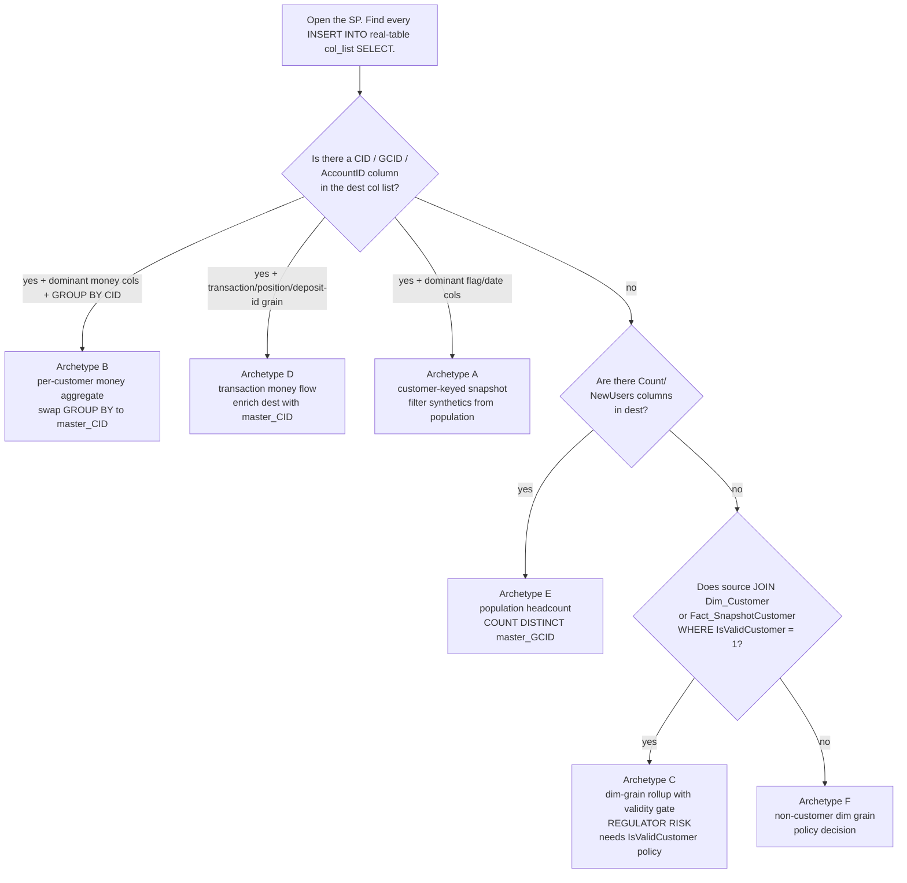

# Sub-Account Option 1 — Archetype Reference

**Audience:** DWH / Finance / RegTech engineers implementing or reviewing
the Synapse-side impact of Option 1 (synthetic sub-account users).
**Companion artifacts:**
[subaccount-option1-prd.md](./subaccount-option1-prd.md) · [subaccount-option1-triage.csv](./subaccount-option1-triage.csv) · [subaccount-option1-archetype-summary.json](./subaccount-option1-archetype-summary.json)
**Scanner:** [`_build_option1_archetypes.py`](./_build_option1_archetypes.py)

---

## 1. TL;DR

Every Synapse SP in the financial / reporting pool falls into **one of six
archetypes** based on the **destination grain** of its `INSERT INTO` (real
table) statement. The archetype determines the synthetic-user treatment.

| # | Archetype | Detection (destination col list) | Synthetic-user treatment | Count | Highest pri |
|---|-----------|-----------------------------------|--------------------------|-------|-------------|
| **A** | Customer-keyed snapshot | CID/GCID/AccountID + many flag/date cols (`IsFunded`, `1stActionDate`, `RegistrationDate`) + few money sums | **filter** synthetics from population OR enrich dest with `master_CID` for downstream rollup | 189 | 99 (`SP_M_Crypto_RECON`) |
| **B** | Per-customer money aggregate | CID/GCID + dominant money cols (`Equity`, `Commission`, `Cashouts`, `BankPayIns`) + final `GROUP BY CID` | **swap** `GROUP BY CID` → `GROUP BY master_CID` via `JOIN Dim_MasterGCID` | 114 | 99 (`SP_ASIC_ClientBalanceFinance`, `SP_CID_Daily_NWA`, `SP_Crypto_NOP`) |
| **C** | **Dim-grain rollup with validity gate (REGULATOR-RISK)** | NO customer key in dest + dim cols (`Region`, `Regulation`, `Instrument`) + sources gate on `IsValidCustomer = 1` / `IsCreditReportValidCB = 1` | **policy decision per SP** — does a synthetic count as "valid customer" for the regulator? | 96 | 99 (`SP_VarCommission`, `SP_Client_Balance_New`, `SP_Real_Crypto_Loans`, `SP_Finance_Non_US_Settlement_Report`) |
| **D** | Money-flow at transaction grain | CID + transaction-id col (`PositionID`, `TransactionID`, `DepositWithdrawID`) + money cols | **enrich** dest table with a `master_CID` column populated via `Dim_MasterGCID` join | 81 | 99 (`SP_DepositWithdrawFee`, `SP_DailyDividendsByPosition`, `SP_RealCrypto_Lev2`, `SP_Finance_Panel_Reports`, `SP_CycleGap`) |
| **E** | Population headcount | NO customer key + count cols (`NewUsers`, `NewWallets`, `*_Count`) | swap `COUNT(DISTINCT CID/GCID)` → `COUNT(DISTINCT master_GCID)` | 13 | 60 (`SP_EXW_FirstTimeWalletsAndUsers`) |
| **F** | Non-customer dim grain (no validity gate) | NO customer key + NO `IsValidCustomer` filter on source | policy decision: does the synthetic's activity show separately or roll to master at the dim level? | 155 | 99 (`SP_Daily_Dividends`, `SP_RollOverFee_Dividends`) |
| **X** | No destination INSERT detected | view / function / dispatcher SP / dynamic SQL / lookup-only / temp-only ETL | **manual review** — usually called by an A–F SP | 811 | 99 (`SP_PositionPnL`, `SP_DailyZero_TreeSize_NEW`, `SP_Daily_CB_Gaps_All`) |

**Total in scope:** 1,459 SQL files (SPs + Functions + Views) across the
Synapse `sql_dp_prod_we` pool. **648** classified into one of A–F (have a
real-table INSERT destination); **811** classified as X (need manual
review). **C is the regulator-risk class** — these SPs silently drop
synthetic users at the source via `IsValidCustomer = 1`, so getting the
policy wrong corrupts KPMG / ASIC / FCA submissions either by inflation
(if synthetics are treated as valid) or by invisibility (if their money
flows are excluded but their master CID's flows aren't reattributed).

---

## 2. Foundation: `Dim_MasterGCID`

The plan assumes a new helper table:

```sql
CREATE TABLE general.Dim_MasterGCID (
    CID            BIGINT NOT NULL,    -- every CID in the system
    GCID           BIGINT NOT NULL,    -- the GCID this CID belongs to
    master_CID     BIGINT NOT NULL,    -- the "real customer" CID for this GCID
    master_GCID    BIGINT NOT NULL,    -- the "real customer" GCID (= GCID itself for non-synthetic)
    is_synthetic   BIT    NOT NULL,    -- 1 = sub-account / bot-trader / etc, 0 = real customer
    sub_account_kind VARCHAR(40) NULL  -- 'real' | 'sub_currency' | 'sub_strategy' | 'bot_trader'
);
CREATE STATISTICS Stat_Dim_MasterGCID_CID         ON general.Dim_MasterGCID(CID);
CREATE STATISTICS Stat_Dim_MasterGCID_master_GCID ON general.Dim_MasterGCID(master_GCID);
```

For every synthetic CID, `master_CID` points at the human user whose
real account spawned it. For every real CID, `master_CID = CID` and
`is_synthetic = 0`.

This is the **only** new identity column the migration adds. All
archetype treatments below are expressed as `JOIN Dim_MasterGCID` plus a
keyword swap (`GROUP BY` → `GROUP BY master_CID`, `COUNT(DISTINCT CID)` →
`COUNT(DISTINCT master_GCID)`, `WHERE IsValidCustomer = 1` → policy
choice).

> **`RealCID` is NOT this column.** `RealCID` is legacy mirror-account
> scaffolding from the copy-trading domain (when a child account copies
> a parent it gets its own `CID` while `RealCID` keeps pointing at the
> parent). Option 1 should leave `RealCID` semantics unchanged. The new
> mapping (`Dim_MasterGCID.master_CID`) is conceptually orthogonal —
> a synthetic sub-account has both a `RealCID` (its own legacy mirror
> root, usually = its CID) AND a `master_CID` (the real user behind it).

---

## 3. Decision tree

When opening any SP / view / function, find every
`INSERT INTO <real-table> (<col_list>) SELECT ...` block and ask three
questions:



Multi-destination SPs: the most-severe archetype wins for triage
purposes. Severity order **C > A > B > D > E > F > X**.

---

## 4. Archetype A — Customer-keyed snapshot

**Definition.** Destination is one row per customer (CID/GCID/AccountID)
per period (typically per day). Columns are dominated by **boolean
flags** (`IsActive`, `IsFunded`, `IsValidCustomer`), **first-event
dates** (`FirstActionDate`, `FTD_Date`, `RegistrationDate`), or
**categorical statuses** (`PlayerStatus`, `Country`, `Regulation`).
Money columns are absent or rare.

**Why it matters for synthetics.** Each synthetic CID would create a new
row per day in this table — silently inflating downstream user counts,
"active customers" KPIs, and DDR tier classifications.

**Treatment recipe.**

```sql
-- Option A1: filter at population definition
WHERE NOT EXISTS (
    SELECT 1 FROM general.Dim_MasterGCID m
    WHERE m.CID = d.CID AND m.is_synthetic = 1
)

-- Option A2: enrich dest column list with master_CID
ALTER TABLE BI_DB_dbo.DDR_Customer_Daily_Status ADD master_CID BIGINT NULL;
-- Then in the SP body:
INSERT INTO BI_DB_dbo.DDR_Customer_Daily_Status (..., master_CID)
SELECT ..., m.master_CID
FROM ... d
LEFT JOIN general.Dim_MasterGCID m ON m.CID = d.RealCID;
```

**Worked examples** (sampled SPs):

- `BI_DB_dbo.SP_DDR_Customer_Daily_Status` (pri=60) — destination
  `BI_DB_DDR_Customer_Daily_Status (RealCID, AccountActive, ActiveTraded,
  BalanceOnlyAccount, FirstActionType, IsFunded, IsDepositorGlobal,
  IsValidCustomer, IsRegistered, FirstFundedDateID, ...)`. 38 flag/date
  cols, 0 money cols. Populates DDR Tier-1 input.
- `BI_DB_dbo.SP_DDR_Customer_Periodic_Status` (pri=60) — same shape,
  monthly snapshot. Same treatment.
- `BI_DB_dbo.SP_M_Crypto_RECON` (pri=99) — `(CID, SettlementType,
  TotalCommission, IsValidCustomer, Regulation)` — single money col, but
  the validity flag and regulation cols mark this as a customer-keyed
  reconciliation row. `master_CID` enrichment is the safer fix.
- `BI_DB_dbo.SP_FirstTimeFunded` (pri=90) — `(RealCID,
  FirstTimeFundedDate)` — pure first-event marker; **must** filter
  synthetics or first-funded counts inflate.
- `BI_DB_dbo.SP_CIDFirstDates` (pri=90) — `(CID, GCID, FirstDates...)`.
- `eMoney_dbo.SP_eMoney_Panel_FirstDates` (pri=60) — `(GCID, AccountID,
  CID, 1stActionDate, 1stActionType, 1stActionUSDApproxAmount, FMI_Date,
  FMO_Date, ...)`. The `*Amount` cols are first-event values, not
  ongoing money sums. 54 flag/date cols.
- `EXW_dbo.SP_EXW_DimUser_Enriched` (pri=60) — `(GCID, RealCID,
  IsValidCustomer, LastLoginCountry, PlayerStatus, RealizedEquity,
  TotalBalanceUSD)`. Two money cols are point-in-time totals, not flows.
- `eMoney_dbo.SP_eMoney_Customer_Risk_Assessment` (pri=60) — KYC risk
  score per CID with date-of-FTD + flags.

**Borderline note.** When a customer-keyed dest has many money columns
*and* many flag columns (`SP_eMoney_ClientBalance`, `SP_EXW_FactBalance`),
the scanner emits `confidence=medium` and may pick A or B. The treatment
is identical in practice (master_CID enrichment + downstream rollup), so
the A/B label here is informational.

---

## 5. Archetype B — Per-customer money aggregate

**Definition.** Destination is one row per customer (CID/GCID) per
period. Columns are dominated by **money sums**: `Equity`, `Commission`,
`PnL`, `Cashouts`, `BankPayIns`, `Volume`. Source typically has a final
`GROUP BY CID` (or `GROUP BY GCID`).

**Why it matters for synthetics.** Each synthetic produces its own row
of money sums — but the regulator / finance dashboard needs the **real
customer's** net position. Without master-CID rollup, NWA / equity / NOP
are split across the synthetic's rows and the master's rows.

**Treatment recipe.**

```sql
-- BEFORE
INSERT INTO ...
SELECT  CID,
        SUM(Commission) AS Commission,
        SUM(PnL)        AS PnL
FROM    ...
GROUP BY CID;

-- AFTER
INSERT INTO ...
SELECT  m.master_CID                AS CID,    -- or rename column
        SUM(s.Commission)           AS Commission,
        SUM(s.PnL)                  AS PnL
FROM    ... s
JOIN    general.Dim_MasterGCID m ON m.CID = s.CID
GROUP BY m.master_CID;
```

**Worked examples:**

- `BI_DB_dbo.SP_ASIC_ClientBalanceFinance` (pri=99) — `(CID, ClosedPnL,
  CurrentDayBalance, Equity, PreviousDayBalance, ...)`. ASIC regulator
  feed. Trivially mechanical.
- `BI_DB_dbo.SP_CID_Daily_NWA` (pri=99) — Net Worth Amount per CID. Same
  treatment.
- `BI_DB_dbo.SP_Crypto_NOP` (pri=99) — `(CID, CFD_Invested_Amount,
  CFD_NOP, EquityCFD, EquityReal, ...)`. Net Open Position aggregation.
- `BI_DB_dbo.SP_CB_Gap_Categorization` (pri=99) — Cashout-gap categorization per CID.
- `BI_DB_dbo.SP_Daily_CreditLine` (pri=99) — `(RealCID, TotalCLAmount)`.
  The grouping must be by master_CID after the swap.
- `eMoney_dbo.SP_eMoney_Daily_Shortfall_CID_Level` (pri=60) — per-CID
  daily shortfall calc with 10 money columns and `SUM(...) ... GROUP BY
  CID` at the final step.

---

## 6. Archetype C — Dim-grain rollup with validity gate (REGULATOR-RISK)

**Definition.** Destination has **no customer key** — output is at
Region / Regulation / Instrument / HedgeServer / Currency level. But
**the source** filters on `IsValidCustomer = 1` (or
`IsCreditReportValidCB = 1`, `IsDepositor = 1`, `VerificationLevelID IN
(...)`, `PlayerStatusID NOT IN (...)`) before aggregating. The output
only "sees" customers who pass the gate.

**Why it's the highest-risk class.** A synthetic's flag value depends on
who sets it. Two failure modes:
1. **Inflation.** If synthetics inherit `IsValidCustomer = 1` from their
   master, their commission / volume rolls into the dim aggregate
   *twice* (once as themselves, once when the master also generates the
   same flow). Regulator sees inflated commission.
2. **Invisibility.** If synthetics get `IsValidCustomer = 0`, their
   commission silently disappears from the dim aggregate. Regulator sees
   under-reported commission.

There's no single right answer — Finance + Compliance must decide per SP
whether the regulator wants the synthetic's flow or not.

**Treatment recipe (decision flowchart, per SP):**

1. Identify the regulator / consumer (KPMG, ASIC, FCA, internal Finance
   reconciliation, DDR Tier 1).
2. Decide: does the synthetic's economic activity belong to the
   regulator's view? Two axes:
   - Is the synthetic generating real money flow? (yes for sub-currency /
     bot-trader; arguably yes for sub-strategy)
   - Should it be reported under the master's regulation/jurisdiction?
     (yes — synthetics share regulation with master)
3. Implement one of:
   - **Roll-up via master**: `JOIN Dim_MasterGCID m ON m.CID = src.CID`,
     swap source filter `WHERE c.IsValidCustomer = 1` → `WHERE EXISTS
     (SELECT 1 FROM Dim_Customer cm WHERE cm.CID = m.master_CID AND
     cm.IsValidCustomer = 1)`. Money flows aggregate to master.
   - **Exclude synthetics entirely**: add `AND m.is_synthetic = 0` to
     source filter. Cleaner if regulator doesn't want synthetic activity.
   - **Keep synthetics with their own regulation**: do nothing — but
     this risks double-counting if master's flow already includes them.

**Worked examples (priority-99 finance package — the highest stakes):**

- `BI_DB_dbo.SP_VarCommission` (pri=99) — `(Regulation, Instrument,
  FullCommission, FullCommission_Closings, FullCommission_Openings,
  VarCommission)`. Source: `JOIN Dim_Customer ... WHERE
  IsValidCustomer = 1`. Feeds variable-commission settlement; mistake
  here flows directly to LP commission payouts.
- `BI_DB_dbo.SP_Client_Balance_New` (pri=99) — `(CID, CashoutFee,
  CashoutRollback, Cashouts, IsValidCustomer, PlayerStatus, Regulation)`.
  Hybrid: customer-keyed but with a strong validity gate, so promoted to
  C. Affects the daily client-balance reconciliation.
- `BI_DB_dbo.SP_Finance_Non_US_Settlement_Report` (pri=99) — Non-US
  settlement at instrument grain.
- `BI_DB_dbo.SP_Real_Crypto_Loans` (pri=99) — Crypto loan principal at
  Regulation grain.
- `BI_DB_dbo.SP_DDR` / `SP_DDR_Aggregated` / `SP_DDR_Aggregated_Auxiliary_Metrics`
  / `SP_DDR_Auxiliary_Metrics` (pri=90) — Daily Detailed Report
  aggregates. **Tier-1 finance / regulatory feed.**
- `Dealing_dbo.SP_Capital_Adequacy_IFR_KPMG` (pri=21) — `(Regulation,
  LP_VolumeBuy, LP_VolumeSell)`. **KPMG IFR capital-adequacy
  submission.** A miscount here is a regulatory finding.
- `Dealing_dbo.SP_DealingDashboard_Clients` (pri=20) — Region/Regulation
  rollup for dealing-desk monitoring.

This is where most of the **non-mechanical labor** lives.

---

## 7. Archetype D — Money-flow at transaction grain

**Definition.** Destination has a customer key (CID/GCID/RealCID/WalletID)
**plus** a transaction-level identifier (`TransactionID`, `PositionID`,
`DepositWithdrawID`, `DepositID`, `DividendID`, `BlockchainTransactionId`,
`ReportOccurred`). One row per transaction event, not per
customer-period.

**Why it matters for synthetics.** Each synthetic transaction creates
its own row. The destination is **the** source of truth for downstream
B and C archetypes — so if synthetics' transactions show up here without
a `master_CID` column, every downstream consumer has to do its own
`JOIN Dim_MasterGCID`.

**Treatment recipe — enrich dest with `master_CID`:**

```sql
ALTER TABLE BI_DB_dbo.DepositWithdrawFee ADD master_CID BIGINT NULL;
-- in SP body
INSERT INTO BI_DB_dbo.DepositWithdrawFee (..., master_CID)
SELECT ...,
       m.master_CID
FROM   ... d
LEFT JOIN general.Dim_MasterGCID m ON m.CID = d.CID;
```

Downstream B/C SPs then aggregate using `master_CID` instead of `CID`,
without each one needing to redo the join.

**Worked examples:**

- `BI_DB_dbo.SP_DepositWithdrawFee` (pri=99) — `(CID, DepositID,
  DepositWithdrawID, ExternalTransactionID, Amount, AmountUSD,
  ExchangeFee, ExchangeRate)`. **The** master deposit-withdrawal log.
  Adding `master_CID` here unblocks the entire money-flow stack.
- `BI_DB_dbo.SP_DailyDividendsByPosition` (pri=99) — `(RealCID,
  PositionID, DividendID, Amount)`. Per-position dividend payout.
- `BI_DB_dbo.SP_RealCrypto_Lev2` (pri=99) — `(CID, PositionID, Amount,
  PositionPnL, RollOverFee)`. Leverage-2 crypto position settlement.
- `BI_DB_dbo.SP_Finance_Panel_Reports` (pri=99) — `(CID, PositionID,
  DateOccurred, Amount_OnClose_EUR, Amount_OnClose_GBP, ...)`. Per-position
  finance panel — a multi-currency CFD settlement record.
- `BI_DB_dbo.SP_CycleGap` (pri=99) — Cashout-cycle gap per
  `(CID, Occurred)`.
- `BI_DB_dbo.SP_DDR_Fact_Fact_MIMO_AllPlatforms` (pri=60) — `(RealCID,
  TransactionID, AmountOrigCurrency, AmountUSD, IsGlobalFTD,
  IsPlatformFTD)`. Money-In-Money-Out at the deposit-grain.
- `EXW_dbo.SP_EXW_Fact_Transactions` (pri=60) — Crypto wallet
  transactions log.
- `EXW_dbo.SP_EXW_FinanceReportsBalancesNew` (pri=60) — `(GCID, RealCID,
  WalletID, Balance, BalanceUSD, ReportOccurred)`. The "Occurred"
  marker is what flips this from per-wallet snapshot (~A) to event-grain
  (D). 11 money cols + IsValidCustomer in source → one of the densest
  enrichment targets.

---

## 8. Archetype E — Population headcount

**Definition.** Destination has **no customer key** but has count
columns (`NewUsers`, `NewWallets`, `*_Count`, `*Users`). Output is one
row per period (per Region, per RegulationID) with population sizes.

**Why it matters for synthetics.** A synthetic creating 5 sub-accounts
inflates `NewUsers` by 5 if `COUNT(DISTINCT CID)` is used. The intent is
"new real customers", which is `COUNT(DISTINCT master_GCID)`.

**Treatment recipe.** Mechanical search-and-replace:

```sql
-- BEFORE
SELECT  RegulationID, COUNT(DISTINCT CID) AS NewUsers
FROM    Dim_Customer
WHERE   FTD_Date BETWEEN @from AND @to
GROUP BY RegulationID;

-- AFTER
SELECT  RegulationID, COUNT(DISTINCT m.master_GCID) AS NewUsers
FROM    Dim_Customer c
JOIN    general.Dim_MasterGCID m ON m.CID = c.CID
WHERE   FTD_Date BETWEEN @from AND @to
  AND   m.is_synthetic = 0      -- usually correct: don't count synthetic FTDs
GROUP BY RegulationID;
```

**Worked examples:**

- `EXW_dbo.SP_EXW_FirstTimeWalletsAndUsers` (pri=60) — `(Regulation,
  NewUsers, NewWallets)`. The most direct hit — must decide whether a
  synthetic's first wallet counts as a `NewWallet`.
- `BI_DB_dbo.SP_FB_Perf_Conv` (pri=20) — Facebook conversion attribution
  with `FTD`, `Registration`, `account_id`, `account_name` count cols.
- `BI_DB_dbo.SP_Finance_Net_MIMO` (pri=20) — `Total_SubTransaction_Count`
  + `Net_MIMO_AmountUSD`. Mixed E + B; use master_GCID for the count and
  master_CID for the amount.

Only **13 SPs** total in this archetype. Smallest bucket but
highest-visibility KPIs.

---

## 9. Archetype F — Non-customer dim grain (no validity gate)

**Definition.** Destination has no customer key AND the source does NOT
filter on `IsValidCustomer = 1`. Pure instrument / LP / HedgeServer /
crypto / currency dimension aggregate.

**Why it's lower-stakes.** No customer-level filtering means synthetics'
money flows mix in by default — but the synthetics are only injected at
the customer level, so their net effect on per-instrument totals is
zero or near-zero (they're pass-through wallets). The only question is
whether the synthetic's wallet/position is "really" the master's
position duplicated (in which case mixing inflates) or a separate
trading entity (in which case it's correct).

**Treatment recipe — explicit policy decision per SP:**

1. Does this dim-rollup need to dedupe positions that exist on both the
   synthetic and the master? Usually no (sub-accounts are a UI grouping;
   the underlying positions live once in `tradonomi`).
2. If yes, add `JOIN Dim_MasterGCID m ON m.CID = pos.CID WHERE
   m.is_synthetic = 0` to the source.
3. If no, leave alone — but document the decision.

**Worked examples:**

- `BI_DB_dbo.SP_Daily_Dividends` (pri=99) — `(DividendPaid)` per
  Instrument × Regulation. No customer key in dest, but
  `IsValidCustomer` does appear in source → arguably C, but the gate is
  applied AFTER the per-instrument SUM, so the scanner correctly classes
  it F (or near-C). Manual review recommended.
- `BI_DB_dbo.SP_RollOverFee_Dividends` (pri=99) — `(Amount,
  AmountOfUnits, DividendID, DividendValue)` per instrument.
- `BI_DB_dbo.SP_ECB_ExchangeRateAPI_Update_Columns` (pri=98) —
  `(ECBRate)` per CurrencyID. Truly customer-independent. No-op.
- `Dealing_dbo.SP_NOP_LPandClients` (pri=21, mixed F + C) — has a
  `#Clients` branch that's archetype C and an `#LP` branch that's pure
  F. The scanner picked F because the dominant final destination is
  LP-grain; manual review needed for the Clients branch.
- `EXW_dbo.SP_EXW_FactRedeemTransactions` (pri=60) — Per-wallet
  transaction at blockchain grain.

---

## 10. Archetype X — No destination INSERT detected

**Definition.** Either the file contains no `INSERT INTO <real-table>`
(e.g. it's a view, a function, a dispatcher SP that only `EXEC`s other
SPs, or an SP that only writes to `#temp` tables read elsewhere), or the
INSERT lacks an explicit column list and the scanner cannot determine
the destination grain.

**Why this bucket exists.** Scanner conservatism. 597 of the 811 X-rows
are `unscheduled` (never run by the service broker — likely deprecated
or one-off). The remaining ~214 X-rows include:

- **Views** — destination grain is the view's `SELECT` column list;
  classified by their downstream consumers.
- **Functions** — same; their callers determine the impact.
- **Dispatcher SPs** that only `EXEC` other SPs — classified through
  the called SPs' archetypes.
- **Reconciliation / check SPs** — usually run a SELECT and email a
  result; no destination at all.

**Treatment.** Manual review of the active ones (priority ≥ 0). The 17
priority ≥ 60 active X-rows are the immediate manual-review queue:

| Priority | Schema.SP |
|----------|-----------|
| 99 | `BI_DB_dbo.SP_DailyZero_TreeSize_NEW` |
| 99 | `BI_DB_dbo.SP_Daily_CB_Gaps_All` |
| 99 | `BI_DB_dbo.SP_PositionPnL` |
| 90 | `general.SP_Run_Tangany_ADF` |
| 70 | `BI_DB_dbo.SP_UsageTracking_SF` |
| 70 | `eMoney_dbo.SP_eMoney_Reconciliation_ETLs` |
| 60 | 8 SPs (mostly EXW / DE extraction wrappers) |

Most of the priority-99 X-rows are dispatchers that call A/B/C/D SPs in
sequence — once the called SPs are fixed, the dispatcher needs no edit.
The exception is `SP_PositionPnL`, which uses dynamic SQL — that one
needs eyes-on.

---

## 11. Archetype distribution by service-broker priority

Pulled from [`subaccount-option1-archetype-summary.json`](./subaccount-option1-archetype-summary.json):

| Priority | A | B | **C (regulator-risk)** | D | E | F | X | **Total** |
|---------:|--:|--:|--:|--:|--:|--:|--:|--:|
| 99 (FinanceReportSPS) | 1 | 6 | **4** | 5 | 0 | 2 | 3 | **21** |
| 98 | 0 | 0 | 0 | 0 | 0 | 1 | 0 | 1 |
| 90 | 2 | 0 | **4** | 1 | 0 | 0 | 1 | 8 |
| 80 | 0 | 1 | 0 | 0 | 0 | 0 | 0 | 1 |
| 70 | 0 | 1 | 0 | 0 | 0 | 0 | 2 | 3 |
| 60 | 7 | 11 | 0 | 6 | 1 | 3 | 8 | 36 |
| 21 | 1 | 1 | **1** | 0 | 0 | 3 | 1 | 7 |
| 20 | 29 | 17 | **20** | 6 | 2 | 15 | 65 | 154 |
| 15 | 0 | 1 | 1 | 0 | 0 | 2 | 3 | 7 |
| 10 | 2 | 6 | 0 | 6 | 0 | 2 | 2 | 18 |
| 1 | 0 | 0 | 1 | 0 | 0 | 0 | 3 | 4 |
| 0 | 112 | 52 | **50** | 36 | 4 | 67 | 126 | 447 |
| unscheduled | 35 | 18 | 15 | 21 | 6 | 60 | 597 | 752 |
| **Total** | **189** | **114** | **96** | **81** | **13** | **155** | **811** | **1,459** |

**The 9 priority ≥ 90 C-archetype SPs are the regulator-facing
hot-zone:**

| Priority | Object | Notes |
|---------:|--------|-------|
| 99 | `BI_DB_dbo.SP_VarCommission` | LP variable-commission settlement |
| 99 | `BI_DB_dbo.SP_Client_Balance_New` | Daily client-balance recon |
| 99 | `BI_DB_dbo.SP_Finance_Non_US_Settlement_Report` | Non-US settlement |
| 99 | `BI_DB_dbo.SP_Real_Crypto_Loans` | Crypto loan principal |
| 90 | `BI_DB_dbo.SP_DDR` | Daily Detailed Report (top-level) |
| 90 | `BI_DB_dbo.SP_DDR_Aggregated` | DDR rollup |
| 90 | `BI_DB_dbo.SP_DDR_Aggregated_Auxiliary_Metrics` | DDR aux |
| 90 | `BI_DB_dbo.SP_DDR_Auxiliary_Metrics` | DDR aux |
| 21 | `Dealing_dbo.SP_Capital_Adequacy_IFR_KPMG` | KPMG IFR capital-adequacy submission |

Plus `Dealing_dbo.SP_DealingDashboard_Clients` (pri=20, internal but
high-visibility).

---

## 12. Borderline cases and known limitations

The scanner uses **column-name heuristics**, not semantic SQL parsing.
Four known fuzzy zones:

1. **A vs B** (customer-keyed snapshot vs per-customer aggregate) when a
   destination has both many money cols *and* many flag cols.
   `SP_eMoney_ClientBalance` (45 money + 2 flags) and `SP_eMoney_Customer_Risk_Assessment`
   sit on this line. **Treatment is identical** (master_CID enrichment),
   so the label is informational.

2. **A vs D** (snapshot vs transaction grain) when a destination has a
   `DateID` but no `*Id` transaction marker.
   `SP_EXW_FactBalance` (per-Wallet per-Day balance) is labeled B (medium
   confidence) but is arguably D in semantic terms. Same treatment.

3. **C vs F** when source has `IsValidCustomer = 1` applied AFTER the
   per-instrument SUM (i.e. the gate filters AGGREGATES, not row
   inputs). `SP_Daily_Dividends` is the canonical case. The scanner
   classes such SPs F if the gate is post-aggregation, but the
   regulator-risk surface is real. Manual review of the priority ≥ 90 F
   rows is recommended.

4. **Hybrid SPs** (multiple INSERT destinations with different
   archetypes). The triage CSV's `n_destinations` column flags
   multi-dest SPs (8% of classified SPs). Severity-max wins for the
   primary archetype label; the full destination list is in
   `destination_tables`.

The scanner emits `confidence` as `high` / `medium` / `low`. `low`
appears only on archetype X. `medium` appears on ~115 A-rows and ~64
B-rows. Always cross-check `confidence=medium` rows manually before
applying the mechanical fix.
