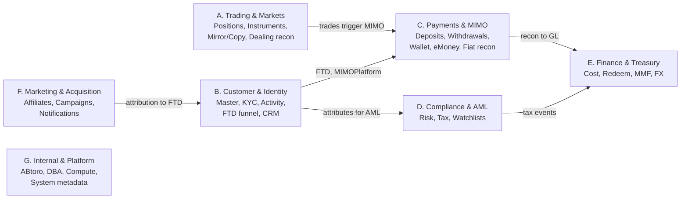
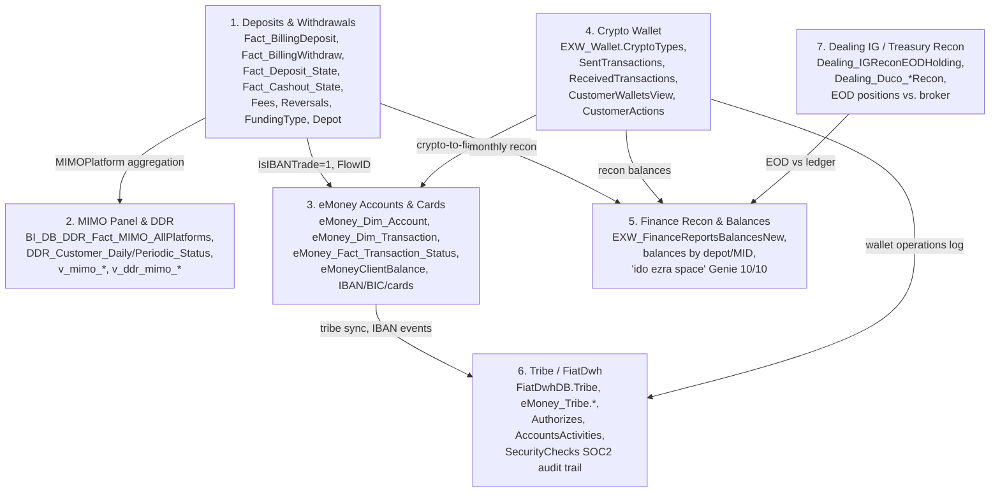
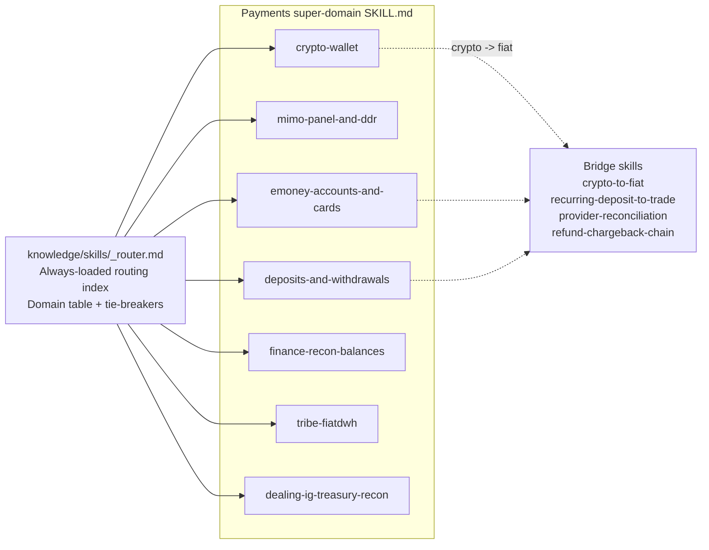

# Checkpoint A — Domain Candidate Map

> Generated from a fused join graph of:
> - **Wiki edges** (1142 wiki files, §3.3 Common JOINs + §5.1 Lineage + §6.1/6.2 Relationships) — 7,925 edges kept
> - **Genie spaces** (143 spaces, all-pairs cliques + explicit join_specs) — 2,384 edges
> - **etoro_kpi & etoro_kpi_prep view DDL** (95 views, FROM/JOIN parsed) — 415 edges
> - **Tableau custom SQL** (4 markdown files, custom queries) — 296 edges (weighted 0.5x)
>
> Final graph: **1,839 nodes**, **6,240 edges**. After pruning weight < 1.5: **1,465 nodes**, **5,870 edges**.
> Louvain partition: **62 clusters**, modularity **0.600**.

---

## 1. Bird's-eye view — 7 super-domains

The 62 raw Louvain clusters group naturally into 7 BU candidates by their hub
table, schema mix, and the Genie spaces / KPI views they own. Edge density
inside a BU is much higher than across; bridges (when needed) become explicit
intersection skills.

| # | BU | Anchor hubs | Cluster IDs | Total nodes | Genie spaces (notable) | KPI views |
|---|----|------------|-------------|-------------|------------------------|-----------|
| A | **Trading & Markets** | `Dim_Instrument`, `Dim_Position`, `BI_DB_PositionPnL`, `Dim_Mirror`, `Trade.PositionTbl`, `Dealing_*` | 0, 8, 14, 26, 27, 29, 31, 41, 44, 58 | ~360 | etoro_risk, PROD-etoro_trading_ai, ORACLE Weekly Volume, Liquidity Providers Research, Premier Customer Trading | 7 |
| B | **Customer & Identity** | `Dim_Customer`, `Customer.CustomerStatic`, `Fact_SnapshotCustomer`, `Fact_CustomerAction`, `BI_DB_CIDFirstDates`, `customer_snapshot_v`, `vg_crm_case` | 1, 2, 3, 6, 10, 12, 19, 36, 48 | ~580 | Data Detective, Buying Power, OPS - General Genie, Compliance Genie, Feed Analytics, FTD funnels, Customer Support Cases | 47 |
| C | **Payments & MIMO** | `Fact_BillingDeposit`, `Fact_BillingWithdraw`, `BI_DB_DDR_Fact_MIMO_AllPlatforms`, `EXW_Wallet.CryptoTypes`, `eMoney_Dim_Account`, `EXW_FinanceReportsBalancesNew`, `FiatDwhDB.Tribe`, `Dealing_IGReconEODHolding` | 7, 13, 17, 28, 45, 47, 49, 61 | **421** | UK BA space, ido ezra space (finance recon), New Space (1)/(2), eMoney Adoption & Trading | 18 |
| D | **Compliance & AML** | `BI_DB_Tax_Compliance_TIN`, `bi_compliance_cmp_aml_risk_classification_*`, `BI_DB_QMMF_Report`, `BI_DB_AML_*` | 21, 24, 35 (+ many tables nested in B1) | ~30 standalone | AML CMP, Test - AML CMP, AML Insights, Customer AML Compliance Data | 0 |
| E | **Finance & Treasury** | `finance_hubs_stg.*treasury*`, `Fact_History_Cost`, `Fact_BillingRedeem`, `History_CurrencyPrice` | 16, 20, 22, 30 | ~35 | Treasury Hub Q&A (FinanceCYTreasury), Subscription Revenue Insights | 0 |
| F | **Marketing & Acquisition** | `BI_DB_Adwords_Dictionary_AdGroup`, `BI_DB_Bing_PBI_*`, `Dim_Campaign`, urban notifications, SilverPop, AppsFlyer | 18, 23, 42, 46, 49, 60 | ~30 | Marketing Campaigns Performance, Notification Events Analytics, Live Acquisition Insights | 1 |
| G | **Internal & Platform** | `bi_compliance_stg`, `monitoring.app_genie_app_cost30d`, `github.cursor_usage`, `information_schema.columns`, ABtoro experiments | 32, 33, 37, 43, 45 | ~25 | Application Cost Tracking, AI Usage, Billing and Jobs, ABtoro Genie, examples on system | 0 |

**Notes**
- Compliance & AML mostly *embeds* inside the Customer super-domain
  (cluster 1, 152 members, dominated by AML and watchlist tables) — a separate
  D super-domain is meaningful only as a small surface area on top of B.
- A "**bridges**" layer sits across all super-domains for cross-product flows
  (crypto-to-fiat IBAN conversion, recurring-deposit-to-trade chains, payment
  provider reconciliation) — those are best served as **bridge skills** rather
  than anchor skills, but always rooted in two parent BUs.

---

## 2. Payments super-domain — proposed sub-skills

Payments is the user-chosen starting BU. It is large (421 nodes, 1,065 internal
edges) and naturally splits into 6-7 high-coherence sub-clusters that map well
to known business sub-domains.

### Sub-domain table (proposed for Payments skill split)

| # | Sub-domain | Cluster | Anchor hub | Size | Genie space | Top KPI views |
|---|-----------|---------|------------|------|-------------|---------------|
| C.1 | **Deposits & Withdrawals (trading platform)** | C7 | `Fact_BillingDeposit` / `Fact_BillingWithdraw` | 115 | (UK BA covers parts) | `v_mimo_*`, `v_ddr_mimo_*`, `v_mimo_first_deposit_all_platforms` |
| C.2 | **MIMO Panel & DDR** | C13 | `BI_DB_DDR_Fact_MIMO_AllPlatforms` | 74 | UK BA (19/30), New Space (1)/(2) | `v_mimo_emoneyplatform`, `v_mimo_optionsplatform`, DDR daily/periodic |
| C.3 | **eMoney Accounts & Cards (IBAN)** | C17 | `eMoney_Dim_Account` | 61 | eMoney Adoption & Trading | (none direct) |
| C.4 | **Crypto Wallet (EXW)** | C45 | `EXW_Wallet.CryptoTypes` | 97 | (no dedicated Genie) | (none direct) |
| C.5 | **Finance Recon & Balances** | C47 | `EXW_FinanceReportsBalancesNew` | 30 | **ido ezra space (10/10)** | `v_balances_*` (likely in cluster) |
| C.6 | **Tribe / FiatDwh (eMoney downstream)** | C49 | `FiatDwhDB.Tribe` | 20 | (none direct) | (none) |
| C.7 | **Dealing IG / Treasury EOD recon** | C28 | `Dealing_dbo.Dealing_IGReconEODHolding` | 24 | (none) | (none) |

**Observations driving the split**
- Cluster 7 is **monolithic** — deposits and withdrawals share so much (state
  tables, fee tables, reversals, depot dim, funding-type dim) that splitting
  them harms join-density. Keep as one skill.
- Cluster 13 (MIMO/DDR) is a **panel layer** — it sits above the raw billing
  facts and unifies all platforms (Trading + eMoney + Options + Crypto). It
  deserves its own skill because the analytical questions that go to it
  ("how much net MIMO last month?") never need the raw `Fact_Billing*` joins.
- Crypto Wallet (C45) is **structurally separate** from fiat. It owns its
  own transaction tables. Bridging to fiat happens only via C2F conversion
  events, which we'll capture as a bridge.
- Finance Recon (C47) has its own dedicated Genie space (`ido ezra space`,
  10/10 tables overlap) — that is the strongest possible signal for a real,
  daily-used domain.
- Tribe (C49) is small but has a coherent SOC2 audit-trail purpose; keep as
  its own skill rather than dilute into eMoney.
- Dealing IG / Duco (C28) is *recon between us and brokers* — distinct enough
  from EXW finance recon (which is internal balances) to warrant its own skill.

---

## 3. Bridges identified inside Payments

These are cross-cluster flows the user explicitly called out — each will
become a small **bridge skill** linked from both parent skills:

| Bridge | Connects | Hooked-on tables / columns |
|--------|----------|----------------------------|
| **Crypto-to-Fiat (C2F)** | C.4 Crypto Wallet ↔ C.3 eMoney | `EXW_dbo.EXW_C2F_E2E`, `EXW_Wallet.SentTransactions/ReceivedTransactions`, `eMoney_Fact_Transaction_Status` |
| **Recurring-deposit → Trade** | C.1 Deposits & Withdrawals ↔ A. Trading | `Fact_BillingDeposit.IsRecurring`, `Fact_Position` open after FTD, `BI_DB_DDR_Fact_MIMO_AllPlatforms.IsGlobalFTD` |
| **Provider reconciliation** | C.5 Finance Recon ↔ external (Worldpay/SafeCharge/etc.) | `MIDValue`, `MIDName`, `Depot`, `Fact_Deposit_State.ExTransactionID`, `Fact_BillingDeposit.ExternalTransactionID` |
| **Refund/Chargeback chain** | C.1 Deposits & Withdrawals ↔ Compliance/AML | `BI_DB_DepositWithdrawFee_Reversals.TransactionType IN (Chargeback, Refund, ...)`, `Fact_CustomerAction` edge-case fixes |

---

## 4. Methodology snapshot — what the AI will see in a skill

Each skill markdown will contain:
- **Front-matter**: `name`, `description`, `keywords`, `primary_objects`, `intersects_with`
- **When to use**: precise routing language for the AI
- **Mental model**: 4-8 sentences explaining the analytical mindset
- **Primary objects**: anchor tables/views with one-line descriptions
- **Canonical joins**: the 5-15 join patterns analysts use 90% of the time
- **KPI / pattern catalog**: ready-made SQL fragments by question type
- **Bridges to other domains**: explicit pointers, not duplication
- **Deep-read links**: links into the existing wiki for the long form

Token budget per skill: target ~3-5KB markdown when always-loaded, with
deep-read links to wikis for full context. Router stays under 2KB.

---

## 5. Inputs ready for next phase

| File | Purpose |
|------|---------|
| `knowledge/skills/_join_graph.json` | Canonical fused graph (1,839 nodes, 6,240 edges) |
| `knowledge/skills/_node_alias_map.json` | UC bronze/gold ↔ Synapse canonical name map (293 entries) |
| `knowledge/skills/_node_summary.csv` | Node-level weight + per-source degree |
| `knowledge/skills/_genie_spaces_index.json` | All 143 Genie spaces, tables canonicalized |
| `knowledge/skills/_kpi_views_index.json` | 95 KPI views with their referenced objects |
| `knowledge/skills/_domain_candidates.md` / `.json` | Full 62-cluster Louvain breakdown |
| `knowledge/skills/_payments_subgraph.md` | Payments super-domain detail |
| `knowledge/skills/_edges_*.csv` | Per-source raw edges (auditable trail) |

---

## 6. Decisions needed before Phase 2 (Payments skills)

1. **Sub-domain partition for Payments** — confirm or amend the 7-way split
   above. The most plausible alternatives:
   - Merge C.6 Tribe into C.3 eMoney (only 20 tables) — splits less, sacrifices
     SOC2-audit-specificity.
   - Split C.1 Deposits & Withdrawals further into "fiat deposits" vs "fiat
     withdrawals" — IMO not worth it, joins are too entangled.
   - Treat C.7 Dealing IG recon as part of BU "Trading" instead of Payments —
     defensible, since the recon partner is brokers, not payment providers.

2. **Bridge skills as separate files vs. inlined** — recommendation: separate
   files at `knowledge/skills/bridges/` so the AI can route to a bridge
   without loading both parent skills. User to confirm.

3. **Skill location** — recommendation: `knowledge/skills/domain-payments/<name>.md`
   for sub-skills, with `knowledge/skills/_router.md` as the always-loaded
   entry point. User to confirm.

4. **Deep-read link strategy** — recommendation: each skill's Primary
   Objects section links to the existing wiki at
   `knowledge/synapse/Wiki/<schema>/Tables/<obj>.md`. The wikis already have
   the 9-section golden structure; we don't re-author content, we just route.

---

_Generated: 2026-04-30 by tools/skills/{extract_*,merge_graph,cluster_domains,summarize_payments_subgraph}.py_
