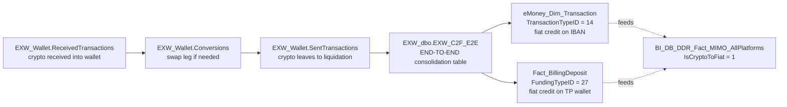

# Bridge — Crypto-to-Fiat (C2F) End-to-End

The C2F flow is eToro's customer off-ramp: a crypto holding is converted
to fiat and credited to the customer's eMoney IBAN (or trading-platform
USD wallet). This bridge stitches the four data sources that each see one
piece of the story.

## The chain



## Anchor: `EXW_dbo.EXW_C2F_E2E`

This is the **already-stitched** end-to-end view. Each row represents a
complete C2F event with all stages joined. **If your question is about C2F
volume, count, customer pattern, or simple drill — use this table directly,
don't reconstruct the chain.**

You only need to walk the chain manually if:
- You're investigating a SPECIFIC failed/partial C2F that isn't fully in
  `EXW_C2F_E2E` yet (latency / data-quality issue).
- You need a stage-specific detail (e.g. blockchain hash of the underlying
  crypto receive, or per-leg pricing of the conversion).

## Side markers — used to count C2F WITHOUT walking the chain

| Source | Marker | Meaning |
|--------|--------|---------|
| `eMoney_Dim_Transaction` | `TransactionTypeID = 14` | This eMoney IBAN credit was a C2F off-ramp result. (Authoritative on eMoney side.) |
| `Fact_BillingDeposit` | `FundingTypeID = 27` | This TP fiat deposit was a C2F off-ramp. (Authoritative on TP side, post `2025-07-01` fully tagged.) |
| `BI_DB_DDR_Fact_MIMO_AllPlatforms` | `IsCryptoToFiat = 1` | Cross-platform MIMO marker. **Dual-source** (sub-platform + post-insert UPDATE for `FundingTypeID=27` on TP). |

The MIMO marker is the easiest way to answer "how much C2F volume across
the whole business" — it's a single column on a single fact.

## Canonical patterns

```sql
-- 1. C2F volume across all platforms in a period (USE MIMO marker — fastest)
SELECT DateID, MIMOPlatform, SUM(AmountUSD) AS C2F_USD, COUNT(*) AS Tx
FROM BI_DB_dbo.BI_DB_DDR_Fact_MIMO_AllPlatforms
WHERE IsCryptoToFiat = 1
  AND MIMOAction = 'Deposit'
  AND DateID BETWEEN @from AND @to
GROUP BY DateID, MIMOPlatform
ORDER BY DateID, MIMOPlatform
```

```sql
-- 2. End-to-end C2F drill for a specific customer (USE the E2E table)
SELECT *
FROM EXW_dbo.EXW_C2F_E2E
WHERE GCID = @gcid
  AND C2F_DateID BETWEEN @from AND @to
ORDER BY C2F_DateID
```

```sql
-- 3. Manual chain walk (only when E2E is incomplete)
WITH crypto_in AS (
  SELECT *
  FROM EXW_Wallet.ReceivedTransactions r
  JOIN EXW_Wallet.CustomerWalletsView cw ON cw.Id = r.WalletId
  WHERE cw.Gcid = @gcid
    AND r.CreatedDate BETWEEN @from AND @to
), conversions AS (
  SELECT *
  FROM EXW_Wallet.Conversions c
  WHERE c.SendingGCID = @gcid
    AND c.CreatedDate BETWEEN @from AND @to
), iban_credit AS (
  SELECT *
  FROM eMoney_dbo.eMoney_Dim_Transaction dt
  JOIN eMoney_dbo.eMoney_Dim_Account da
       ON da.CID = dt.CID
      AND da.GCID_Unique_Count = 1
  WHERE da.GCID = @gcid
    AND dt.TransactionTypeID = 14
    AND dt.TxDateID BETWEEN @from AND @to
), tp_credit AS (
  SELECT *
  FROM DWH_dbo.Fact_BillingDeposit fbd
  JOIN DWH_dbo.Dim_Customer dc ON dc.RealCID = fbd.CID
  WHERE dc.GCID = @gcid
    AND fbd.FundingTypeID = 27
    AND fbd.PaymentStatusID = 2
    AND fbd.ModificationDateID BETWEEN @from AND @to
)
SELECT 'crypto_in' AS stage, * FROM crypto_in
UNION ALL SELECT 'conversion', * FROM conversions
UNION ALL SELECT 'iban_credit', * FROM iban_credit
UNION ALL SELECT 'tp_credit', * FROM tp_credit
```

## Gotchas

1. **`FundingTypeID = 27` post-insert UPDATE only runs `DateID >= 20250701`.** Pre-July-2025 TP-side C2F may be under-tagged. Use `EXW_dbo.EXW_C2F_E2E` (which doesn't depend on this tag) for historical accuracy.
2. **eMoney-side (`TransactionTypeID = 14`) is reliable from inception.**
3. **`IsCryptoToFiat` on MIMO is dual-source** — set by sub-platform tag OR by the FundingTypeID=27 update. If you ever see a MIMO row with IsCryptoToFiat=1 but no matching E2E row, check both source paths.
4. **GCID is the customer link across the chain.** `EXW_Wallet.CustomerWalletsView.Gcid`, `eMoney_Dim_Account.GCID`, `Dim_Customer.GCID`. CID = RealCID is the trading-side ID.
5. **C2F revenue is in Revenue & Fees**, not here. `etoro_kpi_prep.v_revenue_cryptotofiat_c2f` for the per-customer fee revenue cut.
6. **C2F can fail mid-chain.** A crypto receive that doesn't complete to IBAN credit will show in `ReceivedTransactions` but not in `EXW_C2F_E2E`. Use `EXW_Wallet.SentTransactionStatuses` and `eMoney_Fact_Transaction_Status` for forensic follow-up.
7. **The reverse (on-ramp: IBAN → crypto purchase)** is a different flow; it goes through `eMoney_Dim_Transaction` (debit) → wallet credit. Not covered by `EXW_C2F_E2E` (which is off-ramp specifically). For on-ramp use the equivalent eMoney TransactionType + crypto receive walk.

## When to load just one parent instead

- "How much C2F volume in Q1?" → MIMO marker alone (C.2 is enough).
- "Show me crypto holdings of customer X" → C.4 alone.
- "Show me eMoney transactions of customer X" → C.3 alone.
- "Trace the full off-ramp chain for customer X over Q1" → load this bridge.
