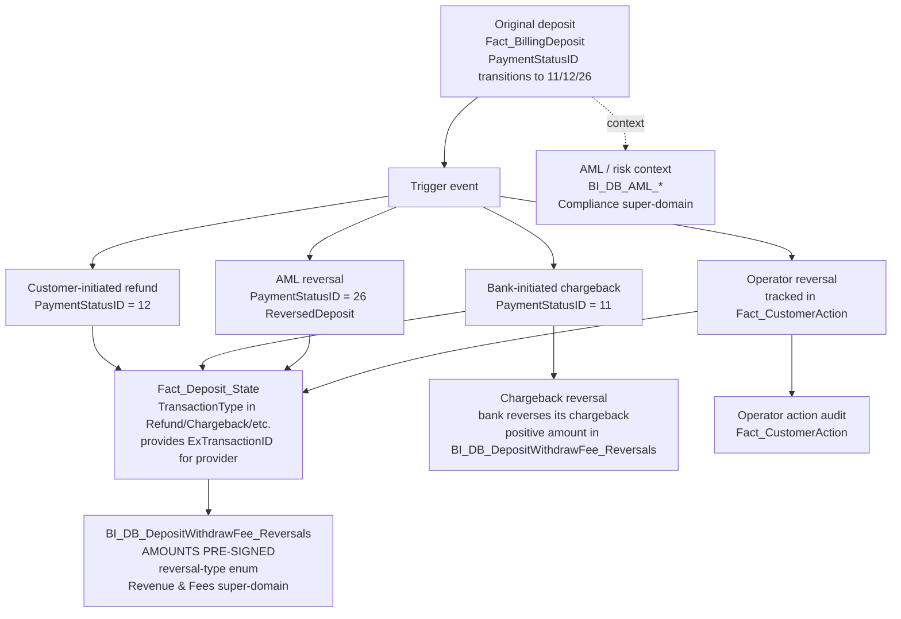

# Cross-domain skill — Refund / Chargeback Chain

A dispute event in fiat payments has many actors:
1. The original deposit (or withdrawal).
2. The dispute trigger (customer-initiated refund vs bank-initiated
   chargeback vs ops-initiated reversal vs AML-flag-triggered reversal).
3. The reversal record (with sign-corrected amounts) in BI_DB_layer.
4. Optional follow-on (chargeback reversal — the bank reverses ITS
   chargeback because we won the case).
5. The AML/risk context (was this customer flagged before/after?).

This cross-domain skill stitches the chain so a single dispute can be fully audited.

> **Mixed UC / Synapse coverage.** The aggregate reversal table
> (`BI_DB_DepositWithdrawFee_Reversals`) and the customer-action audit
> (`Fact_CustomerAction`) are in UC. The State-table provenance
> (`Fact_Deposit_State`, `Fact_Cashout_Rollback`) is `_Not_Migrated` —
> only available in Synapse. On Databricks Genie you can do the
> reversal-aggregate analysis; for the full forensic chain (which State
> row triggered which reversal) drop down to Synapse via the synapse_*
> MCP servers.

## The chain



## Anchor table: `BI_DB_dbo.BI_DB_DepositWithdrawFee_Reversals`

The reversal/dispute facts table. Every refund, chargeback, and
chargeback-reversal lands here. **Key properties:**

- **`Amount` and `AmountUSD` are PRE-SIGNED.** Refunds & chargebacks
  negative; chargeback-reversals positive. Don't multiply by `-1`.
- **`TransactionType`** has the reversal-type enum. Includes the known
  production typo `'Partialy Reversed'` (yes, "Partialy"). Don't fix it
  in queries.
- **`CreditTypeID`, `MOPCountry`, `IsGermanBaFin`** are ALWAYS NULL here
  (per SR-313302 / SR-359957). Don't filter on them.
- Owned by **Revenue & Fees super-domain** for aggregate questions, but
  used by THIS cross-domain skill for chain-walking.

## Canonical patterns

```sql
-- 1. Full chain for ONE specific dispute (start from a chargeback row)
WITH dispute AS (
  SELECT *
  FROM BI_DB_dbo.BI_DB_DepositWithdrawFee_Reversals
  WHERE DepositID = @disputed_deposit_id
)
SELECT
  'original_deposit' AS stage,
  fbd.DepositID, fbd.CID, fbd.PaymentStatusID, ps.Status,
  fbd.Amount, fbd.AmountUSD, fbd.ExchangeRate, fbd.ModificationDate,
  NULL AS reversal_type, NULL AS reversal_amount_usd, NULL AS reversal_date
FROM dispute d
JOIN DWH_dbo.Fact_BillingDeposit fbd ON fbd.DepositID = d.DepositID
JOIN DWH_dbo.Dim_PaymentStatus ps ON ps.PaymentStatusID = fbd.PaymentStatusID

UNION ALL

SELECT
  'reversal_event',
  d.DepositID, d.CID, NULL, d.TransactionType,
  d.Amount, d.AmountUSD, NULL, NULL,
  d.TransactionType, d.AmountUSD, d.Occurred
FROM dispute d
ORDER BY 1, 8 NULLS FIRST
```

```sql
-- 2. AML-flagged customers with refunds in the same period (overlay with Compliance)
SELECT rev.CID, rev.DepositID, rev.TransactionType, rev.AmountUSD, rev.Occurred,
       /* placeholder — real query joins to Compliance AML dim */
       'see Compliance super-domain' AS aml_context
FROM BI_DB_dbo.BI_DB_DepositWithdrawFee_Reversals rev
WHERE rev.TransactionType IN ('Refund', 'AMLRefund')  -- enum subset
  AND rev.Occurred BETWEEN @from AND @to
  AND rev.CID IN (
    SELECT CID FROM /* compliance.aml_flagged_customers */ ANY_AML_TABLE
    WHERE FlagDate BETWEEN @from AND @to
  )
```

```sql
-- 3. Operator-initiated reversals (the audit answer to "who refunded this customer")
SELECT rev.DepositID, rev.CID, rev.TransactionType, rev.AmountUSD,
       fca.ActionDate, fca.OperatorID, fca.Comment
FROM BI_DB_dbo.BI_DB_DepositWithdrawFee_Reversals rev
JOIN DWH_dbo.Fact_CustomerAction fca
       ON fca.CID = rev.CID
      AND fca.ActionTypeID IN (/* operator-refund codes */)
      AND ABS(DATEDIFF(MINUTE, fca.ActionDate, rev.Occurred)) <= 60
WHERE rev.DepositID = @disputed_deposit_id
```

```sql
-- 4. Chargeback success (we lost) vs chargeback recovery (we won)
SELECT rev.DepositID, rev.CID,
       MAX(CASE WHEN rev.TransactionType = 'Chargeback' THEN rev.AmountUSD END) AS chargeback_amt,
       MAX(CASE WHEN rev.TransactionType = 'ChargebackReversal' THEN rev.AmountUSD END) AS recovery_amt,
       CASE
         WHEN MAX(CASE WHEN rev.TransactionType = 'ChargebackReversal' THEN 1 END) = 1
              THEN 'Recovered'
         ELSE 'Lost'
       END AS outcome
FROM BI_DB_dbo.BI_DB_DepositWithdrawFee_Reversals rev
WHERE rev.Occurred BETWEEN @from AND @to
GROUP BY rev.DepositID, rev.CID
```

## PaymentStatus IDs of interest

| ID | Status | Trigger |
|----|--------|---------|
| 2  | Approved | Original successful deposit |
| 11 | Chargeback | Bank-initiated dispute |
| 12 | Refund | Customer or ops-initiated refund |
| 26 | ReversedDeposit | AML-driven reversal |
| 35 | DeclineByRRE | Risk engine decline (NOT a dispute — pre-auth decline) |
| 37-39 | Cancelled-reversals | The reversal itself was cancelled |

(See `Fact_BillingDeposit` wiki §5 for the complete enum.)

## Reversal type enum (subset, from BI_DB_DepositWithdrawFee_Reversals)

- `Refund`
- `Chargeback`
- `ChargebackReversal`
- `Reversed`
- `'Partialy Reversed'` (production typo — keep as-is)
- `CashoutRollback`
- `CancelledCashoutRollback`
- `CancelledChargebackReversal`

(Sign-correction logic for the last three uses `Fact_CustomerAction` lookups
in the source SP — trust the table's signed value, don't re-derive.)

## Gotchas

1. **Reversal `Amount` is PRE-SIGNED.** Don't `* -1`. Don't `ABS()` unless you specifically want absolute value.
2. **One deposit can have MULTIPLE reversal rows** (refund + later chargeback-reversal, partial reversal followed by full, etc.). Group by `DepositID` and inspect the timeline.
3. **`Fact_Deposit_State` carries non-Deposit `TransactionType` rows** for reversals — those are useful for the provider-side `ExTransactionID` of the reversal event itself (separate from the original deposit's `ExTransactionID`).
4. **AML reversals** (`PaymentStatusID = 26`) typically have a corresponding row in Compliance's AML alert tables. The two should be cross-referenced for any "we refunded due to AML — was the alert valid" audit.
5. **Operator audit trail** lives in `Fact_CustomerAction` — but that's owned by the planned **Operations super-domain**, not Compliance. If a refund was operator-initiated, look there.
6. **Chargeback ≠ Refund.** Chargeback is bank-initiated (we may dispute it back). Refund is internal-initiated (customer asked, or ops gave). Different commercial implications, different processes.
7. **Partial reversals** complicate aggregation. Sum across all reversal rows for one `DepositID`, then compare to the original `AmountUSD`, to know if the deposit was fully or partially reversed.
8. **For aggregate volume / rate questions** (chargeback rate, refund rate, recovery rate over time), GO TO Revenue & Fees super-domain. This cross-domain skill is for SINGLE-CASE forensics.

## When to load just one parent instead

- "Total refund volume this month" → Revenue & Fees super-domain alone.
- "Was deposit X approved" → C.1 alone (`Fact_BillingDeposit.PaymentStatusID`).
- "Show me the AML alerts for this customer" → Compliance super-domain alone.
- "Walk me through what happened to deposit X — refund? chargeback? when? who?" → load this cross-domain skill.
