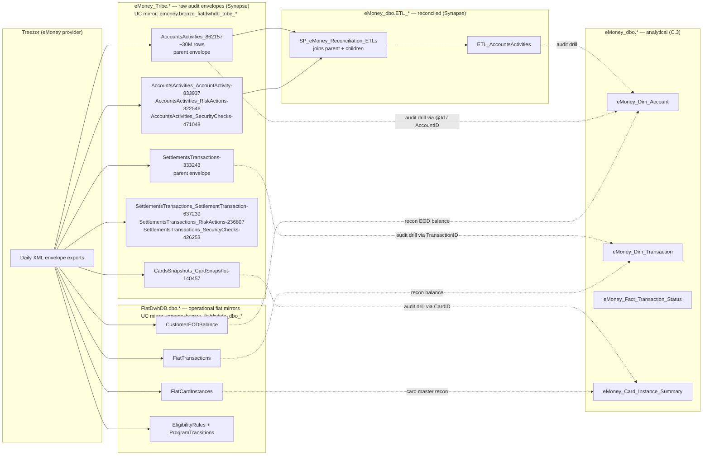

# Cross-domain skill — Tribe / FiatDwh ↔ eMoney audit trail

eToro's eMoney (IBAN + debit card) platform is operated jointly with **Treezor**
as the regulated e-money issuer. Treezor exports daily **XML audit envelopes**
of every operator/system action on every account, card, and settlement. Those
envelopes land in the Synapse **`eMoney_Tribe.*`** schema (and the Databricks
mirror **`emoney.bronze_fiatdwhdb_tribe_*`**). A reconciliation SP
(`SP_eMoney_Reconciliation_ETLs`) joins parent envelopes with their child
detail tables to produce flattened **`eMoney_dbo.ETL_*`** tables Compliance
can query.

**This cross-domain skill does NOT own audit-trail interpretation logic** — Compliance
does, when that super-domain is built. What this cross-domain skill owns:

> **Genie / SQL note:** the Tribe envelope tables exist in BOTH halves
> (Synapse `eMoney_Tribe.*` and UC bronze `main.emoney.bronze_fiatdwhdb_tribe_*`).
> Use the UC names for Genie. Note that several tables have **dashes** in
> their object name (e.g. `bronze_fiatdwhdb_tribe_settlementstransactions-333243`)
> and require **backtick quoting** in Spark SQL:
> `` SELECT * FROM main.emoney.`bronze_fiatdwhdb_tribe_settlementstransactions-333243` ``.
> The orchestrating SP `SP_eMoney_Reconciliation_ETLs` runs in Synapse only —
> it's not a queryable object; it produces `ETL_AccountsActivities` which is.

1. The **map** between eMoney business objects (Account, Card, Transaction)
   and the Tribe envelope tables that hold the audit log for them.
2. The **join keys** that make a Tribe row meaningful — `GCID`, `AccountID`,
   `CardID`, `TransactionID`, `@Id` (XML doc UUID).
3. The **don't-go-there warnings** — querying raw `eMoney_Tribe.*` tables
   without going through the ETL_* recon layer is almost always wrong.

## When to load this cross-domain skill

- "Who authorized transaction X?" / "Show me the audit trail for account Y."
- "I see an eMoney transaction in `eMoney_Dim_Transaction` that has no
  matching Tribe envelope — is it valid?"
- "Reconcile our eMoney amounts against Treezor's statements for date D."
- "Trace card C through its full lifecycle — created, activated, blocked,
  re-issued, expired."
- Operator-action SOC2 audits referencing risk-engine flags, security checks,
  or settlement disputes.

If the question is purely about **eMoney transaction VOLUMES** (no audit
intent), stay in C.3 (`emoney-accounts-and-cards.md`). Don't load this cross-domain skill.

## Mental model



## The two halves of "Tribe / FiatDwh"

`Tribe` and `FiatDwh` get conflated in conversation. They are two separate
ingest paths off the same Treezor partnership:

| Half | Synapse | UC | Role |
|------|---------|----|----|
| **Tribe** (audit envelopes) | `eMoney_Tribe.*` | `emoney.bronze_fiatdwhdb_tribe_*` | Raw XML audit log of every operator/system action — security checks, risk actions, account snapshots, settlement disputes. **Treat as forensic input only**, not as analytical fact. |
| **FiatDwhDB** (operational mirrors) | `FiatDwhDB.dbo.*` (cross-DB reference from Synapse) | `emoney.bronze_fiatdwhdb_dbo_*` (and a few in `bi_db.bronze_fiatdwhdb_dbo_*`) | Treezor's operational fiat tables — `FiatTransactions`, `FiatCardInstances`, `CustomerEODBalance`, eligibility rules, program transitions. **The provider-side source of truth** for reconciliation. |

A Compliance audit usually needs **both halves**: the FiatDwhDB tells you
what Treezor's books say, the Tribe XML tells you why and who.

## Anchor patterns

### Pattern 1 — Find the audit trail for an eMoney account

Start from `eMoney_Dim_Account` to get the join keys, then traverse Tribe
**through `ETL_AccountsActivities`** (the recon table), not the raw
`eMoney_Tribe.AccountsActivities_*` envelopes.

```sql
-- Get the keys
SELECT a.CID, a.GCID, a.AccountID, a.RegulationID
FROM eMoney_dbo.eMoney_Dim_Account a
WHERE a.CID = @cid AND a.IsValidETM = 1
```

```sql
-- Hit the recon ETL — already joined parent + children
SELECT etl.*
FROM eMoney_dbo.ETL_AccountsActivities etl
WHERE etl.AccountID = @AccountID
  AND etl.ActivityDate BETWEEN @from AND @to
ORDER BY etl.ActivityDate
```

### Pattern 2 — Reconcile internal eMoney transactions vs Treezor's books

Internal: `eMoney_dbo.eMoney_Dim_Transaction`. Treezor's: the FiatDwh
mirror `FiatDwhDB.dbo.FiatTransactions` (UC:
`emoney.bronze_fiatdwhdb_dbo_fiattransactions`). Reconcile by
`TransactionID` (TransactionID is preserved end-to-end).

```sql
-- Synapse-side reconciliation
SELECT
    edt.TransactionID,
    edt.Amount       AS internal_amount,
    edt.Currency     AS internal_currency,
    ft.Amount        AS provider_amount,
    ft.Currency      AS provider_currency,
    edt.Amount - ft.Amount AS variance
FROM eMoney_dbo.eMoney_Dim_Transaction       edt
LEFT JOIN FiatDwhDB.dbo.FiatTransactions     ft  ON ft.TransactionID = edt.TransactionID
WHERE edt.SettlementDateID BETWEEN @from AND @to
  AND ABS(edt.Amount - COALESCE(ft.Amount, 0)) > 0.01
```

```sql
-- UC equivalent
SELECT
    edt.TransactionID,
    edt.Amount       AS internal_amount,
    ft.Amount        AS provider_amount
FROM emoney.gold_sql_dp_prod_we_emoney_dbo_emoney_dim_transaction  edt
LEFT JOIN emoney.bronze_fiatdwhdb_dbo_fiattransactions             ft
       ON ft.transactionid = edt.transactionid
WHERE edt.settlementdateid BETWEEN @from AND @to
  AND ABS(edt.amount - COALESCE(ft.amount, 0)) > 0.01
```

### Pattern 3 — Card lifecycle audit

`eMoney_Card_Instance_Summary` for the card-instance master, `FiatCardInstances`
+ `CardsSnapshots_CardSnapshot-140457` for the lifecycle events.

```sql
-- Card lifecycle
WITH card_keys AS (
    SELECT CID, GCID, CardID, MaskedPAN, CardCreateDate
    FROM eMoney_dbo.eMoney_Card_Instance_Summary
    WHERE CID = @cid
)
SELECT k.MaskedPAN, snap.SnapshotDate, snap.CardStatus, snap.RiskFlag
FROM card_keys k
JOIN eMoney_Tribe.CardsSnapshots_CardSnapshot_140457 snap
  ON snap.CardID = k.CardID
ORDER BY snap.SnapshotDate
```

(For card spending behavior — not lifecycle — stay in C.3.)

### Pattern 4 — EOD balance reconciliation

Treezor sends an EOD balance per account per day. Reconcile against our
`eMoneyClientBalance`.

```sql
SELECT
    cb.CID,
    cb.AccountID,
    cb.BalanceDate,
    cb.Balance       AS internal_balance,
    teod.Balance     AS treezor_eod_balance,
    cb.Balance - teod.Balance AS variance
FROM eMoney_dbo.eMoneyClientBalance         cb
LEFT JOIN FiatDwhDB.dbo.CustomerEODBalance  teod
       ON teod.AccountID = cb.AccountID
      AND teod.BalanceDate = cb.BalanceDate
WHERE cb.BalanceDate = @date
  AND ABS(cb.Balance - COALESCE(teod.Balance, 0)) > 0.01
```

## Gotchas

1. **Don't query raw `eMoney_Tribe.*-NNNNNN` envelope tables directly for
   business questions.** They're XML envelopes; columns are mostly XML
   passthroughs (`@Id`, `@Created`, `@FileName`). The `-NNNNNN` suffix is
   a generic-pipeline build-artifact, not a version. Use `eMoney_dbo.ETL_*`
   recon outputs, or join through `eMoney_Dim_Account` / `eMoney_Dim_Transaction`.
2. **Parent envelope ↔ child detail relationship is by `@Id`** (the XML
   document UUID). E.g. `AccountsActivities_862157.@Id` = parent doc id;
   `AccountsActivities_AccountActivity-833937.@Id` = child rows referencing
   the same parent. The recon SP does this join for you.
3. **`SP_eMoney_Reconciliation_ETLs` is the orchestrator** — every `eMoney_dbo.ETL_*`
   table is its output. If a recon table looks stale, check the SP run; don't
   try to roll your own from raw envelopes.
4. **Treezor only — no other e-money provider.** The Tribe / FiatDwhDB layer
   is **specific to Treezor**. Other regulated entities (e.g. for non-EU IBAN
   wires) have their own provider feeds — `eMoney_BankPaymentsUK` for UK
   OpenBanking, etc. Don't assume a single audit log per IBAN transaction.
5. **PII rules apply harder here than in C.3.** Tribe envelopes contain raw
   names, addresses, PAN snippets, IBAN strings, IDV documents. Always prefer
   the masked-view counterparts (`v_eMoney_Card_Instance_Summary` excludes
   `MaskedPAN`; equivalent masking applies on Tribe queries).
6. **`bronze_fiatdwhdb_tribe_*` UC tables have very low column-comment
   coverage** (~0% in the heatmap). Lean on the Synapse wikis under
   `knowledge/synapse/Wiki/eMoney_Tribe/Tables/*.md` for column meaning.
7. **Compliance owns the interpretation, not Payments.** This skill provides
   the join keys and the "which table" map. The "what does RiskActionType=7
   actually mean for SOC2" lookup belongs in the Compliance super-domain
   when that's built.
8. **Settlement transactions ≠ regular eMoney transactions.** `SettlementsTransactions-*`
   in Tribe is the provider-to-provider settlement layer (Treezor ↔ Mastercard /
   SEPA / Faster Payments). It's NOT the same as `eMoney_Dim_Transaction` — that's
   the customer-facing transaction. They reconcile but at different grain.

## When to load just one parent instead

| If the question only needs… | Load instead |
|---|---|
| eMoney customer transaction volumes / FX spread / IBAN inflows | C.3 (`emoney-accounts-and-cards.md`) |
| Compliance KYC / risk-rule logic / regulator-facing reports | Compliance super-domain (when built) |
| Crypto came in → converted to fiat on IBAN forensics | `cross/crypto-to-fiat.md` |
| Provider statement reconciliation for fiat deposits/withdrawals (not eMoney) | `cross/provider-reconciliation.md` |
| Refund / chargeback chain on a customer dispute | `cross/refund-chargeback-chain.md` |

## Cluster provenance

- Tribe envelope tables sit in their own Synapse schema (`eMoney_Tribe`,
  ~30+ tables, all named `<Subject>_<Detail>-NNNNNN`) — they form a quiet
  forest in the join graph (sparse joins to anything outside Tribe).
- The recon ETL tables (`eMoney_dbo.ETL_*`) live inside Cluster 17 (eMoney) —
  the SP joins them in.
- The FiatDwhDB mirrors live across `bi_db.bronze_fiatdwhdb_*` and
  `emoney.bronze_fiatdwhdb_*` in UC; their join graph weight is mostly to
  `eMoney_Dim_Transaction` and `eMoney_Dim_Account`.

## Deep reads

- [`eMoney_Tribe/Tables/AccountsActivities_862157.md`](https://github.com/guyman-tr/Databricks_Knowledge/blob/master/knowledge/synapse/Wiki/eMoney_Tribe/Tables/AccountsActivities_862157.md)
- [`eMoney_Tribe/Tables/SettlementsTransactions-333243.md`](https://github.com/guyman-tr/Databricks_Knowledge/blob/master/knowledge/synapse/Wiki/eMoney_Tribe/Tables/SettlementsTransactions-333243.md)
- [`eMoney_Tribe/Tables/CardsSnapshots_CardSnapshot-140457.md`](https://github.com/guyman-tr/Databricks_Knowledge/blob/master/knowledge/synapse/Wiki/eMoney_Tribe/Tables/CardsSnapshots_CardSnapshot-140457.md)
- [`eMoney_dbo` / `_FOLLOWUPS.md`](https://github.com/guyman-tr/Databricks_Knowledge/blob/master/knowledge/synapse/Wiki/_FOLLOWUPS.md) — open
  questions on the bronze_fiatdwhdb_tribe_* coverage gap.
- [Parent skill — payments/emoney-accounts-and-cards.md](../payments/emoney-accounts-and-cards.md) — supplies the GCID / AccountID / CardID join keys.
