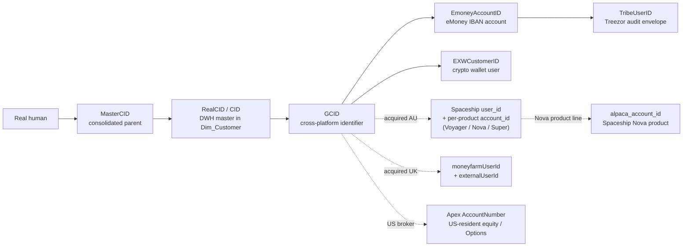

# Customer & Identity Super-Domain

eToro's customer model is **not** a single ID. A real human can have one row in `Dim_Customer` (DWH master) but be referenced by **at least five core identifiers** depending on which platform answered: `RealCID` (DWH/trading platform), `GCID` (Global Customer ID, cross-platform), `MasterCID` (consolidated parent across linked accounts), `EmoneyAccountID` (eMoney/Treezor IBAN), and `EXWCustomerID` (crypto wallet). **Plus** acquired-platform user IDs that the GCID bridges out to: Spaceship `user_id` (AU — Voyager/Nova/Super product lines, with per-product `account_id` and a `etoro_user_id` cross-reference column), MoneyFarm `moneyfarmUserId` + `externalUserId` (UK), Apex `AccountNumber` (US-resident equity / Options), and the Alpaca `alpaca_account_id` (Spaceship Nova product, since Nova clears on Alpaca). Routing the question to the right key — and to the right master view, segment view, funnel view, or audit-trail fact — is the difference between a clean answer and a six-table mistake that double-counts.

This super-domain is about **WHO the customer is** — the master record, the identifiers, the long-lived attributes (jurisdiction, regulation, club tier, PI status, channel, country, marketing segments), the customer-property models (LTV, daily cluster, segments), the CRM case history, and the cross-platform identity joins. It is **not** about:

- **Money flow into / out of a customer's wallet** → Payments super-domain (`payments/SKILL.md`). Customer balances, deposits, withdrawals, MIMO panel.
- **Trading positions, P&L, instrument exposure** → Trading & Markets super-domain (planned).
- **AML risk classification, sanctions, PEP, watchlist alerts on a customer** → Compliance & AML super-domain (planned).
- **Fee revenue or fee composition on a customer** → Revenue & Fees super-domain (`revenue-and-fees/SKILL.md`).

When a question is about **what the customer DID** (deposited, traded), route to the relevant doing-domain (Payments / Trading). When a question is about **who the customer IS** (their identifiers, jurisdiction, attributes, master record, segments, lifecycle status, onboarding funnel position, support history), it stays here.

## Routing waypoint — read this first

Two referenced workspace skills are part of this super-domain. **Prefer them over local sub-skills when their slice matches**:

- **For population counts and lifecycle questions** ("how many funded customers?", "how many active traders today?", "FTF cohort size") → load DE workspace skill **`customer-populations`** at `/Workspace/.assistant/skills/customer-populations/SKILL.md`. Authoritative for Funded / Active Trader / Portfolio Only / Balance Only segments and the SCD-based fast-population pattern.
- **For the onboarding funnel** (Registration → KYC → V1/V2/V3 → Deposit Wizard → FTD → First Action, VBD/VBT cohort comparison) → load DE workspace skill **`registration-to-ftd-funnel`** at `/Workspace/.assistant/skills/registration-to-ftd-funnel/SKILL.md`. Authoritative for `main.etoro_kpi.ftd_funnel_v` and any cohort-based reg-to-FTD question. **Go-to skill before `Dim_Customer` / `Fact_CustomerAction` for any column it owns.**

Local sub-skills (this folder) own everything else: master record, identity joins, jurisdiction, SCD walks, customer-action audit trail, customer-property models, CRM cases, OLTP forensics.

## When to Use

Load when the question concerns the customer master record, the identity model, long-lived attributes, customer-property models, or customer support history:

- "What's the canonical record for customer X?", "show me the master row for RealCID 12345"
- "How does RealCID relate to GCID / MasterCID / EmoneyAccountID / EXWCustomerID?"
- "How do I join customer in DWH to their eMoney account / their EXW wallet / their Tribe audit row?"
- "What jurisdiction / regulation is customer X under?", "which CySEC customers are…"
- "Is customer X a Popular Investor / club tier Diamond / VIP?"
- "What's customer X's registration channel / country / marketing region?"
- Point-in-time questions about long-lived attributes ("what was customer X's regulation on 2025-06-01?")
- Customer-action audit trail ("what did the operator do on this customer's account?")
- Customer-property models ("what's customer X's LTV bucket / daily cluster / segment?")
- CRM case / CSAT / churn-winback questions
- Population / lifecycle / onboarding-funnel questions (delegate to referenced workspace skill — see Routing waypoint)

Do **not** load for:

- Money movement (deposits, withdrawals, MIMO, balances) → Payments super-domain
- Fee revenue → Revenue & Fees super-domain
- Trading activity (positions, P&L, copy trading) → Trading super-domain (planned)
- AML/KYC risk classification → Compliance super-domain (planned)

## Scope

In scope: customer master record (`Dim_Customer`, `Customer.CustomerStatic`, `BackOffice.Customer`), customer SCD slices (`Fact_SnapshotCustomer`, `customer_snapshot_v`, `vg_customer_daily_snapshot`), milestone first-dates (`BI_DB_CIDFirstDates`, `cidfirstdates_v`, `vg_customer_customer_first_dates`), the identity model (`RealCID`, `GCID`, `MasterCID`, `EmoneyAccountID`, `EXWCustomerID`), long-lived attributes (jurisdiction, regulation, club tier, Popular Investor flag, channel, country, marketing segments), customer-action audit trail (`Fact_CustomerAction`), customer-property models (`BI_DB_LTV_BI_Actual`, `BI_DB_CID_DailyCluster`, `BI_DB_CID_DailyPanel_FullData`, `BI_DB_CID_MonthlyPanel_FullData`, `customer_segments_v`, `customer_segments_mail_v`, `etoro_club` views), CRM cases / CSAT / churn-winback (`vg_crm_case`, `crm_csat_survey_per_case_v`, `crm_quality_assessment_per_case_v`, `crm_user_v`, `churn_winback_summary`, `churn_winback_recent_targets`), cross-platform identity resolution joins. Population segments and the onboarding funnel are owned by referenced DE workspace skills (`customer-populations`, `registration-to-ftd-funnel`) — load those for their slice rather than answering from this hub.
Out of scope: money movement (Payments super-domain), fee revenue (Revenue & Fees super-domain), trading positions / P&L (Trading super-domain when built), AML risk classification / sanctions / PEP (Compliance super-domain when built)
Last verified: 2026-05-10

## Critical Warnings

1. **Tier 1 — `RealCID` and `GCID` are not interchangeable for cross-platform joins.** Joining DWH facts to eMoney facts on `RealCID = AccountID` will silently miss every customer whose eMoney account was provisioned before the GCID unification project, and will silently double-count customers with multiple linked accounts. Always join via `Dim_Customer.GCID` to `eMoney_Dim_Account.GCID` (the platform-neutral identifier) unless you've explicitly confirmed the table you're joining keys on `RealCID`. Production OLTP `Customer.CustomerStatic` keys on `RealCID` directly; everywhere downstream the canonical column is `CID`.
2. **Tier 2 — `Dim_Customer` is type-1 SCD on most attributes.** Jurisdiction, regulation, club tier, Popular Investor status, marketing region, and most other long-lived attributes are overwritten on every refresh. To answer "what was customer X's regulation on 2025-06-01?", walk `Fact_SnapshotCustomer` (point-in-time, available in UC as `main.dwh.gold_sql_dp_prod_we_dwh_dbo_v_fact_snapshotcustomer_fromdateid_masked` for masked or `main.pii_data.gold_sql_dp_prod_we_dwh_dbo_v_fact_snapshotcustomer_fromdateid` for full PII) or the `customer_snapshot_v` view, not query `Dim_Customer` directly. Querying `Dim_Customer` for historical attributes returns the *current* value silently labelled with no temporal warning.
3. **Tier 3 — Identifier sentinels and exclusions.** `RealCID = 0`, `GCID = 0`, and `MasterCID = -1` are reserved for system / unallocated rows. Test / fraud / internal accounts are flagged via `IsExcludeUser` (in funnel views) and via `Customer.CustomerStatic.IsTestUser` / `IsExcludedFromReporting` flags upstream. Any analytical aggregate must filter these out; the master record itself does not. Linked-account chains (where one human has multiple `RealCID`s rolled up under one `MasterCID`) require deduplication on `MasterCID` for unique-customer counts, not on `RealCID`. Sentinel dates `1900-01-01` in `BI_DB_CIDFirstDates` mean "milestone never reached" — filter with `YEAR(...) != 1900` or use `cidfirstdates_v` which converts sentinels to NULL.

## Mental model — the identity layers

**Routing rules**:

- A question that names a single ID type (e.g. "show me RealCID 12345") stays in DWH-only context — no cross-platform joins needed.
- A question that crosses platforms (e.g. "this customer's deposits AND eMoney transactions AND wallet balance") requires `GCID` as the bridge, not `RealCID`.
- Audit-trail questions on eMoney accounts ("who authorized this transfer") cross into the Tribe envelope feed — those route to the [`cross-domain/tribe-emoney-audit`](../cross-domain/tribe-emoney-audit.md) cross-domain skill, which supplies the audit map; this super-domain supplies the join keys.
- Acquired-platform identity (Spaceship / MoneyFarm / Apex) joins through `GCID`. The detailed product / AUM / fee questions live in **Revenue & Fees** super-domain and the per-product domain cards (`knowledge/uc_domains/spaceship/_domain_card.md`, `knowledge/uc_domains/moneyfarm/_domain_card.md`). This super-domain owns **only** the cross-reference: "given a `RealCID`, what's their Spaceship `user_id` / MoneyFarm `moneyfarmUserId` / Apex `AccountNumber`?"

## Sub-skill routing

| Sub-skill | Anchor (UC FQN) | When to load |
|---|---|---|
| [`customer-master-record.md`](customer-master-record.md) | `main.dwh.gold_sql_dp_prod_we_dwh_dbo_dim_customer_masked` | Master-record attribute lookup: name/email/country/club/PI/channel/marketing segment for a given `CID`. The "show me the row for customer X" answer. Cluster 2 (146-node hub, biggest in the graph). |
| [`identity-jurisdiction-and-regulation.md`](identity-jurisdiction-and-regulation.md) | `main.dwh.gold_sql_dp_prod_we_dwh_dbo_v_fact_snapshotcustomer_fromdateid_masked`, `main.dwh.gold_sql_dp_prod_we_dwh_dbo_dim_country`, `main.dwh.gold_sql_dp_prod_we_dwh_dbo_dim_regulation` | Jurisdiction / regulation / country / level / MiFID category; point-in-time SCD walks; `cidfirstdates_v` for milestone dates. Cluster 1 (152-node hub `Dim_Country`). |
| [`oltp-customer-static-and-breaches.md`](oltp-customer-static-and-breaches.md) | `main.general.bronze_etoro_customer_customerstatic_masked`, `main.bi_db.gold_sql_dp_prod_we_exw_dbo_exw_dimuser` | Production-OLTP customer truth (`Customer.CustomerStatic`, `BackOffice.Customer`, `EXW_DimUser`); breach / illegal-trade / multi-account flags; appropriateness scoring. Cluster 3 (123 nodes; **Breaches Investigation Bot Genie 17/20**). |
| [`customer-action-audit-trail.md`](customer-action-audit-trail.md) | `main.dwh.gold_sql_dp_prod_we_dwh_dbo_fact_customeraction` | What an operator / system did on a customer's account: action types, session IDs, position-distribution snapshots, social-engagement events. Cluster 6 (86-node hub `Fact_CustomerAction`, weight 223). |
| [`compliance-customer-snapshot-and-club.md`](compliance-customer-snapshot-and-club.md) | `main.etoro_kpi.customer_snapshot_v`, `main.general.gold_sql_dp_prod_we_bi_db_dbo_bi_db_clubchangelogproduct` | The compliance-facing customer snapshot stack (`customer_snapshot_v`, `kyc_for_compliance_v`, `positions_for_compliance_v`, `cfd_statusinfo_v`, `ddr_*_v` family) and the club tier change log. Cluster 10 (32 nodes; PROD-Compliance / eToro DDR / etoro_club Genies all live here). |
| [`crm-cases-csat-and-churn.md`](crm-cases-csat-and-churn.md) | `main.etoro_kpi.vg_crm_case`, `main.bi_output_stg.churn_winback_summary` | CRM Salesforce cases, customer satisfaction surveys, quality assessments, churn-winback campaign targets. Clusters 19 + 36 + 48 (~16 nodes; Customer Support Case Analytics / CSAT / Churn Win-Back Genies). |
| [`customer-models-and-segmentation.md`](customer-models-and-segmentation.md) | `main.bi_db.gold_sql_dp_prod_we_bi_db_dbo_bi_db_ltv_bi_actual`, `main.bi_db.gold_sql_dp_prod_we_bi_db_dbo_bi_db_cid_dailycluster`, `main.etoro_kpi.customer_segments_v` | Customer-property models: LTV bucket, daily / monthly cluster, customer segments, segment-mail eligibility, exclusion list, eToro Club balances and tier change log. **Conceptually customer-property; statistically scattered across clusters 0/7/10/12**. Owns the customer-side meaning; delegates join patterns to the statistical homes (Trading, Payments, Compliance). |

## Referenced sub-skills (incorporated, not duplicated)

These are the DataPlatform DE team's authoritative workspace-level skills for two slices of this super-domain. **Load them directly** when the question matches; do NOT answer from the local sub-skills above.

| Slice | Authoritative skill | Path | When to load |
|---|---|---|---|
| Population segments (Funded / Active Trader / Portfolio Only / Balance Only / FTF cohort) and lifecycle milestones | `customer-populations` | `/Workspace/.assistant/skills/customer-populations/SKILL.md` | Any "how many <segment> customers?" / "active traders today?" / "FTF cohort size" / population-trend question. **Authoritative — go-to before any local sub-skill or `Dim_Customer`-based aggregate.** |
| Onboarding funnel: Registration → KYC → V1/V2/V3 → Deposit Wizard → FTD → First Action; VBD/VBT cohort comparison | `registration-to-ftd-funnel` | `/Workspace/.assistant/skills/registration-to-ftd-funnel/SKILL.md` | Any column in `etoro_kpi.ftd_funnel_v` or any cohort-based onboarding question. **Authoritative — go-to before `Dim_Customer` / `Fact_CustomerAction`. The DE team's first-dates Genie + dedicated agent live behind this.** |

These two are NOT mirrored locally. The hub above lists them in `required_tables` (`main.etoro_kpi.ftd_funnel_v`) and routes to them; their workspace SKILL.md files own the column dictionaries and patterns.

## Cross-domain skills (load these instead of two parents)

| Cross-domain | Connects | When to load |
|---|---|---|
| [`../cross-domain/tribe-emoney-audit.md`](../cross-domain/tribe-emoney-audit.md) | This super-domain ↔ C.3 eMoney | Treezor XML audit envelopes (`eMoney_Tribe.*`) joined back to the customer master via `EmoneyAccountID` ↔ `GCID`. The customer-side join keys live in this super-domain; the audit-trail map lives in the cross-domain skill. |

Additional cross-domain skills will be added as siblings span this super-domain (Trading & Markets, Compliance & AML when built). A B↔Compliance customer-AML cross-domain is a likely candidate once D is built.

## Cross-cutting facts

These hold whether you load any sub-skill or not:

- **`CID = RealCID`** in every DWH and BI_DB fact table. Production OLTP `Customer.CustomerStatic` is the only place that uses `RealCID` as the column name; everywhere downstream the canonical is `CID`. Joins to `Dim_Customer` are always `CID = RealCID` from the DWH side.
- **`GCID` is the cross-platform key.** When joining DWH to eMoney, EXW, or Tribe, `GCID` is the only identifier present in all systems. It is NOT a primary key on `Dim_Customer` (multiple `RealCID`s can map to one `GCID` in linked-account scenarios) — use `MasterCID` for unique-customer counts.
- **Test / fraud / internal accounts**: `Customer.CustomerStatic.IsTestUser`, `IsExcludedFromReporting`, and downstream `IsExcludeUser` flag in funnel views, plus `main.etoro_kpi.customer_exclude_list`. Always filter before any unique-customer aggregate.
- **Sentinel dates**: `1900-01-01` in date columns means "milestone never reached". `BI_DB_CIDFirstDates` and `vg_customer_customer_first_dates` use this convention. The KPI view `cidfirstdates_v` converts sentinels to NULL — prefer it over the raw fact for analytical queries.
- **SCD vs current**: `Dim_Customer` is *current state*. For *historical state*, use `Fact_SnapshotCustomer` (daily SCD) or `customer_snapshot_v`. The two answer different questions and silently disagree on yesterday's regulation if there was a change overnight.
- **PII vs masked**: every customer-master object has a masked variant in a non-PII catalog (e.g. `main.dwh.*_dim_customer_masked`, `main.general.bronze_etoro_customer_customerstatic_masked`) and a full-PII variant in `main.pii_data.*` or `main.pii_data_stg.*`. Default to the masked variant for analyst-facing queries; reach for the PII variant only with explicit business need and access.
- **Acquired-platform user IDs — quick lookup table** (the full join columns and per-product detail belong to Revenue & Fees super-domain + per-product domain cards):

  | Platform | User ID column(s) | Where it lives | Cross-ref back to eToro `GCID` |
  |---|---|---|---|
  | **Spaceship** (AU — Voyager, Nova, Super) | `user_id` (canonical); `account_id` per product; Nova uses `alpaca_account_id` (Alpaca broker) | `main.spaceship.bronze_spaceship_metabase_*`, `main.spaceship.bronze_spaceship_analytics_*` | `main.spaceship.bronze_spaceship_analytics_rpt_etoro_user_screening.etoro_user_id` |
  | **MoneyFarm** (UK) | `moneyfarmUserId` (canonical); `externalUserId` is the eToro-side handle | `main.general.bronze_moneyfarm_users`, `main.money_farm.*`, `main.bi_output.bi_output_moneyfarm_*`, `main.bizops_output.bizops_output_moneyfarm_*` | `bronze_moneyfarm_users.gcid` — direct |
  | **Apex** (US-resident equity + Options/Gatsby) | `AccountNumber` — the Apex broker account number | `main.finance.bronze_sodreconciliation_apex_ext*`, `main.general.bronze_sodreconciliation_apex_ext765_accountmaster`, `main.dealing.gold_*_dealing_apexrecon_*` | Apex `AccountNumber` ↔ DWH side requires a mapping table; check Trading super-domain when built. For fee-side questions, the link is pre-stitched in `etoro_kpi_prep.v_revenue_optionsplatform`. |
  | **Alpaca** (Spaceship Nova clearing broker) | `alpaca_account_id` | `main.spaceship.bronze_spaceship_metabase_nova_*` | Nests under Spaceship `user_id`; Spaceship ↔ Alpaca is one-to-one per Nova account |

  For deep questions on any of these platforms (AUM, fees, transactions, recon), load **`revenue-and-fees/SKILL.md`** + the per-platform sub-skill (`revenue-spaceship` / `revenue-moneyfarm` / `revenue-options`). This super-domain only owns the identity cross-reference.

## What this skill is NOT

- It does not contain SQL — sub-skills do. The hub routes only.
- It does not own population aggregates, funnel rates, or onboarding analytics — those live in the two referenced DE workspace skills.
- It is not a wiki — it routes to per-table wikis under `knowledge/synapse/Wiki/<schema>/Tables/<obj>.md` for full column-level detail.
- It does not cover **what a customer DID with money** (deposit, trade) — those route to the doing-domain (Payments, Trading).

## Skill provenance

- Cluster source: rows B in [`_router.md`](../_router.md) and [`_CHECKPOINT_A.md`](../_CHECKPOINT_A.md). Local sub-skills derived from Louvain clusters 1, 2, 3, 6, 10, 12, 19, 36, 48 (per `_domain_candidates.md`); customer-property overlay (B.7) spans clusters 0, 7, 10, 12.
- Anchor objects (per `_router.md`): `Dim_Customer`, `Customer.CustomerStatic`, `Fact_SnapshotCustomer`, `BI_DB_CIDFirstDates`, `customer_snapshot_v`, plus `Fact_CustomerAction`, `vg_crm_case`, `BI_DB_LTV_BI_Actual`, `BI_DB_CID_DailyCluster`.
- UC FQN resolution: queried against `main.system.information_schema.tables` on 2026-05-10 (50+ rows verified). Cached in this hub's `required_tables` and the per-sub-skill `primary_objects`.
- DE workspace skills incorporated by reference: `customer-populations` (population/lifecycle, authoritative), `registration-to-ftd-funnel` (onboarding funnel, authoritative).
