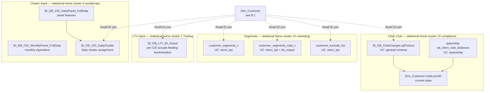

# B.7 — Customer Models & Segmentation

This skill is the **customer-property** layer. It answers:

- "What's customer X's LTV bucket?" → `BI_DB_LTV_BI_Actual`
- "What daily cluster is customer X in today, and what does that mean?" → `BI_DB_CID_DailyCluster`
- "What customer segments does customer X belong to?" → `customer_segments_v`
- "Is customer X eligible for marketing email?" → `customer_segments_mail_v`
- "Is customer X on the global exclusion list?" → `customer_exclude_list`
- "What's customer X's current club tier? When did they last change?" → `BI_DB_ClubChangeLogProduct` + `Dim_Customer.ClubLevelID`

> **Statistical-home note.** These tables physically cluster with neighbors
> from other super-domains in the join graph (LTV joins heavily with
> trading-platform revenue tables; DailyCluster sits in the social / copy
> network graph). For deeper analyses where the join pattern matters (LTV
> ↔ revenue, DailyCluster ↔ copy network), this skill points you at the
> respective super-domain skill. **What stays here:** the customer-side
> definitions and lookup patterns.

## Mental model



## LTV — `BI_DB_LTV_BI_Actual`

**UC:** `main.bi_db.gold_sql_dp_prod_we_bi_db_dbo_bi_db_ltv_bi_actual`

The "actuals" table feeds the LTV bucketization model. **One row per CID
per snapshot date** with realized lifetime metrics (`LifetimeDeposit`,
`LifetimeWithdraw`, `LifetimeRevenue`, `LifetimeTrades`, `LifetimePnL`)
plus the bucket label (`LTVBucket` / `LTVQuintile` — exact column varies
by snapshot version; check the wiki).

> **Historical note.** An older variant `BI_DB_LTV_Predictions` was used
> in the legacy DDR framework and is now deprecated. The new DDR framework
> (cluster 7 / Payments super-domain) carries lifetime metrics on
> `BI_DB_DDR_Customer_Daily_Status` directly. `BI_DB_LTV_BI_Actual` is
> still the right answer for the **bucket label**; for the underlying
> metrics use the new DDR table when available.

### Anti-pattern

DO NOT use `BI_DB_LTV_BI_Actual` to compute lifetime revenue/deposit on
the fly. The actuals there are point-in-time snapshots, not real-time —
for fresh aggregates, join `BI_DB_DDR_Customer_Daily_Status` (Payments
super-domain) or `BI_DB_DDR_CID_Level` (B.4).

## Daily / Monthly Cluster — `BI_DB_CID_DailyCluster`

**UC:** `main.bi_db.gold_sql_dp_prod_we_bi_db_dbo_bi_db_cid_dailycluster`

The user-clustering model output. **One row per CID per day** with cluster
assignment (`ClusterID`, `ClusterName` — typically a small enum like
`Whales`, `Active Traders`, `Casual`, `Dormant`, `New`). Feeds many BI
dashboards and the new-DDR dimensional tagging.

The full feature panel that the model consumes is in:

- Daily: `main.bi_db.gold_sql_dp_prod_we_bi_db_dbo_bi_db_cid_dailypanel_fulldata`
- Monthly: `main.dwh.gold_sql_dp_prod_we_bi_db_dbo_bi_db_cid_monthlypanel_fulldata`
  (note: this one lives in `dwh`, not `bi_db`)

These are wide tables (many features) — use them when you need the input
features, not the cluster assignment. For the assignment alone, prefer
`BI_DB_CID_DailyCluster`.

### Anti-pattern

DO NOT join cluster assignment by `ClusterID` alone in cross-domain queries
— different versions of the model have different `ClusterID` meanings.
Always join on `(RealCID, DateID, ClusterID)` to a label dictionary or use
`ClusterName` directly.

## Customer Segments — `customer_segments_v` / `customer_segments_mail_v`

**UC:** `main.etoro_kpi.customer_segments_v`, `main.etoro_kpi.customer_segments_mail_v`,
also `main.de_output.customer_segments_mail_v` (de_output mirror)

`customer_segments_v` is the analytical-segment view (**one row per CID
per segment**, where a CID can belong to many segments simultaneously).
`customer_segments_mail_v` is the marketing-mail-eligibility cut —
"which CIDs may receive which marketing emails" — typically narrower than
`customer_segments_v` and intersected with the global exclude list.

### Customer Exclude List — `customer_exclude_list`

**UC:** `main.etoro_kpi.customer_exclude_list`

The **global, authoritative test/internal/excluded customer list**. Use
this filter on every analytical aggregate that produces a customer count
or sums money. It is broader than `Dim_Customer.IsTestUser` — it also
catches fraud-suspended accounts and ad-hoc exclusions.

```sql
WHERE c.CID NOT IN (SELECT CID FROM main.etoro_kpi.customer_exclude_list)
```

## eToro Club — `BI_DB_ClubChangeLogProduct` + balances

**UC for change log:** `main.general.gold_sql_dp_prod_we_bi_db_dbo_bi_db_clubchangelogproduct`
(note: lives in `general` schema, not `bi_db`)

**UC for balances:** `main.spaceship.bronze_spaceship_analytics_rpt_etoro_club_balances`

The change log is one row per `(CID, ClubLevel transition)` with `FromTier`,
`ToTier`, `EffectiveDate`. Use it for:

- "When did customer X last upgrade to Diamond?"
- "How many customers downgraded from Platinum to Gold last quarter?"
- "Show me all tier changes for customer X"

For the **current** club tier, use `Dim_Customer.ClubLevelID` joined to
`Dim_PlayerLevel` (see B.1). For the **point-in-time** club tier as of a
specific date, use `Fact_SnapshotCustomer` (B.2).

The `etoro_club_balances` table is the spaceship-side balance ledger that
feeds club-tier eligibility (the qualifying balance threshold for each
tier). Fee-revenue questions on club perks route to Revenue & Fees
super-domain.

## Critical anti-patterns

1. **DO NOT use `BI_DB_LTV_BI_Actual` for current lifetime aggregates.** It's
   a snapshot — refreshed periodically. For fresh aggregates use the new DDR
   tables or `BI_DB_DDR_CID_Level`.
2. **DO NOT compute population segments here.** "How many Whales / Active
   Traders / Dormant?" → load `customer-populations` workspace skill. This
   skill provides the **per-CID** lookup; population aggregates live there.
3. **DO NOT skip `customer_exclude_list` on customer aggregates.** It is
   broader than `Dim_Customer.IsTestUser` / `IsExcludedFromReporting` and
   catches the fraud / ad-hoc exclusions those flags miss.
4. **DO NOT confuse `BI_DB_LTV_BI_Actual.LifetimeRevenue` with revenue-side
   `Fact_RevenueGeneratingActions`.** The former is a snapshot; the latter
   is the per-event ledger. They will differ by up to a day's worth of new
   revenue.
5. **DO NOT join `BI_DB_ClubChangeLogProduct` to `Dim_Customer.ClubLevelID`
   on equality.** The change log carries multiple rows per CID; join on
   `MAX(EffectiveDate) ≤ <as-of-date>` to pick the right tier slice, or
   use `Fact_SnapshotCustomer` (B.2) for the point-in-time view.

## SQL patterns

### Pattern 1 — LTV bucket + cluster + segments + club tier in one row

```sql
SELECT
    c.CID,
    ltv.LTVBucket,
    ltv.LifetimeDeposit,
    ltv.LifetimeRevenue,
    dc.ClusterName            AS DailyCluster,
    pl.LevelName              AS CurrentClubTier,
    excl.CID IS NOT NULL      AS IsExcluded
FROM main.dwh.gold_sql_dp_prod_we_dwh_dbo_dim_customer_masked c
LEFT JOIN main.bi_db.gold_sql_dp_prod_we_bi_db_dbo_bi_db_ltv_bi_actual         ltv  ON ltv.CID  = c.CID
LEFT JOIN (
    SELECT CID, ClusterName,
           ROW_NUMBER() OVER (PARTITION BY CID ORDER BY DateID DESC) AS rn
    FROM   main.bi_db.gold_sql_dp_prod_we_bi_db_dbo_bi_db_cid_dailycluster
) dc ON dc.CID = c.CID AND dc.rn = 1
LEFT JOIN main.dwh.gold_sql_dp_prod_we_dwh_dbo_dim_playerlevel pl ON pl.LevelID = c.ClubLevelID
LEFT JOIN main.etoro_kpi.customer_exclude_list excl ON excl.CID = c.CID
WHERE c.CID = :realcid
  AND c.RealCID > 0;
```

### Pattern 2 — segments a customer belongs to

```sql
SELECT s.CID, s.SegmentName, s.SegmentType, s.AssignedDate
FROM main.etoro_kpi.customer_segments_v s
WHERE s.CID = :realcid;
```

### Pattern 3 — full club tier history

```sql
SELECT cc.CID, cc.FromTier, cc.ToTier, cc.EffectiveDate, cc.ChangeReason
FROM main.general.gold_sql_dp_prod_we_bi_db_dbo_bi_db_clubchangelogproduct cc
WHERE cc.CID = :realcid
ORDER BY cc.EffectiveDate;
```

### Pattern 4 — customers in a given LTV bucket joined to current state

```sql
SELECT ltv.LTVBucket,
       COUNT(*) AS CustomerCount,
       AVG(ltv.LifetimeDeposit) AS AvgLifetimeDeposit
FROM main.bi_db.gold_sql_dp_prod_we_bi_db_dbo_bi_db_ltv_bi_actual ltv
JOIN main.dwh.gold_sql_dp_prod_we_dwh_dbo_dim_customer_masked     c   ON c.CID  = ltv.CID
LEFT JOIN main.etoro_kpi.customer_exclude_list                    excl ON excl.CID = c.CID
WHERE c.RealCID > 0
  AND c.IsTestUser = 0
  AND excl.CID IS NULL
GROUP BY ltv.LTVBucket
ORDER BY ltv.LTVBucket;
```

## Wiki deep-reads

- `knowledge/synapse/Wiki/BI_DB_dbo/Tables/BI_DB_LTV_BI_Actual.md`
- `knowledge/synapse/Wiki/BI_DB_dbo/Tables/BI_DB_CID_DailyCluster.md`
- `knowledge/synapse/Wiki/BI_DB_dbo/Tables/BI_DB_CID_DailyPanel_FullData.md`, `.../BI_DB_CID_MonthlyPanel_FullData.md`
- `knowledge/synapse/Wiki/BI_DB_dbo/Tables/BI_DB_ClubChangeLogProduct.md`
- KPI view source for `customer_segments_v` / `customer_segments_mail_v` / `customer_exclude_list`: see `knowledge/uc_views/etoro_kpi/`.
