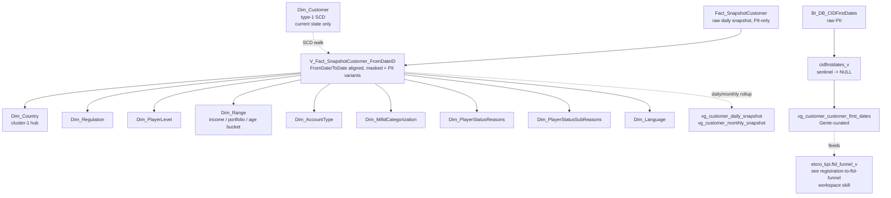

# B.2 — Identity, Jurisdiction & Regulation (with the SCD walk)

This skill answers "**what jurisdiction was customer X under, and when did
they switch?**" It owns the **point-in-time SCD** for every long-lived
customer attribute, plus the milestone first-dates. The current-state
attribute lookup is in [`customer-master-record.md`](customer-master-record.md);
this skill is the **historical** layer.

> **First-dates routing.** `BI_DB_CIDFirstDates` is the source of truth
> for "when did customer X first do X" (registered, KYC'd, deposited,
> traded, etc.). It is **PII-only** in UC (`main.pii_data.gold_sql_dp_prod_we_bi_db_dbo_bi_db_cidfirstdates`).
> For analyst-facing queries always prefer `main.etoro_kpi.cidfirstdates_v`
> — same content with sentinel `1900-01-01` converted to NULL. The
> `vg_customer_customer_first_dates` view is the Genie-curated alias used
> by the Voice Of The Customer Genie space and the registration-to-FTD agent.
>
> If the question is about **the funnel** (reg → KYC → V1/V2/V3 → FTD →
> first action), prefer the DE workspace skill **`registration-to-ftd-funnel`**
> and `main.etoro_kpi.ftd_funnel_v` — that is the canonical funnel view,
> superseding ad-hoc joins on `cidfirstdates_v`.

## Mental model



## Fact_SnapshotCustomer — the SCD itself

`Fact_SnapshotCustomer` is the **daily SCD-2-style record** of every customer
attribute that can change over time (regulation, country, level, status,
range, MiFID category). The raw fact is in `main.pii_data.gold_sql_dp_prod_we_dwh_dbo_v_fact_snapshotcustomer`
(PII-restricted, no DateID alignment). For analyst queries use the
**`FromDateID` view** which adds `FromDate` and `ToDate` boundaries:

| Variant | UC FQN | When to use |
|---|---|---|
| Masked + DateID-aligned | `main.dwh.gold_sql_dp_prod_we_dwh_dbo_v_fact_snapshotcustomer_fromdateid_masked` | **Default for analyst point-in-time queries.** Row per (CID, FromDate). |
| Full PII + DateID-aligned | `main.pii_data.gold_sql_dp_prod_we_dwh_dbo_v_fact_snapshotcustomer_fromdateid` | When you need PII columns alongside the historical attributes. Restricted access. |
| Full PII raw | `main.pii_data.gold_sql_dp_prod_we_dwh_dbo_v_fact_snapshotcustomer` | Almost never. No `FromDate`/`ToDate`; you'd have to reconstruct intervals. |

### Columns walked by SCD

`CountryID`, `RegulationID`, `ClubLevelID`, `StatusID`, `StatusReasonID`,
`StatusSubReasonID`, `RangeID`, `AccountTypeID`, `MifIDCategorizationID`,
`LanguageID`, `IsPI`, `MarketingRegion`, `ManagerID`, `IsTestUser`,
`IsExcludedFromReporting`. (Identity columns `CID`/`RealCID`/`GCID`/`MasterCID`
are stable and present too; they don't change.)

## BI_DB_CIDFirstDates — the milestones

The first-time-X column family. Raw fact is PII-only; analytical views
strip the `1900-01-01` sentinels:

| View | UC FQN | Note |
|---|---|---|
| `cidfirstdates_v` | `main.etoro_kpi.cidfirstdates_v` | **Default for analyst use.** Sentinel `1900-01-01` → NULL. |
| `vg_customer_customer_first_dates` | `main.etoro_kpi.vg_customer_customer_first_dates` | Genie-curated alias (Voice Of The Customer Genie space). |
| `BI_DB_CIDFirstDates` (raw) | `main.pii_data.gold_sql_dp_prod_we_bi_db_dbo_bi_db_cidfirstdates` | PII-only, raw sentinels. |

Common columns: `RegisteredDate`, `FirstKycDate`, `FirstDepositDate` (=FTD),
`FirstWithdrawDate`, `FirstTradeDate`, `FirstCryptoDate`, `FirstOptionsDate`,
`FirstClubUpgradeDate`, `FirstClubDowngradeDate`, etc.

> **Filter rule.** Always filter `WHERE FirstXxxDate IS NOT NULL` (when using
> `cidfirstdates_v`) or `WHERE YEAR(FirstXxxDate) <> 1900` (when using the raw
> PII variant). The sentinel means "milestone never reached", NOT "missing".

## Funnel-question routing — DEFER to DE workspace skill

If the question is **any** of these:

- "Reg-to-FTD conversion rate"
- "How long from registration to first deposit?"
- "VBD vs VBT cohort comparison"
- "Drop-off at the V1 / V2 / V3 verification step"
- "Deposit Wizard funnel"
- "Time to first trading action after FTD"

→ **load `/Workspace/.assistant/skills/registration-to-ftd-funnel/SKILL.md`** instead. It
exposes `main.etoro_kpi.ftd_funnel_v` (a MATERIALIZED_VIEW with all funnel
columns pre-stitched) and is the DE team's first Genie space + dedicated agent.
Going through `cidfirstdates_v` directly is correct only when the question
is about **a single milestone in isolation** (e.g. "give me the FTD date for
customer X"), not a funnel.

## Population-question routing — DEFER to DE workspace skill

If the question is **any** of these:

- "How many funded customers / active traders / portfolio-only / balance-only?"
- "Customers by jurisdiction / country / regulation, today"
- "FTF (First-Time-Funded) cohort size in <month>"
- Daily/monthly population trend

→ **load `/Workspace/.assistant/skills/customer-populations/SKILL.md`**. It uses
`gold_de_user_dim_ddr_customer_dailystatus_scd` and is the canonical population
skill — much faster than computing from `Fact_SnapshotCustomer`.

This skill (B.2) is the right answer when you need the **per-customer**
historical state, not aggregate counts.

## Critical anti-patterns

1. **DO NOT query `Dim_Customer` for historical attributes.** It's type-1.
   Walk `V_Fact_SnapshotCustomer_FromDateID` instead.
2. **DO NOT carry `1900-01-01` through aggregates.** Use `cidfirstdates_v`.
3. **DO NOT recreate the FTD funnel here.** Use `ftd_funnel_v` via the DE
   workspace skill.
4. **DO NOT join `Fact_SnapshotCustomer` to current-state facts on date.**
   Use `BETWEEN FromDate AND ToDate` (with `ToDate IS NULL OR ToDate >= :date`)
   to pick the right SCD slice.
5. **DO NOT confuse `MarketingRegion` with `CountryID`.** `MarketingRegion`
   is the marketing taxonomy bucket (UK / EU / RU / US / APAC); `CountryID`
   is residence-country. They diverge for many customers.

## SQL patterns

### Pattern 1 — what was customer X's regulation on date D?

```sql
SELECT s.CID, r.RegulationName, co.CountryName, s.FromDate, s.ToDate
FROM main.dwh.gold_sql_dp_prod_we_dwh_dbo_v_fact_snapshotcustomer_fromdateid_masked s
LEFT JOIN main.dwh.gold_sql_dp_prod_we_dwh_dbo_dim_regulation r  ON r.RegulationID = s.RegulationID
LEFT JOIN main.dwh.gold_sql_dp_prod_we_dwh_dbo_dim_country    co ON co.CountryID    = s.CountryID
WHERE s.CID = :realcid
  AND s.FromDate <= DATE'2025-06-01'
  AND (s.ToDate IS NULL OR s.ToDate > DATE'2025-06-01');
```

### Pattern 2 — every regulation transition for customer X

```sql
SELECT s.CID, r.RegulationName, s.FromDate, s.ToDate
FROM main.dwh.gold_sql_dp_prod_we_dwh_dbo_v_fact_snapshotcustomer_fromdateid_masked s
JOIN main.dwh.gold_sql_dp_prod_we_dwh_dbo_dim_regulation r ON r.RegulationID = s.RegulationID
WHERE s.CID = :realcid
ORDER BY s.FromDate;
```

### Pattern 3 — milestone first-dates for a CID (sentinels stripped)

```sql
SELECT
    fd.CID,
    fd.RegisteredDate,
    fd.FirstKycDate,
    fd.FirstDepositDate,        -- = FTD
    fd.FirstWithdrawDate,
    fd.FirstTradeDate,
    fd.FirstCryptoDate,
    fd.FirstOptionsDate
FROM main.etoro_kpi.cidfirstdates_v fd
WHERE fd.CID = :realcid;
```

### Pattern 4 — daily customer snapshot rollup for trend analysis

```sql
SELECT vd.SnapshotDate, COUNT(DISTINCT vd.CID) AS ActiveCustomers
FROM main.etoro_kpi.vg_customer_daily_snapshot vd
WHERE vd.SnapshotDate BETWEEN DATE'2025-01-01' AND DATE'2025-12-31'
  AND vd.IsTestUser = 0
GROUP BY vd.SnapshotDate
ORDER BY vd.SnapshotDate;
```

For population-trend questions, prefer `customer-populations` workspace skill — it
uses pre-aggregated views.

## Wiki deep-reads

- `knowledge/synapse/Wiki/DWH_dbo/Tables/Fact_SnapshotCustomer.md`
- `knowledge/synapse/Wiki/DWH_dbo/Tables/V_Fact_SnapshotCustomer_FromDateID.md`
- `knowledge/synapse/Wiki/BI_DB_dbo/Tables/BI_DB_CIDFirstDates.md`
- `knowledge/synapse/Wiki/DWH_dbo/Tables/Dim_Country.md`, `.../Dim_Regulation.md`, `.../Dim_PlayerLevel.md`, `.../Dim_AccountType.md`, `.../Dim_MifidCategorization.md`, `.../Dim_Range.md`, `.../Dim_PlayerStatusReasons.md`, `.../Dim_PlayerStatusSubReasons.md`, `.../Dim_Language.md`
