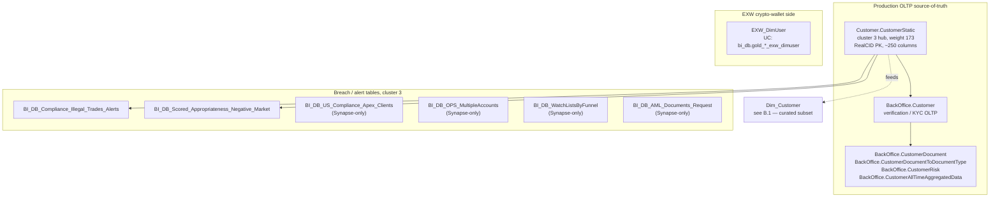

# B.3 — OLTP Customer Static & Breaches

This skill answers questions where you need the **production-OLTP truth**
about a customer — not the curated, analyst-friendly `Dim_Customer` view.
Two reasons to come here instead of B.1:

1. **You need a column that's in OLTP but NOT in `Dim_Customer`.** The OLTP
   `Customer.CustomerStatic` table has ~250 columns; `Dim_Customer` carries
   ~60. Many specialized fields (regulatory-attestation flags, marketing-consent
   timestamps, deposit-method preferences, support-channel opt-ins, app-version
   pinning, internal feature gates) only exist in OLTP.
2. **You're investigating a breach / regulatory alert / multi-account scenario.**
   The Breaches Investigation Bot Genie (the most-loaded Genie space on this
   cluster, 17/20) joins `Customer.CustomerStatic` to the BI_DB compliance
   alert tables to surface investigations. That workflow lives here.

## PII / masking note (important)

`Customer.CustomerStatic` exists in two UC variants:

| Variant | UC FQN | Use |
|---|---|---|
| **Masked (analyst-facing)** | `main.general.bronze_etoro_customer_customerstatic_masked` | **Default.** Name / email / phone / address / DOB redacted. Carries every analytical and regulatory column. |
| **Full PII (restricted)** | `main.pii_data.bronze_etoro_customer_customerstatic` | Only when business need explicitly requires unmasked identity. UC-grant restricted. |

`BackOffice.Customer` (verification OLTP) is in `main.general.bronze_etoro_backoffice_customer`
(masked). The supporting `BackOffice.Customer*` document/risk tables sit in
`main.billing.bronze_etoro_backoffice_customer*`.

## Mental model



## `Customer.CustomerStatic` — what's in here that's NOT in Dim_Customer

The "analyst-side curated" question of "show me the customer" is best
answered from `Dim_Customer` (B.1). Come here when you need:

- **Regulatory attestation flags**: `IsTermsAcceptedYYYY`, `IsPrivacyAcceptedYYYY`,
  `IsCommunicationOptIn`, `MarketingConsentDate`, `IsCookieConsentGiven`, etc.
- **Deposit-method preferences**: `PreferredDepositMethod`, `LastDepositMethodID`,
  `DepositMethodWhitelist`.
- **Support / channel opt-ins**: `SupportChannelOptIns`, `IsLiveChatEnabled`,
  `IsWhatsAppOptedIn`, etc.
- **App-version pinning** for forensic investigations: `LastAppVersion`,
  `LastWebVersion`, `LastDeviceID`.
- **Internal feature gates**: `IsBetaCohort`, `FeatureFlags` JSON blob.
- **Verification-fine-grain flags**: each verification step (V1, V2, V3, KYC1,
  KYC2, KYC3, etc.) has its own `IsVxAccepted` / `VxApprovalDate` /
  `VxRejectionReasonID` triplet — far more granular than `Dim_Customer`'s
  rolled-up `KYCStatus`.

Refer to the wiki for the full column dictionary; `Customer.CustomerStatic`
is the largest Wiki entry in the OLTP folder.

## `BackOffice.Customer` and the document/risk family

| Table | UC FQN | Role |
|---|---|---|
| `BackOffice.Customer` | `main.general.bronze_etoro_backoffice_customer` | Verification / KYC operational state per customer |
| `BackOffice.CustomerDocument` | `main.billing.bronze_etoro_backoffice_customerdocument` | Per-document submission / approval / rejection |
| `BackOffice.CustomerDocumentToDocumentType` | `main.billing.bronze_etoro_backoffice_customerdocumenttodocumenttype` | Document → document-type mapping |
| `BackOffice.CustomerRisk` | `main.billing.bronze_etoro_backoffice_customerrisk` | Per-customer risk classification (operator-assigned) |
| `BackOffice.CustomerAllTimeAggregatedData` | `main.billing.bronze_etoro_backoffice_customeralltimeaggregateddata` | All-time aggregated metrics per customer (deposits, withdrawals, trades counts) — the BackOffice operator's quick-summary |

`BackOffice.Customer` is the operational mirror used by the support team's
back-office tooling. Some columns (e.g. `OperatorAssignedRiskLevel`) only
live here, not in `Customer.CustomerStatic` or `Dim_Customer`.

## EXW_DimUser — crypto wallet user master

**UC:** `main.bi_db.gold_sql_dp_prod_we_exw_dbo_exw_dimuser`

The crypto-wallet customer dimension. Joins to `Dim_Customer` on `GCID` (NOT
`RealCID`). Carries wallet-side identifiers (`EXWCustomerID`, `WalletAddress`
hashes), wallet-account creation timestamps, region restrictions for crypto
trading, etc.

**The enriched variant `EXW_DimUser_Enriched` is Synapse-only** (not migrated
to UC main). Query it via Synapse MCP / pyodbc when needed.

For deep crypto-wallet questions (transactions, balances, on-chain),
route to Payments super-domain `payments/crypto-wallet.md`.

## Breach / alert tables (the Breaches Investigation Bot Genie cluster)

| Table | UC FQN | What it carries |
|---|---|---|
| `BI_DB_Compliance_Illegal_Trades_Alerts` | `main.bi_db.gold_sql_dp_prod_we_bi_db_dbo_bi_db_compliance_illegal_trades_alerts` | Detected illegal-trade events (regulatory-violating positions) per CID with reason code |
| `BI_DB_Scored_Appropriateness_Negative_Market` | `main.bi_db.gold_sql_dp_prod_we_bi_db_dbo_bi_db_scored_appropriateness_negative_market` | Appropriateness scoring on negative-market activity per CID |
| `BI_DB_US_Compliance_Apex_Clients` | **Synapse-only — query via Synapse MCP** | US-resident customers cleared by Apex broker; carries Apex-side compliance flags |
| `BI_DB_OPS_MultipleAccounts` | **Synapse-only — query via Synapse MCP** | Detected linked-account chains (one human → many `RealCID`); use `MasterCID` from Dim_Customer for the analytic equivalent |
| `BI_DB_WatchListsByFunnel` | **Synapse-only — query via Synapse MCP** | Watch-list filter per funnel stage |
| `BI_DB_AML_Documents_Request` | **Synapse-only — query via Synapse MCP** | AML document-request lifecycle |

These are the BreachesInvestigationBot's working set. The Genie space
joins them on `RealCID` to `Customer.CustomerStatic` to surface a
"customer + alerts + KYC + position context" investigation row.

## Critical anti-patterns

1. **DO NOT use `Customer.CustomerStatic` for analyst questions.** Use
   `Dim_Customer` (B.1). The OLTP table has more columns but also more noise
   (test rows, partially-completed registrations, pre-trim spaces in country
   codes) — `Dim_Customer` does the cleanup.
2. **DO NOT join `Dictionary.Country` / `Dictionary.Regulation` for
   analytical labels.** Use `Dim_Country` / `Dim_Regulation` (B.1 / B.2)
   — those are the curated dimensions with consistent naming.
3. **DO NOT count linked accounts via `BI_DB_OPS_MultipleAccounts` for
   live aggregates** — that table is Synapse-only and runs on a separate
   schedule. For live unique-customer counts, use `MasterCID` from
   `Dim_Customer` (which already encodes the linkage).
4. **DO NOT join `Customer.CustomerStatic` to PII-side tables across
   catalogs without checking grants.** The PII catalog has stricter ACLs
   than `general` — cross-catalog joins where one side is PII can fail
   silently for users without PII grants.
5. **DO NOT trust `BackOffice.Customer.IsActive` as the live status.** The
   BackOffice mirror lags production OLTP by minutes. Use
   `Customer.CustomerStatic.StatusID` for the latest, or `Dim_Customer.StatusID`
   for the analyst-curated nightly value.

## SQL patterns

### Pattern 1 — full OLTP row for a customer (forensic)

```sql
SELECT *
FROM main.general.bronze_etoro_customer_customerstatic_masked
WHERE RealCID = :realcid;
```

(Yes, `SELECT *` — this is intentional for forensic / column-discovery work.
For dashboards, name the columns.)

### Pattern 2 — verification state across the V1/V2/V3 chain

```sql
SELECT cs.RealCID,
       cs.IsV1Accepted, cs.V1ApprovalDate,
       cs.IsV2Accepted, cs.V2ApprovalDate,
       cs.IsV3Accepted, cs.V3ApprovalDate,
       cs.KYCStatus,
       bo.OperatorAssignedRiskLevel
FROM main.general.bronze_etoro_customer_customerstatic_masked cs
LEFT JOIN main.general.bronze_etoro_backoffice_customer       bo ON bo.CustomerID = cs.RealCID
WHERE cs.RealCID = :realcid;
```

(Column names in this pattern are illustrative — the exact column casing
varies by ingestion timestamp; check the wiki.)

### Pattern 3 — illegal-trade alerts joined to customer master

```sql
SELECT a.CID, a.AlertDate, a.AlertReason, a.PositionID,
       c.RealCID, co.CountryName, r.RegulationName
FROM main.bi_db.gold_sql_dp_prod_we_bi_db_dbo_bi_db_compliance_illegal_trades_alerts a
JOIN main.dwh.gold_sql_dp_prod_we_dwh_dbo_dim_customer_masked  c  ON c.CID  = a.CID
JOIN main.dwh.gold_sql_dp_prod_we_dwh_dbo_dim_country          co ON co.CountryID    = c.CountryID
JOIN main.dwh.gold_sql_dp_prod_we_dwh_dbo_dim_regulation       r  ON r.RegulationID  = c.RegulationID
WHERE a.AlertDate >= DATE'2025-01-01'
  AND c.IsTestUser = 0;
```

### Pattern 4 — EXW crypto wallet user lookup

```sql
SELECT eu.EXWCustomerID, eu.GCID, eu.UserCreationDate, eu.IsRegionRestricted
FROM main.bi_db.gold_sql_dp_prod_we_exw_dbo_exw_dimuser eu
WHERE eu.GCID = :gcid;
```

For deeper crypto-wallet questions, route to `payments/crypto-wallet.md`.

## Wiki deep-reads

- `knowledge/synapse/Wiki/Customer/Tables/CustomerStatic.md` — the longest single Wiki entry in the project
- `knowledge/synapse/Wiki/BackOffice/Tables/Customer.md`, `.../CustomerDocument.md`, `.../CustomerRisk.md`, `.../CustomerAllTimeAggregatedData.md`
- `knowledge/synapse/Wiki/EXW_dbo/Tables/EXW_DimUser.md`
- `knowledge/synapse/Wiki/BI_DB_dbo/Tables/BI_DB_Compliance_Illegal_Trades_Alerts.md`, `.../BI_DB_Scored_Appropriateness_Negative_Market.md`
- For Synapse-only tables (`BI_DB_OPS_MultipleAccounts`, `BI_DB_WatchListsByFunnel`, `BI_DB_AML_Documents_Request`, `BI_DB_US_Compliance_Apex_Clients`): the Synapse Wiki entries are authoritative; querying requires Synapse MCP / pyodbc.
