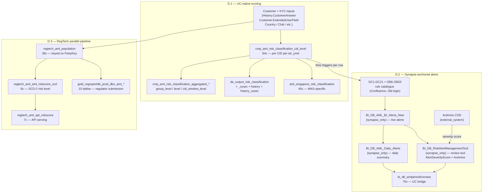

# Compliance & AML Super-Domain

eToro's AML stack is **three production pipelines**, not one. They share the goal — classify the customer by AML risk and fire alerts — but they were built at different times, by different teams, with different identifier conventions, and the most operationally critical layer (live alerts) is the one that has not yet been migrated to Unity Catalog. Routing the question to the right sub-skill is what makes the difference between answering from the production source-of-truth and answering from a stale Confluence page.

This super-domain v1 is about **AML risk classification + scoring**. It is **not** about:

- **Identity-side KYC screening** (PEP-list match, sanctions-list match, adverse-media match as identity verification) → `B domain-customer-and-identity/compliance-customer-snapshot-and-club` (planned v1.5). The flags `Is_PEP` / `Is_Sanctions_Match` LIVE on the cmp_aml family covered here, but the SCREENING DECISION that sets them lives upstream in ComplyAdvantage and the identity-side bronze.
- **FATCA / CRS / IRS tax reporting** → future spec 012-tax-compliance.
- **FCA SAR / MAS regulatory submission output** → future spec 013-regulatory-reporting. The `BI_DB_AML_SAR_Report_FCA` (50c) table is the staging artifact for that future spec; do NOT pull it for "did we file a SAR" questions yet.
- **Treezor / Tribe SOC2 audit envelopes** → `domain-cross/tribe-emoney-audit`.
- **Operator audit trail on a customer's compliance record** → `B domain-customer-and-identity/customer-action-audit-trail` (`Fact_CustomerAction`).

## Routing waypoint — read this first

The first decision is which of the three pipelines the question lives in:

1. **If the question is about WHO is high-risk / why** (counts of High vs Medium vs Low, alert-trigger combinations like `PEP_No_POA`, country-risk + KYC interactions, eMoney sub-vertical risk), default to [`aml-risk-scoring.md`](aml-risk-scoring.md) (D.1). This is the cmp_aml + de_output_risk_classification stack — UC-native, daily refreshed, 84 columns of pre-computed alert-trigger booleans on `cid_level`. **When in doubt, start here.**

2. **If the question is about WHICH alerts actually fired today, OR the periodic-review queue, OR the Actimize CDD severity score**, the production source is largely Synapse-only — [`aml-alert-routing.md`](aml-alert-routing.md) (D.2). The skill teaches you to query `BI_DB_AML_BI_Alerts_New` / `BI_DB_AML_Daily_Alerts` / `BI_DB_RiskAlertManagementTool` via the Synapse MCP server, with the UC bridge being `bi_db_amlperiodicreview` (70c) for the periodic-review queue.

3. **If the question is about the regulator-facing AML risk level fed to the regulator's submission system** (RegReportDB / RegTech), use [`aml-regtech-pipeline.md`](aml-regtech-pipeline.md) (D.3). This is keyed on `PartyKey`, not `CID` — a different identifier convention. Twenty UC tables, zero Confluence documentation.

If the question crosses pipelines (e.g., "did customer X's High classification in D.1 trigger an alert in D.2?"), load D.1 first then D.2 for the join.

## When to Use

Load when the question concerns **AML risk classification / scoring / alerting**, including:

- "Dynamic_Risk_Classification distribution on date D" / "Is_High_Risk vs Is_Medium_Risk + Is_Low_Risk counts"
- "Customers triggering PEP_No_POI / PEP_No_POA / High_Risk_AND_No_POI" → D.1
- "AML alerts that fired today / yesterday / last 30 days" → D.2 (Synapse)
- "Periodic AML review queue for next 30 days" → D.2 (UC: `bi_db_amlperiodicreview`)
- "Why did customer X get an alert? What was the AlertCode?" → D.2 (Synapse alert rule catalogue + DC1-DC21/OB6-OB20 catalogue from Confluence)
- "CySEC risk classification — current and historical per CID" → D.1 (UC: `de_output_risk_classification_history_cysec`)
- "Singapore MAS risk classification — Final_Score breakdown" → D.1 (UC: `aml_singapore_risk_classification`)
- "RegTech AML risk level per PartyKey for regulator X" → D.3
- "Reconcile cmp_aml High_Risk count vs Actimize CDD severity" → D.1 + D.2 (Actimize feed lives in `BI_DB_RiskAlertManagementTool.AlertSeverityScore`, synapse_only)
- "Multi-account, third-party deposit, dormant-account anomaly flags" → D.1 (the `*Anomaly*` and `Multiple*Accounts*` columns on `cid_level`)

Do **not** load for:

- KYC sanctions / PEP match itself (the decision, not the flag) → `B compliance-customer-snapshot-and-club` (planned v1.5)
- FATCA / CRS tax reporting → future spec 012
- FCA SAR / MAS submission output → future spec 013
- Tribe Treezor audit envelopes → `domain-cross/tribe-emoney-audit`
- Operator audit trail → `B customer-action-audit-trail`
- Trading-side dealing recon (`Dealing_IGRecon*`) → `A domain-trading/broker-and-lp-reconciliation`

## Scope

In scope: cmp_aml_risk_classification_* (4 grain tables: cid_level 84c, cid_window_level 77c, aggregated_level 72c, aggregated_group_level 71c); de_output risk_classification stack (97c production + 97c CySEC + 96c history + 96c history_cysec + vw_risk_classification_history_complete 96c + de_output_risk_calculations_cysec_users_scores 8c); bronze inputs (bronze_riskclassification_dictionary_cysecriskclassificationparameter 6c, bronze_riskclassification_riskclassification_cysecriskclassificationparameter 8c, bronze_riskclassification_dbo_v_riskclassificationdatalake 100c, bronze_etoro_riskcalculation_scorestemporary 10c, bronze_userapidb_history_customeranswers 10c, bronze_userapidb_customer_extendeduserfield_masked 8c, bronze_etoro_dictionary_riskclassification 3c); the periodic-review + Singapore + sub-entity tables (bi_db_amlperiodicreview 70c, bi_db_aml_singapore_risk_classification 45c, bi_db_aml_subentity_categorization 9c); the PII-enriched analyst view (pii_data.aml_snapshotcustomer_enriched_v 54c, pii_data_stg variant); the RegTech AML pipeline (20 tables: gold_regtech_aml_aml_riskscore_scd 6c, api_riskscore 7c, dict_regulation_aml 10c, population 39c, partyaddress 20c, partytopartyrelation 8c, periodicactivityexpected 9c, gen_key 13c, run_log 8c, transaction_currency 2c, plus the 10-table gold_regreportdb_prod_dbo_aml_* family); the live Synapse alert layer documented via external_references (BI_DB_AML_BI_Alerts_New, BI_DB_AML_Daily_Alerts, BI_DB_RiskAlertManagementTool); the Actimize CDD scoring engine documented as external_system; the DC1-DC21 + OB6-OB20 alert rule catalogue documented as manual_only; the stored proc family that drives the classification (BackOffice.SetRiskClassificationNew, RiskCalculation.SetRiskClassificationForCySec, dbo.P_RiskClassification — all manual_only).
Out of scope: KYC sanctions/PEP identity-side screening (B compliance-customer-snapshot-and-club), FATCA/CRS tax (future spec 012), FCA SAR / MAS regulatory submission output (future spec 013, the bi_db_aml_sar_report_fca 50c table belongs there), Tribe Treezor audit envelopes (domain-cross/tribe-emoney-audit), operator audit trail (B customer-action-audit-trail), dealing broker recon (A broker-and-lp-reconciliation).
Last verified: 2026-05-24

## Critical Warnings

1. **Tier 1 — Three pipelines, three identifier conventions. Do NOT join across them on a single key without the right bridge.** D.1 (cmp_aml + de_output_risk_classification) keys on `GCID + CID + etr_ymd` (DWH convention, where `CID = RealCID` in DWH facts). D.2 (Synapse alerts) keys on `RealCID INT` plus the alert's natural key (`AlertID` on `BI_DB_AML_BI_Alerts_New`, `RiskAlertID` on `BI_DB_RiskAlertManagementTool`). D.3 (RegTech) keys on `PartyKey` (RegReportDB convention) which is `regtech_aml_gen_key`-mapped from the eToro `CID`. To bridge: `bi_db_amlperiodicreview.RealCID` is the bridge between D.1 and D.2; `regtech_aml_population.CID` + `regtech_aml_gen_key` is the bridge between D.1 and D.3.

2. **Tier 1 — The LIVE alert layer is Synapse-only. Do NOT pretend a Databricks query returns today's alerts.** `BI_DB_AML_BI_Alerts_New` (the table whose rows ARE the alerts), `BI_DB_AML_Daily_Alerts` (daily aggregate), and `BI_DB_RiskAlertManagementTool` (cross-category alert manager carrying the Actimize `AlertSeverityScore`) are all in `sql_dp_prod_we` and NOT in `system.information_schema.tables` (verified 2026-05-24). The UC bridge is `bi_db_amlperiodicreview` (70c) which carries denormalized rollups (`TotalAlerts`, `AlertsSummary`, `BIAMLAlerts`, `LatestRiskAlertDateReview`, `LatestBIAlertDate`) — sufficient for "how many alerts" / "when was the last alert" but NOT sufficient for the per-AlertID detail. For per-AlertID questions: query Synapse via `user-synapse_prod_sql` MCP. See [`aml-alert-routing.md`](aml-alert-routing.md) for the bridge SQL pattern.

3. **Tier 1 — `Dynamic_Risk_Classification` is the production risk verdict, not `RiskClassificationID`.** On `cmp_aml_risk_classification_cid_level` (84c), the column `Dynamic_Risk_Classification` carries the current period's verdict (`High` / `Medium` / `Low` / NULL — the four `Is_High_Risk` / `Is_Medium_Risk` / `Is_Low_Risk` / `Is_Null_Risk` booleans are its derivatives). The legacy `RiskClassificationID` exists on bronze inputs (`bronze_etoro_dictionary_riskclassification` 3c, `regtech_aml_population.RiskClassificationID`) but is NOT the canonical analyst column — use `Dynamic_Risk_Classification` for current state and `de_output_risk_classification_history` for time-series. The HLD doc references `RiskClassificationID` in the upstream Synapse flow but the UC analytical surface dropped it in favor of the human-readable `Dynamic_Risk_Classification`.

4. **Tier 1 — `Is_PEP` and `Is_Sanctions_Match` are downstream FLAGS, not the screening decision.** On `cmp_aml_risk_classification_cid_level` the columns `Is_PEP`, `Is_Sanctions_Match`, `ScreeningStatus` are PRE-COMPUTED by the upstream screening provider (ComplyAdvantage for sanctions/PEP, Actimize for CDD). For questions about "is this customer on a sanctions list right now" — the identity-side screening lives in `B compliance-customer-snapshot-and-club` (planned v1.5) or directly in ComplyAdvantage UI. For "what alerts are firing because of PEP/sanctions" — use the alert-trigger booleans here (`PEP_No_POI`, `PEP_No_POA`, `PEP_No_POI_AND_No_POA`, `eMoney_High_Risk_AND_No_POI`, etc., 50+ columns).

5. **Tier 1 — Two STALE-CONF documentation cases. Trust UC names, NOT the HLD.** The HLD doc `11655577818` (Confluence) names `RiskCalculation.CySecScoresTemporary` and `RiskClassification.CySecRiskClassificationParameterView` as the source-of-truth. The post-migration UC names are `main.de_output_stg.de_output_risk_calculations_cysec_users_scores` (8c — the rename) and (no view) `main.bi_db.bronze_riskclassification_riskclassification_cysecriskclassificationparameter` (8c — the underlying table; the projection view was never re-materialized in UC). When the agent sees the HLD's Synapse names, MAP them to the UC names above. See [`aml-risk-scoring.md`](aml-risk-scoring.md) Critical Warning section for the mapping table.

6. **Tier 2 — `etr_ymd` is the snapshot partition key on cmp_aml + de_output. Use it for date filtering, NOT `ReportRunDate` alone.** The cmp_aml family and most de_output_risk_classification* tables carry `etr_ymd` (string `YYYY-MM-DD`) as the partition; filtering on `etr_ymd BETWEEN '...' AND '...'` enables partition pruning. `ReportRunDate` is the human-readable timestamp but is NOT the partition column. For history-walks use `de_output.vw_risk_classification_history_complete` (96c, partitioned).

7. **Tier 2 — Confluence documents only ~16 nodes out of ~70+ in the production AML scope.** Phase A.5c surfaced **2 STALE-CONF** + **42+ GAP-CONF** entries: the entire RegTech pipeline (20 tables), the entire de_output destination layer, all PII analyst views, and Singapore/sub-entity tables have zero Confluence documentation. The most-recent-edit-wins authority heuristic FAILS for AML/Compliance — the Confluence pages that exist are MOSTLY process-side documents (HLDs, alert rule catalogues), not data inventories. Authority Hierarchy verdict: KPI views + Genie configs + UC information_schema are the highest-trust sources here; Confluence is partial. The skill defaults to UC as the source-of-truth.

8. **Tier 3 — The DC1-DC21 + OB6-OB20 alert rule catalogue is the only documentation of WHAT triggers alerts, and it's tagged "(Old logic)".** Confluence page `905216127` is titled `AML Monitoring Alerts Logic (Old logic)` — the tag is honest in that the page is not current, but there is **no replacement page**. The rule logic that produces today's alerts lives in production SQL inside `BackOffice.SetRiskClassificationNew` + the regtech pipeline. For "what does AlertCode = 'DC4' mean" questions, the only catalogue is this Old-logic page; cross-reference the page's rule descriptions against `SELECT DISTINCT AlertCode FROM BI_DB_AML_BI_Alerts_New` (Synapse). See [`aml-alert-routing.md`](aml-alert-routing.md) Critical Warning 3.

9. **Tier 3 — Stored procs are NOT data tables; they are the LOGIC.** `BackOffice.SetRiskClassificationNew`, `RiskCalculation.SetRiskClassificationForCySec`, `dbo.P_RiskClassification` run only in Synapse and are documented in the per-table wiki pages. For "how is the risk classification actually computed" questions, the answer is in the SP body, not in any UC table. The wiki paths are listed under `external_references[].bridge_strategy` in each sub-skill.

## Mental model — the three pipelines

D.1 → D.2 bridge: the alert-trigger boolean columns on `cmp_aml_risk_classification_cid_level` (`High_Risk_AND_No_POI`, `PEP_No_POA`, etc.) are the IN-DATABASE signals that the upstream stored procs use to insert rows into `BI_DB_AML_BI_Alerts_New`. D.1 → D.3 bridge: `regtech_aml_population.CID` maps to `cmp_aml_risk_classification_cid_level.CID`; `regtech_aml_gen_key` provides the `CID → PartyKey` translation.

## Sub-skill routing

| Sub-skill | Anchor (UC FQN — first entry) | When to load |
|---|---|---|
| [`aml-risk-scoring.md`](aml-risk-scoring.md) | `main.bi_compliance_stg.bi_compliance_cmp_tables_cmp_aml_risk_classification_cid_level` (84c) + `main.de_output.de_output_risk_classification` (97c) + `main.de_output.vw_risk_classification_history_complete` (96c) | **DEFAULT for "what is customer X's AML risk classification" / "how many High-Risk customers do we have" / "PEP_No_POA count" / "CySEC risk score" / "Singapore MAS risk score" / time-series history of risk classification.** UC-native, daily refreshed. Owns all 4 cmp_aml grain tables, the de_output destination layer, the bronze inputs, the Singapore + sub-entity tables. |
| [`aml-alert-routing.md`](aml-alert-routing.md) | `main.bi_db.gold_sql_dp_prod_we_bi_db_dbo_bi_db_amlperiodicreview` (70c) + external_references: `BI_DB_AML_BI_Alerts_New` (synapse_only) + `BI_DB_RiskAlertManagementTool` (synapse_only) | **Default for "alerts that fired" / "periodic review queue" / "AlertCode meaning" / "Actimize CDD severity" / "alert rule catalogue".** The live alert layer is Synapse-only; the skill teaches the bridge strategy. UC entry point is the periodic-review queue (70c) which carries denormalized alert summaries. |
| [`aml-regtech-pipeline.md`](aml-regtech-pipeline.md) | `main.regtech.gold_regtech_aml_api_riskscore` (7c) + `main.regtech.gold_regtech_aml_aml_riskscore_scd` (6c) + `main.regtech.gold_regtech_aml_population` (39c) | **Default for any question keyed on `PartyKey` or referencing the regulator-submission AML data model.** 20 UC tables, zero Confluence documentation — the skill is the only documentation. RegTech-team owned. |

## Cross-cutting facts

These hold whether you load any sub-skill or not:

- **`CID = RealCID`** in cmp_aml + de_output + bi_db AML tables. RegTech uses `CID` on `population` and `PartyKey` everywhere else (mapped via `gen_key`).
- **Snapshot grain is daily**, partition column `etr_ymd` (`'YYYY-MM-DD'` string) on cmp_aml + de_output + regtech. Use `WHERE etr_ymd = 'YYYY-MM-DD'` for single-day queries; use `etr_ymd BETWEEN ... AND ...` for ranges. **Do not filter on `ReportRunDate`** as the primary date predicate — it's not the partition.
- **`Dynamic_Risk_Classification`** is the canonical analyst column for current risk classification, with derivative booleans `Is_High_Risk` / `Is_Medium_Risk` / `Is_Low_Risk` / `Is_Null_Risk`.
- **`eMoney_ClientRisk`** is the eMoney-specific parallel risk classification (separate column from `Dynamic_Risk_Classification`) — captures eMoney-vertical risk that may diverge from the cross-platform classification. Derivative booleans `Is_eMoneyClientRisk_High/Medium/Low/Null` + club crossbreaks.
- **`Country_RiskGroupID`** is the FATF-style country risk grouping; `HighRiskCountryDeposits` is the trigger flag.
- **`Regulation`** column carries the regulator-of-the-day for the CID (`CYS`, `FCA`, `MAS`, `ASIC`, etc.) — used in `Regulation = 'MAS'` joins to `aml_singapore_risk_classification`.
- **Alert-trigger boolean family**: 50+ pre-computed booleans on `cid_level` (e.g., `High_Risk_AND_No_POI`, `PEP_No_POA`, `eMoney_High_Risk_No_POI_AND_No_POA`, `Multiple*Accounts*`, `ThirdPartyDeposit`, `BronzeMultipleAccountsFunding`, etc.). These ARE the column-level evidence of which alerts fire downstream in D.2.
- **The 20 RegTech tables are UC-native and Confluence-uncovered.** Treat their column-level documentation in [`aml-regtech-pipeline.md`](aml-regtech-pipeline.md) as the single source of truth.

## Authority and locality

- **Authority hierarchy** for this domain: KPI views + Genie configs + UC `information_schema` are the highest-trust sources. Confluence is partial (42+ tables flagged GAP-CONF). Synapse §3.3 join patterns are lowest-trust.
- **Locality classification** (Phase A.6, 2026-05-24): ~50 anchors `UC`, 3 critical anchors `synapse_only` (the live alert layer — `BI_DB_AML_BI_Alerts_New`, `BI_DB_AML_Daily_Alerts`, `BI_DB_RiskAlertManagementTool`), 2 `hybrid_synapse_uc` (CySEC HLD renames), 3 `external_system` (Actimize, ComplyAdvantage, Tableau workbook), 4 `manual_only` (3 SPs + 1 alert-rule catalogue).

## What this skill is NOT

- It does not contain SQL — sub-skills do. The hub routes only.
- It does not cover **identity-side KYC sanctions/PEP screening** — that's `B compliance-customer-snapshot-and-club` (planned v1.5).
- It does not cover **FATCA / CRS / tax reporting** — future spec 012.
- It does not cover **FCA SAR / MAS regulatory submission output** — future spec 013.
- It does not cover **Tribe / FiatDwhDB Treezor audit envelopes** — `domain-cross/tribe-emoney-audit`.
- It does not cover **dealing-side broker recon** — `A domain-trading/broker-and-lp-reconciliation`.
- It does not cover the **operational WORK side** of compliance — the OPS team's alert queue, assignee workload, ticket SLA, KYC document upload pipeline, EV provider routing, and registration funnel. That's `domain-ops-and-onboarding/` — compliance owns the RULES; OPS owns the QUEUE. `BI_DB_RiskAlertManagementTool` is the synapse_only-anchor source; its UC mirror `main.bi_output_stg.bi_output_operations_risk_alert_management_tool` is documented from the OPS-queue lens in `../domain-ops-and-onboarding/ops-portal-and-alerts.md`.

## Skill provenance

- Cluster source: Louvain Cluster 35 (Phase A.1 AML core) + Phase A.2 embedded-member scan (63 AML-named nodes embedded in non-D clusters 1, 4, 6, 7, 10, 11, 16, 45 — Customer-domain leakage that is *correct* because customer state IS the input to AML scoring) + Phase A.3 Genie-seeded subgraph (the `bi_compliance_stg` Cluster 53 found ONLY via Genie config, not Louvain) + Phase A.4 Tableau fly-over (added `BI_DB_RiskAlertManagementTool` as synapse_only anchor) + Phase A.5b Confluence corpus (14 pages, 16 nodes, 2 STALE-CONF + the OBSOLETE-OK-BUT-GAP for the alert rule catalogue) + Phase A.5c + A.6 staleness + locality classification.
- Total nodes covered: ~70 (~50 UC, 3 synapse_only, 2 hybrid, 3 external_system, 4 manual_only, ~8 deferred to siblings).
- Genie space coverage: `AML Insights Genie`, `PROD - Compliance Genie`.
- KPI view coverage: `kyc_for_compliance_v`, `positions_for_compliance_v`, `cmp_aml_risk_classification_*` (4 views derived from the 4 staging tables).
- UC FQN resolution and column-count existence: queried against `system.information_schema.columns` / `system.information_schema.tables` on 2026-05-24. Three critical anchors NOT in UC (verified): `BI_DB_AML_BI_Alerts_New`, `BI_DB_AML_Daily_Alerts`, `BI_DB_RiskAlertManagementTool`. Three external-system sources NOT in UC: Actimize, ComplyAdvantage, Tableau AML workbook.
- v1 scope per user direction (2026-05-24): AML risk classification + scoring + alert routing only. KYC screening / Tax / Regulatory reporting / Tribe explicitly deferred.
- v1 sub-skills (all spec-011 authored 2026-05-24): `aml-risk-scoring` v1, `aml-alert-routing` v1, `aml-regtech-pipeline` v1.
- Build provenance (production anchors, cluster briefs, embedded-members scan, subgraph, Tableau fly-over, Confluence corpus, staleness, partition decision) lives in the source repo under `knowledge/skills/_compliance_*.md` and `_brief_cluster_35.md` — not deployed to Databricks workspace.
