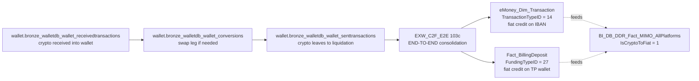

# Cross-domain — Crypto-to-Fiat (C2F) End-to-End

The C2F flow is eToro's customer **off-ramp**: a crypto holding is converted to fiat and credited to the customer's eMoney IBAN (or trading-platform USD wallet). This cross-domain skill stitches the data sources that each see one piece of the story.

**Side classification:** broker-side customer flow (off-ramp from crypto to fiat). C2F revenue (the fee charged) is dealer/finance-side and lives in `domain-revenue-and-fees`.

> **Genie / SQL note.** SQL examples use **Unity Catalog FQNs** from `required_tables:`. Synapse names in prose / mermaid are aliases.

## When to Use

Load when the question spans **crypto wallet → fiat credit (on IBAN or TP wallet)**:

- "C2F volume across all platforms in a period" (use MIMO marker — fastest)
- "End-to-end C2F drill for a customer / a specific event"
- "Failed C2F — crypto received but no IBAN credit" (forensic, chain incomplete)
- "Per-leg conversion pricing / blockchain hash for a SentTransaction"
- "C2F revenue per customer" (delegate to `domain-revenue-and-fees` `v_revenue_cryptotofiat_c2f`)
- "On-ramp (IBAN → crypto purchase)" — note: NOT covered by EXW_C2F_E2E; see Critical Warning 7

Do NOT load for:

- **Crypto holdings / on-chain forensics independent of fiat** → `crypto-wallet` (C.4) alone.
- **eMoney IBAN transactions independent of crypto** → `emoney-accounts-and-cards` (C.3) alone.
- **C2F fee revenue aggregation** → `domain-revenue-and-fees` (`v_revenue_cryptotofiat_c2f` 16c).
- **Aggregate MIMO panel "money flowed cross-platform"** → `mimo-panel-and-ddr` (C.2); use `IsCryptoToFiat=1` filter on the panel.

## Scope

In scope: the C2F end-to-end pipeline — `EXW_C2F_E2E` (103c, already-stitched anchor); side markers `eMoney_Dim_Transaction.TransactionTypeID=14`, `Fact_BillingDeposit.FundingTypeID=27`, `BI_DB_DDR_Fact_MIMO_AllPlatforms.IsCryptoToFiat=1`; the manual chain (`ReceivedTransactions` → `Conversions` → `SentTransactions` via `CorrelationId`, with `customerwalletsview` for `WalletId`→`Gcid`); the eMoney-side terminal (`eMoney_Dim_Transaction` + `eMoney_Dim_Account` with `GCID_Unique_Count=1` join gate) and TP-side terminal (`Fact_BillingDeposit` + `Dim_Customer` for GCID-on-DWH bridge); the `v_revenue_cryptotofiat_c2f` (16c) pointer to fee revenue.
Out of scope: aggregate fee/revenue accounting (`domain-revenue-and-fees`); pure on-chain analysis (`crypto-wallet`); pure IBAN/card analysis (`emoney-accounts-and-cards`); customer total balance (`finance-recon-and-balances`); AML risk classification (Compliance super-domain).
Last verified: 2026-05-11

## Critical Warnings

1. **Tier 1 — `EXW_C2F_E2E` (103c) is the already-stitched anchor.** Each row = one complete C2F event with all stages joined. **If your question is about C2F volume, count, customer pattern, or simple drill — use this table directly, don't reconstruct the chain.** Reach for the manual chain (the production-mirror wallet ledger) only when (a) investigating a SPECIFIC failed/partial C2F that isn't yet fully in `EXW_C2F_E2E` (latency / data-quality issue), or (b) you need a stage-specific detail (e.g. blockchain hash of the underlying crypto receive, or per-leg pricing of the conversion).
2. **Tier 1 — `FundingTypeID = 27` post-insert UPDATE only runs `DateID >= 20250701`.** Pre-July-2025 TP-side C2F may be under-tagged on `Fact_BillingDeposit`. Use `EXW_C2F_E2E` (which doesn't depend on this tag) for historical accuracy. The eMoney side (`TransactionTypeID = 14`) is reliable from inception.
3. **Tier 1 — `IsCryptoToFiat` on MIMO is dual-source.** Set EITHER by sub-platform tag OR by the `FundingTypeID=27` post-insert UPDATE. If you ever see a MIMO row with `IsCryptoToFiat=1` but no matching `EXW_C2F_E2E` row, check both source paths (the MIMO panel UNION-ALLs sub-platform feeds and the TP feed); the discrepancy is data-quality, not a logic error.
4. **Tier 1 — `CorrelationId` is the manual-chain stitch key.** When reconstructing without `EXW_C2F_E2E`: `Conversions.CorrelationId` = `SentTransactions.CorrelationId` (swap intent → on-chain leg); `Redemptions.SendRequestCorrelationId` = `SentTransactions.CorrelationId` (off-platform-send intent → on-chain Sent). Three Synapse-only enriched facts (`EXW_FactRedeemTransactions`, `EXW_FactConversions`, `EXW_PaymentReconciliation`) are `_Not_Migrated`; in Genie do the stitch by hand on `CorrelationId`. See `crypto-wallet.md` Critical Warnings 2 + 4.
5. **Tier 2 — `GCID` is the customer link across the chain.** `EXW_Wallet.CustomerWalletsView.Gcid`, `eMoney_Dim_Account.GCID`, `Dim_Customer.GCID`, `Conversions.SendingGCID`. **TP side uses `CID = RealCID`** — go via `Dim_Customer.GCID` to bridge into TP `Fact_BillingDeposit.CID`.
6. **Tier 2 — eMoney join gate: filter `eMoney_Dim_Account.GCID_Unique_Count = 1`.** Multi-account-per-GCID rows multiply rows on the join; the canonical eMoney pattern is single-account per GCID. See `emoney-accounts-and-cards.md` Critical Warning on this.
7. **Tier 2 — Reverse direction (on-ramp: IBAN → crypto purchase) is a DIFFERENT flow.** `EXW_C2F_E2E` is off-ramp specifically (crypto → fiat). On-ramp goes through `eMoney_Dim_Transaction` (debit) → wallet credit. For on-ramp use the equivalent eMoney TransactionType + crypto receive walk; there is no `EXW_F2C_E2E` symmetric table.
8. **Tier 2 — C2F can fail mid-chain.** A crypto receive that doesn't complete to IBAN credit will show in `ReceivedTransactions` but not in `EXW_C2F_E2E`. Use `EXW_Wallet.SentTransactionStatuses` (UC: `wallet.bronze_walletdb_wallet_senttransactionstatuses`, 7c) and `eMoney_Fact_Transaction_Status` (77c) for forensic follow-up.
9. **Tier 3 — C2F revenue is in Revenue & Fees**, not here. `etoro_kpi_prep.v_revenue_cryptotofiat_c2f` (16c) is the per-customer fee revenue cut. This skill only points there.
10. **Tier 3 — Pre-July-2025 historical drift.** When reporting C2F over a long history window, prefer `EXW_C2F_E2E` (chain-true) over `MIMO.IsCryptoToFiat` (depends on the post-insert UPDATE that only runs post 2025-07-01). For purely post-2025-07-01 periods either source is correct.

## The chain



## Side markers — count C2F WITHOUT walking the chain

| Source | Marker | Meaning |
|---|---|---|
| `eMoney_Dim_Transaction` (77c) | `TransactionTypeID = 14` | This eMoney IBAN credit was a C2F off-ramp result. Authoritative on eMoney side, reliable from inception. |
| `Fact_BillingDeposit` (139c) | `FundingTypeID = 27` | This TP fiat deposit was a C2F off-ramp. Authoritative on TP side, fully tagged `DateID >= 20250701`. |
| `BI_DB_DDR_Fact_MIMO_AllPlatforms` (24c) | `IsCryptoToFiat = 1` | Cross-platform MIMO marker. Dual-source (sub-platform tag + post-insert UPDATE on TP). |

The MIMO marker is the easiest way to answer "how much C2F volume across the whole business" — single column on a single fact.

## Canonical SQL patterns

```sql
-- 1. C2F volume across all platforms in a period (USE MIMO marker — fastest)
SELECT DateID, MIMOPlatform, SUM(AmountUSD) AS C2F_USD, COUNT(*) AS Tx
FROM main.bi_db.gold_sql_dp_prod_we_bi_db_dbo_bi_db_ddr_fact_mimo_allplatforms
WHERE IsCryptoToFiat = 1
  AND MIMOAction = 'Deposit'
  AND DateID BETWEEN :from_dt AND :to_dt
GROUP BY DateID, MIMOPlatform
ORDER BY DateID, MIMOPlatform;
```

```sql
-- 2. End-to-end C2F drill for a specific customer (USE the E2E table)
SELECT *
FROM main.bi_db.gold_sql_dp_prod_we_exw_dbo_exw_c2f_e2e
WHERE GCID = :gcid
  AND C2F_DateID BETWEEN :from_dt AND :to_dt
ORDER BY C2F_DateID;
```

```sql
-- 3. Manual chain walk (only when E2E is incomplete) — UC
WITH crypto_in AS (
  SELECT r.*
  FROM      main.wallet.bronze_walletdb_wallet_receivedtransactions r
  JOIN      main.wallet.bronze_walletdb_wallet_customerwalletsview  cw
         ON cw.Id = r.WalletId
  WHERE cw.Gcid       = :gcid
    AND r.CreatedDate BETWEEN :from_dt AND :to_dt
),
conversions AS (
  SELECT *
  FROM main.wallet.bronze_walletdb_wallet_conversions
  WHERE SendingGCID = :gcid
    AND CreatedDate BETWEEN :from_dt AND :to_dt
),
iban_credit AS (
  SELECT dt.*
  FROM      main.bi_db.gold_sql_dp_prod_we_emoney_dbo_emoney_dim_transaction dt
  JOIN      main.bi_db.gold_sql_dp_prod_we_emoney_dbo_emoney_dim_account     da
         ON da.CID               = dt.CID
        AND da.GCID_Unique_Count = 1
  WHERE da.GCID             = :gcid
    AND dt.TransactionTypeID = 14
    AND dt.TxDateID BETWEEN :from_dt AND :to_dt
),
tp_credit AS (
  SELECT fbd.*
  FROM      main.dwh.gold_sql_dp_prod_we_dwh_dbo_fact_billingdeposit  fbd
  JOIN      main.dwh.gold_sql_dp_prod_we_dwh_dbo_dim_customer_masked  dc
         ON dc.RealCID = fbd.CID
  WHERE dc.GCID             = :gcid
    AND fbd.FundingTypeID    = 27
    AND fbd.PaymentStatusID  = 2
    AND fbd.ModificationDateID BETWEEN :from_dt AND :to_dt
)
SELECT 'crypto_in'    AS stage, * FROM crypto_in
UNION ALL SELECT 'conversion',  * FROM conversions
UNION ALL SELECT 'iban_credit', * FROM iban_credit
UNION ALL SELECT 'tp_credit',   * FROM tp_credit;
```

```sql
-- 4. C2F that landed eMoney-IBAN but never lit up the MIMO panel (data-quality forensic)
SELECT dt.TransactionID, dt.CID, dt.Amount, dt.TxDateID
FROM main.bi_db.gold_sql_dp_prod_we_emoney_dbo_emoney_dim_transaction dt
LEFT JOIN main.bi_db.gold_sql_dp_prod_we_bi_db_dbo_bi_db_ddr_fact_mimo_allplatforms m
       ON m.TransactionID  = dt.TransactionID
      AND m.IsCryptoToFiat = 1
WHERE dt.TransactionTypeID = 14
  AND dt.TxDateID BETWEEN :from_dt AND :to_dt
  AND m.TransactionID IS NULL;
```

## When to load just one parent instead

- "How much C2F volume in Q1?" → MIMO marker alone (`mimo-panel-and-ddr` is enough).
- "Show me crypto holdings of customer X" → `crypto-wallet` alone.
- "Show me eMoney transactions of customer X" → `emoney-accounts-and-cards` alone.
- "Trace the full off-ramp chain for customer X over Q1" → load this cross-domain skill.

## Deep reads

- [`EXW_C2F_E2E.md`](https://github.com/guyman-tr/Databricks_Knowledge/blob/master/knowledge/synapse/Wiki/EXW_dbo/Tables/EXW_C2F_E2E.md) — 103c anchor
- [`eMoney_Dim_Transaction.md`](https://github.com/guyman-tr/Databricks_Knowledge/blob/master/knowledge/synapse/Wiki/eMoney_dbo/Tables/eMoney_Dim_Transaction.md) — TransactionTypeID = 14
- [`Fact_BillingDeposit.md`](https://github.com/guyman-tr/Databricks_Knowledge/blob/master/knowledge/synapse/Wiki/DWH_dbo/Tables/Fact_BillingDeposit.md) — FundingTypeID = 27
- [`BI_DB_DDR_Fact_MIMO_AllPlatforms.md`](https://github.com/guyman-tr/Databricks_Knowledge/blob/master/knowledge/synapse/Wiki/BI_DB_dbo/Tables/BI_DB_DDR_Fact_MIMO_AllPlatforms.md) — IsCryptoToFiat = 1

## Skill provenance

- Column counts and UC FQN existence verified 2026-05-11 against `system.information_schema.columns`. Key counts: `EXW_C2F_E2E`=103, `eMoney_Dim_Transaction`=77, `Fact_BillingDeposit`=139, `MIMO_AllPlatforms`=24, `v_revenue_cryptotofiat_c2f`=16, `eMoney_Dim_Account`=89.
- `_Not_Migrated` Synapse-only: `EXW_FactRedeemTransactions`, `EXW_FactConversions`, `EXW_PaymentReconciliation` (Critical Warning 4 — manual stitch via `CorrelationId`).
- Intersecting skills: `domain-payments/crypto-wallet`, `domain-payments/emoney-accounts-and-cards`, `domain-payments/deposits-and-withdrawals`, `domain-payments/mimo-panel-and-ddr`, `domain-revenue-and-fees/SKILL`.
