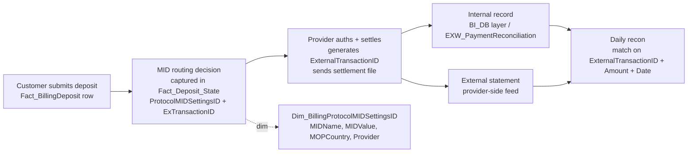

# Cross-domain skill — Provider Reconciliation

eToro routes customer deposits/withdrawals through external payment
providers (Worldpay, SafeCharge/Nuvei, PayPal, Skrill, Neteller, OpenPayd
in UK, etc.). Each provider sends back a daily settlement file. This cross-domain skill
captures how to JOIN our internal deposit row to the provider's settlement
record so finance / payment-ops can answer "did Worldpay pay us what we
expected".

> **⚠ Synapse-only workflow:** the MID-routing core of this cross-domain skill lives in
> `Fact_Deposit_State`, `Fact_Cashout_State`, and
> `Dim_BillingProtocolMIDSettingsID` — **none of these are in UC**
> (`_Not_Migrated` / wiki-only). On Databricks Genie this cross-domain skill will fail
> on the MID-decoding join. **Run provider-recon SQL against Synapse
> directly** (synapse_prod_sql / synapse_sql MCP, or pyodbc).
>
> The Apex SOD recon (`finance.bronze_sodreconciliation_apex_*`,
> `general.bronze_usabroker_apex_options`) IS in UC and is shown separately
> below — that part can run in Genie.

## The chain



## Key tables

| Table | Role |
|-------|------|
| `DWH_dbo.Fact_Deposit_State` | Carries `ProtocolMIDSettingsID` (which physical MID handled this deposit) and `ExTransactionID` (the provider-side transaction ID). **PRIMARY join target.** Filter `TransactionType='Deposit'`. |
| `DWH_dbo.Fact_Cashout_State` | Same, withdraw side. Filter `TransactionType='Withdraw'`. |
| `DWH_dbo.Dim_BillingProtocolMIDSettingsID` | Decodes `ProtocolMIDSettingsID` → `MIDName`, `MIDValue`, `MOPCountry`, `Provider`. |
| `DWH_dbo.Fact_BillingDeposit` | Internal canonical deposit row. Join via `DepositID`. |
| `DWH_dbo.Fact_BillingWithdraw` | Same for withdrawals. Join via `WithdrawID`. |
| `EXW_dbo.EXW_PaymentReconciliation` | Provider-side reconciliation feed (where applicable). |
| `finance.bronze_sodreconciliation_apex_ext869_cashactivity` *(UC)* | Apex-specific cash-activity recon feed. Apex is the US options broker, not a payment provider per se, but the recon pattern is the same. |

## Canonical patterns

```sql
-- 1. MID-level decline rate over a window
SELECT
  dmid.MIDName,
  dmid.MIDValue,
  dmid.Provider,
  dmid.MOPCountry,
  COUNT(*) AS attempts,
  SUM(CASE WHEN fbd.PaymentStatusID = 2  THEN 1 ELSE 0 END) AS approved,
  SUM(CASE WHEN fbd.PaymentStatusID = 35 THEN 1 ELSE 0 END) AS declined,
  CAST(SUM(CASE WHEN fbd.PaymentStatusID = 2 THEN 1 ELSE 0 END) AS FLOAT) / COUNT(*) AS approval_rate
FROM DWH_dbo.Fact_BillingDeposit fbd
JOIN DWH_dbo.Fact_Deposit_State fds
       ON fds.DepositID = fbd.DepositID
      AND fds.TransactionType = 'Deposit'
JOIN DWH_dbo.Dim_BillingProtocolMIDSettingsID dmid
       ON dmid.ProtocolMIDSettingsID = fds.ProtocolMIDSettingsID
WHERE fbd.ModificationDateID BETWEEN @from AND @to
GROUP BY dmid.MIDName, dmid.MIDValue, dmid.Provider, dmid.MOPCountry
ORDER BY attempts DESC
```

```sql
-- 2. Match a single provider statement row to internal record
-- (provider sends ExternalTransactionID; you JOIN back to find which DepositID)
SELECT fbd.DepositID, fbd.CID, fbd.PaymentStatusID, fbd.Amount, fbd.AmountUSD,
       fds.ExTransactionID, dmid.MIDName, fbd.ModificationDate
FROM DWH_dbo.Fact_Deposit_State fds
JOIN DWH_dbo.Fact_BillingDeposit fbd ON fbd.DepositID = fds.DepositID
JOIN DWH_dbo.Dim_BillingProtocolMIDSettingsID dmid
       ON dmid.ProtocolMIDSettingsID = fds.ProtocolMIDSettingsID
WHERE fds.ExTransactionID = @provider_tx_id
  AND fds.TransactionType = 'Deposit'
```

```sql
-- 3. Daily provider settlement total vs internal expected (per provider, per day)
-- Compares "what we expected to receive" vs the provider statement file
WITH internal AS (
  SELECT
    fbd.ModificationDateID AS DateID,
    dmid.Provider,
    SUM(fbd.AmountUSD) AS internal_expected_USD,
    COUNT(*) AS internal_count
  FROM DWH_dbo.Fact_BillingDeposit fbd
  JOIN DWH_dbo.Fact_Deposit_State fds ON fds.DepositID = fbd.DepositID AND fds.TransactionType = 'Deposit'
  JOIN DWH_dbo.Dim_BillingProtocolMIDSettingsID dmid ON dmid.ProtocolMIDSettingsID = fds.ProtocolMIDSettingsID
  WHERE fbd.PaymentStatusID = 2
    AND fbd.ModificationDateID BETWEEN @from AND @to
  GROUP BY fbd.ModificationDateID, dmid.Provider
),
external AS (
  -- Schema depends on provider-feed table; example for one provider
  SELECT SettlementDateID AS DateID, 'Worldpay' AS Provider,
         SUM(NetAmountUSD) AS provider_settled_USD,
         COUNT(*) AS provider_count
  FROM external_provider.worldpay_daily_settlement
  WHERE SettlementDateID BETWEEN @from AND @to
  GROUP BY SettlementDateID
)
SELECT i.DateID, i.Provider,
       i.internal_expected_USD,
       e.provider_settled_USD,
       i.internal_expected_USD - e.provider_settled_USD AS gap_USD,
       i.internal_count, e.provider_count
FROM internal i
LEFT JOIN external e USING (DateID, Provider)
ORDER BY DateID, Provider
```

## Gotchas

1. **MID routing lives on `Fact_Deposit_State`, NOT `Fact_BillingDeposit`.** Always join via the State table to get `ProtocolMIDSettingsID`.
2. **Filter `TransactionType='Deposit'` (or `'Withdraw'`)** on the State join — other transaction types are reversal/rollback enrichment rows and would double-count.
3. **`ExTransactionID` is the provider's primary key**, not eToro's. Different providers use different ID formats (numeric, GUID, alphanumeric). Trim/normalize before string compare.
4. **Provider statement feed schemas vary.** Worldpay, SafeCharge/Nuvei, PayPal, Skrill, Neteller, OpenPayd — each lands in a different table with different column names. There is no universal "settlement file" table. Build per-provider matching.
5. **Net vs Gross.** Provider statements are typically NET of provider fee; internal `AmountUSD` is GROSS. Reconciliation must subtract provider fee before comparing — and provider fee composition lives in [Revenue & Fees](../domain-revenue-and-fees/SKILL.md).
6. **Settlement date ≠ deposit date.** Providers settle T+1, T+2 or longer depending on agreement. Always use SETTLEMENT date on the external side and JOIN on a date window, not equality.
7. **`MOPCountry`** = method-of-payment country. Useful for routing rules ("UK customer must use UK MID"). NULL for some providers.
8. **One MID can be used by many countries / customers.** And one customer can be routed to multiple MIDs over time (failover). Don't assume CID→MID is stable.
9. **Provider chargebacks** come back as a different transaction type — they appear in `Fact_Deposit_State` as a reversal row (e.g. `TransactionType='Chargeback'` or similar) referencing the original `DepositID`. For chargeback investigation chain → `domain-cross/refund-chargeback-chain.md`.
10. **`EXW_PaymentReconciliation`** is the EXW (crypto wallet) side recon — separate from fiat provider recon. Same conceptual pattern (match internal vs external) but different tables.

## When to load just one parent instead

- "What's our approval rate this week" alone → C.1 alone.
- "What's the company's customer balance" → C.5 alone.
- "Did provider X pay us correctly" / "show me MID-level breakdown" → load this cross-domain skill.
