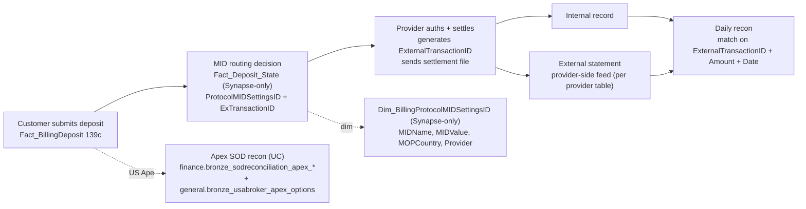

# Cross-domain — Provider Reconciliation

eToro routes customer deposits / withdrawals through external payment providers (Worldpay, SafeCharge / Nuvei, PayPal, Skrill, Neteller, OpenPayd in UK, etc.). Each provider sends back a daily settlement file. This cross-domain skill captures how to JOIN our internal deposit row to the provider's settlement record so finance / payment-ops can answer "did Worldpay pay us what we expected".

**Side classification:** dealer/finance-side external reconciliation. The customer-facing flow lives in `deposits-and-withdrawals` (C.1); the balance answer lives in `finance-recon-and-balances` (C.5). This skill stitches across them via MID routing.

> **Mixed UC / Synapse coverage.** The MID-routing core (`Fact_Deposit_State`, `Fact_Cashout_State`, `Dim_BillingProtocolMIDSettingsID`) is **Synapse-only / `_Not_Migrated`** — see Critical Warning 1. The Apex SOD recon IS in UC and can run in Genie.

## When to Use

Load when the question is about **external payment-provider reconciliation**:

- "What's our approval rate by MID this week / month?"
- "Match a single provider statement row (ExternalTransactionID) to our internal deposit"
- "Daily provider settlement total vs internal expected — show me the gap per provider"
- "Apex SOD cash vs BuyingPower vs Options portfolio for AccountId X"
- "Per-provider chargeback rates" (then bridge to `refund-chargeback-chain`)
- "Settlement timing — provider settled T+1 vs T+3 latency analysis"

Do NOT load for:

- **What's the approval rate this week** (single-platform, no provider drill) → `deposits-and-withdrawals` (C.1) alone.
- **Customer balance / cross-platform balance state** → `finance-recon-and-balances` (C.5) alone.
- **Refund / chargeback chain on a single dispute** → `refund-chargeback-chain`.
- **EXW (crypto-wallet) provider recon** → `EXW_PaymentReconciliation` is `_Not_Migrated`; from Databricks, do the recon via `wallet.bronze_walletdb_wallet_*` ledger + Tier-3 `EXW_FinanceReportsBalancesNew` drift columns (see `crypto-wallet.md` Critical Warning 2). Don't try to use this skill.
- **Aggregate fee / reversal volume** → `domain-revenue-and-fees`.

## Scope

In scope: MID-decoding chain (`Fact_Deposit_State` → `Dim_BillingProtocolMIDSettingsID` → MIDName/MIDValue/MOPCountry/Provider — Synapse-only); internal deposit/withdraw canonical (`Fact_BillingDeposit` 139c, `Fact_BillingWithdraw` 86c, `BI_DB_DepositWithdrawFee` 48c, `_Reversals` 45c); Apex SOD recon (7 tables across `finance` + `general`); cross-link to `refund-chargeback-chain` for chargeback-as-reversal forensics.
Out of scope: customer-facing deposit flow (`deposits-and-withdrawals`), customer-balance state (`finance-recon-and-balances`), single-dispute forensic chain (`refund-chargeback-chain`), EXW crypto provider recon (currently Synapse-only — manually replicate via `wallet.bronze_walletdb_wallet_*` ledger + `EXW_FinanceReportsBalancesNew` drift columns), aggregate reversal/fee volume (`domain-revenue-and-fees`).
Last verified: 2026-05-11

## Critical Warnings

1. **Tier 1 — Three `_Not_Migrated` tables make Databricks Genie unable to do MID-level recon.** `DWH_dbo.Fact_Deposit_State` (`alter.sql` says `_Not_Migrated`), `DWH_dbo.Fact_Cashout_State` (wiki-only, never ingested), `DWH_dbo.Dim_BillingProtocolMIDSettingsID` (wiki-only, never ingested) are **NOT in UC**. From Databricks the MID-decoding join will fail. **Run provider-recon SQL against Synapse directly** via the `user-synapse_prod_sql` / `user-synapse_sql` MCP servers, or pyodbc. The Apex SOD recon IS in UC and is the only part of this skill that can run in Genie unaided.
2. **Tier 1 — `EXW_PaymentReconciliation` is also `_Not_Migrated`** — `alter.sql` confirms. The EXW (crypto-wallet) side recon table cannot be queried from Databricks. To do the same crypto-recon analysis from Genie, use `EXW_FinanceReportsBalancesNew` (40c — drift between internal `WalletDBBalance` / `ComputedAmount` and external `ProviderValue` / `WalletTrackerValue`); see `crypto-wallet.md` Critical Warning 2.
3. **Tier 1 — MID routing lives on `Fact_Deposit_State`, NOT `Fact_BillingDeposit`.** Always join via the State table to get `ProtocolMIDSettingsID`, then to `Dim_BillingProtocolMIDSettingsID` for `MIDName` / `MIDValue` / `MOPCountry` / `Provider`. This is **only runnable from Synapse**.
4. **Tier 1 — Apex = USABroker = same broker that clears Options for Gatsby AND US-resident customer equities — three roles, one broker.** SOD recon files split across schemas: `finance.bronze_sodreconciliation_apex_ext869_cashactivity` (45c), `ext870_stockactivity` (32c), `ext872_tradeactivity` (71c), `ext922_dividendreport` (31c), `ext1047_revenuereports` (24c), `sodfiles` (11c); `general.bronze_sodreconciliation_apex_ext981_buypowersummary` (61c); `general.bronze_usabroker_apex_options` (17c). Join on `AccountId + ReportDate`.
5. **Tier 2 — Filter `TransactionType = 'Deposit'` (or `'Withdraw'`) on the State join.** Other transaction types in `Fact_Deposit_State` are reversal / rollback enrichment rows and would double-count.
6. **Tier 2 — `ExTransactionID` is the provider's primary key, not eToro's.** Different providers use different ID formats (numeric, GUID, alphanumeric). Trim / normalize before string compare.
7. **Tier 2 — Provider statement feed schemas vary.** Worldpay, SafeCharge / Nuvei, PayPal, Skrill, Neteller, OpenPayd — each lands in a different table with different column names. There is no universal "settlement file" table. Build per-provider matching.
8. **Tier 2 — Net vs Gross.** Provider statements are typically NET of provider fee; internal `AmountUSD` is GROSS. Reconciliation must subtract provider fee before comparing — and provider fee composition lives in `domain-revenue-and-fees`.
9. **Tier 2 — Settlement date ≠ deposit date.** Providers settle T+1, T+2 or longer depending on agreement. Always use SETTLEMENT date on the external side and JOIN on a date window, not equality.
10. **Tier 3 — `MOPCountry` = method-of-payment country.** Useful for routing rules ("UK customer must use UK MID"). NULL for some providers.
11. **Tier 3 — One MID can be used by many countries / customers**, and one customer can be routed to multiple MIDs over time (failover). Don't assume CID→MID is stable.
12. **Tier 3 — Provider chargebacks come back as a different transaction type** — they appear in `Fact_Deposit_State` as a reversal row referencing the original `DepositID`. For chargeback investigation chain → `refund-chargeback-chain.md`.

## The chain



## Key tables

| Table | UC | Role |
|---|---|---|
| `DWH_dbo.Fact_Deposit_State` | **NO** (`_Not_Migrated`) | Carries `ProtocolMIDSettingsID` + `ExTransactionID`. PRIMARY join target. Filter `TransactionType='Deposit'`. Synapse-only. |
| `DWH_dbo.Fact_Cashout_State` | **NO** (wiki-only) | Withdraw-side equivalent. Synapse-only. |
| `DWH_dbo.Dim_BillingProtocolMIDSettingsID` | **NO** (wiki-only) | Decodes `ProtocolMIDSettingsID` → `MIDName, MIDValue, MOPCountry, Provider`. Synapse-only. |
| `DWH_dbo.Fact_BillingDeposit` (139c) | YES | Internal canonical deposit row. Join via `DepositID`. |
| `DWH_dbo.Fact_BillingWithdraw` (86c) | YES | Same for withdrawals. Join via `WithdrawID` (or `WithdrawPaymentID`). |
| `EXW_dbo.EXW_PaymentReconciliation` | **NO** (`_Not_Migrated`) | EXW (crypto-wallet) provider-side recon. Use `EXW_FinanceReportsBalancesNew` from Databricks as the drift-recon analog. |
| `finance.bronze_sodreconciliation_apex_ext869_cashactivity` (45c) | YES | Apex SOD cash activity. |
| `finance.bronze_sodreconciliation_apex_ext870_stockactivity` (32c) | YES | Apex SOD stock activity. |
| `finance.bronze_sodreconciliation_apex_ext872_tradeactivity` (71c) | YES | Apex SOD trade activity. |
| `finance.bronze_sodreconciliation_apex_ext922_dividendreport` (31c) | YES | Apex SOD dividend report. |
| `finance.bronze_sodreconciliation_apex_ext1047_revenuereports` (24c) | YES | Apex SOD revenue reports. |
| `general.bronze_sodreconciliation_apex_ext981_buypowersummary` (61c) | YES | Apex BuyingPower summary. |
| `general.bronze_usabroker_apex_options` (17c) | YES | Apex US options portfolio. |

## Canonical SQL patterns

```sql
-- 1. MID-level decline rate (SYNAPSE — Fact_Deposit_State + Dim_BillingProtocolMIDSettingsID are NOT in UC)
SELECT
  dmid.MIDName,
  dmid.MIDValue,
  dmid.Provider,
  dmid.MOPCountry,
  COUNT(*) AS attempts,
  SUM(CASE WHEN fbd.PaymentStatusID = 2  THEN 1 ELSE 0 END) AS approved,
  SUM(CASE WHEN fbd.PaymentStatusID = 35 THEN 1 ELSE 0 END) AS declined,
  CAST(SUM(CASE WHEN fbd.PaymentStatusID = 2 THEN 1 ELSE 0 END) AS FLOAT) / COUNT(*) AS approval_rate
FROM DWH_dbo.Fact_BillingDeposit fbd
JOIN DWH_dbo.Fact_Deposit_State  fds
       ON fds.DepositID       = fbd.DepositID
      AND fds.TransactionType = 'Deposit'
JOIN DWH_dbo.Dim_BillingProtocolMIDSettingsID dmid
       ON dmid.ProtocolMIDSettingsID = fds.ProtocolMIDSettingsID
WHERE fbd.ModificationDateID BETWEEN @from AND @to
GROUP BY dmid.MIDName, dmid.MIDValue, dmid.Provider, dmid.MOPCountry
ORDER BY attempts DESC;
```

```sql
-- 2. Match a provider statement row to internal record (SYNAPSE)
SELECT fbd.DepositID, fbd.CID, fbd.PaymentStatusID, fbd.Amount, fbd.AmountUSD,
       fds.ExTransactionID, dmid.MIDName, fbd.ModificationDate
FROM DWH_dbo.Fact_Deposit_State fds
JOIN DWH_dbo.Fact_BillingDeposit fbd ON fbd.DepositID = fds.DepositID
JOIN DWH_dbo.Dim_BillingProtocolMIDSettingsID dmid
       ON dmid.ProtocolMIDSettingsID = fds.ProtocolMIDSettingsID
WHERE fds.ExTransactionID  = @provider_tx_id
  AND fds.TransactionType  = 'Deposit';
```

```sql
-- 3. Apex SOD recon — cash + BuyingPower + Options portfolio (UC)
SELECT ca.AccountId, ca.ReportDate,
       ca.CashActivity                   AS cash_activity,
       bp.BuyingPower                    AS apex_buying_power,
       opt.PortfolioMarketValue          AS apex_options_mv
FROM      main.finance.bronze_sodreconciliation_apex_ext869_cashactivity   ca
LEFT JOIN main.general.bronze_sodreconciliation_apex_ext981_buypowersummary bp
       ON bp.AccountId = ca.AccountId AND bp.ReportDate = ca.ReportDate
LEFT JOIN main.general.bronze_usabroker_apex_options                        opt
       ON opt.AccountId = ca.AccountId AND opt.ReportDate = ca.ReportDate
WHERE ca.ReportDate = :as_of_date;
```

```sql
-- 4. Daily provider settlement total vs internal expected (SYNAPSE; per-provider table varies)
WITH internal AS (
  SELECT
    fbd.ModificationDateID AS DateID, dmid.Provider,
    SUM(fbd.AmountUSD) AS internal_expected_USD, COUNT(*) AS internal_count
  FROM DWH_dbo.Fact_BillingDeposit fbd
  JOIN DWH_dbo.Fact_Deposit_State fds
       ON fds.DepositID       = fbd.DepositID
      AND fds.TransactionType = 'Deposit'
  JOIN DWH_dbo.Dim_BillingProtocolMIDSettingsID dmid
       ON dmid.ProtocolMIDSettingsID = fds.ProtocolMIDSettingsID
  WHERE fbd.PaymentStatusID = 2
    AND fbd.ModificationDateID BETWEEN @from AND @to
  GROUP BY fbd.ModificationDateID, dmid.Provider
),
external AS (
  SELECT SettlementDateID AS DateID, 'Worldpay' AS Provider,
         SUM(NetAmountUSD) AS provider_settled_USD, COUNT(*) AS provider_count
  FROM external_provider.worldpay_daily_settlement
  WHERE SettlementDateID BETWEEN @from AND @to
  GROUP BY SettlementDateID
)
SELECT i.DateID, i.Provider, i.internal_expected_USD, e.provider_settled_USD,
       i.internal_expected_USD - e.provider_settled_USD AS gap_USD,
       i.internal_count, e.provider_count
FROM internal i LEFT JOIN external e USING (DateID, Provider)
ORDER BY DateID, Provider;
```

## When to load just one parent instead

- "What's our approval rate this week" alone → `deposits-and-withdrawals` (C.1) alone.
- "What's the customer balance" → `finance-recon-and-balances` (C.5) alone.
- "Walk me through a single chargeback dispute" → `refund-chargeback-chain`.
- "Did provider X pay us correctly" / "MID-level breakdown" → load this cross-domain skill (Synapse for the MID-decode).

## Deep reads

- [`Fact_Deposit_State.md`](https://github.com/guyman-tr/Databricks_Knowledge/blob/master/knowledge/synapse/Wiki/DWH_dbo/Tables/Fact_Deposit_State.md) — Synapse-only
- [`Dim_BillingProtocolMIDSettingsID.md`](https://github.com/guyman-tr/Databricks_Knowledge/blob/master/knowledge/synapse/Wiki/DWH_dbo/Tables/Dim_BillingProtocolMIDSettingsID.md) — Synapse-only
- [`EXW_PaymentReconciliation.md`](https://github.com/guyman-tr/Databricks_Knowledge/blob/master/knowledge/synapse/Wiki/EXW_dbo/Tables/EXW_PaymentReconciliation.md) — Synapse-only

## Skill provenance

- Column counts and UC FQN existence verified 2026-05-11 against `system.information_schema.columns`. Apex SOD recon: `ext869`=45, `ext870`=32, `ext872`=71, `ext922`=31, `ext1047`=24, `sodfiles`=11, `ext981`=61, `bronze_usabroker_apex_options`=17. Internal: `Fact_BillingDeposit`=139, `Fact_BillingWithdraw`=86, `BI_DB_DepositWithdrawFee`=48, `_Reversals`=45.
- `_Not_Migrated` confirmed (not in UC, Synapse-only): `Fact_Deposit_State`, `Fact_Cashout_State`, `Dim_BillingProtocolMIDSettingsID`, `EXW_PaymentReconciliation`.
- Intersecting skills: `domain-payments/deposits-and-withdrawals`, `domain-payments/finance-recon-and-balances`, `domain-cross/refund-chargeback-chain`, `domain-revenue-and-fees/SKILL` (for provider-fee composition + reversal-side fee accounting).
