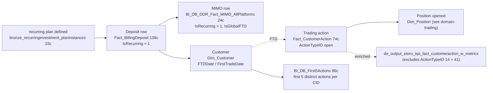

# Cross-domain — Recurring Deposit -> Trade Funnel

The flagship eToro funnel story. A customer **deposits** — sometimes once, sometimes on a recurring plan — and then opens trading positions. This cross-domain skill captures the join from the deposit (C.1 / C.2) to the resulting trade (Trading super-domain) and answers "how often did the deposit lead to a trade, and how soon."

**Side classification:** broker-side customer flow (the customer's funnel). Dealer-side execution / hedge cost is unrelated.

> **Genie / SQL note.** SQL examples use **Unity Catalog FQNs** from `required_tables:`.

## When to Use

Load when the question spans **deposit event → subsequent trading action**:

- "What % of FTDs trade within their first 7 days?"
- "Recurring-plan subscribers and whether they traded in the next N days"
- "Customers whose only trade ever was within 24h of FTD" (likely quick-loss cohort)
- "Of customers who set up recurring deposits in Q1, how many were still active by end of Q3?"
- "Cadence ($50/wk vs $200/mo) effect on first-position size"
- "First-action sequence per CID" (use `BI_DB_First5Actions`)
- "Deposit-to-trade lag distribution"

Do NOT load for:

- **Recurring-deposit count this month** alone → `deposits-and-withdrawals` (C.1) or `mimo-panel-and-ddr` (C.2).
- **First-trade volume by cohort** alone → Trading super-domain (using `Dim_Customer.FirstTradeDate`).
- **Customer onboarding funnel (registration → KYC → FTD)** without trade dimension → `domain-customer-and-identity` referenced workspace skill `registration-to-ftd-funnel`.
- **Revenue per first trade** → `domain-revenue-and-fees`.

## Scope

In scope: the FTD-to-FT join via `Dim_Customer.FTDDate` + `FirstTradeDate` (canonical, source-of-truth per CID); recurring-plan analysis via `bronze_recurringinvestment_recurringinvestment_planinstances` (33c) joined to `Fact_BillingDeposit.IsRecurring=1` + `Fact_CustomerAction`; first-action sequencing via `BI_DB_First5Actions` (86c); cohort-level pre-stitched table `de_output_etoro_kpi_fact_customeraction_w_metrics` (excludes ActionTypeID 14 + 41); cross-platform FTD via `MIMO_AllPlatforms.IsGlobalFTD`.
Out of scope: pure deposit aggregation (`deposits-and-withdrawals`), pure trading P&L (`domain-trading`), customer registration funnel (`domain-customer-and-identity` referenced workspace skill), revenue per first trade (`domain-revenue-and-fees`), Compensation / bonus pay-outs.
Last verified: 2026-05-11

## Critical Warnings

1. **Tier 1 — `Dim_Customer.FTDDate` is the canonical first-deposit-date per CID.** DO NOT compute `MIN(ModificationDate)` from `Fact_BillingDeposit` yourself — bad-FTD exclusions, `REMOVE_BAD_FTDS` cohort filtering, and timezone normalisations are baked into the canonical field. Similarly, `FirstTradeDate` excludes practice / virtual mode and is the first REAL-money trade.
2. **Tier 1 — `IsRecurring = 1` on `Fact_BillingDeposit` marks the DEPOSIT as initiated by a recurring plan, NOT that the customer currently has an active plan.** A plan can have ended (paused / cancelled), but past deposits still carry `IsRecurring = 1`. For "is the customer currently on a plan", join to `bronze_recurringinvestment_recurringinvestment_planinstances` (33c) with its lifecycle status filter.
3. **Tier 1 — `de_output_etoro_kpi_fact_customeraction_w_metrics` (canonical UC table) EXCLUDES ActionTypeID 14 + 41.** This is the pre-stitched cross-domain table that enriches `Fact_CustomerAction` (74c) with the most relevant DDR metrics at the most granular transaction level (TP revenues, special compensation types, classifiers like CopyFunds / SQF / TradeFromIBAN). Prefer it over manual JOINs unless the query is purely Synapse-side OR you specifically need ActionTypeID 14 / 41 rows. Lives at `main.de_output.de_output_etoro_kpi_fact_customeraction_w_metrics`.
4. **Tier 2 — For cross-platform "deposit then trade" go to MIMO.** `BI_DB_DDR_Fact_MIMO_AllPlatforms` (24c) has `IsRecurring` AND an FTD framing already (`IsGlobalFTD` — true cross-platform first deposit, not per-platform). The trade side still needs `Fact_CustomerAction` / `Dim_Position` from the Trading super-domain.
5. **Tier 2 — Trading-side action codes** (`ActionTypeID`) live in `main.dwh.gold_sql_dp_prod_we_dwh_dbo_dim_actiontype` (6c). Open-position codes vary by platform (CFD vs stocks vs crypto wallet purchase). Filter carefully — see `domain-customer-and-identity/customer-action-audit-trail` Critical Warnings for the social `ActionTypeID 21-26` dead-data caveat and the passive/active split.
6. **Tier 2 — Recurring plans can be paused / cancelled / completed.** `bronze_recurringinvestment_recurringinvestment_planinstances` (33c) carries the lifecycle status; filter for active or use lifecycle dates appropriately. The plan record persists post-cancellation.
7. **Tier 2 — `BI_DB_First5Actions` is exactly the first 5 distinct customer actions per CID** (86c) — registration, KYC, FTD, first deposit on TP, first trade, etc. Useful for "what was action #2 / action #3" funnel questions. Limited to 5 — for the 6th+ action drop down to `Fact_CustomerAction` or `de_output_etoro_kpi_fact_customeraction_w_metrics`.
8. **Tier 3 — Time window matters.** "Trade within N days of deposit" — N=1 (intraday), N=7 (weekly), N=30 (monthly) are common bands; the funnel result changes dramatically with N. Pick deliberately and disclose in the answer.
9. **Tier 3 — `Dim_Customer` is type-1 SCD on most attributes.** Both `FTDDate` and `FirstTradeDate` are monotonic — they only set forward — but cohort attributes (regulation, club, country) are overwritten. For point-in-time cohort tagging, use `Fact_SnapshotCustomer` or `customer_snapshot_v` — see `domain-customer-and-identity/identity-jurisdiction-and-regulation`.

## The chain



## Anchor patterns — three layers

1. **`Dim_Customer.FTDDate` + `FirstTradeDate`** — already-computed canonical per-CID dates. For FTD-to-FT funnel at scale, USE THESE — don't re-derive.
2. **`BI_DB_First5Actions` (86c)** — first 5 distinct customer actions per CID. Useful for "what was action #N" funnel questions.
3. **`general.bronze_recurringinvestment_recurringinvestment_planinstances` (33c)** — the recurring-plan definitions. Each row = one customer's recurring plan with cadence, instrument, amount, lifecycle status.
4. **`de_output.de_output_etoro_kpi_fact_customeraction_w_metrics`** — the pre-stitched cross-domain table for cohort-level deposit-to-trade analysis. Critical Warning 3.

## Canonical SQL patterns

```sql
-- 1. FTD-to-FT funnel — already-computed canonical dates (UC)
SELECT
  DATEDIFF(dc.FirstTradeDate, dc.FTDDate) AS days_ftd_to_ft,
  COUNT(*)                                 AS customers
FROM main.dwh.gold_sql_dp_prod_we_dwh_dbo_dim_customer_masked dc
WHERE dc.FTDDate BETWEEN :from_dt AND :to_dt
  AND dc.FirstTradeDate IS NOT NULL
GROUP BY 1
ORDER BY 1;
```

```sql
-- 2. Recurring-plan subscribers and whether they traded in the next N days — UC
SELECT
  rp.CID,
  rp.PlanInstanceID,
  rp.Cadence,
  rp.PlannedAmount,
  rp.PlannedInstrument,
  MIN(fbd.ModificationDate) AS first_deposit_under_plan,
  MIN(fca.ActionDate)       AS first_trade_after_plan
FROM main.general.bronze_recurringinvestment_recurringinvestment_planinstances rp
JOIN main.dwh.gold_sql_dp_prod_we_dwh_dbo_fact_billingdeposit  fbd
       ON fbd.CID             = rp.CID
      AND fbd.IsRecurring     = 1
      AND fbd.PaymentStatusID = 2
LEFT JOIN main.dwh.gold_sql_dp_prod_we_dwh_dbo_fact_customeraction fca
       ON fca.CID          = rp.CID
      AND fca.ActionTypeID IN (1, 2, 5)            -- trade-open action codes; see Dim_ActionType
      AND fca.ActionDate  >= fbd.ModificationDate
      AND fca.ActionDate   < DATE_ADD(fbd.ModificationDate, :window_days)
WHERE rp.PlanCreatedDate BETWEEN :from_dt AND :to_dt
GROUP BY rp.CID, rp.PlanInstanceID, rp.Cadence, rp.PlannedAmount, rp.PlannedInstrument;
```

```sql
-- 3. Pre-stitched cohort-level deposit-to-trade (UC; excludes ActionTypeID 14 + 41)
SELECT *
FROM main.de_output.de_output_etoro_kpi_fact_customeraction_w_metrics
WHERE DateID BETWEEN :from_dt AND :to_dt
  AND CID = :cid;
```

```sql
-- 4. What was action #N for this customer (UC)
SELECT *
FROM main.bi_db.gold_sql_dp_prod_we_bi_db_dbo_bi_db_first5actions
WHERE CID = :cid
ORDER BY ActionOrdinal;
```

```sql
-- 5. Cross-platform FTD via MIMO (UC; IsGlobalFTD respects bad-FTD exclusions)
SELECT m.MIMOPlatform, COUNT(*) AS global_ftds, SUM(m.AmountUSD) AS ftd_usd
FROM main.bi_db.gold_sql_dp_prod_we_bi_db_dbo_bi_db_ddr_fact_mimo_allplatforms m
WHERE m.IsGlobalFTD = 1
  AND m.DateID BETWEEN :from_dt AND :to_dt
GROUP BY m.MIMOPlatform
ORDER BY global_ftds DESC;
```

## When to load just one parent instead

- "Recurring-deposit count this month" alone → `deposits-and-withdrawals` (C.1) or `mimo-panel-and-ddr` (C.2).
- "First-trade volume by cohort" alone → Trading super-domain (using `Dim_Customer.FirstTradeDate`).
- "What % of registrations FTD'd?" → `domain-customer-and-identity` workspace skill `registration-to-ftd-funnel`.
- "Both: did the deposit lead to a trade?" → load this cross-domain skill.

## Common questions this cross-domain skill answers

- "What % of FTDs trade within their first 7 days?"
- "For customers on a recurring deposit plan, how does cadence ($50/wk vs $200/mo) affect first-position size?"
- "Show me CIDs whose only trade ever was within 24h of FTD" (quick-loss cohort)
- "Of customers who set up recurring deposits in Q1, how many were still active by end of Q3?"

## Deep reads

- [`Fact_BillingDeposit.md`](https://github.com/guyman-tr/Databricks_Knowledge/blob/master/knowledge/synapse/Wiki/DWH_dbo/Tables/Fact_BillingDeposit.md) — 139c, IsRecurring + IsGlobalFTD context
- [`Fact_CustomerAction.md`](https://github.com/guyman-tr/Databricks_Knowledge/blob/master/knowledge/synapse/Wiki/DWH_dbo/Tables/Fact_CustomerAction.md) — 74c
- [`BI_DB_First5Actions.md`](https://github.com/guyman-tr/Databricks_Knowledge/blob/master/knowledge/synapse/Wiki/BI_DB_dbo/Tables/BI_DB_First5Actions.md) — 86c

## Skill provenance

- Column counts and UC FQN existence verified 2026-05-11 against `system.information_schema.columns`. Key counts: `Fact_BillingDeposit`=139, `Fact_CustomerAction`=74, `BI_DB_First5Actions`=86, `bronze_recurringinvestment_planinstances`=33, `Dim_ActionType`=6, `MIMO_AllPlatforms`=24.
- `de_output_etoro_kpi_fact_customeraction_w_metrics` is the canonical UC table version of the legacy Synapse view (which excludes ActionTypeID 14 + 41). See `domain-customer-and-identity/customer-action-audit-trail` for the full action-trail context.
- Intersecting skills: `domain-payments/deposits-and-withdrawals`, `domain-payments/mimo-panel-and-ddr`, `domain-trading/SKILL` (planned home of Dim_Position), `domain-customer-and-identity/customer-action-audit-trail`, `domain-customer-and-identity` workspace skill `registration-to-ftd-funnel`.
