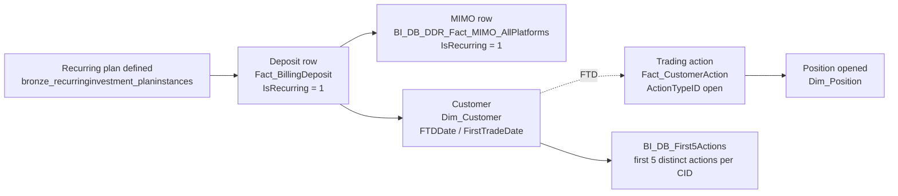

# Cross-domain skill — Recurring Deposit → Trade

The flagship eToro funnel story. A customer deposits — sometimes once,
sometimes on a recurring plan — and then opens trading positions. This
cross-domain skill captures the join from the deposit (C.1 / C.2) to the resulting
trade (Trading) and answers "how often did the deposit lead to a trade,
and how soon."

> **Genie / SQL note:** SQL examples below use **Unity Catalog FQNs**.
> Synapse names in prose are aliases — see `primary_objects:` for the
> canonical UC FQN.

## The chain



## Anchor patterns

There are 3 layers depending on what you need:

1. **`Dim_Customer.FTDDate` and `Dim_Customer.FirstTradeDate`** — already-computed canonical "first deposit date" and "first trade date" per CID. For *FTD-to-FT funnel* analysis at scale, USE THESE — don't re-derive.
2. **`BI_DB_dbo.BI_DB_First5Actions`** — first 5 distinct customer actions per CID (e.g. registration, KYC, FTD, first deposit on TP, first trade). Useful for "what was action #2 / action #3" funnel questions.
3. **`general.bronze_recurringinvestment_recurringinvestment_planinstances`** *(UC bronze)* — the recurring-plan definitions. Each row = one customer's recurring investment plan instance with cadence, instrument, amount.
4. **`de_output.de_output_etoro_kpi_fact_customeraction_w_metrics`** *(UC table — `de_output` schema)* — already enriches `Fact_CustomerAction` with the most relevant DDR metrics (TP revenues, special comp types, classifiers like CopyFunds / SQF / TradeFromIBAN, …) at the most granular transaction level. **Excludes ActionTypeID 14 + 41** (large + irrelevant) and prunes some columns. **This is the pre-stitched cross-domain table.** Use it for cohort-level "deposit → trade" analysis.

## Canonical patterns

```sql
-- 1. FTD-to-FT funnel — already-computed canonical dates
SELECT
  DATEDIFF(dc.FirstTradeDate, dc.FTDDate) AS days_ftd_to_ft,
  COUNT(*)                                 AS customers
FROM main.dwh.gold_sql_dp_prod_we_dwh_dbo_dim_customer_masked dc
WHERE dc.FTDDate BETWEEN :from_dt AND :to_dt
  AND dc.FirstTradeDate IS NOT NULL
GROUP BY 1
ORDER BY 1
```

```sql
-- 2. Recurring-plan subscribers and whether they traded in the next N days
SELECT
  rp.CID,
  rp.PlanInstanceID,
  rp.Cadence,
  rp.PlannedAmount,
  rp.PlannedInstrument,
  MIN(fbd.ModificationDate) AS first_deposit_under_plan,
  MIN(fca.ActionDate)       AS first_trade_after_plan
FROM main.general.bronze_recurringinvestment_recurringinvestment_planinstances rp
JOIN main.dwh.gold_sql_dp_prod_we_dwh_dbo_fact_billingdeposit  fbd
       ON fbd.CID = rp.CID
      AND fbd.IsRecurring = 1
      AND fbd.PaymentStatusID = 2
LEFT JOIN main.dwh.gold_sql_dp_prod_we_dwh_dbo_fact_customeraction fca
       ON fca.CID = rp.CID
      AND fca.ActionTypeID IN (/* trade-open action codes */ 1, 2, 5)
      AND fca.ActionDate >= fbd.ModificationDate
      AND fca.ActionDate <  DATE_ADD(fbd.ModificationDate, :window_days)
WHERE rp.PlanCreatedDate BETWEEN :from_dt AND :to_dt
GROUP BY rp.CID, rp.PlanInstanceID, rp.Cadence, rp.PlannedAmount, rp.PlannedInstrument
```

```sql
-- 3. Pre-stitched table for cohort-level analysis
--    (de_output schema, TABLE; excludes ActionTypeID 14 + 41)
SELECT *
FROM main.de_output.de_output_etoro_kpi_fact_customeraction_w_metrics
WHERE DateID BETWEEN :from_dt AND :to_dt
  AND CID = :cid
```

```sql
-- 4. "What was action #N for this customer" using First5
SELECT *
FROM main.bi_db.gold_sql_dp_prod_we_bi_db_dbo_bi_db_first5actions
WHERE CID = :cid
ORDER BY ActionOrdinal
```

## Gotchas

1. **`Dim_Customer.FTDDate` is the source of truth for first-time-deposit-date.** Don't compute `MIN(ModificationDate)` from `Fact_BillingDeposit` — there are bad-FTD exclusions and timezone normalisations baked in.
2. **`FirstTradeDate` excludes practice / virtual mode.** It's the first REAL-money trade.
3. **Recurring plans can be paused/canceled.** `bronze_recurringinvestment_planinstances` has lifecycle status — filter for active or use lifecycle dates appropriately.
4. **`IsRecurring = 1` on `Fact_BillingDeposit` marks the DEPOSIT as initiated by a recurring plan.** It does NOT mean the customer has a plan currently active. A plan can have ended, but the past deposits still carry `IsRecurring = 1`.
5. **For cross-platform "deposit then trade" go to MIMO** — `BI_DB_DDR_Fact_MIMO_AllPlatforms` has `IsRecurring`, plus an FTD framing already (`IsGlobalFTD`). The trade side still needs `Fact_CustomerAction` / `Dim_Position`.
6. **Trading-side action codes** (`ActionTypeID`) — see `DWH_dbo.Dim_ActionType` for the full enum. Open-position codes vary by platform (CFD vs stocks vs crypto wallet purchase). Filter carefully.
7. **`de_output.de_output_etoro_kpi_fact_customeraction_w_metrics` is a UC TABLE** (not a view), in the `de_output` schema, that pre-enriches `Fact_CustomerAction` with the most relevant DDR metrics. **It excludes ActionTypeID 14 + 41** (large + irrelevant) and prunes some columns. Prefer it over manual JOINs unless the query is purely Synapse-side or you specifically need ActionTypeID 14/41 rows.
8. **Time window matters.** "Trade within N days of deposit" — N=1 (intraday), N=7 (weekly), N=30 (monthly) are common bands. The funnel result changes dramatically with N; pick deliberately.

## Common questions this cross-domain skill answers

- "What % of FTDs trade within their first 7 days?"
- "For customers on a recurring deposit plan, how does cadence ($50/wk vs $200/mo) affect first-position size?"
- "Show me CIDs whose only trade ever was within 24h of FTD" (likely indication of a quick-loss cohort)
- "Of customers who set up recurring deposits in Q1, how many were still active by end of Q3?"

## When to load just one parent instead

- "Recurring-deposit count this month" alone → C.1 / C.2 alone.
- "First-trade volume by cohort" alone → Trading alone (using `Dim_Customer.FirstTradeDate`).
- "Both: did the deposit lead to a trade" → load this cross-domain skill.
