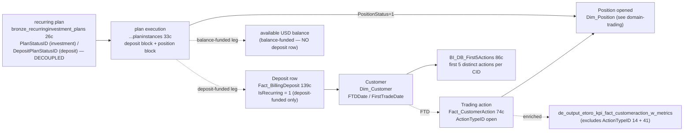

# Cross-domain — Recurring Deposits & Investments

The flagship eToro funnel story. A customer **deposits** — sometimes once, sometimes on a recurring plan — and then opens trading positions. This cross-domain skill captures the join from the deposit (C.1 / C.2) to the resulting trade (Trading super-domain) and answers "how often did the deposit lead to a trade, and how soon."

> **⚠ Deposit ↔ recurring-trade decoupling (live in prod ~2026-06).** Historically a Recurring Investment was a coupled event: a recurring **deposit** funded a recurring **position open** — so deposit-side and trade-side recurring counts agreed. That coupling is now broken — a recurring position can be funded directly from the customer's **available USD balance**, with **no new deposit**. These are now **two distinct measures on two sides, each complete and correct for what it measures** — do NOT use one as a proxy for the other: (a) **deposit side** — `Fact_BillingDeposit.IsRecurring=1` / MIMO `IsRecurring` correctly count recurring **deposits** (a balance-funded position is genuinely *not* a deposit, so its absence is correct, not a miss); (b) **trade side** — recurring **positions/trades** are counted independently of any deposit via the `BI_DB_RecurringInvestment_Positions` PositionID flag and `PlanInstances.PositionStatus`. The two populations now diverge. The authoritative plan-level source is the **RecurringInvestment Plans/PlanInstances** tables, which track the investment-plan lifecycle and the deposit-plan lifecycle as **separate** columns. See Critical Warning 3 and the **Infrastructure / ETL impact** section.

**Side classification:** broker-side customer flow (the customer's funnel). Dealer-side execution / hedge cost is unrelated.

> **Genie / SQL note.** SQL examples use **Unity Catalog FQNs** from `required_tables:`.

## When to Use

Load when the question spans **deposit event → subsequent trading action**:

- "What % of FTDs trade within their first 7 days?"
- "Recurring-plan subscribers and whether they traded in the next N days"
- "Customers whose only trade ever was within 24h of FTD" (likely quick-loss cohort)
- "Of customers who set up recurring deposits in Q1, how many were still active by end of Q3?"
- "Cadence ($50/wk vs $200/mo) effect on first-position size"
- "First-action sequence per CID" (use `BI_DB_First5Actions`)
- "Deposit-to-trade lag distribution"

Do NOT load for:

- **Recurring-deposit count this month** alone → `deposits-and-withdrawals` (C.1) or `mimo-panel-and-ddr` (C.2).
- **First-trade volume by cohort** alone → Trading super-domain (using `Dim_Customer.FirstTradeDate`).
- **Customer onboarding funnel (registration → KYC → FTD)** without trade dimension → `domain-customer-and-identity` referenced workspace skill `registration-to-ftd-funnel`.
- **Revenue per first trade** → `domain-revenue-and-fees`.

## Scope

In scope: the FTD-to-FT join via `Dim_Customer.FTDDate` + `FirstTradeDate` (canonical, source-of-truth per CID); recurring-plan analysis via the RecurringInvestment `Plans` (26c, dual `PlanStatusID`/`DepositPlanStatusID` lifecycles) + `PlanInstances` (33c, per-execution deposit/position blocks) tables — with `Fact_BillingDeposit.IsRecurring=1` only as the deposit-funded subset; first-action sequencing via `BI_DB_First5Actions` (86c); cohort-level pre-stitched table `de_output_etoro_kpi_fact_customeraction_w_metrics` (excludes ActionTypeID 14 + 41); cross-platform FTD via `MIMO_AllPlatforms.IsGlobalFTD`.
Out of scope: pure deposit aggregation (`deposits-and-withdrawals`), pure trading P&L (`domain-trading`), customer registration funnel (`domain-customer-and-identity` referenced workspace skill), revenue per first trade (`domain-revenue-and-fees`), Compensation / bonus pay-outs.
Last verified: 2026-06-25

## Critical Warnings

1. **Tier 1 — `Dim_Customer.FTDDate` is the canonical first-deposit-date per CID.** DO NOT compute `MIN(ModificationDate)` from `Fact_BillingDeposit` yourself — bad-FTD exclusions, `REMOVE_BAD_FTDS` cohort filtering, and timezone normalisations are baked into the canonical field. Similarly, `FirstTradeDate` excludes practice / virtual mode and is the first REAL-money trade.
2. **Tier 1 — `IsRecurring = 1` on `Fact_BillingDeposit` measures recurring DEPOSITS, NOT recurring trades and NOT "has an active plan".** It correctly and completely counts deposits that were initiated by a recurring plan — that is its job; it does not under-count deposits. What it must NOT be used for is counting recurring **positions/trades**: since the 2026-06 decoupling (Warning 3) a recurring position can open with no deposit, so the deposit-funded population and the recurring-position population are different sets. Also note a deposit keeps `IsRecurring=1` even after the plan is cancelled. For "how many recurring positions opened" use the trade side (`BI_DB_RecurringInvestment_Positions` / `PlanInstances.PositionStatus`); for "is the customer currently on a plan" use `Plans.PlanStatusID`.
3. **Tier 1 — Deposit and recurring-trade are DECOUPLED (live in prod ~2026-06).** A recurring **position open** can be funded from the customer's **available USD balance** with **no new deposit** — so a recurring trade no longer implies a recurring deposit. This is modelled as two independent lifecycles on `bronze_recurringinvestment_recurringinvestment_plans` (26c): **`PlanStatusID`** = the investment/trade plan (`0=Initializing, 1=Active, 2=Cancelled, 3=Stopped, 4=Invalid` — dict `bi_db.bronze_recurringinvestment_dictionary_planstatus`) and **`DepositPlanStatusID`** = a SEPARATE recurring-deposit plan, **frequently NULL** when the investment is funded from balance. As of 2026-06-25, ~18,950 of ~19,497 currently-active investment plans (`PlanStatusID=1`) have **no active deposit plan** (`DepositPlanStatusID` NULL/cancelled). `RecurringDepositID` links to the deposit plan only when one exists. To count recurring **investments/positions**, drive off `PlanStatusID` / `PlanInstances.PositionStatus`; to count recurring **deposits**, drive off `DepositPlanStatusID` / the deposit-side columns — never assume one implies the other.
4. **Tier 1 — `de_output_etoro_kpi_fact_customeraction_w_metrics` (canonical UC table) EXCLUDES ActionTypeID 14 + 41.** This is the pre-stitched cross-domain table that enriches `Fact_CustomerAction` (74c) with the most relevant DDR metrics at the most granular transaction level (TP revenues, special compensation types, classifiers like CopyFunds / SQF / TradeFromIBAN). Prefer it over manual JOINs unless the query is purely Synapse-side OR you specifically need ActionTypeID 14 / 41 rows. Lives at `main.de_output.de_output_etoro_kpi_fact_customeraction_w_metrics`.
5. **Tier 2 — For cross-platform "deposit then trade" go to MIMO.** `BI_DB_DDR_Fact_MIMO_AllPlatforms` (24c) has `IsRecurring` AND an FTD framing already (`IsGlobalFTD` — true cross-platform first deposit, not per-platform). MIMO `IsRecurring` is deposit-side — it correctly counts recurring **deposits** cross-platform; it is NOT a recurring-trade count (per Warning 2). For recurring **trades** join the trade side (`Fact_CustomerAction` / `Dim_Position` + the `BI_DB_RecurringInvestment_Positions` flag) from the Trading super-domain.
6. **Tier 2 — Trading-side action codes** (`ActionTypeID`) live in `main.dwh.gold_sql_dp_prod_we_dwh_dbo_dim_actiontype` (6c). Open-position codes vary by platform (CFD vs stocks vs crypto wallet purchase). Filter carefully — see `domain-customer-and-identity/customer-action-audit-trail` Critical Warnings for the social `ActionTypeID 21-26` dead-data caveat and the passive/active split.
7. **Tier 2 — `PlanInstances` (33c) is the per-execution log, and it decouples the deposit outcome from the position outcome by design.** Each row is one scheduled execution (PK `PlanID`+`NextOrderDate`) carrying a **deposit block** (`DepositID`, `DepositDate`, `DepositAmountUsd`, `HighLevelDepositStatusId` 1=Success/2=SoftDecline/3=HardDecline, `DepositStatusID`, `DepositFailReason`) AND an **independent position block** (`OrderStatusId`, `OrderID`, `PositionStatus` 1=Success…, `PositionAmountUsd`, `PositionExecutionDate`, `PositionFailErrorCode`). `InstanceStatusID` is the instance verdict (`1=Success, 2=Cancelled, 3=Skipped, 4=UserSkipped, 5=InProgress, 6=Technical Issue, 7=Completed without position`). Successful positions (`PositionStatus=1`) with a `$0`/declined deposit already exist (hundreds/month and growing) — proof that the position leg fires without a funding deposit. The table is **system-versioned** (`ValidFrom`/`ValidTo`); filter `ValidTo > current_timestamp()` for the current version. Many DEPRECATED columns are marked for deletion (`DepositAmount*`, `Notification*`, `InstanceStatus` BOOLEAN) — use `InstanceStatusID`, not the legacy `InstanceStatus`.
8. **Tier 2 — `BI_DB_First5Actions` is exactly the first 5 distinct customer actions per CID** (86c) — registration, KYC, FTD, first deposit on TP, first trade, etc. Useful for "what was action #2 / action #3" funnel questions. Limited to 5 — for the 6th+ action drop down to `Fact_CustomerAction` or `de_output_etoro_kpi_fact_customeraction_w_metrics`.
9. **Tier 3 — Time window matters.** "Trade within N days of deposit" — N=1 (intraday), N=7 (weekly), N=30 (monthly) are common bands; the funnel result changes dramatically with N. Pick deliberately and disclose in the answer.
10. **Tier 3 — `Dim_Customer` is type-1 SCD on most attributes.** Both `FTDDate` and `FirstTradeDate` are monotonic — they only set forward — but cohort attributes (regulation, club, country) are overwritten. For point-in-time cohort tagging, use `Fact_SnapshotCustomer` or `customer_snapshot_v` — see `domain-customer-and-identity/identity-jurisdiction-and-regulation`.

## Infrastructure / ETL impact (deposit↔trade decoupling)

Audited 2026-06-25 across the Synapse SSDT repo and Databricks UC. The recurring trade↔deposit link is materialised in the **`BI_DB_RecurringInvestment_Positions` bridge** (`PositionID`, `DepositID`, both NULLable). Flow:

```
DBX job (lineage: main.dwh.dim_position + ...planinstances, NO deposit table)
  → writes parquet  bi_output...recurringinvestment_positions_parquet  (PositionID, DepositID)
  → Synapse External_bi_db_recurringinvestment_positions_parquet
  → SP_RecurringInvestment_Positions  (TRUNCATE + INSERT passthrough)
  → BI_DB_RecurringInvestment_Positions  (PositionID, DepositID)
  → consumed by:
      • Function_Trading_Volume / Function_Trading_Volume_PositionLevel / Function_Revenue_Trading_Instrument_Level
      • SP_DDR_Fact_Revenue_Generating_Actions  (DDR Revenue)   ← loads bridge into #isRecurring
      • (DDR MIMO does NOT use the bridge — it reads Fact_BillingDeposit.IsRecurring, deposit side)
```

**SAFE against the decoupling (no data loss) — confirmed end-to-end 2026-06-25:**
- The bridge is keyed on the **position** (`PositionID` resolved from `dim_position` via the instance's `OrderID`); `DepositID` is merely carried from `planinstances`. Its lineage contains **no deposit/`Fact_BillingDeposit`/`userdeposits` table**, so a balance-funded position (NULL/absent deposit) **still gets its `PositionID` into the bridge**.
- The three trading/revenue **functions** `LEFT JOIN` the bridge **on `PositionID`** and flag recurring via `rec.PositionID IS NOT NULL` — they never read `DepositID`.
- **DDR Revenue** (`SP_DDR_Fact_Revenue_Generating_Actions`) loads the whole bridge into `#isRecurring`, then `UPDATE … SET IsRecurring=1 FROM #rollovers/#dividends/#sdrt/#ticketFeeByPercent t1 INNER JOIN #isRecurring t2 ON t1.PositionID = t2.PositionID`. The match is **`PositionID`-only — `DepositID` is loaded but never referenced**, and it's an `UPDATE` (unmatched fee rows keep `IsRecurring=0`; nothing is deleted). A balance-funded position is still flagged recurring; no rows lost.
- **DDR MIMO** (`SP_DDR_Fact_MIMO_Trading_Platform`) takes `IsRecurring` from `fbd.IsRecurring` via `LEFT JOIN Fact_BillingDeposit ON DepositID` — the **deposit side**. It correctly counts recurring *deposits* and never touches the positions bridge, so the decoupling can't lose trade rows here.

Net: recurring **trades** (volume + revenue) are counted via `PositionID` independently of deposits, and recurring **deposits** are counted via `Fact_BillingDeposit.IsRecurring` — both sides intact post-decoupling. The bridge's `DepositID` column is effectively **vestigial** for every current consumer (none join or filter on it). ✅ One thing to keep verifying: that the DBX writer keeps emitting a row per recurring **position** (join `planinstances→dim_position` on the order/position key) rather than gating on a successful deposit.

**AT RISK (deposit-gated logic — BI-owned, NOT in the DDR pipeline):** Both views below are owned by **`tombo@etoro.com`** (BI team), not the DataPlatform/DDR owners. They are flagged here for awareness; fixing them is a BI-team task, not part of the DDR pipeline that this skill's owner maintains.
- `bi_output_stg.bi_output_recurring_investment_view` (owner `tombo@etoro.com`) — final `SELECT … FROM R LEFT JOIN …userdeposits UD2 WHERE UD2.GCID = R.GCID AND UD2.DepositDate <= …`. The `WHERE` on the left-joined table **nullifies the outer join → effectively INNER JOIN**, so any plan/instance for a customer with no matching `userdeposits` row is **dropped**. Post-decoupling, balance-only recurring customers have no `userdeposits` → their recurring positions **disappear from this view (data loss)**. Fix: move the `UD2.GCID`/`DepositDate` predicates into the `ON` clause (and keep `MoneyIn` as a `coalesce(sum(...),0)`).
- `bi_output.bi_output_v_recurring_investment` (owner `tombo@etoro.com`) — `ActivePlan = CASE WHEN max(DepositID) over (…) IS NOT NULL AND ip.EndDate IS NULL AND ipi.DepositStatusID = 2 THEN 1 ELSE 0 END`. This **requires a deposit** (`DepositID not null` + `DepositStatusID=2`) to call a plan active, so **balance-funded active plans are misclassified as inactive**, and the derived `IsChurnPlan` / `IsActiveUser` inherit the error (correctness bug, not row loss). Fix: base "active" on `PlanStatusID=1` (+ `EndDate IS NULL`), not on the presence/status of a deposit.

No row loss was found on the **deposit side** (MIMO / `Fact_BillingDeposit` `IsRecurring`) — by definition it only ever counted deposits, and balance-funded positions are correctly not deposits.

## The chain



## Anchor patterns — the layers

1. **`Dim_Customer.FTDDate` + `FirstTradeDate`** — already-computed canonical per-CID dates. For FTD-to-FT funnel at scale, USE THESE — don't re-derive.
2. **`BI_DB_First5Actions` (86c)** — first 5 distinct customer actions per CID. Useful for "what was action #N" funnel questions.
3. **`general.bronze_recurringinvestment_recurringinvestment_plans` (26c)** — recurring-plan definitions, one row per plan. Carries the **two decoupled lifecycles** (`PlanStatusID` = investment plan, `DepositPlanStatusID` = deposit plan), `Amount`/`AmountUsd`, `InstrumentID`, `FrequencyID`/`RepeatsOn` (cadence), `FundingID`/`MopType` (payment method), `CopyParentCID`/`CopyType` (copy-trading plans), `RecurringDepositID`. **This is the authoritative "is there an active recurring investment / deposit" source** (Critical Warning 3).
4. **`general.bronze_recurringinvestment_recurringinvestment_planinstances` (33c)** — per-execution log (one row per scheduled run), with independent deposit-side and position-side status blocks (Critical Warning 7). Use to count recurring positions actually opened (`PositionStatus=1`) vs deposits attempted.
5. **`de_output.de_output_etoro_kpi_fact_customeraction_w_metrics`** — the pre-stitched cross-domain table for cohort-level deposit-to-trade analysis. Critical Warning 4.

## Canonical SQL patterns

```sql
-- 1. FTD-to-FT funnel — already-computed canonical dates (UC)
SELECT
  DATEDIFF(dc.FirstTradeDate, dc.FTDDate) AS days_ftd_to_ft,
  COUNT(*)                                 AS customers
FROM main.dwh.gold_sql_dp_prod_we_dwh_dbo_dim_customer_masked dc
WHERE dc.FTDDate BETWEEN :from_dt AND :to_dt
  AND dc.FirstTradeDate IS NOT NULL
GROUP BY 1
ORDER BY 1;
```

```sql
-- 2. Recurring-plan subscribers and whether they traded in the next N days — UC
SELECT
  rp.CID,
  rp.PlanInstanceID,
  rp.Cadence,
  rp.PlannedAmount,
  rp.PlannedInstrument,
  MIN(fbd.ModificationDate) AS first_deposit_under_plan,
  MIN(fca.ActionDate)       AS first_trade_after_plan
FROM main.general.bronze_recurringinvestment_recurringinvestment_planinstances rp
JOIN main.dwh.gold_sql_dp_prod_we_dwh_dbo_fact_billingdeposit  fbd
       ON fbd.CID             = rp.CID
      AND fbd.IsRecurring     = 1
      AND fbd.PaymentStatusID = 2
LEFT JOIN main.dwh.gold_sql_dp_prod_we_dwh_dbo_fact_customeraction fca
       ON fca.CID          = rp.CID
      AND fca.ActionTypeID IN (1, 2, 5)            -- trade-open action codes; see Dim_ActionType
      AND fca.ActionDate  >= fbd.ModificationDate
      AND fca.ActionDate   < DATE_ADD(fbd.ModificationDate, :window_days)
WHERE rp.PlanCreatedDate BETWEEN :from_dt AND :to_dt
GROUP BY rp.CID, rp.PlanInstanceID, rp.Cadence, rp.PlannedAmount, rp.PlannedInstrument;
```

```sql
-- 3. Pre-stitched cohort-level deposit-to-trade (UC; excludes ActionTypeID 14 + 41)
SELECT *
FROM main.de_output.de_output_etoro_kpi_fact_customeraction_w_metrics
WHERE DateID BETWEEN :from_dt AND :to_dt
  AND CID = :cid;
```

```sql
-- 4. What was action #N for this customer (UC)
SELECT *
FROM main.bi_db.gold_sql_dp_prod_we_bi_db_dbo_bi_db_first5actions
WHERE CID = :cid
ORDER BY ActionOrdinal;
```

```sql
-- 5. Cross-platform FTD via MIMO (UC; IsGlobalFTD respects bad-FTD exclusions)
SELECT m.MIMOPlatform, COUNT(*) AS global_ftds, SUM(m.AmountUSD) AS ftd_usd
FROM main.bi_db.gold_sql_dp_prod_we_bi_db_dbo_bi_db_ddr_fact_mimo_allplatforms m
WHERE m.IsGlobalFTD = 1
  AND m.DateID BETWEEN :from_dt AND :to_dt
GROUP BY m.MIMOPlatform
ORDER BY global_ftds DESC;
```

```sql
-- 6. Deposit <-> trade decoupling: active recurring INVESTMENT plans,
--    split by whether a recurring DEPOSIT plan is attached (UC; verified 2026-06-25).
--    DepositPlanStatusID NULL/cancelled => balance-funded (no recurring deposit).
SELECT
  CASE
    WHEN p.DepositPlanStatusID = 1 THEN 'deposit-funded (active deposit plan)'
    ELSE 'balance-funded / no active deposit plan'
  END                        AS funding_model,
  COUNT(*)                   AS active_investment_plans,
  COUNT(DISTINCT p.CID)      AS customers
FROM main.general.bronze_recurringinvestment_recurringinvestment_plans p
WHERE p.PlanStatusID = 1                      -- 1 = Active investment plan
  AND p.ValidTo > current_timestamp()          -- system-versioned: current rows only
GROUP BY 1
ORDER BY active_investment_plans DESC;
-- 2026-06-25 result: ~18,950 balance-funded vs ~532 deposit-funded active plans.
```

## When to load just one parent instead

- "Recurring-deposit count this month" alone → `deposits-and-withdrawals` (C.1) or `mimo-panel-and-ddr` (C.2).
- "First-trade volume by cohort" alone → Trading super-domain (using `Dim_Customer.FirstTradeDate`).
- "What % of registrations FTD'd?" → `domain-customer-and-identity` workspace skill `registration-to-ftd-funnel`.
- "Both: did the deposit lead to a trade?" → load this cross-domain skill.

## Common questions this cross-domain skill answers

- "What % of FTDs trade within their first 7 days?"
- "For customers on a recurring deposit plan, how does cadence ($50/wk vs $200/mo) affect first-position size?"
- "Show me CIDs whose only trade ever was within 24h of FTD" (quick-loss cohort)
- "Of customers who set up recurring deposits in Q1, how many were still active by end of Q3?"

## Deep reads

- [`Fact_BillingDeposit.md`](https://github.com/guyman-tr/Databricks_Knowledge/blob/master/knowledge/synapse/Wiki/DWH_dbo/Tables/Fact_BillingDeposit.md) — 139c, IsRecurring + IsGlobalFTD context
- [`Fact_CustomerAction.md`](https://github.com/guyman-tr/Databricks_Knowledge/blob/master/knowledge/synapse/Wiki/DWH_dbo/Tables/Fact_CustomerAction.md) — 74c
- [`BI_DB_First5Actions.md`](https://github.com/guyman-tr/Databricks_Knowledge/blob/master/knowledge/synapse/Wiki/BI_DB_dbo/Tables/BI_DB_First5Actions.md) — 86c

## Skill provenance

- Column counts and UC FQN existence verified 2026-05-11 against `system.information_schema.columns`. Key counts: `Fact_BillingDeposit`=139, `Fact_CustomerAction`=74, `BI_DB_First5Actions`=86, `bronze_recurringinvestment_planinstances`=33, `Dim_ActionType`=6, `MIMO_AllPlatforms`=24.
- **2026-06-25 deposit↔trade decoupling pass (live UC probe).** Triggered by the "Recurring Investments funded from available balance" prod launch ("no deposit required for recurring position open"). Verified against `main.general.bronze_recurringinvestment_recurringinvestment_plans` (26c) and `...planinstances` (33c): (1) `Plans` carries TWO independent status columns — `PlanStatusID` (investment plan; dict `0=Initializing,1=Active,2=Cancelled,3=Stopped,4=Invalid`) and `DepositPlanStatusID` (separate deposit plan, often NULL). (2) Cross-tab of current rows (`ValidTo > current_timestamp()`): of ~19,497 active investment plans (`PlanStatusID=1`), **~18,950 have no active deposit plan** vs ~532 with `DepositPlanStatusID=1` — i.e. the recurring trade overwhelmingly runs without a recurring deposit. (3) `PlanInstances` separates a deposit block from a position block; successful positions (`PositionStatus=1`) with `$0`/SoftDecline deposits already occur (e.g. ~125 in Jun-2026, trending up). Net: `IsRecurring`-based deposit counts undercount recurring positions — drive recurring-investment counts off `Plans.PlanStatusID` / `PlanInstances.PositionStatus`.
- **2026-06-25 infra/ETL audit** (Synapse SSDT + Databricks UC) — see the **Infrastructure / ETL impact** section. Verdict: trade-side bridge `BI_DB_RecurringInvestment_Positions` and the `Function_Trading_Volume` / `Function_Trading_Volume_PositionLevel` / `Function_Revenue_Trading_Instrument_Level` consumers are **PositionID-keyed and deposit-independent → safe** (bridge lineage = `dim_position` + `planinstances`, no deposit table; SP `SP_RecurringInvestment_Positions` is a pure parquet passthrough). **At risk (BI-owned by `tombo@etoro.com`, outside the DDR pipeline):** `bi_output_stg.bi_output_recurring_investment_view` (LEFT JOIN to `userdeposits` nullified by a `WHERE` → drops balance-only recurring customers) and `bi_output.bi_output_v_recurring_investment` (`ActivePlan`/`IsChurnPlan`/`IsActiveUser` gated on `DepositID`/`DepositStatusID=2`). Both verified via `system.information_schema.tables` (`table_owner=tombo@etoro.com`).
- Note: SQL pattern 2 uses illustrative plan-level column names (`Cadence`/`PlannedAmount`/`PlannedInstrument`); the real cadence/amount/instrument columns live on `Plans` (`FrequencyID`/`RepeatsOn`, `Amount`/`AmountUsd`, `InstrumentID`) — join `Plans`→`PlanInstances` on `PlanID` for execution-grade analysis.
- `de_output_etoro_kpi_fact_customeraction_w_metrics` is the canonical UC table version of the legacy Synapse view (which excludes ActionTypeID 14 + 41). See `domain-customer-and-identity/customer-action-audit-trail` for the full action-trail context.
- Intersecting skills: `domain-payments/deposits-and-withdrawals`, `domain-payments/mimo-panel-and-ddr`, `domain-trading/SKILL` (planned home of Dim_Position), `domain-customer-and-identity/customer-action-audit-trail`, `domain-customer-and-identity` workspace skill `registration-to-ftd-funnel`.
