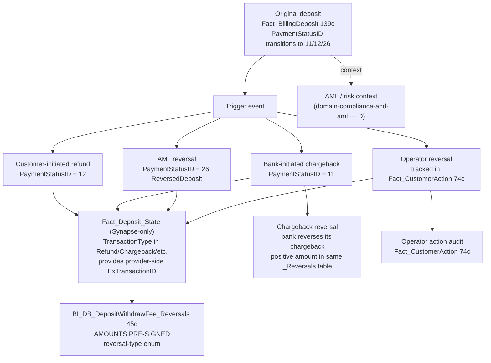

# Cross-domain — Refund / Chargeback Chain

A dispute event in fiat payments has many actors:

1. **Original deposit** (or withdrawal).
2. **Dispute trigger** — customer-initiated refund vs bank-initiated chargeback vs ops-initiated reversal vs AML-flag-triggered reversal.
3. **Reversal record** (with sign-corrected amounts) in BI_DB layer.
4. Optional follow-on — **chargeback reversal** (the bank reverses ITS chargeback because we won the case).
5. **AML / risk context** — was this customer flagged before / after?

This cross-domain skill stitches the chain so a single dispute can be fully audited.

**Side classification:** broker-side customer dispute flow plus dealer-side fee accounting on the reversal. AML classification overlay routes to Compliance.

> **Mixed UC / Synapse coverage.** `BI_DB_DepositWithdrawFee_Reversals` (45c, AMOUNTS PRE-SIGNED) and `Fact_CustomerAction` (74c) are in UC. The State-table provenance (`Fact_Deposit_State`, `Fact_Cashout_Rollback`) is `_Not_Migrated` and only available in Synapse. From Genie you can do the reversal-aggregate analysis; for the full forensic chain (which State row triggered which reversal) drop down to Synapse.

## When to Use

Load when investigating **a single dispute end-to-end**:

- "Walk me through what happened to deposit X — refund? chargeback? when? who?"
- "AML-flagged customers with refunds in the same period" (overlay with Compliance)
- "Operator-initiated reversals — who refunded this customer and when?"
- "Chargeback success vs chargeback recovery — did we win the dispute?"
- "Partial reversals — was the deposit fully or partially refunded?"
- "Was this refund AML-triggered or customer-initiated?"

Do NOT load for:

- **Total refund / chargeback volume this month** → `domain-revenue-and-fees` (aggregate reversal accounting). This skill is for SINGLE-CASE forensics.
- **Was deposit X approved** → `deposits-and-withdrawals` (C.1) alone via `Fact_BillingDeposit.PaymentStatusID`.
- **AML alert detail / risk classification on the customer** → [`../domain-compliance-and-aml/`](../domain-compliance-and-aml/SKILL.md) — `aml-risk-scoring` for the classification, `aml-alert-routing` for the live alerts (note: alert detail is largely Synapse-only).
- **Provider statement vs internal recon** (MID-level decline / settlement) → `provider-reconciliation`.

## Scope

In scope: the anchor `BI_DB_DepositWithdrawFee_Reversals` (45c — refund + chargeback + chargeback-reversal + reversed + partial-reversed + cashout-rollback + cancellations); `Fact_BillingDeposit` (139c) + `Fact_BillingWithdraw` (86c) original-event side; `Dim_PaymentStatus` (6c) for the status enum decode; `Fact_CustomerAction` (74c) for operator-action audit; cross-link out to [`../domain-compliance-and-aml/`](../domain-compliance-and-aml/SKILL.md) for AML context overlay. Mixed-coverage State-table provenance pointed to Synapse.
Out of scope: aggregate reversal / chargeback rate trends (`domain-revenue-and-fees`); pure deposit lifecycle (`deposits-and-withdrawals`); MID-level provider recon (`provider-reconciliation`); customer total balance state (`finance-recon-and-balances`); AML risk classification + AML alerts themselves ([`../domain-compliance-and-aml/`](../domain-compliance-and-aml/SKILL.md)).
Last verified: 2026-05-11

## Critical Warnings

1. **Tier 1 — `BI_DB_DepositWithdrawFee_Reversals.Amount` and `AmountUSD` are PRE-SIGNED.** Refunds & chargebacks negative; chargeback-reversals positive. **DON'T multiply by `-1` and DON'T `ABS()` unless you specifically want absolute value.** Each row in this table already encodes the direction.
2. **Tier 1 — Production typo: `'Partialy Reversed'` (not "Partially") — keep as-is in queries.** The enum value in `TransactionType` is literally `'Partialy Reversed'` with one L. Don't auto-correct.
3. **Tier 1 — `CreditTypeID`, `MOPCountry`, `IsGermanBaFin` are ALWAYS NULL on `BI_DB_DepositWithdrawFee_Reversals`.** Per service requests SR-313302 / SR-359957. Don't filter on them; the values are never populated on this table.
4. **Tier 1 — One deposit can have MULTIPLE reversal rows.** Refund + later chargeback-reversal, partial reversal followed by full, etc. Group by `DepositID` and inspect the timeline; never assume a 1:1 deposit↔reversal mapping.
5. **Tier 1 — `Fact_Deposit_State` and `Fact_Cashout_Rollback` are `_Not_Migrated` (Synapse-only).** For the State-row-triggering-reversal forensic ("which State change caused this reversal"), drop down to Synapse via `user-synapse_prod_sql` / `user-synapse_sql` MCP. The reversal table itself + `Fact_BillingDeposit` + `Fact_CustomerAction` ARE in UC and can answer most of the forensic.
6. **Tier 2 — Chargeback ≠ Refund.** Chargeback is bank-initiated (we may dispute it back — `ChargebackReversal` = we won). Refund is internal-initiated (customer asked, or ops gave). Different commercial implications, different processes — don't conflate in reporting.
7. **Tier 2 — AML reversals (`PaymentStatusID = 26 ReversedDeposit`) typically have a corresponding row in the AML alert tables.** The two should be cross-referenced for any "we refunded due to AML — was the alert valid?" audit. The AML side ([`../domain-compliance-and-aml/`](../domain-compliance-and-aml/SKILL.md)) owns the alert interpretation: `aml-risk-scoring` for the classification at the time, `aml-alert-routing` for the live alert (largely Synapse-only — bridge via `bi_db_amlperiodicreview.BIAMLAlerts`). This skill owns the join key on the payments side.
8. **Tier 2 — Operator audit trail lives in `Fact_CustomerAction` (74c).** Owned by `domain-customer-and-identity/customer-action-audit-trail`. If a refund was operator-initiated, the matching action row links via `CID + ActionDate` close to the reversal `Occurred` time. For the canonical join pattern see `customer-action-audit-trail` Critical Warnings (the table has 74c — `Occurred` is the true timestamp; NO `OperatorID` / `IsManual` / `ActionDetail` columns).
9. **Tier 2 — Partial reversals complicate aggregation.** Sum across ALL reversal rows for one `DepositID`, then compare to the original `AmountUSD`, to determine if the deposit was fully or partially reversed.
10. **Tier 3 — PaymentStatusID 35 (`DeclineByRRE`) is NOT a dispute** — it's a pre-auth risk-engine decline (the deposit never landed). Don't mix it into dispute analyses.
11. **Tier 3 — Sign-correction logic for `Reversed` / `CashoutRollback` / `CancelledCashoutRollback` / `CancelledChargebackReversal` uses `Fact_CustomerAction` lookups in the source SP.** Trust the table's signed value, don't re-derive.
12. **Tier 3 — For aggregate volume / rate questions** (chargeback rate, refund rate, recovery rate over time), GO TO `domain-revenue-and-fees`. This cross-domain skill is for SINGLE-CASE forensics.

## The chain



## Anchor table — `BI_DB_DepositWithdrawFee_Reversals` (45c)

Every refund, chargeback, and chargeback-reversal lands here. **Key properties:**

- `Amount` / `AmountUSD` are **PRE-SIGNED** (Critical Warning 1).
- `TransactionType` has the reversal-type enum (Critical Warning 2 — keep the typo).
- `CreditTypeID`, `MOPCountry`, `IsGermanBaFin` are ALWAYS NULL (Critical Warning 3).
- Owned by **`domain-revenue-and-fees`** for aggregate questions, but used by THIS cross-domain skill for chain-walking.

## PaymentStatusID enum (subset of interest)

| ID | Status | Trigger |
|---|---|---|
| 2  | Approved          | Original successful deposit |
| 11 | Chargeback        | Bank-initiated dispute |
| 12 | Refund            | Customer- or ops-initiated refund |
| 26 | ReversedDeposit   | AML-driven reversal |
| 35 | DeclineByRRE      | Risk-engine decline (NOT a dispute — pre-auth decline) |
| 37-39 | Cancelled-reversals | The reversal itself was cancelled |

(See `Fact_BillingDeposit` wiki for the complete 6-col `Dim_PaymentStatus` enum.)

## Reversal type enum (subset, on `_Reversals.TransactionType`)

- `Refund`
- `Chargeback`
- `ChargebackReversal`
- `Reversed`
- `Partialy Reversed` *(production typo — KEEP AS-IS)*
- `CashoutRollback`
- `CancelledCashoutRollback`
- `CancelledChargebackReversal`

## Canonical SQL patterns

```sql
-- 1. Full chain for ONE specific dispute (start from a reversal row) — UC
WITH dispute AS (
  SELECT * FROM main.bi_db.gold_sql_dp_prod_we_bi_db_dbo_bi_db_depositwithdrawfee_reversals
  WHERE DepositID = :disputed_deposit_id
)
SELECT
  'original_deposit' AS stage,
  fbd.DepositID, fbd.CID, fbd.PaymentStatusID, ps.Status,
  fbd.Amount, fbd.AmountUSD, fbd.ExchangeRate, fbd.ModificationDate,
  CAST(NULL AS STRING)  AS reversal_type,
  CAST(NULL AS DECIMAL) AS reversal_amount_usd,
  CAST(NULL AS TIMESTAMP) AS reversal_date
FROM      dispute d
JOIN      main.dwh.gold_sql_dp_prod_we_dwh_dbo_fact_billingdeposit  fbd ON fbd.DepositID    = d.DepositID
JOIN      main.dwh.gold_sql_dp_prod_we_dwh_dbo_dim_paymentstatus    ps  ON ps.PaymentStatusID = fbd.PaymentStatusID

UNION ALL

SELECT 'reversal_event',
       d.DepositID, d.CID, NULL, d.TransactionType,
       d.Amount, d.AmountUSD, NULL, NULL,
       d.TransactionType, d.AmountUSD, d.Occurred
FROM dispute d
ORDER BY 1, 8 NULLS FIRST;
```

```sql
-- 2. AML-flagged customers with refunds in the same period (placeholder; Compliance overlay)
SELECT rev.CID, rev.DepositID, rev.TransactionType, rev.AmountUSD, rev.Occurred,
       'see domain-compliance-and-aml (aml-risk-scoring + aml-alert-routing)' AS aml_context
FROM main.bi_db.gold_sql_dp_prod_we_bi_db_dbo_bi_db_depositwithdrawfee_reversals rev
WHERE rev.TransactionType IN ('Refund', 'AMLRefund', 'Reversed')
  AND rev.Occurred BETWEEN :from_dt AND :to_dt;
```

```sql
-- 3. Operator-initiated reversals (audit: "who refunded this customer") — UC
SELECT rev.DepositID, rev.CID, rev.TransactionType, rev.AmountUSD,
       fca.Occurred AS action_occurred, fca.ActionTypeID, fca.Description
FROM main.bi_db.gold_sql_dp_prod_we_bi_db_dbo_bi_db_depositwithdrawfee_reversals rev
JOIN main.dwh.gold_sql_dp_prod_we_dwh_dbo_fact_customeraction                    fca
       ON fca.CID = rev.CID
      AND ABS(BIGINT(fca.Occurred) - BIGINT(rev.Occurred)) <= 3600
WHERE rev.DepositID = :disputed_deposit_id;
```

```sql
-- 4. Chargeback success (we lost) vs chargeback recovery (we won) — UC
SELECT rev.DepositID, rev.CID,
       MAX(CASE WHEN rev.TransactionType = 'Chargeback'         THEN rev.AmountUSD END) AS chargeback_amt,
       MAX(CASE WHEN rev.TransactionType = 'ChargebackReversal' THEN rev.AmountUSD END) AS recovery_amt,
       CASE
         WHEN MAX(CASE WHEN rev.TransactionType = 'ChargebackReversal' THEN 1 END) = 1 THEN 'Recovered'
         ELSE 'Lost'
       END AS outcome
FROM main.bi_db.gold_sql_dp_prod_we_bi_db_dbo_bi_db_depositwithdrawfee_reversals rev
WHERE rev.Occurred BETWEEN :from_dt AND :to_dt
GROUP BY rev.DepositID, rev.CID;
```

```sql
-- 5. Partial vs full reversal for a deposit — UC
SELECT rev.DepositID, rev.CID,
       fbd.AmountUSD                  AS original_usd,
       SUM(ABS(rev.AmountUSD))        AS reversal_total_usd,
       CASE
         WHEN SUM(ABS(rev.AmountUSD)) >= fbd.AmountUSD - 0.01 THEN 'Fully reversed'
         ELSE 'Partially reversed'
       END AS outcome
FROM      main.bi_db.gold_sql_dp_prod_we_bi_db_dbo_bi_db_depositwithdrawfee_reversals rev
JOIN      main.dwh.gold_sql_dp_prod_we_dwh_dbo_fact_billingdeposit                    fbd
       ON fbd.DepositID = rev.DepositID
WHERE rev.DepositID = :disputed_deposit_id
GROUP BY rev.DepositID, rev.CID, fbd.AmountUSD;
```

## When to load just one parent instead

- "Total refund volume this month" → `domain-revenue-and-fees` alone.
- "Was deposit X approved" → `deposits-and-withdrawals` alone (`Fact_BillingDeposit.PaymentStatusID`).
- "Show me the AML alerts for this customer" → [`../domain-compliance-and-aml/aml-alert-routing.md`](../domain-compliance-and-aml/aml-alert-routing.md) (mostly Synapse-only; bridge via `bi_db_amlperiodicreview.BIAMLAlerts`).
- "Walk me through what happened to deposit X — refund? chargeback? when? who?" → load this cross-domain skill.

## Deep reads

- [`BI_DB_DepositWithdrawFee_Reversals.md`](https://github.com/guyman-tr/Databricks_Knowledge/blob/master/knowledge/synapse/Wiki/BI_DB_dbo/Tables/BI_DB_DepositWithdrawFee_Reversals.md) — 45c, pre-signed amounts
- [`Fact_BillingDeposit.md`](https://github.com/guyman-tr/Databricks_Knowledge/blob/master/knowledge/synapse/Wiki/DWH_dbo/Tables/Fact_BillingDeposit.md) — 139c, PaymentStatusID column
- [`Fact_CustomerAction.md`](https://github.com/guyman-tr/Databricks_Knowledge/blob/master/knowledge/synapse/Wiki/DWH_dbo/Tables/Fact_CustomerAction.md) — 74c, operator audit
- [`Fact_Deposit_State.md`](https://github.com/guyman-tr/Databricks_Knowledge/blob/master/knowledge/synapse/Wiki/DWH_dbo/Tables/Fact_Deposit_State.md) — Synapse-only

## Skill provenance

- Column counts and UC FQN existence verified 2026-05-11 against `system.information_schema.columns`. Key counts: `BI_DB_DepositWithdrawFee_Reversals`=45, `Fact_BillingDeposit`=139, `Fact_BillingWithdraw`=86, `Fact_CustomerAction`=74, `Dim_PaymentStatus`=6.
- `_Not_Migrated` confirmed (Synapse-only): `Fact_Deposit_State`, `Fact_Cashout_State`, `Fact_Cashout_Rollback`. The aggregate `_Reversals` table IS in UC.
- Intersecting skills: `domain-payments/deposits-and-withdrawals`, `domain-revenue-and-fees/SKILL` (aggregate reversal accounting), `domain-cross/provider-reconciliation`, `domain-customer-and-identity/customer-action-audit-trail` (operator-action linkage).
