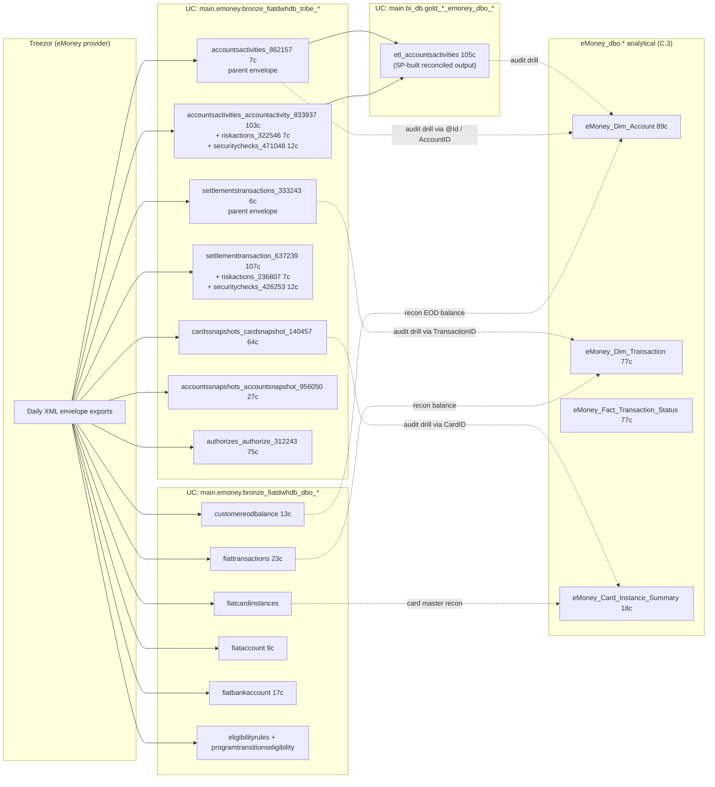

# Cross-domain — Tribe / FiatDwh -> eMoney Audit Trail

eToro's eMoney (IBAN + debit card) platform is operated jointly with **Treezor** as the regulated e-money issuer. Treezor exports daily **XML audit envelopes** of every operator / system action on every account, card, and settlement. Those envelopes land in the Synapse `eMoney_Tribe.*` schema and the Databricks UC mirror `main.emoney.bronze_fiatdwhdb_tribe_*`. A reconciliation SP `SP_eMoney_Reconciliation_ETLs` joins parent envelopes with their child detail tables to produce flattened `eMoney_dbo.ETL_*` tables (UC: `main.bi_db.gold_sql_dp_prod_we_emoney_dbo_etl_accountsactivities`) Compliance can query.

**Side classification:** Compliance / regulator-facing audit trail. This cross-domain skill does NOT own audit-trail interpretation logic — Compliance super-domain does (when built).

What this skill OWNS:

1. The **map** between eMoney business objects (Account, Card, Transaction) and the Tribe envelope tables that hold the audit log for them.
2. The **join keys** that make a Tribe row meaningful — `GCID`, `AccountID`, `CardID`, `TransactionID`, `@Id` (XML doc UUID).
3. The **don't-go-there warnings** — querying raw `eMoney_Tribe.*` envelopes without going through the ETL_* recon layer is almost always wrong.

> **Genie / SQL note.** The Tribe envelope tables exist in both halves (Synapse `eMoney_Tribe.*` and UC bronze `main.emoney.bronze_fiatdwhdb_tribe_*`). Use the UC names for Genie. **Important correction from v0:** several tables originally had **dashes** in their Synapse name (e.g. `SettlementsTransactions-333243`); in UC those dashes have been **converted to underscores** (`bronze_fiatdwhdb_tribe_settlementstransactions_333243`), so **backticks are NO LONGER NEEDED** — verified 2026-05-11. The orchestrating SP `SP_eMoney_Reconciliation_ETLs` runs in Synapse only — it's not a queryable object; it produces `ETL_AccountsActivities` (105c) which is queryable in UC.

## When to Use

Load when the question is about **audit-trail / SOC2 / "who authorized this" on eMoney**:

- "Who authorized transaction X?" / "Show me the audit trail for account Y"
- "I see an eMoney transaction in `eMoney_Dim_Transaction` that has no matching Tribe envelope — is it valid?"
- "Reconcile our eMoney amounts against Treezor's statements for date D"
- "Trace card C through its full lifecycle — created, activated, blocked, re-issued, expired"
- Operator-action SOC2 audits referencing risk-engine flags, security checks, or settlement disputes
- "EOD balance reconciliation per account / per customer"

Do NOT load for:

- **Pure eMoney transaction volumes / customer demographics / FX spread / IBAN inflows** → `emoney-accounts-and-cards` (C.3) alone.
- **Compliance KYC / risk-rule logic / regulator-facing reports** → Compliance super-domain (planned).
- **Crypto came in → converted to fiat on IBAN forensics** → `crypto-to-fiat`.
- **Provider statement recon for fiat deposits/withdrawals (not eMoney)** → `provider-reconciliation`.
- **Refund / chargeback chain on a customer dispute** → `refund-chargeback-chain`.

## Scope

In scope: the Tribe-half (raw XML audit envelopes in UC `main.emoney.bronze_fiatdwhdb_tribe_*` — parent envelopes 3-7c, detail children `accountactivity_833937` 103c, `settlementtransaction_637239` 107c, `cardsnapshot_140457` 64c, `accountsnapshot_956050` 27c, `authorize_312243` 75c, `riskactions_*` 7c, `securitychecks_*` 12c); the FiatDwhDB-half (UC `main.emoney.bronze_fiatdwhdb_dbo_*` and `main.bi_db.bronze_fiatdwhdb_dbo_*` — `fiattransactions` 23c, `customereodbalance` 13c, `fiataccount` 9c, `fiatbankaccount` 17c, `fiatcardinstances`, `eligibilityrules`, `programtransitionseligibility`, etc.); the analyst-grade ETL recon output (`bi_db.gold_sql_dp_prod_we_emoney_dbo_etl_accountsactivities` 105c — in `bi_db` NOT `emoney` schema, contrary to the v0 skill); the eMoney business-object bridge (`eMoney_Dim_Account` 89c, `eMoney_Dim_Transaction` 77c) for join keys (`GCID`, `AccountID`, `CardID`, `TransactionID`, `@Id`).
Out of scope: eMoney customer transaction volumes / FX / IBAN inflows (`emoney-accounts-and-cards`); Compliance interpretation (KYC, risk-rule logic, regulator reports) — when Compliance super-domain is built; crypto-to-fiat forensics (`crypto-to-fiat`); fiat provider settlement recon for TP deposits (`provider-reconciliation`); single-dispute chargeback chain (`refund-chargeback-chain`).
Last verified: 2026-05-11

## Critical Warnings

1. **Tier 1 — Don't query raw `eMoney_Tribe.*` envelope tables directly for business questions.** They're XML envelopes; columns are mostly XML passthroughs (`@Id`, `@Created`, `@FileName`). The `_NNNNNN` suffix is a generic-pipeline build-artifact, not a version. Use `bi_db.gold_sql_dp_prod_we_emoney_dbo_etl_accountsactivities` (105c — the recon output) or join through `eMoney_Dim_Account` / `eMoney_Dim_Transaction`.
2. **Tier 1 — Schema location correction from v0.** The reconciled ETL output `ETL_AccountsActivities` is in UC at `main.bi_db.gold_sql_dp_prod_we_emoney_dbo_etl_accountsactivities` (105c — verified 2026-05-11). NOT in the `emoney` schema as the old skill said. The Tribe raw envelopes and FiatDwhDB mirrors ARE mostly in `main.emoney.*`, but the SP-built analyst output lives in `main.bi_db.*`.
3. **Tier 1 — Dashes have been converted to underscores in UC.** Verified 2026-05-11. Synapse names like `SettlementsTransactions-333243` map to UC names `bronze_fiatdwhdb_tribe_settlementstransactions_333243` (underscore, no backticks needed). All UC names in `required_tables:` are unquoted-safe; the v0 skill's backtick-quoting advice no longer applies.
4. **Tier 1 — `SP_eMoney_Reconciliation_ETLs` is the orchestrator** — every `eMoney_dbo.ETL_*` table is its output. If a recon table looks stale, check the SP run in Synapse; don't try to roll your own from raw envelopes. The SP itself is not a queryable object in UC.
5. **Tier 1 — Parent envelope ↔ child detail relationship is by `@Id`** (the XML document UUID). E.g. `accountsactivities_862157.@Id` = parent doc id; `accountsactivities_accountactivity_833937.@Id` = child rows referencing the same parent. The recon SP does this join for you — `ETL_AccountsActivities` (105c) is the flattened output. Same envelope-parent-detail-child pattern for all four envelope families (`AccountsActivities`, `SettlementsTransactions`, `CardsSnapshots`, `AccountsSnapshots`, `Authorizes`).
6. **Tier 2 — Treezor only — no other e-money provider.** The Tribe / FiatDwhDB layer is **specific to Treezor**. Other regulated entities (e.g. for non-EU IBAN wires) have their own provider feeds — `eMoney_BankPaymentsUK` for UK OpenBanking (Synapse-only, see `emoney-accounts-and-cards.md`), etc. Don't assume a single audit log per IBAN transaction.
7. **Tier 2 — PII rules apply harder here than in C.3.** Tribe envelopes contain raw names, addresses, PAN snippets, IBAN strings, IDV documents. Always prefer the masked-view counterparts (`v_eMoney_Card_Instance_Summary` excludes `MaskedPAN`; equivalent masking applies on Tribe queries).
8. **Tier 2 — Tribe envelope tables have very low column-comment coverage** (~0% in the UC heatmap). Lean on the Synapse wikis under `knowledge/synapse/Wiki/eMoney_Tribe/Tables/*.md` for column meaning. Auto-completion in Genie / Databricks Assistant will be unhelpful here — read the wiki.
9. **Tier 2 — Settlement transactions ≠ regular eMoney transactions.** `SettlementsTransactions-*` in Tribe is the provider-to-provider settlement layer (Treezor ↔ Mastercard / SEPA / Faster Payments). It's NOT the same as `eMoney_Dim_Transaction` — that's the customer-facing transaction. They reconcile but at different grain.
10. **Tier 2 — Compliance owns the interpretation, not Payments.** This skill provides the join keys and the "which table" map. The "what does `RiskActionType=7` actually mean for SOC2" lookup belongs in the Compliance super-domain when that's built.
11. **Tier 3 — Two halves of "Tribe / FiatDwh" get conflated in conversation.** **Tribe** (`eMoney_Tribe.*` / `emoney.bronze_fiatdwhdb_tribe_*`) is the raw XML audit log — forensic input only, not analytical fact. **FiatDwhDB** (`FiatDwhDB.dbo.*` / `emoney.bronze_fiatdwhdb_dbo_*` + a few in `bi_db.bronze_fiatdwhdb_*`) is Treezor's operational fiat tables — the provider-side source of truth for reconciliation. A Compliance audit usually needs BOTH halves: FiatDwhDB tells you what Treezor's books say, Tribe XML tells you why and who.
12. **Tier 3 — Two `fiattransactions` tables (post-migration).** UC has `bronze_fiatdwhdb_dbo_fiattransactions` (23c, current) and `_old` (18c, pre-migration). Use the current one unless you're explicitly reconciling pre-migration historical data.
13. **Tier 3 — Reconcile by `TransactionID`, EOD balance by `AccountID + BalanceDate`.** TransactionID is preserved end-to-end (Treezor → internal); `eMoney_Dim_Transaction.TransactionID` joins to `FiatTransactions.TransactionID`. For EOD balance, `eMoneyClientBalance.AccountID` joins to `CustomerEODBalance.AccountID` on `BalanceDate`.

## Mental model



## The two halves of "Tribe / FiatDwh"

| Half | UC | Role |
|---|---|---|
| **Tribe** (audit envelopes) | `main.emoney.bronze_fiatdwhdb_tribe_*` | Raw XML audit log of every operator / system action — security checks, risk actions, account snapshots, settlement disputes. **Treat as forensic input only**, not as analytical fact. |
| **FiatDwhDB** (operational mirrors) | `main.emoney.bronze_fiatdwhdb_dbo_*` (and a few in `main.bi_db.bronze_fiatdwhdb_dbo_*`) | Treezor's operational fiat tables — `fiattransactions`, `fiatcardinstances`, `customereodbalance`, `fiataccount`, eligibility rules, program transitions. **The provider-side source of truth** for reconciliation. |

A Compliance audit usually needs **both halves**: the FiatDwhDB tells you what Treezor's books say, the Tribe XML tells you why and who.

## Canonical SQL patterns

### Pattern 1 — Find the audit trail for an eMoney account

Start from `eMoney_Dim_Account` to get the join keys, then traverse Tribe **through `ETL_AccountsActivities`** (the recon table), not the raw envelopes.

```sql
-- Get the keys (UC)
SELECT a.CID, a.GCID, a.AccountID, a.RegulationID
FROM main.bi_db.gold_sql_dp_prod_we_emoney_dbo_emoney_dim_account a
WHERE a.CID = :cid AND a.IsValidETM = 1;
```

```sql
-- Hit the recon ETL — already joined parent + children (UC; bi_db schema)
SELECT etl.*
FROM main.bi_db.gold_sql_dp_prod_we_emoney_dbo_etl_accountsactivities etl
WHERE etl.AccountID    = :account_id
  AND etl.ActivityDate BETWEEN :from_dt AND :to_dt
ORDER BY etl.ActivityDate;
```

### Pattern 2 — Reconcile internal eMoney transactions vs Treezor's books

Internal: `eMoney_Dim_Transaction`. Treezor: the FiatDwhDB mirror `fiattransactions` (UC: `main.emoney.bronze_fiatdwhdb_dbo_fiattransactions` 23c). Reconcile by `TransactionID`.

```sql
SELECT
    edt.TransactionID,
    edt.Amount             AS internal_amount,
    edt.Currency           AS internal_currency,
    ft.Amount              AS provider_amount,
    ft.Currency            AS provider_currency,
    edt.Amount - ft.Amount AS variance
FROM      main.bi_db.gold_sql_dp_prod_we_emoney_dbo_emoney_dim_transaction edt
LEFT JOIN main.emoney.bronze_fiatdwhdb_dbo_fiattransactions               ft
       ON ft.transactionid = edt.TransactionID
WHERE edt.SettlementDateID BETWEEN :from_dt AND :to_dt
  AND ABS(edt.Amount - COALESCE(ft.Amount, 0)) > 0.01;
```

### Pattern 3 — Card lifecycle audit

```sql
WITH card_keys AS (
    SELECT CID, GCID, CardID, MaskedPAN, CardCreateDate
    FROM main.bi_db.gold_sql_dp_prod_we_emoney_dbo_emoney_card_instance_summary
    WHERE CID = :cid
)
SELECT k.MaskedPAN, snap.SnapshotDate, snap.CardStatus, snap.RiskFlag
FROM      card_keys k
JOIN      main.emoney.bronze_fiatdwhdb_tribe_cardssnapshots_cardsnapshot_140457 snap
       ON snap.CardID = k.CardID
ORDER BY snap.SnapshotDate;
```

### Pattern 4 — EOD balance reconciliation

```sql
SELECT
    cb.CID, cb.AccountID, cb.BalanceDate,
    cb.Balance                AS internal_balance,
    teod.Balance              AS treezor_eod_balance,
    cb.Balance - teod.Balance AS variance
FROM      main.bi_db.gold_sql_dp_prod_we_emoney_dbo_emoneyclientbalance cb
LEFT JOIN main.emoney.bronze_fiatdwhdb_dbo_customereodbalance           teod
       ON teod.AccountID   = cb.AccountID
      AND teod.BalanceDate = cb.BalanceDate
WHERE cb.BalanceDate = :as_of_date
  AND ABS(cb.Balance - COALESCE(teod.Balance, 0)) > 0.01;
```

## When to load just one parent instead

| If the question only needs… | Load instead |
|---|---|
| eMoney customer transaction volumes / FX spread / IBAN inflows | `emoney-accounts-and-cards` |
| Compliance KYC / risk-rule logic / regulator-facing reports | Compliance super-domain (planned) |
| Crypto came in → converted to fiat on IBAN forensics | `crypto-to-fiat` |
| Provider statement reconciliation for fiat deposits/withdrawals (not eMoney) | `provider-reconciliation` |
| Refund / chargeback chain on a customer dispute | `refund-chargeback-chain` |

## Deep reads

- [`accountsactivities_862157.md`](https://github.com/guyman-tr/Databricks_Knowledge/blob/master/knowledge/synapse/Wiki/eMoney_Tribe/Tables/AccountsActivities_862157.md) — UC: `main.emoney.bronze_fiatdwhdb_tribe_accountsactivities_862157` (7c, envelope parent)
- [`accountsactivities_accountactivity_833937.md`](https://github.com/guyman-tr/Databricks_Knowledge/blob/master/knowledge/synapse/Wiki/eMoney_Tribe/Tables/AccountsActivities_AccountActivity-833937.md) — UC: `..._accountactivity_833937` (103c, child detail)
- [`settlementstransactions_settlementtransaction_637239.md`](https://github.com/guyman-tr/Databricks_Knowledge/blob/master/knowledge/synapse/Wiki/eMoney_Tribe/Tables/SettlementsTransactions_SettlementTransaction-637239.md) — UC: `..._settlementtransaction_637239` (107c)
- [`cardssnapshots_cardsnapshot_140457.md`](https://github.com/guyman-tr/Databricks_Knowledge/blob/master/knowledge/synapse/Wiki/eMoney_Tribe/Tables/CardsSnapshots_CardSnapshot-140457.md) — UC: `..._cardsnapshot_140457` (64c)

## Skill provenance

- Column counts and UC FQN existence verified 2026-05-11 against `system.information_schema.columns`. Key counts: `ETL_AccountsActivities`=105 (in `bi_db` not `emoney`), `accountsactivities_accountactivity_833937`=103, `settlementtransaction_637239`=107, `cardsnapshot_140457`=64, `accountsnapshot_956050`=27, `authorize_312243`=75, parent envelopes 3-7c, child `riskactions_*` 7c / `securitychecks_*` 12c. FiatDwhDB: `fiattransactions`=23, `customereodbalance`=13, `fiataccount`=9, `fiatbankaccount`=17. eMoney analytical: `eMoney_Dim_Account`=89, `eMoney_Dim_Transaction`=77.
- Major correction from v0: (a) ETL output is in `bi_db` schema not `emoney` (b) dashes in original Synapse names have been converted to underscores in UC, so backtick-quoting is no longer needed.
- `SP_eMoney_Reconciliation_ETLs` is Synapse-only orchestrator (not a queryable object in UC); produces the analyst-grade ETL_AccountsActivities table that IS in UC.
- Intersecting skills: `domain-payments/emoney-accounts-and-cards` (supplies join keys via `eMoney_Dim_Account` / `eMoney_Dim_Transaction`), Compliance super-domain (planned, owns interpretation), `domain-cross/crypto-to-fiat`, `domain-cross/provider-reconciliation`, `domain-cross/refund-chargeback-chain`.
- Cluster provenance: Tribe envelope tables sit in their own Synapse schema (`eMoney_Tribe`, ~30+ tables, all named `<Subject>_<Detail>-NNNNNN` originally) — they form a quiet forest in the join graph (sparse joins to anything outside Tribe). The recon ETL tables (`eMoney_dbo.ETL_*`) live inside Cluster 17 (eMoney). The FiatDwhDB mirrors live across `bi_db.bronze_fiatdwhdb_*` and `emoney.bronze_fiatdwhdb_*` in UC; their join graph weight is mostly to `eMoney_Dim_Transaction` and `eMoney_Dim_Account`.
