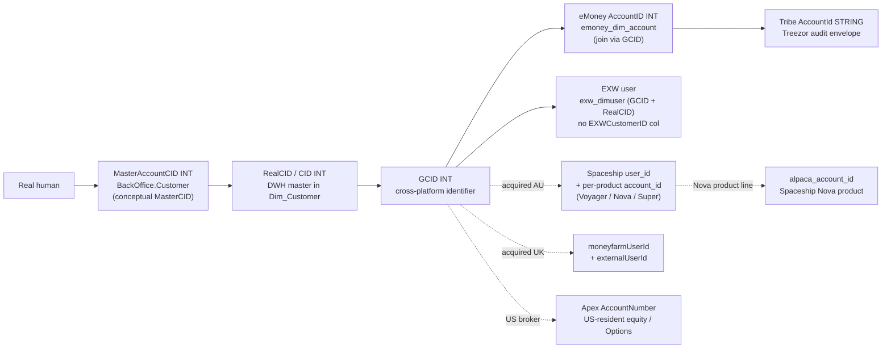

# Customer & Identity Super-Domain

eToro's customer model is **not** a single ID. A real human can have one row in `Dim_Customer` (DWH master) but be referenced by **at least five core identifier concepts** depending on which platform answered: `RealCID` (DWH/trading platform PK — surfaces as `CID INT` in every downstream fact), `GCID` (Global Customer ID, cross-platform — the only key present in DWH + eMoney + EXW + Tribe), conceptually `MasterCID` (consolidated parent across linked accounts — **physically the column is `MasterAccountCID INT` on `BackOffice.Customer` / bronzed at `main.general.bronze_etoro_backoffice_customer`; there is no `MasterCID` column anywhere in UC**), the eMoney account number (`AccountID INT` on `main.bi_db.gold_sql_dp_prod_we_emoney_dbo_emoney_dim_account` — there is no `EmoneyAccountID` column; cross-platform join is on `GCID`, not on `AccountID`), and the EXW crypto-wallet identity (`GCID` + `RealCID` on `main.bi_db.gold_sql_dp_prod_we_exw_dbo_exw_dimuser` — there is **no `EXWCustomerID` column**, the 21-col EXW_DimUser keys directly on `RealCID` and `GCID`). **Plus** acquired-platform user IDs that the GCID bridges out to: Spaceship `user_id` (AU — Voyager / Nova / Super, with per-product `account_id` and an `etoro_user_id` cross-reference column), MoneyFarm `moneyfarmUserId` + `externalUserId` (UK, joined on `bronze_moneyfarm_users.gcid` directly), Apex `AccountNumber` (US-resident equity / Options), and the Alpaca `alpaca_account_id` (Spaceship Nova product, since Nova clears on Alpaca). Routing the question to the right key — and to the right master view, segment view, funnel view, or audit-trail fact — is the difference between a clean answer and a six-table mistake that double-counts.

This super-domain is about **WHO the customer is** — the master record, the identifiers, the long-lived attributes (jurisdiction, regulation, club tier, PI status, channel, country, marketing segments), the customer-property models (LTV, daily cluster, segments), the CRM case history, and the cross-platform identity joins. It is **not** about:

- **Money flow into / out of a customer's wallet** → Payments super-domain (`domain-payments/SKILL.md`). Customer balances, deposits, withdrawals, MIMO panel.
- **Trading positions, P&L, instrument exposure, broker-dealer execution** → Trading & Markets super-domain (`domain-trading/SKILL.md`).
- **AML risk classification, sanctions, PEP, watchlist alerts on a customer** → Compliance & AML super-domain (planned).
- **Fee revenue or fee composition on a customer** → Revenue & Fees super-domain (`domain-revenue-and-fees/SKILL.md`).

When a question is about **what the customer DID** (deposited, traded), route to the relevant doing-domain (Payments / Trading). When a question is about **who the customer IS** (their identifiers, jurisdiction, attributes, master record, segments, lifecycle status, onboarding funnel position, support history), it stays here.

## Routing waypoint — read this first

One referenced workspace skill is part of this super-domain. **Prefer it over local sub-skills when its slice matches**:

- **For the onboarding funnel** (Registration → KYC → V1/V2/V3 → Deposit Wizard → FTD → First Action, VBD/VBT cohort comparison) → load DE workspace skill **`registration-to-ftd-funnel`** at `/Workspace/.assistant/skills/registration-to-ftd-funnel/SKILL.md`. Authoritative for `main.etoro_kpi.ftd_funnel_v` and any cohort-based reg-to-FTD question. **Go-to skill before `Dim_Customer` / `Fact_CustomerAction` for any column it owns.**

**Population segments and lifecycle milestones** ("how many funded customers?", "how many active traders today?", "FTF cohort size") used to defer to the DE workspace skill `customer-populations`; on DA-72 (2026-05-28) that skill was absorbed into the local sub-skill [`customer-populations-and-lifecycle.md`](customer-populations-and-lifecycle.md) — go there for the SCD-based fast-population pattern, the Funded / Active / Portfolio / Balance hierarchy, the FTF formula, and the 12 Active Trader sub-flags. The legacy `customer-populations` skill is tombstoned and redirects here.

Local sub-skills (this folder) own everything else: master record, identity joins, jurisdiction, SCD walks, customer-action audit trail, customer-property models, CRM cases, OLTP forensics, **and now population segments & lifecycle**.

## When to Use

Load when the question concerns the customer master record, the identity model, long-lived attributes, customer-property models, or customer support history:

- "What's the canonical record for customer X?", "show me the master row for RealCID 12345"
- "How does RealCID relate to GCID / MasterAccountCID / eMoney AccountID / EXW GCID?"
- "How do I join customer in DWH to their eMoney account / their EXW wallet / their Tribe audit row?"
- "What jurisdiction / regulation is customer X under?", "which CySEC customers are…"
- "Is customer X a Popular Investor / club tier Diamond / VIP?"
- "What's customer X's registration channel / country / marketing region?"
- Point-in-time questions about long-lived attributes ("what was customer X's regulation on 2025-06-01?")
- Customer-action audit trail ("what did the operator do on this customer's account?", per-action fees, copy vs manual position opens)
- Customer-property models ("what's customer X's LTV prediction / daily cluster / segment / churn flag?")
- CRM case / CSAT / churn-winback questions
- Population segment / lifecycle milestone questions (local sub-skill `customer-populations-and-lifecycle.md`)
- Onboarding-funnel questions (delegate to referenced workspace skill `registration-to-ftd-funnel` — see Routing waypoint)

Do **not** load for:

- Money movement (deposits, withdrawals, MIMO, balances) → Payments super-domain
- Fee revenue → Revenue & Fees super-domain
- Trading activity (positions, P&L, copy trading P&L attribution, broker-dealer execution) → Trading & Markets super-domain
- AML/KYC risk classification → Compliance super-domain (planned)

## Scope

In scope: customer master record (`Dim_Customer` 107 cols, `Customer.CustomerStatic` 83-col bronze, `BackOffice.Customer` operational mirror with `MasterAccountCID`), customer SCD slices (`Fact_SnapshotCustomer` daily SCD with `DateRangeID`, `customer_snapshot_v` 52-col daily snapshot ~47M rows/day with `RealCID STRING`, `vg_customer_daily_snapshot`), milestone first-dates (`BI_DB_CIDFirstDates`, `cidfirstdates_v` with NULL-sentinel cleanup, `vg_customer_customer_first_dates`), the identity model (`RealCID` = `CID`, `GCID`, conceptual `MasterCID` → physical `MasterAccountCID`, eMoney `AccountID`, EXW joins via `GCID`/`RealCID`), long-lived attributes (jurisdiction, regulation, club tier, Popular Investor status via `GuruStatusID` — NOT `PlayerLevelID` (which encodes Bronze/Silver/Gold/Platinum/Platinum-Plus/Diamond/Internal per `Dim_PlayerLevel.Name`), channel, country, marketing segments), customer-action audit trail (`Fact_CustomerAction` 74 cols + enriched & w_metrics views), customer-property models (`BI_DB_LTV_BI_Actual` DECIMAL point predictions, `BI_DB_CID_DailyCluster` SCD-style with three parallel cluster columns, `BI_DB_CID_DailyPanel_FullData` 184-col panel, `BI_DB_CID_MonthlyPanel_FullData` in DWH schema, `customer_segments_v` 15-col flat profile, `customer_segments_mail_v` email engagement log, `etoro_club` views, next-gen `ml_stg.ml_output_ltv_app_artifacts_*`), CRM cases / CSAT / churn-winback (`vg_crm_case` 110 cols with `Status`/`Origin`, `crm_csat_survey_per_case_v`, `crm_quality_assessment_per_case_v`, `crm_user_v` with manager/RM hierarchy, `churn_winback_summary`/`recent_targets` as predictive-model output), customer population segments and lifecycle milestones (`gold_de_user_dim_ddr_customer_dailystatus_scd` SCD population fact, `BI_DB_DDR_Customer_Periodic_Status` pre-aggregate, `vg_customer_customer_first_dates`, `v_population_first_time_funded`, `v_population_first_trading_action`, `v_population_active_traders` — owned by sub-skill `customer-populations-and-lifecycle.md`, absorbed from the legacy `customer-populations` workspace skill on 2026-05-28 / DA-72), cross-platform identity resolution joins. The onboarding funnel (Reg → KYC → V1/V2/V3 → FTD conversion analytics) is owned by the referenced DE workspace skill `registration-to-ftd-funnel` — load it for its slice rather than answering from this hub.
Out of scope: money movement (Payments super-domain), fee revenue (Revenue & Fees super-domain), trading positions / P&L / broker-dealer execution (Trading super-domain), AML risk classification / sanctions / PEP (Compliance super-domain when built)
Last verified: 2026-05-11

## Critical Warnings

> **Tier 0 — Filter Contract (cross-cutting).** Every per-customer / per-segment aggregate sourced from this domain MUST follow [`../_shared/valid-users-filter-contract.md`](../_shared/valid-users-filter-contract.md): silent SCD-2 walk on `V_Fact_SnapshotCustomer_FromDateID` with `IsValidCustomer = 1` and `fact.DateID BETWEEN snap.FromDateID AND snap.ToDateID` (period-correct — almost every business question is a period, not "today"; current-state `Dim_Customer` is the fallback only for "right now" questions); mandatory one-line scope footer on every numeric output. The regulatory variant (`IsCreditReportValidCB = 1`, same quad plus `AccountTypeID != 2` minus ~10-12 CID exceptions for `CountryID = 250` — the subsidiary trade accounts at the parent broker) fires ONLY when the user explicitly says "CB valid" / "Client Balance valid" / "credit-report valid" — never on topic heuristics. Opt-out (unfiltered, include non-valids / internals / etorians / test) only on explicit user request. Never pre-flight. The physical column is `IsValidCustomer`; `IsValidUser` is the colloquial alias. `customer_exclude_list` is NOT part of the contract — it is funnel-scoped and lives in the funnel sub-skill (Warning 3 below covers its role for population work).

1. **Tier 1 — `RealCID` and `GCID` are not interchangeable for cross-platform joins.** Joining DWH facts to eMoney facts on `RealCID = AccountID` will silently miss every customer whose eMoney account was provisioned before the GCID unification project, and will silently double-count customers with multiple linked accounts. Always join via `Dim_Customer.GCID` to `eMoney_Dim_Account.GCID` (the platform-neutral identifier) unless you've explicitly confirmed the table you're joining keys on `RealCID`. Production OLTP `Customer.CustomerStatic` keys on `RealCID` directly; everywhere downstream the canonical column is `CID INT`. The eMoney-side AccountID column (`AccountID INT` on `emoney_dim_account`, `LONG` in the FiatDWH Tribe envelope chain) is NOT a CID — it's a per-eMoney-account number.
2. **Tier 1 — `Dim_Customer` is type-1 SCD on most attributes.** Jurisdiction, regulation, club tier, Popular Investor status, marketing region, and most other long-lived attributes are overwritten on every refresh. To answer "what was customer X's regulation on 2025-06-01?", walk `Fact_SnapshotCustomer` (point-in-time, available in UC as `main.dwh.gold_sql_dp_prod_we_dwh_dbo_v_fact_snapshotcustomer_fromdateid_masked` for masked or `main.pii_data.gold_sql_dp_prod_we_dwh_dbo_v_fact_snapshotcustomer_fromdateid` for full PII) or the `customer_snapshot_v` view (daily snapshot, `RealCID STRING` — cast to INT before joining to DWH facts), not query `Dim_Customer` directly. Querying `Dim_Customer` for historical attributes returns the *current* value silently labelled with no temporal warning.
3. **Tier 1 — Identifier sentinels, exclusion filtering, and linked-account dedup — DO NOT use invented columns.** `RealCID = 0` and `GCID = 0` are reserved for system / unallocated rows. **Test / fraud / internal accounts are NOT flagged by `Customer.CustomerStatic.IsTestUser` or `IsExcludedFromReporting` — those columns do not exist** (verified 2026-05-11). The normative validity contract for revenue / volume / per-customer aggregates lives at [`../_shared/valid-users-filter-contract.md`](../_shared/valid-users-filter-contract.md) — SCD-2 walk on `V_Fact_SnapshotCustomer_FromDateID` with `IsValidCustomer = 1` for the default, `IsCreditReportValidCB = 1` for regulatory. The `customer_exclude_list` (4 cols, 1.36M rows, `excludeReason IN ('Abuser', 'High risk', 'Internal')`) is a SEPARATE funnel-population gate — it filters who enters onboarding / lifecycle / first-time-funded cohorts, NOT who counts toward revenue. A user on the exclude list with valid commissions IS counted in revenue (the validity contract is the right gate); they would NOT be counted in an FTD funnel (the funnel skill applies the exclude list). The `IsExcludeUser` flag on `ftd_funnel_v` is the funnel-side proxy. Linked-account chains (one human, multiple `RealCID`s under one `MasterAccountCID`) require deduplication on `MasterAccountCID` (from `bronze_etoro_backoffice_customer`) for unique-customer counts, not on `RealCID`. Sentinel dates `1900-01-01` in `BI_DB_CIDFirstDates` mean "milestone never reached" — filter with `YEAR(...) != 1900` or use `cidfirstdates_v` which converts sentinels to NULL.

## Mental model — the identity layers

**Routing rules**:

- A question that names a single ID type (e.g. "show me RealCID 12345") stays in DWH-only context — no cross-platform joins needed.
- A question that crosses platforms (e.g. "this customer's deposits AND eMoney transactions AND wallet balance") requires `GCID` as the bridge, not `RealCID`.
- Audit-trail questions on eMoney accounts ("who authorized this transfer") cross into the Tribe envelope feed — those route to the [`domain-cross/tribe-emoney-audit`](../domain-cross/tribe-emoney-audit.md) cross-domain skill, which supplies the audit map; this super-domain supplies the join keys.
- Acquired-platform identity (Spaceship / MoneyFarm / Apex) joins through `GCID`. The detailed product / AUM / fee questions live in **Revenue & Fees** super-domain and the per-product domain cards (`knowledge/uc_domains/spaceship/_domain_card.md`, `knowledge/uc_domains/moneyfarm/_domain_card.md`). This super-domain owns **only** the cross-reference: "given a `RealCID`, what's their Spaceship `user_id` / MoneyFarm `moneyfarmUserId` / Apex `AccountNumber`?"

## Sub-skill routing

| Sub-skill | Anchor (UC FQN) | When to load |
|---|---|---|
| [`customer-master-record.md`](customer-master-record.md) | `main.dwh.gold_sql_dp_prod_we_dwh_dbo_dim_customer_masked` | Master-record current-state attribute lookup on the 107-col `Dim_Customer`: name/email/country/club/PI (via `PlayerLevelID=4` or `GuruStatusID`)/channel/marketing segment for a given `CID`. The "show me the row for customer X" answer. **Note**: `MasterCID`, `EmoneyAccountID`, `EXWCustomerID`, `ClubLevelID`, `IsPI`, `MarketingRegion` are NOT physical columns on Dim_Customer — see sub-skill Warning 1 for where they actually live. Cluster 2 (146-node hub, biggest in the graph). |
| [`identity-jurisdiction-and-regulation.md`](identity-jurisdiction-and-regulation.md) | `main.dwh.gold_sql_dp_prod_we_dwh_dbo_v_fact_snapshotcustomer_fromdateid_masked`, `main.dwh.gold_sql_dp_prod_we_dwh_dbo_dim_country`, `main.dwh.gold_sql_dp_prod_we_dwh_dbo_dim_regulation` | Jurisdiction / regulation / country / MiFID category; point-in-time SCD walks via `Fact_SnapshotCustomer.DateRangeID`; `cidfirstdates_v` for milestone dates. Cluster 1 (152-node hub `Dim_Country`). |
| [`oltp-customer-static-and-breaches.md`](oltp-customer-static-and-breaches.md) | `main.general.bronze_etoro_customer_customerstatic_masked`, `main.bi_db.gold_sql_dp_prod_we_exw_dbo_exw_dimuser` | Production-OLTP customer truth (`Customer.CustomerStatic` 83 cols — NOT ~250; the canonical `Is*` columns are exactly five: IsReal/IsEmailVerified/IsEmailActivated/IsRequestedCall/IsHedged), `BackOffice.Customer` operational mirror with `MasterAccountCID`, `EXW_DimUser` (21 cols, GCID + RealCID). **Trigger-driven `IsHedged`** (defaults 1, overwritten to 0 by Customer.CustomerVersion triggers). Four breach tables (`BI_DB_US_Compliance_Apex_Clients`, `BI_DB_OPS_MultipleAccounts`, `BI_DB_WatchListsByFunnel`, `BI_DB_AML_Documents_Request`) are **Synapse-only**, not in UC. Cluster 3 (123 nodes; **Breaches Investigation Bot Genie 17/20**). |
| [`customer-action-audit-trail.md`](customer-action-audit-trail.md) | `main.dwh.gold_sql_dp_prod_we_dwh_dbo_fact_customeraction`, `main.etoro_kpi_prep.v_fact_customeraction_w_metrics` | Per-event ledger of every customer action: `Fact_CustomerAction` (74 cols — NO `OperatorID` / `IsManual` / `ActionDetail`; the true timestamp is `Occurred`), five-source UNION classified via `Dim_ActionType` (45 rows), enrichment via `v_fact_customeraction_enriched` (passive/active split, compensation `PositionID` back-resolved from last word of `Description`, detach-aware `MirrorID`), monetary metrics via `v_fact_customeraction_w_metrics`. Social `ActionTypeID` 21-26 are **DEAD DATA** — do not use. Cluster 6 (86-node hub `Fact_CustomerAction`, weight 223). |
| [`compliance-customer-snapshot-and-club.md`](compliance-customer-snapshot-and-club.md) | `main.etoro_kpi.customer_snapshot_v`, `main.general.gold_sql_dp_prod_we_bi_db_dbo_bi_db_clubchangelogproduct` | The customer snapshot stack: `customer_snapshot_v` is a **daily 52-col snapshot with `RealCID STRING`** (~47M rows/day) — NOT compliance-filtered, NO MasterCID/StatusID/LastKycDate; `kyc_for_compliance_v` is an 8-col Q&A log (not a "latest verdict"); `positions_for_compliance_v` (182 cols, lowercase names); `cfd_statusinfo_v` (note the `ApproprietnessScore_Status` typo); `ddr_customer_current_flags` (7 cols, `IsActiveTrade` not `IsActiveTrader`). Plus `BI_DB_ClubChangeLogProduct` (14 cols, `OldTier`/`CurrentTier`), 21 `bi_output_vg_*` Genie mirrors, PII-restricted AML snapshot, spaceship club balances. Cluster 10 (32 nodes; PROD-Compliance / eToro DDR / etoro_club Genies all live here). |
| [`crm-cases-csat-and-churn.md`](crm-cases-csat-and-churn.md) | `main.etoro_kpi.vg_crm_case`, `main.bi_output_stg.churn_winback_summary` | CRM Salesforce cases (`vg_crm_case` 110 cols, `CID`/`CaseID STRING`, columns are `Status` not `CaseStatus`, `Origin` not `CaseChannel`); CSAT survey (`crm_csat_survey_per_case_v` 4 cols, Salesforce-style `simplesurvey__*__c` naming); quality assessment (`crm_quality_assessment_per_case_v` 8 cols, `__c` suffix); CRM agent dim (`crm_user_v` 22 cols, `FullName` not `AgentName`, manager/RM hierarchy); **`churn_winback_*` is predictive model OUTPUT, not campaign history** (no eligibility / targeting / send-log semantics). Plus `bi_output_customer_customer_support_salesforce_reply` (9 cols, string dates), `gold_crm_salesforcetobomanagermapping` (SFManagerID STRING → ManagerID INT). Clusters 19 + 36 + 48 (~16 nodes; Customer Support Case Analytics / CSAT / Churn Win-Back Genies). |
| [`customer-models-and-segmentation.md`](customer-models-and-segmentation.md) | `main.bi_db.gold_sql_dp_prod_we_bi_db_dbo_bi_db_ltv_bi_actual`, `main.bi_db.gold_sql_dp_prod_we_bi_db_dbo_bi_db_cid_dailycluster`, `main.etoro_kpi.customer_segments_v`, `main.ml_stg.ml_output_ltv_app_artifacts_scored_users` | Customer-property models: `BI_DB_LTV_BI_Actual` (32+ cols of **DECIMAL point predictions**: `LTV_1Y/3Y/8Y`, `LTV_8Y_GroupLevel`, `Revenue8Y_LTV_New`, with grouping columns — NOT bucket labels); `BI_DB_CID_DailyCluster` (**SCD-style** with `FromDateID`/`ToDateID`/`IsLastCluster`, three parallel cluster columns: `ClusterDetail` 6-bucket, `ClusterSF` 3-bucket Salesforce-coarse, `ClusterDynamic` fast-moving); `customer_segments_v` (15-col **flat customer profile**, ONE row per CID, with `Is_Churn_over_14/30/60` flags and `EquityScore` enum); `customer_segments_mail_v` (email delivery+engagement log, GCID STRING); `customer_exclude_list` (4 cols, `excludeReason` enum); 184-col `BI_DB_CID_DailyPanel_FullData`; next-gen ML LTV at `ml_stg.ml_output_ltv_app_artifacts_*` (5 tables with `expected_ltv DOUBLE` + SHAP attribution). **Conceptually customer-property; statistically scattered across clusters 0/7/10/12**. Owns the customer-side meaning; delegates join patterns to the statistical homes (Trading, Payments, Compliance). |
| [`customer-populations-and-lifecycle.md`](customer-populations-and-lifecycle.md) | `main.etoro_kpi_prep.gold_de_user_dim_ddr_customer_dailystatus_scd`, `main.etoro_kpi.vg_customer_customer_first_dates`, `main.etoro_kpi_prep.v_population_first_time_funded`, `main.etoro_kpi_prep.v_population_active_traders` | Population segments (Funded / Active Trader / Portfolio Only / Balance Only with mutual-exclusion hierarchy), lifecycle milestones (FTD, FTF, registration, first action), point-in-time SCD population queries via `FromDateID`/`ToDateID` (the fast default — billions of rows compressed into date ranges), pre-aggregated periodic status (weekly/monthly/quarterly), the canonical FTF formula (`GREATEST(FTDDateID, FirstVerifiedDateID, LEAST(FirstTradeDateID, FirstIOBDateID, FirstOptionsTradeDateID))`), the 3-leg IsFunded equity check across TP + eMoney + Options, 12 Active Trader sub-flags (manual vs copy × CFD vs real × asset class), and first trading action classification (Forex / Crypto / Copy / Copy Fund / Stocks via InstrumentTypeID). **Absorbed 2026-05-28 from the legacy DE workspace skill `customer-populations`** (DA-72). Go-to for any "how many <segment>?" / "FTF cohort" / population-trend question BEFORE `Dim_Customer`-based aggregates. |

## Referenced sub-skills (incorporated, not duplicated)

The DataPlatform DE team's authoritative workspace-level skill for the onboarding funnel slice. **Load it directly** when the question matches; do NOT answer from the local sub-skills above.

| Slice | Authoritative skill | Path | When to load |
|---|---|---|---|
| Onboarding funnel: Registration → KYC → V1/V2/V3 → Deposit Wizard → FTD → First Action; VBD/VBT cohort comparison | `registration-to-ftd-funnel` | `/Workspace/.assistant/skills/registration-to-ftd-funnel/SKILL.md` | Any column in `etoro_kpi.ftd_funnel_v` or any cohort-based onboarding question. **Authoritative — go-to before `Dim_Customer` / `Fact_CustomerAction`. The DE team's first-dates Genie + dedicated agent live behind this.** |

The funnel skill is NOT mirrored locally. The hub above lists it in `required_tables` (`main.etoro_kpi.ftd_funnel_v`) and routes to it; its workspace SKILL.md file owns the column dictionary and patterns.

(Population segments / lifecycle milestones used to defer to the workspace skill `customer-populations`; that skill was absorbed locally on 2026-05-28 / DA-72 — see `customer-populations-and-lifecycle.md` in the routing table above. The legacy `customer-populations` is tombstoned and redirects here.)

## Cross-domain skills (load these instead of two parents)

| Cross-domain | Connects | When to load |
|---|---|---|
| [`../domain-cross/tribe-emoney-audit.md`](../domain-cross/tribe-emoney-audit.md) | This super-domain ↔ C.3 eMoney | Treezor XML audit envelopes (`eMoney_Tribe.*`) joined back to the customer master via eMoney `AccountID` ↔ `GCID`. The customer-side join keys live in this super-domain; the audit-trail map lives in the cross-domain skill. |

Additional cross-domain skills will be added as siblings span this super-domain (Trading & Markets, Compliance & AML when built). A B↔Compliance customer-AML cross-domain is a likely candidate once D is built.

## Cross-cutting facts

These hold whether you load any sub-skill or not:

- **`CID = RealCID`** in every DWH and BI_DB fact table. Production OLTP `Customer.CustomerStatic` is the only place that uses `RealCID` as the column name; everywhere downstream the canonical is `CID INT`. Joins to `Dim_Customer` are always `CID = RealCID` from the DWH side. **`customer_snapshot_v` is the exception**: it carries `RealCID` as `STRING` — cast to INT before joining to DWH facts.
- **`GCID` is the cross-platform key.** When joining DWH to eMoney, EXW, or Tribe, `GCID` is the only identifier present in all systems. It is NOT a primary key on `Dim_Customer` (multiple `RealCID`s can map to one `GCID` in linked-account scenarios) — use `MasterAccountCID` (from `bronze_etoro_backoffice_customer`) for unique-customer counts. Note: `GCID` is `INT` in DWH master views (`customer_segments_v`, `bi_output_vg_*`) but `STRING` in some delivery/engagement logs (`customer_segments_mail_v`) and `customer_exclude_list` — cast on join.
- **`MasterCID` / `EmoneyAccountID` / `EXWCustomerID` are NOT columns anywhere in UC.** Verified 2026-05-11 against `system.information_schema.columns`. The actual columns are: `MasterAccountCID INT` on `main.general.bronze_etoro_backoffice_customer` (and its History sibling); eMoney account number is `AccountID INT` (or `LONG` in FiatDWH) on `main.bi_db.gold_sql_dp_prod_we_emoney_dbo_emoney_dim_account`; EXW joins entirely on `GCID INT` + `RealCID INT` on `main.bi_db.gold_sql_dp_prod_we_exw_dbo_exw_dimuser` (21 cols, no separate wallet-customer key).
- **`ParentCID` is for copy trading, NOT linked accounts.** Do not confuse `ParentCID INT` (the copied popular-investor's CID, present on `dim_mirror`, `bi_db_dailycopyrevenue`, `v_fact_customeraction_w_metrics`, `bronze_etorogeneral_history_gurucopiers`, etc.) with `MasterAccountCID` (linked-account parent on `bronze_etoro_backoffice_customer`). They answer different questions.
- **Test / fraud / internal accounts — apply the cross-cutting Filter Contract on every aggregate.** `Customer.CustomerStatic.IsTestUser` and `IsExcludedFromReporting` **do NOT exist** (verified 2026-05-11). The normative contract — default SCD-2 walk + `IsValidCustomer = 1`, regulatory variant `IsCreditReportValidCB = 1`, mandatory output footer — lives at [`../_shared/valid-users-filter-contract.md`](../_shared/valid-users-filter-contract.md). `customer_exclude_list` is funnel-scoped (population gate, not validity gate); the `IsExcludeUser` flag on `ftd_funnel_v` is the funnel-side proxy. The assistant enforces the contract silently and never asks as a pre-flight.
- **Sentinel dates**: `1900-01-01` in date columns means "milestone never reached". `BI_DB_CIDFirstDates` and `vg_customer_customer_first_dates` use this convention. The KPI view `cidfirstdates_v` converts sentinels to NULL — prefer it over the raw fact for analytical queries.
- **SCD vs current**: `Dim_Customer` is *current state* (type-1 SCD, attributes overwritten on every refresh). For *historical state*, use `Fact_SnapshotCustomer` (daily SCD with `DateRangeID INT`) or `customer_snapshot_v`. The two answer different questions and silently disagree on yesterday's regulation if there was a change overnight.
- **PII vs masked**: every customer-master object has a masked variant in a non-PII catalog (e.g. `main.dwh.*_dim_customer_masked`, `main.general.bronze_etoro_customer_customerstatic_masked`) and a full-PII variant in `main.pii_data.*` or `main.pii_data_stg.*`. Default to the masked variant for analyst-facing queries; reach for the PII variant only with explicit business need and access.
- **Popular Investor / club tier — derived, not raw**: `IsPI` is **not** a column on `Dim_Customer`. The canonical PI signal is `GuruStatusID` (FK to `Dictionary.GuruStatus`), surfaced as `IsPI INT` on `etoro_kpi.customer_snapshot_v` and most `bi_output_vg_*` views. **`PlayerLevelID` is NOT a PI flag** — per `DWH_dbo.Dim_PlayerLevel` (verified 2026-05-13) the values are `1=Bronze, 2=Platinum, 3=Gold, 4=Internal, 5=Silver, 6=Platinum Plus, 7=Diamond`. `4 = Internal` is the in-house / eToro-employee account level, not a PI program signal; Popular Investors carry various PlayerLevel values depending on their own deposit / trading metrics. `ClubTier` (string Bronze/Silver/Gold/Platinum/Diamond/Platinum Plus) is also derived — sourced from the club service (`bronze_clubservice_clubs_*`), surfaced on `customer_snapshot_v.ClubTier` and `bi_output_vg_club.ClubTier`. `PlayerLevel` and `ClubTier` overlap on tier names but are distinct services with distinct refresh paths.
- **LTV ≠ bucket labels — they are point predictions.** `BI_DB_LTV_BI_Actual` carries DECIMAL point predictions for 1Y / 3Y / 8Y horizons across multiple grouping schemes (raw / VolFix / GroupLevel / Revenue8Y_LTV_New variants for outlier truncation × group). There is **no LTV bucket / quintile column** on this table; bucketing is downstream consumer logic. The next-gen ML pipeline at `ml_stg.ml_output_ltv_app_artifacts_*` is the future replacement (5 tables with `expected_ltv DOUBLE` + `p_positive` + `ev_if_positive` + per-feature SHAP attribution).
- **Acquired-platform user IDs — quick lookup table** (the full join columns and per-product detail belong to Revenue & Fees super-domain + per-product domain cards):

  | Platform | User ID column(s) | Where it lives | Cross-ref back to eToro `GCID` |
  |---|---|---|---|
  | **Spaceship** (AU — Voyager, Nova, Super) | `user_id` (canonical); `account_id` per product; Nova uses `alpaca_account_id` (Alpaca broker) | `main.spaceship.bronze_spaceship_metabase_*`, `main.spaceship.bronze_spaceship_analytics_*` | `main.spaceship.bronze_spaceship_analytics_rpt_etoro_user_screening.etoro_user_id` |
  | **MoneyFarm** (UK) | `moneyfarmUserId` (canonical); `externalUserId` is the eToro-side handle | `main.general.bronze_moneyfarm_users`, `main.money_farm.*`, `main.bi_output.bi_output_moneyfarm_*`, `main.bizops_output.bizops_output_moneyfarm_*` | `bronze_moneyfarm_users.gcid` — direct |
  | **Apex** (US-resident equity + Options/Gatsby) | `AccountNumber` — the Apex broker account number | `main.finance.bronze_sodreconciliation_apex_ext*`, `main.general.bronze_sodreconciliation_apex_ext765_accountmaster`, `main.dealing.gold_*_dealing_apexrecon_*` | Apex `AccountNumber` ↔ DWH side requires a mapping table; for fee-side questions, the link is pre-stitched in `etoro_kpi_prep.v_revenue_optionsplatform`. |
  | **Alpaca** (Spaceship Nova clearing broker) | `alpaca_account_id` | `main.spaceship.bronze_spaceship_metabase_nova_*` | Nests under Spaceship `user_id`; Spaceship ↔ Alpaca is one-to-one per Nova account |

  For deep questions on any of these platforms (AUM, fees, transactions, recon), load **`domain-revenue-and-fees/SKILL.md`** + the per-platform sub-skill (`revenue-spaceship` / `revenue-moneyfarm` / `revenue-options`). This super-domain only owns the identity cross-reference.

## What this skill is NOT

- It does not contain SQL — sub-skills do. The hub routes only.
- It does not own funnel rates or onboarding-conversion analytics — those live in the referenced DE workspace skill `registration-to-ftd-funnel`. Population segment aggregates and lifecycle milestones DO live here, in the local sub-skill `customer-populations-and-lifecycle.md` (absorbed 2026-05-28 from the legacy `customer-populations` workspace skill).
- It is not a wiki — it routes to per-table wikis under `knowledge/synapse/Wiki/<schema>/Tables/<obj>.md` for full column-level detail.
- It does not cover **what a customer DID with money** (deposit, trade) — those route to the doing-domain (Payments, Trading).

## Skill provenance

- Cluster source: rows B in [`_router.md`](../_router.md) and [`_CHECKPOINT_A.md`](../_CHECKPOINT_A.md). Local sub-skills derived from Louvain clusters 1, 2, 3, 6, 10, 12, 19, 36, 48 (per `_domain_candidates.md`); customer-property overlay (B.7) spans clusters 0, 7, 10, 12.
- Anchor objects (per `_router.md`): `Dim_Customer`, `Customer.CustomerStatic`, `Fact_SnapshotCustomer`, `BI_DB_CIDFirstDates`, `customer_snapshot_v`, plus `Fact_CustomerAction`, `vg_crm_case`, `BI_DB_LTV_BI_Actual`, `BI_DB_CID_DailyCluster`.
- UC FQN resolution and identifier-column existence: queried against `system.information_schema.columns` / `system.information_schema.tables` on 2026-05-11. `MasterCID`, `EmoneyAccountID`, `EXWCustomerID`, `IsTestUser`, `IsExcludedFromReporting` confirmed non-existent in UC.
- DE workspace skill incorporated by reference: `registration-to-ftd-funnel` (onboarding funnel, authoritative).
- v2 sub-skills (all SpecKit-rebuilt 2026-05-10 → 2026-05-11): `customer-master-record` v2 (731e3a3), `identity-jurisdiction-and-regulation` v2 (c562753), `oltp-customer-static-and-breaches` v2 (18583bc), `customer-action-audit-trail` v2 (18c9bb9), `compliance-customer-snapshot-and-club` v2 (4d7602a), `crm-cases-csat-and-churn` v2 (41996fb), `customer-models-and-segmentation` v2 (acafd8f).
- v1 sub-skill absorbed 2026-05-28 (DA-72): `customer-populations-and-lifecycle` v1 — content imported verbatim from the legacy DE workspace skill `customer-populations` (8 anchor tables: SCD population fact, periodic-status pre-aggregate, daily-status fact, daily snapshot, milestone first-dates, three `v_population_*` builders). The legacy `customer-populations/SKILL.md` is tombstoned in the same commit and redirects here; hard-delete deferred ~30 days for embedding re-train.
