# B.5 — Compliance Customer Snapshot & Club

The cluster-10 stack — the **compliance-pipeline view** of the customer.
Three Genie spaces consume this cluster: PROD-Compliance, eToro DDR (three
instances), and etoro_club. **Load this skill when the question is shaped
like a compliance / regulatory / risk-monitoring query**, even if the
underlying table is "just" a customer view. The compliance lens picks
different columns, applies different filters, and writes different aggregates
than the analyst lens (B.1).

## Mental model

```mermaid
graph TB
    Snap["customer_snapshot_v<br/>cluster 10 hub"]
    KYC["kyc_for_compliance_v<br/>KYC verdict shaped for compliance"]
    Pos["positions_for_compliance_v<br/>open positions snapshot"]
    CFD["cfd_statusinfo_v<br/>CFD status / leverage cap"]
    DDRRev["ddr_revenue_v"]
    DDRAum["ddr_aum_v"]
    DDRMimo["ddr_mimo_v"]
    Flags["ddr_customer_current_flags<br/>current-state DDR flags"]
    AML["gold_de_aml_snapshot_customer_enriched_v<br/>UC: pii_data_stg (PII)"]
    Club["BI_DB_ClubChangeLogProduct<br/>UC: general schema"]

    subgraph BiOut [bi_output mirrors used by Genies]
      VgSnap["bi_output_vg_customer_snapshot"]
      VgFD["bi_output_vg_customer_first_dates"]
      VgAum["bi_output_vg_aum"]
      VgMimo["bi_output_vg_mimo"]
      VgRev["bi_output_vg_revenue"]
      VgVol["bi_output_vg_volume_amount"]
    end

    Snap --> VgSnap
    DDRAum --> VgAum
    DDRMimo --> VgMimo
    DDRRev --> VgRev

    Snap --> KYC
    Snap --> Pos
    Snap --> CFD
    Snap --> Flags
    Snap --> AML
    Snap -.-> Club
```



## customer_snapshot_v — the cluster-10 hub

**UC:** `main.etoro_kpi.customer_snapshot_v`

A point-in-time-aware customer view shaped for compliance pipelines.
Columns include the standard identity fields (`CID`, `RealCID`, `GCID`,
`MasterCID`, `CountryID`, `RegulationID`, `ClubLevelID`, `StatusID`,
`MifIDCategorizationID`) plus compliance-shaped enrichments (KYC verdict,
AML review status, leverage status, regulatory categorization).

**Difference from `Dim_Customer`** (B.1): `customer_snapshot_v` carries
compliance-relevant fields denormalized in (KYC date, AML review date,
last regulatory review date, sanctions screening date) and filters out
the demo / test rows by default. `Dim_Customer` is broader (more
analytical fields, no filtering).

## KYC / AML / CFD trio

| View | UC FQN | What it carries |
|---|---|---|
| `kyc_for_compliance_v` | `main.etoro_kpi.kyc_for_compliance_v` | Latest KYC verdict per CID, shaped for compliance review (verdict, KYC level achieved, last review date, expiring documents). Use INSTEAD of `BI_DB_KYC_Panel` for compliance queries. |
| `positions_for_compliance_v` | `main.etoro_kpi.positions_for_compliance_v` | Snapshot of open positions per CID, shaped for compliance / market-abuse / leverage monitoring. |
| `cfd_statusinfo_v` | `main.etoro_kpi.cfd_statusinfo_v` | Per-CID CFD status: leverage cap (regulatory + voluntary), restrictions, opt-outs. |
| `gold_de_aml_snapshot_customer_enriched_v` | `main.pii_data_stg.gold_de_aml_snapshot_customer_enriched_v` | AML-enriched snapshot view (PII). Used by the AML pipeline. Restricted access. |

**For sanctions / PEP / watchlist hits / risk classification**, route to the
Compliance & AML super-domain (planned). This skill carries the *snapshot*;
the per-alert investigation lives in D.

## DDR compliance views

The new DDR framework's compliance-shaped layer:

| View | UC FQN |
|---|---|
| `ddr_revenue_v` | `main.etoro_kpi.ddr_revenue_v` |
| `ddr_aum_v` | `main.etoro_kpi.ddr_aum_v` |
| `ddr_mimo_v` | `main.etoro_kpi.ddr_mimo_v` |
| `ddr_customer_current_flags` | `main.etoro_kpi.ddr_customer_current_flags` |

These view the new DDR (`BI_DB_DDR_*`) tables through a compliance lens —
filtered to live customers, denormalized to one row per (CID, snapshot date)
or (CID, current state), and PII-aware.

For the **transactional** new DDR (the BI_DB_DDR_Fact_* family with row-per-event
grain), route to Payments super-domain `domain-payments/mimo-panel-and-ddr.md`.

## bi_output_vg_* — the Genie-ready mirrors

`main.bi_output.bi_output_vg_*` are **bi_output schema mirrors** of the
`etoro_kpi.vg_*` views, surfaced for Genie space consumption. If a Genie
space references a `bi_output_vg_*` table, treat it as identical content
to the `etoro_kpi.vg_*` source — the bi_output side is the deployed copy.

## eToro Club — change log AND balances

The `BI_DB_ClubChangeLogProduct` table sits in cluster 10 (compliance
side) AND is referenced in B.7 (customer-property models). They are not
duplicates — they describe different uses:

- **Here (B.5)**: point-in-time club tier for **compliance reporting**
  (e.g. "what was customer X's tier when this regulatory event happened?").
  Combined with `customer_snapshot_v` for the regulatory snapshot.
- **B.7**: club tier history as a **customer-property** (e.g. "show me the
  customer's tier upgrade chronology", segment-style analysis).

The same UC FQN is used in both:
`main.general.gold_sql_dp_prod_we_bi_db_dbo_bi_db_clubchangelogproduct`
(note: in `general` schema, not `bi_db`).

For the spaceship-side balance ledger that drives club-tier qualification,
use `main.spaceship.bronze_spaceship_analytics_rpt_etoro_club_balances`
(B.7 owns the lookup pattern; B.5 references it for compliance snapshots).

## Critical anti-patterns

1. **DO NOT use `Dim_Customer` for compliance queries.** Use
   `customer_snapshot_v` — it carries compliance enrichments and the right
   exclusion filtering by default.
2. **DO NOT use `BI_DB_KYC_Panel` for compliance queries.** Use
   `kyc_for_compliance_v` — it has the compliance-shaped verdict columns
   (`KYCVerdict`, `KYCLevel`, `LastReviewDate`, `ExpiringDocuments`).
3. **DO NOT join AML enriched snapshot from `pii_data_stg` to non-PII
   facts.** The PII catalog has stricter ACLs; cross-catalog joins where
   one side is PII can fail or leak. Materialize in a PII-allowed pipeline
   first, or stick to the masked variants.
4. **DO NOT confuse `ddr_*_v` (compliance views) with the underlying
   `BI_DB_DDR_*` facts.** The `_v` views filter and denormalize; the raw
   DDR facts are wider and have transactional grain. Route per-event
   questions to Payments super-domain.
5. **DO NOT count rows in `customer_snapshot_v` to answer population
   questions.** That's the `customer-populations` workspace skill's job.
   This view is for **per-customer compliance lookup**, not population
   trend.

## SQL patterns

### Pattern 1 — compliance snapshot for one customer

```sql
SELECT cs.CID, cs.RegulationID, cs.MifIDCategorizationID, cs.ClubLevelID,
       cs.StatusID, cs.LastKycDate, cs.LastAmlReviewDate, cs.SanctionsCheckDate,
       kyc.KYCVerdict, kyc.KYCLevel, kyc.ExpiringDocuments,
       cfd.LeverageCap, cfd.IsCFDRestricted
FROM main.etoro_kpi.customer_snapshot_v        cs
LEFT JOIN main.etoro_kpi.kyc_for_compliance_v  kyc ON kyc.CID = cs.CID
LEFT JOIN main.etoro_kpi.cfd_statusinfo_v      cfd ON cfd.CID = cs.CID
WHERE cs.CID = :realcid;
```

### Pattern 2 — current-state DDR flags + tier for a CID

```sql
SELECT f.CID, f.IsActiveTrader, f.IsDormant, f.IsFTF, f.LastTradeDate, f.LastDepositDate,
       pl.LevelName AS CurrentClubTier
FROM main.etoro_kpi.ddr_customer_current_flags f
LEFT JOIN main.dwh.gold_sql_dp_prod_we_dwh_dbo_dim_customer_masked c ON c.CID = f.CID
LEFT JOIN main.dwh.gold_sql_dp_prod_we_dwh_dbo_dim_playerlevel     pl ON pl.LevelID = c.ClubLevelID
WHERE f.CID = :realcid;
```

### Pattern 3 — open positions for compliance review

```sql
SELECT pc.CID, pc.PositionID, pc.InstrumentID, pc.OpenDate, pc.Leverage, pc.NominalSize, pc.UnrealizedPnL
FROM main.etoro_kpi.positions_for_compliance_v pc
WHERE pc.CID = :realcid
ORDER BY pc.OpenDate DESC;
```

### Pattern 4 — club tier as of a regulatory-event date

```sql
SELECT cc.CID, cc.FromTier, cc.ToTier, cc.EffectiveDate
FROM main.general.gold_sql_dp_prod_we_bi_db_dbo_bi_db_clubchangelogproduct cc
WHERE cc.CID = :realcid
  AND cc.EffectiveDate <= DATE'2025-06-01'
ORDER BY cc.EffectiveDate DESC
LIMIT 1;
```

## Wiki deep-reads

- KPI view sources for `customer_snapshot_v`, `kyc_for_compliance_v`,
  `positions_for_compliance_v`, `cfd_statusinfo_v`, `ddr_*_v`,
  `ddr_customer_current_flags`: see `knowledge/uc_views/etoro_kpi/`.
- `knowledge/synapse/Wiki/BI_DB_dbo/Tables/BI_DB_ClubChangeLogProduct.md`
- For AML enriched snapshot lineage: `pii_data_stg` schema docs (PII access required).
