# B.5 — Compliance Customer Snapshot, DDR Lens & Club

The cluster-10 stack — the **point-in-time** lens on the customer, shaped
for three Genie consumers: PROD-Compliance Genie, eToro DDR Genie (three
instances), and etoro_club Genie. Use this skill when the question is
about a customer **as of a date** (snapshot grain) rather than current
state (`Dim_Customer`) or event-time history (`Fact_CustomerAction`).

**Side classification:** broker-side point-in-time customer state, the
Genie-mirror serving layer (`bi_output_vg_*`), and the spaceship-side
club-balance ledger.

## When to Use

Use this skill for any "point-in-time customer state" question — daily
snapshot (`customer_snapshot_v`), KYC Q&A log (`kyc_for_compliance_v`),
open positions for compliance (`positions_for_compliance_v`), CFD /
Appropriateness Test gate (`cfd_statusinfo_v`), DDR per-day AUM
(`ddr_aum_v` / `bi_output_vg_aum`), per-event MIMO (`ddr_mimo_v`),
per-event revenue with metric category (`ddr_revenue_v`), current DDR
flags (`ddr_customer_current_flags`), club tier history
(`BI_DB_ClubChangeLogProduct` raw or `bi_output_vg_club` IOB-enriched),
spaceship club-qualification balances, AML enriched identity snapshot
(`pii_data_stg.gold_de_aml_snapshot_customer_enriched_v`), the eMoney
Genie's `vg_fact_snapshotcustomer_for_emoney_genie`, or period-carry
"active this quarter" cohorts (`bi_output_vg_ddr_customers_snapshot`).

Do **NOT** use this skill for: current-state master record (B.1,
`Dim_Customer`); SCD-Type-2 customer history (B.2, `Fact_SnapshotCustomer`
+ `V_Fact_SnapshotCustomer_FromDateID`); per-event action ledger (B.4,
`Fact_CustomerAction`); transactional DDR `BI_DB_DDR_Fact_*` family
(Payments super-domain `domain-payments/mimo-panel-and-ddr.md`);
company-level revenue accounting (`domain-revenue-and-fees/SKILL.md`).

## Scope

In scope:

- `etoro_kpi.customer_snapshot_v` and the seven compliance / DDR sibling
  views in `etoro_kpi`.
- The PII-side AML enriched snapshot in `pii_data_stg`.
- All UC-available `bi_output.bi_output_vg_*` Genie mirrors (21 tables
  enumerated below).
- `BI_DB_ClubChangeLogProduct` (UC in `general` schema) and the
  spaceship-side club-balance ledger.
- Documenting where v1 of this skill invented columns that do **NOT**
  exist (KYC verdict / KYCLevel / LastReviewDate / ExpiringDocuments,
  LeverageCap / IsCFDRestricted, FromTier / ToTier / EffectiveDate,
  LifetimeDeposit / Revenue / AUM, MasterCID on `customer_snapshot_v`,
  ClubLevelID on `customer_snapshot_v`, IsActiveTrader / IsDormant / IsFTF
  on `ddr_customer_current_flags`, LastTradeDate / LastDepositDate on
  `ddr_customer_current_flags`, KYCVerdict / etc.).

Out of scope: the Breaches Investigation Bot cluster (covered in B.3),
the per-customer-event ledger (B.4), the per-day per-CID BI_DB_DDR_CID_Level
rollup (covered in B.4), the new BI_DB_DDR_Fact_* per-event transactional
fact family (Payments super-domain).

Last verified: 2026-05-11

## Mental model

```mermaid
graph TB
    Snap["customer_snapshot_v<br/>etoro_kpi, 52 cols, daily<br/>~47M rows/day, RealCID STRING"]
    Snap --> Mirrors["bi_output_vg_customer_snapshot[/_v2/_ddr_customers_snapshot]<br/>+ Cluster cols / ActiveTraded inline / _ThisWeek/Month/Quarter/Year carry"]
    KYC["kyc_for_compliance_v 8 cols — Q&A LOG"]
    Pos["positions_for_compliance_v 182 cols lowercase"]
    CFD["cfd_statusinfo_v 8 cols (no leverage cap)"]
    DDRRev["ddr_revenue_v 30 cols per-event-per-metric"]
    DDRAum["ddr_aum_v 60 cols per-day"]
    DDRMimo["ddr_mimo_v 24 cols per-event"]
    Flags["ddr_customer_current_flags 7 cols"]
    AML["pii_data_stg.gold_de_aml_snapshot_customer_enriched_v<br/>58 cols PII + AML"]
    Club["BI_DB_ClubChangeLogProduct (general)"]
    Club --> ClubMirror["bi_output_vg_club + IOB + Days* + Tier counters"]
    Spaceship["spaceship.bronze_spaceship_analytics_rpt_etoro_club_balances"]
    DDRAum --> Aum["bi_output_vg_aum"]
    DDRMimo --> Mimo["bi_output_vg_mimo"]
    DDRRev --> Rev["bi_output_vg_revenue"]
```



## Critical warnings (read before writing any SQL)

1. **`customer_snapshot_v` is a DAILY snapshot** (~47M rows/day, RealCID
   **STRING**, Date + DateID + week/month/quarter/year + IsLastDay*
   flags) — NOT a "compliance-only" filtered view. It is the *base* the
   compliance / DDR / club Genies consume. Use `IsLastDayMonth=1` etc.
   to filter to period-end snapshots.
2. **`customer_snapshot_v` does NOT have** `MasterCID`, `StatusID`,
   `LastKycDate / LastAmlReviewDate / SanctionsCheckDate`, or
   `ClubLevelID`. The tier field is `PlayerLevelID` + resolved
   `ClubTier (STRING)`. v1 of this skill invented all of these.
3. **`kyc_for_compliance_v` is a QUESTION-and-ANSWER LOG**, not a
   verdict view. 8 cols: `GCID, CID, OccurredAt, QuestionId,
   QuestionText, AnswerId, AnswerText, Is_Current`. **No** `KYCVerdict
   / KYCLevel / LastReviewDate / ExpiringDocuments`. For current
   answers: `WHERE Is_Current = 1`.
4. **`cfd_statusinfo_v` has NO leverage-cap field** and only 8 cols:
   `RealCID, GCID, CFD_Status, ApproprietnessScore_Status (sic — typo,
   missing 'i'), ReleaseReasonDesc, ReleaseDate, BlockDate,
   BlockReasonDesc`. Always backtick-quote `ApproprietnessScore_Status`;
   the typo is canonical (also appears in
   `BI_DB_Scored_Appropriateness_Negative_Market` per B.3).
5. **`positions_for_compliance_v` uses lower-case column names** (182
   cols). Real cols include `positionid, cid (INT), instrumentid, amount,
   InitialAmount, leverage, isbuy (BOOLEAN), openoccurred, closeoccurred,
   mirrorid, isopenopen (BOOLEAN), opendateid/closedateid, volume,
   regulationidonopen, initialunits, Units, issettled, isfuture,
   isincode/isincountrycode/cusip/symbol/symbolfull, instrumenttype,
   Instrument, industry, exchange, buycurrencyid/sellcurrencyid +
   names, ispartialclosechild/parent, netprofit, pnlindollars`. v1's
   `OpenDate`, `NominalSize`, `UnrealizedPnL` do **not** exist.
6. **`ddr_customer_current_flags` is 7 cols**, names NOT what you'd
   guess: `RealCID (STRING), IsFunded, IsActiveTrade (NOT
   IsActiveTrader), BalanceOnly, PortfolioOnly, IsChurn, IsWinback`.
   v1's `IsDormant / IsFTF / LastTradeDate / LastDepositDate` don't
   exist here.
7. **DDR view grain differs.** `ddr_aum_v` is per-day per-CID (60 cols);
   `ddr_revenue_v` is per-event-per-metric (30 cols, one row per
   CID-Date-action-metric); `ddr_mimo_v` is per-event (24 cols, has
   `TransactionID` for dedup). Both per-event views key `RealCID` as
   STRING; `ddr_aum_v` also STRING.
8. **`BI_DB_ClubChangeLogProduct` column names**: `OldTier /
   CurrentTier / OldClub / CurrentClub / Date / PLChangeType /
   IsFTC` (NOT `FromTier / ToTier / EffectiveDate`). The Genie mirror
   `bi_output_vg_club` layers IOB and counters: `IsUpgrade /
   IsDowngrade / IsFTC / IsFTC_Status / DaysTillFTC / DaysFromFTD /
   DaysInClub / DaysInCurrentClub / MaxTier / LastTier /
   AmountForUpgrade / IsOptInIOB / IOB_Date / GCID_Club /
   TotalEquityClub / WealthFrance / MoneyBalance / RealizedEquity /
   MoneyFarmBalance`.
9. **AML enriched snapshot is PII-restricted** (`pii_data_stg`, 58 cols
   with name / DOB / address / city). Cross-catalog joins where one
   side is PII can fail the ACL — read from `pii_data_stg` inside a
   PII-allowed pipeline, or materialize to a masked downstream first.
   **CID is INT** in this view; **DateID is STRING**; **snapshot_ymd is
   INT** — type inconsistency vs. other compliance views.
10. **`_ThisWeek/Month/Quarter/Year` columns on
    `bi_output_vg_ddr_customers_snapshot` are PERIOD-CARRY flags**,
    sticky-true within the period — use to answer "active *this
    quarter*" cohort questions without an OVER window.
11. **`spaceship.bronze_spaceship_analytics_rpt_etoro_club_balances`
    keys on `account_id (STRING) + date_day`, NOT on RealCID.**
    `contact_id (STRING)` is the bridge to eToro CID (mapping is
    Mongo-side, not bronzed as a UC alias). `super_aud_balance` is
    LONG (others DECIMAL/DOUBLE). For club-tier qualification, sum
    `nova + voyager + super + money_aud_balance` (spaceship side) and
    add the trading-platform side from `bi_output_vg_club.MoneyBalance +
    RealizedEquity + MoneyFarmBalance + WealthFrance`.

## Anchor object reference

### `customer_snapshot_v` (etoro_kpi) — 52 cols, daily snapshot

- **Identity**: `RealCID (STRING)`, `GCID`, `DemoCID`, `ExternalID`, `SalesforceID`, `AffiliateID`
- **Time**: `Date`, `DateID (INT YYYYMMDD)`, `WeekNumberYear`, `CalendarYearMonth`, `CalendarQuarter`, `CalendarYear`, `IsLastDay{Week,Month,Quarter,Year}`, `RegisteredReal`, `FirstDepositDate`
- **Tier**: `PlayerLevelID`, `ClubTier (STRING)`
- **Regulatory**: `RegulationID/Regulation`, `MifidCategorizationID/Name`, `VerificationLevelID/Level`, `IsValidCustomer`
- **Geo**: `CountryID/Country`, `Region`, `CitizenshipCountryID/Country`
- **State**: `AccountTypeID/Type`, `AccountStatusID/Name`, `PlayerStatusID/Name`, `PlayerStatusReasonID/Name`, `PlayerStatusSubReasonID/Name`, `GuruStatusID/Name`, `IsPI`, `IsDepositor (BOOLEAN)`
- **Language / service**: `LanguageID/Language`, `CommunicationLanguageID/CommunicationLanguage`, `AccountManagerID/AccountManager`

### bi_output_vg_* family — Genie-mirror layer (UC-available, all `main.bi_output.*`)

| Mirror | Adds beyond source |
|---|---|
| `bi_output_vg_customer_snapshot` | Cluster cols (mostly NULL-typed today) |
| `bi_output_vg_customer_snapshot_v2` | + ActiveTraded / BalanceOnly / Portfolio_Only / IsFunded inline |
| `bi_output_vg_ddr_customers_snapshot` | + `_ThisWeek/Month/Quarter/Year` carry variants of ActiveTraded / BalanceOnlyAccount / Portfolio_Only / IsFunded / RegulationID / CountryID / IsCreditReportValidCB / IsValidCustomer / MarketingRegion / ClubTier |
| `bi_output_vg_club` | + IsUpgrade / IsDowngrade / IsFTC / DaysTillFTC / DaysFromFTD / DaysInClub / DaysInCurrentClub / MaxTier / LastTier / AmountForUpgrade / IsOptInIOB / IOB_Date / GCID_Club / TotalEquityClub / WealthFrance / MoneyBalance / RealizedEquity / MoneyFarmBalance / IsPro / FTDDate / FTCDate |
| `bi_output_vg_customer_first_dates` | Per-CID first dates: RegistrationDate, VerificationLevel1/2/3Date, EmailVerifiedDate, Global/IBAN/TP/Options_FTD_Date + FTDA, FirstActionType + Date, FirstIOBTime, FirstTimeFunded + FirstFundedDate, FirstClub + FirstTimeClubDate |
| `bi_output_vg_aum` | Mirrors ddr_aum_v + capability flags Can{Open/Close/Edit}Position / CanBeCopied / CanDeposit / CanRequestWithdraw |
| `bi_output_vg_mimo` | Per-day aggregates: Global/Withdraws Count/Amount, TotalFTDGlobalAmount/Count, GlobalWithdraw_ExclRedeem, TransferCoins, CountRedeems, ExternalDeposits/WithdrawTPAmount/Count, ExternalDeposit/WithdrawFromIBANAmount/Count |
| `bi_output_vg_revenue` | Mirrors ddr_revenue_v + customer dim cols (IncludedInTotalRevenue is BOOLEAN here vs INT in source) |
| `bi_output_vg_volume_amount` | Per-day trading volume / amount aggregates |
| `bi_output_vg_copy_mimo` | Copy-trade MIMO (enroll / disenroll) |
| `bi_output_vg_case` / `bi_output_vg_case_event` | CRM case + event (B.6) |
| `bi_output_vg_cf_crm_contact` / `bi_output_vg_crm_user` / `bi_output_vg_customer_assignment` | CRM contact / user / assignment (B.6) |
| `bi_output_vg_parentcid` | Per-popular-investor (parents) |
| `bi_output_vg_daily_commission` | Per-day commission aggregate |
| `bi_output_vg_date` | Date dimension |
| `vg_fact_snapshotcustomer_for_emoney_genie` | Fact_SnapshotCustomer-shaped view for the eMoney Genie |

Avoid `bi_output_vg_customer_snapshot_test` (test artifact) and the
`etoro_kpi_stg.*_slim` reductions unless you specifically need them.

### `BI_DB_ClubChangeLogProduct` (general, 14 cols)

`CID (INT), Date (TIMESTAMP), OldTier/CurrentTier (INT),
OldClub/CurrentClub (STRING), OldSort/CurrentSort (INT), PLChangeType
(STRING — "Upgrade"/"Downgrade"/"FTC"), IsFTC (INT), UpdateDate,
etr_y/etr_ym/etr_ymd (STRING parquet partitions).`

### `pii_data_stg.gold_de_aml_snapshot_customer_enriched_v` (58 cols)

Identity PII: `CID (INT), FirstName, MiddleName, LastName, BirthDate,
Gender, Address, BuildingNumber, City, CitizenshipCountry,
AdditionalCitizenship, POBCountry, CountryByIP`. Regulatory:
`Regulation, DesignatedRegulation, RegulationMapping, Country,
CountryRank`. State: `PlayerStatus, PlayerStatusReason,
PlayerStatusSubReasonName, Club, AccountType, EvMatchStatusName,
VerificationLevelID, IsDepositor (BOOLEAN)`. Dates: `RegisteredDate,
FirstDepositDate, FirstDepositAmount`. KYC docs: `Has_POI / Has_POA /
Has_Proof_of_Income / Has_Selfie + Is_POI_Expired (STRING) /
Is_POA_Expired (STRING) + POI_DateAdded / POA_DateAdded /
Income_Doc_DateAdded / Selfie_DateAdded`. Wallet: `HasWallet`. AML:
`AML_Risk, ScreeningStatus, AMLComment, RiskComment, IsActiveClient
(STRING), LastActionDate (INT), Last_Login_Date (INT),
Last_AML_CaseNumber/CreatedDate/ClosedDate/Status/OpenStatus/SubType/Owner,
attrs_refreshed_at, etr_ymd (STRING), DateID (STRING), snapshot_ymd (INT)`.

### `spaceship.bronze_spaceship_analytics_rpt_etoro_club_balances` (13 cols)

`account_id (STRING), date_day, nova_aud_balance (DOUBLE),
voyager_aud_balance (DECIMAL), super_aud_balance (LONG),
money_aud_balance (DECIMAL), created_at, last_updated_at,
has_active_spaceship_account (BOOLEAN), has_active_super_account (LONG),
has_active_voyager_account (BOOLEAN), has_active_nova_account (BOOLEAN),
contact_id (STRING)`.

## SQL patterns

### Pattern 1 — daily snapshot for one customer (last period-end)

```sql
SELECT cs.RealCID, cs.Date, cs.DateID, cs.RegulationID, cs.Regulation,
       cs.MifidCategorizationName, cs.VerificationLevel,
       cs.PlayerLevelID, cs.ClubTier, cs.Country, cs.CitizenshipCountry,
       cs.PlayerStatusName, cs.PlayerStatusReasonName, cs.PlayerStatusSubReasonName,
       cs.IsValidCustomer, cs.IsDepositor, cs.IsPI,
       cs.FirstDepositDate, cs.RegisteredReal, cs.AccountManager
FROM main.etoro_kpi.customer_snapshot_v cs
WHERE cs.RealCID = CAST(:realcid AS STRING) AND cs.IsLastDayMonth = 1
ORDER BY cs.DateID DESC LIMIT 12;
```

### Pattern 2 — current KYC Q&A answers for a customer

```sql
SELECT k.OccurredAt, k.QuestionId, k.QuestionText, k.AnswerId, k.AnswerText
FROM main.etoro_kpi.kyc_for_compliance_v k
WHERE k.CID = :realcid
  AND k.Is_Current = 1
ORDER BY k.QuestionId;
```

### Pattern 3 — open positions for compliance review

```sql
SELECT p.positionid, p.cid, p.Instrument, p.instrumenttype, p.industry, p.exchange,
       p.isincode, p.isincountrycode, p.cusip, p.symbol,
       p.openoccurred, p.leverage, p.amount, p.InitialAmount, p.Units,
       p.isbuy, p.issettled, p.isfuture, p.mirrorid, p.regulationidonopen,
       p.inithedgetype, p.netprofit, p.pnlindollars
FROM main.etoro_kpi.positions_for_compliance_v p
WHERE p.cid = :realcid
  AND p.isopenopen = TRUE
ORDER BY p.openoccurred DESC;
```

### Pattern 4 — CFD restriction state (mind the sic typo)

```sql
SELECT RealCID, CFD_Status, `ApproprietnessScore_Status` AS AppropriatenessStatus,
       ReleaseDate, ReleaseReasonDesc, BlockDate, BlockReasonDesc
FROM main.etoro_kpi.cfd_statusinfo_v WHERE RealCID = :realcid;
```

### Pattern 5 — DDR current flags + last 30 days AUM trajectory

```sql
SELECT f.RealCID, f.IsFunded, f.IsActiveTrade, f.BalanceOnly,
       f.PortfolioOnly, f.IsChurn, f.IsWinback,
       a.DateID, a.EquityTradingPlatform, a.BalanceTradingPlatfrom,
       a.TotalInvestedAmount, a.NOP, a.NOPCrypto, a.NOPStocks
FROM main.etoro_kpi.ddr_customer_current_flags f
LEFT JOIN main.etoro_kpi.ddr_aum_v a ON a.RealCID = f.RealCID
WHERE f.RealCID = CAST(:realcid AS STRING)
  AND a.DateID >= 20260411
ORDER BY a.DateID DESC;
```

Note `BalanceTradingPlatfrom` (sic — DDR carries the typo verbatim).

### Pattern 6 — per-event revenue waterfall by metric category

```sql
SELECT r.DateID, r.RevenueMetricCategory, r.Metric, r.ActionType,
       r.IsCopy, r.IsSettled, r.IsLeveraged, r.IsRecurring,
       SUM(r.RevenueAmount)        AS Revenue_USD,
       SUM(r.CountTransactions)    AS Transactions
FROM main.etoro_kpi.ddr_revenue_v r
WHERE r.RealCID = CAST(:realcid AS STRING)
  AND r.DateID >= 20260101
  AND r.IncludedInTotalRevenue = 1
GROUP BY r.DateID, r.RevenueMetricCategory, r.Metric, r.ActionType,
         r.IsCopy, r.IsSettled, r.IsLeveraged, r.IsRecurring
ORDER BY r.DateID DESC, Revenue_USD DESC;
```

### Pattern 7 — club tier history with FTC + IOB

```sql
SELECT RealCID, Date, LastTier, CurrentTier, MaxTier, PLChangeType,
       IsUpgrade, IsDowngrade, IsFTC, DaysInClub, DaysInCurrentClub,
       DaysTillFTC, DaysFromFTD, AmountForUpgrade, IsOptInIOB, IOB_Date,
       TotalEquityClub, MoneyBalance, MoneyFarmBalance, WealthFrance
FROM main.bi_output.bi_output_vg_club
WHERE RealCID = CAST(:realcid AS STRING) ORDER BY Date DESC LIMIT 50;
```

Raw transition log (no IOB):

```sql
SELECT CID, Date, OldClub, CurrentClub, OldTier, CurrentTier, PLChangeType, IsFTC
FROM main.general.gold_sql_dp_prod_we_bi_db_dbo_bi_db_clubchangelogproduct
WHERE CID = :realcid ORDER BY Date DESC;
```

### Pattern 8 — period-carry "active this quarter" cohorts

```sql
SELECT s.DateID, s.RegulationID_ThisQuarter, s.MarketingRegion_ThisQuarter, s.ClubTier_ThisQuarter,
       COUNT(*) AS Customers,
       SUM(CASE WHEN s.ActiveTraded_ThisQuarter = 1 THEN 1 ELSE 0 END) AS ActiveQ,
       SUM(CASE WHEN s.IsFunded_ThisQuarter   = 1 THEN 1 ELSE 0 END)   AS FundedQ
FROM main.bi_output.bi_output_vg_ddr_customers_snapshot s
WHERE s.IsLastDayQuarter = 1
GROUP BY 1, 2, 3, 4 ORDER BY 1 DESC;
```

### Pattern 9 — AML enriched snapshot (PII access required)

```sql
SELECT a.CID, a.AML_Risk, a.ScreeningStatus, a.EvMatchStatusName,
       a.Last_AML_CaseNumber, a.Last_AML_CaseStatus, a.Last_AML_Case_SubType,
       a.Last_AML_CaseOwner, a.Last_AML_CaseCreatedDate, a.Last_AML_CaseClosedDate,
       a.Has_POI, a.Is_POI_Expired, a.POI_DateAdded,
       a.Has_POA, a.Is_POA_Expired, a.POA_DateAdded,
       a.Has_Proof_of_Income, a.Income_Doc_DateAdded,
       a.Has_Selfie, a.Selfie_DateAdded,
       a.HasWallet, a.IsActiveClient, a.LastActionDate, a.Last_Login_Date,
       a.RegulationMapping, a.AMLComment, a.RiskComment
FROM main.pii_data_stg.gold_de_aml_snapshot_customer_enriched_v a
WHERE a.CID = :realcid;
```

### Pattern 10 — spaceship club balances (qualification side)

```sql
SELECT sb.account_id, sb.contact_id, sb.date_day,
       sb.nova_aud_balance, sb.voyager_aud_balance, sb.super_aud_balance, sb.money_aud_balance,
       sb.has_active_spaceship_account, sb.has_active_super_account,
       sb.has_active_voyager_account, sb.has_active_nova_account
FROM main.spaceship.bronze_spaceship_analytics_rpt_etoro_club_balances sb
WHERE sb.contact_id = :spaceship_contact_id
ORDER BY sb.date_day DESC
LIMIT 30;
```

## Wiki / KPI source deep-reads

- `knowledge/uc_views/etoro_kpi/{customer_snapshot_v, kyc_for_compliance_v, positions_for_compliance_v, cfd_statusinfo_v, ddr_*_v}.sql`
- `knowledge/synapse/Wiki/BI_DB_dbo/Tables/BI_DB_ClubChangeLogProduct.md`
- AML enriched snapshot lineage: `pii_data_stg` schema docs (PII access required).
