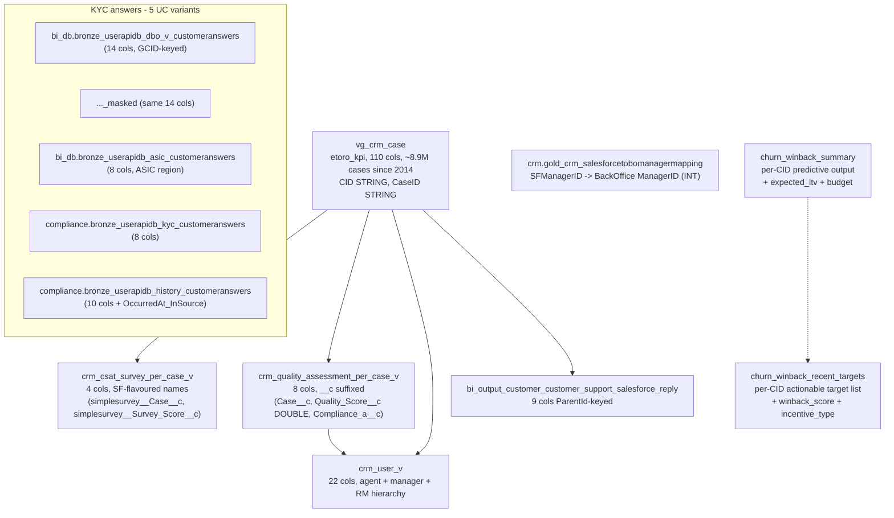

# B.6 — CRM Cases, CSAT, QA & Churn-Winback

The CRM working set: Salesforce-source case ledger + per-case CSAT
survey + per-case agent quality assessment + agent / manager hierarchy +
KYC questionnaire raw answers + churn-winback prediction & target list.
Four Genie spaces consume this stack: PROD-Customer Support Case
Analytics (and a DEV variant), Customer Satisfaction Surveys, Churn
Win-Back Campaign, and the T3 Hackathon space.

**Side classification:** broker-side customer-facing Salesforce
operational layer + predictive-model targeting output (churn-winback).

## When to Use

Use this skill when the question is about:

- A Salesforce case (status, owner, category, escalation, resolution
  time, complaint flag, reopen, deflection) → `vg_crm_case`.
- Survey-based CSAT scoring per case (Salesforce-style column names) →
  `crm_csat_survey_per_case_v`.
- Internal agent QA scoring per case → `crm_quality_assessment_per_case_v`.
- CRM agent / manager / RM hierarchy → `crm_user_v`.
- The Salesforce reply-chain mirror (ticket reply timing) →
  `bi_output_customer_customer_support_salesforce_reply`.
- Mapping a Salesforce-system manager id back to the BackOffice
  ManagerID (numeric) → `gold_crm_salesforcetobomanagermapping`.
- KYC-questionnaire answers (raw OLTP → bronzed UC): 5 variants —
  general, ASIC, KYC, history, masked.
- Churn-winback targeting (which CIDs are predicted to churn and what
  the targeting model recommends) → `churn_winback_summary` /
  `churn_winback_recent_targets`.

Do **NOT** use this skill for:

- KYC verdict / decision (the answer to the questionnaire is here; the
  verdict is `kyc_for_compliance_v` in B.5).
- "How many customers churned?" or "show me the dormant cohort" — those
  are population questions; use the `customer-populations` DE workspace
  skill. `churn_winback_*` is **predictive-model output**, not the
  authoritative churn definition.
- BackOffice operator actions on the account (not a Salesforce ticket)
  → that's `Fact_CustomerAction` (B.4).
- Customer-master attributes (Region / Country / Regulation / Club tier)
  → that's `Dim_Customer` (B.1) or `customer_snapshot_v` (B.5).

## Scope

In scope: 110-col `vg_crm_case` ledger (all status / owner / channel /
category / metric columns), the staging-tier CSAT + QA + user views (and
their Salesforce-flavoured column names — `__c` suffixes,
`simplesurvey__*` prefixes, `cSAT_Date` lower-case S), the
`crm_user_v` 22-col hierarchy with Manager / RM denormalization, the
churn-winback model output (predictive scores + suggested winback
copy + budget + incentive type — NOT a campaign-execution table),
the SF-reply mirror, the SF→BO manager mapping, and all five UC-resident
`*customeranswers*` variants.

Out of scope: a separate compliance KYC verdict view (B.5
`kyc_for_compliance_v`), a population-shape churn metric (DE workspace
`customer-populations`), operator-driven account events (B.4
`Fact_CustomerAction`).

Last verified: 2026-05-11

## Mental model



## Critical warnings (read before writing any SQL)

1. **`vg_crm_case` column names DO NOT match the v1 guess.** Correct:
   `CaseID (STRING)`, `CID (STRING — not INT, not RealCID)`,
   `CaseNumber (STRING)`, `Status (NOT CaseStatus)`, `Origin (NOT
   CaseChannel)`, `Subject (NOT CaseSubject)`, `Category (NOT
   CaseCategory)`, `CaseType / SubType / SubType2 (NOT CaseSubcategory)`,
   `OwnerId (NOT CaseOwner — STRING reference to crm_user_v.UserId)`,
   `IsSolved (BOOLEAN, NOT IsResolved)`, `TotalTimeToResolve (NOT
   ResolutionTime)`, `TimeToFirstResponse`,
   `ResolutionTimeFromFirstResponse`. There is **no** `CaseDescription`,
   `Severity`, `CaseChannel` field.
2. **`Status` enum** (observed values): `Closed, Solved, Pending,
   On-hold, In Routing, Open, Rejected, New, Approved, Verification,
   On it, Messaging Session Routing`. `Closed` and `Solved` together
   account for the bulk of recent cases. Use `IsSolved (BOOLEAN)` to
   filter "resolved" cases generically; use `IsClosedOnCreate` for the
   instant-deflect bucket.
3. **`vg_crm_case` carries deep escalation + complaint + reopen
   metadata.** Key flags: `IsOfficialComplaint`, `IsReOpened`,
   `IsEscalated`, `EscalationStatus`, `IsDeEscalated`, `IsDeflected`,
   `EscalatedBy`, `EscalationDate`, `FinalEscalationResponseDate`,
   `Phase`, `OwnerSubRole`, `CS_OPS`. Linkage to other domains:
   `WithdrawalID`, `DepositID`, `PositionID`, `MirrorID`, `JiraID`,
   `EventID`. Money-impact: `GoodwillGesture` (DECIMAL),
   `TechnicalRefund` (DECIMAL). Note: `SolvedDate` is **STRING** (not
   TIMESTAMP — beware when comparing dates).
4. **CSAT view has 4 cols only, all Salesforce-style.** Real:
   `Id (STRING)`, `cSAT_Date (TIMESTAMP — lower-case 'c')`,
   `simplesurvey__Case__c (STRING — FK to vg_crm_case.CaseID)`,
   `simplesurvey__Survey_Score__c (DECIMAL — typically 1-5)`. **No**
   `CaseID / CSATScore / NPSScore / SurveyDate / free-text feedback`.
   Backtick the `simplesurvey__*` columns in Spark SQL since they
   contain double underscores that some parsers handle awkwardly:
   ` `simplesurvey__Survey_Score__c` `.
5. **QA view has 8 cols, every metric col uses Salesforce `__c`
   suffix.** Real: `Case__c (STRING — FK to vg_crm_case.CaseID)`,
   `Survey__c`, `Agent_Under_Assessment__c (STRING — FK to crm_user_v
   .UserId)`, `Quality_Score__c (DOUBLE)`, `Compliance_a__c (DECIMAL)`,
   `Type_of_Communication__c`, `Team__c`, `CreatedDate (TIMESTAMP)`.
   **No** `QAReviewerID / QAScore / QACategoryScores / QAReviewDate`.
6. **`crm_user_v` agent dim has 22 cols and `FullName` not
   `AgentName`.** It also denormalizes a **manager and RM hierarchy**:
   `UserId (STRING — PK)`, `BO_User_ID (STRING — BackOffice agent
   numeric-as-string)`, `FullName`, `Department`, `Title`, `Position`,
   `Desk`, `Team`, `IsActive (BOOLEAN)`, `ManagerId`, plus
   `Manager_BO_User_ID / FullName / Department / Title / Position /
   Desk / Team / IsActive`, plus `RM_UserId / RM_FullName`,
   `TimeZoneSidKeys`. There is **no** `Tier` column.
7. **Salesforce-to-BO-manager mapping is keyed by `SFManagerID`
   (STRING) → `ManagerID` (INT).** Use this to bridge from the
   Salesforce side back to the analytic BackOffice manager id used by
   `Dim_Customer.ManagerID`.
8. **`churn_winback_*` are predictive-model OUTPUT, not campaign-history
   tables.** `churn_winback_summary` (8 cols per CID): `CID,
   segment_name, age (STRING — usually a bucket like "25-34"),
   country, reason_for_churn_prediction, suggested_winback_text,
   expected_ltv (DECIMAL), budget_to_winback (INT)`. The "recent
   targets" variant adds `winback_score, pct_deposits_withdrawn,
   recent_withdrawal_usd, incentive_type`. **There is no** `CampaignID`,
   `TargetDate`, `ContactedAt`, `RespondedAt`, `CampaignName`,
   `CohortSize`, `ConversionRate` — v1 of this skill invented all of
   these. For population churn metrics use the `customer-populations`
   DE workspace skill.
9. **`bi_output_customer_customer_support_salesforce_reply` is at the
   parent-ticket grain.** 9 cols: `CreatedDateTicket (STRING — date as
   string, not timestamp!), ParentId (STRING — FK to vg_crm_case.CaseID
   for the parent / root case), Club, TicketStatus, DaysToReplyEmail
   (LONG), LastRepliedDate (STRING), etr_y/ym/ymd (STRING partitions)`.
   The reply *content* lives elsewhere — this is only the timing /
   status summary.
10. **KYC `V_CustomerAnswers` has FIVE UC variants — pick the right
    one.** All are GCID-keyed (NOT RealCID).
    - `bi_db.bronze_userapidb_dbo_v_customeranswers` — 14 cols, general
      population, full + masked sibling. Cols: `GCID, OccurredAt,
      FreeText, QuestionId, QuestionText, AnswerId, AnswerText,
      MinThreshold, MaxThreshold, MultipleSelection (BOOLEAN), etr_*`.
    - `bi_db.bronze_userapidb_dbo_v_customeranswers_masked` — same 14
      cols, masked for non-PII pipelines.
    - `bi_db.bronze_userapidb_asic_customeranswers` — 8 cols, **ASIC
      region** answers. Cols: `CustomerAnswerId (INT), TestId (INT),
      Question (STRING), Answer (STRING), OccurredAt, etr_*` — note
      these are FREE-TEXT Question / Answer, not QuestionId/AnswerId.
    - `compliance.bronze_userapidb_kyc_customeranswers` — 8 cols, KYC
      questions only, lives in `compliance` catalog schema. Cols:
      `GCID, QuestionId, AnswerId, OccurredAt, FreeText, etr_*`.
    - `compliance.bronze_userapidb_history_customeranswers` — 10 cols
      with `OccurredAt_InSource` extra. Use when you need the
      "answered-then-revised" history.
11. **Watch for STRING-typed dates / IDs.** `vg_crm_case.SolvedDate`,
    `bi_output_customer_customer_support_salesforce_reply.CreatedDateTicket`,
    and `LastRepliedDate` are STRING — cast or parse if you need to
    compare. `OwnerId`, `UserId`, `Case__c`, `Survey__c`,
    `Agent_Under_Assessment__c` are all STRING (Salesforce 15/18-char
    ids).

## Anchor object reference

### `vg_crm_case` (110 cols) — selected families

- **Identity / linkage**: `CaseID`, `CaseNumber`, `CID (STRING)`,
  `OwnerId (STRING — FK to crm_user_v.UserId)`, `CaseOwnerTitle`,
  `ClosedBy`, `DoneBy`, `WithdrawalID`, `DepositID`, `PositionID`,
  `MirrorID`, `JiraID`, `EventID`
- **Status / lifecycle**: `Status (STRING enum)`, `IsSolved`,
  `IsClosedOnCreate`, `IsReOpened`, `Phase`, `CreatedDate`,
  `ClosedDate`, `SolvedDate (STRING)`, `IsDeflected`
- **Routing / taxonomy**: `Origin`, `Subject`, `Priority`, `Product`,
  `Category`, `CaseType`, `SubType`, `SubType2`, `ServiceLanguage`,
  `CaseSkillSet`, `CaseCreatedByRole`
- **Service metrics**: `IncomingEmailCount`, `OutboundEmailCount`,
  `InternalCommentCount`, `FirstResponseDateTime`,
  `TimeToFirstResponse`, `ResolutionTimeFromFirstResponse`,
  `TotalTimeToResolve`, `TouchCount`, `Touches (LONG)`
- **Compliance / quality**: `IsOfficialComplaint`, `AMLState`,
  `QCSurvey`, `Regulation`, `ClubLevel`, `IsEscalated`,
  `EscalationStatus`, `EscalatedBy`, `EscalationDate`,
  `FinalEscalationResponseDate`, `IsDeEscalated`, `OwnerSubRole`,
  `CS_OPS`
- **Money impact**: `GoodwillGesture (DECIMAL)`,
  `TechnicalRefund (DECIMAL)`

### `crm_user_v` (22 cols)

`UserId (PK), BO_User_ID, FullName, Department, Title, Position, Desk,
Team, IsActive (BOOLEAN), TimeZoneSidKeys, ManagerId,
Manager_BO_User_ID, Manager_FullName, Manager_Department, Manager_Title,
Manager_Position, Manager_Desk, Manager_Team, Manager_IsActive,
RM_UserId, RM_FullName`.

### Churn-winback (bi_output_stg, per-CID predictive output)

- `churn_winback_summary` (8 cols): `CID, segment_name, age, country,
  reason_for_churn_prediction, suggested_winback_text, expected_ltv,
  budget_to_winback`.
- `churn_winback_recent_targets` (12 cols): adds `winback_score (DECIMAL),
  pct_deposits_withdrawn, recent_withdrawal_usd, incentive_type`.

## SQL patterns

### Pattern 1 — case history for a customer

```sql
SELECT c.CaseID, c.CaseNumber, c.Subject, c.Status, c.IsSolved,
       c.Origin, c.Product, c.Category, c.CaseType, c.SubType, c.Priority,
       c.CreatedDate, c.ClosedDate, c.TotalTimeToResolve,
       c.TimeToFirstResponse, c.TouchCount,
       c.IsOfficialComplaint, c.IsEscalated, c.IsReOpened,
       u.FullName AS AgentName, u.Team, u.Manager_FullName
FROM main.etoro_kpi.vg_crm_case        c
LEFT JOIN main.etoro_kpi_stg.crm_user_v u ON u.UserId = c.OwnerId
WHERE c.CID = CAST(:realcid AS STRING)
ORDER BY c.CreatedDate DESC;
```

### Pattern 2 — average CSAT per agent (last 90 days)

```sql
SELECT u.FullName, u.Team,
       COUNT(*)                                         AS Surveys,
       AVG(s.`simplesurvey__Survey_Score__c`)           AS AvgCSAT
FROM main.etoro_kpi_stg.crm_csat_survey_per_case_v s
JOIN main.etoro_kpi.vg_crm_case   c ON c.CaseID = s.`simplesurvey__Case__c`
JOIN main.etoro_kpi_stg.crm_user_v u ON u.UserId = c.OwnerId
WHERE s.cSAT_Date >= CURRENT_DATE() - INTERVAL 90 DAYS
GROUP BY u.FullName, u.Team
HAVING COUNT(*) >= 10
ORDER BY AvgCSAT DESC;
```

### Pattern 3 — agent QA scores per case + agent context

```sql
SELECT q.Case__c                AS CaseID,
       q.`Quality_Score__c`     AS QualityScore,
       q.`Compliance_a__c`      AS ComplianceScore,
       q.`Type_of_Communication__c` AS Channel,
       q.`Team__c`              AS Team,
       q.CreatedDate            AS QADate,
       u.FullName               AS AgentName,
       u.Manager_FullName
FROM main.etoro_kpi_stg.crm_quality_assessment_per_case_v q
LEFT JOIN main.etoro_kpi_stg.crm_user_v u
       ON u.UserId = q.`Agent_Under_Assessment__c`
WHERE q.CreatedDate >= CURRENT_DATE() - INTERVAL 30 DAYS
ORDER BY q.CreatedDate DESC LIMIT 200;
```

### Pattern 4 — churn-winback targets for a CID

```sql
SELECT t.CID, t.segment_name, t.country, t.winback_score,
       t.reason_for_churn_prediction, t.suggested_winback_text,
       t.pct_deposits_withdrawn, t.recent_withdrawal_usd,
       t.expected_ltv, t.budget_to_winback, t.incentive_type
FROM main.bi_output_stg.churn_winback_recent_targets t
WHERE t.CID = :realcid;
```

### Pattern 5 — KYC answers (general dbo variant)

```sql
SELECT a.GCID, a.OccurredAt, a.QuestionId, a.QuestionText,
       a.AnswerId, a.AnswerText, a.FreeText,
       a.MinThreshold, a.MaxThreshold, a.MultipleSelection
FROM main.bi_db.bronze_userapidb_dbo_v_customeranswers_masked a
WHERE a.GCID = :gcid
ORDER BY a.OccurredAt;
```

For ASIC region (free-text, no QuestionId / AnswerId):

```sql
SELECT a.CustomerAnswerId, a.TestId, a.Question, a.Answer, a.OccurredAt
FROM main.bi_db.bronze_userapidb_asic_customeranswers a
WHERE a.TestId = :asic_test_id
ORDER BY a.OccurredAt;
```

### Pattern 6 — escalations + complaints in the last quarter, by Regulation

```sql
SELECT c.Regulation, c.OwnerSubRole, c.EscalationStatus,
       COUNT(*) AS Cases,
       SUM(c.GoodwillGesture)  AS Goodwill_USD,
       SUM(c.TechnicalRefund)  AS Refund_USD,
       AVG(c.TotalTimeToResolve) AS AvgResolveHrs
FROM main.etoro_kpi.vg_crm_case c
WHERE c.CreatedDate >= CURRENT_DATE() - INTERVAL 90 DAYS
  AND (c.IsEscalated = 1 OR c.IsOfficialComplaint = TRUE)
GROUP BY c.Regulation, c.OwnerSubRole, c.EscalationStatus
ORDER BY Cases DESC;
```

### Pattern 7 — Salesforce reply timing per parent case

```sql
SELECT r.ParentId AS CaseID, r.TicketStatus,
       r.DaysToReplyEmail, r.LastRepliedDate, r.CreatedDateTicket, r.Club
FROM main.bi_output.bi_output_customer_customer_support_salesforce_reply r
WHERE r.ParentId = :case_id;
```

### Pattern 8 — bridge Salesforce manager → BO manager

```sql
SELECT m.SFManagerID, m.Name, m.ManagerID, m.CreatedDate
FROM main.crm.gold_crm_salesforcetobomanagermapping m
WHERE m.SFManagerID = :sf_manager_id;
```

## Wiki / KPI source deep-reads

- `knowledge/uc_views/etoro_kpi/vg_crm_case.sql` (view definition)
- `knowledge/uc_views/etoro_kpi_stg/{crm_csat_survey_per_case_v, crm_quality_assessment_per_case_v, crm_user_v}.sql`
- `knowledge/synapse/Wiki/BI_DB_dbo/Tables/UserApiDB_dbo_V_CustomerAnswers.md`
- For churn-winback model methodology see the Customer Retention / BI churn-winback runbook in Confluence.
