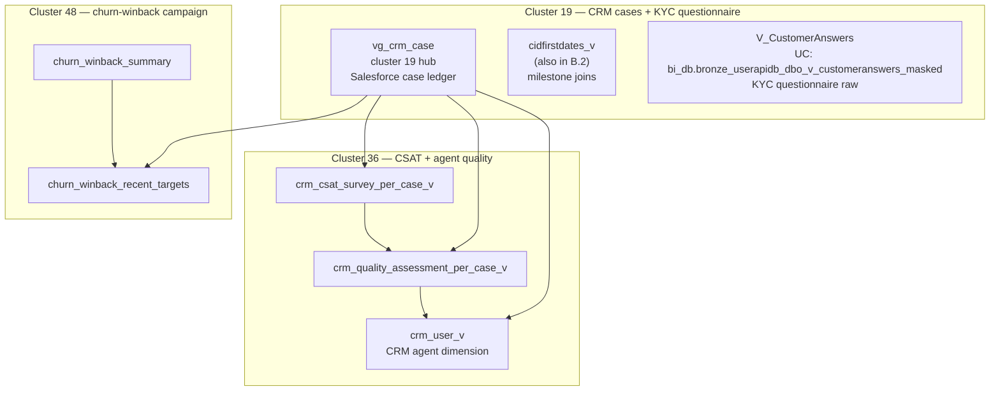

# B.6 — CRM Cases, CSAT & Churn-Winback

A small, three-cluster slice of the super-domain (~16 nodes total) but
with **outsized Genie usage** — four Genie spaces consume these tables.
Treat as one logical sub-skill because the use-cases overlap (a
support case → CSAT score → quality assessment → churn-winback target)
even though the join graph splits them.

## Mental model



## CRM cases — `vg_crm_case`

**UC:** `main.etoro_kpi.vg_crm_case`

The Salesforce-source case ledger, ETLed and curated for analytics. One
row per Salesforce case with:

- `CaseID` (Salesforce case number)
- `CID` / `RealCID` (customer the case is about)
- `CaseSubject`, `CaseDescription` (free text)
- `CreatedDate`, `ClosedDate`, `CaseStatus`
- `CaseOwner` (CRM agent — joins to `crm_user_v`)
- `CaseChannel` (chat / email / phone)
- `CaseCategory`, `CaseSubcategory` (the Salesforce taxonomy)
- `Priority`, `Severity`
- `IsResolved`, `ResolutionTime`

Use it when the question is shaped like "support cases for customer X" /
"average resolution time by category" / "case-volume trends".

For the Salesforce reply chain (per-message detail within a case),
some tables are partially deployed to UC and partially Synapse-only —
check `gold_crm_salesforcetobomanagermapping` and related tables in the
Wiki before joining.

## V_CustomerAnswers — KYC questionnaire (cluster 19, separate domain)

Sometimes confused with CRM cases because both touch customer
"answers" — but `V_CustomerAnswers` is the **KYC-onboarding questionnaire**
(income range, trading experience, source of funds), not a support case.

**UC (masked):** `main.bi_db.bronze_userapidb_dbo_v_customeranswers_masked`

Use when the question is about KYC questionnaire answers (e.g.
"customers who answered 'high' to source-of-funds risk"). The
range-panel variant (`UserApiDB_dbo_V_CustomerAnswers_Range_KYC_Panel`)
is **Synapse-only** — query via Synapse MCP.

## CSAT and agent quality — cluster 36

| View | UC FQN | Granularity |
|---|---|---|
| `crm_csat_survey_per_case_v` | `main.etoro_kpi_stg.crm_csat_survey_per_case_v` | One row per (case, survey response). Columns: `CaseID`, `CSATScore` (1–5 typically), `NPSScore`, `SurveyDate`, free-text feedback. |
| `crm_quality_assessment_per_case_v` | `main.etoro_kpi_stg.crm_quality_assessment_per_case_v` | One row per (case, internal QA review). Columns: `CaseID`, `QAReviewerID`, `QAScore`, `QACategoryScores`, `QAReviewDate`. |
| `crm_user_v` | `main.etoro_kpi_stg.crm_user_v` | CRM agent dimension. Columns: `CRMUserID`, `AgentName`, `Team`, `IsActive`, `Tier`. |

**Schema note:** these views live in `etoro_kpi_stg` (staging-tier), not
`etoro_kpi`. The cases-layer view (`vg_crm_case`) is in `etoro_kpi`. Watch
the schema when joining.

## Churn-winback — cluster 48

| Table | UC FQN | Role |
|---|---|---|
| `churn_winback_summary` | `main.bi_output_stg.churn_winback_summary` | Per-campaign / per-segment summary: cohort size, contact attempts, response rate, conversion-back-to-active rate. |
| `churn_winback_recent_targets` | `main.bi_output_stg.churn_winback_recent_targets` | The list of CIDs targeted by the most recent winback wave. Use this to filter "customers we recently tried to reactivate". |

**These tables are NOT a churn-population definition.** They are the
**campaign target list** and **campaign outcome summary**. If the question
is "how many customers churned?" / "show me the dormant cohort", that's a
**population question** — load the DE workspace skill `customer-populations`
instead, which has the canonical "dormant" / "inactive" segment.

## Critical anti-patterns

1. **DO NOT compute churn rates from `churn_winback_summary`.** That is
   campaign performance, not churn measurement. For churn / dormant /
   reactivation segments, use `customer-populations` workspace skill.
2. **DO NOT confuse `vg_crm_case` with `Fact_CustomerAction` (B.4).** A
   CRM case is a Salesforce ticket (customer-initiated support); a
   CustomerAction is an account-level event (operator action on the
   account, status change, etc.). They overlap on `CID` only.
3. **DO NOT skip the schema prefix.** Cases are in `etoro_kpi`; CSAT/QA are
   in `etoro_kpi_stg`; churn-winback is in `bi_output_stg`. A query that
   types `crm_user_v` without a schema will fail unless the session catalog
   is set right.
4. **DO NOT trust raw CSAT response counts as customer-base-wide opinion.**
   Surveys are sent only to a subset of cases. Always normalize by
   surveys-sent or use the survey-response-rate from
   `crm_csat_survey_per_case_v` directly.
5. **DO NOT join `V_CustomerAnswers` for live KYC.** It is the
   questionnaire raw answer; for the compliance-shaped KYC verdict use
   `kyc_for_compliance_v` (B.5) or `BI_DB_KYC_Panel` (B.1).

## SQL patterns

### Pattern 1 — case history for a customer

```sql
SELECT c.CaseID, c.CaseSubject, c.CaseStatus, c.CreatedDate, c.ClosedDate,
       c.ResolutionTime, u.AgentName, c.CaseCategory, c.Priority
FROM main.etoro_kpi.vg_crm_case        c
LEFT JOIN main.etoro_kpi_stg.crm_user_v u ON u.CRMUserID = c.CaseOwner
WHERE c.CID = :realcid
ORDER BY c.CreatedDate DESC;
```

### Pattern 2 — average CSAT per agent (last 90 days)

```sql
SELECT u.AgentName,
       u.Team,
       COUNT(*)                 AS SurveyCount,
       AVG(s.CSATScore)         AS AvgCSAT,
       AVG(s.NPSScore)          AS AvgNPS
FROM main.etoro_kpi_stg.crm_csat_survey_per_case_v s
JOIN main.etoro_kpi.vg_crm_case                    c ON c.CaseID    = s.CaseID
JOIN main.etoro_kpi_stg.crm_user_v                 u ON u.CRMUserID = c.CaseOwner
WHERE s.SurveyDate >= CURRENT_DATE() - INTERVAL 90 DAYS
GROUP BY u.AgentName, u.Team
HAVING COUNT(*) >= 10
ORDER BY AvgCSAT DESC;
```

### Pattern 3 — was this customer a churn-winback target?

```sql
SELECT t.CID, t.CampaignID, t.TargetDate, t.ContactedAt, t.RespondedAt,
       s.CampaignName, s.CohortSize, s.ConversionRate
FROM main.bi_output_stg.churn_winback_recent_targets t
LEFT JOIN main.bi_output_stg.churn_winback_summary  s ON s.CampaignID = t.CampaignID
WHERE t.CID = :realcid
ORDER BY t.TargetDate DESC;
```

### Pattern 4 — KYC questionnaire answers for a customer

```sql
SELECT a.RealCID, a.QuestionID, a.QuestionText, a.AnswerText, a.AnsweredDate
FROM main.bi_db.bronze_userapidb_dbo_v_customeranswers_masked a
WHERE a.RealCID = :realcid
ORDER BY a.AnsweredDate;
```

## Wiki deep-reads

- KPI view sources for `vg_crm_case`, `crm_csat_survey_per_case_v`, `crm_quality_assessment_per_case_v`, `crm_user_v`: see `knowledge/uc_views/etoro_kpi*/`.
- `knowledge/synapse/Wiki/BI_DB_dbo/Tables/UserApiDB_dbo_V_CustomerAnswers.md`
- For churn-winback campaign methodology: see the BI team's churn-winback runbook in Confluence; the tables are the artifacts, not the documentation.
- For the Salesforce-to-BO-manager mapping: `gold_crm_salesforcetobomanagermapping` (table location varies by ingestion; check `_uc_object_map.md` and the Wiki).
