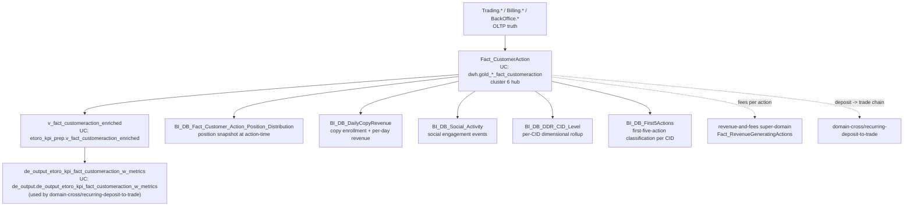

# B.4 — Customer Action Audit Trail

This skill answers "**what happened to / on this customer's account?**" — the
event ledger, indexed by `(RealCID, ActionDate, ActionTypeID)`. Use it for:

- BackOffice / operator-driven actions on a customer (manual deposits, manual
  refunds, status changes, level overrides)
- System-driven actions (auto-suspensions, KYC-gate triggers, club tier
  recalculations)
- Customer-initiated lifecycle events (copy-trading enrollment / disenrollment,
  social follows, post events) with their position-distribution snapshot at
  action-time

**Routing notes:**

- For the **deposit-to-first-trade conversion** chain (FTD → first position),
  prefer the cross-domain skill [`domain-cross/recurring-deposit-to-trade.md`](../domain-cross/recurring-deposit-to-trade.md). It owns the
  pre-stitched `de_output.de_output_etoro_kpi_fact_customeraction_w_metrics`
  table and the cohort patterns. This skill (B.4) owns the raw fact for
  one-off audit / forensics.
- For **eMoney/IBAN audit envelopes** (Treezor XML, FiatDwhDB), the audit
  story is in [`domain-cross/tribe-emoney-audit.md`](../domain-cross/tribe-emoney-audit.md). `Fact_CustomerAction` does NOT
  carry eMoney-side action types.
- For the **fee / revenue per action** breakdown, route to
  [`domain-revenue-and-fees/SKILL.md`](../domain-revenue-and-fees/SKILL.md) — the revenue layer joins to `Fact_CustomerAction`
  and to `Fact_RevenueGeneratingActions`.

## Mental model



## Fact_CustomerAction — the columns

| Column | Meaning | Notes |
|---|---|---|
| `CID` / `RealCID` | Customer (DWH side) | Sentinels `0` to filter |
| `ActionDate` | UTC timestamp of the action | The day-grain SK is `DateID = YYYYMMDD` |
| `ActionTypeID` | FK to action-type dictionary | See `Dim_PlayerStatusReasons` / `Dim_PlayerStatusSubReasons` for some types; product-side types are usually inline integers |
| `OperatorID` | If operator-driven; sentinel `-1` / `0` for system | Joins to `Dim_Manager` for VIP-rep audits |
| `SessionID` | Operator session identifier | Useful to chain together a sequence of actions in one BackOffice session |
| `ActionDetail` | JSON-ish blob with action-type-specific payload | Schema varies by `ActionTypeID`; see Wiki for catalog |
| `BeforeValue` / `AfterValue` | Prior and new values for SCD-style transitions (e.g. status change) | NULL for non-transition actions |
| `IsManual` | 1 if operator-initiated, 0 if system | The most useful filter for "what did ops do?" questions |

Action-type taxonomy is rich (~150+ distinct `ActionTypeID`s across the
product surface). For a curated subset see the per-table wiki and the
enriched view `v_fact_customeraction_enriched` which decodes the most
common ones into named columns.

## Adjacent fact tables in cluster 6

| Table | UC FQN | What it adds |
|---|---|---|
| `BI_DB_Fact_Customer_Action_Position_Distribution` | `main.bi_db.gold_sql_dp_prod_we_bi_db_dbo_bi_db_fact_customer_action_position_distribution` | Snapshot of customer's open positions at action-time (count, gross exposure, leverage distribution). Used to answer "what was their portfolio shape when this happened?" |
| `BI_DB_DailyCopyRevenue` | `main.bi_db.gold_sql_dp_prod_we_bi_db_dbo_bi_db_dailycopyrevenue` | Per-day copy-trading enrollment and the revenue the copier generated (joins to `Dim_Mirror` from Trading super-domain). |
| `BI_DB_Social_Activity` | `main.bi_db.gold_sql_dp_prod_we_bi_db_dbo_bi_db_social_activity` | Social engagement events (follows, posts, reactions). Lower-granularity than Fact_CustomerAction. |
| `BI_DB_DDR_CID_Level` | `main.bi_db.gold_sql_dp_prod_we_bi_db_dbo_bi_db_ddr_cid_level` | Per-CID dimensional rollup over the new DDR framework — a denormalized current-state row per customer with all DDR metrics + dimensional tags. |
| `BI_DB_First5Actions` | `main.bi_db.gold_sql_dp_prod_we_bi_db_dbo_bi_db_first5actions` | First-five-action classification per CID (used in the "first trading action" classifier — also referenced by the registration-to-FTD funnel). |

The remaining cluster-6 members (`BI_DB_UsersEngagement`,
`BI_DB_Investors_Top10`, `BI_DB_CustomerFirst5OpenPositions`,
`BI_DB_ClientBalance_DDR_Data_Integrity_Alert`, `History.Credit`) are
**Synapse-only** (not migrated to UC). For those, query Synapse directly
via the Synapse MCP / pyodbc; do NOT translate them to UC names.

## Critical anti-patterns

1. **DO NOT use `Fact_CustomerAction` for population trends.** It is per-event
   — counting CIDs requires `COUNT(DISTINCT CID)` and is not a population
   metric. For population, use `customer-populations` workspace skill.
2. **DO NOT join to `Fact_BillingDeposit` directly to compute deposit→trade
   conversion.** Use `de_output.de_output_etoro_kpi_fact_customeraction_w_metrics`
   (pre-stitched) or [`domain-cross/recurring-deposit-to-trade.md`](../domain-cross/recurring-deposit-to-trade.md). The raw join silently
   loses recurring-deposit chains.
3. **DO NOT assume `ActionTypeID` is stable across product versions.** The
   dictionary has been re-numbered twice in production history (most recently
   in 2023). Filter on `ActionDate >= '2023-01-01'` when using `ActionTypeID`
   directly, or use the named columns in `v_fact_customeraction_enriched`.
4. **DO NOT confuse `OperatorID` with `Dim_Customer.ManagerID`.** `OperatorID`
   is the BackOffice operator who performed the action (an internal
   employee). `ManagerID` on `Dim_Customer` is the customer's assigned
   account manager / VIP rep — also an employee, but a different role.
5. **DO NOT count copy-trading revenue from `Fact_CustomerAction` alone.** Use
   `BI_DB_DailyCopyRevenue` (which already has the per-day, per-copier
   aggregation) — the copy enrollment events in `Fact_CustomerAction` only
   tell you who started copying whom, not the revenue the copy generated.

## SQL patterns

### Pattern 1 — every operator action on a customer

```sql
SELECT fca.ActionDate, fca.ActionTypeID, fca.OperatorID, fca.SessionID, fca.IsManual,
       fca.BeforeValue, fca.AfterValue, fca.ActionDetail
FROM main.dwh.gold_sql_dp_prod_we_dwh_dbo_fact_customeraction fca
WHERE fca.CID = :realcid
  AND fca.IsManual = 1
ORDER BY fca.ActionDate DESC;
```

### Pattern 2 — what actions happened before / after a deposit-to-trade conversion

Prefer the pre-stitched table in domain-cross/recurring-deposit-to-trade. If you
absolutely need the raw join (for forensics on a single CID):

```sql
SELECT m.*
FROM main.de_output.de_output_etoro_kpi_fact_customeraction_w_metrics m
WHERE m.CID = :realcid
ORDER BY m.ActionDate;
```

### Pattern 3 — portfolio shape at action-time

```sql
SELECT pd.CID, pd.ActionDate, pd.ActionTypeID,
       pd.OpenPositionCount, pd.GrossExposure, pd.MaxLeverage, pd.AvgLeverage
FROM main.bi_db.gold_sql_dp_prod_we_bi_db_dbo_bi_db_fact_customer_action_position_distribution pd
WHERE pd.CID = :realcid
ORDER BY pd.ActionDate DESC
LIMIT 20;
```

### Pattern 4 — per-CID DDR rollup (current state)

```sql
SELECT cid.CID, cid.LifetimeDeposit, cid.LifetimeRevenue, cid.LifetimeAUM,
       cid.RegulationName, cid.ClubLevelName, cid.IsActiveTrader, cid.LastTradeDate
FROM main.bi_db.gold_sql_dp_prod_we_bi_db_dbo_bi_db_ddr_cid_level cid
WHERE cid.CID = :realcid;
```

`BI_DB_DDR_CID_Level` is a denormalized one-row-per-customer rollup — handy
for dashboards but not for trend analysis (use the new DDR daily/periodic
status tables in Payments super-domain for trend).

## Wiki deep-reads

- `knowledge/synapse/Wiki/DWH_dbo/Tables/Fact_CustomerAction.md` — full ActionTypeID catalog
- `knowledge/synapse/Wiki/BI_DB_dbo/Tables/BI_DB_Fact_Customer_Action_Position_Distribution.md`
- `knowledge/synapse/Wiki/BI_DB_dbo/Tables/BI_DB_DailyCopyRevenue.md`
- `knowledge/synapse/Wiki/BI_DB_dbo/Tables/BI_DB_DDR_CID_Level.md`
- `knowledge/synapse/Wiki/BI_DB_dbo/Tables/BI_DB_First5Actions.md`
- `knowledge/synapse/Wiki/BI_DB_dbo/Tables/BI_DB_Social_Activity.md`
