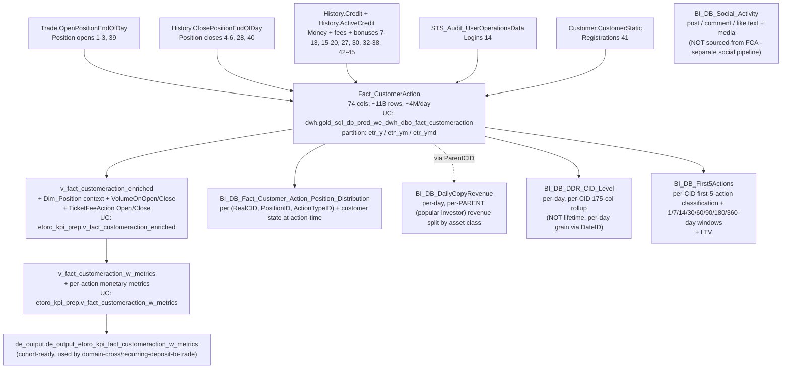

# B.4 — Customer Action Audit Trail

The unified customer event log. One row per significant action a customer
performed (or had performed on their account), classified by `ActionTypeID`
and enriched with sparse, action-type-specific payload columns. Use this
for single-CID forensics ("what did this customer do, when, and what
financial details?"), per-action revenue / fee / commission attribution
(via the enriched and w_metrics views), and cohort-shaped funnels
(deposit → first trade, registration → first deposit) — though for cohort
work prefer the pre-stitched cross-domain skill below.

**Side classification:** broker-side customer-event ledger and its
position-context + state-at-action-time enrichment layers.

## When to Use

Use this skill when the question is about events on a single customer's
account, the catalog of action types, fee sub-classification, partial-close
or reopen mechanics, per-action volume / commission attribution, the
action-time customer-state snapshot, copy-trade revenue per popular
investor, the per-day per-CID DDR rollup, or first-five-action lifecycle
classification with early-window LTV.

Do **NOT** use this skill for:

- **Deposit-to-first-trade / FTD funnel cohorts** → use
  [`domain-cross/recurring-deposit-to-trade.md`](../domain-cross/recurring-deposit-to-trade.md). It owns
  `de_output.de_output_etoro_kpi_fact_customeraction_w_metrics` and the
  cohort patterns. This skill (B.4) owns the raw fact for one-off forensics.
- **eMoney / IBAN / wallet-side audit** →
  [`domain-cross/tribe-emoney-audit.md`](../domain-cross/tribe-emoney-audit.md). `Fact_CustomerAction`
  does NOT carry eMoney-side action types (Treezor XML envelope lives
  separately).
- **Fee / revenue per ActionTypeID rolled up into the canonical revenue
  layer** → [`domain-revenue-and-fees/SKILL.md`](../domain-revenue-and-fees/SKILL.md).
  The revenue layer reuses `Fact_CustomerAction` (especially
  `ActionTypeID=35` fees) and `Fact_RevenueGeneratingActions`.
- **Position state / open-vs-current attributes** →
  [`domain-trading/position-state-and-grain.md`](../domain-trading/position-state-and-grain.md). FCA
  records *what happened* per position event; `Dim_Position` records
  *current* (and partially historical) state per position.

## Scope

In scope:

- `Fact_CustomerAction` schema, ETL sources, ActionTypeID taxonomy via
  `Dim_ActionType`, sparse-column semantics, partial-close / reopen
  mechanics, fee sub-classification (`IsFeeDividend`,
  `CompensationReasonID`), DLT flags, FTD flag.
- `v_fact_customeraction_enriched`: how the Active vs Passive split
  works, what each enriches with (Dim_Position context, VolumeOnOpen /
  VolumeOnClose, detach-aware MirrorID, TicketFeeAction derivation,
  compensation-PositionID back-resolution from Description).
- `v_fact_customeraction_w_metrics` and its `de_output` cohort variant.
- Action-time customer-state snapshot
  (`BI_DB_Fact_Customer_Action_Position_Distribution`, 40 cols), the
  per-day per-CID rollup (`BI_DB_DDR_CID_Level`, 175 cols), per-CID
  first-five-action + LTV (`BI_DB_First5Actions`, 86 cols), per-day
  per-PARENT copy revenue (`BI_DB_DailyCopyRevenue`, 18 cols), and the
  live social pipeline (`BI_DB_Social_Activity`, 18 cols).
- Documentation of what does **NOT** exist on FCA (no OperatorID, no
  IsManual, no ActionDetail JSON blob, no BeforeValue / AfterValue) so
  callers stop asking for it.

Out of scope: revenue accounting at the company level (use revenue-and-fees
domain), copy enrollment-vs-revenue at copier granularity (need a join
to `Dim_Mirror`), eMoney / Tribe XML envelope audit (use cross-domain
skill), Treezor authorisation audit.

Last verified: 2026-05-11

## Mental model



## Critical warnings (read before writing any SQL)

1. **`Fact_CustomerAction` has NO `OperatorID`, NO `IsManual`, NO
   `ActionDetail` JSON blob, NO `BeforeValue`/`AfterValue`.** Those
   column names are NOT in the table (verified 2026-05-11 against
   `information_schema.columns`, 74 cols total). The real identifiers
   are: `HistoryID` (DECIMAL — DOC says "intended as a unique key but
   contains duplicates - NOT reliable as a primary/unique identifier")
   and `SessionID` (LONG, from STS service, monotonically increasing —
   useful to chain a sequence of actions but NOT an operator key).
   Operator-driven actions ARE captured (the source `History.Credit` is
   trigger-fed from BackOffice and the production cashier), but there is
   no in-table "operator" field. To identify operator-driven money
   movements, filter on `MoveMoneyReasonID` (1=Adjustment, 5=InternalTransfer
   Trade, 6=InternalTransfer, 8=Recurring Deposit, 9=Recurring Investment)
   and `CompensationReasonID` (via `BackOffice.CompensationReason`).
2. **The timestamp column is `Occurred`, NOT `ActionDate`.** The day-grain
   surrogate is `DateID` (INT, YYYYMMDD format, derived from `@Yesterday`
   in the ETL). The parquet partition is `etr_ymd` (STRING). For
   high-selectivity queries, filter on `etr_ymd` (it's the partition
   pruner) AND/OR `DateID` (it's the clustered index).
3. **`Dim_ActionType` has 45 rows total** (IDs 0-45 with 13, 31 missing
   gaps — actually 31 IS used for "Open CRM Case"). NOT 150+ as a prior
   version of this skill claimed. Active per-day distinct ActionTypeIDs:
   ~25. The dictionary IS stable across product history — the prior
   "renumbered in 2023" warning was wrong. The unstable thing is which
   ActionTypeIDs are *being populated*: e.g., 21-26 (social Publish/Receive
   Post/Comment/Like) are flagged "DEAD DATA — legacy rows exist but no
   longer updated" by the table wiki; for active social engagement use
   `BI_DB_Social_Activity` (which is sourced from the live social
   pipeline, NOT from FCA).
4. **Position-side ActionTypeIDs come in pairs, and the pair matters.**
   1=ManualPositionOpen vs 2=CopyPositionOpen vs 3=CopyPlusPositionOpen
   are distinguished by `MirrorID` and `OrigParentPositionID` at source;
   closes mirror this (4/5/6 + 28=DetachedClose + 40=Unknown). When
   counting "trades" you almost always want `ActionTypeID IN (1, 2, 3, 39)`
   for opens; for "real positions ever held by this CID" you want either
   the open OR the close (each position appears twice — once open, once
   close). 39 (PositionOpenTypeUnknown) and 40 (PositionCloseTypeUnknown)
   are fixed up at weekly maintenance when the matching `History.Credit`
   row arrives.
5. **`IsFeeDividend` sub-classifies `ActionTypeID=35` only.** Per
   DSM-1463: 1=overnight/weekend fee, 2=dividend, 3=SDRT, 4=ticket fees
   (`Description IN ('OpenTotalFees','CloseTotalFees')`). NULL for any
   `ActionTypeID != 35`. The enriched view derives `TicketFeeAction`
   = 'Open' / 'Close' / NULL from `Description` for ticket fees.
6. **Partial-close mechanics are NOT optional.** `IsPartialCloseParent=1`
   marks the parent position that was partially closed;
   `IsPartialCloseChild=1` marks the child (remainder). Per the column
   comment: *"Generally filter out CHILD positions from most metrics on
   OPEN when aggregating, but not all (e.g., volume is already pro-rated
   so excluding these is wrong). NEVER filter these out on CLOSE."*
   `CommissionByUnits` / `FullCommissionByUnits` /
   `OpenMarkupByUnits` are the pro-rated values for partial-close PnL
   computations.
7. **Reopen mechanics: `CommissionOnClose` and `FullCommissionOnClose`
   are adjusted by `SP_Dim_Position` when a position is reopened.**
   `CommissionOnCloseOrig` / `FullCommissionOnCloseOrig` store the
   pre-adjustment values. `ReopenForPositionID` references the
   erroneously closed PositionID; `IsReOpen=1` when this row IS the
   reopened position.
8. **`v_fact_customeraction_enriched` splits actions into Passive vs
   Active and joins differently.** Passive = `ActionTypeID IN (32, 35, 19)`
   OR `(36 AND CompensationReasonID IN (56, 117, 118))`. For
   Passive Actions, `VolumeOnOpen` and `VolumeOnClose` are forced to
   NULL to prevent aggregation duplication. For Compensation rows with
   `CompensationReasonID IN (117, 118)`, the view extracts a PositionID
   encoded as the LAST WORD in `Description` via
   `TRY_CAST(REVERSE(SUBSTRING(REVERSE(Description), 1, CHARINDEX(' ', REVERSE(Description)) - 1)) AS BIGINT)`
   — read that twice. This is the only way to back-resolve compensation
   to a position. For Active Actions, `VolumeOnOpen = ROUND(InitialUnits *
   InitForexRate * InitConversionRate)` from `dim_position`,
   `VolumeOnClose` is taken from `dim_position.VolumeOnClose`.
9. **`MirrorID` in the enriched view is detach-aware.** It compares
   `fca.Occurred` against `MAX(Occurred)` of any `ActionTypeID=19`
   (Detach position from mirror) for that PositionID — if the action
   happened after the detach event, MirrorID is forced to 0. This means
   raw `Fact_CustomerAction.MirrorID` will tell you the original copy
   state, but the enriched view tells you the effective copy state at
   action-time.
10. **Some "cluster-6" tables are Synapse-only (verified 2026-05-11):**
    `BI_DB_UsersEngagement`, `BI_DB_Investors_Top10`,
    `BI_DB_CustomerFirst5OpenPositions`,
    `BI_DB_ClientBalance_DDR_Data_Integrity_Alert`. Query Synapse
    directly via the Synapse MCP / pyodbc for these. The UC-available
    cluster-6 tables are: `BI_DB_Fact_Customer_Action_Position_Distribution`,
    `BI_DB_DailyCopyRevenue`, `BI_DB_Social_Activity`, `BI_DB_DDR_CID_Level`,
    `BI_DB_First5Actions`.

## Anchor object reference

### `Fact_CustomerAction` — actual schema highlights (74 cols)

| Column | Type | Meaning | Notes |
|---|---|---|---|
| `HistoryID` | DECIMAL | "Intended unique key" — DO NOT use as PK (has dups). Tier 5 |
| `GCID` | INT | Global CID (cross-platform). Distribution key in Synapse |
| `RealCID` | INT | Real-money CID. NULL when session was demo-only |
| `DemoCID` | INT | Demo CID. NULL when real-only |
| `Occurred` | TIMESTAMP | **The action timestamp** (NOT "ActionDate") |
| `ActionTypeID` | INT | FK → `Dim_ActionType` (45 rows). The classifier |
| `DateID` | INT | YYYYMMDD partition / clustered-index key |
| `TimeID` | INT | Hour 0-23, `DATEPART(HOUR, Occurred)` |
| `SessionID` | LONG | STS session id (monotonic). NOT an operator id |
| `IsFTD` | INT | First-Time Deposit flag. NULL for non-deposit events |
| `IsFeeDividend` | INT | 1/2/3/4 for ActionTypeID=35 sub-type. NULL elsewhere |
| `Description` | STRING | Sparse — fees, compensation, edit-stoploss text |
| `CompensationReasonID` | INT | For ActionTypeID=36 + airdrop opens. → `BackOffice.CompensationReason` |
| `MoveMoneyReasonID` | INT | 1=Adj, 5=Internal Trade, 6=Internal, 8=Recurring Dep, 9=Recurring Inv |
| `PaymentStatusID` | INT | For deposit / cashout events. → `Dim_PaymentStatus` |
| `FundingTypeID` | INT | Payment method. → `Dim_FundingType` |
| `WithdrawID` / `WithdrawPaymentID` | INT | Cashout linkage. Dedup via WithdrawPaymentID |
| `DepositID` / `CreditID` | INT/LONG | History.Credit linkage. CreditID added 2025-07 |
| `LoginID` / `DurationInSeconds` | INT | Login session linkage |
| `IPNumber` / `CountryIDByIP` / `IsAnonymousIP` / `ProxyType` | mix | Login / registration geolocation |
| `PostID` / `PostRootID` | STRING | Social engagement (DEAD for 21-26) |
| `CaseID` | INT | CRM case (ActionTypeID=31) |
| `CampaignID` / `BonusTypeID` | INT | Marketing / bonus dictionary |
| `PositionID`, `InstrumentID`, `Amount`, `Leverage`, `IsBuy`, `IsSettled`, `MirrorID`, `IsAirDrop`, `IsRedeem`, `IsDiscounted`, `SettlementTypeID`, `RegulationIDOnOpen` | mix | Position-side attributes (NULL/0 for non-position events) |
| `Commission`, `FullCommission`, `CommissionOnClose`, `FullCommissionOnClose`, `CommissionByUnits`, `FullCommissionByUnits`, `CommissionOnCloseOrig`, `FullCommissionOnCloseOrig`, `OpenMarkupByUnits`, `NetProfit` | DECIMAL | Trade economics |
| `IsPartialCloseParent`, `IsPartialCloseChild`, `InitialUnits`, `OriginalPositionID`, `ReopenForPositionID`, `IsReOpen` | mix | Partial-close / reopen mechanics |
| `DLTOpen` / `DLTClose` | INT | DLT flags (added 2024-06-02) |
| `RedeemID` / `RedeemStatus` / `DividendID` | INT | Cross-references |
| `etr_y` / `etr_ym` / `etr_ymd` | STRING | Parquet partition columns — USE FOR PRUNING |

### `Dim_ActionType` (45 rows) — the canonical key

Join `Fact_CustomerAction` to `main.dwh.gold_sql_dp_prod_we_dwh_dbo_dim_actiontype`
on `ActionTypeID`. Don't hard-code names. Active families:

| IDs | Family | Source |
|---|---|---|
| 1, 2, 3, 39 | PositionOpen (Manual / Copy / Copy+ / Unknown) | Trade.OpenPositionEndOfDay |
| 4, 5, 6, 28, 40 | PositionClose (Manual / Copy / Copy+ / Detached / Unknown) | History.ClosePositionEndOfDay |
| 7, 27, 38, 44 | Deposit (Deposit / DepositAttempt / Affiliate / Internal) | History.Credit |
| 8, 10, 30, 37, 42, 43, 45 | Cashout / Refund / Withdraw (8=Cashout, 10=Cashout request, 30=Processed, 37=Reverse, 42=Rollback, 43=Reverse Deposit, 45=InternalWithdraw) | History.Credit |
| 9 | Bonus | History.Credit |
| 11, 12, 13 | Chargeback / Refund / Refund-As-Chargeback | History.Credit |
| 14, 29 | LoggedIn (web) / Cashier Login | STS / Billing.Login |
| 15, 16, 17, 18, 19, 20 | Mirror ops (balance-to-mirror, mirror-to-balance, register, unregister, detach, detach stock) | History.Credit |
| 21-26 | Social engagement (DEAD DATA) | n/a |
| 31 | Open CRM Case | CRM |
| 32 | Edit StopLoss | History.Credit (CreditTypeID=13) |
| 34 | Open Stock Order | History.Credit (CreditTypeID=29) |
| 35 | End Of The Week Fee (sub-classed by `IsFeeDividend`) | History.Credit (CreditTypeID=14) |
| 36 | Compensation (sub-classed by `CompensationReasonID`) | History.Credit (CreditTypeID=6) |
| 41 | Customer Registration | Customer.CustomerStatic |

## Enrichment & metrics views

| Layer | UC FQN | What it adds |
|---|---|---|
| `v_fact_customeraction_enriched` | `main.etoro_kpi_prep.v_fact_customeraction_enriched` | 79 cols. + `OpenDateID`/`CloseDateID`, `VolumeOnOpen`/`VolumeOnClose` (Active only — NULL for Passive), `TicketFeeAction`, detach-aware MirrorID, compensation-PositionID back-resolution. LEFT JOIN to `dim_position`. |
| `v_fact_customeraction_w_metrics` | `main.etoro_kpi_prep.v_fact_customeraction_w_metrics` | Per-action monetary metrics (revenue / fee splits) on top of enriched. **Authoritative for trading-side amounts** — see [`domain-trading/trading-volumes.md`](../domain-trading/trading-volumes.md). |
| `de_output_*_fact_customeraction_w_metrics` | `main.de_output.de_output_etoro_kpi_fact_customeraction_w_metrics` | Cohort-ready pre-materialised variant; used by [`domain-cross/recurring-deposit-to-trade.md`](../domain-cross/recurring-deposit-to-trade.md). |

## Adjacent cluster-6 tables (UC-available)

| Table | UC FQN | Cols | What it adds |
|---|---|---|---|
| `BI_DB_Fact_Customer_Action_Position_Distribution` | `main.bi_db.gold_..._customer_action_position_distribution` | 40 | One row per `(RealCID, PositionID, ActionTypeID)` with **customer-state dimensional IDs resolved at action-time** (CountryID, LabelID, VerificationLevelID, PlayerStatusID, RiskStatusID, RiskClassificationID, GuruStatusID, RegulationID, AccountStatusID, AccountManagerID, PlayerLevelID, AccountTypeID, IsDepositor, SuitabilityTestStatusID, MifidCategorizationID, IsValidCustomer, IsCreditReportValidCB, AffiliateID, SettlementTypeID). **NOT a portfolio-shape distribution** — it's an action-time customer-state snapshot per position. |
| `BI_DB_DailyCopyRevenue` | `main.bi_db.gold_..._bi_db_dailycopyrevenue` | 18 | **Per-day, per-PARENT (popular investor / guru)** revenue split by asset class: `Revenue_Copy`, `Revenue_Real_Stocks`, `Revenue_CFD_Stocks`, `Revenue_Real_Crypto`, `Revenue_CFD_Crypto`, `Revenue_FX`, `Revenue_Comm`, `Revenue_Ind`. Grain = `Date` × `ParentCID`. **NOT "per-day per-copier"** — to enumerate copiers join to `Dim_Mirror`. |
| `BI_DB_Social_Activity` | `main.bi_db.gold_..._bi_db_social_activity` | 18 | Social post / comment / like text + media. **NOT sourced from `Fact_CustomerAction`** — independent live social pipeline. Use for active social engagement (FCA 21-26 are DEAD). Key cols: `ActionTypeID`, `ActionDate`, `PostID`, `CommentID`, `RealCID`, `MessageText`, `MessageSize`, `MessageWordNum`, `MediaTypeID`, `ParentID`, `SubTypeName`, `ActionID`. |
| `BI_DB_DDR_CID_Level` | `main.bi_db.gold_..._bi_db_ddr_cid_level` | 175 | **Per-day per-CID** (NOT lifetime, has `DateID` grain). Aggregated metrics. Real columns: `Deposits`, `Revenue`, `Equity`, `Bonus`, `Compensation`, `Cashouts`, `Regulation` (STRING), `Country`, `PlayerLevel`, `PlayerStatus`, `AccountType`, `ActiveTrader`, `Funded_New_Def`, `FirstDepositDate`, `FirstDepositors`, `Registrations`, …175 cols total. **NO `LifetimeDeposit/Revenue/AUM` etc.** — those names were fabricated in a prior version. |
| `BI_DB_First5Actions` | `main.bi_db.gold_..._bi_db_first5actions` | 86 | **Per-CID** first-five-action classification: `FirstAction`/`SecondAction`/.../`FifthAction` + dates + leverages + instruments + cross-types + 1/7/14/30/60/90/180/360-day revenue/deposit/equity windows + `LTV`, `AffiliateID`, `NewMarketingRegion`. Used by the registration-to-FTD funnel and lifecycle classifiers. |

## SQL patterns

### Pattern 1 — every action for a single customer, with type names

```sql
SELECT fca.DateID, fca.Occurred, fca.ActionTypeID, dat.Name AS ActionName, dat.Category,
       fca.PositionID, fca.InstrumentID, fca.Amount, fca.MirrorID,
       fca.Description, fca.IsFeeDividend, fca.CompensationReasonID
FROM main.dwh.gold_sql_dp_prod_we_dwh_dbo_fact_customeraction fca
LEFT JOIN main.dwh.gold_sql_dp_prod_we_dwh_dbo_dim_actiontype dat
       ON fca.ActionTypeID = dat.ActionTypeID
WHERE fca.RealCID = :realcid
  AND fca.etr_ymd BETWEEN '2026-04-01' AND '2026-05-10'
ORDER BY fca.Occurred DESC;
```

### Pattern 2 — fee waterfall for a customer (use IsFeeDividend)

```sql
SELECT fca.DateID,
       CASE fca.IsFeeDividend
         WHEN 1 THEN 'overnight/weekend'
         WHEN 2 THEN 'dividend'
         WHEN 3 THEN 'SDRT'
         WHEN 4 THEN 'ticket'
       END AS FeeType,
       SUM(fca.Commission)         AS Commission_USD,
       SUM(fca.FullCommission)     AS FullCommission_USD,
       COUNT(*)                    AS FeeEvents
FROM main.dwh.gold_sql_dp_prod_we_dwh_dbo_fact_customeraction fca
WHERE fca.RealCID = :realcid
  AND fca.ActionTypeID = 35
  AND fca.etr_y = '2026'
GROUP BY fca.DateID, fca.IsFeeDividend
ORDER BY fca.DateID DESC, FeeType;
```

### Pattern 3 — per-action volume (use the enriched view — Active only)

`VolumeOnOpen` is NULL for Passive Actions (35, 32, 19, 36-with-56/117/118)
by design — don't aggregate it without filtering on Active types.

```sql
SELECT v.DateID,
       SUM(v.VolumeOnOpen)  AS VolumeOpen_USD,
       SUM(v.VolumeOnClose) AS VolumeClose_USD,
       COUNT(*)             AS Actions
FROM main.etoro_kpi_prep.v_fact_customeraction_enriched v
WHERE v.RealCID = :realcid
  AND v.ActionTypeID IN (1, 2, 3, 39, 4, 5, 6, 28, 40)
  AND v.etr_y = '2026'
GROUP BY v.DateID
ORDER BY v.DateID DESC;
```

### Pattern 4 — back-resolve compensation events to a position

For `ActionTypeID=36` (Compensation), the position is encoded in the last
word of `Description` when `CompensationReasonID IN (117, 118)`. The
enriched view does this for you (uses TRY_CAST + REVERSE + SUBSTRING):

```sql
SELECT v.RealCID, v.Occurred, v.PositionID, v.CompensationReasonID, v.Amount, v.Description
FROM main.etoro_kpi_prep.v_fact_customeraction_enriched v
WHERE v.ActionTypeID = 36
  AND v.CompensationReasonID IN (117, 118)
  AND v.RealCID = :realcid
ORDER BY v.Occurred DESC
LIMIT 20;
```

### Pattern 5 — customer state at action-time

```sql
SELECT pd.DateID, pd.PositionID, pd.ActionTypeID, pd.Amount, pd.Leverage, pd.IsBuy,
       pd.CountryID, pd.LabelID, pd.RegulationID, pd.PlayerStatusID,
       pd.RiskStatusID, pd.RiskClassificationID, pd.MifidCategorizationID,
       pd.IsValidCustomer, pd.IsCreditReportValidCB
FROM main.bi_db.gold_sql_dp_prod_we_bi_db_dbo_bi_db_fact_customer_action_position_distribution pd
WHERE pd.RealCID = :realcid
  AND pd.etr_y = '2026'
ORDER BY pd.Occurred DESC
LIMIT 50;
```

### Pattern 6 — per-day per-CID DDR rollup

```sql
SELECT cid.DateID, cid.CID, cid.Deposits, cid.Cashouts, cid.Bonus, cid.Compensation,
       cid.Revenue, cid.Equity, cid.NetDeposit, cid.UnrealizedPnL, cid.CustomerPnL,
       cid.Regulation, cid.Country, cid.PlayerLevel, cid.PlayerStatus,
       cid.ActiveTrader, cid.Funded_New_Def
FROM main.bi_db.gold_sql_dp_prod_we_bi_db_dbo_bi_db_ddr_cid_level cid
WHERE cid.CID = :realcid
  AND cid.DateID BETWEEN 20260401 AND 20260510
ORDER BY cid.DateID DESC;
```

### Pattern 7 — first 5 actions + early-window LTV per CID

```sql
SELECT f5.CID, f5.FirstAction, f5.FirstActionDate, f5.FirstInstrument, f5.FirstLeverage,
       f5.SecondAction, f5.SecondActionDate, f5.ThirdAction, f5.FourthAction, f5.FifthAction,
       f5.TradedCrypto, f5.TradedCopy, f5.TradedCopyFund, f5."Traded_FX/Commodities/Indices",
       f5."Traded_Stocks/ETFs",
       f5.Revenue30days, f5.Revenue90days, f5.Revenue360days, f5.LTV
FROM main.bi_db.gold_sql_dp_prod_we_bi_db_dbo_bi_db_first5actions f5
WHERE f5.CID = :realcid;
```

Note: `Traded_FX/Commodities/Indices` and `Traded_Stocks/ETFs` contain
slashes in the column NAME — backtick-quote them in Spark SQL.

## Wiki deep-reads

- `knowledge/synapse/Wiki/DWH_dbo/Tables/Fact_CustomerAction.md` — full ActionTypeID catalog, ETL flow, partial-close + reopen mechanics
- `knowledge/synapse/Wiki/BI_DB_dbo/Tables/BI_DB_Fact_Customer_Action_Position_Distribution.md`
- `knowledge/synapse/Wiki/BI_DB_dbo/Tables/BI_DB_DailyCopyRevenue.md`
- `knowledge/synapse/Wiki/BI_DB_dbo/Tables/BI_DB_DDR_CID_Level.md`
- `knowledge/synapse/Wiki/BI_DB_dbo/Tables/BI_DB_First5Actions.md`
- `knowledge/synapse/Wiki/BI_DB_dbo/Tables/BI_DB_Social_Activity.md`
