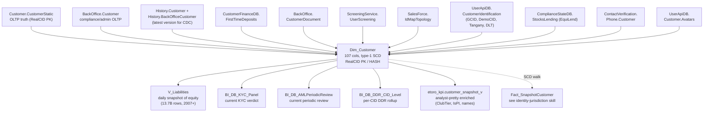

# Customer Master Record

`Dim_Customer` is the **single canonical answer** to "show me the row for customer X" and "what is the CURRENT state of attribute Y for this customer". It is the largest hub in the entire DWH semantic graph (cluster 2, 146 directly-connected neighbours, weight 922): every fact in the warehouse joins to it on `CID = RealCID`. It denormalizes 14+ OLTP/staging sources (`Customer.CustomerStatic`, `BackOffice.Customer`, `History.Customer`, `History.BackOfficeCustomer`, `STS_Audit.UserOperationsData`, `ContactVerification.Phone.Customer`, `UserApiDB.Customer.Avatars`, `CustomerFinanceDB.Customer.FirstTimeDeposits`, `ScreeningService.UserScreening`, `SalesForce_DB_Prod.IdMapTopology`, `BackOffice.CustomerDocument`, `UserApiDB.Customer.CustomerIdentification`, `ComplianceStateDB.Compliance.StocksLending`) into a single 107-column row per customer via `SP_Dim_Customer`, with explicit CDC change detection over 50+ columns and indicator preservation across DELETE+INSERT updates.

**Side classification:** broker-side customer master. Trading positions, eMoney/IBAN balances, EXW wallet balances, and all behavioural metrics hang off this row.

> **PII variants.** Two UC copies exist with identical column structure:
> - `main.dwh.gold_sql_dp_prod_we_dwh_dbo_dim_customer_masked` — analyst-facing; 14 PII columns (UserName, FirstName, LastName, MiddleName, Gender, BirthDate, Email, Phone, IP, Zip, City, Address, BuildingNumber, UserName_Lower) are masked.
> - `main.pii_data.gold_sql_dp_prod_we_dwh_dbo_dim_customer` — full PII; access via explicit Unity Catalog grants.
> The masked variant carries every analytical column you need (`RealCID`, `GCID`, `CountryID`, `RegulationID`, `PlayerLevelID`, `PlayerStatusID`, `AccountTypeID`, `MifidCategorizationID`, `IsDepositor`, `FirstDepositDate`, `IsValidCustomer`, `IsEDD`, `RegisteredReal`, `GuruStatusID`, `NumOfCopiers`, `WorldCheckID`, `HasWallet`, `ApexID`, etc.). Default to masked. Reach for `pii_data.*` only with explicit operator-side business need.

## When to Use

Load when the question concerns the current customer master row, the broker-side identity columns, or the analyst-facing denormalized lookup:

- "Show the row for customer X", "master record for RealCID 12345"
- "What country / regulation / MiFID category / language is customer X under right now?"
- "Is customer X a Popular Investor?" (program status via `GuruStatusID` — `PlayerLevelID = 4` is the `Internal` employee level per `Dim_PlayerLevel`, not a PI flag)
- "Is customer X a depositor? FTD date? FTD amount?"
- "Which customers have an Apex broker / Tangany custody / EquiLend / DLT integration?"
- "What's customer X's KYC verification level / EDD flag / WorldCheck status?"
- "Show all employee accounts / CySEC customers / verification-level-3 customers"
- "What's the current realizable equity for customer X?" (via `V_Liabilities` filtered to latest `FullDate`)

Do NOT load for:

- **Historical attribute walks** ("what was the regulation on 2025-06-01?") → `identity-jurisdiction-and-regulation` (SCD via `Fact_SnapshotCustomer`).
- **Cross-platform identity joins** (DWH ↔ eMoney ↔ EXW Wallet via `GCID`) — this skill names the join key on the DWH side; the bridge map lives in the router and per-platform skills.
- **Population counts / lifecycle segments** (Funded / Active Trader / FTF) → DE workspace skill `customer-populations` (uses `gold_de_user_dim_ddr_customer_dailystatus_scd`).
- **Onboarding funnel** (reg → KYC → V1/V2/V3 → FTD → first action) → DE workspace skill `registration-to-ftd-funnel` (uses `etoro_kpi.ftd_funnel_v`).
- **OLTP forensics / breach flags** → `oltp-customer-static-and-breaches`.
- **CRM cases / CSAT / churn** → `crm-cases-csat-and-churn`.
- **LTV bucket / daily cluster / segments** → `customer-models-and-segmentation`.

## Scope

In scope: the 107 columns on `Dim_Customer` (identity, PII-masked personal info, acquisition/marketing FKs, registration & lifecycle flags, compliance & regulation, MiFID classification, KYC docs, World-Check, EDD, social/Guru/PI program counters, account management/SF link, 2FA & phone verification, external broker IDs — Apex/Tangany/EquiLend/DLT, FTD recovery fields, the DWH-computed `IsValidCustomer` / `IsCreditReportValidCB` gates); the masked vs full-PII variants; `V_Liabilities` daily snapshot of equity (per-CID per-day); `BI_DB_KYC_Panel` current-state KYC verdict; `BI_DB_AMLPeriodicReview` current periodic review status; `BI_DB_DDR_CID_Level` per-CID dimensional rollup over DDR (current state); the analyst-pretty `etoro_kpi.customer_snapshot_v` join layer (Dim_Customer + dim joins + club enrichment).
Out of scope: SCD walks (`identity-jurisdiction-and-regulation`); OLTP `Customer.CustomerStatic` raw columns and breach/illegal-trade flags (`oltp-customer-static-and-breaches`); customer-action audit trail (`customer-action-audit-trail`); compliance snapshot stack and club change log (`compliance-customer-snapshot-and-club`); CRM / CSAT / churn (`crm-cases-csat-and-churn`); LTV / cluster / segments (`customer-models-and-segmentation`); population segments and onboarding funnel (DE workspace skills `customer-populations`, `registration-to-ftd-funnel`).
Last verified: 2026-05-11

## Critical Warnings

1. **Tier 1 — `MasterCID`, `EmoneyAccountID`, `EXWCustomerID`, `ClubLevelID`, `MarketingRegion`, `IsPI` are NOT columns on `Dim_Customer`.** `SELECT MasterCID FROM main.dwh.gold_sql_dp_prod_we_dwh_dbo_dim_customer_masked` will fail with "column not found". Verified 2026-05-11 against `information_schema.columns` (107 cols on Dim_Customer; zero of these six present). Where they actually live:
   - **`IsPI`** — derived. `Dim_Customer.PlayerLevelID = 4` is the Popular-Investor program level (`GuruStatusID` carries the substate). An explicit `IsPI INT` column lives on `main.etoro_kpi.customer_snapshot_v.IsPI`, `main.bi_output.bi_output_vg_customer_snapshot.IsPI`, and most `bi_output.bi_output_vg_*` views — that is the canonical enriched answer.
   - **`ClubTier`** (string Bronze/Silver/Gold/Platinum/Diamond) — `main.etoro_kpi.customer_snapshot_v.ClubTier` and `main.bi_output.bi_output_vg_club.ClubTier`. Sourced from the club service (`bronze_clubservice_clubs_*`), not from `Dim_Customer`. Distinct from `Dim_Customer.PlayerLevelID` — per `DWH_dbo.Dim_PlayerLevel` (verified 2026-05-13) the values are `0=N/A, 1=Bronze, 2=Platinum, 3=Gold, 4=Internal, 5=Silver, 6=Platinum Plus, 7=Diamond`. Tier names overlap with `ClubTier` but are separate services with separate refresh paths. `PlayerLevelID = 4` (`Internal`) is the in-house / eToro-employee level and is NOT a Popular Investor signal. See Warning 4.
   - **`MarketingRegion`** — `main.bi_db.gold_sql_dp_prod_we_bi_db_dbo_bi_db_ddr_customer_daily_status.MarketingRegion`, `main.etoro_kpi.ftd_funnel_v.MarketingRegion`. Derived from Country + Affiliate logic downstream of Dim_Customer.
   - **`EmoneyAccountID` / `EXWCustomerID`** — no direct pointer column on Dim_Customer. Cross-platform join uses **`Dim_Customer.GCID = eMoney_Dim_Account.GCID`** and **`Dim_Customer.GCID = EXW_DimUser.GCID`**. The `HasWallet` flag on Dim_Customer signals existence but does NOT carry the foreign key.
   - **`MasterCID`** — does not exist anywhere in Unity Catalog (verified `information_schema.columns` 2026-05-11: zero rows). Linked-account consolidation is performed upstream in OLTP (`Customer.CustomerStatic.MasterCID` family); it has never been materialized into the DWH master. For unique-human counts on the DWH side, dedupe via `GCID` rather than reaching for a `MasterCID` that does not exist. For the OLTP-side consolidation, route to `oltp-customer-static-and-breaches`.

2. **Tier 1 — `V_Liabilities` is a per-CID per-day snapshot fact, NOT a current-state view.** 13.7 BILLION rows from 2007-08-27 through 2026-05-10 (6,832 distinct days). Always filter by `DateID` (INT YYYYMMDD) or `FullDate` (TIMESTAMP). Without a date filter the query scans the full table. The columns are `RealizedEquity`, `TotalCash`, `TotalPositionsAmount`, `InProcessCashouts`, `Credit`, `BonusCredit`, `AUM`, `Liabilities`, `WA_Liabilities`, `ActualNWA`, `PositionPnL`, plus per-asset-class decomposition (`StocksPositionPnL`, `CryptoPositionPnL`, `NOP`, `Notional`, real-vs-CFD splits, futures, TRS) — NOT `Equity`, `Balance`, `AvailableBalance` as legacy docs sometimes claim. Use Pattern 2 below; for the per-day full state see Trading domain `portfolio-value-aum-pnl`.

3. **Tier 1 — Default values and sentinels silently inflate aggregates.** Unfiltered counts will mix real rows with system defaults / sentinels:
   - `RealCID = 0` — unallocated/system row. Filter `RealCID > 0` on every analytical aggregate.
   - `CountryID = 0`, `RegulationID = 0`, `PlayerLevelID = 0`, `AccountTypeID = 0`, `LabelID = 0`, `SubChannelID = 0`, `WorldCheckID = 0`, `LanguageID = 0` are DEFAULTS, not real values. `LEFT JOIN` to dimensions (a default = 0 will silently match a Dim row if you `INNER JOIN`).
   - `FirstDepositDate = '1900-01-01'` — sentinel for "never deposited" (`DEFAULT='19000101'`). Use `FirstDepositDate > '1901-01-01'` or `IsDepositor = TRUE` instead of `FirstDepositDate IS NOT NULL`.
   - `IsTestUser` and `IsExcludedFromReporting` flags live on the OLTP truth (`Customer.CustomerStatic`); the DWH-computed proxy is `IsValidCustomer = 1` and `IsCreditReportValidCB = 1`. Filter `IsValidCustomer = 1` for standard reporting unless you specifically need the excluded rows.
   - `CountryID = 250` (eToro internal jurisdiction) is excluded by `IsValidCustomer`.

4. **Tier 2 — `PlayerLevelID` (Popular-Investor program) and `ClubTier` (eToro Club) are DIFFERENT systems.** Do not conflate:
   - `Dim_Customer.PlayerLevelID` — internal account-level / tier classification. FK to `Dictionary.PlayerLevel`. Per `DWH_dbo.Dim_PlayerLevel` (verified 2026-05-13): `0 = N/A`, `1 = Bronze`, `2 = Platinum`, `3 = Gold`, `4 = Internal` (in-house / eToro-employee accounts), `5 = Silver`, `6 = Platinum Plus`, `7 = Diamond`. Affects platform features and risk limits. **Not a Popular Investor signal** — PI status lives on `GuruStatusID`. Type-1 SCD on `Dim_Customer`.
   - `Dim_Customer.GuruStatusID` — Guru/PI program substate (FK to `Dictionary.GuruStatus`). Active vs paused vs revoked etc.
   - `ClubTier` (Bronze / Silver / Gold / Platinum / Diamond / Platinum+ / Diamond+) — eToro Club product tier driven by account balance/activity. Lives on `main.etoro_kpi.customer_snapshot_v.ClubTier`, `main.bi_output.bi_output_vg_club.ClubTier`, and the change log `main.general.gold_sql_dp_prod_we_bi_db_dbo_bi_db_clubchangelogproduct`. Sourced from the club service. NOT physically on Dim_Customer.

5. **Tier 2 — `Dim_Customer` is type-1 SCD on most attributes; querying it for historical state returns the CURRENT value with no warning.** Jurisdiction, regulation, club, PlayerStatus, MifidCategorization, country, language, and the entire risk/manager/segment surface are overwritten on every refresh. For "what was X's regulation on 2025-06-01?" walk `Fact_SnapshotCustomer` (see `identity-jurisdiction-and-regulation`) or `customer_snapshot_v` filtered to the target `DateID`. The fields that ARE preserved across the DELETE/INSERT cycle (per `SP_Dim_Customer` step 5) and are therefore "stickier than SCD" are: `IsDepositor`, `FirstDepositDate`, `FirstDepositAmount`, `HasAvatar`, `AvatarUploadDate`, `IsAddressProof`, `IsIDProof`, expiry dates, `ScreeningStatusID`, `SalesForceAccountID`, `WorldCheckID`, `WorldCheckResultsUpdated`, `TanganyID`/`TanganyStatusID`, `EquiLendID`/`StocksLendingStatusID`, `DltID`/`DltStatusID`, `PhoneNumber`, `IsPhoneVerified`, `PhoneVerificationDate`, FTD fields.

6. **Tier 2 — `RealCID` data-type quirk across the customer surface.** `Dim_Customer.RealCID` is `INT`. `main.etoro_kpi.customer_snapshot_v.RealCID` is `STRING`. Cross-joining requires `CAST(RealCID AS INT)` or vice versa. Same column name, incompatible types — silent join failure if the planner coerces wrong way. Verified 2026-05-11.

7. **Tier 2 — `GCID` is the cross-platform key but is NOT unique on `Dim_Customer`.** Multiple `RealCID`s can share a `GCID` in linked-account scenarios. Do not assume `GCID` deduplicates customers. For DWH-side unique-human counts use `COUNT(DISTINCT GCID)` with caveat, or route to `customer-populations` for the official funded-customer definition.

8. **Tier 3 — FTD-recovery overwrite semantics.** When a reversed FTD is re-deposited on a later day, `SP_Dim_Customer` Step 7 updates `FirstDepositDate` to `FTDRecoveryDate` (the newer date). The original `FirstDepositDate` is lost on Dim_Customer. The history of the original-vs-recovery FTD lives in `CustomerFinanceDB.Customer.FirstTimeDeposits`. If you need both dates, do not rely on Dim_Customer alone.

9. **Tier 3 — `EmployeeAccount = 1`, `IsEDD = 1`, `WorldCheckID > 0` are small populations that skew percentage-based aggregates.** `IsEDD` flags ~0.13% of accounts (Enhanced Due Diligence required); `EmployeeAccount` is a few thousand internal accounts. Decide explicitly whether to include or exclude in any aggregate.

## Mental model — Dim_Customer and its constellation



`SP_Dim_Customer` orchestrator (`SP_Dim_Customer_DL_To_Synapse`) loads 14 `Ext_*` staging tables in parallel, then `SP_Dim_Customer` does CDC change detection (`ISNULL(old,0) <> ISNULL(new,0)` with `COLLATE Latin1_General_100_BIN` for strings) over 50+ columns, executes DELETE/INSERT for changed CIDs inside a transaction (preserving the indicator-preservation set above), then runs post-load UPDATEs for the indicators. Refresh daily (1440 min). UC strategy: Override (full daily refresh, no incremental).

## Identifier columns on `Dim_Customer`

| Column | Type | Meaning |
|---|---|---|
| `RealCID` | INT | DWH primary key. The universal customer identifier. **Synonym of `CID`** in every downstream fact. Sentinel `0` = unallocated. |
| `GCID` | INT | Group Customer ID — cross-product identity (eMoney, EXW, Spaceship, MoneyFarm, Apex all key on this). NULL for legacy accounts predating the GCID project. NOT unique on Dim_Customer (linked accounts share a `GCID`). |
| `DemoCID` | INT | Demo account CID associated with this real-money customer. From `UserApiDB.Customer.CustomerIdentification`. |
| `OriginalCID` | INT | Original CID from the source provider (migrated accounts). Default 0. Pair with `OriginalProviderID` for migration audit. |
| `ID` | STRING (uniqueidentifier) | REST API GUID. Default `newsequentialid()`. |
| `ExternalID` | DECIMAL(38,0) | APEX broker external ID. Wide decimal because APEX uses very large numeric IDs. |
| `ApexID` | STRING(8) | APEX US stocks broker account ID. Populated only for US-regulated customers at Level ≥ 2. |
| `SalesForceAccountID` | STRING(18) | Salesforce CRM Account record ID (18-char SF ID). NULL until SF sync. |
| `TanganyID` | STRING | Tangany crypto custody integration ID. |
| `EquiLendID` | STRING | EquiLend securities-lending integration ID. |
| `DltID` | STRING | Distributed-Ledger-Technology integration ID. |
| `FTDTransactionID` | STRING | First-deposit transaction ID (added 2025-09-12). |

**No `MasterCID`, no `EmoneyAccountID`, no `EXWCustomerID` exist as columns on Dim_Customer.** See Critical Warning 1.

## Frequently-used analyst columns (cross-section, not exhaustive)

| Column | Source | Notes |
|---|---|---|
| `RegisteredReal` | Customer.CustomerStatic | UTC registration timestamp. NOT the FTD date. |
| `CountryID` | Customer.CustomerStatic | Country of residence. Default 0. Type-1 SCD. FK to `Dim_Country`. |
| `CitizenshipCountryID`, `POBCountryID`, `CountryIDByIP` | Customer.CustomerStatic | Three separate country dimensions for KYC + fraud (citizenship, place of birth, IP-detected). |
| `RegulationID` | BackOffice.Customer | CySEC / FCA / ASIC / BVI / ASA. Top values 2026-05: CySEC 7.39M, BVI 7.30M, FCA 1.17M. Type-1 SCD. `RegulationChangeDate` carries last-change timestamp. |
| `DesignatedRegulationID` | BackOffice.Customer | Secondary/override regulation for multi-jurisdiction accounts. |
| `PlayerLevelID` | Customer.CustomerStatic | Per `Dim_PlayerLevel` (verified 2026-05-13): 0=N/A, 1=Bronze, 2=Platinum, 3=Gold, 4=Internal, 5=Silver, 6=Platinum Plus, 7=Diamond. NOT a Popular Investor flag (PI lives on `GuruStatusID`) and NOT the same as eToro Club tier (see Warning 4). Default 0. |
| `PlayerStatusID` / `PlayerStatusReasonID` / `PlayerStatusSubReasonID` | Customer.CustomerStatic | Compliance status hierarchy. `1` = Active/Registered (~97.5%). Sub-reason added 2022 (COINF-1989). |
| `AccountTypeID` | BackOffice.Customer | `1` = real retail (~18.6M rows). Demo / Sub-Account / Copy-Fund parent / etc. distributed in long tail. Default 1. |
| `AccountStatusID` | Customer.CustomerStatic | Operational status. `1` = Active/Normal, `2` = Closed/Restricted. |
| `MifidCategorizationID` | BackOffice.Customer | MiFID II classification. `1` = Retail (~97.3%), `4` = Eligible Counterparty (~2.6%), `5` = Professional (~0.03%). |
| `VerificationLevelID` | BackOffice.Customer | KYC level. `0` unverified (~34%), `1` partial (~12%), `2` intermediate (~6%), `3` fully verified (~47%). |
| `IsAddressProof` / `IsIDProof` (+ expiry dates) | BackOffice.CustomerDocument | Doc-on-file flags. Updated post-load. |
| `IsEmailVerified` / `IsPhoneVerified` / `PhoneVerificationDate` | various | Per-channel verification gates. |
| `IsEDD` | BackOffice.Customer | Enhanced Due Diligence required. ~0.13% of accounts. |
| `WorldCheckID` | BackOffice.Customer | Refinitiv / LSEG WorldCheck sanctions + PEP screening result. Default 0. |
| `IsDepositor` | derived post-load | TRUE if customer has any FTD. |
| `FirstDepositDate` / `FirstDepositAmount` (USD) | CustomerFinanceDB.FirstTimeDeposits | FTD fields. Sentinel date `1900-01-01` = never. See Warning 3 + 8. |
| `FTDPlatformID` / `FTDTransactionID` / `FTDRecoveryDate` | CustomerFinanceDB | Added 2025-09-12 for the FTD-recovery feature. |
| `HasWallet` | BackOffice.Customer | 1 if customer has an active eToro Money wallet (IBAN). Does NOT carry the eMoney foreign key — join on `GCID`. |
| `GuruStatusID` / `NumOfCopiers` / `NumOfGurus` / `NumOfRAF` | BackOffice.Customer + post-load | Popular-Investor program substate + social counters. |
| `EmployeeAccount` | BackOffice.Customer | eToro employee personal trading account flag. Filter in or out explicitly. |
| `IsValidCustomer` | DWH-computed | `PlayerLevelID ≠ 4 AND LabelID NOT IN (30,26) AND CountryID ≠ 250`. The standard analytics gate. |
| `IsCreditReportValidCB` | DWH-computed | Stricter than `IsValidCustomer`; adds `AccountTypeID ≠ 2` and specific CID exceptions for CountryID=250. |
| `LabelID` | Customer.CustomerStatic | Customer-segment label. FK to `Dictionary.Label` / `DWH_dbo.Dim_Label`. Per `Dim_Label` (verified 2026-05-13): `26 = ILQ`, `30 = Dealing` — both excluded by `IsValidCustomer` and used in the `IsHedged` trigger (along with `BackOffice.BonusOnlyCustomers` — a SEPARATE table-based list, not the same as `LabelID = 26`). Full label dictionary has many more values; query `Dim_Label` for the complete map. |
| `AffiliateID` / `CampaignID` / `SubChannelID` / `FunnelID` | Customer.CustomerStatic | Acquisition tracking. Sub-affiliate path in `SubSerialID`. Type-1 SCD. |
| `AccountManagerID` | BackOffice.Customer | VIP/sales rep. Sentinel `0` = unassigned. FK to `Dim_Manager`. |
| `CashoutFeeGroupID` | BackOffice.Customer | Withdrawal fee schedule. FK to `Dictionary.CashoutFeeGroup`. |

## Critical anti-patterns

1. **DO NOT query `Dim_Customer` for historical attributes.** Type-1 SCD overwrites silently. Walk `Fact_SnapshotCustomer` or `customer_snapshot_v` instead.
2. **DO NOT compute population segments** (Funded / Active Trader / FTF / Portfolio-Only / Balance-Only) ad-hoc over `Dim_Customer` + `V_Liabilities`. Load DE workspace skill `customer-populations` (anchors on `gold_de_user_dim_ddr_customer_dailystatus_scd`) — orders of magnitude faster and definitionally canonical.
3. **DO NOT compute reg-to-FTD funnel** on Dim_Customer. Load `registration-to-ftd-funnel` and use `etoro_kpi.ftd_funnel_v`.
4. **DO NOT `SUM` over `V_Liabilities` without a date filter** — 13.7B rows. Always pin `DateID` or `FullDate`.
5. **DO NOT count unique customers on `CID`** if linked-account semantics matter. Use `COUNT(DISTINCT GCID)` (knowing it under-counts when GCID is NULL for legacy accounts) or route to `customer-populations`.
6. **DO NOT join `Dim_Customer` to `eMoney_Dim_Account` / `EXW_DimUser` on `RealCID`** — those tables key on `GCID`. Join `Dim_Customer.GCID = eMoney_Dim_Account.GCID` (and the same for EXW).
7. **DO NOT join to OLTP `Customer.CustomerStatic` for analyst questions** unless you need an OLTP-only column. Use Dim_Customer first; for OLTP forensics see `oltp-customer-static-and-breaches`.
8. **DO NOT read `ClubTier`, `IsPI`, `MarketingRegion` off `Dim_Customer`** — they are not there. Use `customer_snapshot_v` (`ClubTier`, `IsPI`) or the DDR daily-status table (`MarketingRegion`).

## Query Patterns

### Pattern 1 — Single-customer master row with denormalized names

```sql
SELECT
  c.RealCID, c.GCID, c.DemoCID,
  c.RegisteredReal,
  c.CountryID, c.RegulationID, c.DesignatedRegulationID,
  c.PlayerLevelID,                                          -- 1=Standard, 4=PI, 7=VIP
  c.PlayerStatusID, c.PlayerStatusReasonID,
  c.AccountTypeID, c.AccountStatusID,
  c.MifidCategorizationID, c.VerificationLevelID,
  c.IsDepositor, c.FirstDepositDate, c.FirstDepositAmount,
  c.GuruStatusID, c.NumOfCopiers, c.NumOfGurus,
  c.IsEDD, c.WorldCheckID, c.HasWallet,
  c.ApexID, c.SalesForceAccountID,
  c.IsValidCustomer, c.IsCreditReportValidCB
FROM main.dwh.gold_sql_dp_prod_we_dwh_dbo_dim_customer_masked c
WHERE c.RealCID = :realcid
  AND c.RealCID > 0;
```

For the analyst-pretty *string* values (`Regulation`, `Country`, `ClubTier`, `IsPI`, `AccountType`, `PlayerStatusName`, `MifidCategorizationName`) prefer Pattern 3.

### Pattern 2 — Current realizable equity for a CID (most recent day only)

```sql
WITH latest AS (
  SELECT MAX(DateID) AS DateID
  FROM main.dwh.gold_sql_dp_prod_we_dwh_dbo_v_liabilities
  WHERE CID = :realcid
)
SELECT
  v.CID, v.DateID, v.FullDate,
  v.RealizedEquity,                       -- total account value (CASH + positions + InProcessCashouts)
  v.TotalCash, v.TotalPositionsAmount, v.InProcessCashouts,
  v.Credit, v.BonusCredit,
  v.AUM,                                  -- TotalMirrorPositionAmount + TotalCash - Credit
  v.Liabilities, v.ActualNWA,             -- bonus-capped net worth
  v.NOP, v.Notional,                      -- net + absolute USD exposure
  v.PositionPnL                           -- unrealized PnL across all open positions
FROM main.dwh.gold_sql_dp_prod_we_dwh_dbo_v_liabilities v
JOIN latest l ON l.DateID = v.DateID
WHERE v.CID = :realcid;
```

For per-day history or the full asset-class decomposition (real vs CFD, crypto / stocks / futures / TRS, copy vs manual), route to Trading domain `portfolio-value-aum-pnl`.

### Pattern 3 — Analyst-pretty current state (Dim_Customer + customer_snapshot_v)

```sql
SELECT
  s.RealCID, s.GCID,
  s.Country, s.Region, s.Regulation, s.MifidCategorizationName,
  s.VerificationLevel,
  s.AccountType, s.AccountStatusName, s.PlayerStatusName,
  s.PlayerLevelID, s.GuruStatusName, s.IsPI,           -- IsPI lives HERE, not on Dim_Customer
  s.ClubTier,                                          -- club tier (Bronze..Diamond+); not on Dim_Customer
  s.Language, s.AccountManager,
  s.IsValidCustomer, s.IsDepositor, s.FirstDepositDate, s.RegisteredReal
FROM main.etoro_kpi.customer_snapshot_v s
WHERE CAST(s.RealCID AS INT) = :realcid                -- snapshot_v.RealCID is STRING; cast for INT joins (Warning 6)
  AND s.DateID = (SELECT MAX(DateID) FROM main.etoro_kpi.customer_snapshot_v WHERE CAST(RealCID AS INT) = :realcid);
```

### Pattern 4 — Count valid customers by jurisdiction (current state)

```sql
SELECT
  c.RegulationID,
  COUNT(*) AS customers
FROM main.dwh.gold_sql_dp_prod_we_dwh_dbo_dim_customer_masked c
WHERE c.RealCID > 0
  AND c.IsValidCustomer = 1                            -- the standard analytics gate
  AND c.AccountTypeID = 1                              -- real retail only
  AND c.PlayerStatusID = 1                             -- active
GROUP BY c.RegulationID
ORDER BY customers DESC;
```

For "how many funded customers" / "how many active traders" — use DE workspace skill `customer-populations` instead.

### Pattern 5 — Cross-platform identity bridge (DWH → eMoney + EXW)

```sql
SELECT
  c.RealCID, c.GCID, c.HasWallet,
  em.AccountID         AS EmoneyAccountID,             -- eMoney's PK, not on Dim_Customer
  em.AccountStatusID   AS EmoneyAccountStatus,
  exw.CustomerID       AS EXWCustomerID                -- EXW's PK, not on Dim_Customer
FROM main.dwh.gold_sql_dp_prod_we_dwh_dbo_dim_customer_masked c
LEFT JOIN main.bi_db.gold_sql_dp_prod_we_emoney_dbo_emoney_dim_account em
       ON em.GCID = c.GCID
LEFT JOIN main.bi_db.gold_sql_dp_prod_we_exw_dbo_exw_dimuser           exw
       ON exw.GCID = c.GCID
WHERE c.RealCID = :realcid;
```

For the deeper eMoney / EXW Wallet semantics, route to Payments domain `emoney-accounts-and-cards` / `crypto-wallet`.

## Wiki deep-reads

When a question goes beyond routing into column-level forensics, the canonical sources are:

- `knowledge/synapse/Wiki/DWH_dbo/Tables/Dim_Customer.md` — full 107-column dictionary, ETL flow (SP_Dim_Customer 8 steps), CDC change-detection columns, indicator-preservation set, source-by-source attribution.
- `knowledge/synapse/Wiki/DWH_dbo/Tables/Dim_Customer.lineage.md` — column-level transform chain for every column.
- `knowledge/synapse/Wiki/DWH_dbo/Tables/Dim_Customer.review-needed.md` — author-flagged uncertainty.
- `knowledge/synapse/Wiki/BI_DB_dbo/Tables/BI_DB_KYC_Panel.md` — current-state KYC verdict per CID.
- `knowledge/synapse/Wiki/BI_DB_dbo/Tables/BI_DB_DDR_CID_Level.md` — per-CID DDR rollup.
- `knowledge/synapse/Wiki/BI_DB_dbo/Tables/BI_DB_DDR_CID_Level_Auxiliary_Metrics.md` — supplementary metrics.

`V_Liabilities` has no Synapse wiki sidecar; its 78-column UC schema with comments is the authoritative source — see Pattern 2 and the column comments on `main.dwh.gold_sql_dp_prod_we_dwh_dbo_v_liabilities`.

## Sources Consulted

| Anchor | Class | Tier | Source | Notes |
|---|---|---|---|---|
| main.dwh.gold_..._dim_customer_masked | S | 1a | knowledge/synapse/Wiki/DWH_dbo/Tables/Dim_Customer.md | 432 lines; 107 cols; SP_Dim_Customer flow; 14 source-microservice attribution; indicator-preservation set |
| main.dwh.gold_..._dim_customer_masked | S | 1b | UC `information_schema.columns` 2026-05-11 | confirmed 107 cols; MasterCID / EmoneyAccountID / EXWCustomerID / ClubLevelID / MarketingRegion / IsPI absent (Warning 1) |
| main.dwh.gold_..._dim_customer_masked | S | 2 | knowledge/synapse/Wiki/DWH_dbo/Tables/Dim_Customer.lineage.md | column-level transforms |
| main.dwh.gold_..._v_liabilities | S | 1b | UC `information_schema.columns` 2026-05-11 | 78 cols; per-day snapshot; columns are RealizedEquity/TotalCash/AUM/ActualNWA/Liabilities (NOT Equity/Balance/AvailableBalance) (Warning 2) |
| main.dwh.gold_..._v_liabilities | S | 4 | UC `SELECT MIN(FullDate), MAX(FullDate), COUNT(*) ...` | 13.7B rows; 6,832 distinct days 2007-08-27 → 2026-05-10 (Warning 2) |
| main.etoro_kpi.customer_snapshot_v | S | 1b | UC `information_schema.columns` 2026-05-11 | confirmed ClubTier / IsPI / Country / Regulation / VerificationLevel / GuruStatusName / MifidCategorizationName / AccountManager as enriched columns (Warning 1, Pattern 3) |
| main.etoro_kpi.customer_snapshot_v | S | 4 | UC `SELECT data_type ...` | `RealCID STRING` vs Dim_Customer `RealCID INT` (Warning 6) |
| (cross-platform) | S | 4 | UC `information_schema.columns WHERE column_name = 'GCID'` 2026-05-11 | confirmed GCID present on eMoney_Dim_Account, EXW_DimUser, and 60+ downstream views — single bridge key for cross-platform identity (Pattern 5) |
| (negative result) | S | 4 | UC `information_schema.columns WHERE column_name = 'MasterCID'` 2026-05-11 | zero rows — MasterCID has never been materialized into Unity Catalog (Warning 1) |
| main.bi_db.gold_..._bi_db_kyc_panel | S | 1a | knowledge/synapse/Wiki/BI_DB_dbo/Tables/BI_DB_KYC_Panel.md | current-state KYC verdict source |
| main.bi_db.gold_..._bi_db_ddr_cid_level | S | 1a | knowledge/synapse/Wiki/BI_DB_dbo/Tables/BI_DB_DDR_CID_Level.md | per-CID dimensional rollup source |
