# B.1 — Customer Master Record

This is the **single canonical answer** to "show me the row for customer X" /
"what's customer X's country / club / regulation / language right now". It
is the largest hub in the entire DWH semantic graph — 146 directly-connected
neighbors — because every fact table in the warehouse joins to it on `CID`.

**If the question is "what is the CURRENT state of <attribute> for this customer?",
this skill is the answer. If it is "what was the state on date D?", route to
[`identity-jurisdiction-and-regulation.md`](identity-jurisdiction-and-regulation.md)
(SCD walk via `Fact_SnapshotCustomer`). If it is "how many customers are in
state X?", route to the DE workspace skill `customer-populations`.**

> **PII / masking note.** Two variants exist in UC:
> - `main.dwh.gold_sql_dp_prod_we_dwh_dbo_dim_customer_masked` — **analyst-facing**, name/email/phone/address/DOB hashed or redacted. Use this by default.
> - `main.pii_data.gold_sql_dp_prod_we_dwh_dbo_dim_customer` — full PII, restricted access via Unity Catalog grants. Reach for this only when the business need explicitly requires unmasked identity (e.g. operator-side investigations).
>
> The masked variant carries every analytical column you typically need (`CID`, `GCID`, `MasterCID`, `CountryID`, `RegulationID`, `ClubLevelID`, `IsPI`, `IsTestUser`, `IsExcludedFromReporting`, `RegisteredDate`, `MarketingRegion`, `LanguageID`).

## Mental model

```mermaid
graph TB
    Static["Customer.CustomerStatic<br/>OLTP truth (RealCID PK)"] --> Dim["Dim_Customer<br/>UC: dwh.gold_*_dim_customer_masked<br/>type-1 SCD master"]
    BO["BackOffice.Customer<br/>verification/KYC OLTP"] --> Dim

    Dim --> Country["Dim_Country<br/>CountryID -> CountryName, IsoCode"]
    Dim --> Reg["Dim_Regulation<br/>RegulationID -> CySEC / FCA / ASIC / ASA"]
    Dim --> PStatus["Dim_PlayerStatus<br/>StatusID -> Active/Closed/Locked"]
    Dim --> PLevel["Dim_PlayerLevel<br/>LevelID -> Bronze/Silver/Gold/Platinum/Diamond"]
    Dim --> AT["Dim_AccountType<br/>AccountTypeID -> Demo/Real/Pro"]
    Dim --> Mgr["Dim_Manager<br/>ManagerID -> account manager / VIP rep"]
    Dim --> MifID["Dim_MifidCategorization<br/>Retail / Professional / Eligible Counterparty"]
    Dim --> Rng["Dim_Range<br/>income/portfolio/age bucket"]
    Dim --> Lang["Dim_Language"]

    Dim --> KYC["BI_DB_KYC_Panel<br/>current-state KYC verdict per CID"]
    Dim --> AML["BI_DB_AMLPeriodicReview<br/>periodic review status"]
    Dim --> DDR["BI_DB_DDR_CID_Level<br/>per-CID dimensional rollup over DDR"]
    Dim --> Liab["V_Liabilities<br/>realizable equity per CID (current)"]

    Dim -.SCD walk.-> Snap["Fact_SnapshotCustomer<br/>see B.2 for point-in-time"]
```



The `Dim_*` constellation around `Dim_Customer` is the analyst-facing
denormalization. For most questions you should join `Dim_Customer` →
`Dim_Country` / `Dim_Regulation` / `Dim_PlayerLevel` / `Dim_PlayerStatus`
once and pick names off the dimensions, rather than carrying raw `*ID`
columns through the query.

## Identifier columns on `Dim_Customer`

| Column | Meaning | Cardinality |
|---|---|---|
| `CID` | DWH-side customer ID. **Synonym of `RealCID`.** Primary key of `Dim_Customer`. | 1 row per RealCID |
| `RealCID` | Same value as `CID`. Carried for join compatibility with `Customer.CustomerStatic` (OLTP). | identical to `CID` |
| `GCID` | Global Customer ID — cross-platform identifier (eMoney / EXW share this). NOT a primary key here: linked accounts can share a `GCID`. | many `CID` per `GCID` possible |
| `MasterCID` | Consolidated parent across linked accounts. Use for **unique-customer counts** when one human controls multiple `RealCID`s. | one `MasterCID` per human |
| `EmoneyAccountID` | Pointer to `eMoney_Dim_Account` if the customer has an IBAN/card account. NULL if not provisioned. | nullable |
| `EXWCustomerID` | Pointer to `EXW_DimUser` if the customer has a crypto wallet. NULL if not provisioned. | nullable |

**Sentinels:** `CID = 0`, `RealCID = 0`, `GCID = 0`, `MasterCID = -1` are
reserved for system / unallocated rows. Filter these out for any analytical
aggregate. Test / fraud / internal accounts also need to be excluded — see
the `IsTestUser` / `IsExcludedFromReporting` flags below and the global
`main.etoro_kpi.customer_exclude_list` view.

## Frequently-used columns

| Column | Meaning | Notes |
|---|---|---|
| `RegisteredDate` | UTC timestamp of the registration event | NOT the same as FTD date — see `cidfirstdates_v` for FTD |
| `CountryID` | FK to `Dim_Country`. Customer's COUNTRY OF RESIDENCE at last refresh. | Type-1 SCD — for historical, walk `Fact_SnapshotCustomer` |
| `RegulationID` | FK to `Dim_Regulation`. CySEC / FCA / ASIC / ASA / etc. | Type-1 SCD |
| `ClubLevelID` | FK to `Dim_PlayerLevel`. Bronze / Silver / Gold / Platinum / Diamond. | Type-1 SCD; for change history see `BI_DB_ClubChangeLogProduct` (B.5) |
| `StatusID` | FK to `Dim_PlayerStatus`. Active / Closed / Locked / Suspended / etc. | Type-1 SCD; for transitions see `Fact_CustomerAction` (B.4) |
| `AccountTypeID` | FK to `Dim_AccountType`. Demo / Real / Pro. | A demo account has a different `AccountTypeID`; analytical aggregates almost always filter to Real. |
| `ManagerID` | FK to `Dim_Manager`. Account manager / VIP rep. | Sentinel `0` = unassigned |
| `MifIDCategorizationID` | FK to `Dim_MifidCategorization`. Retail / Professional / Eligible Counterparty. | Regulatory classification |
| `IsPI` | 1 if customer is a Popular Investor | Type-1 SCD; for the PI program audit trail see `Fact_CustomerAction` |
| `IsTestUser` | 1 if internal/test account | **Filter out for any analytical aggregate** |
| `IsExcludedFromReporting` | 1 if customer is excluded from regulatory reporting | **Filter out for any analytical aggregate** |
| `MarketingRegion` | UK / EU / RU / US / APAC / etc. | Used for marketing dashboards; do not confuse with `CountryID` (residence) |
| `LanguageID` | FK to `Dim_Language` | UI language preference |
| `AffiliateID` | FK to `Dim_Affiliate` (Marketing super-domain) | Acquisition channel |

## Critical anti-patterns

1. **DO NOT compute population segments here.** Anything that looks like
   "how many funded customers / active traders / portfolio-only / FTF" → load
   the DE workspace skill `customer-populations` instead. It uses
   `gold_de_user_dim_ddr_customer_dailystatus_scd` and is order(s) of magnitude
   faster than ad-hoc aggregates over `Dim_Customer`.
2. **DO NOT compute reg-to-FTD funnel here.** Anything cohort-based that mentions
   registration → KYC → V1/V2/V3 → deposit → FTD → first action → load the DE
   workspace skill `registration-to-ftd-funnel` and use `main.etoro_kpi.ftd_funnel_v`.
3. **DO NOT walk attribute history with `Dim_Customer`.** Type-1 SCD = current
   state only. Use `Fact_SnapshotCustomer` (B.2).
4. **DO NOT count unique customers on `CID` if linked accounts matter.** A
   single human with three sub-accounts contributes 3 `CID`s but 1 `MasterCID`.
   For unique-customer counts, dedupe on `MasterCID`.
5. **DO NOT join to OLTP `Customer.CustomerStatic` for analyst questions** unless
   you specifically need a column not present in `Dim_Customer` (the OLTP carries
   ~250 columns; `Dim_Customer` carries the curated subset). For OLTP-truth
   questions (column-level forensics, breach-flag audit), see
   [`oltp-customer-static-and-breaches.md`](oltp-customer-static-and-breaches.md).

## SQL patterns

### Pattern 1 — single-customer master row with denormalized names

```sql
SELECT
    c.CID,
    c.RealCID,
    c.GCID,
    c.MasterCID,
    c.RegisteredDate,
    co.CountryName,
    co.IsoCode,
    r.RegulationName,
    pl.LevelName        AS ClubLevel,
    ps.StatusName       AS PlayerStatus,
    at.AccountTypeName,
    mc.MifidCategoryName,
    c.IsPI,
    c.IsTestUser,
    c.IsExcludedFromReporting,
    c.MarketingRegion,
    l.LanguageName,
    m.ManagerName
FROM main.dwh.gold_sql_dp_prod_we_dwh_dbo_dim_customer_masked c
LEFT JOIN main.dwh.gold_sql_dp_prod_we_dwh_dbo_dim_country              co ON co.CountryID            = c.CountryID
LEFT JOIN main.dwh.gold_sql_dp_prod_we_dwh_dbo_dim_regulation           r  ON r.RegulationID          = c.RegulationID
LEFT JOIN main.dwh.gold_sql_dp_prod_we_dwh_dbo_dim_playerlevel          pl ON pl.LevelID              = c.ClubLevelID
LEFT JOIN main.dwh.gold_sql_dp_prod_we_dwh_dbo_dim_playerstatus         ps ON ps.StatusID             = c.StatusID
LEFT JOIN main.dwh.gold_sql_dp_prod_we_dwh_dbo_dim_accounttype          at ON at.AccountTypeID        = c.AccountTypeID
LEFT JOIN main.dwh.gold_sql_dp_prod_we_dwh_dbo_dim_mifidcategorization  mc ON mc.MifIDCategorizationID = c.MifIDCategorizationID
LEFT JOIN main.dwh.gold_sql_dp_prod_we_dwh_dbo_dim_language             l  ON l.LanguageID            = c.LanguageID
LEFT JOIN main.dwh.gold_sql_dp_prod_we_dwh_dbo_dim_manager              m  ON m.ManagerID             = c.ManagerID
WHERE c.CID = :realcid
  AND c.RealCID > 0;
```

### Pattern 2 — current realizable equity per CID

```sql
SELECT v.CID, v.Equity, v.Balance, v.AvailableBalance
FROM main.dwh.gold_sql_dp_prod_we_dwh_dbo_v_liabilities v
WHERE v.CID = :realcid;
```

`V_Liabilities` is a current-state view, refreshed nightly. For point-in-time
balances, see Payments super-domain `domain-payments/finance-recon-and-balances.md`.

### Pattern 3 — current KYC / AML state for a CID (without walking history)

```sql
SELECT k.CID, k.KycVerdict, k.LastKycDate, k.AmlReviewDate, a.AmlPeriodicReviewStatus
FROM main.bi_db.gold_sql_dp_prod_we_bi_db_dbo_bi_db_kyc_panel             k
LEFT JOIN main.bi_db.gold_sql_dp_prod_we_bi_db_dbo_bi_db_amlperiodicreview a
       ON a.CID = k.CID
WHERE k.CID = :realcid;
```

For AML / sanctions / PEP / watchlist alerts, route to Compliance super-domain (planned).

### Pattern 4 — count customers by jurisdiction (current state)

```sql
SELECT r.RegulationName, COUNT(*) AS CustomerCount
FROM main.dwh.gold_sql_dp_prod_we_dwh_dbo_dim_customer_masked c
JOIN main.dwh.gold_sql_dp_prod_we_dwh_dbo_dim_regulation     r ON r.RegulationID = c.RegulationID
WHERE c.IsTestUser = 0
  AND c.IsExcludedFromReporting = 0
  AND c.AccountTypeID IN (SELECT AccountTypeID FROM main.dwh.gold_sql_dp_prod_we_dwh_dbo_dim_accounttype WHERE AccountTypeName = 'Real')
GROUP BY r.RegulationName
ORDER BY CustomerCount DESC;
```

**For population-trend or lifecycle-segment counts, use `customer-populations` instead.**

## Wiki deep-reads

When the question goes beyond routing into column-level detail:

- `knowledge/synapse/Wiki/DWH_dbo/Tables/Dim_Customer.md` — full column dictionary, source mapping
- `knowledge/synapse/Wiki/DWH_dbo/Tables/V_Liabilities.md`
- `knowledge/synapse/Wiki/DWH_dbo/Tables/Dim_Country.md`, `.../Dim_Regulation.md`, `.../Dim_PlayerStatus.md`, `.../Dim_PlayerLevel.md`, `.../Dim_AccountType.md`, `.../Dim_MifidCategorization.md`, `.../Dim_Manager.md`, `.../Dim_Range.md`, `.../Dim_Language.md`
- `knowledge/synapse/Wiki/BI_DB_dbo/Tables/BI_DB_KYC_Panel.md`, `.../BI_DB_AMLPeriodicReview.md`, `.../BI_DB_DDR_CID_Level.md`
