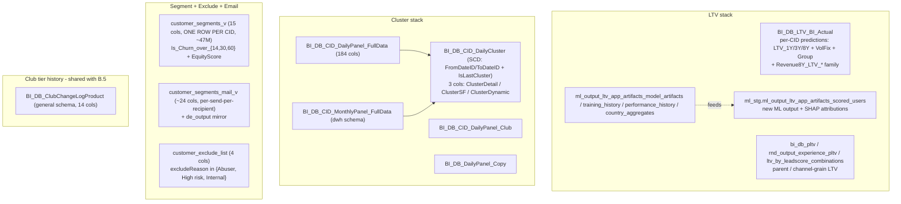

# B.7 — Customer Models & Segmentation

The **customer-property** layer: predictive LTV, three-axis clustering,
flat customer profile + churn flags + equity score, global exclude list,
and the legacy / new LTV-ML pipeline. These tables answer "WHO this
customer is, statistically" — they do **not** describe per-event activity
(that's B.4) or per-day point-in-time state (that's B.5).

**Side classification:** broker-side per-CID property layer. The
clustering models live physically near the social / copy graph; LTV
near trading-platform revenue tables; this skill keeps the
customer-side definitions consolidated and points to the join skills
when an analysis spans super-domains.

## When to Use

Use this skill when the question is about:

- A customer's **predicted LTV** (1-year / 3-year / 8-year, optionally
  vol-fixed or group-level) → `BI_DB_LTV_BI_Actual` (legacy / current) or
  the new ML output `ml_stg.ml_output_ltv_app_artifacts_scored_users`.
- A customer's **cluster assignment** across three parallel
  methodologies (`ClusterDetail`, `ClusterSF`, `ClusterDynamic`) →
  `BI_DB_CID_DailyCluster` (SCD-style with FromDateID/ToDateID windows).
- The **input features** that go into clustering / LTV → daily /
  monthly feature panels.
- A flat **customer profile + churn classification + equity score**
  for one or many CIDs → `customer_segments_v` (one row per CID).
- **Marketing-email engagement** per send → `customer_segments_mail_v`
  (per-send-per-recipient log).
- The **global exclude list** with reason → `customer_exclude_list`
  (only 4 cols: CID, GCID, excludeReason, RegisterationDate sic).
- **Club tier transitions** → `BI_DB_ClubChangeLogProduct`. The
  compliance-snapshot view of club tier lives in B.5; this skill owns
  the property / tier-history lookup.
- **SHAP attribution** for a single CID's LTV prediction →
  `ml_stg.ml_output_ltv_app_artifacts_scored_users`.

Do **NOT** use this skill for:

- **Population aggregates** ("how many customers in cluster X?") — those
  belong in sibling sub-skill `customer-populations-and-lifecycle.md`.
- **Current point-in-time customer state** (Regulation, MifID, KYC,
  Status) → B.5 (`customer_snapshot_v`).
- **Per-event activity** ledger → B.4 (`Fact_CustomerAction`).
- **Compliance-shaped club snapshot** for regulatory reporting →
  B.5 (`bi_output_vg_club`).

## Scope

In scope:

- `BI_DB_LTV_BI_Actual` 32+ col schema (LTV_{1,3,8}Y + VolFix + Group +
  Revenue8Y_LTV_* family; EquityTier; ClusterDetail; First_Month_*;
  DaysFromFTD; Currency; Revenue_Change_Percentage_Fixed).
- `BI_DB_CID_DailyCluster` 13-col SCD schema (FromDateID/ToDateID with
  `IsLastCluster=1` filter for current).
- The 184-col `BI_DB_CID_DailyPanel_FullData` and its monthly /
  copy / club sibling panels.
- `customer_segments_v` 15-col flat profile with 3 churn flags +
  EquityScore enum + first-event dates + customer-age.
- `customer_segments_mail_v` 24-col per-send engagement log (and its
  `de_output` mirror).
- `customer_exclude_list` 4-col global exclusion list with 3-value
  `excludeReason` enum.
- The ML pipeline at `ml_stg.ml_output_ltv_app_artifacts_*` (5 tables):
  per-CID scoring with SHAP, model artifacts, training history,
  performance history, country aggregates.
- Parent-LTV variants (`bi_db_pltv`, `rnd_output_experience_pltv`,
  `ltv_by_leadscore_combinations`) for popular-investor / channel-grain
  LTV.

Out of scope: company-level revenue accounting (revenue-and-fees
super-domain); copy network topology (trading super-domain); deeper
churn-winback model output (B.6 has `churn_winback_summary` and
`churn_winback_recent_targets`); the **raw Mixpanel event stream** that
feeds the daily/monthly feature panels (`BI_DB_CID_DailyPanel_FullData`
and siblings consume aggregated Mixpanel `silver` events upstream) —
those live in [`../domain-product-analytics/mixpanel-events-and-pageviews.md`](../domain-product-analytics/mixpanel-events-and-pageviews.md);
A/B-test variant assignments that overlay onto these cluster cohorts —
[`../domain-product-analytics/ab-testing-and-experimentation.md`](../domain-product-analytics/ab-testing-and-experimentation.md);
the **affiliate sourcing dimension** and per-channel paid-media cost — `dim_affiliate_masked`
and `v_marketing_campaigns_social` / `_google` live in
[`../domain-marketing-and-acquisition/affiliate-and-paid-media.md`](../domain-marketing-and-acquisition/affiliate-and-paid-media.md);
RAF (Refer-A-Friend) compensation history and the dual-sided referring × referred ledger
live in [`../domain-marketing-and-acquisition/raf-and-incentives.md`](../domain-marketing-and-acquisition/raf-and-incentives.md);
the SFMC email-engagement at full event-grain (2.28B rows + per-URL click logs + bounce / unsub /
complaint streams) lives in [`../domain-marketing-and-acquisition/marketing-comms-and-sfmc.md`](../domain-marketing-and-acquisition/marketing-comms-and-sfmc.md)
(`customer_segments_mail_v` here is the per-CID lens over the same data).

Last verified: 2026-05-11

## Mental model



## Critical warnings (read before writing any SQL)

1. **`BI_DB_LTV_BI_Actual` is NOT a bucket-label table.** 32+ cols, all
   LTV columns are DECIMAL **point predictions**, not buckets. Real
   columns: `CID, GCID, NewMarketingRegion, FirstDepositDate,
   FirstFundedMonth, Seniority (INT — months from registration),
   ClusterDetail, EquityTier (INT), MonthsSinceLastPosOpen,
   Current_ACC_Revenue (DECIMAL), DaysFromFTD,
   LTV_1Y / LTV_3Y / LTV_8Y (DECIMAL predictions),
   LTV_1Y_VolFix / LTV_3Y_VolFix / LTV_8Y_VolFix (volatility-fixed
   variants), LTV_8Y_GroupLevel (group-aggregated LTV),
   Revenue8Y_LTV_New / Revenue8Y_LTV_NoExtreme_New (with and without
   outlier truncation), Revenue8Y_LTV_New_WO_Group_LTV /
   Revenue8Y_LTV_NoExtreme_New_WO_Group_LTV /
   Revenue8Y_LTV_New_Group_LTV / Revenue8Y_LTV_NoExtreme_New_Group_LTV /
   Revenue8Y_LTV_All_Conv_Old (5 LTV-revenue variants),
   First_Month_Equity_Tier / First_Month_Cluster (snapshot at FTD month),
   Currency, Revenue_Change_Percentage_Fixed (DOUBLE), UpdateDate`.
   **NO** `LTVBucket / LTVQuintile / LifetimeDeposit / LifetimeWithdraw /
   LifetimeRevenue / LifetimeTrades / LifetimePnL` — v1 invented all of
   those names. For realized lifetime metrics use the new DDR
   per-day-per-CID rollup at `bi_db.gold_*_bi_db_ddr_cid_level` (B.4)
   or `ddr_aum_v` (B.5).
2. **`BI_DB_CID_DailyCluster` is SCD-style with FromDateID/ToDateID
   windows, NOT one row per CID per day.** 13 cols: `CID, ClusterDetail,
   ClusterSF, ClusterDynamic, FromDateID (INT), ToDateID (INT),
   FromDate (TIMESTAMP), ToDate (STRING — careful!), IsLastCluster (INT),
   IsFirstCluster (INT), IsSFCluster (INT), UpdateDate,
   UpdateDateIDSF (INT)`. To get the **current** cluster: filter
   `IsLastCluster=1`. To get a **point-in-time** cluster: filter
   `FromDateID <= :asof AND :asof < ToDateID`.
3. **There are THREE parallel cluster columns** representing three
   methodologies — pick the right one for the question.
   - `ClusterDetail` (6-bucket fine-grained — live values: Crypto,
     Equities Traders, Equities Crypto, Equities Investors, Leveraged
     Traders, Diversified Traders).
   - `ClusterSF` (3-bucket Salesforce-coarse: Crypto, Traders,
     Investors). `IsSFCluster=1` marks the dedicated SF-cluster rows.
   - `ClusterDynamic` (fast-moving variant; STRING — used for the
     "this-period" cohort comparison in
     `bi_output_vg_ddr_customers_snapshot.ClusterDynamic` per B.5).
   v1 invented `ClusterID / ClusterName / DateID` — none exist.
4. **`customer_segments_v` is ONE ROW PER CID, not many.** Verified live
   ~47M rows / 47M distinct CIDs. It's a flat customer-profile view, not
   a per-segment lookup. 15 cols: `GCID, CID, Club, Channel, Country,
   registered (TIMESTAMP — lower-case), FirstDepositDate,
   FirstCashoutDate, FirstOpenPositionDate, CommunicationLanguage,
   CustomerAge (LONG — years), Is_Churn_over_14 (BOOLEAN),
   Is_Churn_over_30 (BOOLEAN), Is_Churn_over_60 (BOOLEAN),
   EquityScore (STRING enum)`. **No** `SegmentName, SegmentType,
   AssignedDate` — v1 invented those. `EquityScore` live enum: `'No
   Equity' (43M), 'Low' (2.2M), 'Medium' (1.4M), 'High' (300k)`.
5. **`customer_segments_mail_v` is an email-DELIVERY+ENGAGEMENT LOG**,
   NOT a "mail eligibility cut". One row per `(SubscriberID, send)`
   carrying campaign metadata (`CampaignGroup, CampaignSubGroup,
   CampaignName, CampaignNumber, EmailName, SendID, Subject`) + delivery
   (`Delivered, SentTime — STRING, SendDateID — INT`) + engagement
   counters (`CountOpen, UniqueOpen, CountClicks, UniqueClicks,
   CountBounce, OpenDate, ClickDate — all STRING for the counters,
   STRING for the dates`). **`GCID is STRING here**, unlike
   `customer_segments_v` where it's INT — cast on join. This view is a
   customer-segmentation lens over the same SFMC events that live at full
   2.28B-row grain in
   [`../domain-marketing-and-acquisition/marketing-comms-and-sfmc.md`](../domain-marketing-and-acquisition/marketing-comms-and-sfmc.md)
   (`bi_output_marketing_sfmc_sfmc_report` + the `silver_sfmc_*` raw
   events) — for full deliverability / bounce / unsubs / per-URL clicks /
   send-job dimension, go there.
6. **`customer_exclude_list` is only 4 cols.** `CID (INT), GCID (INT),
   excludeReason (STRING), RegisterationDate (TIMESTAMP — sic, the
   column name carries the typo verbatim — note the extra 'e')`. Live
   `excludeReason` distribution (2026-05-11): `Abuser` 1.20M,
   `High risk` 128k, `Internal` 33k. ALWAYS LEFT-JOIN with `excl.CID IS
   NULL` predicate on any customer-aggregate query. This catches more
   than `Dim_Customer.IsTestAccount` + `IsExcludedFromReporting`
   combined.
7. **`BI_DB_CID_DailyPanel_FullData` is 184 cols** — the full feature
   input panel for the clustering / LTV model. Use it when you need
   the model input features (and not the assignment). The **monthly**
   equivalent lives in the `dwh` schema (`main.dwh.gold_sql_dp_prod_we_bi_db_dbo_bi_db_cid_monthlypanel_fulldata`),
   NOT `bi_db` — easy to miss. Sub-panels: `BI_DB_CID_DailyPanel_Club`
   (club-focused), `BI_DB_DailyPanel_Copy` (copy-trading-focused — note
   no `cid_` prefix on this one).
8. **New-generation LTV ML pipeline** lives at `main.ml_stg.ml_output_ltv_app_artifacts_*`:
   - `_scored_users` is the per-CID output with `expected_ltv (DOUBLE),
     p_positive, ev_if_positive, scored_at (STRING), registration_year,
     CountryID, acquisition_channel, age_bucket_model` + a triple-set
     of SHAP attribution cols (`shap_s1_<feat>, shap_s2_<feat>,
     feat_<feat>`) per feature. CID is **LONG** here (not INT).
   - `_model_artifacts` / `_training_history` / `_performance_history`
     are the model versioning / metric tables;
   - `_country_aggregates` is the per-country LTV summary.
   This is the future replacement of `BI_DB_LTV_BI_Actual`; they will
   coexist for a transition period — reconcile on `CID` and treat the
   `Revenue8Y_LTV_New` family vs `expected_ltv` as a known
   divergence-point (truncation rules differ).
9. **Parent-LTV / channel-LTV variants** (different grain from
   per-CID): `main.general.gold_sql_dp_prod_we_bi_db_dbo_bi_db_pltv`,
   `main.api_general.rnd_output_experience_pltv`, and the
   leadscore-channel variants `bi_db.gold_rnd_experience_fivetran_google_sheets_ltv_by_leadscore_combinations`
   and `sharepoint.gold_rnd_experience_sharepoint_ltv_by_leadscore_combinations`
   are channel / lead-score aggregations, not per-CID predictions.
10. **`ToDate` on `BI_DB_CID_DailyCluster` is STRING, not TIMESTAMP.**
    For comparisons / range filters, prefer `FromDateID` / `ToDateID`
    (INT YYYYMMDD).

## SQL patterns

### Pattern 1 — current LTV + cluster + segments + club for a customer

```sql
SELECT
    c.CID,
    s.Club, s.Country, s.Channel, s.CustomerAge, s.EquityScore,
    s.Is_Churn_over_14, s.Is_Churn_over_30, s.Is_Churn_over_60,
    ltv.LTV_1Y, ltv.LTV_3Y, ltv.LTV_8Y, ltv.LTV_8Y_VolFix, ltv.Currency,
    ltv.EquityTier, ltv.Seniority, ltv.Current_ACC_Revenue,
    dc.ClusterDetail, dc.ClusterSF, dc.ClusterDynamic,
    CASE WHEN excl.CID IS NULL THEN 0 ELSE 1 END AS IsOnExcludeList,
    excl.excludeReason
FROM main.etoro_kpi.customer_segments_v s
LEFT JOIN main.dwh.gold_sql_dp_prod_we_dwh_dbo_dim_customer_masked c
       ON c.CID = s.CID
LEFT JOIN main.bi_db.gold_sql_dp_prod_we_bi_db_dbo_bi_db_ltv_bi_actual ltv
       ON ltv.CID = s.CID
LEFT JOIN main.bi_db.gold_sql_dp_prod_we_bi_db_dbo_bi_db_cid_dailycluster dc
       ON dc.CID = s.CID AND dc.IsLastCluster = 1
LEFT JOIN main.etoro_kpi.customer_exclude_list excl
       ON excl.CID = s.CID
WHERE s.CID = :realcid;
```

### Pattern 2 — cluster history for a customer (SCD)

```sql
SELECT CID, ClusterDetail, ClusterSF, ClusterDynamic,
       FromDateID, ToDateID, IsLastCluster
FROM main.bi_db.gold_sql_dp_prod_we_bi_db_dbo_bi_db_cid_dailycluster
WHERE CID = :realcid
ORDER BY FromDateID;
```

### Pattern 3 — point-in-time cluster as of a date

```sql
SELECT CID, ClusterDetail, ClusterSF, ClusterDynamic
FROM main.bi_db.gold_sql_dp_prod_we_bi_db_dbo_bi_db_cid_dailycluster
WHERE CID = :realcid
  AND FromDateID <= :asof_yyyymmdd
  AND :asof_yyyymmdd < ToDateID;
```

### Pattern 4 — cluster distribution among funded customers, excluded filtered

```sql
SELECT dc.ClusterDetail, COUNT(*) AS Customers
FROM main.bi_db.gold_sql_dp_prod_we_bi_db_dbo_bi_db_cid_dailycluster dc
JOIN main.etoro_kpi.customer_segments_v s
       ON s.CID = dc.CID
LEFT JOIN main.etoro_kpi.customer_exclude_list excl
       ON excl.CID = dc.CID
WHERE dc.IsLastCluster = 1
  AND s.FirstDepositDate IS NOT NULL
  AND excl.CID IS NULL
GROUP BY dc.ClusterDetail
ORDER BY Customers DESC;
```

### Pattern 5 — ML LTV scoring + SHAP attributions for a CID

```sql
SELECT CID, expected_ltv, p_positive, ev_if_positive, scored_at,
       Country, acquisition_channel, age_bucket_model,
       feat_CountryID, shap_s1_CountryID, shap_s2_CountryID,
       feat_acquisition_channel, shap_s1_acquisition_channel,
       feat_age_bucket_model, shap_s1_age_bucket_model
FROM main.ml_stg.ml_output_ltv_app_artifacts_scored_users
WHERE CID = :realcid;
```

### Pattern 6 — top customers by LTV_8Y_VolFix, exclude-filtered

```sql
SELECT ltv.CID, ltv.LTV_8Y, ltv.LTV_8Y_VolFix, ltv.Currency,
       ltv.ClusterDetail, s.EquityScore, s.Country, ltv.Seniority
FROM main.bi_db.gold_sql_dp_prod_we_bi_db_dbo_bi_db_ltv_bi_actual ltv
LEFT JOIN main.etoro_kpi.customer_segments_v s ON s.CID = ltv.CID
LEFT JOIN main.etoro_kpi.customer_exclude_list excl ON excl.CID = ltv.CID
WHERE excl.CID IS NULL
ORDER BY ltv.LTV_8Y_VolFix DESC NULLS LAST
LIMIT 100;
```

### Pattern 7 — email engagement for a customer (last 90 days)

```sql
SELECT m.GCID, m.CampaignGroup, m.CampaignSubGroup, m.CampaignName,
       m.EmailName, m.Subject, m.SendDateID,
       m.Delivered, m.CountOpen, m.UniqueOpen,
       m.CountClicks, m.UniqueClicks, m.CountBounce
FROM main.etoro_kpi.customer_segments_mail_v m
WHERE m.GCID = CAST(:gcid AS STRING)
  AND m.SendDateID >= 20260211
ORDER BY m.SendDateID DESC LIMIT 100;
```

### Pattern 8 — club tier history (raw)

```sql
SELECT CID, Date, OldClub, CurrentClub, OldTier, CurrentTier,
       PLChangeType, IsFTC
FROM main.general.gold_sql_dp_prod_we_bi_db_dbo_bi_db_clubchangelogproduct
WHERE CID = :realcid ORDER BY Date DESC;
```

## Wiki / KPI source deep-reads

- `knowledge/synapse/Wiki/BI_DB_dbo/Tables/BI_DB_LTV_BI_Actual.md`
- `knowledge/synapse/Wiki/BI_DB_dbo/Tables/BI_DB_CID_DailyCluster.md`
- `knowledge/synapse/Wiki/BI_DB_dbo/Tables/BI_DB_CID_DailyPanel_FullData.md`
- `knowledge/synapse/Wiki/BI_DB_dbo/Tables/BI_DB_CID_MonthlyPanel_FullData.md`
- `knowledge/synapse/Wiki/BI_DB_dbo/Tables/BI_DB_ClubChangeLogProduct.md`
- ML LTV pipeline: see the DE LTV-App repo and `_uc_object_map.md` for the `ml_stg` lineage.
