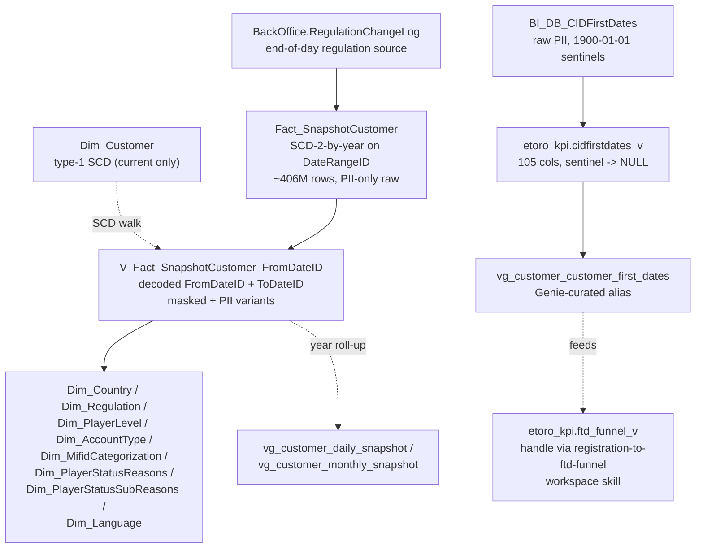

# Identity, Jurisdiction & Regulation (SCD walk + first-dates)

This is the historical layer of the customer master. The current-state row lives in `Dim_Customer` and is owned by `customer-master-record`; **this** skill owns "what was true on date D" and "when did event X first happen". Two anchor surfaces:

1. **`Fact_SnapshotCustomer`** — daily SCD-Type-2-by-year over the long-lived customer attributes (regulation, country, level, status, MiFID, account manager, etc.). ~406M rows, 46.4M distinct customers, since 2007-08-22. Accessed in UC exclusively through the **`V_Fact_SnapshotCustomer_FromDateID`** view which decodes the proprietary `DateRangeID` into analyst-usable `FromDateID` / `ToDateID` INT YYYYMMDD columns.
2. **`BI_DB_CIDFirstDates`** — 105-column milestone table (one row per customer) with every "FirstX" timestamp the platform tracks. Raw is PII-only; analyst-facing alias is **`etoro_kpi.cidfirstdates_v`**.

**Side classification:** broker-side customer-attribute history. Compliance / AML uses these surfaces for regulatory reporting and "what was the state on the event date" forensics.

## When to Use

Load when the question concerns historical customer state, attribute-change history, or any single-milestone first-date:

- "What was customer X's regulation / country / level / MiFID / account type on date D?"
- "Show every regulation transition for customer X"
- "When did customer X first log in / first deposit / first trade / first cashout / first verify L1/L2/L3 / first get copied?"
- "How many customers migrated from CySEC to FCA in <range>?"
- "Reconstruct customer X's level/status transitions"
- "Filter trades to the customer's regulation at the time the trade happened" (SCD slice on trade date)

Do NOT load for:

- **Current-state lookup** ("show me the row for customer X today") → `customer-master-record` (uses `Dim_Customer` directly).
- **Population counts by jurisdiction today** ("how many CySEC customers do we have?") → sibling sub-skill `customer-populations-and-lifecycle.md` (uses `gold_de_user_dim_ddr_customer_dailystatus_scd`; pre-aggregated, much faster).
- **Reg-to-FTD funnel** (any cohort funnel question: drop-off at V1/V2/V3, time-to-FTD, VBD/VBT) → DE workspace skill `registration-to-ftd-funnel` + `main.etoro_kpi.ftd_funnel_v`.
- **Day-by-day customer daily-status SCD** (the segment-aware version used by the populations skill) → that same workspace skill owns `gold_de_user_dim_ddr_customer_dailystatus_scd`.

## Scope

In scope: the 57 columns on `V_Fact_SnapshotCustomer_FromDateID` (masked + PII variants), the SCD-Type-2-by-year mechanic (DateRangeID decode, year-end roll), the end-of-day RegulationID rule (sourced from `RegulationChangeLog`, NOT BackOffice), the IsValidCustomer + IsCreditReportValidCB business rules, GDPR-erasure masking, the 105 first-date columns on `cidfirstdates_v` (with the 1900-01-01 sentinel-to-NULL conversion), the Genie-curated `vg_customer_customer_first_dates` alias, the daily and monthly customer-snapshot rollup views, the dimension lookups (Dim_Country, Dim_Regulation, Dim_PlayerLevel, Dim_AccountType, Dim_MifidCategorization, Dim_PlayerStatusReasons, Dim_PlayerStatusSubReasons, Dim_Language).
Out of scope: current-state row (`customer-master-record`); population segments (sibling sub-skill `customer-populations-and-lifecycle.md`); reg-to-FTD funnel (`registration-to-ftd-funnel` workspace skill); OLTP forensics (`oltp-customer-static-and-breaches`); customer-action audit trail (`customer-action-audit-trail`); CRM cases (`crm-cases-csat-and-churn`); LTV / cluster / segments (`customer-models-and-segmentation`); club tier change history (`compliance-customer-snapshot-and-club` owns `BI_DB_ClubChangeLogProduct`).
Last verified: 2026-05-11

## Critical Warnings

1. **Tier 1 — The SCD pivot is `DateRangeID`, NOT a `FromDate`/`ToDate` pair.** `Fact_SnapshotCustomer.DateRangeID` is a 12-digit `BIGINT` encoding `YYYYMMDD` (row open date) + `MMDD` (year-end month+day, typically `1231`). Example: `202603101231` = open 2026-03-10, closes 2026-12-31. In UC always use the view `V_Fact_SnapshotCustomer_FromDateID` which exposes `FromDateID` (INT YYYYMMDD) and `ToDateID` (INT YYYYMMDD) — DO NOT join on a `DATE` value. Currently-open rows have `ToDateID = YYYY1231`. The view is rebuilt every year-end: on January 1st every open row gets closed (`ToDateID = (YYYY-1)1231`) and reopened for the new year. Verified 2026-05-11: 47.7M open rows with `ToDateID = 20261231`, all distinct RealCIDs.

2. **Tier 1 — `MasterCID`, `IsPI`, `MarketingRegion`, `IsTestUser`, `IsExcludedFromReporting`, `ClubLevelID` are NOT walked through this SCD.** Verified 2026-05-11: zero of these columns exist on `V_Fact_SnapshotCustomer_FromDateID` (57 cols). The DWH-side substitutes:
   - **`IsPI`** — derived from `GuruStatusID` (PI program status; FK to `Dictionary.GuruStatus`). **NOT derived from `PlayerLevelID`** — `PlayerLevelID = 4` per `Dim_PlayerLevel` is `Internal` (in-house account level), not a PI signal. SCD-2 walk on `GuruStatusID` via `V_Fact_SnapshotCustomer_FromDateID` for point-in-time PI status.
   - **`MarketingRegion`** — not walked. The closest historical surface is `RegionID` (FK to `Dim_Region`). For MarketingRegion history use `BI_DB_DDR_Customer_Daily_Status` (per-CID per-day rollup) — see `customer-models-and-segmentation`.
   - **`IsTestUser` / `IsExcludedFromReporting`** — not walked. The historical analytics gate is the DWH-computed `IsValidCustomer` (1 when `PlayerLevelID ≠ 4 AND LabelID NOT IN (30, 26) AND CountryID ≠ 250`).
   - **Club tier** — not walked here. Tier history lives in `BI_DB_ClubChangeLogProduct` (owned by `compliance-customer-snapshot-and-club`).
   - **`MasterCID`** — not present anywhere in UC (Warning 1 of `customer-master-record`); linked-account history lives in OLTP only.

3. **Tier 1 — RegulationID is sourced from `RegulationChangeLog`, NOT `BackOffice.Customer`.** Regulation changes take effect end-of-day for legal reasons. The SP_Fact_SnapshotCustomer reads `Ext_FSC_BackOffice_RegulationChangeLog.ToRegulationID`. Querying OLTP BackOffice for the historical regulation will silently disagree with this fact on the day of a regulation change. When auditing for a regulation transition use `Fact_SnapshotCustomer` only.

4. **Tier 1 — `cidfirstdates_v` strips the `1900-01-01` sentinel to NULL; the raw `BI_DB_CIDFirstDates` does NOT.** Mixing them silently produces wrong counts. On the raw PII table use `WHERE YEAR(FirstX) <> 1900`; on the view use `WHERE FirstX IS NOT NULL`. Sentinel means "never happened" — do NOT treat it as missing data.

5. **Tier 2 — 8 columns on `Fact_SnapshotCustomer` are LEGACY/UNVERIFIED and carry DEFAULT(0) for every row.** Per the wiki: `DemoCID`, `CustomerChangeTypeID`, `CurentValue` (note typo), `PreviousValue`, `DocsOK`, `Bankruptcy`, `PremiumAccount`, `Evangelist`. The current `SP_Fact_SnapshotCustomer` does NOT populate them. Treat any non-zero value as suspect and do not infer business meaning. The `DocsOK` truth lives on `Dim_Customer.DocsOK` instead.

6. **Tier 2 — DesignatedRegulationID, RegionID, AccountManagerID default 0 — `LEFT JOIN` to dimensions.** An `INNER JOIN` to `Dim_Manager` / `Dim_Region` / `Dim_Regulation` on these columns will silently drop rows where the value is the default 0.

7. **Tier 2 — GDPR-erased customers have masked Email / City / Address / Zip / PhoneNumber.** When `UserName LIKE 'DelUserName%'` in the source, the SP overwrites those fields. The PII variant carries the mask too. Do not use those columns to identify or contact a customer who has been GDPR-erased.

8. **Tier 2 — The first-date column names are not what intuition suggests.** Verified 2026-05-11 against `etoro_kpi.cidfirstdates_v` 105-col schema: the column for "first KYC" is `VerificationLevel1Date` / `VerificationLevel2Date` / `VerificationLevel3Date` (one per level — there is no `FirstKycDate`). "First withdraw" is `FirstCashoutDate` (NOT `FirstWithdrawDate`). "First trade" is `FirstPosOpenDate`. "First stocks trade" is `FirstStocksOpenDate`. "First crypto trade" / "First options trade" are NOT separate columns — derive from `Fact_CustomerAction` or `Dim_Position` filtered to the asset class. "First deposit" is `FirstDepositDate` (with `FirstDepositAttempt` for the funnel-pre-FTD touchpoint). See the column catalogue below.

9. **Tier 3 — `Fact_SnapshotCustomer` is unpartitioned in UC.** Date-range scans rely on Delta file pruning by year/month from the `DateRangeID`-derived columns. Filter `FromDateID` aggressively or your queries scan 400M+ rows.

## Mental model



## V_Fact_SnapshotCustomer_FromDateID — analyst columns (57 total)

| Group | Columns walked through SCD |
|---|---|
| **Identity (stable)** | `RealCID`, `GCID`, `DemoCID` (legacy, unpopulated), `FromDateID`, `ToDateID`, `DateRangeID` |
| **Geography** | `CountryID`, `RegionID` |
| **Regulation** | `RegulationID` (end-of-day from RegulationChangeLog), `DesignatedRegulationID` |
| **Lifecycle** | `PlayerStatusID`, `PlayerStatusReasonID`, `PlayerStatusSubReasonID`, `AccountStatusID`, `PendingClosureStatusID`, `PlayerLevelID`, `AccountTypeID` |
| **KYC / verification** | `VerificationLevelID`, `DocumentStatusID`, `SuitabilityTestStatusID`, `EvMatchStatus`, `MifidCategorizationID`, `IsEmailVerified`, `IsPhoneVerified`, `PhoneVerificationDateID` |
| **Risk / compliance** | `RiskStatusID`, `RiskClassificationID`, `LabelID` |
| **Program** | `GuruStatusID` (PI program substate) |
| **Acquisition** | `AffiliateID` |
| **Communication** | `LanguageID`, `CommunicationLanguageID` |
| **Operations** | `AccountManagerID`, `WeekendFeePrecentage` (sic) |
| **External integrations** | `DltStatusID`, `DltID`, `EquiLendID`, `StocksLendingStatusID` |
| **Computed flags** | `IsValidCustomer`, `IsCreditReportValidCB`, `IsDepositor` |
| **PII (masked variant blanks these)** | `Email`, `City`, `Address`, `Zip`, `PhoneNumber` |
| **Legacy / unpopulated (per wiki — see Warning 5)** | `CustomerChangeTypeID`, `CurentValue`, `PreviousValue`, `DocsOK`, `Bankruptcy`, `PremiumAccount`, `Evangelist` |
| **Audit** | `UpdateDate` (ETL load timestamp; not customer event date), `etr_y`, `etr_ym`, `etr_ymd` |

## cidfirstdates_v — milestone column catalogue (analyst-facing, sentinel-to-NULL)

| Category | Columns (verified 2026-05-11 against the 105-col schema) |
|---|---|
| **Identity** | `CID`, `GCID`, `OriginalCID`, `UserName`, `Email`, `SerialID`, `ReferralID`, `BannerID`, `SubAffiliateID`, `FirstCampaignID`, `CountryID`, `Gender`, `BirthDate`, `LabelName`, `Country`, `Language`, `Region`, `RegulationName`, `RegulationID`, `Manager`, `Channel`, `SubChannel`, `Club`, `FunnelName`, `FunnelFromName`, `DownloadID`, `PotentialDesk` |
| **Registration / first login** | `registered` (note lowercase), `FirstTimeUser`, `FirstLoggedIn`, `FirstDemoLoggedIn`, `LastDemoLoggedIn`, `LastLoggedIn` |
| **Demo activity** | `FirstDemoPosOpenDate`, `LastDemoPosOpenDate`, `FirstDemoMirrorRegistrationDate`, `LastDemoMirrorRegistrationDate`, `FirstDemoMirrorPosOpenDate`, `LastDemoMirrorPosOpenDate` |
| **Cashier / deposit** | `FirstCashierLogin`, `LastCashierLogin`, `FirstDepositAttempt`, `FirstDepositAttemptAmount`, `FirstDepositAttemptProcessor`, `FirstDepositAttemptFundingType`, `FirstDepositDate` (=FTD), `FirstDepositProcessor`, `FirstDepositFundingType`, `FirstDepositAmount`, `FirstDepositAmountExtended` |
| **Real trading** | `FirstEngagementDate`, `LastEngagementDate`, `FirstPosOpenDate` (= first real trade), `LastPosOpenDate`, `FirstMirrorRegistrationDate`, `LastMirrorRegistrationDate`, `FirstMirrorPosOpenDate`, `LastMirrorPosOpenDate`, `FirstStocksOpenDate`, `FirstMenualPosOpenDate` (sic), `LastMenualPosOpenDate` |
| **Withdraw** | `FirstCashoutDate` |
| **PI / copy** | `CertifiedGuru`, `PopularInvestor`, `FirstTimeBeingCopied`, `LastTimeBeingCopied` |
| **KYC verification** | `VerificationLevel1Date`, `VerificationLevel2Date`, `VerificationLevel3Date`, `Verified`, `KYC`, `DocsOK`, `Blocked`, `IsSales`, `HasPic` |
| **Contact / engagement** | `FirstLeadDate`, `FirstContactAttemptDate`, `LastContactAttemptDate`, `FirstContactAttemptDate_ByPhone`, `LastContactAttemptDate_ByPhone`, `FirstContactDate`, `LastContactDate`, `FirstContactDate_ByPhone`, `LastContactDate_ByPhone`, `FirstWallEngagement`, `FirstTimeSocialConnect` |
| **Marketing / acquisition** | `FirstCampaignDate`, `FirstCampaignAmount` |
| **Retention** | `SevenDayRetained`, `FirstToSevenDayRetained`, `FirstDateRetained`, `FirstToThirtyDayRetained`, `Follow5UsersDate`, `NumberOfUsersFollowed` |
| **Financial** | `Credit`, `RealizedEquity` (current snapshot, NOT a first-date — caveat) |
| **Other flags** | `SocialConnect`, `FeedUnBlocked`, `FeedUnlocked`, `PremiumAccount`, `Evangelist`, `Bankruptcy`, `PrivacyPolicyID`, `IP`, `CommunicationLanguage` |

## Critical anti-patterns

1. **DO NOT query `Dim_Customer` for historical attributes.** Type-1 SCD overwrites silently.
2. **DO NOT join `Fact_SnapshotCustomer` on `DateRangeID = some_date`** — `DateRangeID` is a proprietary 12-digit encoding, not a date. Use the `FromDateID` / `ToDateID` view.
3. **DO NOT carry `1900-01-01` through aggregates.** Use `cidfirstdates_v` (sentinel → NULL).
4. **DO NOT reach for `FirstKycDate` / `FirstWithdrawDate` / `FirstTradeDate` / `FirstCryptoDate` / `FirstOptionsDate`** — these column names do NOT exist on `cidfirstdates_v`. The real names per Warning 8 are `VerificationLevel{1,2,3}Date`, `FirstCashoutDate`, `FirstPosOpenDate`, `FirstStocksOpenDate`; crypto/options first-trades require deriving from `Fact_CustomerAction` or `Dim_Position` filtered to the asset class (route to `customer-action-audit-trail` or trading domain).
5. **DO NOT recreate the reg-to-FTD funnel here.** Use `etoro_kpi.ftd_funnel_v` via the DE workspace skill `registration-to-ftd-funnel`.
6. **DO NOT join the snapshot to a current-state fact on a `BETWEEN` on `FromDate AND ToDate`** without remembering that `ToDateID = YYYY1231` for active rows. Filter `<event_date> BETWEEN FromDateID AND ToDateID` (both INT YYYYMMDD).

## Query Patterns

### Pattern 1 — What was customer X's regulation on date D?

```sql
SELECT
  s.RealCID,
  s.FromDateID, s.ToDateID,
  s.RegulationID, r.RegulationName,
  s.CountryID,    co.CountryName,
  s.PlayerLevelID, s.MifidCategorizationID
FROM main.dwh.gold_sql_dp_prod_we_dwh_dbo_v_fact_snapshotcustomer_fromdateid_masked s
LEFT JOIN main.dwh.gold_sql_dp_prod_we_dwh_dbo_dim_regulation r  ON r.RegulationID = s.RegulationID
LEFT JOIN main.dwh.gold_sql_dp_prod_we_dwh_dbo_dim_country    co ON co.CountryID    = s.CountryID
WHERE s.RealCID = :realcid
  AND 20250601 BETWEEN s.FromDateID AND s.ToDateID;             -- target date as INT YYYYMMDD
```

### Pattern 2 — Every regulation transition for customer X

```sql
SELECT
  s.RealCID,
  s.FromDateID, s.ToDateID,
  r.RegulationName,
  LAG(s.RegulationID) OVER (PARTITION BY s.RealCID ORDER BY s.FromDateID) AS prev_RegulationID
FROM main.dwh.gold_sql_dp_prod_we_dwh_dbo_v_fact_snapshotcustomer_fromdateid_masked s
JOIN main.dwh.gold_sql_dp_prod_we_dwh_dbo_dim_regulation r ON r.RegulationID = s.RegulationID
WHERE s.RealCID = :realcid
ORDER BY s.FromDateID;
```

### Pattern 3 — Customers who migrated from CySEC to FCA in 2025

```sql
WITH transitions AS (
  SELECT
    s.RealCID,
    s.RegulationID                                              AS to_reg,
    LAG(s.RegulationID) OVER (PARTITION BY s.RealCID ORDER BY s.FromDateID) AS from_reg,
    s.FromDateID                                                AS transition_date
  FROM main.dwh.gold_sql_dp_prod_we_dwh_dbo_v_fact_snapshotcustomer_fromdateid_masked s
  WHERE s.FromDateID BETWEEN 20250101 AND 20251231
)
SELECT
  COUNT(DISTINCT RealCID) AS migrated_customers
FROM transitions t
JOIN main.dwh.gold_sql_dp_prod_we_dwh_dbo_dim_regulation rf ON rf.RegulationID = t.from_reg
JOIN main.dwh.gold_sql_dp_prod_we_dwh_dbo_dim_regulation rt ON rt.RegulationID = t.to_reg
WHERE rf.RegulationName = 'CySEC'
  AND rt.RegulationName = 'FCA';
```

### Pattern 4 — Milestone first-dates for a CID (sentinels stripped)

```sql
SELECT
  fd.CID, fd.GCID, fd.UserName,
  fd.registered,                          -- registration timestamp (note lowercase)
  fd.FirstLoggedIn,
  fd.FirstDepositAttempt,                 -- pre-FTD funnel touch
  fd.FirstDepositDate,                    -- = FTD
  fd.FirstPosOpenDate,                    -- first real trade
  fd.FirstStocksOpenDate,
  fd.FirstMirrorRegistrationDate,         -- first copy-trading register
  fd.FirstTimeBeingCopied,                -- first time a copier picks this customer
  fd.FirstCashoutDate,                    -- first withdrawal
  fd.VerificationLevel1Date,
  fd.VerificationLevel2Date,
  fd.VerificationLevel3Date
FROM main.etoro_kpi.cidfirstdates_v fd
WHERE fd.CID = :realcid;
```

### Pattern 5 — Currently-open SCD row per customer (today's state via the SCD)

```sql
SELECT s.RealCID, s.RegulationID, s.CountryID, s.PlayerLevelID, s.MifidCategorizationID
FROM main.dwh.gold_sql_dp_prod_we_dwh_dbo_v_fact_snapshotcustomer_fromdateid_masked s
WHERE s.ToDateID = 20261231                                  -- year-end of the current year
  AND s.IsValidCustomer = 1
  AND s.RealCID > 0;
```

Use this when you specifically need the SCD-anchored current state (e.g. for a reproducible query that also handles back-dated runs); otherwise prefer `Dim_Customer` (faster, single-row-per-customer).

## Wiki deep-reads

- `knowledge/synapse/Wiki/DWH_dbo/Tables/Fact_SnapshotCustomer.md` — SCD2 mechanics, end-of-day regulation rule, GDPR masking semantics, 8 legacy-unpopulated columns.
- `knowledge/synapse/Wiki/DWH_dbo/Tables/Fact_SnapshotCustomer.lineage.md` — column-by-column transform map.
- `knowledge/synapse/Wiki/BI_DB_dbo/Tables/BI_DB_CIDFirstDates.md` — full 105-column catalogue + lineage to the upstream first-date sources.
- `knowledge/synapse/Wiki/DWH_dbo/Tables/Dim_Country.md`, `.../Dim_Regulation.md`, `.../Dim_PlayerLevel.md`, `.../Dim_AccountType.md`, `.../Dim_MifidCategorization.md`, `.../Dim_PlayerStatusReasons.md`, `.../Dim_PlayerStatusSubReasons.md`, `.../Dim_Language.md` — dimension dictionaries.

## Sources Consulted

| Anchor | Class | Tier | Source | Notes |
|---|---|---|---|---|
| main.dwh.gold_..._v_fact_snapshotcustomer_fromdateid_masked | S | 1a | knowledge/synapse/Wiki/DWH_dbo/Tables/Fact_SnapshotCustomer.md | SCD2-by-year mechanic, DateRangeID 12-digit encoding, 8 legacy-unpopulated cols, end-of-day RegulationID rule, IsValidCustomer / IsCreditReportValidCB business rules, GDPR erasure masking |
| main.dwh.gold_..._v_fact_snapshotcustomer_fromdateid_masked | S | 1b | UC `information_schema.columns` 2026-05-11 | confirmed 57 cols; MasterCID / IsPI / MarketingRegion / IsTestUser / IsExcludedFromReporting / ClubLevelID absent (Warning 2) |
| main.dwh.gold_..._v_fact_snapshotcustomer_fromdateid_masked | S | 4 | UC `SELECT COUNT(*), COUNT(DISTINCT RealCID) WHERE ToDateID = 20261231` 2026-05-11 | 47.7M open rows in current year, all distinct (one per customer) — Warning 1 |
| main.etoro_kpi.cidfirstdates_v | S | 1b | UC `information_schema.columns` 2026-05-11 | confirmed 105 cols; established the real names (`registered`, `VerificationLevel{1,2,3}Date`, `FirstCashoutDate`, `FirstPosOpenDate`, `FirstStocksOpenDate`, `FirstMirrorRegistrationDate`, `FirstTimeBeingCopied`, etc.) — Warning 8 |
| main.bi_db.gold_..._bi_db_cidfirstdates | S | 1a | knowledge/synapse/Wiki/BI_DB_dbo/Tables/BI_DB_CIDFirstDates.md | full first-dates lineage with upstream source mapping per column |
| (negative result) | S | 1b | UC `information_schema.columns WHERE column_name='MasterCID' / 'IsPI' / 'MarketingRegion' / 'ClubLevelID'` 2026-05-11 | none present on Fact_SnapshotCustomer (Warning 2) |
| main.dwh.gold_..._dim_regulation | S | 1a | knowledge/synapse/Wiki/DWH_dbo/Tables/Dim_Regulation.md | RegulationName lookup; FCA / CySEC / BVI / ASIC / ASA naming |
