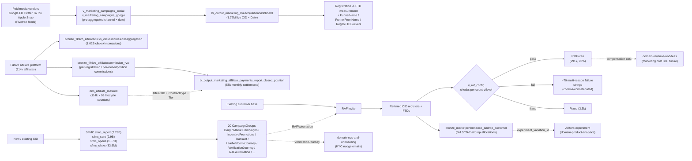

# Marketing & Acquisition Super-Domain

eToro grows by three independent acquisition motors, each measured separately, all settling on the same FTD-eligible-customer outcome. Plus a comms layer that retains and re-activates them.

| Motor | What it is | Anchors | Volume signal |
|---|---|---|---|
| **External paid acquisition** | Fiktivo affiliate platform + paid media vendors (Google / FB / Twitter / Apple / TikTok / Snap / Taboola / DV360) + live acquisition watcher | `dim_affiliate_masked` (114k affiliates, 99 cols), `bronze_fiktivo_affiliateclicks_clicksimpressionsaggregation` (1.02B), `v_marketing_campaigns_social` + `_google` (Genie-registered), `bi_output_marketing_liveacquisitiondashboard` (1.79M) | "Marketing Campaigns Performance" Genie 94 q/w, "PROD - Registration to FTD" 866 q/w (shares `dim_affiliate_masked`) |
| **Customer-driven viral acquisition** | RAF (Refer-A-Friend) + airdrop incentives + promo / loyalty cards | `v_raf` (313k = referring × referred pair × status; 31 cols), `v_raf_config` (251 per-country config), `bronze_marketperformance_airdrop_customer` (6M), `bronze_etoro_customer_rafgiven` (291k = the paid slice) | RAF Genie 47 q/w |
| **Marketing comms & journeys** | Salesforce Marketing Cloud emails + push notifications + CRM campaigns + loyalty offers | `bi_output_marketing_sfmc_sfmc_report` (2.28B), `silver_sfmc_sent` (2.9B), `silver_sfmc_opens` (1.67B), `silver_sfmc_clicks` (33.6M), 20 CampaignGroup taxonomy | `bi_output_marketing_sfmc_sfmc_report` ranks 22nd of Class-C orphans by 7-day query volume |

The three motors share customer identity (CID, GCID) and the FTD definition (`FTDFirstDate` / `FTDeFirstDate` on every layer), but otherwise live in independent tables with different grains, different vendors, and different update cadences.

## When to Use

Load when the question is about:

- Affiliate performance, click-through, commission, payment tier — see [`affiliate-and-paid-media.md`](affiliate-and-paid-media.md)
- Paid-media cost, channel ROI, cost-per-FTD, Google / FB / TikTok / Apple / Snap performance, the live acquisition funnel — see [`affiliate-and-paid-media.md`](affiliate-and-paid-media.md)
- RAF compensation, who-referred-whom, why a referral failed (FraudReason / RafStatusName multi-reason strings), per-country config, eligibility — see [`raf-and-incentives.md`](raf-and-incentives.md)
- Airdrop allocations, airdrop-status, airdrop offers per country, airdrop variant experiments — see [`raf-and-incentives.md`](raf-and-incentives.md)
- SFMC email engagement (sent / opens / clicks / bounces / unsubs / complaints), campaign group taxonomy, send-job dimension, Marketing Cloud user-behavior, marketing comms templates and notification channels — see [`marketing-comms-and-sfmc.md`](marketing-comms-and-sfmc.md)
- CRM marketing campaign objects, loyalty offers and requests, promo-card cashback — see [`marketing-comms-and-sfmc.md`](marketing-comms-and-sfmc.md)

Do **not** load for:

- The customer lifecycle / `IsFunded` definitions / FTD / FirstTimeFunded formula — `domain-customer-and-identity/customer-populations-and-lifecycle.md`. Marketing measures the SOURCING; the customer hub owns the lifecycle state and SCD walk.
- Mixpanel attribution and product-event-driven attribution (the `i_identify_user_id`-keyed page-view events that fire on marketing landing pages) — `domain-product-analytics/mixpanel-events-and-pageviews.md`. SFMC engagement (open/click of an email) lives here; landing-page pageview / scroll / form-fill telemetry lives in product-analytics.
- The ABtoro experiment platform itself — `domain-product-analytics/ab-testing-and-experimentation.md`. Marketing experiments are wrapped by ABtoro; the experiment metadata + storage tables live in product-analytics. Airdrop's `experiment_variation_id` column links here.
- The actual deposit flow that follows an FTD — `domain-payments/deposits-and-withdrawals.md`. Marketing measures FTD-as-an-event; the payments hub owns the deposit ledger.
- The verification-funnel work itself (registrationfunnel / VL0→VL3 timing) — `domain-ops-and-onboarding/electronic-verification-and-registration-funnel.md`. The `VerificationJourney` SFMC campaign group exists here, but the VL3 conversion measurement lives in OPS.

## Scope

In scope: the Fiktivo affiliate platform (master, groups, channels, leads, banners, commission VWs, country config); the `dim_affiliate_masked` Synapse-mirrored affiliate dimension with its lifecycle counters (FTD / FTDe Yesterday / ThisMonth / ThisQuarter / ThisYear / LastMonth / LastQuarter / LastYear / LifeTime — affiliate is the GRANULARITY); the Fivetran external-feed bronze tables for Google Ads / BingAds / Twitter Ads / DV360 / Apple Search Ads / TikTok Ads / Snapchat Ads / Rivery-Google-Ad — and the curated `v_marketing_campaigns_social` / `_google` views on top; the Live Acquisition Dashboard and acquisition-funnel views; RAF (Refer-A-Friend) and its dual-sided referring/referred ledger with per-country compensation config and the comma-concatenated multi-reason failure-strings; the airdrop incentive engine and its per-country × regulation × eligibility-type configuration including the `experiment_variation_id` link to ABtoro; the SFMC layer (sfmc_report aggregated + sfmc_sent/opens/clicks/bounces/unsubs/complaints/sendjobs/sendautologgingtracking/accountjourneylogtracking raw events + sfmc_filter targeting); the Marketing Cloud user-behavior personalisation feeds (instrument / PI); the marketing template / channel / content type tables under `experience.bronze_notificationdb_*marketing*`; the CRM-side `silver_crm_campaign`/`_campaignmember`/`_campaign_eligability__c` and the loyalty-offer trio under `silver_crm_*loyalty*`; the sharepoint-fed marketing-region mapping and multi-regulation-affiliate-compliance reference data; the ML-output search-term-clustering tables.

Out of scope: customer lifecycle / Funded definition / FirstTimeFunded formula (`domain-customer-and-identity/customer-populations-and-lifecycle.md`); the Mixpanel pageview / event stream itself, including marketing landing-page telemetry (`domain-product-analytics/mixpanel-events-and-pageviews.md`); ABtoro experiment design and results (`domain-product-analytics/ab-testing-and-experimentation.md`); the deposit ledger and money-flow (`domain-payments/`); the VL3-and-FTD onboarding-funnel measurement itself (`domain-ops-and-onboarding/electronic-verification-and-registration-funnel.md`); the AML risk classification of RAF fraud (`domain-compliance-and-aml/`); the affiliate-platform UI / Fiktivo backoffice software itself; finance / treasury cost-allocation of marketing spend across the P&L (`domain-finance-and-treasury`, future).

Last verified: 2026-05-28

## Critical Warnings

> **Tier 0 — Filter Contract (cross-cutting).** Every per-customer marketing aggregate in this domain (RAF compensation per club tier, FTDs from a campaign rolled per CID, paid-acquisition cost per acquired customer, affiliate-driven registration cohorts) MUST follow [`../cross-cutting/valid-users-filter-contract.md`](../cross-cutting/valid-users-filter-contract.md): silent SCD-2 walk on `V_Fact_SnapshotCustomer_FromDateID` with `IsValidCustomer = 1` and `DateID BETWEEN snap.FromDateID AND snap.ToDateID` (period-correct — never current-state `Dim_Customer` for period queries); mandatory one-line scope footer on every numeric output. Marketing measures EXTERNAL acquisition, so internal / test / dealing CIDs must be filtered out the moment a question rolls up per-customer. The carve-out: pre-aggregated channel-grain views (`v_marketing_campaigns_google`, `v_marketing_campaigns_facebook`, `v_marketing_campaigns_appsflyer`) have NO CID column — they're already aggregated to Region × Channel × Date and the filter is moot. The regulatory variant (`IsCreditReportValidCB = 1`) fires ONLY when the user explicitly says "CB valid" / "Client Balance valid" / "credit-report valid" — never on topic heuristics. Opt-out (unfiltered, include non-valids / internals / etorians / test) only on explicit user request. Never pre-flight.

1. **Tier 1 — `dim_affiliate_masked` is the canonical affiliate dimension and IS PRE-AGGREGATED for trailing-windows already.** Columns like `RegistrationLifeTime`, `RegistrationThisMonth`, `FTDeLastQuarter`, `FTDLastYear` etc. are computed counters baked into the affiliate row. Do not re-sum them across multiple affiliate rows for a given day — they're per-affiliate-state-now. Use them for ranking ("top 10 affiliates by FTDs this month") but NOT for time-series ("FTDs by week"). For time-series, drive off `bronze_fiktivo_affiliatecommission_registrationvw` (per-registration grain with `RegistrationDate`) joined to `dim_affiliate_masked` for the affiliate metadata.

2. **Tier 1 — RAF "status" is a comma-concatenated bitmask-as-string. Multi-reason strings like `'FTDReferredCheckAmount, FTDReferredDaysToWaitFromFTD, PositionsAmountReferred'` are common.** `v_raf.RafStatusName` has ~70 distinct values: 1 success (`RafGiven`, 291k of 313k ≈ 93%), 4 single-reason failures (`Fraud` 3.3k, `NoReferringConfig` 5k, `NoDefaultReferredConfig` 1.7k, `NoMoneyIsSetInConfig` 603, `LimitReached` 562), plus ~65 comma-concatenated combinations of the six failure-reason atoms: `FTDReferringCheckAmount`, `FTDReferringDaysToWaitFromFTD`, `FTDReferredCheckAmount`, `FTDReferredDaysToWaitFromFTD`, `PositionsAmountReferring`, `PositionsAmountReferred`, `RegistrationDateExpired`. For "did the referring side or the referred side fail?" use a `LIKE '%Referring%'` / `LIKE '%Referred%'` predicate on the string, not equality. For "did the referral happen at all?" use `RafStatusName = 'RafGiven'`. Be VERY careful with `<>'RafGiven'` queries — those return all 22k failure rows mixing 70 different reason combinations.

3. **Tier 1 — RAF is dual-sided: every successful RAF row has TWO compensation amounts (`ReferringCompensationAmount` for the inviter, `ReferredCompensationAmount` for the invitee) and TWO sets of cohort fields (Country, Regulation, PlayerLevel, RealizedEquity, TotalInvestedAmount). Don't double-count.** The row IS the referral event, not a customer-event. For "RAF cost total" sum BOTH compensations. For "customers who RECEIVED a referral compensation" use `ReferredCID` (the inviter side is the referrer, who also gets paid but as `ReferringCID`). The dollar split is asymmetric and varies by country — UK might pay referrer $50 + referee $25, US might pay both $30, Spain might pay referrer 0 + referee $100; consult `v_raf_config` for the active policy per country × regulation × PlayerLevel.

4. **Tier 1 — `v_marketing_campaigns_social` and `_google` are PRE-AGGREGATED to Region × Channel × Date. There is NO CID.** Channel taxonomy: social → `Twitter`, `FB`, `Taboola`, `TikTok` (plus a `''` empty-string bucket — 4.7k rows that are pre-bucketing); google → `Google UAC`, `Google Brand`, `Google Search`, `YT` (YouTube), `pMAX`, `YTE` (YouTube Engagement?), `NBR` (Non-Brand Region?). Attribution columns: social uses `FTD_S2S` (server-to-server post-back), `FTDs_Channel`, `AppsFlyer_Registrations` (per-vendor attribution overlay); google uses `FTD_Android_Firebase` / `FTD_IOS_Firebase` / `FTD_Web_Pilot` / `Registration_Android_Firebase` / `Registration_IOS_Firebase` / `Registration_Web`. The columns `FTD_Count` and `Registration_Count` are the TOTAL definition counts (cross-attribution unified). When summing cost per FTD, watch the attribution overlap.

5. **Tier 1 — `bi_output_marketing_sfmc_sfmc_report` is 2.28 BILLION rows and a number of "count" columns are STRING-typed.** `CountOpen`, `UniqueOpen`, `CountClicks`, `UniqueClicks`, `CountBounce`, `Delivered`, `OpenDate`, `ClickDate` are typed STRING (because the underlying ESP API returns nulls as empty strings). Cast to `BIGINT` / `TIMESTAMP` before aggregating: `SUM(CAST(NULLIF(CountOpen,'') AS BIGINT))`. Only `CountSend` is properly `LONG`. Always partition-filter: `etr_y='2026' AND etr_ymd BETWEEN '2026-05-01' AND '2026-05-31'` — dashed-string format like Mixpanel / streams.

6. **Tier 1 — SFMC CampaignGroup taxonomy is the FIRST cut (20 values, all production).** Top 6 by 2026 send volume: `Daily` (111M sends — newsletter), `MarketCampaigns` (58.8M — marketing pushes), `USDaily` (29M — US-only newsletter), `ProductUpdates` (25.9M — feature announcements), `IncentivePromotions` (16.5M — promo emails), `Transact` (13.4M — transactional confirmation emails). The four journeys (`LeadWelcomeJourney` 7.85M, `ColdLeadJourney` 4.35M, `VerificationJourney` 3.44M, `USWelcomeJourney` 2.78M) are automated onboarding sequences — VerificationJourney is the KYC-nudge sequence that lives next to `domain-ops-and-onboarding`. `RAFAutomation` (2.5M) is the RAF reminder sequence — links back to the RAF sub-skill. Filter on CampaignGroup first; CampaignSubGroup is the second cut (typically 4-12 values per group).

7. **Tier 2 — `bi_output_marketing_liveacquisitiondashboard` is per-CID × Date but updated DAILY by an overnight job and an ADDITIONAL "Fast24H" snapshot.** `Fast = 1` flags very recent (typically first 24h) data that may still be enriching; `Fast24H` flags the "today vs same day yesterday" comparison row. `FunnelName` lists the marketing-funnel grouping (`Retoro` is the canonical re-targeting funnel, dominant at 1.27M of 1.79M; `reToroiOS` and `reToroAndroid` are platform splits; `OpenBook` family is legacy; `Web Trader` / `Mobile` are direct), and `FunnelFromName` is the entry-point page / source (118 distinct values incl. `Interest on balance` 117k, `Web Registration Form LP` 25k, `Stocks Offering` 8.5k, `Copy Traders Offering` 6.1k, `Crypto Offering` 4.1k, `eToro Homepage` 2.8k, `Affiliates General LP` 584, `Stock Cashback Affiliates` 469). `RegToFTDBuckets` is the categorical conversion-time bucket. `KPI` enumerates the funnel-step counters; `State` enumerates the funnel state — both narrow.

8. **Tier 2 — `bronze_marketperformance_airdrop_customer` is SCD-2 (`ValidFrom` / `ValidTo`).** One customer × plan can have many rows over time as the status changes. For "active airdrops right now" filter `WHERE ValidTo IS NULL`. For "historical airdrop given count" filter `WHERE AirdropStatusID = <given>` (consult `bronze_marketperformance_dictionary_airdropstatus` for the enum). `AcceptedDate`, `PurchaseRequestDate`, `GivenDate`, `ExaustedDate` are the four lifecycle timestamps. `experiment_variation_id` (on `airdrop_configuration` not `_customer`) joins to ABtoro experiment_participants for "which airdrop variant won this A/B test".

9. **Tier 2 — `bronze_fiktivo_affiliateclicks_clicksimpressionsaggregation` is 1.02B rows, dashed-string partitions, partition-filter mandatory.** Filter pattern: `WHERE etr_y='2026' AND etr_ymd BETWEEN '2026-05-01' AND '2026-05-31'`. Schema: 12 cols including `PartitionCol100` (an upstream sharding artefact — ignore for analytical queries), `AffiliateID`, `BannerID`, `Campaign` (STRING, free-text affiliate-side campaign label), `CountryID`, `ClicksCount`, `ImpressionsCount`, `UpdateDate`, `AdditionalData` (STRING — affiliate-side metadata blob). For commission roll-up join to `bronze_fiktivo_affiliatecommission_registrationvw` (per-registration) on `AffiliateID` + `CountryID` + the date window.

10. **Tier 2 — RAF compensation is paid only AFTER the referred customer FTDs and clears the waiting-period + minimum-position-amount checks per `v_raf_config`.** `DaysToWaitFromFTD` (typically 7-30 days) is the cooling-off; `DaysToCheckMinPositionsAmountFromRegistration` (typically 30-90 days) is the engagement-test window; `ReferredMinDepositInDollar` is the FTD floor; `ReferredMinPositionsAmountInDollar` is the trading floor. Failing any check appends a reason atom to `RafStatusName`. The `CompensationDate` lags the referred customer's registration by 7-90 days typically — so RAF-cost-by-Day usage `CompensationDate`, not `RegistrationDate`.

11. **Tier 2 — `dim_affiliate_masked.MasterAffiliateID` is the parent-affiliate link for sub-affiliate trees.** Affiliates with `MasterAffiliateID > 0` are sub-affiliates (the master gets a cut of the commission). Affiliate group → master → sub-affiliate is a 3-level hierarchy. For "total network performance under affiliate X" join transitively on `MasterAffiliateID`. Tier 4+ depths exist but are rare. `AffiliatesGroupsName` is the GROUP (account-manager-level grouping); `MasterAffiliateID` is the ENTITY-level hierarchy. They are different.

12. **Tier 3 — `v_marketing_campaigns_social` has a blank-string Channel bucket (`Channel = ''` is 4.7k rows of 25.9k ≈ 18%).** Likely pre-bucketing / un-mapped channels. Don't drop them — they typically aggregate into "Other" — but explicitly call them out in any per-channel sum. Similarly the empty `lad_funnelfrom` bucket on `bi_output_marketing_liveacquisitiondashboard` (`Unknown` 123 rows / total 36k unknown) — these are tracking-pixel-failed sessions; not a real funnel state.

13. **Tier 3 — `bi_output_marketing_sfmc_sfmc_report.GCID` exists but `SubscriberID` is the SFMC-native id.** Each `SubscriberID` typically maps 1:1 to a `GCID` but stale SubscriberIDs that no longer map to an active GCID exist for unsubscribed / closed customers. For "engagement for active customers" join on `GCID`; for SFMC-platform-level questions (deliverability per ESP send-job) join on `SubscriberID`. `SendID` is the per-individual-send identifier; `SendJobID` (in `silver_sfmc_sendjobs`) is the per-blast-job identifier — one SendJob has many SendIDs.

14. **Tier 3 — Multiple personal / experimental tables exist under `bi_output_stg.*` and `ml_output_*` that are NOT canonical.** Examples: `bi_output_stg.hackathon_acquisition`, `bi_output_stg.live-acquisition-insights*`, `bi_output_stg.mvg_marketing_automation`, `ml_output_models_raf_final_dataset_2024_*` (~25 versioned RAF training datasets). Treat these as experimental / training-only; for canonical RAF use `etoro_kpi.v_raf`, for canonical affiliate use `dim_affiliate_masked` and the `bronze_fiktivo_*` family.

15. **Tier 3 — `bi_output.bi_output_marketing_promotion_bi_db_promo_card` and the bounceback variant carry per-customer promo-card-cashback events.** Distinct from `vg_promo_card_cashback` (81 queries / week, lives in payments-eMoney domain as a per-card cashback event, not the marketing promotion table). When the question is "how many customers received a promo card" — that is here; "how much cashback was paid on a specific promo card" — that is `domain-payments-eMoney` (`vg_promo_card_cashback`).

## Mental model — the three acquisition motors

## Sub-skills

- [`affiliate-and-paid-media.md`](affiliate-and-paid-media.md) — Fiktivo affiliate platform + paid media vendors + live acquisition dashboard. Use when the question is about affiliate / partner / paid-channel / `dim_affiliate` / SubChannel / Campaign / Region / Channel / clicks / impressions / cost-per-FTD / `v_marketing_campaigns_social` / `_google` / `bi_output_marketing_liveacquisitiondashboard` / `bi_output_marketing_affiliate_payments_report_closed_position` / `bronze_fiktivo_*` / `bronze_fivetran_*ads_*`.

- [`raf-and-incentives.md`](raf-and-incentives.md) — RAF (Refer-A-Friend) + airdrops + promo cards + loyalty offers. Use when the question is about `v_raf` / `v_raf_config` / `ReferringCID` / `ReferredCID` / `RafStatusName` / `FraudReason` / referral / refer-a-friend / `bronze_etoro_customer_rafgiven` / `bronze_etoro_customer_rafeligiblecustomers` / `bronze_marketperformance_airdrop_*` / airdrop / `silver_crm_loyalty_offer__c` / `bi_output_marketing_promotion_*promo_card*`.

- [`marketing-comms-and-sfmc.md`](marketing-comms-and-sfmc.md) — SFMC (Salesforce Marketing Cloud) emails + Marketing Cloud user-behavior + push / in-app notifications + CRM campaigns. Use when the question is about `sfmc_*` / `SFMC` / email engagement / `CampaignGroup` / `LeadWelcomeJourney` / `VerificationJourney` / `RAFAutomation` / `silver_sfmc_sent / opens / clicks / unsubs / bounces / complaints / sendjobs` / `bi_output_marketing_sfmc_sfmc_report` / `marketingcloud_user_behavior` / `marketingtemplatecontent` / `silver_crm_campaign`.

## Critical cross-cutting joins

| From | To | Key |
|---|---|---|
| `dim_affiliate_masked` | `bronze_fiktivo_affiliatecommission_registrationvw` | `AffiliateID` (per-registration commission) |
| `dim_affiliate_masked` | `bronze_fiktivo_dbo_tblaff_affiliatesgroups_masked` | `AffiliatesGroupsName` (group metadata + account manager) |
| `dim_affiliate_masked` | `dim_customer_masked` | `CID` ← `customer.AffiliateID` (sourced customers per affiliate) |
| `v_raf` | `dim_customer_masked` | both `ReferringCID` AND `ReferredCID` (two joins for dual-sided enrichment) |
| `v_raf` | `v_raf_config` | `ReferringCountryID` × `ReferringRegulationID` × `ReferringPlayerLevelID` (= the policy that was active) |
| `bronze_marketperformance_airdrop_customer` | `bronze_marketperformance_airdrop_configuration` | `ConfigurationID` (the offered plan) |
| `bronze_marketperformance_airdrop_configuration` | `bi_output_product_analytics_abtoro_experiment_participants` | `experiment_variation_id` (which ABtoro variant) |
| `bi_output_marketing_sfmc_sfmc_report` | `dim_customer_masked` | `GCID` (active customer mapping) |
| `bi_output_marketing_sfmc_sfmc_report` | `silver_sfmc_sendjobs` | `SendID` ← `SendJobID` (1 SendJob → N SendIDs) |
| `v_marketing_campaigns_social/_google` | (none — already aggregated) | drive off Date + Channel for time-series, no CID join possible |
| `bi_output_marketing_liveacquisitiondashboard` | `dim_customer_masked` | `CID` (per-customer live funnel) |
| `bi_output_marketing_liveacquisitiondashboard` | `dim_affiliate_masked` | `AffiliatesGroupsName` (affiliate-side attribution) |

## Canonical Genie spaces

| Space ID | Name | Queries / week | Registered tables |
|---|---|---:|---|
| `01f1003cd92b1430826100f723a359d2` | PROD - Registration to FTD | 866 | `main.etoro_kpi.ftd_funnel_v`, `main.dwh.gold_sql_dp_prod_we_dwh_dbo_dim_affiliate_masked` |
| `01f1418befa310f0a03ec500a2bdb587` | Marketing Campaigns Performance | 94 | `main.etoro_kpi_stg.v_marketing_campaigns_social`, `main.etoro_kpi_stg.v_marketing_campaigns_google` |
| `01f14e91f3871ffba9f2a213665cf76b` | (unnamed RAF space) | 47 | `main.etoro_kpi.v_raf`, `main.etoro_kpi.v_raf_config` |

The `dim_affiliate_masked` is dual-registered: also in the FTD-funnel Genie because the Registration→FTD measurement uses the affiliate dimension as one of its three primary tables. SFMC has no dedicated Genie space yet — `bi_output_marketing_sfmc_sfmc_report` is a Class-C orphan (83 queries / week of direct workspace use).

## Last verified

2026-05-28 — anchor inventory + row counts probed from `main.information_schema.columns` and direct sampling of `v_raf.RafStatusName`, `bi_output.bi_output_marketing_liveacquisitiondashboard.FunnelName/FunnelFromName`, `bi_output_marketing_sfmc_sfmc_report.CampaignGroup` (2026 partition), `etoro_kpi_stg.v_marketing_campaigns_social.Channel`, `etoro_kpi_stg.v_marketing_campaigns_google.Channel`. Partition-format confirmed dashed-string on `sfmc_report` and `clicksimpressionsaggregation`. RAF status taxonomy fully enumerated (1 success state, 4 single-reason failures, ~65 comma-concatenated multi-reason combinations of 7 atomic failure-reasons).
