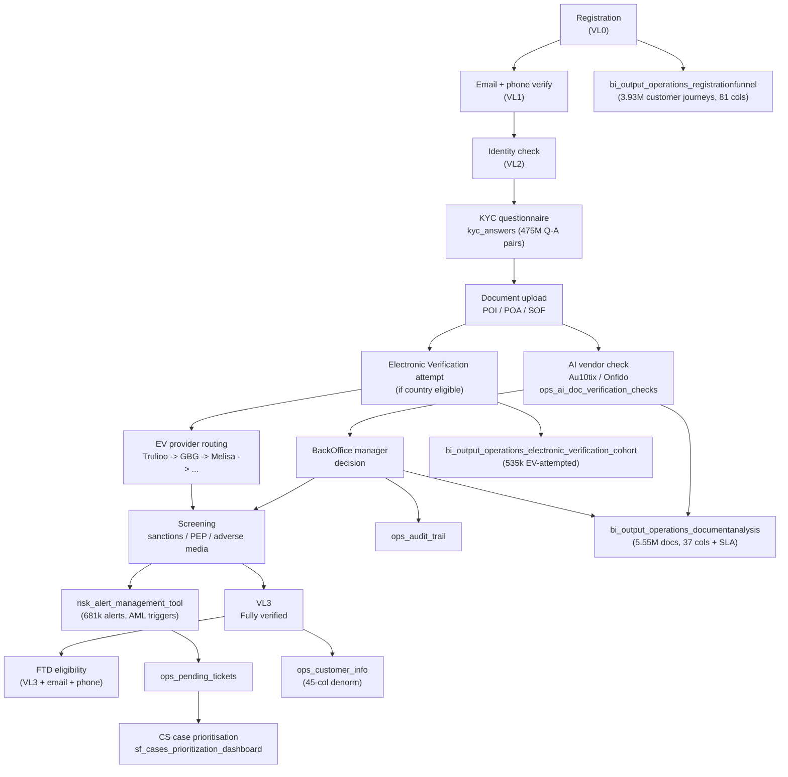

# Operations & Onboarding Super-Domain

OPS at eToro is the human-and-vendor work-tracking layer around the customer lifecycle. Three independent sub-systems, four Genie spaces, ten distinct dashboards:

| Sub-system | What it tracks | Anchor | Volume |
|---|---|---|---|
| **KYC document pipeline** | Every document a customer uploaded, the AI vendor's verdict, the human BackOffice override, the SLA from upload→decision, the reason for rejection | `documentanalysis` (5.55M / 1-per-doc), `ops_ai_doc_verification_checks` (5.7k AI-decisioned docs), `kyc_answers` (475M Q-A pairs), source OLTP `billing.bronze_etoro_backoffice_customerdocument` (8.78M active / 13.4M issued) | High-traffic — "OPS - Documents & Verification" Genie 313 queries/week |
| **Registration & electronic verification** | The customer's path from VL0 (registered) → VL1 → VL2 → VL3 (fully verified), per-vendor EV-provider attempts, country-policy routing, time-to-verify SLAs | `registrationfunnel` (3.93M / 1-per-customer-journey, 81 cols of timeline), `electronic_verification_cohort` (535k / 1-per-EV-attempted-customer, 58 cols with provider-by-provider routing), `onboarding_flow_userkpis` | "OPS - Registrations Funnel" 36 q/w, "OPS - Electronic Verification" 17 q/w |
| **OPS portal customer-360 + alerts + CS workflow** | The denormalised customer view OPS agents work from, the rule-triggered alert queue, AML/fraud indicator outputs, CS case prioritisation, audit trail, monthly KPI rollups for cashouts/wires/cost | `ops_customer_info` (45-col customer-360), `risk_alert_management_tool` (681k alerts / 102 cols), `ops_pending_tickets`, `ops_audit_trail`, `monthly_kpis_*` | "OPS - General Genie" 41 q/w |

The three sub-systems share customer identity (CID, GCID) and the verification-level enum (VL0/VL1/VL2/VL3), but otherwise live in independent tables with different grains.

## When to Use

Load when the question is about:

- KYC documents: upload counts, decision times, SLA buckets, vendor verdicts, AI-vs-manual decisions, POI/POA/SOF type, rejection reasons — see [`kyc-document-pipeline.md`](kyc-document-pipeline.md)
- Onboarding timing: time-from-registration-to-verified, conversion-to-FTD, EV provider routing, country-eligibility, screening SLA — see [`electronic-verification-and-registration-funnel.md`](electronic-verification-and-registration-funnel.md)
- OPS portal usage: customer-360 lookups, alert queues, pending tickets, CS case prioritisation, ops-side rollups of deposits/withdrawals/positions, monthly cost KPIs — see [`ops-portal-and-alerts.md`](ops-portal-and-alerts.md)
- "Why was customer X's document rejected?" — KYC sub-skill, joins through DocumentID to documentanalysis + AI checks + manager + vendor + reason
- "How long does VL0→VL3 take for country X?" — EV/registration sub-skill, registrationfunnel.TimeInMinutes_FromVerificationLevel0toVerificationLevel3 + TimeBuckets categorical
- "Show the alert queue for a CID" — OPS portal sub-skill, risk_alert_management_tool filtered by CID

Do **not** load for:

- AML risk-scoring methodology / sanctions screening logic itself — `domain-compliance-and-aml/SKILL.md`. The OPS hub tracks the WORK (queue, SLA, vendor) of compliance; the methodology and risk rules live in compliance.
- Customer master attributes (regulation, club tier, current status) as queried from `Dim_Customer` / `customer_snapshot_v` — `domain-customer-and-identity/customer-master-record.md`. The OPS hub's `ops_customer_info` is a denormalised OPS-portal view, not the source-of-truth master.
- The actual deposit / withdraw money-flow — `domain-payments/deposits-and-withdrawals.md`. The OPS hub's `ops_deposits` / `ops_withdrawals` are OPS-portal rollups for case-investigation context; the authoritative ledger lives in payments.
- The trading-positions semantics — `domain-trading/position-state-and-grain.md`. `ops_positions_details` is an OPS-portal flattening.

## Scope

In scope: the ~30 `bi_output_operations_*` tables under `main.bi_output_stg.*` and the one under `main.bi_output.*` (legacy); the OLTP-source customerdocument tables under `main.billing.bronze_etoro_backoffice_*`; the `compliance.bronze_userapidb_kyc_answers` alternate source; the `de_output_onboarding_ev_cohort_enriched` and `bi_db.gold_sql_dp_prod_we_bi_db_dbo_bi_db_operations_onboarding_flow_userkpis` enriched outputs; the `bi_db.bronze_riskclassification_riskclassification_customeronboardingriskclassification` upstream; the four-tier KYC Verification Level enum (VL0/VL1/VL2/VL3); document types (POI Proof-of-Identity, POA Proof-of-Address, SOF Source-of-Funds, Authorization, Corporate); the EV vendor inventory (Trulioo, GBG, Melisa, DataZoo, DataZoo2, IDMerit, Prove) and routing-after-no-match policy; the SLA-bucket convention on document definition; the AI-vs-manual decision flag (`IsDocumentApprovalAutomatic`); the ManagerID = 0 convention (= customer self-uploaded vs > 0 = BackOffice agent); the Obsolete soft-delete and Accounting unused-flag patterns; the OPS portal denormalised customer-360 view shape; the 102-column generic-bag shape of `risk_alert_management_tool` with its `_1`-suffix de-dupe artefacts.

Out of scope: AML risk-scoring methodology, sanctions screening rules, KYC question semantics (`domain-compliance-and-aml/SKILL.md`); customer master attribute resolution (`domain-customer-and-identity`); the authoritative deposit/withdraw ledger (`domain-payments`); trading position semantics (`domain-trading`); the BackOffice UI / agent workflow software itself; the public-API operations tables in `de_output` (those are platform observability, deferred to `domain-platform-and-meta`).

Last verified: 2026-05-28

## Critical Warnings

> **Tier 0 — Filter Contract (cross-cutting).** Every per-customer OPS aggregate in this domain (AVG time to VL3 by regulation, open alerts by club tier, monthly cashout count by jurisdiction, document-review SLA per regulation, KYC completion rate per cohort) MUST follow [`../cross-cutting/valid-users-filter-contract.md`](../cross-cutting/valid-users-filter-contract.md): silent SCD-2 walk on `V_Fact_SnapshotCustomer_FromDateID` with `IsValidCustomer = 1` and `DateID BETWEEN snap.FromDateID AND snap.ToDateID` (period-correct — never current-state `Dim_Customer` for period queries); mandatory one-line scope footer on every numeric output. The OPS tables ARE the source-of-truth for active onboarding work — most analytical questions about completed customers still need internal / test / dealing accounts filtered out. The carve-out: pure operational queue management ("Assignee X's pending tickets right now", "alerts un-touched in 24h", "documents in review state for analyst Y") is work-in-flight against ALL customers including internals / dealings and does NOT take the filter — these queues are the source-of-truth for ops productivity. The moment the question shifts to analytical reporting per-customer, the contract kicks in. The regulatory variant (`IsCreditReportValidCB = 1`) fires ONLY when the user explicitly says "CB valid" / "Client Balance valid" / "credit-report valid" — never on topic heuristics. Opt-out (unfiltered, include non-valids / internals / etorians / test) only on explicit user request. Never pre-flight.

1. **Tier 1 — `kyc_answers` is 475M rows at the Q-A grain, NOT per-customer.** One customer typically has dozens of KYC Q-A pairs (one per question on the form). For "what % answered Y on question 17" the table is right; for "how many customers completed KYC" you must DISTINCT on CID. Always filter by `KycQuestionId` AND aggregate carefully, and prefer to JOIN to `registrationfunnel` (1 row per customer) for per-customer rollups.

2. **Tier 1 — Verification Level enum: 0 = registered (just signed up), 1 = email/phone verified (V1), 2 = identity verified (V2), 3 = fully verified i.e. KYC complete (V3).** This enum is used everywhere — `VerificationLevelID`, `verification_level3_date`, `IsVerificationLevel{0,1,2,3}`, `client_vl_on_upload`. Do not confuse VL3 with "fully onboarded" — VL3 means KYC is complete; FTD-eligibility is a separate gate (`IsCountryEligibleForElectronicVerification` plus `EmailVerification` plus `PhoneVerification`).

3. **Tier 1 — Two parallel document-type fields with different semantics: `SuggestedDocumentTypeID` (AI-vendor suggestion at upload) vs `DocumentClassification` / `CustomerDocumentToDocumentType` (BackOffice-confirmed final classification).** When asking "how many POI documents did we receive?", filter on the BackOffice-confirmed type (`DocumentClassification`) for completed documents and on `SuggestedDocumentTypeID` for "as uploaded by AI". They diverge on ~5-15% of documents where the AI was wrong and a manager re-classified.

4. **Tier 1 — `ManagerID = 0` on `bronze_etoro_backoffice_customerdocument` means CUSTOMER self-uploaded; > 0 means a BackOffice agent uploaded.** ~99.9% of modern docs are `ManagerID = 0` (customer portal upload). Manager-uploaded docs are usually from fax / email / Zendesk attachments. Don't confuse `ManagerID` (who UPLOADED) with `ProofOfIdentity_Manager` (who APPROVED) — they are different actors in different tables.

5. **Tier 2 — `Obsolete = 1` on `bronze_etoro_backoffice_customerdocument` is a soft-delete (superseded / fraudulent / invalidated).** Only 249 of 8.78M docs are obsolete. Filter `WHERE Obsolete = 0 OR Obsolete IS NULL` for "current" documents — but be aware of the rarity. The `Accounting` flag was a planned feature that was never activated — it is 0 on all 8.78M rows; ignore it.

6. **Tier 2 — `definition_sla_bucket` on documentanalysis is a categorical pre-bucketed SLA: don't recompute it.** Buckets are calculated upstream from `minutes_to_definition`. Live values (April 2026): `≤ 1 hour` (~320k / month, ~88% of definitions), `1–4 hours` (~12k), `4–24 hours` (~23k), `1–3 days` (~4k), `4–7 days` (~2k), `8+ days` (~3k). The ~88% in-the-≤1-hour-bucket reflects modern automation. If you need raw minutes use `minutes_to_definition`.

7. **Tier 2 — `electronic_verification_cohort` covers ONLY customers who attempted EV.** It is NOT a per-customer master — it's a 535k-row cohort of EV-attempted customers. Customers in countries that don't support EV (`IsCountryEligibleForElectronicVerification = 0` in registrationfunnel) are absent. For full-customer onboarding analysis, drive off `registrationfunnel` and LEFT JOIN EV cohort.

8. **Tier 2 — `provider_<vendor>_latest_status` columns (Trulioo / GBG / Melisa / DataZoo / DataZoo2 / IDMerit / Prove) tell you what the LATEST attempt with each vendor returned, NOT all attempts.** For full per-attempt history you need `ev_investigation_alert_history` joined on customer. For "did Trulioo ever return a match for this customer" use `vendor_events_*` aggregates from the EV cohort table.

9. **Tier 2 — `policy_route_to_second_on_no_match = 1` plus `routing_expected_but_missing_flag = 1` is the classic "should have routed but didn't" diagnostic.** When the country requires a second vendor after No Match but the routing never happened, that's an EV-pipeline bug. Filter on these flags to find the affected customers.

10. **Tier 2 — `risk_alert_management_tool` is a fat 102-column generic alert-metadata bag.** Most columns are typed `string` and serve as per-rule metadata (TelesignScore, SiftScore, NameConflictScore, DeviceId, FtdAmount, KycCountryId, etc.). The actual rule type lives in `AlertType` / `AlertTypeDescription` / `CategoryName` / `TriggerType` / `RuleType`. Always start filtering at `AlertType` before extracting rule-specific columns. The `_1` suffix duplicate columns (Gcid + Gcid_1? no, here `Gcid` appears twice in the schema list because of two physical sources merged — same with `MeansOfPayments1`, `ForceTriggerAlert1`, `DaysPeriod1`, `RelatedCids1`, etc. — are upstream-merge artefacts; prefer the non-suffixed column unless filtering an audit query.

11. **Tier 3 — `bronze_etoro_backoffice_customerdocument` uses NON-STRING partition columns: `etr_y` INT, `etr_ym` STRING, `etr_ymd` DATE.** Different from `mixpanel.silver` (all STRING dashed) and `experience.bronze_event_hub_*streams_*` (all STRING dashed). Filter pattern: `WHERE etr_y = 2026 AND etr_ymd = DATE'2026-05-27'`. String-format filters (`etr_ymd = '2026-05-27'`) work because of implicit cast but integer filters on etr_y must be numeric.

12. **Tier 3 — `registrationfunnel` is a SNAPSHOT, not event-time.** All `DateTime_VerificationLevel<N>` timestamps and SLA computations are AS OF the snapshot date. For historical "verification rate at the END of 2024" type questions you need the time-window filter on snapshot date plus the relevant VerificationLevel timestamps.

13. **Tier 3 — `PendingClosureStatusID` enum (1=No, 2=Suggested for Closure, 3=Approved for Closure) on `ops_customer_info` is an OPS-portal workflow state, not a regulatory closure status.** "Approved for Closure" means the OPS team has cleared the customer for actual closure to proceed — the actual closure event lands in `customer master` / `Dim_Customer` afterward.

14. **Tier 3 — `yoni_davideresta_alerts` is owner-prefixed (personal sandbox of two named individuals).** Likely temporary / experimental. Treat as non-canonical unless you confirm with the owners — production alert tables are `risk_alert_management_tool` and `opschange_fraud_indicator_report`.

## Mental model — the onboarding pipeline

## Sub-skill routing

| Question pattern | Load |
|---|---|
| Documents, AI checks, POI/POA/SOF, customerdocument, manager decisions, SLA buckets, doc rejection reasons | [`kyc-document-pipeline.md`](kyc-document-pipeline.md) |
| Registration funnel, VL0→VL3 timing, EV vendors, country eligibility, routing-after-no-match, time-to-FTD | [`electronic-verification-and-registration-funnel.md`](electronic-verification-and-registration-funnel.md) |
| OPS customer-360 portal, alert queue, pending tickets, fraud indicators, monthly KPIs, telesign cost, audit trail | [`ops-portal-and-alerts.md`](ops-portal-and-alerts.md) |

## Cross-domain federation

| When question crosses into | Route or co-load |
|---|---|
| AML risk-scoring methodology / sanctions screening rules | `domain-compliance-and-aml/SKILL.md` — the OPS hub tracks WHAT happened; compliance owns WHY |
| Customer master (regulation, club, status at present) | `domain-customer-and-identity/customer-master-record.md` |
| Authoritative deposit / withdraw ledger | `domain-payments/deposits-and-withdrawals.md` (ops_deposits / ops_withdrawals are OPS-portal rollups, not the ledger) |
| eMoney IBAN / card details | `domain-payments/emoney-accounts-and-cards.md` |
| Trading positions semantics | `domain-trading/position-state-and-grain.md` |
| Refer-a-Friend pre-FTD funnel | `domain-customer-and-identity/registration-to-ftd-funnel.md` |
| Mixpanel client-side onboarding-flow events (form clicks, page views) | `domain-product-analytics/mixpanel-events-and-pageviews.md` |
| A/B test impact on onboarding | `domain-product-analytics/ab-testing-and-experimentation.md` (exp_type = 'KYC') |
| Filter contract (always for per-CID rollups) | `cross-cutting/valid-users-filter-contract.md` |

## Cross-cutting facts (memorise these)

1. **Verification Level enum:** 0=registered, 1=email/phone verified, 2=identity verified, 3=KYC complete. VL3 ≠ FTD-eligible — FTD also needs `IsCountryEligibleForElectronicVerification + EmailVerification + PhoneVerification`.
2. **Document types (live values, April 2026):** `Proof of Identity` (~192k / month — POI), `W-8BEN Form` (~153k — US-tax cert), `Not Accepted` (~135k — explicit reject bucket, NOT a type as such), `Proof of address` (~64k — note lowercase 'address'), `TaxReport` (~46k), `Selfie Motion` / `SelfieLiveliness` / `Selfie` (~24k combined — anti-spoofing), `W9` (~11k — US-tax), `Proof of Income` (~7k — POI-Income, distinct from Proof of Identity), `Client Forms` (~4k), `Translation`, `Credit Card`, `Proof of MOP`, `Corporate doc`. SOF (Source of Funds) appears occasionally but is rare. Type appears under TWO fields with different semantics — `SuggestedDocumentTypeID` (AI-vendor suggested at upload) vs `DocumentClassification` (BackOffice-confirmed final classification).
3. **Two vendor populations.** (a) Document-verification vendors recorded under `documentanalysis.vendor` — Onfido (~228k / month, fast at avg 85 min), Sumsub (~125k, avg 138 min), Au10tix and IDnow (small volume, <200), plus internal `AI` (~1.3k, sub-10-min) and EMPTY rows (~287k = manual KYC team handling without an external vendor — DO NOT mistake empty `vendor` for missing data, it means in-house). (b) Electronic-verification (EV) vendors recorded across `electronic_verification_cohort.provider_<vendor>_latest_status` columns — Trulioo, GBG, Melisa, DataZoo, DataZoo2, IDMerit, Prove. Country policy determines which EV vendors run, in what order, and whether routing-after-no-match is required. These two vendor populations DO NOT overlap — document vendors handle uploaded files; EV vendors verify identity electronically against external databases.
4. **`ManagerID` ambiguity:** on `customerdocument`, ManagerID = WHO UPLOADED (0 = customer self). On `documentanalysis` and `registrationfunnel`, `ProofOfIdentity_Manager` / `ProofOfAddress_Manager` = WHO APPROVED. Two different agent slots.
5. **`Obsolete` is a soft-delete on customerdocument; `IsValidCustomer` is the SCD-2 customer filter.** Different concepts at different tables.
6. **`risk_alert_management_tool` is a fat generic bag — start at `AlertType` to know which columns matter.**
7. **`kyc_answers` is Q-A grain (475M rows), not customer grain.** DISTINCT on CID before counting customers.
8. **Per-CID rollup → filter contract.** Always `IsValidCustomer = 1` via the SCD-2 walk unless purely operational ("Assignee's pending queue right now").

## What this skill is NOT

- Not AML risk-scoring methodology (`domain-compliance-and-aml/SKILL.md`).
- Not the authoritative customer master (`domain-customer-and-identity/customer-master-record.md`).
- Not the authoritative deposit/withdraw ledger (`domain-payments/deposits-and-withdrawals.md`).
- Not the trading positions themselves (`domain-trading`).
- Not the cross-product valid-users filter contract (`cross-cutting/valid-users-filter-contract.md`).
- Not the BackOffice agent UI / workflow software / OPS Tableau-dashboard configuration.
- Not the public-API operations observability (deferred to `domain-platform-and-meta`).

## Skill provenance

- **Primary sources.** UC live probes on 2026-05-28 against the 34 ops-related tables: `documentanalysis` (5.55M rows, 37 cols with rich business comments including SLA bucket semantics), `kyc_answers` (475M rows, Q-A grain), `registrationfunnel` (3.93M rows, 81 cols of timeline + screening + POI/POA + LTV), `electronic_verification_cohort` (535k rows, 58 cols with per-vendor routing), `risk_alert_management_tool` (681k rows, 102 cols generic-bag), `ops_customer_info` (45-col denormalised customer-360), `bronze_etoro_backoffice_customerdocument` (8.78M active / 13.4M issued, with int/date partition columns).
- **Usage data.** `audits/_usage_trigger_xref_20260525T155320Z/`: `documentanalysis` 278×, `customerdocument` 78×, `customerdocumenttodocumenttype` 71×, `registrationfunnel` 36×, `electronic_verification_cohort` 35×, `ops_customer_info` 35×. Genie spaces: "OPS - Documents & Verification" 313 q/w, "OPS - General Genie" 41 q/w, "OPS - Registrations Funnel" 36 q/w, "OPS - Electronic Verification" 17 q/w.
- **Federation references.** `cross-cutting/valid-users-filter-contract.md`, `domain-compliance-and-aml/SKILL.md`, `domain-customer-and-identity/customer-master-record.md`, `domain-payments/deposits-and-withdrawals.md`, `domain-product-analytics/ab-testing-and-experimentation.md`.
