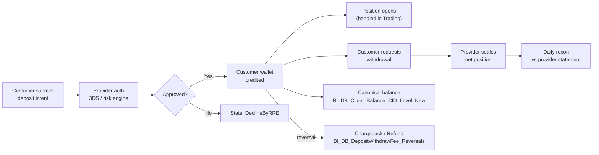

# Payments Super-Domain

eToro's payments stack is **not** a single ledger. It is **five loosely-coupled systems** that all touch a customer's money but at different lifecycle stages, on different platforms, with different reconciliation partners. Routing the question to the right sub-skill is the difference between a one-table answer and a six-table mistake.

This super-domain is about **MONEY MOVEMENT** — money entering, leaving, moving between platforms, sitting on customer balances. It is **not** about:

- **Fee revenue / fee composition** → `domain-revenue-and-fees` (anchored on `BI_DB_DDR_Fact_Revenue_Generating_Actions` 27c). Fees touch payments but the math, aggregation, and per-product variants (deposit fee, withdraw fee, FX/conversion, cashout, transfercoin/redeem, staking, commission, rollover, dividend, dormant, share-lending, ticket fees, options-revenue, US-Apex fees) all live there.
- **Bonuses** (deposit bonus, refer-a-friend, club, campaign) → Compensation regular domain (planned). Bonuses are pay-OUT to customers, accounted differently.
- **BackOffice manual operations** (operator-driven adjustments, refunds, manual credits) → Operations regular domain (planned). For the audit-trail piece, anchor on `Fact_CustomerAction` in `domain-customer-and-identity/customer-action-audit-trail`.
- **Treezor / Tribe / FiatDwhDB audit envelopes** → `domain-cross/tribe-emoney-audit`. Tribe is the Treezor XML audit envelope feed; FiatDwhDB is Treezor's operational fiat mirror.
- **Broker EOD position recon** (Dealing IG / Saxo / Duco) and **broker / LP identity** (hedge server, LP IDs) → `domain-trading` (`dealing_dbo`). Payment-side `BankName` / `MID` / `PaymentProviderName` are PSP identities, NOT broker identities — do not conflate.

## Routing waypoint — read this first

**If the question is "how much money flowed in / out" across the business** (volumes, FTD counts, MIMO trends, daily/monthly customer money status), default to [`mimo-panel-and-ddr.md`](mimo-panel-and-ddr.md) (C.2) **FIRST**. The DDR/MIMO panel is the BI team's pre-aggregated cross-platform view; it already UNION-ALLs trading-platform / eMoney / Options / (post-C2F) Crypto. Going straight to the raw billing facts is only correct when you need platform-specific drill-down: provider/MID, IBAN-side detail, on-chain hash, state-machine drill, fee composition, single-deposit forensics. **When in doubt between C.1/C.3/C.4 and C.2, choose C.2.**

## When to Use

Load when the question concerns **money movement** — flow events, balance state, or recon:

- "Net MIMO last month by platform" / "FTD trends" / "FTF cohort size" / "money-in money-out daily customer status"
- "Customer X's deposit history with provider / chargeback / reversal detail"
- "eMoney IBAN balance per GCID on date D" / "card transaction history for GCID Z"
- "Crypto wallet on-chain redemption volume per asset" / "real-time crypto balance"
- "Crypto came in → converted to EUR on IBAN — was the conversion clean?" (use `domain-cross/crypto-to-fiat`)
- "Canonical customer balance per CID per day (cross-platform)" / "30-day balance trend"
- "Funded / active-trader / balance-only / portfolio-only segmentation on date D"
- "Apex SOD reconciliation — cash + BuyingPower + Options portfolio"
- "Is the OpenBanking deposit rejection rate trending up?"
- "TP / eMoney / Crypto / Options money flow breakdown for customer X"

Do **not** load for:

- **Fee revenue per CID / per period** → `domain-revenue-and-fees`. Use this hub only to ROUTE there.
- **Bonus pay-outs / compensation accounting** → Compensation regular domain (planned).
- **AML risk classification / SAR / sanctions** → Compliance super-domain (planned).
- **Trading positions / P&L / broker-dealer execution** → `domain-trading`.
- **Operator audit trail on a customer's account** → `domain-customer-and-identity/customer-action-audit-trail` (`Fact_CustomerAction`).

## Scope

In scope: TP fiat deposits / withdrawals (`BI_DB_DepositWithdrawFee` 48c + `_Reversals` 45c, `Fact_BillingDeposit` 139c, `Fact_BillingWithdraw` 86c — `Fact_Deposit_State` / `Fact_Cashout_State` are QA-only Synapse, NOT in UC); MIMO cross-platform panel + DDR daily-status framework (`BI_DB_DDR_Fact_MIMO_AllPlatforms` 24c, `BI_DB_DDR_Customer_Daily_Status` 67c, `_Periodic_Status` 131c, `Fact_AUM` 43c, `Fact_PnL` 18c, `Fact_Revenue_Generating_Actions` 27c, `Fact_Trading_Volumes_And_Amounts` 30c, plus per-platform DDR_Fact_MIMO_* feeds); eMoney IBAN/card platform (`eMoney_Dim_Account` 89c, `_Dim_Transaction` 77c, `eMoneyClientBalance` 75c, `Fact_Transaction_Status` 77c, `Panel_FirstDates` 65c, `Reports_AcquisitionFunnel` 15c, `Reports_ClubUpgrade` 13c, `Card_Instance_Summary` 18c; 5 dictionary tables, `Card_Monthly_Snapshot`, `BankPaymentsUK`, `30DayBalanceExtract`, `Account_Mappings`, `Marketing_EmailTracking` are Synapse-only / not in UC); crypto wallet EXW (`EXW_FactTransactions` 45c unified Sent+Received+Conv+Redeem, `EXW_DimUser` 21c, `EXW_WalletInventory` 19c, `EXW_C2F_E2E` 103c, `EXW_C2P_E2E` 90c, `EXW_EthFeeSent_Blockchain` 19c, `wallet.bronze_walletdb_wallet_*` ledger keyed on `CorrelationId` — `SentTransactions` 11c, `ReceivedTransactions` 19c, `Conversions` 16c, `Redemptions` 20c, `AmlValidations` 17c, etc.; `EXW_FactRedeemTransactions` / `EXW_FactConversions` / `EXW_PaymentReconciliation` are `_Not_Migrated`); Finance balance + recon (`BI_DB_Client_Balance_CID_Level_New` 178c canonical CID-level, `_Aggregate_Level_New` 177c, `EXW_FinanceReportsBalancesNew` 40c crypto-wallet recon, `etoro_kpi_prep.v_population_*` family keyed on RealCID + DateID, Apex/USABroker SOD recon — 6 finance bronze + ext981 buypower + bronze_usabroker_apex_options + bi_output_finance_tables_*, 13-table sharelending family, PTP tax + monitoring).
Out of scope: fee revenue (`domain-revenue-and-fees`), bonuses (Compensation), broker EOD recon (`domain-trading`), AML risk (Compliance), Treezor audit envelopes (`domain-cross/tribe-emoney-audit`), operator audit trail (`domain-customer-and-identity/customer-action-audit-trail`).
Last verified: 2026-05-11

## Critical Warnings

> **Tier 0 — Filter Contract (cross-cutting).** Every per-customer / per-segment aggregate in this domain (deposits, withdrawals, MIMO totals, net cashflow, balance rollups) MUST follow [`../cross-cutting/valid-users-filter-contract.md`](../cross-cutting/valid-users-filter-contract.md): silent SCD-2 walk on `V_Fact_SnapshotCustomer_FromDateID` with `IsValidCustomer = 1` and `DateID BETWEEN snap.FromDateID AND snap.ToDateID` (period-correct); mandatory one-line scope footer on every numeric output. The MIMO panel and DDR family are NOT pre-filtered upstream — apply the contract every time. Population views (`v_population_funded`, `v_population_active_traders`, `v_population_first_time_funded`) and `ftd_funnel_v` carry their own funnel-side validity logic (including `IsExcludeUser`); the contract is idempotent on top, but the canonical filter for FTD-funnel cohort questions is the funnel skill itself. The regulatory variant (`IsCreditReportValidCB = 1`) fires ONLY when the user explicitly says "CB valid" / "Client Balance valid" / "credit-report valid" — never on topic heuristics (ASIC / CySEC / FINRA / IFRS15 / broker-recon questions still get the default valid-users filter). Opt-out (unfiltered, include non-valids / internals / etorians / test) only on explicit user request. Never pre-flight.

1. **Tier 1 — Five sub-skills, each owns ONE slice of the lifecycle. Do NOT cross slices yourself.** A deposit reaches a trade only via `domain-cross/recurring-deposit-to-trade`. A fiat deposit reaches eMoney IBAN only via `FlowID` / `IsIBANTrade` flag (C.1 → C.3). A crypto event reaches MIMO only via C2F conversion (C.4 → C.3 → C.2 via `IsCryptoToFiat=1`). The boundaries are explicit and sparse — respect them.
2. **Tier 1 — Default to MIMO panel for cross-platform money-flow questions.** `BI_DB_DDR_Fact_MIMO_AllPlatforms` (24c) is THE pre-aggregated panel UNION-ALLing TradingPlatform / eMoney / Options / (post-C2F) Crypto. Raw billing facts (`Fact_BillingDeposit` etc.) are for platform-specific drill — never UNION them yourself across platforms.
3. **Tier 1 — Canonical balance is `BI_DB_Client_Balance_CID_Level_New` (178c), NOT `EXW_FinanceReportsBalancesNew`.** Verified 2026-05-11. The CID-level table is per-CID daily cross-platform with `OpeningBalance` + signed flows + `ClosingBalance`. `EXW_FinanceReportsBalancesNew` is a 40-col crypto-wallet recon (per `WalletID + CryptoID + BalanceDate`) comparing internal `WalletDBBalance` / `ComputedAmount` vs external `ProviderValue` / `WalletTrackerValue`. See [`finance-recon-and-balances.md`](finance-recon-and-balances.md) Critical Warning 1.
4. **Tier 1 — Crypto is OFF the MIMO graph. There is NO `BI_DB_DDR_Fact_MIMO_Crypto_Platform`.** Verified 2026-05-11 against `system.information_schema.tables`. MIMO sees crypto activity ONLY after C2F conversion to fiat — those rows appear as `MIMOPlatform='eMoney'` tagged with `IsCryptoToFiat=1`. For raw on-chain inflow/outflow, start at [`crypto-wallet.md`](crypto-wallet.md) at `EXW_FactTransactions` (DWH-side default) or the `wallet.bronze_walletdb_wallet_*` ledger (production-mirror).
5. **Tier 1 — Population views key on `RealCID + DateID`, not `SnapshotDate` or `CID`.** `v_population_funded` is 3 cols (`DateID, RealCID, Equity`); `v_population_active_traders` is 15 cols (`GCID, RealCID, DateID + 12 ActiveTraded* flags`); `v_population_first_time_funded` is 18 cols (one row per `RealCID`). Always filter by `DateID = :date_id` (single day) for performance.
6. **Tier 1 — Synapse-only / `_Not_Migrated` tables (cannot be queried from Databricks).** TP-side: `Fact_Deposit_State`, `Fact_Cashout_State`, `Fact_Cashout_Rollback`, `Dim_BillingProtocolMIDSettingsID`, `BI_DB_AllDeposits` (Synapse-only QA). eMoney-side: 5 dictionary tables (`eMoney_Dictionary_*`), `eMoney_Card_Monthly_Snapshot`, `eMoney_BankPaymentsUK`, `eMoney_Snapshot_Settled_Balance`, `eMoney_Account_Mappings`, `eMoney_Marketing_EmailTracking` (use `eMoney_Panel_Retention_Monthly` as the UC analog). Crypto-side: `EXW_FactRedeemTransactions`, `EXW_FactConversions`, `EXW_PaymentReconciliation` (stitch manually via `CorrelationId`). Balance/recon: `EXW_30DayBalanceExtract`, `EXW_AML_Users_Report`. See each sub-skill's Critical Warning section for the manual-stitch replacement pattern.
7. **Tier 2 — `CID = RealCID` everywhere in DWH facts; cross-platform key is `GCID`.** TP/Trading tables join via `CID INT`. eMoney joins via `GCID INT` (NOT `EmoneyAccountID` — that column doesn't exist; the eMoney account number is `AccountID INT` on `emoney_dim_account`). EXW joins via `GCID` + `RealCID` on `exw_dimuser` (NO `EXWCustomerID` column). When crossing platforms ALWAYS use `GCID` as the bridge.
8. **Tier 2 — `MIMOPlatform` enum: `'TradingPlatform' | 'eMoney' | 'Options' | 'Crypto'`** — but Crypto rows are zero-volume except in derived C2F-tagged eMoney rows (Critical Warning 4). Filter by `MIMOPlatform` to scope; pivot per-platform breakdowns from the same panel.
9. **Tier 2 — `IsCryptoToFiat=1` rows in MIMO are eMoney rows representing post-C2F flows.** When asking "how much customer money entered IBAN via crypto last month", the answer is `WHERE MIMOPlatform='eMoney' AND IsCryptoToFiat=1` on the MIMO panel — not anywhere in the crypto-wallet skill.
10. **Tier 2 — `IsInternalTransfer` and `IsIBANQuickTransfer` are NOT money-flow events.** Both are internal book-entry flags — filter them OUT for net MIMO calculations. See [`mimo-panel-and-ddr.md`](mimo-panel-and-ddr.md) Critical Warning for the canonical filter.
11. **Tier 2 — Amounts in TP fee tables are in *deposit currency* unless suffixed `USD`.** `Amount` is signed (deposits positive, withdraws/refunds/chargebacks negative on the reversals table). USD conversion is already applied to `AmountUSD` — do NOT multiply by `ExchangeRate` again.
12. **Tier 2 — XML-shredded columns on DWH Fact tables.** `Fact_BillingDeposit` (139c), `Fact_BillingWithdraw` (86c), and similar DWH Fact tables are wide because the ETL pre-parses provider-specific structured fields from source billing tables (e.g. `PaymentData` XML on `Billing.Deposit`, `FundingData` on `Billing.Funding`) into individual typed columns with `*AsString` / `*AsInteger` / `*AsDecimal` / `*AsJson` suffixes. For "where is field X" questions about billing/payment attributes → scan DWH Fact columns first; the raw structured field still exists on `bronze_etoro_billing_*` for SQL JSON/XML parsing.
13. **Tier 3 — Apex = USABroker = Options broker = US-equity clearing broker — three roles, one broker.** SOD reconciliation feeds split across schemas: `finance.bronze_sodreconciliation_apex_ext869_cashactivity` 45c, `ext870_stockactivity` 32c, `ext872_tradeactivity` 71c, `ext922_dividendreport` 31c, `ext1047_revenuereports` 24c, `sodfiles` 11c; `general.bronze_sodreconciliation_apex_ext981_buypowersummary` 61c; `general.bronze_usabroker_apex_options` 17c. Join on `AccountId + ReportDate`. Apex revenue events live in `domain-revenue-and-fees`; US-equity trades live in `domain-trading`. See [`finance-recon-and-balances.md`](finance-recon-and-balances.md).

## Mental model — the money lifecycle

**Out of scope here**: position-vs-broker EOD recon (`Dealing_IGRecon*`) and broker / LP identity (`dealing_dbo`) live in `domain-trading`. Treezor SOC2 audit envelopes (`FiatDwhDB.Tribe`, `eMoney_Tribe.*`, `bronze_fiatdwhdb_tribe_*`) live in `domain-cross/tribe-emoney-audit`; Compliance super-domain owns the interpretation rules when built.

Every sub-skill below owns **one slice** of that lifecycle. The slices are designed so:

1. **Intra-slice joins** are dense (4–15 tables that always go together).
2. **Inter-slice joins** are explicit and sparse — a deposit reaches a trade only via `domain-cross/recurring-deposit-to-trade`; a fiat deposit reaches eMoney IBAN only via `FlowID` / `IsIBANTrade` flag; a crypto event reaches MIMO only via C2F (`IsCryptoToFiat=1`).

## Sub-skill routing

| Sub-skill | Anchor (UC FQN) | When to load |
|---|---|---|
| [`mimo-panel-and-ddr.md`](mimo-panel-and-ddr.md) | `main.bi_db.gold_sql_dp_prod_we_bi_db_dbo_bi_db_ddr_fact_mimo_allplatforms` (24c) + the DDR framework (`Customer_Daily_Status` 67c, `Periodic_Status` 131c, `Fact_AUM` 43c, `Fact_PnL` 18c, `Fact_Revenue_Generating_Actions` 27c, `Fact_Trading_Volumes_And_Amounts` 30c) | **DEFAULT for "money flowed" Qs.** Pre-aggregated panel layer above raw billing. Use when the question is "net MIMO last month", "daily/monthly customer money-in money-out by platform", "global FTD across platforms (`IsGlobalFTD`)", DDR-style queries. NEVER join raw billing tables here. |
| [`deposits-and-withdrawals.md`](deposits-and-withdrawals.md) | `main.bi_db.gold_sql_dp_prod_we_bi_db_dbo_bi_db_depositwithdrawfee` (48c) + `_Reversals` (45c) + `Fact_BillingDeposit` (139c) + `Fact_BillingWithdraw` (86c); behavior bridge `main.de_output.de_output_etoro_kpi_fact_customeraction_w_metrics` | Trading-platform fiat deposits and withdrawals — ranking + routing. `BI_DB_DepositWithdrawFee` is the canonical analyst-facing TP table; reach into `Fact_Billing*` only for XML detail not in BI. `Fact_Deposit_State` / `Fact_Cashout_State` are Synapse-only QA. |
| [`emoney-accounts-and-cards.md`](emoney-accounts-and-cards.md) | `main.bi_db.gold_sql_dp_prod_we_emoney_dbo_emoney_dim_account` (89c) + `_Dim_Transaction` (77c) + `eMoneyClientBalance` (75c) + `Card_Instance_Summary` (18c) + `Panel_FirstDates` (65c) + `Reports_AcquisitionFunnel` (15c) | eMoney IBAN/card accounts and transactions. Distinct platform — own state machine, ledger, balance, provider partner (Treezor). 5 dictionary tables, `Card_Monthly_Snapshot`, `BankPaymentsUK` are Synapse-only. For audit-trail (Tribe), use `domain-cross/tribe-emoney-audit`. |
| [`crypto-wallet.md`](crypto-wallet.md) | `main.bi_db.gold_sql_dp_prod_we_exw_dbo_exw_facttransactions` (45c) + `EXW_DimUser` (21c) + `EXW_WalletInventory` (19c) + `wallet.bronze_walletdb_wallet_*` ledger (`CustomerWalletsView` 13c, `SentTransactions` 11c, `ReceivedTransactions` 19c, `Conversions` 16c, `Redemptions` 20c, `AmlValidations` 17c) | Crypto wallet operations on the EXW platform. On-chain sends, receives, swaps, redemptions. **Crypto is OFF the MIMO graph** (Critical Warning 4). `CorrelationId` is the cross-table linker. C2F off-ramp delegated to `domain-cross/crypto-to-fiat`. |
| [`finance-recon-and-balances.md`](finance-recon-and-balances.md) | `main.bi_db.gold_sql_dp_prod_we_bi_db_dbo_bi_db_client_balance_cid_level_new` (178c, **canonical**) + `_Aggregate_Level_New` (177c); `etoro_kpi_prep.v_population_*` family (`v_population_funded` 3c, `_first_time_funded` 18c, `_active_traders` 15c, `_balance_only_accounts` 3c, `_portfolio_only` 21c); Apex SOD recon (7 tables across `finance` + `general`); `EXW_FinanceReportsBalancesNew` (40c, **crypto-wallet recon only**) | Canonical customer balance source-of-truth + Finance-team external recon. Owned by Finance; Genie space `ido ezra space` covers ~9/10 tables. **Major correction**: canonical balance is `BI_DB_Client_Balance_CID_Level_New`, NOT `EXW_FinanceReportsBalancesNew`. |

## Cross-domain skills (load these instead of two parents)

| Cross-domain | Connects | When to load |
|---|---|---|
| [`../domain-cross/crypto-to-fiat.md`](../domain-cross/crypto-to-fiat.md) | C.4 ↔ C.3 via `EXW_C2F_E2E` 103c | "Crypto came into wallet → converted to EUR/USD on IBAN" — owns the E2E underbelly map and the `IsCryptoToFiat=1` tagging logic. |
| [`../domain-cross/recurring-deposit-to-trade.md`](../domain-cross/recurring-deposit-to-trade.md) | C.1 ↔ A. Trading | "Customer deposited via recurring plan → opened first position within N days". Canonical pre-stitched table: `de_output.de_output_etoro_kpi_fact_customeraction_w_metrics`. |
| [`../domain-cross/provider-reconciliation.md`](../domain-cross/provider-reconciliation.md) | C.1 / C.5 ↔ external providers | Settlement-level recon: `ExternalTransactionID` matching against provider statement files (Worldpay / SafeCharge / Nuvei / etc.). |
| [`../domain-cross/refund-chargeback-chain.md`](../domain-cross/refund-chargeback-chain.md) | C.1 ↔ H. Revenue & Fees ↔ D. Compliance | Investigating a single dispute end-to-end: original deposit → refund/chargeback → AML flag → resolution. |
| [`../domain-cross/tribe-emoney-audit.md`](../domain-cross/tribe-emoney-audit.md) | D. Compliance ↔ C.3 eMoney | Treezor XML audit envelopes (`eMoney_Tribe.*`) + FiatDwhDB operational mirrors. SOC2 audit trail / "who authorized this" / operator-action forensics on eMoney accounts/cards/IBAN. C.3 supplies join keys; cross-domain skill supplies the audit map. |

## Cross-cutting facts

These hold whether you load any sub-skill or not:

- **`CID = RealCID`** in every DWH and BI_DB fact table. Production OLTP `Customer.CustomerStatic` is the only place that uses `RealCID` as the column name; everywhere downstream the canonical column is `CID INT`. Joins to `Dim_Customer` are `CID = RealCID` from the DWH side.
- **`GCID` is the cross-platform key.** When crossing TP ↔ eMoney ↔ EXW ↔ Tribe, `GCID INT` is the only identifier present in all systems. It is NOT a primary key on `Dim_Customer` (multiple `RealCID`s can map to one `GCID` in linked-account scenarios). The eMoney account number `AccountID INT` on `emoney_dim_account` is NOT a CID — it's a per-eMoney-account number. There is **no `EmoneyAccountID` / `EXWCustomerID` column anywhere in UC** (verified 2026-05-11).
- **Amounts are in *deposit currency* unless the column name ends in `USD`.** USD conversion is already applied; do NOT multiply by `ExchangeRate` again.
- **Dates come in two flavors**: `*DateID INT` is `YYYYMMDD` (joins to `DWH_dbo.Dim_Date`), `*Date DATETIME` is the full timestamp. Filter on `*DateID` for big scans (it's the partition/HASH key on most fact tables).
- **Reversals are amount-signed.** `BI_DB_DepositWithdrawFee_Reversals` (45c) already has refunds / chargebacks as negative; do NOT negate again. See its wiki for the per-`TransactionType` direction map.
- **`MIMOPlatform` enum**: `'TradingPlatform' | 'eMoney' | 'Options' | 'Crypto'`. Each platform has its own raw fact tables; the MIMO panel UNION-ALLs them — Crypto rows only appear post-C2F as `MIMOPlatform='eMoney' WITH IsCryptoToFiat=1`.
- **XML-shredded columns on DWH Fact tables**: `Fact_BillingDeposit` (139c), `Fact_BillingWithdraw` (86c), and similar DWH Fact tables are wide because the ETL pre-parses provider-specific structured fields (e.g. `PaymentData` XML on `Billing.Deposit`, `FundingData` on `Billing.Funding`) into individual typed columns with `*AsString` / `*AsInteger` / `*AsDecimal` / `*AsJson` suffixes. For "where is field X" questions about billing/payment attributes → scan DWH Fact columns first; the raw structured field still exists on `bronze_etoro_billing_*` for SQL JSON/XML parsing.

## What this skill is NOT

- It does not contain any SQL — sub-skills do. The hub routes only.
- It is not a wiki — it routes to per-table wikis under `knowledge/synapse/Wiki/<schema>/Tables/<obj>.md` for full column-level detail, lineage, and source attribution.
- It does not cover **fee revenue** of any kind. All fees, all products, all aggregations live in `domain-revenue-and-fees`.
- It does not cover **bonuses** — those are pay-OUT to customers, owned by Compensation (planned).
- It does not cover **broker EOD position recon** or **broker / LP identity** — those are `domain-trading` (`dealing_dbo`).
- It does not cover **operator audit trail** (`Fact_CustomerAction` for back-office actions) — that's `domain-customer-and-identity/customer-action-audit-trail`.
- It does not cover **Treezor / Tribe / FiatDwhDB audit envelopes** — that's `domain-cross/tribe-emoney-audit`.

## Skill provenance

- Cluster source: Louvain clusters covering raw billing, MIMO/DDR, eMoney, crypto wallet, and finance-recon collapsed into 5 sub-skills + 5 cross-domain skills. Tribe (Treezor audit envelopes) was originally co-located with eMoney but promoted to its own cross-domain skill (`tribe-emoney-audit`). Dealing IG / Saxo / Duco broker recon was moved out to Trading & Markets. Fees / revenue was lifted into its own super-domain (`domain-revenue-and-fees`).
- Total nodes covered: ~377 (was 421 before the two moves).
- Genie space coverage: `ido ezra space` (~9/10 — finance recon), `UK BA space [WIP]` (~19/30 — broad payments analytics), `eMoney Adoption & Trading` (~7/7 of relevant tables), `New Space (1)` and `(2)`.
- KPI view coverage: ~18 views across `etoro_kpi[_prep[_stg]]` — primarily the `v_mimo_*`, `v_ddr_mimo_*`, and `v_population_*` families.
- UC FQN resolution and column-count existence: queried against `system.information_schema.columns` / `system.information_schema.tables` on 2026-05-11. Key tables NOT in UC (verified): `BI_DB_DDR_Fact_MIMO_Crypto_Platform`, `Fact_Deposit_State`, `Fact_Cashout_State`, `Fact_Cashout_Rollback`, `BI_DB_AllDeposits`, the 5 `eMoney_Dictionary_*` tables, `eMoney_Card_Monthly_Snapshot`, `eMoney_BankPaymentsUK`, `eMoney_Snapshot_Settled_Balance`, `eMoney_Account_Mappings`, `eMoney_Marketing_EmailTracking`, `EXW_FactRedeemTransactions`, `EXW_FactConversions`, `EXW_PaymentReconciliation`, `EXW_30DayBalanceExtract`, `EXW_AML_Users_Report`.
- Major correction from v0 (pre-DE): canonical balance was incorrectly labelled `EXW_FinanceReportsBalancesNew`; verified 2026-05-11 it is actually `BI_DB_Client_Balance_CID_Level_New` (178c). `EXW_FinanceReportsBalancesNew` is a crypto-wallet per-WalletID/CryptoID/BalanceDate reconciliation feed (40c).
- v1 sub-skills (all SpecKit-rebuilt 2026-05-11): `deposits-and-withdrawals` v1 (e29fc2f), `mimo-panel-and-ddr` v1 (82007d6), `emoney-accounts-and-cards` v1 (c14a41a), `crypto-wallet` v1 (8b1957c), `finance-recon-and-balances` v1 (50b48b1).
- Detail trail: [`../_payments_subgraph.md`](../_payments_subgraph.md), [`../_brief_cluster_7.md`](../_brief_cluster_7.md), [`../_CHECKPOINT_A.md`](../_CHECKPOINT_A.md).
