# Crypto Wallet (EXW / on-chain)

This skill is a **ranking + routing** layer for eToro Wallet (EXW) questions. EXW is the on-chain wallet platform — real public addresses, real blockchain transactions, real gas fees. It is **distinct from Trading-side crypto CFDs** (those are derivatives on price, not on-chain positions; they live in the Trading & Markets super-domain, not here).

**Side classification:** broker-side on-chain wallet product. Distinct from the dealer/LP side (which doesn't apply for spot crypto — no hedge, customers hold the actual coins via Tangany / Simplex custody).

> **Genie / SQL note.** When generating SQL, use the **Unity Catalog FQNs** listed in `required_tables:`. Synapse names that appear in prose / mermaid are aliases. Names listed as "Synapse-only" (Critical Warning 2) **do not exist in UC** and cannot be queried in Databricks; reach for them only when reconciling against Synapse directly.

## When to Use

Load when the question is about **on-chain crypto** — wallet activity, conversions, redemptions, real-time balance, blockchain forensics, AML decisions, custody mapping:

- "Single-customer crypto activity for GCID X over a window"
- "Off-platform redemption volume per asset"
- "Crypto-to-crypto swap (Conversion) volume / per CryptoType"
- "Reconcile sent → received for blockchain hash Y" (`BlockchainTransactionId` match)
- "Real-time crypto balance per wallet for GCID Z"
- "Daily crypto holdings per customer" (DWH-side inventory)
- "Was send X AML-blocked? Why?" (Tier 3 — `AmlValidations`)
- "When did send Y confirm? How long was it pending?" (Tier 3 — `SentTransactionStatuses` is a TRUE event log)
- "Which custodial provider holds this public address?" (Tier 3 — `WalletPool.Provider`)
- "How much customer money entered IBAN via crypto last month?" → MIMO with `IsCryptoToFiat=1` filter (Tier "Cross-platform")

Do NOT load for:

- **Crypto came in → converted to EUR/USD on IBAN (full E2E off-ramp)** → `domain-cross/crypto-to-fiat`. Owns `EXW_C2F_E2E` and the underbelly map.
- **Crypto CFD trading** (positions, P&L on ETH/BTC pairs) → `domain-trading` super-domain. CFD is a derivative on price, not a wallet position.
- **Crypto staking rewards / staking-platform fees / ETH gas-fee revenue** → `domain-revenue-and-fees` (`v_revenue_stakingfee`, `v_revenue_transfercoinfee`, `EXW_EthFeeSent_Blockchain` aggregates).
- **Customer total balance (crypto + fiat + open positions)** → `finance-recon-and-balances`.
- **AML high-risk wallet investigation / SAR** → Compliance & AML super-domain (planned). This skill provides `WalletId` / public address; Compliance owns the risk logic.
- **Operator action on a wallet** (manual freeze etc.) → `domain-customer-and-identity/customer-action-audit-trail` (`Fact_CustomerAction`).
- **Cross-platform money-flow aggregate** (TP + eMoney + Crypto + Options) → `mimo-panel-and-ddr`. Crypto only appears post-C2F.

## Scope

In scope: DWH-side `EXW_dbo` facts (`EXW_FactTransactions` 45 cols unified Sent+Received+Conv+Redeem, `EXW_DimUser` 21 cols GCID hub, `EXW_WalletInventory` 19 cols daily holdings aggregate, `EXW_FinanceReportsBalancesNew` 40 cols, `EXW_EthFeeSent_Blockchain` 19 cols); production-mirror `EXW_Wallet` ledger in UC `main.wallet.bronze_walletdb_wallet_*` (`SentTransactions` 11 cols, `ReceivedTransactions` 19 cols, `Conversions` 16 cols + `ConversionTransactions` 17 cols, `Redemptions` 20 cols, `SentTransactionOutputs` 14 cols, `CustomerWalletsView` 13 cols, `WalletBalances`, `WalletPool`, `TransactionsView` 22 cols, `CryptoTypes` 31 cols, `BlockchainCryptos` 5 cols); status / AML / request lifecycle (`SentTransactionStatuses` 7 cols, `ReceivedTransactionStatuses` 8 cols, `AmlValidations` 17 cols, `Requests` 11 cols); pricing (`EXW_Price` 17 cols, `EXW_PriceDaily` 10 cols); the `CorrelationId` cross-table linker pattern; the C2F cross-domain bridge object (`EXW_C2F_E2E` 103 cols) used as a pointer to the cross-domain skill.
Out of scope: full C2F off-ramp story (`domain-cross/crypto-to-fiat`); crypto CFD positions / P&L (`domain-trading`); staking and gas-fee revenue (`domain-revenue-and-fees`); cross-platform money flow (`mimo-panel-and-ddr`); customer total balance (`finance-recon-and-balances`); AML risk classification (Compliance super-domain).
Last verified: 2026-05-11

## Critical Warnings

1. **Tier 1 — Crypto wallet is OFF the MIMO graph. There is NO `BI_DB_DDR_Fact_MIMO_Crypto_Platform`.** Verified 2026-05-11 against `system.information_schema.tables`. MIMO sees crypto activity *only* after C2F conversion to fiat — those rows appear as `MIMOPlatform='eMoney'` tagged with `IsCryptoToFiat=1`. For raw on-chain inflow / outflow, **start at `EXW_FactTransactions`** (UC: `main.bi_db.gold_sql_dp_prod_we_exw_dbo_exw_facttransactions`, 45 cols, unified Sent+Received+Conv+Redeem fact).
2. **Tier 1 — Three Synapse-only enriched facts require manual stitching in Genie:** `EXW_FactRedeemTransactions`, `EXW_FactConversions`, `EXW_PaymentReconciliation`. Their `alter.sql` says `_Not_Migrated`. In Databricks, build the equivalent join from `Redemptions` ↔ `SentTransactions` on `CorrelationId` (= `SendRequestCorrelationId` on Redemptions side), or from `Conversions` ↔ `ConversionTransactions` ↔ `SentTransactions` on `CorrelationId`. **`CorrelationId` is the single most-important cross-table linker — see Critical Warning 4 and the Worked example below.**
3. **Tier 1 — `Wallet.*` (production OLTP) vs `EXW_Wallet.*` (DWH-side mirror) — both map to the SAME UC bronze.** In UC there is no separate `EXW_Wallet.*` family — both the OLTP-mirror and the DWH-mirror collapse to `main.wallet.bronze_walletdb_wallet_*` (replicated from the production WalletDB). The Synapse `EXW_Wallet.*` aliases were just DWH-side ETL mirrors with very light transformations; the bronze layer in UC IS the analyst layer for wallet-side analysis.
4. **Tier 1 — `CorrelationId` semantics — use it instead of joining on amounts / timestamps.** It is the cross-table linker that glues customer *intent* to on-chain *execution*:
   - `Conversions.CorrelationId` = `SentTransactions.CorrelationId` (one swap intent → one or more on-chain Sent legs).
   - `Redemptions.SendRequestCorrelationId` = `SentTransactions.CorrelationId` (one off-platform-send intent → one Sent row).
   - `Requests.CorrelationId` = same correlation, used to drive Redemptions through their lifecycle.
   - With the Synapse-side enriched facts (Warning 2) unavailable in UC, `CorrelationId` is now the primary stitching key for redemption / conversion analysis in Genie.
5. **Tier 2 — GCID is the EXW-side primary identifier.** Joins to DWH-side `Dim_Customer` always go via `GCID`, never via a "EXWCustomerID" (no such column exists — verified in `domain-customer-and-identity` super-domain). Use `EXW_DimUser.GCID` ↔ `Dim_Customer.GCID`. On wallet-side, `CustomerWalletsView.Gcid` and `EXW_DimUser.GCID` are both `INT`.
6. **Tier 2 — `BlockchainTransactionId` matches sent ↔ received** (same on-chain hash). The join is symmetric: for any cross-customer or cross-platform send, `SentTransactions.BlockchainTransactionId = ReceivedTransactions.BlockchainTransactionId`. This is the on-chain reconciliation key.
7. **Tier 2 — Multiple `SentTransactionOutputs` per Sent.** One send transaction can have multiple destination addresses; the row in `SentTransactions` (11 cols) is the envelope, and each output amount lives in `SentTransactionOutputs` (14 cols). For total send volume **SUM the outputs**, don't read a single "Amount" column on the parent.
8. **Tier 2 — `BlockchainCryptoId` self-joins on `CryptoTypes` for ERC-20 tokens.** ERC-20 rows have `BlockchainCryptoId` pointing to the parent blockchain's `CryptoID` (e.g., USDT-on-ETH → ETH). When showing "blockchain" alongside an asset, join `CryptoTypes` to itself via `BlockchainCryptoId → CryptoID`.
9. **Tier 3 — EXW status tables ARE true event logs.** `SentTransactionStatuses` (7 cols), `ReceivedTransactionStatuses` (8 cols), `RequestStatuses` are TRUE event logs — unlike `Fact_Deposit_State` (TP, Synapse-only QA). Query them directly for "when did this confirm" / "how long pending" / "did it retry". Pivot for SLA latency analysis.
10. **Tier 3 — `AmlValidations` runs PRE-send.** A `SentTransactions` row can exist with an `AmlValidations` row that blocked it — check `SentTransactionStatuses` for the actual lifecycle outcome. Use `AmlValidations.AmlDecision` + `Reason` to understand blocked-or-allowed.
11. **Tier 3 — `EXW_Price` has 24 rows/day per instrument (hourly); `EXW_PriceDaily` has 1 row/day.** Pick by query intent. Both are in UC at `main.bi_db.gold_sql_dp_prod_we_exw_wallet_*`.
12. **Tier 3 — DWH `EXW_dbo` facts that ARE in UC are SP-built.** `EXW_FactTransactions`, `EXW_DimUser`, `EXW_WalletInventory`, `EXW_C2F_E2E`, `EXW_C2P_E2E`, `EXW_FinanceReportsBalancesNew`, etc. are populated by `SP_EXW_*` procs in Synapse. If a fact looks stale, check the SP run; don't roll your own from raw `EXW_Wallet`.
13. **Tier 3 — Staking and gas-fee revenue are NOT here.** They're in Revenue & Fees super-domain. This skill points to the on-chain transactions; the *fee revenue* analysis routes to `domain-revenue-and-fees/SKILL` + the relevant sub-skill (`fees-misc-dormant-options-interest`, `revenue-staking-and-share-lending`).

## The reach order (start at #1, descend only when needed)

> **Reminder (Critical Warning 1):** Crypto is OFF the MIMO graph. There is no `BI_DB_DDR_Fact_MIMO_Crypto_Platform`. MIMO only sees crypto after C2F conversion to fiat. For raw on-chain inflow / outflow, start at `EXW_FactTransactions`.

| # | Reach for | Why | When to stop here |
|---|---|---|---|
| **1** | **`EXW_FactTransactions` (45c) + `EXW_DimUser` (21c) + `EXW_WalletInventory` (19c)** | DWH-side facts. `EXW_FactTransactions` is the unified transaction fact (Sent + Received + Conversion + Redemption rolled together). `EXW_WalletInventory` is the DWH-side daily holdings aggregate. `EXW_DimUser` is the GCID hub. | Question is row-level analytical — single-customer crypto activity, daily inventory by GCID. **The default DWH-side entry.** |
| **2** | **`main.wallet.bronze_walletdb_wallet_*` ledger** — `CustomerWalletsView` (13c), `WalletBalances`, `SentTransactions` (11c), `ReceivedTransactions` (19c), `Conversions` (16c) / `ConversionTransactions` (17c), `Redemptions` (20c), `SentTransactionOutputs` (14c), `TransactionsView` (22c), `WalletPool` | Production-mirror ledger with on-chain detail: `BlockchainTransactionId` (the on-chain hash), `WalletId`, public address (via `WalletPool`), `CorrelationId` (the cross-table linker, Critical Warning 4), per-output destination amounts (Critical Warning 7), real-time `WalletBalances`. | Question requires on-chain hash forensics, public-address detail, multi-output sends, real-time balance, sent↔received reconciliation, or crypto-crypto swap leg detail. |
| **3** | **Status / AML / custodian detail** — `SentTransactionStatuses` (7c), `ReceivedTransactionStatuses` (8c), `AmlValidations` (17c), `Requests` (11c), `WalletPool` | Per-event status logs (TRUE event logs per Critical Warning 9, unlike TP `Fact_Deposit_State`), pre-send AML decisions, request-lifecycle events, custodial-provider mapping (Tangany / Simplex / etc.). | "When did this confirm / how long pending / did it retry / why was it AML-blocked / which custodian holds this address." |
| **QA-only** | `EXW_FactRedeemTransactions`, `EXW_FactConversions`, `EXW_PaymentReconciliation` *(Synapse-only — Critical Warning 2)* | Pre-enriched per-flow facts in Synapse (redemption already joined to sent + received; conversion already joined to send legs). **Not migrated to UC** — Genie cannot query these. | Use **only** when running QA in Synapse directly. From Databricks Genie, build the same join from Tier 2 (`Redemptions` / `Conversions` ↔ `SentTransactions` on `CorrelationId`). |
| **C2F** | `EXW_C2F_E2E` (103c) *(UC: `main.bi_db.gold_sql_dp_prod_we_exw_dbo_exw_c2f_e2e`)* — canonical end-to-end Crypto→Fiat | Stitches the full journey: crypto came into wallet → converted → fiat landed in IBAN. | **Don't reach here from this skill.** Load `domain-cross/crypto-to-fiat` — it owns the E2E underbelly map. |
| **Cross-platform** | `BI_DB_DDR_Fact_MIMO_AllPlatforms WHERE MIMOPlatform='eMoney' AND IsCryptoToFiat=1` | Crypto only enters MIMO after C2F. Filter eMoney rows that are C2F-tagged. | "How much customer-money entered IBAN via crypto last month" — answered here. **For pure on-chain volumes, use Tier 1 instead.** |
| **Fees** | `EXW_EthFeeSent_Blockchain` (19c) — UC | ETH gas-fee revenue analysis. | **Don't reach here from this skill.** Route to Revenue & Fees super-domain. |
| **Recon** | Production OLTP via `wallet.bronze_walletdb_wallet_*` | Same UC bronze IS the production mirror — see Critical Warning 3. | The bronze IS the analyst-side ledger in UC. No further reach needed. |

**The cardinal rule**: analytical row-level → `EXW_FactTransactions`; on-chain detail → `wallet.bronze_walletdb_wallet_*` ledger; status / AML → Tier 3; C2F → cross-domain skill. **Crypto inflow / outflow is NOT in MIMO** unless C2F-converted.

## Mental model (right-side-up pyramid)

```mermaid
graph TB
    subgraph T1["Tier 1 — DWH-side facts (default analytical entry)"]
        FTx["EXW_FactTransactions 45c<br/>unified Sent+Received+Conv+Redeem"]
        DimU["EXW_DimUser 21c<br/>GCID hub"]
        Inv["EXW_WalletInventory 19c<br/>daily holdings per GCID"]
    end

    subgraph QA["Synapse-only QA (NOT in UC) — Critical Warning 2"]
        FRed["EXW_FactRedeemTransactions"]
        FConv["EXW_FactConversions"]
        FRecon["EXW_PaymentReconciliation"]
    end

    subgraph T2["Tier 2 — UC: wallet.bronze_walletdb_wallet_*"]
        CWV["CustomerWalletsView 13c<br/>GCID -> WalletId -> public address"]
        Sent["SentTransactions 11c<br/>+ SentTransactionOutputs 14c"]
        Recv["ReceivedTransactions 19c"]
        Conv["Conversions 16c<br/>+ ConversionTransactions 17c"]
        Red["Redemptions 20c + Requests 11c"]
        Bal["WalletBalances<br/>real-time per wallet"]
        TxV["TransactionsView 22c<br/>unified sent+received+conv"]
        Pool["WalletPool<br/>Tangany / Simplex / ..."]
    end

    subgraph T3["Tier 3 — UC: wallet.bronze_walletdb_wallet_*"]
        SentS["SentTransactionStatuses 7c<br/>ReceivedTransactionStatuses 8c"]
        Aml["AmlValidations 17c<br/>pre-send block decision"]
        Reqs["Requests 11c<br/>generic request lifecycle"]
    end

    subgraph CrossP["Cross-platform — only via C2F"]
        Mimo["BI_DB_DDR_Fact_MIMO_AllPlatforms<br/>WHERE MIMOPlatform='eMoney' AND IsCryptoToFiat=1"]
    end

    subgraph C2FCross["Crypto-to-Fiat (off-ramp) — cross-domain skill"]
        E2E["EXW_C2F_E2E 103c<br/>see domain-cross/crypto-to-fiat"]
    end

    subgraph Fees["Gas-fee / revenue — Revenue & Fees"]
        Eth["EXW_EthFeeSent_Blockchain 19c"]
    end

    FTx -.drill.-> Sent
    FTx -.drill.-> Recv
    DimU -.identity.-> CWV
    CWV -.balance.-> Bal
    CWV -.custodian.-> Pool
    Sent -.status.-> SentS
    Sent -.aml.-> Aml
    Sent -.bridge.-> E2E
    Conv -.bridge.-> E2E
    E2E -.tags.-> Mimo
    Sent -.gas fee.-> Eth
    FRed -.QA only.-> Red
    FConv -.QA only.-> Conv
```



## Worked example — the `CorrelationId` linker

`CorrelationId` is the single most important cross-table key in EXW. It glues the customer's stated *intent* (Conversion, Redemption) to the underlying on-chain Sent transaction(s). On Databricks Genie, query the UC FQNs in `required_tables:`; the table below uses Synapse aliases for readability.

| Tier | Table (alias) | Column | What it identifies |
|------|---------------|--------|--------------------|
| Intent (parent) | `EXW_Wallet.Conversions` (UC `bronze_walletdb_wallet_conversions`, 16c) | `CorrelationId` | The customer's swap intent ("I want to swap BTC → ETH"). One Conversion row per intent. |
| Intent (parent) | `EXW_Wallet.Redemptions` (UC `bronze_walletdb_wallet_redemptions`, 20c) | `SendRequestCorrelationId` | The customer's off-platform send intent ("Send this BTC to my external wallet"). |
| Execution | `EXW_Wallet.SentTransactions` (UC `bronze_walletdb_wallet_senttransactions`, 11c) | `CorrelationId` | The actual on-chain SEND row(s) created to satisfy the intent. |
| Lifecycle | `EXW_Wallet.Requests` (UC `bronze_walletdb_wallet_requests`, 11c) | `CorrelationId` | Generic request envelope used to drive Redemptions through their lifecycle. |
| QA-only (Synapse) | `EXW_FactRedeemTransactions` | `RedeemID = Redemptions.Id` | Already joins Redemption + Sent + Received in Synapse. **Not in UC** — in Genie, build the join manually from `Redemptions` ↔ `SentTransactions` on `CorrelationId` (= `SendRequestCorrelationId`). |
| QA-only (Synapse) | `EXW_FactConversions` | `ConversionID`, `SendingGCID`, `ToEtoroSentTXID` | Already joins Conversion + Sent in Synapse. **Not in UC** — in Genie, join `Conversions` ↔ `SentTransactions` on `CorrelationId`. |

## Canonical SQL patterns

```sql
-- 1. Customer crypto activity over a window (Tier 1 — DWH-side, UC)
SELECT *
FROM main.bi_db.gold_sql_dp_prod_we_exw_dbo_exw_facttransactions ft
JOIN main.bi_db.gold_sql_dp_prod_we_exw_dbo_exw_dimuser           du
     ON du.GCID = ft.GCID
WHERE du.GCID = :gcid
  AND ft.TransactionDate BETWEEN :from_dt AND :to_dt
ORDER BY ft.TransactionDate;
```

```sql
-- 2. DWH-side wallet inventory + customer demographics (Tier 1 — UC)
SELECT wi.AsOfDate, wi.CryptoSymbol, wi.QuantityHeld, wi.UsdValue,
       du.GCID, du.RealCID
FROM main.bi_db.gold_sql_dp_prod_we_exw_dbo_exw_walletinventory wi
JOIN main.bi_db.gold_sql_dp_prod_we_exw_dbo_exw_dimuser         du
     ON du.GCID = wi.GCID
WHERE wi.AsOfDate = :as_of;
```

```sql
-- 3. Off-platform redemption — manual chain (Tier 2 — UC; replaces _Not_Migrated EXW_FactRedeemTransactions)
SELECT r.Id           AS RedemptionId,
       r.GCID,
       r.SendRequestCorrelationId,
       s.Id           AS SentId,
       s.BlockchainTransactionId,
       s.SentAt
FROM      main.wallet.bronze_walletdb_wallet_redemptions       r
LEFT JOIN main.wallet.bronze_walletdb_wallet_senttransactions  s
       ON s.CorrelationId = r.SendRequestCorrelationId
WHERE r.GCID = :gcid
  AND r.RequestedAt BETWEEN :from_dt AND :to_dt;
```

```sql
-- 4. On-chain reconciliation: match SENT to RECEIVED by hash (Tier 2 — UC)
SELECT s.Id AS SentId, s.CorrelationId,
       r.Id AS ReceivedId,
       s.BlockchainTransactionId
FROM      main.wallet.bronze_walletdb_wallet_senttransactions     s
JOIN      main.wallet.bronze_walletdb_wallet_receivedtransactions r
       ON r.BlockchainTransactionId = s.BlockchainTransactionId
WHERE s.BlockchainTransactionId = :hash;
```

```sql
-- 5. Customer <-> wallet <-> current balances (Tier 2 — UC)
SELECT cwv.Gcid, cwv.Id AS WalletId, ct.Symbol, wb.Balance
FROM      main.wallet.bronze_walletdb_wallet_customerwalletsview cwv
JOIN      main.wallet.bronze_walletdb_wallet_walletbalances      wb
       ON wb.WalletId = cwv.Id
JOIN      main.wallet.bronze_walletdb_wallet_cryptotypes         ct
       ON ct.CryptoID = cwv.CryptoId
LEFT JOIN main.wallet.bronze_walletdb_wallet_blockchaincryptos   bc
       ON bc.Id = ct.BlockchainCryptoId
WHERE cwv.Gcid = :gcid;
```

```sql
-- 6. "Was this send AML-blocked?" (Tier 3 — UC)
SELECT s.Id, av.AmlDecision, av.DecisionDate, av.Reason
FROM main.wallet.bronze_walletdb_wallet_senttransactions s
JOIN main.wallet.bronze_walletdb_wallet_amlvalidations   av
     ON av.SentTransactionId = s.Id
WHERE s.Id = :sent_id;
```

```sql
-- 7. Conversion -> on-chain Sent leg join (Tier 2 — UC; replaces _Not_Migrated EXW_FactConversions)
SELECT c.Id  AS ConversionId, c.CorrelationId, c.FromCryptoId, c.ToCryptoId,
       ct.Id AS ConversionTxnId, ct.Amount,
       s.Id  AS SentId, s.BlockchainTransactionId
FROM      main.wallet.bronze_walletdb_wallet_conversions             c
LEFT JOIN main.wallet.bronze_walletdb_wallet_conversiontransactions  ct
       ON ct.ConversionId = c.Id
LEFT JOIN main.wallet.bronze_walletdb_wallet_senttransactions        s
       ON s.CorrelationId = c.CorrelationId
WHERE c.RequestedAt BETWEEN :from_dt AND :to_dt;
```

## KPI / pattern catalog

| Question | Reach for | Pattern |
|---|---|---|
| Single-customer crypto activity | **`EXW_FactTransactions`** | Unified Sent+Received+Conv+Redeem at row grain (SQL 1). |
| Off-platform redemption volume | **`Redemptions` ↔ `SentTransactions`** | Manual stitch on `CorrelationId = SendRequestCorrelationId` (SQL 3). `EXW_FactRedeemTransactions` exists only in Synapse. |
| Crypto-to-crypto swap volume | **`Conversions` ↔ `ConversionTransactions` ↔ `SentTransactions`** | Manual stitch on `CorrelationId` (SQL 7). `EXW_FactConversions` exists only in Synapse. |
| Daily crypto holdings per customer | **`EXW_WalletInventory`** | DWH-side aggregate (SQL 2). |
| Real-time crypto balance per wallet | **`WalletBalances`** | "As-of-now" not historical (SQL 5). |
| Reconcile sent → received for one blockchain hash | **`SentTransactions ↔ ReceivedTransactions`** | Join on `BlockchainTransactionId` (SQL 4). |
| AML-blocked sends | **`AmlValidations`** | Join to `SentTransactions`; filter on AML decision (SQL 6). |
| When did transaction X confirm / how long pending | **`SentTransactionStatuses`** | TRUE event log (Critical Warning 9); pivot for SLA. |
| Crypto came in → converted to EUR/USD on IBAN (off-ramp) | **`domain-cross/crypto-to-fiat`** | `EXW_C2F_E2E` is the canonical E2E table; the cross-domain skill owns the underbelly. |
| "How much customer money entered IBAN via crypto last month" | **MIMO_AllPlatforms** | `WHERE MIMOPlatform='eMoney' AND IsCryptoToFiat=1` — crypto only enters MIMO post-C2F. |
| Crypto staking rewards | **Revenue & Fees** | `wallet.bronze_walletdb_staking_*`, `v_revenue_stakingfee`. |
| Gas fee paid for an ETH send | **Revenue & Fees** | `EXW_EthFeeSent_Blockchain`. |
| Crypto CFD positions / P&L on ETH-pair | **Trading & Markets** | NOT here — CFDs are derivatives, not wallet positions. |
| AML high-risk wallet investigation | **Compliance & AML** | This skill provides `WalletId` / public address; Compliance owns the risk logic. |

## When to bridge / drill out

| If the question also asks about… | …go to… |
|---|---|
| Cross-platform money flow (TP + eMoney + Crypto + Options) | `mimo-panel-and-ddr` (crypto only via `IsCryptoToFiat=1` filter on eMoney rows) |
| **Crypto came in → converted to EUR/USD on IBAN (full E2E off-ramp)** | `domain-cross/crypto-to-fiat` — owns `EXW_C2F_E2E` and the underbelly map |
| **Crypto staking rewards / staking-platform fees / ETH gas-fee revenue** | `domain-revenue-and-fees` (`v_revenue_stakingfee`, `v_revenue_transfercoinfee`, `EXW_EthFeeSent_Blockchain`) |
| Customer total balance (crypto + fiat + open positions) | `finance-recon-and-balances` |
| Crypto CFD trading (positions, P&L on ETH/BTC pair) | `domain-trading` — CFD is a derivative on price, not a wallet position |
| AML high-risk wallet investigation / SAR | Compliance & AML super-domain (planned) |
| Operator action on a wallet (manual freeze etc.) | `domain-customer-and-identity/customer-action-audit-trail` (`Fact_CustomerAction`) |
| Customer-side identity bridge (GCID ↔ RealCID ↔ wallet provider) | `domain-customer-and-identity/SKILL.md` |

## Deep reads (column-level detail)

UC-deployed:

- [`EXW_FactTransactions.md`](https://github.com/guyman-tr/Databricks_Knowledge/blob/master/knowledge/synapse/Wiki/EXW_dbo/Tables/EXW_FactTransactions.md) — `main.bi_db.gold_sql_dp_prod_we_exw_dbo_exw_facttransactions` (45c)
- [`EXW_DimUser.md`](https://github.com/guyman-tr/Databricks_Knowledge/blob/master/knowledge/synapse/Wiki/EXW_dbo/Tables/EXW_DimUser.md) — `main.bi_db.gold_sql_dp_prod_we_exw_dbo_exw_dimuser` (21c)
- [`EXW_WalletInventory.md`](https://github.com/guyman-tr/Databricks_Knowledge/blob/master/knowledge/synapse/Wiki/EXW_dbo/Tables/EXW_WalletInventory.md) — `main.bi_db.gold_sql_dp_prod_we_exw_dbo_exw_walletinventory` (19c)
- [`CustomerWalletsView.md`](https://github.com/guyman-tr/Databricks_Knowledge/blob/master/knowledge/synapse/Wiki/EXW_Wallet/Tables/CustomerWalletsView.md) — `main.wallet.bronze_walletdb_wallet_customerwalletsview` (13c)
- [`SentTransactions.md`](https://github.com/guyman-tr/Databricks_Knowledge/blob/master/knowledge/synapse/Wiki/EXW_Wallet/Tables/SentTransactions.md) — `main.wallet.bronze_walletdb_wallet_senttransactions` (11c)
- [`ReceivedTransactions.md`](https://github.com/guyman-tr/Databricks_Knowledge/blob/master/knowledge/synapse/Wiki/EXW_Wallet/Tables/ReceivedTransactions.md) — `main.wallet.bronze_walletdb_wallet_receivedtransactions` (19c)
- [`Conversions.md`](https://github.com/guyman-tr/Databricks_Knowledge/blob/master/knowledge/synapse/Wiki/EXW_Wallet/Tables/Conversions.md) — `main.wallet.bronze_walletdb_wallet_conversions` (16c)
- [`Redemptions.md`](https://github.com/guyman-tr/Databricks_Knowledge/blob/master/knowledge/synapse/Wiki/EXW_Wallet/Tables/Redemptions.md) — `main.wallet.bronze_walletdb_wallet_redemptions` (20c)
- [`CryptoTypes.md`](https://github.com/guyman-tr/Databricks_Knowledge/blob/master/knowledge/synapse/Wiki/EXW_Wallet/Tables/CryptoTypes.md) — `main.wallet.bronze_walletdb_wallet_cryptotypes` (31c)

Synapse-only (not in UC — for reference / QA against Synapse, see Critical Warning 2):

- [`EXW_FactRedeemTransactions.md`](https://github.com/guyman-tr/Databricks_Knowledge/blob/master/knowledge/synapse/Wiki/EXW_dbo/Tables/EXW_FactRedeemTransactions.md)
- [`EXW_FactConversions.md`](https://github.com/guyman-tr/Databricks_Knowledge/blob/master/knowledge/synapse/Wiki/EXW_dbo/Tables/EXW_FactConversions.md)
- [`EXW_PaymentReconciliation.md`](https://github.com/guyman-tr/Databricks_Knowledge/blob/master/knowledge/synapse/Wiki/EXW_dbo/Tables/EXW_PaymentReconciliation.md)

## Skill provenance

- Cluster 45 from the Louvain partition (97 members, intra-cluster weight 594.0). Schema mix: `EXW_Wallet:27, EXW_dbo:29, Wallet:24, EXW_Dictionary:4, Staking:3`.
- Column counts and FQN existence verified 2026-05-11 against `system.information_schema.columns` / `system.information_schema.tables`. Key counts: EXW_FactTransactions=45, EXW_DimUser=21, EXW_WalletInventory=19, EXW_C2F_E2E=103, EXW_C2P_E2E=90, EXW_FinanceReportsBalancesNew=40, EXW_EthFeeSent_Blockchain=19, SentTransactions=11, ReceivedTransactions=19, Conversions=16, ConversionTransactions=17, Redemptions=20, SentTransactionOutputs=14, TransactionsView=22, CustomerWalletsView=13, CryptoTypes=31, AmlValidations=17, SentTransactionStatuses=7, ReceivedTransactionStatuses=8, Requests=11.
- Synapse-only confirmed (NOT in UC): `EXW_FactRedeemTransactions`, `EXW_FactConversions`, `EXW_PaymentReconciliation`. Also confirmed NOT in UC: `BI_DB_DDR_Fact_MIMO_Crypto_Platform` (verified — crypto is off the MIMO graph).
- Intersecting skills: `mimo-panel-and-ddr`, `emoney-accounts-and-cards`, `finance-recon-and-balances`, `domain-revenue-and-fees/SKILL`, `domain-cross/crypto-to-fiat`.
