<!--
UC validation audit (auto-generated by tools/skills/apply_uc_object_map.py):
# REMOVED on UC validation: `BI_DB_dbo.BI_DB_DDR_Fact_MIMO_Crypto_Platform` (non_existent). DOES NOT EXIST. Crypto wallet is OFF the MIMO graph. Use MIMO_AllPlatforms with PlatformID filter, or query EXW_dbo facts directly.
-->


# C.4 — Crypto Wallet (EXW / on-chain)

This skill is a **ranking + routing** layer for eToro Wallet (EXW) questions.
EXW is the on-chain wallet platform — real public addresses, real blockchain
transactions, real gas fees. It is **distinct from Trading-side crypto CFDs**
(those are derivatives on price, not on-chain positions; they live in Trading,
not here).

> **Genie / SQL note:** when generating SQL, use the Unity Catalog FQNs listed
> in `primary_objects:` above. Synapse names that appear in prose / mermaid
> are aliases — they map 1:1 to the UC FQN on the same line of `primary_objects:`.
> Names listed in `synapse_only_objects:` **do not exist in UC** and cannot be
> queried in Databricks; reach for them only when reconciling against Synapse
> directly.

## The reach order (start at #1, descend only when needed)

> **Crypto is OFF the MIMO graph.** There is no `BI_DB_DDR_Fact_MIMO_Crypto_Platform`.
> The MIMO panel only sees crypto activity *after* it has been C2F-converted to
> fiat — at which point it appears as a `MIMOPlatform='eMoney'` row tagged as
> C2F. For raw crypto inflow / outflow, start with `EXW_FactTransactions`.

| # | Reach for | Why | When to stop here |
|---|---|---|---|
| **1** | **`EXW_dbo.EXW_FactTransactions`** *(UC: `main.bi_db.gold_sql_dp_prod_we_exw_dbo_exw_facttransactions`)* + `EXW_DimUser` + `EXW_WalletInventory` | DWH-side facts. `EXW_FactTransactions` is the unified transaction fact (Sent + Received + Conversion + Redemption rolled together). `EXW_WalletInventory` is the DWH-side balance/holdings aggregate. `EXW_DimUser` is the GCID hub. | Question is row-level analytical — single-customer crypto activity, daily inventory by GCID. **The default DWH-side entry.** |
| **2** | **`EXW_Wallet.*` ledger** *(UC: `main.wallet.bronze_walletdb_wallet_*`)* — `CustomerWalletsView`, `WalletBalances`, `SentTransactions`, `ReceivedTransactions`, `Conversions`/`ConversionTransactions`, `Redemptions`, `SentTransactionOutputs`, `TransactionsView` | Production-mirror ledger with on-chain detail: `BlockchainTransactionId` (the on-chain hash), `WalletId`, public address (via `WalletPool`), `CorrelationId` (the cross-table linker), per-output destination amounts, real-time `WalletBalances`. | Question requires on-chain hash forensics, public-address detail, multi-output sends, real-time balance, sent↔received reconciliation, or crypto-crypto swap leg detail. |
| **3** | **Status / AML / custodian detail** *(UC: `main.wallet.bronze_walletdb_wallet_*`)* — `SentTransactionStatuses`, `ReceivedTransactionStatuses`, `AmlValidations`, `Requests`, `WalletPool` | Per-event status logs (these are TRUE event logs, unlike TP `Fact_Deposit_State`), pre-send AML decisions, request-lifecycle events, custodial-provider mapping (Tangany / Simplex / etc.). | "When did this confirm / how long pending / did it retry / why was it AML-blocked / which custodian holds this address." |
| **QA-only** | `EXW_dbo.EXW_FactRedeemTransactions`, `EXW_FactConversions`, `EXW_PaymentReconciliation` | Pre-enriched per-flow facts in Synapse (redemption already joined to sent + received; conversion already joined to send legs). **Not migrated to UC** — Genie cannot query these. | Use **only** when running QA in Synapse directly. From Databricks Genie, build the same join from Tier 2 (`SentTransactions` ↔ `Redemptions` / `Conversions`). |
| **C2F** | `EXW_dbo.EXW_C2F_E2E` *(UC: `main.bi_db.gold_sql_dp_prod_we_exw_dbo_exw_c2f_e2e`)* — canonical end-to-end Crypto→Fiat | Stitches the full journey: crypto came into wallet → converted → fiat landed in IBAN. | **Don't reach here from this skill.** Load `domain-cross/crypto-to-fiat.md` — it owns the E2E underbelly map (how it's stitched, which keys, which intermediate states). |
| **Cross-platform** | `BI_DB_DDR_Fact_MIMO_AllPlatforms WHERE MIMOPlatform='eMoney' AND IsCryptoToFiat=1` *(UC: `main.bi_db.gold_sql_dp_prod_we_bi_db_dbo_bi_db_ddr_fact_mimo_allplatforms`)* | Crypto only enters MIMO after C2F. Filter `eMoney` rows that are C2F-tagged. | "How much customer-money entered IBAN via crypto last month" — answered here. **For pure on-chain volumes, use Tier 1 instead.** |
| **Fees** | `EXW_dbo.EXW_EthFeeSent_Blockchain`, `EXW_ETH_FeeData_Blockchain` *(UC: `main.bi_db.gold_sql_dp_prod_we_exw_dbo_*`)* | ETH gas-fee revenue analysis. | **Don't reach here from this skill.** Route to Revenue & Fees super-domain (`fees-crypto-wallet` sub-skill, `v_revenue_transfercoinfee`, `v_revenue_cryptotofiat_c2f`). |
| **Recon** | `Wallet.*` *(no `EXW_` prefix — production OLTP mirror)* | Truth source. Same table names as `EXW_Wallet.*` but without the ETL transformations. | Only for production reconciliation. **Use `EXW_Wallet.*` for all analytical work.** |

**The cardinal rule**: analytical row-level → `EXW_dbo.EXW_FactTransactions`; on-chain detail → `EXW_Wallet` ledger; status/AML → Tier 3; C2F → cross-domain skill. **Crypto inflow/outflow is NOT in MIMO** unless C2F-converted.

## Mental model (right-side-up pyramid)

```mermaid
graph TB
    subgraph T1["Tier 1 — DWH-side facts (default analytical entry)"]
        FTx["EXW_FactTransactions<br/>UC: bi_db.gold_*_exw_dbo_exw_facttransactions<br/>unified Sent+Received+Conv+Redeem"]
        DimU["EXW_DimUser<br/>UC: bi_db.gold_*_exw_dbo_exw_dimuser<br/>GCID hub"]
        Inv["EXW_WalletInventory<br/>UC: bi_db.gold_*_exw_dbo_exw_walletinventory<br/>daily holdings per GCID"]
    end

    subgraph QA["Synapse-only QA (NOT in UC)"]
        FRed["EXW_FactRedeemTransactions<br/>(_Not_Migrated)"]
        FConv["EXW_FactConversions<br/>(_Not_Migrated)"]
        FRecon["EXW_PaymentReconciliation<br/>(_Not_Migrated)"]
    end

    subgraph T2["Tier 2 — EXW_Wallet ledger (UC: wallet.bronze_walletdb_wallet_*)"]
        CWV["CustomerWalletsView<br/>GCID ↔ WalletId ↔ public address"]
        Sent["SentTransactions<br/>+ SentTransactionOutputs"]
        Recv["ReceivedTransactions"]
        Conv["Conversions + ConversionTransactions"]
        Red["Redemptions + Requests"]
        Bal["WalletBalances<br/>real-time per wallet"]
        TxV["TransactionsView<br/>unified sent+received+conv"]
    end

    subgraph T3["Tier 3 — status / AML / custodian (UC: wallet.bronze_walletdb_wallet_*)"]
        SentS["SentTransactionStatuses<br/>ReceivedTransactionStatuses"]
        Aml["AmlValidations<br/>pre-send block decision"]
        Pool["WalletPool<br/>Tangany / Simplex / ..."]
    end

    subgraph CrossP["Cross-platform — only via C2F"]
        Mimo["BI_DB_DDR_Fact_MIMO_AllPlatforms<br/>UC: bi_db.gold_*_bi_db_ddr_fact_mimo_allplatforms<br/>WHERE MIMOPlatform='eMoney' AND IsCryptoToFiat=1"]
    end

    subgraph C2FCross["Crypto-to-Fiat (off-ramp) — cross-domain skill"]
        E2E["EXW_C2F_E2E<br/>UC: bi_db.gold_*_exw_dbo_exw_c2f_e2e<br/>see domain-cross/crypto-to-fiat"]
    end

    subgraph Fees["Gas-fee / revenue — Revenue & Fees"]
        Eth["EXW_EthFeeSent_Blockchain<br/>EXW_ETH_FeeData_Blockchain"]
    end

    subgraph Recon["Production OLTP truth"]
        Wallet["Wallet.* (same table names, no ETL)"]
    end

    FTx -.drill.-> Sent
    FTx -.drill.-> Recv
    DimU -.identity.-> CWV
    CWV -.balance.-> Bal
    Sent -.status.-> SentS
    Sent -.aml.-> Aml
    CWV -.custodian.-> Pool
    Sent -.bridge.-> E2E
    Conv -.bridge.-> E2E
    E2E -.tags.-> Mimo
    Sent -.gas fee.-> Eth
    Wallet -.feeds.-> Sent
    Wallet -.feeds.-> Recv
    FRed -.QA only.-> Red
    FConv -.QA only.-> Conv
```



## Worked example — the `CorrelationId` linker

`CorrelationId` is the single most important cross-table key in EXW. It glues
the customer's stated *intent* (Conversion, Redemption) to the underlying
on-chain Sent transaction(s). On Databricks Genie, query the UC FQNs in
`primary_objects:`; the table below uses Synapse aliases for readability.

| Tier | Table (alias) | Column | What it identifies |
|------|-------|--------|--------------------|
| Intent (parent) | `EXW_Wallet.Conversions` | `CorrelationId` | The customer's swap intent ("I want to swap BTC → ETH"). One Conversion row per intent. |
| Intent (parent) | `EXW_Wallet.Redemptions` | `SendRequestCorrelationId` | The customer's off-platform send intent ("Send this BTC to my external wallet"). |
| Execution | `EXW_Wallet.SentTransactions` | `CorrelationId` | The actual on-chain SEND row(s) created to satisfy the intent. |
| Lifecycle | `EXW_Wallet.Requests` | `CorrelationId` | Generic request envelope used to drive Redemptions through their lifecycle. |
| QA-only — Synapse | `EXW_dbo.EXW_FactRedeemTransactions` | `RedeemID = Redemptions.Id` | Already joins Redemption + Sent + Received in Synapse. **Not in UC** — in Genie, build the join manually from `Redemptions` ↔ `SentTransactions` on `CorrelationId` (= `SendRequestCorrelationId`). |
| QA-only — Synapse | `EXW_dbo.EXW_FactConversions` | `ConversionID`, `SendingGCID`, `ToEtoroSentTXID` | Already joins Conversion + Sent in Synapse. **Not in UC** — in Genie, join `Conversions` ↔ `SentTransactions` on `CorrelationId`. |

Use `CorrelationId` to stitch the chain in Databricks Genie. In Synapse, the
DWH-enriched facts (`EXW_FactRedeemTransactions`, `EXW_FactConversions`) skip
the manual stitching — but they do not exist in UC.

## Canonical joins

> SQL below uses **Unity Catalog FQNs** so Genie can run them as-is.

```sql
-- Customer crypto activity over a window (Tier 1 — DWH-side, UC)
SELECT *
FROM main.bi_db.gold_sql_dp_prod_we_exw_dbo_exw_facttransactions ft
JOIN main.bi_db.gold_sql_dp_prod_we_exw_dbo_exw_dimuser           du
     ON du.GCID = ft.GCID
WHERE du.GCID = :gcid
  AND ft.TransactionDate BETWEEN :from_dt AND :to_dt
ORDER BY ft.TransactionDate
```

```sql
-- DWH-side wallet inventory + customer demographics (Tier 1 — UC)
SELECT wi.AsOfDate, wi.CryptoSymbol, wi.QuantityHeld, wi.UsdValue,
       du.GCID, du.RealCID
FROM main.bi_db.gold_sql_dp_prod_we_exw_dbo_exw_walletinventory wi
JOIN main.bi_db.gold_sql_dp_prod_we_exw_dbo_exw_dimuser         du
     ON du.GCID = wi.GCID
WHERE wi.AsOfDate = :as_of
```

```sql
-- Off-platform redemption — manual chain (Tier 2 — UC; replaces _Not_Migrated EXW_FactRedeemTransactions)
SELECT r.Id           AS RedemptionId,
       r.GCID,
       r.SendRequestCorrelationId,
       s.Id           AS SentId,
       s.BlockchainTransactionId,
       s.Amount       AS SentAmount,
       s.SentAt
FROM      main.wallet.bronze_walletdb_wallet_redemptions       r
LEFT JOIN main.wallet.bronze_walletdb_wallet_senttransactions  s
       ON s.CorrelationId = r.SendRequestCorrelationId
WHERE r.GCID = :gcid
  AND r.RequestedAt BETWEEN :from_dt AND :to_dt
```

```sql
-- On-chain reconciliation: match SENT to RECEIVED by hash (Tier 2 — UC)
SELECT s.Id AS SentId, s.CorrelationId,
       r.Id AS ReceivedId,
       s.BlockchainTransactionId
FROM      main.wallet.bronze_walletdb_wallet_senttransactions     s
JOIN      main.wallet.bronze_walletdb_wallet_receivedtransactions r
       ON r.BlockchainTransactionId = s.BlockchainTransactionId
WHERE s.BlockchainTransactionId = :hash
```

```sql
-- Customer ↔ wallet ↔ current balances (Tier 2 — UC)
SELECT cwv.Gcid, cwv.Id AS WalletId, ct.Symbol, wb.Balance
FROM      main.wallet.bronze_walletdb_wallet_customerwalletsview cwv
JOIN      main.wallet.bronze_walletdb_wallet_walletbalances      wb
       ON wb.WalletId = cwv.Id
JOIN      main.wallet.bronze_walletdb_wallet_cryptotypes         ct
       ON ct.CryptoID = cwv.CryptoId
LEFT JOIN main.wallet.bronze_walletdb_wallet_blockchaincryptos   bc
       ON bc.Id = ct.BlockchainCryptoId
WHERE cwv.Gcid = :gcid
```

```sql
-- "Was this send AML-blocked?" (Tier 3 — UC)
SELECT s.Id, av.AmlDecision, av.DecisionDate, av.Reason
FROM main.wallet.bronze_walletdb_wallet_senttransactions s
JOIN main.wallet.bronze_walletdb_wallet_amlvalidations   av
     ON av.SentTransactionId = s.Id
WHERE s.Id = :sent_id
```

## KPI / pattern catalog

| Question | Reach for | Pattern |
|---|---|---|
| Single-customer crypto activity | **`EXW_FactTransactions`** | unified Sent+Received+Conv+Redeem at row grain (`bi_db.gold_*_exw_dbo_exw_facttransactions`). |
| Off-platform redemption volume | **`Redemptions` ↔ `SentTransactions`** | manual stitch on `CorrelationId = SendRequestCorrelationId` (`wallet.bronze_walletdb_wallet_*`). `EXW_FactRedeemTransactions` exists only in Synapse. |
| Crypto-to-crypto swap volume | **`Conversions` ↔ `ConversionTransactions` ↔ `SentTransactions`** | manual stitch on `CorrelationId`. `EXW_FactConversions` exists only in Synapse. |
| Daily crypto holdings per customer | **`EXW_WalletInventory`** | DWH-side aggregate (`bi_db.gold_*_exw_dbo_exw_walletinventory`). |
| Real-time crypto balance per wallet | **`WalletBalances`** | `wallet.bronze_walletdb_wallet_walletbalances` (for "as-of-now" not historical). |
| Reconcile sent → received for one blockchain hash | **`SentTransactions ↔ ReceivedTransactions`** | join on `BlockchainTransactionId`. |
| AML-blocked sends | **`AmlValidations`** | join to `SentTransactions`; filter on AML decision. |
| When did transaction X confirm / how long pending | **`SentTransactionStatuses`** | TRUE event log; pivot for SLA. |
| Crypto came in → converted to EUR/USD on IBAN (off-ramp) | **`domain-cross/crypto-to-fiat`** | `EXW_C2F_E2E` is the canonical E2E table; the cross-domain skill owns the underbelly. |
| "How much customer money entered IBAN via crypto last month" | **MIMO_AllPlatforms** | `WHERE MIMOPlatform='eMoney' AND IsCryptoToFiat=1` — crypto only enters MIMO post-C2F. |
| Crypto staking rewards | **Revenue & Fees** | `Staking.*`, `EXW_dbo.Staking_*`, `v_revenue_stakingfee`. |
| Gas fee paid for an ETH send | **Revenue & Fees** | `EXW_EthFeeSent_Blockchain`. |
| Crypto CFD positions / P&L on ETH-pair | **Trading & Markets** | NOT here — CFDs are derivatives, not wallet positions. |
| AML high-risk wallet investigation | **Compliance & AML** | this skill provides `WalletId` / public address; Compliance owns the risk logic. |

## Gotchas

1. **Crypto wallet is OFF the MIMO graph.** There is no `BI_DB_DDR_Fact_MIMO_Crypto_Platform`. MIMO sees crypto activity *only* after C2F conversion to fiat — those rows appear in `MIMOPlatform='eMoney'` tagged with `IsCryptoToFiat=1`. For raw on-chain inflow/outflow, start at `EXW_FactTransactions`.
2. **`EXW_FactRedeemTransactions`, `EXW_FactConversions`, `EXW_PaymentReconciliation` are NOT in UC** (`alter.sql` says `_Not_Migrated`). On Databricks Genie, build the equivalent join manually from `Redemptions` / `Conversions` ↔ `SentTransactions` on `CorrelationId` (UC: `wallet.bronze_walletdb_wallet_*`). They are queryable in Synapse only.
3. **`Wallet.*` (no prefix) vs `EXW_Wallet.*`**: same table names, different schemas. In UC both map to `wallet.bronze_walletdb_wallet_*` (the production-replicated bronze). The Synapse `EXW_Wallet.*` aliases were just DWH-side mirrors with light ETL — use the bronze in Genie.
4. **`BlockchainCryptoId` self-joins on `CryptoTypes`** for ERC-20 tokens. ERC-20 rows have `BlockchainCryptoId` pointing to the parent blockchain's `CryptoID` (e.g. USDT-on-ETH → ETH). When showing "blockchain", join to the parent.
5. **`CorrelationId` is the cross-table linker.** `Conversions.CorrelationId` = `SentTransactions.CorrelationId`; `Redemptions.SendRequestCorrelationId` = `SentTransactions.CorrelationId`. Use it instead of trying to join on amounts/timestamps. With the DWH-enriched facts unavailable in UC, this is now the primary stitching key for redemption/conversion analysis in Genie.
6. **`BlockchainTransactionId` matches sent ↔ received** (same on-chain hash).
7. **Multiple `SentTransactionOutputs` per Sent** — one send can have multiple destinations. SUM `OutputAmount` for total send volume.
8. **GCID is the EXW-side primary identifier.** `Dim_Customer.GCID` for trading-side context. `CID = RealCID` only on DWH side.
9. **`EXW_Price` has 24 rows/day per instrument**; `EXW_PriceDaily` has 1 row/day. Pick by query intent.
10. **EXW status tables (`SentTransactionStatuses`, `ReceivedTransactionStatuses`) ARE true event logs** — unlike `Fact_Deposit_State` (TP, Synapse-only QA). Query them directly for "when did this confirm" / "how long pending" / "did it retry".
11. **`AmlValidations` runs PRE-send.** A send may exist with an AmlValidation row that blocked it — check status.
12. **DWH `EXW_dbo` Fact tables that ARE in UC** (`EXW_FactTransactions`, `EXW_DimUser`, `EXW_WalletInventory`) are populated by `SP_EXW_*` procs in Synapse. If a fact looks stale, check the SP run; don't roll your own from raw `EXW_Wallet`.
13. **Tangany / Simplex are custodial wallet providers** — see `WalletPool.Provider`. Not all wallets are on the same provider.
14. **C2F (Crypto-to-Fiat) belongs in the cross-domain skill, not here.** This skill stops at "crypto sent off-platform" / "crypto-crypto swap". The full E2E flow into IBAN fiat lives in `domain-cross/crypto-to-fiat`. Anchor for that cross-domain skill: `EXW_dbo.EXW_C2F_E2E` (UC: `bi_db.gold_*_exw_dbo_exw_c2f_e2e`).
15. **Staking and gas-fee revenue are NOT here.** They're in Revenue & Fees super-domain. This skill points to the on-chain transactions; the *fee revenue* analysis routes elsewhere.

## When to bridge / drill out

| If the question also asks about… | …go to… |
|---|---|
| Cross-platform money flow (TP + eMoney + Crypto + Options) | [`mimo-panel-and-ddr.md`](mimo-panel-and-ddr.md) (C.2) |
| **Crypto came in → converted to EUR/USD on IBAN** (full E2E off-ramp) | [`../domain-cross/crypto-to-fiat.md`](../domain-cross/crypto-to-fiat.md) — owns `EXW_C2F_E2E` and the underbelly map |
| **Crypto staking rewards / staking-platform fees / ETH gas-fee revenue** | [revenue-and-fees](../domain-revenue-and-fees/SKILL.md) (`v_revenue_stakingfee`, `v_revenue_transfercoinfee`, `EXW_EthFeeSent_Blockchain`) |
| Customer total balance (crypto + fiat + open positions) | [`finance-recon-and-balances.md`](finance-recon-and-balances.md) (C.5) |
| Crypto CFD trading (positions, P&L on ETH/BTC pair) | A. Trading & Markets (NOT here — CFD is a derivative on price, not a wallet position) |
| AML high-risk wallet investigation / SAR | D. Compliance & AML |
| Operator action on a wallet (manual freeze etc.) | `Fact_CustomerAction` (Trading-side audit; Operations super-domain when built) |

## Deep reads (column-level detail)

The skill above only encodes ranking + routing. Column-level descriptions and
full enums live in the wikis (also cloned to UC column descriptions).
**In Databricks Genie**, prefer the UC FQN from `primary_objects:` and read
column comments via `DESCRIBE TABLE EXTENDED <fqn>`.

UC-deployed:
- [`EXW_FactTransactions.md`](https://github.com/guyman-tr/Databricks_Knowledge/blob/master/knowledge/synapse/Wiki/EXW_dbo/Tables/EXW_FactTransactions.md) — `main.bi_db.gold_sql_dp_prod_we_exw_dbo_exw_facttransactions`
- [`EXW_DimUser.md`](https://github.com/guyman-tr/Databricks_Knowledge/blob/master/knowledge/synapse/Wiki/EXW_dbo/Tables/EXW_DimUser.md) — `main.bi_db.gold_sql_dp_prod_we_exw_dbo_exw_dimuser`
- [`EXW_WalletInventory.md`](https://github.com/guyman-tr/Databricks_Knowledge/blob/master/knowledge/synapse/Wiki/EXW_dbo/Tables/EXW_WalletInventory.md) — `main.bi_db.gold_sql_dp_prod_we_exw_dbo_exw_walletinventory`
- [`CustomerWalletsView.md`](https://github.com/guyman-tr/Databricks_Knowledge/blob/master/knowledge/synapse/Wiki/EXW_Wallet/Tables/CustomerWalletsView.md) — `main.wallet.bronze_walletdb_wallet_customerwalletsview`
- [`SentTransactions.md`](https://github.com/guyman-tr/Databricks_Knowledge/blob/master/knowledge/synapse/Wiki/EXW_Wallet/Tables/SentTransactions.md) — `main.wallet.bronze_walletdb_wallet_senttransactions`
- [`ReceivedTransactions.md`](https://github.com/guyman-tr/Databricks_Knowledge/blob/master/knowledge/synapse/Wiki/EXW_Wallet/Tables/ReceivedTransactions.md) — `main.wallet.bronze_walletdb_wallet_receivedtransactions`
- [`Conversions.md`](https://github.com/guyman-tr/Databricks_Knowledge/blob/master/knowledge/synapse/Wiki/EXW_Wallet/Tables/Conversions.md) — `main.wallet.bronze_walletdb_wallet_conversions`
- [`Redemptions.md`](https://github.com/guyman-tr/Databricks_Knowledge/blob/master/knowledge/synapse/Wiki/EXW_Wallet/Tables/Redemptions.md) — `main.wallet.bronze_walletdb_wallet_redemptions`
- [`CryptoTypes.md`](https://github.com/guyman-tr/Databricks_Knowledge/blob/master/knowledge/synapse/Wiki/EXW_Wallet/Tables/CryptoTypes.md) — `main.wallet.bronze_walletdb_wallet_cryptotypes`

Synapse-only (not in UC — for reference / QA against Synapse):
- [`EXW_FactRedeemTransactions.md`](https://github.com/guyman-tr/Databricks_Knowledge/blob/master/knowledge/synapse/Wiki/EXW_dbo/Tables/EXW_FactRedeemTransactions.md)
- [`EXW_FactConversions.md`](https://github.com/guyman-tr/Databricks_Knowledge/blob/master/knowledge/synapse/Wiki/EXW_dbo/Tables/EXW_FactConversions.md)
- [`EXW_PaymentReconciliation.md`](https://github.com/guyman-tr/Databricks_Knowledge/blob/master/knowledge/synapse/Wiki/EXW_dbo/Tables/EXW_PaymentReconciliation.md)

## Cluster provenance

- Cluster 45 from the Louvain partition (97 members, intra-cluster weight 594.0).
- Schema mix: `EXW_Wallet:27, EXW_dbo:29, Wallet:24, EXW_Dictionary:4, Staking:3, CopyFromLake:3, EXW_Currency:2`, others.
- Edge sources: 100% wiki — no Genie space coverage and no KPI views.
- Top out-cluster cross-domain edges: `EXW_dbo.EXW_DimUser` (26.0 — already inside our primary objects), `Dim_Customer` (5.0), `EXW_FinanceReportsBalancesNew` (2.0 → C.5 finance recon).
- See [`../_brief_cluster_45.md`](../_brief_cluster_45.md) for full member list.
