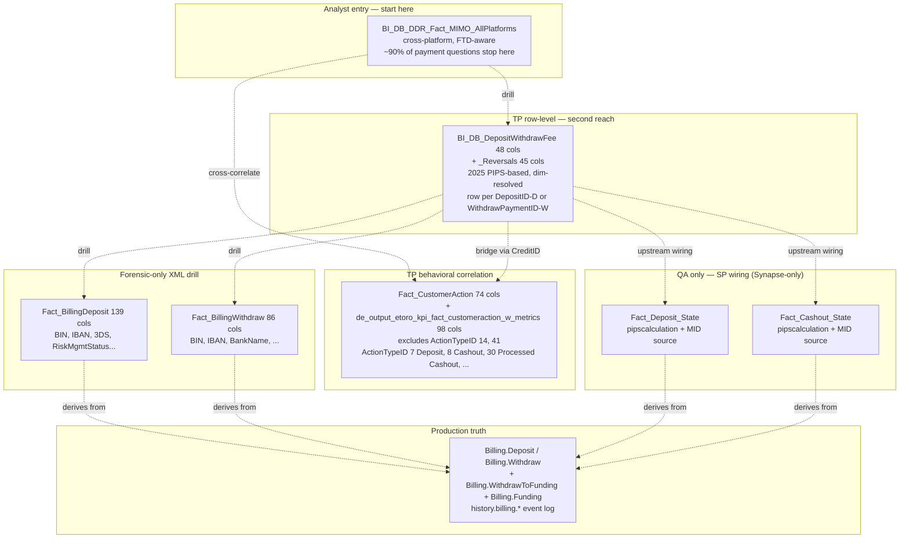

# Trading-Platform Deposits & Withdrawals

This skill is a **ranking + routing** layer for TP fiat payment questions, not a mini-wiki. It tells you WHICH table to reach for first and when to drop down; the column-level detail lives in the per-table wikis (cloned to UC column descriptions) under `knowledge/synapse/Wiki/`.

**Side classification:** broker-side trading-platform money-in / money-out, dim-resolved at the BI layer, sign-corrected, with production-truth conversion fees baked in.

> **Genie / SQL note.** SQL examples below use **Unity Catalog FQNs** so Databricks Genie can run them as-is. Synapse object names that still appear in body prose / mermaid are aliases — see `required_tables:` for the canonical UC FQN. **Four upstream State tables** (`Fact_Deposit_State`, `Fact_Cashout_State`, `Fact_Cashout_Rollback`, `Dim_BillingProtocolMIDSettingsID`) are Synapse-only — queryable only against the Synapse SQL Pool. The QA section below explicitly says when to drop down to them.

## When to Use

Load when the question is about **TP fiat deposits, withdrawals, or cashouts** — row-level forensics, fee composition, decline-rate / 3DS analysis, MID-level breakdowns, deposit-to-trade correlation, or refund / chargeback chains:

- "Show every deposit for customer X in 2026 with fee composition"
- "Daily approved deposit volume by Regulation × MID"
- "What's the decline-by-risk-engine rate this quarter? By MID? By BinCountry?"
- "3DS outcome distribution for declined deposits"
- "First trade after FTD — deposit-to-trade lag per customer"
- "Refund / chargeback aggregation by reversal type"
- "Withdraw rollback investigation for `WithdrawPaymentID = X`"
- "Per-row PIPs (production conversion fee) for a customer's deposits"
- "Recurring-deposit subscriber count by Depot"
- "MID-level approval rate" (BI layer for approved, State table for declines)

Do NOT load for:

- **Cross-platform money flow** (TP + eMoney + EXW unified, FTD machinery applied) → `mimo-panel-and-ddr`. Stop there for ~90% of payment volume / FTD count questions.
- **eMoney IBAN deposits / cards** → `emoney-accounts-and-cards`.
- **Crypto wallet deposits / withdrawals** → `crypto-wallet`.
- **Fee revenue / aggregation** (commission / rollover / dividend / spread / share-lending / dormant / staking / spaceship / moneyfarm fees) → `domain-revenue-and-fees` super-domain. The **deposit fee** / **withdraw fee** / **conversion fee** components in `BI_DB_DepositWithdrawFee.ExchangeFee` + `PIPsCalculation` are in scope here, but the revenue-side aggregation is in Revenue & Fees.
- **Bonuses** (deposit bonus, refer-a-friend, club, marketing campaign) → Compensation regular domain (planned).
- **BackOffice operator-side action audit** (operator-initiated deposits / refunds) → `customer-action-audit-trail` (`Fact_CustomerAction`).
- **Tribe / FiatDwh / Treezor audit envelopes for eMoney** → `domain-cross/tribe-emoney-audit`.
- **Dealing IG / Saxo / Duco EOD broker recon** → `domain-trading` (`dealing-investigation-and-execution`).

## Scope

In scope: `BI_DB_DepositWithdrawFee` (48-col canonical TP analyst view, UNION ALL of approved deposits + withdrawals, dim-resolved + sign-corrected + PIPsCalculation baked in); `BI_DB_DepositWithdrawFee_Reversals` (45 cols, refunds / chargebacks / rollbacks with pre-signed amounts); `Fact_CustomerAction` (74-col TP behavioral master, ActionTypeID 7=Deposit / 8=Cashout / 30=Processed Cashout / 38=Affiliate Deposit / 44=Internal Deposit / etc.) + `de_output_etoro_kpi_fact_customeraction_w_metrics` (98 cols, FCA enriched with the most-used DDR metrics, excludes ActionTypeID 14+41, classifiers like CopyFunds / SQF / TradeFromIBAN); `Fact_BillingDeposit` (139 cols — much larger than older wiki estimates of ~91; full XML-extracted schema with BIN, IBAN, SWIFT, 3DS, RiskManagementStatusID) and `Fact_BillingWithdraw` (86 cols); the four dimension tables (`Dim_FundingType`, `Dim_BillingDepot`, `Dim_PaymentStatus`, `Dim_CashoutStatus`) for upstream joins when not using the BI view; the Synapse-only `Fact_*_State` family + `Dim_BillingProtocolMIDSettingsID` for SP-wiring QA; production OLTP `Billing.Deposit` / `Billing.Withdraw` / `Billing.WithdrawToFunding` / `Billing.Funding` (and `history.billing.*` event log) for last-resort recon.
Out of scope: cross-platform unified flow (`mimo-panel-and-ddr`); eMoney IBAN / cards (`emoney-accounts-and-cards`); crypto wallet (`crypto-wallet`); finance recon / balances (`finance-recon-and-balances`); fee revenue aggregation (`domain-revenue-and-fees`); BackOffice operator action audit (`customer-action-audit-trail`); Treezor / Tribe audit (`domain-cross/tribe-emoney-audit`); dealing broker / LP recon (`domain-trading`).
Last verified: 2026-05-11

## Critical Warnings

1. **Tier 1 — Declines are DROPPED from `BI_DB_DepositWithdrawFee`.** The 2025 RnD PIPS-based pipeline filters to "money-impacting" rows. Decline-rate / 3DS / risk-engine analysis MUST go to `main.dwh.gold_sql_dp_prod_we_dwh_dbo_fact_billingdeposit` (139 cols — only table that retains every attempt, with `PaymentStatusID = 35` for `DeclineByRRE` and full 3DS / `RiskManagementStatusID` fields). For MID-level decline rate, you have to drop down to the Synapse-only `Fact_Deposit_State` because the State carries the per-attempt MID and the BI layer drops the row.
2. **Tier 1 — `Amount` and `AmountUSD` in `BI_DB_DepositWithdrawFee` / `_Reversals` are PRE-SIGNED.** Refunds / chargebacks come back **negative**; chargeback-reversals come back **positive**. Do not `* -1` or `ABS()` unless you explicitly want absolute magnitude. The SP applies the sign correction; your query must respect it. Same applies to `PIPsCalculation`.
3. **Tier 1 — Do NOT reach for `BI_DB_AllDeposits`.** Verified 2026-05-11 against `system.information_schema.tables` — not in UC. The Synapse table is alive (still being written to) but **useless** — entirely superseded by `BI_DB_DepositWithdrawFee`. Do not reach for it for analyst questions, do not include it in mental models, do not suggest it. If you see it referenced in old wiki text or legacy SQL, treat it as legacy and silently substitute `BI_DB_DepositWithdrawFee`.
4. **Tier 2 — Four Synapse-only State tables, NOT in UC.** Verified 2026-05-11 (`system.information_schema.tables` returned zero rows for these patterns):
   - `DWH_dbo.Fact_Deposit_State` — `_Not_Migrated` per `alter.sql`. Carries per-attempt `pipscalculation` + MID. **The only place** to see decline-by-MID at row grain.
   - `DWH_dbo.Fact_Cashout_State` — wiki only; never ingested. SP wiring for cashout state lifecycle.
   - `DWH_dbo.Fact_Cashout_Rollback` — wiki only; never ingested. Cashout rollback event source.
   - `DWH_dbo.Dim_BillingProtocolMIDSettingsID` — wiki only; never ingested. Per-MID protocol routing config.
   
   These tables are for **SP QA only** — when you suspect `BI_DB_DepositWithdrawFee` is wrong and need to debug where the SP went astray. Drop down only in Synapse; never bring them into a Databricks workflow.
5. **Tier 2 — `WithdrawPaymentID` is UNIQUE per row in `Fact_BillingWithdraw` — no dedupe needed.** It's the surrogate key from `Billing.WithdrawToFunding.ID`, unique per payment-execution leg by construction. Distribution is `HASH(WithdrawID)` so multiple legs of the same Withdraw co-locate, but each leg has a distinct `WithdrawPaymentID`. **One Withdraw → N WithdrawToFunding legs is still true; you don't dedupe to find the legs, you SUM them.** Older wiki text saying "dedupe on WithdrawPaymentID" is wrong — ignore it.
6. **Tier 2 — `CreditID` (col 43, LONG) in `BI_DB_DepositWithdrawFee` bridges to `Fact_CustomerAction`.** This is the explicit reconciliation key for "show me the customer-action row for this deposit / withdrawal". Use it for behavioral correlation — first trade after FTD, deposit-to-bonus chain, refund-to-original-deposit lookup.
7. **Tier 2 — `TransactionID` (col 5, STRING) in `BI_DB_DepositWithdrawFee` is SYNTHETIC.** It's built as `CAST(DepositID AS varchar) + 'D'` for deposits and `CAST(WithdrawPaymentID AS varchar) + 'W'` for withdrawals. **Do not try to join on it as a numeric.** The numeric primary keys are `DepositID` (col 41, INT, populated only on deposit rows) and `WithdrawPaymentID` (col 42, INT, populated only on withdraw rows).
8. **Tier 3 — Three columns are dead (always NULL in the modern SP).** `CreditTypeID` (col 4), `MOPCountry` (col 34), `IsGermanBaFin` (col 35). They exist physically (verified 2026-05-11 — present in `information_schema.columns`) but are not populated. Do not filter on them or include them in `WHERE` clauses.
9. **Tier 3 — `IsRecurring`, `IsFTD`, `IsValidCustomer`, `IsIBANTrade`, `IsGermanBaFin` are stored as `INT`, not `BIT`.** Write `WHERE IsRecurring = 1`, never `WHERE IsRecurring` (which is a no-op type-conversion in Databricks SQL).
10. **Tier 3 — `PIPsCalculation` is the production-truth conversion fee** (sourced via the SP from `Fact_Deposit_State.PIPsInUSD` / `Fact_Cashout_State.PIPsInUSD` with sign correction). Do not recompute as `(ExchangeRate − BaseExchangeRate) * Amount` from `Fact_BillingDeposit/Withdraw` — that's the DWH approximation; the prod-truth value is what the BI layer carries.

## The reach order (start at #1, descend only when needed)

| # | Reach for | Why | When to stop here |
|---|---|---|---|
| **0** | `BI_DB_DDR_Fact_MIMO_AllPlatforms` *(see `mimo-panel-and-ddr`)* | Cross-platform unified, dim-resolved, FTD machinery applied. Carries `OrigIdentifier`/`TransactionID` (= the source-platform row ID, including `WithdrawPaymentID` for TP withdrawals). | Question is about volumes, FTDs, deposit/withdraw counts at any aggregate. **~90% of TP payment questions stop here.** |
| **1** | **`BI_DB_DepositWithdrawFee` + `BI_DB_DepositWithdrawFee_Reversals`** | The canonical analyst-facing TP row-level view (48 cols + 45 cols). **Replaces legacy deposit/withdraw logic with the RnD PIPS-based 2025 pipeline.** UNION ALL of deposits + withdrawals, already dim-resolved (`PaymentMethod`, `MIDName`, `MIDValue`, `Depot`, `RegCountry`, `BinCountry`, `Club`, `PlayerStatus`, `CardType`, `CardCategory`, `Regulation`, `GuruStatus`), already sign-corrected, with `PIPsCalculation` baked in. | Question needs row-level TP detail with dim attributes — fee composition, MID-level breakdown, single-customer deposit forensics, refund/chargeback aggregation. **The default TP row table.** |
| **2** | **`Fact_CustomerAction` (74 cols) / `de_output.de_output_etoro_kpi_fact_customeraction_w_metrics` (98 cols)** | TP behavioral master — every position open/close + deposit + cashout + login + bonus + fee tied together. The `_w_metrics` table enriches FCA with the most-used DDR metrics (TP revenues, comp types, classifiers like CopyFunds / SQF / TradeFromIBAN) at the most granular transaction level. **Excludes ActionTypeID 14 + 41** (large + irrelevant) and prunes some columns. Bridges deposits ↔ trades ↔ logins via `CreditID`. | Question correlates a deposit/withdrawal with what the customer DID before/after — first trade after FTD, deposit-to-trade lag, fee event tied to a specific position close, bonus events. |
| **3** | `Fact_BillingDeposit` (139 cols) / `Fact_BillingWithdraw` (86 cols) | Row-level Synapse-derived gold facts with all XML-extracted columns (BIN, IBAN, SWIFT, BankName, 3DS response, `RiskManagementStatusID`, `ThreeDsResponseType`, `PaymentStatusID` including declines). Less convenient (not dim-resolved). | Only when you need a column NOT in `BI_DB_DepositWithdrawFee` — typically: 3DS forensics, BIN/IBAN string detail, `RiskManagementStatusID` drill, declined-attempt analysis (decline rows are dropped from the BI layer per Critical Warning 1). |
| **QA** | `Fact_Deposit_State` / `Fact_Cashout_State` / `Fact_Cashout_Rollback` *(Synapse-only)* | Upstream wiring of the `BI_DB_DepositWithdrawFee` SP. Carries `pipscalculation` and MID at row level — the SP joins them in. | **Don't reach here for analyst questions.** Use only for QA — e.g. "row in DepositWithdrawFee looks wrong, where did the SP go astray". Synapse-only (per Critical Warning 4). |
| **Recon** | `Billing.Deposit` / `Billing.Withdraw` / `Billing.WithdrawToFunding` / `Billing.Funding` *(production OLTP)*, `history.billing.*` *(UC bronze, full state-event log)* | Truth source. Production tables that DWH derives everything from. | Only for production reconciliation, audit, or when you doubt the DWH/BI layer. The full historical event log is in `history.billing.*`. |

**The cardinal rule**: do not "go upstream" for an answer the analyst-facing tables already give you. If MIMO has it, stop at MIMO. If `BI_DB_DepositWithdrawFee` has it, stop there. The State tables and raw billing exist because the BI layer is BUILT from them, not because analysts query them.

## Mental model (right-side-up pyramid)



## Worked example — the `WithdrawPaymentID` lineage

Where does this column live, what does it mean, how do I use it.

| Tier | Table | Column | Notes |
|------|-------|--------|-------|
| **Production** | `Billing.WithdrawToFunding` | `ID` | Surrogate primary key of the withdraw execution leg. One customer withdrawal request → 1 `Billing.Withdraw` row → **N `Billing.WithdrawToFunding` rows** (one per execution leg) → 1 `Billing.Funding` per leg. |
| **DWH analytical** | `main.dwh.gold_sql_dp_prod_we_dwh_dbo_fact_billingwithdraw` | `WithdrawPaymentID` | Renamed from prod `ID` to disambiguate from `WithdrawID` / `FundingID`. **`WithdrawPaymentID` is unique per row — no dedupe needed** (per Critical Warning 5). Distribution is `HASH(WithdrawID)` so multiple legs of the same Withdraw co-locate, but the leg ID itself is the unique row key. |
| **BI analyst-facing** | `main.bi_db.gold_sql_dp_prod_we_bi_db_dbo_bi_db_depositwithdrawfee` | `WithdrawPaymentID` (col 42, INT) — populated only on withdraw rows; NULL on deposit rows. Deposit-side equivalent is `DepositID` (col 41, INT). | The SP already deduped `Fact_BillingWithdraw` before the join, so analysts don't see the multi-row issue here. |
| **Top aggregate (cross-platform)** | `BI_DB_DDR_Fact_MIMO_AllPlatforms` | `OrigIdentifier = 'WithdrawPaymentID'` + `TransactionID = <the value>` | MIMO carries it, just labelled. Use `WHERE OrigIdentifier = 'WithdrawPaymentID' AND TransactionID = @wpid` to find a TP withdrawal in the cross-platform view. |
| **Behavioral correlate** | `main.dwh.gold_sql_dp_prod_we_dwh_dbo_fact_customeraction` | (Not directly — bridges via `CreditID`) | `BI_DB_DepositWithdrawFee.CreditID` (col 43, LONG) ties a withdrawal to its `Fact_CustomerAction` row. ActionTypeID 8 (Cashout) / 30 (Processed Cashout) are the TP withdraw events. |

## Canonical SQL patterns

> SQL below uses **Unity Catalog FQNs** so Databricks Genie can run them as-is. The QA-only example for `Fact_Deposit_State` is shown in **Synapse** form because the table is `_Not_Migrated` and only queryable there.

```sql
-- 1. Withdrawal volume by Regulation x MID — analyst-facing, no JOINs needed for dim resolution (UC)
SELECT Regulation, MIDName, MIDValue, Depot,
       SUM(AmountUSD) AS volume_usd, COUNT(*) AS n
FROM main.bi_db.gold_sql_dp_prod_we_bi_db_dbo_bi_db_depositwithdrawfee
WHERE TransactionType = 'Withdraw'
  AND DateID BETWEEN :from_dt AND :to_dt
GROUP BY Regulation, MIDName, MIDValue, Depot;
```

```sql
-- 2. Single-customer deposit forensics — one table for ~95% of attributes (UC)
SELECT DateID, Occurred, TransactionType, PaymentMethod, Currency,
       Amount, AmountUSD, ExchangeFee, ExchangeFeePercentage, PIPsCalculation,
       MIDName, MIDValue, Depot, RegCountry, BinCountry, CardType, CardCategory,
       ExternalTransactionID, TransactionStatus, PreviousTransactionStatus,
       DepositID, WithdrawPaymentID, CreditID
FROM main.bi_db.gold_sql_dp_prod_we_bi_db_dbo_bi_db_depositwithdrawfee
WHERE CID = :cid
  AND DateID BETWEEN :from_dt AND :to_dt
ORDER BY Occurred;
```

```sql
-- 3. Customer behavior correlation: deposit -> first trade lag (UC; uses FCA, not billing)
WITH first_dep AS (
  SELECT RealCID, MIN(Occurred) AS first_dep_at
  FROM main.dwh.gold_sql_dp_prod_we_dwh_dbo_fact_customeraction
  WHERE ActionTypeID IN (7, 38, 44)              -- Deposit / Affiliate Deposit / Internal Deposit
  GROUP BY RealCID
),
first_trade AS (
  SELECT RealCID, MIN(Occurred) AS first_open_at
  FROM main.dwh.gold_sql_dp_prod_we_dwh_dbo_fact_customeraction
  WHERE ActionTypeID IN (1, 2, 3, 39)            -- position opens
  GROUP BY RealCID
)
SELECT fd.RealCID,
       (UNIX_TIMESTAMP(ft.first_open_at) - UNIX_TIMESTAMP(fd.first_dep_at)) / 60.0
         AS minutes_dep_to_trade
FROM first_dep fd
JOIN first_trade ft USING (RealCID);
```

```sql
-- 4. ONLY when you need an XML-extracted column not in DepositWithdrawFee — UC
-- e.g. 3DS response type or RiskManagementStatusID drill
SELECT *
FROM main.dwh.gold_sql_dp_prod_we_dwh_dbo_fact_billingdeposit
WHERE ModificationDateID BETWEEN :from_dt AND :to_dt
  AND PaymentStatusID = 35                       -- DeclineByRRE
  AND TRY_CAST(ThreeDsResponseType AS INT) IS NOT NULL;
```

```sql
-- 5. QA ONLY: row in DepositWithdrawFee looks wrong — check upstream State table.
-- This runs in SYNAPSE only (Fact_Deposit_State is _Not_Migrated to UC).
SELECT *
FROM DWH_dbo.Fact_Deposit_State fds
WHERE fds.DepositID = @suspect_deposit_id
  AND fds.TransactionType = 'Deposit';
```

```sql
-- 6. Bridge from a specific TP withdrawal to its Fact_CustomerAction row (UC)
SELECT dwf.WithdrawPaymentID, dwf.AmountUSD, dwf.CreditID,
       fca.HistoryID, fca.ActionTypeID, fca.Occurred AS action_occurred
FROM main.bi_db.gold_sql_dp_prod_we_bi_db_dbo_bi_db_depositwithdrawfee dwf
JOIN main.dwh.gold_sql_dp_prod_we_dwh_dbo_fact_customeraction fca
  ON fca.CreditID = dwf.CreditID
WHERE dwf.WithdrawPaymentID = :wpid;
```

## KPI / pattern catalog

| Question | Reach for | Pattern |
|---|---|---|
| Daily approved deposit volume by Regulation | **DepositWithdrawFee** | `WHERE TransactionType='Deposit' GROUP BY DateID, Regulation` |
| Cross-platform FTD count | **MIMO** *(see `mimo-panel-and-ddr`)* | `WHERE IsGlobalFTD=1 AND MIMOAction='Deposit' GROUP BY DateID, MIMOPlatform` |
| TP-only FTD count | **MIMO** *(see `mimo-panel-and-ddr`)* | `WHERE IsPlatformFTD=1 AND MIMOPlatform='TradingPlatform' AND MIMOAction='Deposit'` |
| Single-deposit forensics for one customer | **DepositWithdrawFee** | row-grain query above (SQL 2) |
| Refund / chargeback aggregation | **DepositWithdrawFee_Reversals** | Amounts pre-signed; group by `TransactionType`. For the FORENSIC chain on one specific dispute use `domain-cross/refund-chargeback-chain`. |
| Decline-by-risk-engine rate | **Fact_BillingDeposit** | `COUNT_IF(PaymentStatusID=35) / COUNT(*)`. DepositWithdrawFee drops most declines (Critical Warning 1). |
| MID-level approval rate | **DepositWithdrawFee** for approved; **Fact_Deposit_State** (Synapse) for full coverage incl. declines | `DepositWithdrawFee` carries `MIDName` / `MIDValue` directly for approved rows; for decline-rate by MID drop down to Synapse via the State table. |
| Funding-method mix | **DepositWithdrawFee** | `GROUP BY PaymentMethod` (already dim-resolved as `Dim_FundingType.Name`). |
| Recurring-deposit subscribers | **MIMO** or **Fact_BillingDeposit** | `IsRecurring=1`. MIMO has it cross-platform; Fact_BillingDeposit for TP-only. |
| First trade after FTD (per CID) | **Fact_CustomerAction** | SQL 3 above; or use `domain-cross/recurring-deposit-to-trade`. |
| Per-row PIPs / production conversion fee | **DepositWithdrawFee** (`PIPsCalculation` col 28) | Already plumbed from `Fact_*_State.PIPsInUSD` with sign correction. |
| 3DS outcome, `RiskManagementStatusID` drill | **Fact_BillingDeposit** | XML-extracted columns not in BI layer. |
| Withdraw rollback investigation | **DepositWithdrawFee_Reversals** (UC) for the dim-resolved reversal row; **Fact_Cashout_Rollback** (Synapse-only) for the upstream event | Rollback events × dim-resolved reversal row. From Genie use the `_Reversals` UC table; for upstream provenance run the Synapse query separately. |
| Behavioral correlate of a specific withdraw | **DepositWithdrawFee + Fact_CustomerAction** | Join `CreditID` (col 43, LONG) — SQL 6 above. |

## When to bridge / drill out

| If the question also asks about… | …go to… |
|---|---|
| Cross-platform money flow | `mimo-panel-and-ddr` (C.2) — start there, not here |
| eMoney IBAN deposits | `emoney-accounts-and-cards` — DepositWithdrawFee covers TP only |
| Crypto wallet deposits | `crypto-wallet` |
| Customer balance | `finance-recon-and-balances` |
| **Fee revenue / aggregation** (commission / rollover / dividend / spread / share-lending / dormant / staking / spaceship / moneyfarm) | `domain-revenue-and-fees` super-domain |
| **Bonuses** (deposit bonus, refer-a-friend, club, marketing campaign) | Compensation regular domain (planned) |
| **BackOffice operator action** (operator-initiated deposits / refunds) | `domain-customer-and-identity/customer-action-audit-trail` |
| First trade after first deposit | `domain-cross/recurring-deposit-to-trade` |
| Chargeback case forensics | `domain-cross/refund-chargeback-chain` |
| Provider statement reconciliation | `domain-cross/provider-reconciliation` |
| Treezor / Tribe envelope audit on eMoney withdrawals | `domain-cross/tribe-emoney-audit` |

## Deep reads (column-level detail)

These wikis carry the full column-level truth. The skill above only encodes the ranking — column descriptions and full enums live in the wikis (also cloned to UC column descriptions for direct UC access).

- [`BI_DB_DepositWithdrawFee.md`](https://github.com/guyman-tr/Databricks_Knowledge/blob/master/knowledge/synapse/Wiki/BI_DB_dbo/Tables/BI_DB_DepositWithdrawFee.md) — 48-column dim-resolved view, sign rules, PIPS pipeline.
- [`BI_DB_DepositWithdrawFee_Reversals.md`](https://github.com/guyman-tr/Databricks_Knowledge/blob/master/knowledge/synapse/Wiki/BI_DB_dbo/Tables/BI_DB_DepositWithdrawFee_Reversals.md) — 45-col reversal-type enum, sign-correction map.
- [`Fact_CustomerAction.md`](https://github.com/guyman-tr/Databricks_Knowledge/blob/master/knowledge/synapse/Wiki/DWH_dbo/Tables/Fact_CustomerAction.md) — 74-col full ActionTypeID enum (45 rows in `Dim_ActionType`) + columns × event-type sparsity rules.
- [`Fact_BillingDeposit.md`](https://github.com/guyman-tr/Databricks_Knowledge/blob/master/knowledge/synapse/Wiki/DWH_dbo/Tables/Fact_BillingDeposit.md) — 139-col XML schema, full `PaymentStatusID` enum.
- [`Fact_BillingWithdraw.md`](https://github.com/guyman-tr/Databricks_Knowledge/blob/master/knowledge/synapse/Wiki/DWH_dbo/Tables/Fact_BillingWithdraw.md) — 86-col XML schema, dual status / dual funding-type / dual amount rules.

## Skill provenance

- Anchored on Synapse-side `BI_DB_dbo.BI_DB_DepositWithdrawFee` (RnD PIPS-based 2025 canonical view) + `BI_DB_DepositWithdrawFee_Reversals`, both bronzed to UC.
- Column counts and FQN existence verified 2026-05-11 against `system.information_schema.columns` and `system.information_schema.tables`: BI_DB_DepositWithdrawFee = 48 cols, _Reversals = 45 cols, Fact_BillingDeposit = 139 cols (NOT ~91 as older wiki text claims), Fact_BillingWithdraw = 86 cols, Fact_CustomerAction = 74 cols, de_output_etoro_kpi_fact_customeraction_w_metrics = 98 cols. `Fact_Deposit_State`, `Fact_Cashout_State`, `Fact_Cashout_Rollback`, `Dim_BillingProtocolMIDSettingsID`, `BI_DB_AllDeposits` returned zero rows — confirmed Synapse-only / legacy-dead.
- Intersecting cross-domain skills (loaded together when the question crosses a boundary): `mimo-panel-and-ddr`, `emoney-accounts-and-cards`, `finance-recon-and-balances`, `domain-revenue-and-fees/SKILL`, `domain-cross/refund-chargeback-chain`, `domain-cross/recurring-deposit-to-trade`, `domain-cross/provider-reconciliation`.
