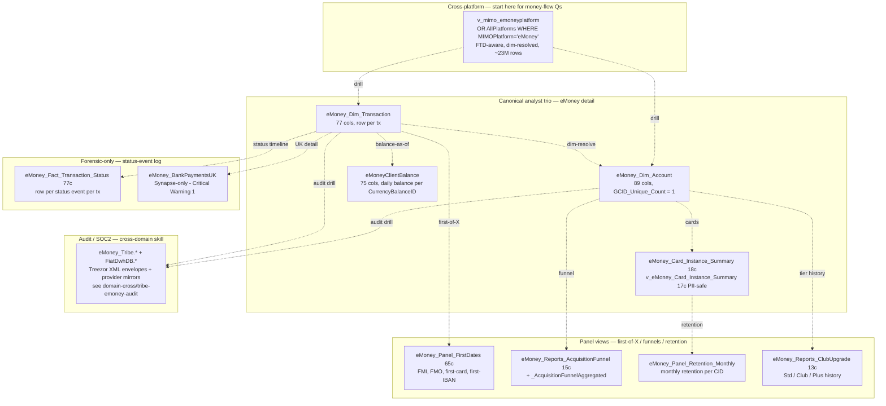

# eMoney Accounts & Cards (IBAN / e-money platform)

This skill is a **ranking + routing** layer for eToro Money questions. eMoney is a **separate platform** from the trading-platform billing layer: its own ledger, its own ID space (`AccountID`, `GCID`, `CurrencyBalanceID`, `GCID_Unique_Count`), its own state machines, its own provider partner (Treezor). It joins back to trading via `CID = RealCID`, but a "deposit" on eMoney is a row in `eMoney_Dim_Transaction`, **not** in `Fact_BillingDeposit`.

**Side classification:** broker-side e-money / IBAN / card platform. Customer-facing fiat-equivalent product distinct from the trading platform.

> **Genie / SQL note.** SQL examples use **Unity Catalog FQNs**. The eMoney MIMO slice (`main.etoro_kpi_prep.v_mimo_emoneyplatform`) is a VIEW over `bi_db.gold_*_bi_db_ddr_fact_mimo_allplatforms`. The Treezor audit envelopes / FiatDwhDB mirrors live in UC bronze under `main.emoney.bronze_fiatdwhdb_*` and `main.bi_db.bronze_fiatdwhdb_*` but are owned by `domain-cross/tribe-emoney-audit` — load that cross-domain skill for SOC2 / operator-audit forensics.

## When to Use

Load when the question is **eMoney-specific** — single-customer eMoney detail, account / card / program / status, FMI/FMO/funnel/retention panels, status forensics:

- "Show every eMoney transaction for CID X this quarter"
- "Daily balance per customer / program as of date Y"
- "Active eMoney customers by AccountProgram / Country / Regulation"
- "FMI (First Money In) / FMO / first-card / first-IBAN per CID"
- "Acquisition funnel cohort tracking — count at each step"
- "Monthly card / account retention curve"
- "Card lifecycle (issue → activate → block → expire) for one CID"
- "IBAN Quick Transfer count" (eMoney-side `MoveMoneyReasonID = 6`)
- "Crypto-to-Fiat into IBAN volume" (`TransactionTypeID = 14`)
- "OpenBanking vs WireTransfer split on incoming external deposits"
- "Why did transaction X fail / when did it post" — status timeline forensics
- "Std → Club → Plus upgrade history per CID"

Do NOT load for:

- **Cross-platform money flow** (TP + eMoney + Crypto + Options unified) → `mimo-panel-and-ddr`. Stop there for ~80% of money-flow questions.
- **Trading-platform fiat deposits / withdrawals** (not eMoney) → `deposits-and-withdrawals`.
- **eMoney FX spread / OpenBanking conversion fee revenue** → `domain-revenue-and-fees` (`v_revenue_conversionfee*`).
- **Crypto came in → converted to EUR/USD on IBAN** (full C2F chain) → `domain-cross/crypto-to-fiat`.
- **Operator / SOC2 audit trail / Treezor / Tribe forensics** → `domain-cross/tribe-emoney-audit`.
- **Chargeback / refund forensics** → `domain-cross/refund-chargeback-chain`.
- **Customer balance across TP + eMoney + crypto + options** → `finance-recon-and-balances`.

## Scope

In scope: the canonical analyst trio (`eMoney_Dim_Account` 89 cols, `eMoney_Dim_Transaction` 77 cols, `eMoneyClientBalance` 75 cols); card layer (`eMoney_Card_Instance_Summary` 18 cols + PII-safe `v_eMoney_Card_Instance_Summary` 17 cols, no MaskedPAN); panel/report family (`eMoney_Panel_FirstDates` 65 cols for FMI/FMO/first-of-X milestones; `eMoney_Reports_AcquisitionFunnel` 15 cols + `_AcquisitionFunnelAggregated`; `eMoney_Panel_Retention_Monthly`; `eMoney_Reports_ClubUpgrade` 13 cols); the status-event log (`eMoney_Fact_Transaction_Status` 77 cols — analyst-OK, unlike its TP cousin `Fact_Deposit_State`); the eMoney MIMO slice (`v_mimo_emoneyplatform`); the OpenBanking detection pattern (External_MoneyTransfer_Billing_Transfers join + TransferStatusID=10); the `eMoney_UserData_Marketing` table for marketing attribution.
Out of scope: cross-platform money flow (`mimo-panel-and-ddr`); TP deposits / withdrawals (`deposits-and-withdrawals`); crypto wallet (`crypto-wallet`); fee revenue composition (`domain-revenue-and-fees`); Treezor / FiatDwhDB audit (`domain-cross/tribe-emoney-audit`); chargeback chain (`domain-cross/refund-chargeback-chain`); C2F end-to-end (`domain-cross/crypto-to-fiat`); customer balance across all platforms (`finance-recon-and-balances`). Synapse-only objects in this cluster (see Critical Warning 1).
Last verified: 2026-05-11

## Critical Warnings

1. **Tier 1 — Several Synapse-only objects are NOT in UC. Verified 2026-05-11** (`system.information_schema.tables` returned zero rows for these in `main.*`):
   - **ALL dictionary tables**: `eMoney_Dictionary_AccountStatus`, `_AccountProgram`, `_AccountSubProgram`, `_CardStatus`, `_TransactionType`, `_TransactionStatus`. In UC you must join on the raw `*ID` column without dim-resolution, or use the embedded denormalized columns on `eMoney_Dim_Account` / `eMoney_Dim_Transaction` (`AccountProgram`, `AccountStatus`, `TransactionTypeName`, `TransactionStatusName`) where they exist.
   - `eMoney_Snapshot_Settled_Balance` — for settled-only EOD, you must filter `eMoneyClientBalance` to settled-only on read (or drop to Synapse).
   - `eMoney_Card_Monthly_Snapshot` — closest UC analog is `eMoney_Panel_Retention_Monthly`; the row schema differs.
   - `eMoney_BankPaymentsUK` — no UC mirror. UK OpenBanking / wire bank-side detail requires Synapse. There is a manual-entries SharePoint workbook landing in UC as `main.sharepoint.silver_sharepoint_emoney_bank_payments_manual_entries` (live; replaces the pre-2026 `bronze_fivetran_google_sheets_emoney_bank_payments_manual_entries` Google-Sheets copy) but it's not the canonical UK feed — only manual exception entries.
   - `eMoney_Account_Mappings` — no UC mirror in `emoney_dbo`. A staging table exists at `main.bi_output_stg.bi_output_emoney_gold_account_mappings` but it's downstream, not the source.
   - `eMoney_Marketing_EmailTracking` — `_Not_Migrated`.
2. **Tier 1 — `GCID_Unique_Count = 1` is mandatory on every join to `eMoney_Dim_Account`.** Multiple GCID-mappings exist for some CIDs; this filter selects the canonical row. Skip it and you double-count. Same logic applies via `da.GCID_Unique_Count = 1` (most patterns) or `da.GCID = X AND da.GCID_Unique_Count = 1` (when keying directly on GCID).
3. **Tier 1 — `eMoneyClientBalance` is the SOURCE OF TRUTH for eMoney balance.** Don't compute from `SUM(Amount)` over `eMoney_Dim_Transaction` — pending vs settled differ, and the dim row's running net is not authoritative. Use `WHERE SnapshotDate = :as_of` for daily balance; for the settled-only cut filter on the appropriate flag in `eMoneyClientBalance` since `eMoney_Snapshot_Settled_Balance` is Synapse-only (Warning 1).
4. **Tier 2 — `CID = RealCID` everywhere on eMoney_dbo.** Joins to `Dim_Customer` use `dc.RealCID = dt.CID` (NOT `dc.GCID = dt.GCID`, even though both exist — the `CID = RealCID` is the canonical join for transaction-level slicing).
5. **Tier 2 — `IsValidETM = 1` to filter to "real" eMoney customers.** Without this you pick up partial onboardings, deleted / archived accounts, test rows. Apply on `eMoney_Dim_Account` before any aggregate.
6. **Tier 2 — Use `RegulationIDTxDate` / `CountryIDTxDate`** (snapshot at transaction time) for transaction-level slicing — NOT the current `RegulationID` / `CountryID` from `eMoney_Dim_Account`. A customer can change regulation; transactions are stamped at the time they happened.
7. **Tier 2 — For "real" external money flow, filter `IsInternalTransfer = 0`. Do NOT filter `IsIBANQuickTransfer` — the column is a misnomer.** Both flags are TP-side flags on the MIMO panel (they never fire on eMoney rows), so to scope eMoney external flow on the MIMO panel you exclude TP-side internal-move rows via `IsInternalTransfer = 0` and that's it. `IsIBANQuickTransfer` is derived from `MoveMoneyReasonID = 6` on `Fact_CustomerAction`, but that reason code also fires on Options deposits with `FundingTypeID = 42` (which has nothing to do with IBAN), so the column mixes two unrelated populations under an IBAN-flavored name. The canonical DDR layer ignores it. See `mimo-panel-and-ddr` Critical Warning 2 for the verified cross-tab and the misnomer breakdown.
8. **Tier 3 — Card PII**: `eMoney_Card_Instance_Summary` (18 cols) exposes `MaskedPAN`. Use **`v_eMoney_Card_Instance_Summary`** (17 cols, MaskedPAN removed) for analytics. Marketing tables (`eMoney_Marketing_EmailTracking` Synapse-only, `eMoney_UserData_Marketing` UC) are likewise PII-heavy.
9. **Tier 3 — `eMoney_Fact_Transaction_Status` IS the right place for status forensics.** Unlike its TP cousin `Fact_Deposit_State` (Synapse-only, QA-only), the eMoney status fact is genuinely a state-event log queryable by analysts. Query it directly for "why did it fail" / "when did it post" / SLA latency between events.
10. **Tier 3 — No `BI_DB_*` rollup exists for eMoney.** Don't go looking for an `BI_DB_eMoneyDepositWithdrawFee`-style canonical view — it doesn't exist. The dim trio IS the analyst layer; the cross-platform rollup is `BI_DB_DDR_Fact_MIMO_AllPlatforms` (eMoney slice via `v_mimo_emoneyplatform`).
11. **Tier 3 — OpenBanking detection requires a JOIN.** The dim row alone doesn't say OpenBanking. The downstream Tableau / KPI logic is: `(IsInternalTransfer=0 AND IsIBANTrade=0 AND EXISTS row in External_MoneyTransfer_Billing_Transfers WITH TransferStatusID=10) THEN 'OpenBanking' ELSE 'WireTransfer'`. For analyst-grade question accept the `Dim_FundingType.Name` value; for OpenBanking-specific accuracy do the join.

## The reach order (start at #1, descend only when needed)

| # | Reach for | Why | When to stop here |
|---|---|---|---|
| **0** | `BI_DB_DDR_Fact_MIMO_eMoney_Platform` *(via `v_mimo_emoneyplatform`)* — or `BI_DB_DDR_Fact_MIMO_AllPlatforms WHERE MIMOPlatform='eMoney'` | The eMoney slice of the cross-platform panel. Already FTD-aware, dim-resolved, sign-corrected. Carries the eMoney action types as `MIMOAction` values, with `OrigIdentifier`/`TransactionID` pointing back to the source `eMoney_Dim_Transaction` row. | Question is about volumes / FTDs / counts at any aggregate, including eMoney IBAN inflows / outflows, OpenBanking deposits, internal-transfer share. **~80% of eMoney money-flow questions stop here.** |
| **1** | **`eMoney_Dim_Transaction` (77c) + `eMoney_Dim_Account` (89c) + `eMoneyClientBalance` (75c)** | The canonical analyst trio. eMoney has NO `BI_DB_*` analyst-facing rollup like TP's `BI_DB_DepositWithdrawFee`; the dim tables ARE the analyst entry. `Dim_Transaction` is row-per-transaction; `Dim_Account` (filter `GCID_Unique_Count = 1`) is the account hub; `eMoneyClientBalance` is the daily balance per `CurrencyBalanceID`. | Question needs row-level eMoney detail with dim attributes — single-customer transaction forensics, AccountProgram-level breakdown, balance-as-of-date, IBAN-vs-card mix. **The default eMoney row table.** |
| **2** | **Panel views** — `eMoney_Panel_FirstDates` (65c), `eMoney_Reports_AcquisitionFunnel` (15c) + `_AcquisitionFunnelAggregated`, `eMoney_Panel_Retention_Monthly`, `eMoney_Reports_ClubUpgrade` (13c) | Pre-aggregated panels for the recurring eMoney KPIs: FMI / FMO / first-card / first-IBAN milestones, acquisition-funnel cohort tracking, monthly retention, Club upgrade history. | Question is "first-X" / funnel / retention. Don't recompute — the panels apply the right exclusions and timezone normalisations. |
| **3** | **`eMoney_Fact_Transaction_Status`** (77c) | True state-event log — one row per status transition per transaction. Unlike its TP cousin (`Fact_Deposit_State`), this IS the right place for analyst-facing "why did this transaction fail" / "when did it post" forensics — it's the eMoney status timeline. | Per-transaction status forensics, dispute investigation, latency analysis between status events. |
| **4** | `eMoney_BankPaymentsUK` *(Synapse-only — Critical Warning 1)* | UK-specific OpenBanking + domestic wire feed. Its rows feed `eMoney_Dim_Transaction` but carry UK-bank-specific columns (sort code, payee bank). | UK-only OpenBanking / wire forensics where you need bank-side detail not in `eMoney_Dim_Transaction`. **Synapse only.** |
| **Audit** | `eMoney_Tribe.*` / `FiatDwhDB.*` *(UC bronze)* | Treezor audit envelopes + provider-side fiat mirrors. Rich SOC2 detail. | **Don't reach here from this skill.** Load `domain-cross/tribe-emoney-audit.md` instead — it owns the audit-trail map and provides the join keys. |
| **Recon** | `bi_db.gold_sql_dp_prod_we_emoney_dbo_fiataccount` *(UC bronze)* / production OLTP | Truth source. | Only when reconciling against production OLTP. Almost never needed — Treezor cross-domain skill is the better recon target. |

**The cardinal rule**: eMoney questions about money flow start at MIMO; questions about account / customer / card detail start at the dim trio; first-of-X questions go to `eMoney_Panel_FirstDates`. Don't cascade through status events for a question that didn't ask "why did this fail."

## Mental model (right-side-up pyramid)



## Canonical SQL patterns

```sql
-- 1. Single-customer eMoney 360 (Tier 1) — UC, deduped via GCID_Unique_Count=1
SELECT dt.TxDateID, dt.TransactionID, dt.Amount, dt.Currency,
       dt.TransactionTypeID, dt.TransactionStatusID,
       da.AccountProgram, da.AccountSubProgram, da.AccountStatus,
       dt.IsCryptoToFiat, dt.IsIBANQuickTransfer, dt.IsInternalTransfer
FROM main.bi_db.gold_sql_dp_prod_we_emoney_dbo_emoney_dim_transaction dt
JOIN main.bi_db.gold_sql_dp_prod_we_emoney_dbo_emoney_dim_account     da
       ON da.CID = dt.CID
      AND da.GCID_Unique_Count = 1                       -- mandatory dedup
JOIN main.dwh.gold_sql_dp_prod_we_dwh_dbo_dim_regulation dr  ON dr.DWHRegulationID = dt.RegulationIDTxDate
JOIN main.dwh.gold_sql_dp_prod_we_dwh_dbo_dim_country    dco ON dco.CountryID      = dt.CountryIDTxDate
WHERE dt.CID = :cid
  AND dt.TxDateID BETWEEN :from_dt AND :to_dt
ORDER BY dt.TxDateID;
```

```sql
-- 2. Daily balance per customer (canonical eMoney balance, not derived) — UC
SELECT cb.SnapshotDate, cb.CurrencyBalanceID, cb.Balance,
       da.CID, da.AccountProgram, da.AccountStatus, da.Currency
FROM main.bi_db.gold_sql_dp_prod_we_emoney_dbo_emoneyclientbalance cb
JOIN main.bi_db.gold_sql_dp_prod_we_emoney_dbo_emoney_dim_account  da
       ON da.CurrencyBalanceID = cb.CurrencyBalanceID
      AND da.GCID_Unique_Count = 1
WHERE cb.SnapshotDate = :as_of
  AND da.IsValidETM   = 1;
```

```sql
-- 3. Acquisition funnel + first-date panel (Tier 2 — single CID 360) — UC
SELECT af.*, fd.FMI_Date, fd.FMO_Date, fd.FirstCardUseDate, fd.FirstIBANDepositDate,
       da.AccountProgram, da.AccountStatus
FROM main.bi_db.gold_sql_dp_prod_we_emoney_dbo_emoney_reports_acquisitionfunnel af
LEFT JOIN main.bi_db.gold_sql_dp_prod_we_emoney_dbo_emoney_panel_firstdates    fd
       ON fd.CID = af.CID
LEFT JOIN main.bi_db.gold_sql_dp_prod_we_emoney_dbo_emoney_dim_account         da
       ON da.GCID = af.GCID AND da.GCID_Unique_Count = 1
WHERE af.CID = :cid;
```

```sql
-- 4. "Why did transaction X fail" — Tier 3 status timeline — UC
SELECT *
FROM main.bi_db.gold_sql_dp_prod_we_emoney_dbo_emoney_fact_transaction_status
WHERE TransactionID = :tx
ORDER BY EventDate;
```

```sql
-- 5. eMoney FTD count cross-platform-aware (TP-side FTD machinery applied) — UC
-- Note: IsInternalTransfer / IsIBANQuickTransfer fire only on TP rows in the MIMO panel,
-- never on eMoney rows — so when MIMOPlatform='eMoney' those filters are no-ops.
-- They're omitted here for clarity. The DDR layer canonically only uses IsInternalTransfer
-- anyway; IsIBANQuickTransfer is a misnomer column (see mimo-panel-and-ddr Critical Warning #2).
SELECT m.DateID,
       COUNT(DISTINCT m.RealCID) AS emoney_ftd_unique_cids
FROM main.bi_db.gold_sql_dp_prod_we_bi_db_dbo_bi_db_ddr_fact_mimo_allplatforms m
WHERE m.MIMOPlatform = 'eMoney'
  AND m.MIMOAction   = 'Deposit'
  AND m.IsPlatformFTD = 1
  AND m.DateID BETWEEN :from_dt AND :to_dt
GROUP BY m.DateID;
```

```sql
-- 6. OpenBanking vs WireTransfer split (per Critical Warning 11) — UC
WITH ob AS (
  SELECT TransactionID
  FROM main.bi_db.gold_sql_dp_prod_we_bi_db_dbo_external_moneytransfer_billing_transfers
  WHERE TransferStatusID = 10
)
SELECT dt.TxDateID,
       CASE WHEN dt.IsInternalTransfer = 0 AND dt.IsIBANTrade = 0 AND ob.TransactionID IS NOT NULL
            THEN 'OpenBanking' ELSE 'WireTransfer' END AS deposit_channel,
       SUM(dt.Amount) AS deposit_amount
FROM main.bi_db.gold_sql_dp_prod_we_emoney_dbo_emoney_dim_transaction dt
LEFT JOIN ob ON ob.TransactionID = dt.TransactionID
WHERE dt.TxDateID BETWEEN :from_dt AND :to_dt
  AND dt.TransactionTypeID IN (/* external-deposit types */)
GROUP BY dt.TxDateID, deposit_channel;
```

## KPI / pattern catalog

| Question | Reach for | Pattern |
|---|---|---|
| Cross-platform IBAN inflow / outflow volume | **MIMO** (see `mimo-panel-and-ddr`) | `WHERE MIMOPlatform='eMoney' AND MIMOAction IN ('Deposit','Withdraw') GROUP BY DateID, MIMOAction` |
| eMoney FTD count | **MIMO** | `WHERE MIMOPlatform='eMoney' AND IsPlatformFTD=1 GROUP BY DateID` (SQL 5 above). On the MIMO panel, `IsInternalTransfer` / `IsIBANQuickTransfer` only fire on TP rows, so `MIMOPlatform='eMoney'` already excludes them — extra filters are no-ops. |
| Single-customer eMoney transactions | **`eMoney_Dim_Transaction`** | SQL 1 above; dedupe `Dim_Account` on `GCID_Unique_Count=1`. |
| Daily balance per customer / program | **`eMoneyClientBalance`** | Snapshot table — never recompute from `SUM(Amount)` (Critical Warning 3). |
| Settled-only balance | **`eMoneyClientBalance`** filtered (or Synapse `_Snapshot_Settled_Balance`) | Excludes pending; the canonical UC table is `eMoneyClientBalance` since `_Snapshot_Settled_Balance` is Synapse-only (Critical Warning 1). |
| Active eMoney customers | **`eMoney_Dim_Account`** | `WHERE IsValidETM=1 AND AccountStatus='Active' GROUP BY AccountProgram`. |
| eMoney FMI / FMO / first card / first IBAN | **`eMoney_Panel_FirstDates`** | One row per CID; don't derive from `MIN(TxDate)` — exclusions baked in. |
| Acquisition funnel cohort tracking | **`eMoney_Reports_AcquisitionFunnel`** (+ aggregated) | One row per CID per funnel step. |
| Monthly retention | **`eMoney_Panel_Retention_Monthly`** | Pre-aggregated (the UC analog of the Synapse `_Card_Monthly_Snapshot`). |
| Std → Club → Plus upgrade chain per CID | **`eMoney_Reports_ClubUpgrade`** | Ordered by upgrade date. |
| Card lifecycle (issue → activate → block → expire) | **`v_eMoney_Card_Instance_Summary`** | Row per card instance per CID; **use the `v_*` variant to avoid `MaskedPAN` PII** (Critical Warning 8). |
| IBAN Quick Transfer count (with caveat) | **`eMoney_Dim_Transaction`** | `WHERE IsIBANQuickTransfer = 1` (= `MoveMoneyReasonID = 6`). **Caveat:** the column is a misnomer — `MoveMoneyReasonID = 6` also fires on Options deposits (`FundingTypeID = 42`), so this filter is *not* a clean "IBAN quick transfer" predicate. For a true IBAN-quick filter, also require `FundingTypeID <> 42` (or join to the funding-type dim and exclude Options funding types). See `mimo-panel-and-ddr` Critical Warning #2. |
| Crypto-to-Fiat into IBAN | **`eMoney_Dim_Transaction`** | `WHERE TransactionTypeID = 14` (= `IsCryptoToFiat = 1`). For full E2E flow → `domain-cross/crypto-to-fiat`. |
| OpenBanking deposit detection | **`eMoney_Dim_Transaction` + `External_MoneyTransfer_Billing_Transfers`** | SQL 6 above (Critical Warning 11). |
| UK bank-side detail (sort code, payee bank) | **`eMoney_BankPaymentsUK`** (Synapse-only) | UK-only; other regions don't have an equivalent. |
| Status timeline / failure forensics | **`eMoney_Fact_Transaction_Status`** | One row per status event; pivot for SLA analysis. |
| FX spread / OpenBanking conversion fee revenue | **`domain-revenue-and-fees`** | `v_revenue_conversionfee*` — leave this skill. |
| Operator audit trail / SOC2 | **`domain-cross/tribe-emoney-audit`** | This skill supplies the join keys; the cross-domain skill owns the Tribe map. |

## When to bridge / drill out

| If the question also asks about… | …go to… |
|---|---|
| Cross-platform money flow (TP + eMoney + Crypto + Options) | `mimo-panel-and-ddr` |
| Trading-platform fiat deposits / withdrawals (NOT eMoney) | `deposits-and-withdrawals` |
| Customer balance ALSO from trading + crypto + options | `finance-recon-and-balances` |
| **eMoney FX spread / OpenBanking conversion fee revenue** | `domain-revenue-and-fees` (`v_revenue_conversionfee*`) |
| Crypto came in → converted to EUR/USD on IBAN | `domain-cross/crypto-to-fiat` |
| **Operator / SOC2 audit trail / Tribe forensics** | `domain-cross/tribe-emoney-audit` — owns the Tribe / FiatDwhDB map. This skill supplies the join keys (`AccountID`, `GCID`, `TransactionID`, `CardID`). |
| Chargeback / refund forensics | `domain-cross/refund-chargeback-chain` |
| Customer-side identity (RealCID ↔ GCID ↔ MasterAccountCID) | `domain-customer-and-identity/customer-master-record` + super-domain SKILL.md for the cross-platform identity bridge |

## Deep reads (column-level detail)

The skill above only encodes ranking + routing. Column-level descriptions and full enums live in the wikis (also cloned to UC column descriptions where the bronze ingestion preserved them).

- [`eMoney_Dim_Account.md`](https://github.com/guyman-tr/Databricks_Knowledge/blob/master/knowledge/synapse/Wiki/eMoney_dbo/Tables/eMoney_Dim_Account.md) — 89-col schema, GCID_Unique_Count dedupe, AccountProgram / AccountSubProgram enum.
- [`eMoney_Dim_Transaction.md`](https://github.com/guyman-tr/Databricks_Knowledge/blob/master/knowledge/synapse/Wiki/eMoney_dbo/Tables/eMoney_Dim_Transaction.md) — 77-col schema, RegulationIDTxDate snapshot rule.
- [`eMoney_Fact_Transaction_Status.md`](https://github.com/guyman-tr/Databricks_Knowledge/blob/master/knowledge/synapse/Wiki/eMoney_dbo/Tables/eMoney_Fact_Transaction_Status.md) — 77-col status-event log.
- [`eMoneyClientBalance.md`](https://github.com/guyman-tr/Databricks_Knowledge/blob/master/knowledge/synapse/Wiki/eMoney_dbo/Tables/eMoneyClientBalance.md) — 75-col daily balance per `CurrencyBalanceID`.
- [`eMoney_Panel_FirstDates.md`](https://github.com/guyman-tr/Databricks_Knowledge/blob/master/knowledge/synapse/Wiki/eMoney_dbo/Tables/eMoney_Panel_FirstDates.md) — 65-col FMI/FMO/first-of-X panel.
- [`eMoney_Reports_AcquisitionFunnel.md`](https://github.com/guyman-tr/Databricks_Knowledge/blob/master/knowledge/synapse/Wiki/eMoney_dbo/Tables/eMoney_Reports_AcquisitionFunnel.md) — 15-col funnel-step panel.
- [`eMoney_Card_Instance_Summary.md`](https://github.com/guyman-tr/Databricks_Knowledge/blob/master/knowledge/synapse/Wiki/eMoney_dbo/Tables/eMoney_Card_Instance_Summary.md) / [`v_eMoney_Card_Instance_Summary.md`](https://github.com/guyman-tr/Databricks_Knowledge/blob/master/knowledge/synapse/Wiki/eMoney_dbo/Tables/v_eMoney_Card_Instance_Summary.md).
- [`eMoney_BankPaymentsUK.md`](https://github.com/guyman-tr/Databricks_Knowledge/blob/master/knowledge/synapse/Wiki/eMoney_dbo/Tables/eMoney_BankPaymentsUK.md) — Synapse-only.

## Skill provenance

- Cluster 17 from the Louvain partition (61 members, intra-cluster weight 266.0). Schema mix: `eMoney_dbo:30, dbo:8, Dictionary:7, BI_DB_dbo:6`.
- Column counts verified 2026-05-11 against `system.information_schema.columns`: Dim_Account 89, Dim_Transaction 77, eMoneyClientBalance 75, Card_Instance_Summary 18 / v_ variant 17, Fact_Transaction_Status 77, Panel_FirstDates 65, Reports_AcquisitionFunnel 15, Reports_ClubUpgrade 13.
- UC existence verified 2026-05-11: ALL six `eMoney_Dictionary_*` tables, `eMoney_Snapshot_Settled_Balance`, `eMoney_BankPaymentsUK`, `eMoney_Card_Monthly_Snapshot`, `eMoney_Account_Mappings`, `eMoney_Marketing_EmailTracking` returned ZERO rows from `system.information_schema.tables` — they are Synapse-only. The closest UC analog for monthly retention is `eMoney_Panel_Retention_Monthly`.
- Top out-cluster cross-domain edges: `Dim_Customer` (30.5), `Dim_Country` (11.0), `BI_DB_DDR_Fact_MIMO_eMoney_Platform` (10.0), `Fact_SnapshotCustomer` (8.5).
- Intersecting skills: `deposits-and-withdrawals`, `mimo-panel-and-ddr`, `finance-recon-and-balances`, `domain-revenue-and-fees/SKILL`, `domain-cross/crypto-to-fiat`, `domain-cross/refund-chargeback-chain`, `domain-cross/tribe-emoney-audit`.
