# C.5 — Finance Recon & Balances

This skill is a **ranking + routing** layer for the canonical
"what is this customer's balance right now" question and the Finance
team's external-partner reconciliation work. Owned by the Finance
team (`ido ezra` Genie space covers 9/10 of these tables).

Unlike C.1–C.4 which start at the cross-platform MIMO panel, this skill
**starts at `EXW_dbo.EXW_FinanceReportsBalancesNew`** *(UC:
`main.bi_db.gold_sql_dp_prod_we_exw_dbo_exw_financereportsbalancesnew`)* —
there is no panel *above* it; this IS the cross-platform answer for balances.
MIMO counts money flow events, this counts owed-to-customer state.

> **Genie / SQL note:** SQL examples below use UC FQNs. Synapse names that
> still appear in body prose are aliases — see `primary_objects:` for the
> UC FQN. Two recon tables (`EXW_30DayBalanceExtract`, `EXW_AML_Users_Report`)
> are `_Not_Migrated` and are listed in `synapse_only_objects:` — those are
> queryable in Synapse only.

## The reach order (start at #1, descend only when needed)

| # | Reach for | Why | When to stop here |
|---|---|---|---|
| **0** | **`EXW_dbo.EXW_FinanceReportsBalancesNew`** | THE canonical per-customer balance table. Cross-platform aggregation already done — pending vs settled, multi-currency FX, Trading + eMoney + Crypto + Options all baked in. Consumed directly by the `ido ezra` Genie space. | "What does eToro owe customer X right now / on date D" — almost any balance question. **Don't sum across platforms yourself.** |
| **1** | **`etoro_kpi_prep.v_population_*`** view family | Canonical population definitions (funded / first-time-funded / active-traders / balance-only / portfolio-only). Each view encodes the right exclusions (incl. `REMOVE_BAD_FTDS`) and joins multi-platform balance + activity. | "Who is funded / who is active / who has only cash / who has only positions" — population segmentation questions. **Reuse, never redefine.** |
| **2** | Per-platform balance feeds — `BI_DB_Client_Balance_CID_Level_New` (TP), `eMoneyClientBalance` *(C.3)*, `EXW_WalletInventory` *(C.4)*, Apex Options feeds | When you need to know *what each platform contributes* to the canonical balance — TP balance per CID per day, eMoney IBAN balance, crypto holdings, Apex US Options BuyingPower. | "Show me the per-platform breakdown" / "the TP balance trend" / "the Options-only AUM". |
| **3** | UC-deployed Finance feeds — `EXW_UserSettingsWalletAllowance` (UC: `bi_db.gold_*_exw_dbo_exw_usersettingswalletallowance`), `bi_output_finance_tables_bi_db_positions_*_iban`, `bi_output_finance_tables_ptp_tax`, `bronze_sodreconciliation_apex_*`, `bronze_usabroker_apex_options` | Finance-output reports for narrow needs: wallet allowance gating, IBAN ↔ position lifecycle, PTP tax accounting, Apex SOD reconciliation. | Question is specifically about one of those topics. |
| **3-QA** | Synapse-only QA feeds — `EXW_30DayBalanceExtract`, `EXW_AML_Users_Report` *(both `_Not_Migrated`)* | 30-day balance trend and AML-flagged-users overlay. **Not in UC** — Genie cannot query these. | Use only when running QA against Synapse directly. From Databricks, derive the 30-day trend by self-joining `EXW_FinanceReportsBalancesNew` over the date range; for AML, query the Compliance super-domain instead. |
| **Behavior** | `de_output.de_output_etoro_kpi_fact_customeraction_w_metrics` (TP behavioral master, see C.1) | When the funded/active/portfolio question needs to bridge to *what the customer DID* (positions, deposits, fees) — this is the TP-side correlator, not Finance's primary table. | Cohort behavior overlays on top of population segmentation. |
| **Recon** | `Wallet.FinanceReportRecords` *(production OLTP)* | Truth source. Heavy table; the DWH copy is what the Finance recon view is built from. | Only when reconciling against the production OLTP; almost never needed. |

**The cardinal rule**: balance questions start at `EXW_FinanceReportsBalancesNew`. Population questions start at the `v_population_*` family. Per-platform breakdowns drop to Tier 2. Don't UNION balance feeds yourself.

## Mental model (right-side-up pyramid)

```mermaid
graph TB
    subgraph T0["Canonical balance — start here"]
        FRB[EXW_FinanceReportsBalancesNew<br/>per-customer cross-platform balance<br/>SOURCE OF TRUTH]
    end

    subgraph T1["Population segmentation — etoro_kpi_prep.v_population_*"]
        P1[v_population_first_time_funded<br/>cross-platform FTD universe, REMOVE_BAD_FTDS applied]
        P2[v_population_funded<br/>currently non-zero balance]
        P3[v_population_active_traders<br/>active in trading window]
        P4[v_population_balance_only_accounts<br/>cash, no positions]
        P5[v_population_portfolio_only<br/>positions, no free cash]
        OAUM[v_options_aum<br/>Options AUM per user per day]
    end

    subgraph T2["Per-platform feeds (drill down)"]
        TP[BI_DB_Client_Balance_CID_Level_New<br/>TP daily balance per CID]
        EM[eMoneyClientBalance<br/>see C.3]
        EXW[EXW_WalletInventory<br/>see C.4]
        ApexBP[bronze_sodreconciliation_apex_ext981_buypowersummary]
        ApexCash[bronze_sodreconciliation_apex_ext869_cashactivity]
        ApexOpt[bronze_usabroker_apex_options]
    end

    subgraph T3["Specialised Finance reports (UC-deployed)"]
        Wa["EXW_UserSettingsWalletAllowance<br/>UC: bi_db.gold_*_exw_dbo_exw_usersettingswalletallowance"]
        IBANop["bi_output_finance_tables_bi_db_positions_opened_from_iban"]
        IBANcl["bi_output_finance_tables_bi_db_positions_closed_to_iban"]
        PTP["bi_output_finance_tables_ptp_tax<br/>tax_ptp_monitoring"]
    end

    subgraph T3QA["Synapse-only QA (NOT in UC)"]
        Trend["EXW_30DayBalanceExtract<br/>(_Not_Migrated)"]
        Aml["EXW_AML_Users_Report<br/>(_Not_Migrated)"]
    end

    subgraph Behav["Behavior link (TP-side)"]
        FCAm[de_output.de_output_etoro_kpi_fact_customeraction_w_metrics]
    end

    subgraph Recon["Production OLTP truth"]
        FRR[Wallet.FinanceReportRecords]
    end

    subgraph Genie["Curated workspace"]
        IES[ido ezra Genie space<br/>9/10 tables here]
    end

    TP -.feeds.-> FRB
    EM -.feeds.-> FRB
    EXW -.feeds.-> FRB
    ApexBP -.feeds.-> FRB
    ApexCash -.feeds.-> FRB
    ApexOpt -.feeds.-> FRB
    FRR -.feeds.-> FRB

    FRB --> P1 & P2 & P3 & P4 & P5 & OAUM
    FRB --> Trend & Aml & Wa & IBANop & IBANcl & PTP
    P3 -.bridges to.-> FCAm
    FRB -.consumed by.-> IES
```



## Apex — same broker as Options (= USABroker)

The Apex tables in this skill (`bronze_sodreconciliation_apex_*`,
`bronze_usabroker_apex_options`) are reconciliation feeds from **the same
Apex broker that clears Options for the Gatsby product line and US-resident
customer equities**. Apex = **USABroker**.

- For finance reconciliation use, Apex tables here track the broker-side
  cash + buying-power + holdings position.
- The associated **revenue events** (commissions, options fees) live in
  Revenue & Fees (`v_revenue_optionsplatform`, `BI_DB_US_Apex_Fees_Charge`).
- US-resident customer **equity trading** through Apex lives in regular
  trading tables (`Dim_Position`, `Fact_Position`), not here.
- See `domain-revenue-and-fees/SKILL.md` "Apex / Gatsby disambiguation" for the
  full picture.

## Canonical joins

> SQL below uses **Unity Catalog FQNs** so Databricks Genie can run them as-is.
> `EXW_AML_Users_Report` is NOT in UC; it is intentionally omitted from the
> canonical join. Use the Compliance super-domain for AML overlays.

```sql
-- Canonical customer balance per Finance (single GCID, current snapshot) — UC
SELECT *
FROM      main.bi_db.gold_sql_dp_prod_we_exw_dbo_exw_financereportsbalancesnew frb
JOIN      main.bi_db.gold_sql_dp_prod_we_exw_dbo_exw_dimuser                   du
       ON du.GCID = frb.GCID
LEFT JOIN main.bi_db.gold_sql_dp_prod_we_exw_dbo_exw_usersettingswalletallowance ua
       ON ua.GCID = frb.GCID
WHERE frb.GCID       = :gcid
  AND frb.ReportDate = :as_of
```

```sql
-- Funded population on a date (Tier 1 — reuse, don't redefine)
SELECT *
FROM main.etoro_kpi_prep.v_population_funded
WHERE SnapshotDate = :as_of
```

```sql
-- TP-side balance per CID per day (drill from canonical to per-platform) — UC
SELECT *
FROM main.bi_db.gold_sql_dp_prod_we_bi_db_dbo_bi_db_client_balance_cid_level_new cb
WHERE cb.SnapshotDate = :as_of
  AND cb.CID          = :cid
```

```sql
-- IBAN ↔ position lifecycle (Finance-output, NOT a generic position table) — UC
SELECT * FROM main.bi_output.bi_output_finance_tables_bi_db_positions_opened_from_iban
WHERE OpenDateID BETWEEN :from_dt AND :to_dt
UNION ALL
SELECT * FROM main.bi_output.bi_output_finance_tables_bi_db_positions_closed_to_iban
WHERE CloseDateID BETWEEN :from_dt AND :to_dt
```

```sql
-- Apex Options recon: cash activity vs BuyingPower vs portfolio (SOD = start-of-day) — UC
SELECT *
FROM      main.finance.bronze_sodreconciliation_apex_ext869_cashactivity   ca
LEFT JOIN main.general.bronze_sodreconciliation_apex_ext981_buypowersummary bp
       ON bp.AccountId = ca.AccountId AND bp.ReportDate = ca.ReportDate
LEFT JOIN main.general.bronze_usabroker_apex_options                        opt
       ON opt.AccountId = ca.AccountId AND opt.ReportDate = ca.ReportDate
WHERE ca.ReportDate = :as_of
```

```sql
-- Active-trader cohort overlay with TP behavioral context — UC
SELECT pa.*, fcam.PositionRevenueUSD, fcam.IsCopyFunds, fcam.IsTradeFromIBAN
FROM main.etoro_kpi_prep.v_population_active_traders                          pa
JOIN main.de_output.de_output_etoro_kpi_fact_customeraction_w_metrics         fcam
       ON fcam.CID = pa.CID
WHERE pa.SnapshotDate = :as_of
  AND fcam.DateID BETWEEN :from_dt AND :to_dt
```

```sql
-- 30-day balance trend — UC replacement for the _Not_Migrated EXW_30DayBalanceExtract
-- (compute on the fly from the canonical balance table)
SELECT frb.GCID, frb.ReportDate, frb.TotalBalanceUSD
FROM main.bi_db.gold_sql_dp_prod_we_exw_dbo_exw_financereportsbalancesnew frb
WHERE frb.GCID       = :gcid
  AND frb.ReportDate BETWEEN date_sub(:as_of, 30) AND :as_of
ORDER BY frb.ReportDate
```

## KPI / pattern catalog

| Question | Reach for | Pattern |
|---|---|---|
| Customer canonical balance right now | **`EXW_FinanceReportsBalancesNew`** | Filter latest `ReportDate` per `GCID`. Don't sum across platforms yourself. |
| Funded population on date X | **`v_population_funded`** | `WHERE SnapshotDate = @date`. |
| First-time-funded customers in period (cross-platform) | **`v_population_first_time_funded`** | `WHERE FundingDateID BETWEEN @from AND @to`. (`REMOVE_BAD_FTDS` cohort already excluded.) |
| Active vs balance-only vs portfolio-only segmentation | three **`v_population_*`** views | one per segment. |
| Active-trader cohort × revenue / behavior overlay | **`v_population_active_traders` + `de_output_etoro_kpi_fact_customeraction_w_metrics`** | join on `CID`. |
| 30-day balance trend per CID | **`EXW_FinanceReportsBalancesNew`** *(self-join over date range — see SQL above)* | `EXW_30DayBalanceExtract` is `_Not_Migrated`; in Genie, derive from the canonical balance table over the 30-day window. |
| Apex US Options AUM per customer | **`v_options_aum`** | uses Apex BuyingPower + first-funding. |
| PTP tax per CID | **`bi_output_finance_tables_ptp_tax`** | US PTP (Publicly Traded Partnership) accounting; **don't reinvent**. |
| Apex SOD cash activity vs internal book | **Tier 3 Apex SOD recon** | join `ext869_cashactivity` to `ext981_buypowersummary` on `AccountId + ReportDate`. |
| Wallet allowance gating | **`EXW_UserSettingsWalletAllowance`** | operator-set wallet limits per GCID. |
| AML-flagged users with non-zero balance | **`EXW_FinanceReportsBalancesNew` + Compliance AML view** | `EXW_AML_Users_Report` is `_Not_Migrated`; in Genie, route to D. Compliance & AML for the AML overlay and join on GCID. |
| Position opened from IBAN funding | **`positions_opened_from_iban`** | for richer position drill-down → A. Trading. |
| Per-platform balance breakdown | drop to **Tier 2** feeds | TP / eMoney / EXW / Apex separately. |

## Gotchas

1. **`EXW_FinanceReportsBalancesNew` is THE canonical balance table.** Don't derive customer balance by summing transactions yourself — pending vs settled, multi-platform, FX conversion all matter and are baked in.
2. **GCID is the join key** here, not CID. Join to `EXW_DimUser.GCID`. Use `Dim_Customer.GCID = .GCID` only when you need TP-side context.
3. **`v_population_*` views encode `REMOVE_BAD_FTDS` rules.** Don't bypass them; they're how Finance avoids the bad-FTD cohort distortion.
4. **`bi_output_finance_tables_*` are FINANCE-OUTPUT** tables, not generic position tables. They're built specifically for the Finance team's IBAN-side reconciliation. For pure trading position questions go to A. Trading.
5. **Apex tables here are bronze in UC** — raw daily reconciliation feed from Apex with minimal transformation. Cash activity and BuyingPower come on different files (`ext869` and `ext981`); join on `AccountId + ReportDate`.
6. **PTP tax** is a US-regulation thing for Publicly Traded Partnerships (MLPs etc.). The accounting is non-trivial — re-use the Finance-side view, don't reinvent.
7. **Genie `ido ezra space` covers 9/10 tables here.** When using a Genie/AI to query, that space already has the right joins encoded. The skill is most valuable when working *outside* that space.
8. **`Wallet.FinanceReportRecords` is OLTP** — heavy and cross-platform. Don't query directly unless you're reconciling against the DWH copy.
9. **`BI_DB_Client_Balance_CID_Level_New` is TP-only.** The cross-platform answer is `EXW_FinanceReportsBalancesNew`. Don't use the TP balance for "customer total balance" questions.
10. **`v_population_*` views are SLOW with wide date ranges.** Always filter by `SnapshotDate = @date` (single day) unless you specifically need a cohort-trend.
11. **Canonical table for behavior overlays is `de_output.de_output_etoro_kpi_fact_customeraction_w_metrics`** — NOT the older `etoro_kpi_prep.v_fact_customeraction_w_metrics` view (which still exists as an upstream artifact). Use the `de_output` table; it's the DDR-enriched, materialised, analyst-grade copy that excludes ActionTypeID 14 + 41.
12. **Apex = USABroker = the Options broker = the US-equity clearing broker.** Three roles, one broker. The Apex tables here are the SOD recon feed; the revenue tables live in Revenue & Fees; the US-equity trades live in regular Trading tables.

## When to bridge / drill out

| If the question also asks about… | …go to… |
|---|---|
| Per-platform balance breakdown (eMoney IBAN balance) | [`emoney-accounts-and-cards.md`](emoney-accounts-and-cards.md) (`eMoneyClientBalance`) |
| Per-platform balance breakdown (crypto inventory) | [`crypto-wallet.md`](crypto-wallet.md) (`EXW_WalletInventory`) |
| Customer realizable equity from open positions | A. Trading & Markets (`V_Liabilities`, `Dim_Position`) |
| Net MIMO that drove this balance | [`mimo-panel-and-ddr.md`](mimo-panel-and-ddr.md) (C.2) |
| Provider statement vs internal recon | [`../domain-cross/provider-reconciliation.md`](../domain-cross/provider-reconciliation.md) |
| **Revenue per CID per period** | Revenue & Fees super-domain (`mv_revenue_trading`, `BI_DB_DDR_Fact_Revenue_Generating_Actions`) |
| AML investigation case detail | D. Compliance & AML; for eMoney audit trail use [`../domain-cross/tribe-emoney-audit.md`](../domain-cross/tribe-emoney-audit.md) |

## Deep reads (column-level detail)

- [`EXW_FinanceReportsBalancesNew.md`](https://github.com/guyman-tr/Databricks_Knowledge/blob/master/knowledge/synapse/Wiki/EXW_dbo/Tables/EXW_FinanceReportsBalancesNew.md)
- [`EXW_30DayBalanceExtract.md`](https://github.com/guyman-tr/Databricks_Knowledge/blob/master/knowledge/synapse/Wiki/EXW_dbo/Tables/EXW_30DayBalanceExtract.md)
- [`BI_DB_Client_Balance_CID_Level_New.md`](https://github.com/guyman-tr/Databricks_Knowledge/blob/master/knowledge/synapse/Wiki/BI_DB_dbo/Tables/BI_DB_Client_Balance_CID_Level_New.md) (if available)

## Cluster provenance

- Cluster 47 from the Louvain partition (30 members, intra-cluster weight 90.0).
- Schema mix: `etoro_kpi_prep:12, bi_output:5, bi_output_stg:3, EXW_dbo:2, finance:1, general:3, others`.
- Edge sources: `wiki:15, genie:45, kpi_prep:30` — **HEAVILY Genie-curated** (the highest Genie:wiki ratio in Payments).
- Genie space: **`ido ezra space` covers 9/10 of the cluster's tables** — the Finance team's curated query workspace.
- Top out-cluster cross-domain edges: `Dim_Customer` (7.0), `Dim_Position` (5.0), `Dim_Mirror` (4.0), `mv_revenue_trading` (2.0 → Revenue & Fees), `eMoneyClientBalance` (2.0 → C.3), `BI_DB_Client_Balance_CID_Level_New` (3.0).
- See [`../_brief_cluster_47.md`](../_brief_cluster_47.md) for full member list.
