# Finance Recon & Balances

This skill is a **ranking + routing** layer for the canonical "what is this customer's balance right now" question and the Finance team's external-partner reconciliation work. Owned by the Finance team (the `ido ezra` Genie space covers ~9/10 of these tables).

**Side classification:** broker-side finance reporting (customer-facing balance, segmentation, regulator reporting) plus dealer-side execution-clearing reconciliation against Apex / USABroker. The customer-money picture is broker-side; the SOD-recon files are dealer-side recon.

Unlike C.2 (MIMO), this skill is **state-of-balance**, not flow. MIMO counts money-in/money-out *events*; this counts *what eToro owes the customer right now*.

> **Genie / SQL note.** When generating SQL, use the **Unity Catalog FQNs** listed in `required_tables:`. Synapse names in prose / mermaid are aliases. Tables tagged Synapse-only (`EXW_30DayBalanceExtract`, `EXW_AML_Users_Report`) **do not exist in UC** — Genie cannot query them. For 30-day trend, self-join CID balance over the date range; for AML, route to Compliance.

## When to Use

Load when the question is about **what eToro owes the customer right now**, cross-platform segmentation, or external-partner reconciliation:

- "Customer canonical balance per CID per day" (cross-platform: TP + eMoney + Crypto + Options)
- "Funded / first-time-funded / active-trader / balance-only / portfolio-only population on date D"
- "30-day balance trend per CID"
- "Per-platform balance breakdown (how much in TP vs eMoney vs Crypto vs Options)"
- "Apex US Options AUM per customer"
- "Apex SOD reconciliation (cash, stock, trade, dividend, BuyingPower)"
- "Crypto-wallet reconciliation (internal vs provider vs blockchain tracker)"
- "PTP (Publicly Traded Partnership) tax per CID"
- "IBAN ↔ position lifecycle (positions opened from / closed to IBAN)"
- "Share-lending collateral recon (custody vs internal book)"
- "Wallet allowance gating per GCID"

Do NOT load for:

- **Deposit / withdrawal flow events** → `deposits-and-withdrawals` (`BI_DB_Fact_BillingDeposit`, `BI_DB_Fact_BillingWithdraw`).
- **MIMO money-flow events cross-platform** → `mimo-panel-and-ddr` (`BI_DB_DDR_Fact_MIMO_AllPlatforms`).
- **eMoney IBAN platform** → `emoney-accounts-and-cards` (this skill points to `eMoneyClientBalance` only as a per-platform feed).
- **Crypto wallet on-chain activity** → `crypto-wallet` (this skill uses `EXW_FinanceReportsBalancesNew` for *recon*, not on-chain analysis).
- **Customer total balance (operational, not Finance-report grade)** → still here; this IS the Finance-report-grade answer.
- **Revenue per CID** → `domain-revenue-and-fees`.
- **AML investigation** → Compliance super-domain (planned). `EXW_AML_Users_Report` is `_Not_Migrated`.

## Scope

In scope: cross-platform per-CID balance ledger (`BI_DB_Client_Balance_CID_Level_New` 178c, `_Aggregate_Level_New` 177c); per-platform balance feeds (`eMoneyClientBalance` 75c, `EXW_WalletInventory` 19c, `v_options_aum` 8c, `EXW_FinanceReportsBalancesNew` 40c crypto-recon); the `etoro_kpi_prep.v_population_*` family (funded 3c, first_time_funded 18c, active_traders 15c + _lite 14c, balance_only 3c, portfolio_only 21c, first_trading_action 20c, otd_daterange 3c); Apex/USABroker SOD reconciliation (6 finance bronze tables + `ext981_buypowersummary` in general + `bronze_usabroker_apex_options`); IBAN ↔ position lifecycle (`bi_output_finance_tables_bi_db_positions_opened_from_iban` 27c, `closed_to_iban` 23c); PTP tax (`ptp_tax` 22c, `tax_ptp_monitoring` 25c); share-lending recon (13-table family — collateral / loans / custody recon split EU/UK/main); wallet-allowance gating (`EXW_UserSettingsWalletAllowance`); behavioural bridge to TP (`de_output_etoro_kpi_fact_customeraction_w_metrics`).
Out of scope: deposit/withdraw flow events (`deposits-and-withdrawals`); MIMO event panel (`mimo-panel-and-ddr`); eMoney platform deep-dive (`emoney-accounts-and-cards`); crypto on-chain activity (`crypto-wallet`); revenue per CID (`domain-revenue-and-fees`); AML investigation (Compliance — planned).
Last verified: 2026-05-11

## Critical Warnings

1. **Tier 1 — Canonical balance is `BI_DB_Client_Balance_CID_Level_New` (178c), NOT `EXW_FinanceReportsBalancesNew`.** Verified 2026-05-11 against `system.information_schema.columns`. The CID-level table is the per-CID daily cross-platform client balance ledger with `OpeningBalance` + signed flows (`Deposits`, `Bonus`, `Compensation*`, `Cashouts`, `OvernightFee`, `TransferCoins`/`TransferCoinFees`, `ClientBalanceRealizedPnL*` split CFD/RealStocks/RealCrypto, `LostDebt`, `ChargebackLoss`, `Foreclosure`, ...) + `ClosingBalance`. This is THE Finance-report-grade per-customer balance.
2. **Tier 1 — `EXW_FinanceReportsBalancesNew` (40c) is a CRYPTO-WALLET RECON table, not cross-platform.** Keyed on `WalletID + CryptoID + BalanceDate`, it compares internal `WalletDBBalance` / `ComputedAmount` vs external `ProviderValue` / `WalletTrackerValue` / `Balance` per wallet per crypto per day. Use it ONLY for "does our internal crypto balance match the custodian / chain tracker"; for customer-total balance use the CID-level ledger.
3. **Tier 1 — Population views key on `RealCID + DateID`**, NOT `SnapshotDate` and NOT `CID`. `v_population_funded` is 3 cols only (`DateID, RealCID, Equity`); `v_population_balance_only_accounts` is 3 cols (`DateID, RealCID, MaxAnyEquity`); `v_population_active_traders` is 15 cols (`GCID, RealCID, DateID` + 12 `ActiveTraded*` flags); `v_population_first_time_funded` is 18 cols (one row per `RealCID` — FTD platform, first trade, first IOB, first verified, first funded).
4. **Tier 1 — `_Not_Migrated` Synapse-only feeds (cannot be queried from Databricks):** `EXW_30DayBalanceExtract` (use a CID-balance self-join over a 30-day range instead), `EXW_AML_Users_Report` (route to Compliance super-domain). The old `Wallet.FinanceReportRecords` is the OLTP source and is NOT analyst-facing in UC — use the CID-level balance.
5. **Tier 2 — Two cuts of CID-level balance:** `_CID_Level_New` (178c, per CID) vs `_Aggregate_Level_New` (177c, per Regulation × Region × Club × AccountType × Country × DateID — NO `CID` column). Pick by grain. For roll-ups always prefer the aggregate cut; for per-customer drill use the CID cut.
6. **Tier 2 — Apex = USABroker = Options broker = US-equity clearing broker — three roles, one broker.** SOD reconciliation files all live under one of two schemas in UC: `finance.bronze_sodreconciliation_apex_*` (cash `ext869` 45c, stock `ext870` 32c, trade `ext872` 71c, dividend `ext922` 31c, revenue `ext1047` 24c, `sodfiles` 11c index) and `general.bronze_sodreconciliation_apex_ext981_buypowersummary` (61c). The US options portfolio is `general.bronze_usabroker_apex_options` (17c). Join Apex feeds on `AccountId + ReportDate`. For Apex-revenue *event* analysis go to `domain-revenue-and-fees`.
7. **Tier 2 — `bi_output_finance_tables_*` are FINANCE-OUTPUT** tables, built specifically for Finance recon. Generic position questions go to `domain-trading`. This family includes IBAN-position lifecycle (`bi_db_positions_opened_from_iban` 27c, `closed_to_iban` 23c), PTP tax (`ptp_tax` 22c + `tax_ptp_monitoring` 25c), customer-deceased recon (`customer_customer_deceased` 87c), hedge netting (`bi_db_hedge_nettingbalance` 11c), all-trades net volume (`all_trades_pivoted_net_vol` 15c), and the 13-table share-lending family (loans + collateral + custody recon, each split EU/UK/main).
8. **Tier 2 — `BI_DB_Client_Balance_CID_Level_New` has fine-grain PnL splits.** `ClientBalanceRealizedPnL` is decomposed into `_CFD`, `_RealStocks`, `_RealCrypto`. Commission has a `Full` / non-`Full` distinction and a CFD / RealStocks / RealCrypto split. `Bonus` / `Compensation*` / `OvernightFee` / `CashoutFee` / `TransferCoins` / `TransferCoinFees` are signed flows. Use `OpeningBalance + sum(flows) ≈ ClosingBalance` per `(CID, DateID)` to reconcile.
9. **Tier 2 — `v_population_*` views are SLOW on wide date ranges.** Always filter by `DateID = :as_of` (single day) unless explicitly running a trend; the views read multi-platform balance + activity under the hood.
10. **Tier 3 — PTP tax is US-regulation specific (MLPs etc.).** Don't reinvent the accounting — re-use `bi_output_finance_tables_ptp_tax` (22c) and `tax_ptp_monitoring` (25c).
11. **Tier 3 — `EXW_UserSettingsWalletAllowance` is wallet-allowance gating per GCID** (operator-set limits, NOT a balance — a permission). Use as a filter when answering "can this customer transact" not "what does this customer own".
12. **Tier 3 — `v_options_aum` (8c) is Options-AUM per GCID per day** (uses Apex BuyingPower internally). Reach here for Options-only AUM; for total customer balance use the CID-level ledger. `FirstOptionsAUMDate` is also exposed.
13. **Tier 3 — Genie `ido ezra space` covers ~9/10 tables here.** When using a Genie/AI to query, that space already has the right joins encoded. The skill is most valuable when working *outside* that space.

## The reach order (start at #1, descend only when needed)

> **Reminder (Critical Warnings 1–2):** Canonical balance = `BI_DB_Client_Balance_CID_Level_New`. `EXW_FinanceReportsBalancesNew` is crypto-wallet recon only.

| # | Reach for | Why | When to stop here |
|---|---|---|---|
| **1** | **`BI_DB_Client_Balance_CID_Level_New` (178c)** | THE canonical per-CID daily cross-platform client balance ledger. `OpeningBalance` + signed flows (Deposits/Cashouts/Bonus/Compensation/OvernightFee/PnL split by CFD/RealStocks/RealCrypto/TransferCoins/...) + `ClosingBalance`. Tied to Regulation / Club / Country / AccountType / PlayerStatus for filterable cohort analysis. | "What does eToro owe customer X on day D" — almost any per-customer balance question. **Don't sum across platforms yourself.** |
| **1-Agg** | **`BI_DB_Client_Balance_Aggregate_Level_New` (177c)** | Same column structure but rolled up to Regulation × Region × Club × AccountType × Country × DateID (no `CID`). | Reg-report-style roll-ups; "balance by regulation by day". |
| **2** | **`etoro_kpi_prep.v_population_*`** family | Canonical population definitions (funded / first-time-funded / active / balance-only / portfolio-only / first-trading-action / OTD-daterange). Encodes `REMOVE_BAD_FTDS` and multi-platform activity rules. **All key on `RealCID + DateID` (NOT `SnapshotDate`).** | Population segmentation questions. **Reuse — never redefine.** |
| **3** | Per-platform balance feeds — `eMoneyClientBalance` (75c, see C.3), `EXW_WalletInventory` (19c, see C.4), `EXW_FinanceReportsBalancesNew` (40c, crypto-wallet recon — Critical Warning 2), `v_options_aum` (8c) | When you need *what each platform contributes*. eMoney IBAN balance, crypto holdings, crypto-wallet recon, Options AUM. | "Per-platform breakdown" / "Options-only AUM" / "is our internal crypto balance correct". |
| **4** | UC-deployed Finance feeds — `EXW_UserSettingsWalletAllowance`, IBAN-position lifecycle (`positions_opened_from_iban` 27c, `closed_to_iban` 23c), PTP tax (`ptp_tax` 22c, `tax_ptp_monitoring` 25c), the 13-table share-lending family, hedge netting, customer-deceased | Finance-output reports for narrow needs: wallet gating, IBAN ↔ position recon, PTP accounting, share-lending collateral recon, hedge netting, deceased-customer accounting. | Question is specifically about one of those topics. |
| **5** | Apex/USABroker SOD recon — `finance.bronze_sodreconciliation_apex_ext869_cashactivity` (45c), `ext870_stockactivity` (32c), `ext872_tradeactivity` (71c), `ext922_dividendreport` (31c), `ext1047_revenuereports` (24c), `sodfiles` (11c) + `general.bronze_sodreconciliation_apex_ext981_buypowersummary` (61c) + `general.bronze_usabroker_apex_options` (17c) | Raw daily Apex reconciliation feed. Cash / Stock / Trade / Dividend / Revenue / BuyingPower / Options portfolio. Join on `AccountId + ReportDate`. | Apex external-recon analysis. |
| **Synapse-only** | `EXW_30DayBalanceExtract`, `EXW_AML_Users_Report` *(both `_Not_Migrated`)* | 30-day balance trend and AML-flagged-users overlay. **Not in UC** — Genie cannot query. | Use Synapse directly; in Databricks, derive 30-day trend from CID-level balance self-join, and AML from Compliance super-domain. |
| **Behavior** | `de_output.de_output_etoro_kpi_fact_customeraction_w_metrics` *(TP behavioral master — see C.1)* | When the funded/active/portfolio question needs to bridge to *what the customer DID* (positions, deposits, fees) — the TP-side correlator, NOT Finance's primary table. | Cohort behavior overlays on top of population segmentation. |

**The cardinal rule.** Balance questions → start at `BI_DB_Client_Balance_CID_Level_New`. Population questions → `v_population_*` family. Per-platform breakdown → drop to Tier 3 per-platform feeds. Don't UNION balance feeds yourself.

## Mental model (right-side-up pyramid)

```mermaid
graph TB
    subgraph T1["Tier 1 — Canonical balance (start here)"]
        CBcid["BI_DB_Client_Balance_CID_Level_New 178c<br/>per CID daily, cross-platform<br/>Opening + signed flows + Closing"]
        CBagg["BI_DB_Client_Balance_Aggregate_Level_New 177c<br/>per Regulation/Region/Club/Country/DateID"]
    end

    subgraph T2["Tier 2 — Population segmentation (etoro_kpi_prep.v_population_*)"]
        P1["v_population_first_time_funded 18c<br/>RealCID grain, REMOVE_BAD_FTDS"]
        P2["v_population_funded 3c<br/>(DateID, RealCID, Equity)"]
        P3["v_population_active_traders 15c<br/>+ _lite 14c (DateID, RealCID, GCID + flags)"]
        P4["v_population_balance_only_accounts 3c<br/>cash, no positions"]
        P5["v_population_portfolio_only 21c<br/>positions, no free cash"]
        P6["v_population_first_trading_action 20c<br/>RealCID-grain first trade row"]
        P7["v_population_otd_daterange 3c<br/>RealCID + FromDateID + ToDateID"]
        OAUM["v_options_aum 8c<br/>GCID + DateID, Options AUM via Apex"]
    end

    subgraph T3["Tier 3 — Per-platform feeds"]
        TP["BI_DB_Client_Balance_CID_Level_New<br/>(TP-rich detail — same table, used as TP feed)"]
        EM["eMoneyClientBalance 75c (see C.3)"]
        EXW["EXW_WalletInventory 19c (see C.4)"]
        Recon["EXW_FinanceReportsBalancesNew 40c<br/>CRYPTO-WALLET RECON (NOT cross-platform)<br/>per WalletID+CryptoID+BalanceDate"]
    end

    subgraph T4["Tier 4 — Specialised Finance reports"]
        Wa["EXW_UserSettingsWalletAllowance"]
        IBANop["bi_output_finance_tables_bi_db_positions_opened_from_iban 27c"]
        IBANcl["bi_output_finance_tables_bi_db_positions_closed_to_iban 23c"]
        PTP["bi_output_finance_tables_ptp_tax 22c<br/>tax_ptp_monitoring 25c"]
        SL["bi_output_finance_tables_*_sharelending_*<br/>13 tables (loans/collateral/custody EU+UK+main)"]
        Hedge["bi_output_finance_tables_bi_db_hedge_nettingbalance 11c"]
        Dec["bi_output_finance_tables_customer_customer_deceased 87c"]
    end

    subgraph T5["Tier 5 — Apex / USABroker SOD recon"]
        AxCash["finance.bronze_sodreconciliation_apex_ext869_cashactivity 45c"]
        AxStock["finance.bronze_sodreconciliation_apex_ext870_stockactivity 32c"]
        AxTrade["finance.bronze_sodreconciliation_apex_ext872_tradeactivity 71c"]
        AxDiv["finance.bronze_sodreconciliation_apex_ext922_dividendreport 31c"]
        AxRev["finance.bronze_sodreconciliation_apex_ext1047_revenuereports 24c"]
        AxBP["general.bronze_sodreconciliation_apex_ext981_buypowersummary 61c"]
        AxOpt["general.bronze_usabroker_apex_options 17c"]
    end

    subgraph QA["Synapse-only QA (NOT in UC)"]
        Trend["EXW_30DayBalanceExtract (_Not_Migrated)"]
        Aml["EXW_AML_Users_Report (_Not_Migrated)"]
    end

    subgraph Behav["Behavior bridge"]
        FCAm["de_output_etoro_kpi_fact_customeraction_w_metrics<br/>(see C.1 / domain-trading)"]
    end

    subgraph Genie["Curated workspace"]
        IES["ido ezra Genie space (~9/10 tables)"]
    end

    EM -.feeds.-> CBcid
    EXW -.feeds.-> CBcid
    OAUM -.feeds.-> CBcid
    Recon -.QA only.-> EXW
    CBcid --> P1 & P2 & P3 & P4 & P5 & P6 & P7 & OAUM
    CBcid --> Wa & IBANop & IBANcl & PTP & SL & Hedge & Dec
    CBcid -.30d trend.-> Trend
    P3 -.bridges to.-> FCAm
    CBcid -.consumed by.-> IES
    AxCash & AxStock & AxTrade & AxDiv & AxRev & AxBP & AxOpt -.feed.-> CBcid
```



## Apex — same broker as Options and US equity (= USABroker)

The Apex tables in this skill (`bronze_sodreconciliation_apex_*`, `bronze_usabroker_apex_options`) are reconciliation feeds from **the same Apex broker that clears Options for the Gatsby product line and US-resident customer equities**. Apex = **USABroker** — three roles, one broker:

- **Finance reconciliation** (here): SOD feeds — `ext869_cashactivity` 45c, `ext870_stockactivity` 32c, `ext872_tradeactivity` 71c, `ext922_dividendreport` 31c, `ext1047_revenuereports` 24c (all in `finance` schema), `ext981_buypowersummary` 61c (in `general`), `bronze_usabroker_apex_options` 17c.
- **Revenue events** (commissions, options fees, dividends) → `domain-revenue-and-fees` (`v_revenue_optionsplatform`, `BI_DB_US_Apex_Fees_Charge`).
- **US-resident customer equity trading** → regular trading tables (`Dim_Position`, `fact_customeraction_w_metrics`), NOT here.
- See `domain-revenue-and-fees/SKILL.md` "Apex / Gatsby disambiguation" for the full picture.

## Canonical SQL patterns

```sql
-- 1. Canonical customer balance per CID per day (Tier 1 — UC)
SELECT *
FROM main.bi_db.gold_sql_dp_prod_we_bi_db_dbo_bi_db_client_balance_cid_level_new cb
WHERE cb.CID    = :cid
  AND cb.DateID = :date_id;
```

```sql
-- 2. Reg-level balance roll-up (Tier 1 — UC; Aggregate cut, no CID)
SELECT cb.Regulation, cb.Region, cb.Club, cb.AccountType,
       SUM(cb.OpeningBalance) AS opening_balance,
       SUM(cb.Deposits)       AS deposits,
       SUM(cb.Cashouts)       AS cashouts,
       SUM(cb.ClosingBalance) AS closing_balance
FROM main.bi_db.gold_sql_dp_prod_we_bi_db_dbo_bi_db_client_balance_aggregate_level_new cb
WHERE cb.DateID = :date_id
GROUP BY ALL;
```

```sql
-- 3. Funded population on a date (Tier 2 — reuse, don't redefine)
SELECT * FROM main.etoro_kpi_prep.v_population_funded WHERE DateID = :date_id;
```

```sql
-- 4. FTD platform mix in a window (Tier 2 — UC)
SELECT FTDPlatform, COUNT(*) AS ftd_customers
FROM main.etoro_kpi_prep.v_population_first_time_funded
WHERE FTDDateID BETWEEN :from_id AND :to_id
GROUP BY FTDPlatform
ORDER BY ftd_customers DESC;
```

```sql
-- 5. Cross-platform balance breakdown for a single customer on a date — UC
WITH tp     AS (SELECT cb.CID, cb.ClosingBalance AS tp_balance
                FROM main.bi_db.gold_sql_dp_prod_we_bi_db_dbo_bi_db_client_balance_cid_level_new cb
                WHERE cb.CID = :cid AND cb.DateID = :date_id),
     emoney AS (SELECT em.MasterCID AS CID, SUM(em.SettledBalance) AS emoney_balance
                FROM main.bi_db.gold_sql_dp_prod_we_emoney_dbo_emoneyclientbalance em
                WHERE em.MasterCID = :cid AND em.BalanceDateID = :date_id GROUP BY em.MasterCID),
     crypto AS (SELECT wi.GCID AS gcid, SUM(wi.UsdValue) AS crypto_balance
                FROM main.bi_db.gold_sql_dp_prod_we_exw_dbo_exw_walletinventory wi
                WHERE wi.AsOfDate = TO_DATE(CAST(:date_id AS STRING), 'yyyyMMdd')
                GROUP BY wi.GCID),
     opts   AS (SELECT oa.GCID AS gcid, oa.OptionsTotalEquity AS options_aum
                FROM main.etoro_kpi_prep.v_options_aum oa
                WHERE oa.DateID = :date_id)
SELECT *
FROM tp
LEFT JOIN emoney USING (CID)
LEFT JOIN main.bi_db.gold_sql_dp_prod_we_exw_dbo_exw_dimuser du ON du.RealCID = tp.CID
LEFT JOIN crypto                                                ON crypto.gcid = du.GCID
LEFT JOIN opts                                                  ON opts.gcid   = du.GCID;
```

```sql
-- 6. Crypto-wallet recon — internal vs provider vs blockchain tracker (Tier 3 — UC)
SELECT GCID, WalletID, CryptoName, BalanceDate,
       WalletDBBalance, ComputedAmount, ProviderValue, WalletTrackerValue, Balance,
       (ComputedAmount - ProviderValue)    AS computed_vs_provider_drift,
       (WalletDBBalance - WalletTrackerValue) AS db_vs_tracker_drift
FROM main.bi_db.gold_sql_dp_prod_we_exw_dbo_exw_financereportsbalancesnew
WHERE BalanceDateID = :date_id
  AND (ComputedAmount <> ProviderValue OR WalletDBBalance <> WalletTrackerValue);
```

```sql
-- 7. IBAN -> position -> IBAN lifecycle (Tier 4 — UC)
SELECT * FROM main.bi_output.bi_output_finance_tables_bi_db_positions_opened_from_iban
WHERE OpenDateID BETWEEN :from_id AND :to_id
UNION ALL
SELECT * FROM main.bi_output.bi_output_finance_tables_bi_db_positions_closed_to_iban
WHERE CloseDateID BETWEEN :from_id AND :to_id;
```

```sql
-- 8. Apex SOD recon: cash + BuyingPower + options portfolio (Tier 5 — UC)
SELECT ca.AccountId, ca.ReportDate, ca.CashActivity,
       bp.BuyingPower, opt.PortfolioMarketValue
FROM      main.finance.bronze_sodreconciliation_apex_ext869_cashactivity   ca
LEFT JOIN main.general.bronze_sodreconciliation_apex_ext981_buypowersummary bp
       ON bp.AccountId = ca.AccountId AND bp.ReportDate = ca.ReportDate
LEFT JOIN main.general.bronze_usabroker_apex_options                        opt
       ON opt.AccountId = ca.AccountId AND opt.ReportDate = ca.ReportDate
WHERE ca.ReportDate = :as_of_date;
```

```sql
-- 9. 30-day balance trend per CID (UC replacement for _Not_Migrated EXW_30DayBalanceExtract)
SELECT cb.CID, cb.DateID, cb.ClosingBalance, cb.realizedEquity
FROM main.bi_db.gold_sql_dp_prod_we_bi_db_dbo_bi_db_client_balance_cid_level_new cb
WHERE cb.CID    = :cid
  AND cb.DateID BETWEEN :as_of_id - 30 AND :as_of_id
ORDER BY cb.DateID;
```

```sql
-- 10. Active-trader cohort × TP behavioral overlay (Tier 2 + Behavior — UC)
SELECT pa.RealCID, pa.GCID, pa.DateID, pa.ActiveTradedCFD, pa.ActiveTradedCryptoReal,
       SUM(fcam.PositionRevenueUSD) AS revenue_usd
FROM main.etoro_kpi_prep.v_population_active_traders                  pa
JOIN main.de_output.de_output_etoro_kpi_fact_customeraction_w_metrics fcam
     ON fcam.RealCID = pa.RealCID
WHERE pa.DateID = :date_id
  AND fcam.DateID BETWEEN :from_id AND :to_id
GROUP BY ALL;
```

## KPI / pattern catalog

| Question | Reach for | Pattern |
|---|---|---|
| Customer canonical balance per CID per day | **`BI_DB_Client_Balance_CID_Level_New`** | `WHERE CID = :cid AND DateID = :date_id` (SQL 1). |
| Reg-/Club-/Country-level balance roll-up | **`BI_DB_Client_Balance_Aggregate_Level_New`** | No `CID` column; group on dims (SQL 2). |
| Funded population on date X | **`v_population_funded`** | `WHERE DateID = :date_id` (SQL 3). 3 cols only. |
| First-time-funded customers in period (cross-platform) | **`v_population_first_time_funded`** | `WHERE FTDDateID BETWEEN :from AND :to` (SQL 4). `REMOVE_BAD_FTDS` already excluded. |
| Active vs balance-only vs portfolio-only segmentation | three **`v_population_*`** views | one per segment; `RealCID + DateID` keying. |
| First trading action per customer (PositionID + Instrument) | **`v_population_first_trading_action`** | 20c — one row per `RealCID` with first PositionID, InstrumentID, IsAirDrop. |
| OTD (Open-To-Date) range per customer | **`v_population_otd_daterange`** | `(RealCID, FromDateID, ToDateID)`. |
| Per-platform balance breakdown | **CID balance + 3 platform feeds** | TP (CID-balance), eMoney (`eMoneyClientBalance`), Crypto (`EXW_WalletInventory`), Options (`v_options_aum`) — SQL 5. |
| Crypto-wallet recon (internal vs provider vs chain) | **`EXW_FinanceReportsBalancesNew`** | drift = `ComputedAmount - ProviderValue` per wallet per crypto per day (SQL 6). |
| Options AUM per customer | **`v_options_aum`** | uses Apex BuyingPower; `GCID + DateID` keying. |
| 30-day balance trend per CID | **`BI_DB_Client_Balance_CID_Level_New`** *(self-join over date range — SQL 9)* | `EXW_30DayBalanceExtract` is `_Not_Migrated`. |
| Apex SOD cash vs BuyingPower vs Options portfolio | **Apex `ext869` + `ext981` + `bronze_usabroker_apex_options`** | join on `AccountId + ReportDate` (SQL 8). |
| Apex stock / trade / dividend / revenue activity | **Apex `ext870` / `ext872` / `ext922` / `ext1047`** | same SOD-file family, all in `finance.bronze_sodreconciliation_apex_*`. |
| PTP tax per CID | **`bi_output_finance_tables_ptp_tax`** | US PTP accounting; `tax_ptp_monitoring` for daily monitoring. |
| Share-lending collateral / loans / custody recon | **13-table sharelending family** | Split EU/UK/main; pick by jurisdiction. |
| Position opened from / closed to IBAN | **IBAN-position lifecycle tables** | for richer drill-down → `domain-trading`. |
| Hedge netting balance | **`bi_db_hedge_nettingbalance`** | 11c — small dealer-side hedge recon. |
| Customer-deceased accounting | **`customer_customer_deceased`** | 87c — Finance-side deceased-customer accounting. |
| Wallet allowance gating | **`EXW_UserSettingsWalletAllowance`** | operator-set wallet limits per GCID. |
| AML-flagged users with non-zero balance | **CID balance + Compliance AML view** | `EXW_AML_Users_Report` is `_Not_Migrated`; in Genie, route to Compliance super-domain. |
| Active-trader cohort × revenue overlay | **`v_population_active_traders` + `fact_customeraction_w_metrics`** | join on `RealCID` (SQL 10). |

## When to bridge / drill out

| If the question also asks about… | …go to… |
|---|---|
| Net MIMO that drove this balance | `mimo-panel-and-ddr` (C.2) |
| Deposit / withdrawal event detail | `deposits-and-withdrawals` (C.1) |
| eMoney IBAN platform deep-dive | `emoney-accounts-and-cards` (C.3) |
| Crypto wallet on-chain detail | `crypto-wallet` (C.4) |
| Customer realizable equity from open positions | `domain-trading` (`Dim_Position`, `fact_customeraction_w_metrics`) |
| **Revenue per CID per period** | `domain-revenue-and-fees` (`v_revenue_*` family, `BI_DB_DDR_Fact_Revenue_Generating_Actions`) |
| AML investigation case detail | Compliance super-domain (planned); for eMoney audit trail use `domain-cross/tribe-emoney-audit` |
| Customer identity bridge (CID ↔ GCID ↔ RealCID) | `domain-customer-and-identity/customer-master-record` |
| Crypto-to-Fiat off-ramp (E2E into IBAN) | `domain-cross/crypto-to-fiat` |

## Deep reads (column-level detail)

UC-deployed:

- [`BI_DB_Client_Balance_CID_Level_New.md`](https://github.com/guyman-tr/Databricks_Knowledge/blob/master/knowledge/synapse/Wiki/BI_DB_dbo/Tables/BI_DB_Client_Balance_CID_Level_New.md) — `main.bi_db.gold_sql_dp_prod_we_bi_db_dbo_bi_db_client_balance_cid_level_new` (178c)
- [`BI_DB_Client_Balance_Aggregate_Level_New.md`](https://github.com/guyman-tr/Databricks_Knowledge/blob/master/knowledge/synapse/Wiki/BI_DB_dbo/Tables/BI_DB_Client_Balance_Aggregate_Level_New.md) — `main.bi_db.gold_sql_dp_prod_we_bi_db_dbo_bi_db_client_balance_aggregate_level_new` (177c)
- [`EXW_FinanceReportsBalancesNew.md`](https://github.com/guyman-tr/Databricks_Knowledge/blob/master/knowledge/synapse/Wiki/EXW_dbo/Tables/EXW_FinanceReportsBalancesNew.md) — `main.bi_db.gold_sql_dp_prod_we_exw_dbo_exw_financereportsbalancesnew` (40c) — crypto-wallet recon
- [`EXW_UserSettingsWalletAllowance.md`](https://github.com/guyman-tr/Databricks_Knowledge/blob/master/knowledge/synapse/Wiki/EXW_dbo/Tables/EXW_UserSettingsWalletAllowance.md) — UC: `main.bi_db.gold_sql_dp_prod_we_exw_dbo_exw_usersettingswalletallowance`

Synapse-only (`_Not_Migrated`, not in UC — see Critical Warning 4):

- [`EXW_30DayBalanceExtract.md`](https://github.com/guyman-tr/Databricks_Knowledge/blob/master/knowledge/synapse/Wiki/EXW_dbo/Tables/EXW_30DayBalanceExtract.md)
- [`EXW_AML_Users_Report.md`](https://github.com/guyman-tr/Databricks_Knowledge/blob/master/knowledge/synapse/Wiki/EXW_dbo/Tables/EXW_AML_Users_Report.md)

## Skill provenance

- Cluster 47 from the Louvain partition (30 members, intra-cluster weight 90.0). Schema mix: `etoro_kpi_prep:12, bi_output:5, bi_output_stg:3, EXW_dbo:2, finance:1, general:3, others`.
- Edge sources: `wiki:15, genie:45, kpi_prep:30` — **HEAVILY Genie-curated** (the highest Genie:wiki ratio in Payments).
- Genie space: **`ido ezra space` covers ~9/10 of the cluster's tables** — the Finance team's curated query workspace.
- Column counts and FQN existence verified 2026-05-11 against `system.information_schema.columns` / `system.information_schema.tables`. Key counts: `BI_DB_Client_Balance_CID_Level_New`=178, `_Aggregate_Level_New`=177, `EXW_FinanceReportsBalancesNew`=40 (crypto-wallet recon — Critical Warning 2), `eMoneyClientBalance`=75, `EXW_WalletInventory`=19, `v_options_aum`=8, `v_population_funded`=3, `_first_time_funded`=18, `_active_traders`=15, `_active_traders_lite`=14, `_balance_only_accounts`=3, `_portfolio_only`=21, `_first_trading_action`=20, `_otd_daterange`=3, `positions_opened_from_iban`=27, `closed_to_iban`=23, `ptp_tax`=22, `tax_ptp_monitoring`=25, `customer_customer_deceased`=87, `bi_db_hedge_nettingbalance`=11, Apex `ext869`=45, `ext870`=32, `ext872`=71, `ext922`=31, `ext1047`=24, `ext981`=61, `bronze_usabroker_apex_options`=17, `sodreconciliation_apex_sodfiles`=11. Sharelending family = 13 tables (collateral / loans / custody recon split EU/UK/main).
- `_Not_Migrated` (NOT in UC): `EXW_30DayBalanceExtract`, `EXW_AML_Users_Report` (verified — Critical Warning 4).
- Major correction from v0 (pre-DE): canonical balance was incorrectly labelled `EXW_FinanceReportsBalancesNew`; verified 2026-05-11 it is actually `BI_DB_Client_Balance_CID_Level_New` (178c). `EXW_FinanceReportsBalancesNew` is a crypto-wallet-side per-wallet per-crypto recon table (drift between internal balance, provider value, and chain tracker).
- Intersecting skills: `deposits-and-withdrawals`, `mimo-panel-and-ddr`, `emoney-accounts-and-cards`, `crypto-wallet`, `domain-revenue-and-fees/SKILL`, `domain-cross/provider-reconciliation`, `domain-cross/crypto-to-fiat`.
