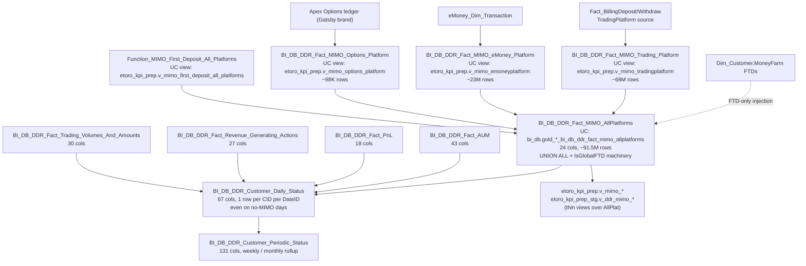

# MIMO Panel & DDR (cross-platform money flow)

This is the **single canonical answer** to "how much money flowed in / out". The BI team built this layer precisely so analysts don't have to JOIN raw billing tables across four platforms. Everything is pre-aggregated to `(DateID, RealCID, MIMOPlatform, MIMOAction)` grain with FTD machinery already applied.

**If you find yourself wanting to UNION ALL `Fact_BillingDeposit` + `eMoney_Dim_Transaction` + `EXW_Wallet.SentTransactions` — STOP and use this skill instead.**

**Side classification:** broker-side cross-platform money-flow (TP + eMoney + Options-Apex + MoneyFarm-FTD), unified at the BI layer with global FTD recognition. Per-fact daily / periodic rollups for AUM, PnL, revenue events, trading volumes.

> **Genie / SQL note.** SQL examples below use **Unity Catalog FQNs**. Per-platform MIMO objects are **VIEWS in UC**, not materialized tables: Synapse `BI_DB_DDR_Fact_MIMO_Trading_Platform` → UC `main.etoro_kpi_prep.v_mimo_tradingplatform`, same for eMoney and Options. They sit on top of the materialized `_AllPlatforms` table.

## When to Use

Load when the question is about **cross-platform money flow** — volumes, FTDs, daily customer status, AUM / PnL rollups, revenue events:

- "Daily deposit volume by platform / regulation"
- "Net MIMO (deposit − withdraw) by any cut"
- "Global FTD count per day per platform" (`IsGlobalFTD = 1`)
- "TP-only / eMoney-only FTD count" (`IsPlatformFTD = 1 AND MIMOPlatform = '<plat>'`)
- "Recurring-deposit penetration", "IBAN-initiated trades", "crypto-to-fiat deposits"
- "AML Net Deposits KPI" (the specific TP-only-with-`FundingTypeID <> 33` net-flow used by the AML team)
- "Daily customer status by Status / Regulation / Country" (use `Customer_Daily_Status`)
- "AUM per customer per day", "PnL per customer per day per instrument"
- "Revenue events by ActionType × InstrumentType" (use `Fact_Revenue_Generating_Actions`)
- "Customer's MIMO history across TP + eMoney + Options" — single query against `AllPlatforms`

Do NOT load for:

- **Provider-level / MID-level breakdown of TP deposits** → `deposits-and-withdrawals` (MIMO doesn't carry MID; you need `BI_DB_DepositWithdrawFee` or raw `Fact_BillingDeposit`).
- **3DS outcome, decline reason, payment status drill** → `deposits-and-withdrawals` → Critical Warning 1 there (declines dropped from BI layer; need `Fact_BillingDeposit` or Synapse `Fact_Deposit_State`).
- **eMoney IBAN / card / OpenBanking specifics** → `emoney-accounts-and-cards`.
- **Crypto wallet on-chain transactions / wallet balances** → `crypto-wallet`.
- **Realtime / sub-day customer balance** → `finance-recon-and-balances` (MIMO is daily snapshot).
- **Fee revenue composition** → `domain-revenue-and-fees` super-domain (MIMO has Amounts but not fee composition).
- **Customer's first trade after FTD** → `domain-cross/recurring-deposit-to-trade`.
- **Crypto deposit → fiat conversion chain** → `domain-cross/crypto-to-fiat` (`IsCryptoToFiat` is here, but the journey is in C.4 + C.3).
- **Trading volumes for revenue-per-volume / commission rate questions** → `domain-trading/trading-volumes` (uses `fact_customeraction_w_metrics` as authoritative source; the DDR `Fact_Trading_Volumes_And_Amounts` is the user-segmentation cut, not the revenue-grade cut).

## Scope

In scope: `BI_DB_DDR_Fact_MIMO_AllPlatforms` (24-col canonical cross-platform money-flow fact, ~91.5M rows materialized in UC); the three per-platform views (`v_mimo_tradingplatform`, `v_mimo_emoneyplatform`, `v_mimo_options_platform`) and passthrough/staging views (`v_mimo_allplatforms`, `v_ddr_mimo_*`); the global FTD view (`v_mimo_first_deposit_all_platforms`); the per-fact daily / periodic DDR family (`BI_DB_DDR_Customer_Daily_Status` 67 cols, `BI_DB_DDR_Customer_Periodic_Status` 131 cols, `BI_DB_DDR_Fact_AUM` 43 cols, `BI_DB_DDR_Fact_PnL` 18 cols, `BI_DB_DDR_Fact_Revenue_Generating_Actions` 27 cols, `BI_DB_DDR_Fact_Trading_Volumes_And_Amounts` 30 cols); the standard customer / funding-type / currency dim joins.
Out of scope: provider / MID drill (`deposits-and-withdrawals`); eMoney transaction status / card / OpenBanking (`emoney-accounts-and-cards`); on-chain crypto (`crypto-wallet`); realtime balance (`finance-recon-and-balances`); fee revenue composition (`domain-revenue-and-fees`); trading volumes at revenue grain (`domain-trading/trading-volumes`); first-trade-after-FTD lag (`domain-cross/recurring-deposit-to-trade`); crypto-to-fiat conversion chain (`domain-cross/crypto-to-fiat`); old DDR (`BI_DB_LTV_*`, `BI_DB_CID_*Panel_*` — deprecated, see Critical Warning 5).
Last verified: 2026-05-11

## Critical Warnings

1. **Tier 1 — `IsGlobalFTD = 1` is the unique cross-platform FTD; `IsPlatformFTD = 1` is per-platform.** A customer can have a `TradingPlatform` FTD followed weeks later by an `eMoney` FTD; both rows carry `IsPlatformFTD = 1`, but only the first (chronological) row carries `IsGlobalFTD = 1`. **Counting `IsPlatformFTD` and treating them as unique customers will double-count** any customer who FTD'd on multiple platforms. Pick the right flag: use `IsGlobalFTD` for "how many new funded customers"; use `IsPlatformFTD` for "how many new customers on platform X". FTD recovery (`FirstDepositRecoveryDate` machinery) only applies to `DateID >= 20250901`; older periods may slightly under-count.
2. **Tier 1 — `IsInternalTransfer = 1` (TP-side) AND `IsIBANQuickTransfer = 1` (eMoney-side) must BOTH be excluded for "real" money flow.** TP↔eMoney internal moves produce two rows: one TP row with `MIMOAction = 'Deposit'` + `IsInternalTransfer = 1`, and one eMoney row with `MIMOAction = 'Withdraw'` + `IsIBANQuickTransfer = 1` (or vice versa). If you don't exclude them you'll double-count company-level inflow. `IsIBANQuickTransfer` is eMoney-side and corresponds to `MoveMoneyReasonID = 6`; `IsInternalTransfer` is TP-side. **Both are needed in the filter** when measuring true external money in/out.
3. **Tier 1 — Do NOT join the four sub-platform feeds yourself.** The three views + MoneyFarm FTD injection already `UNION ALL` into `_AllPlatforms`. Joining `v_mimo_tradingplatform` + `v_mimo_emoneyplatform` again is double-counting. Use `_AllPlatforms` for cross-platform queries; use a single `v_mimo_<plat>` view only for per-platform drill.
4. **Tier 2 — `AmountUSD` and `AmountOrigCurrency` may come in signed depending on platform.** For TP withdraw rows, the sign may be negative; for eMoney they may be positive. **Always discriminate by `MIMOAction = 'Deposit' / 'Withdraw'`, not by the sign of `AmountUSD`.** Use `ABS(AmountUSD)` when you want absolute magnitude. The net-deposit pattern below shows the safe way to compute net flow.
5. **Tier 2 — Old DDR tables are DEPRECATED — do not reference.** `BI_DB_LTV_BI_Actual`, `BI_DB_LTV_Predictions`, `BI_DB_CID_DailyPanel_FullData`, `BI_DB_CID_MonthlyPanel_FullData`, `BI_DB_DDR_CID_Level` are the previous super-wide panels and LTV tables. They are still in Synapse (some still appear in UC) but **should not be used for new work** — they are being retired in favour of the per-fact split (`BI_DB_DDR_Fact_*` + `BI_DB_DDR_Customer_Daily_Status` joined per fact). The exception: `BI_DB_LTV_BI_Actual` is still owned by `domain-customer-and-identity/customer-models-and-segmentation` for customer-property questions (it's the current per-CID LTV-prediction table) — but it does NOT belong in a MIMO / DDR analysis.
6. **Tier 2 — MoneyFarm rows are FTD-only.** `WHERE MIMOPlatform = 'MoneyFarm'` returns ONLY the FTD row — no subsequent deposits / withdrawals. Sentinels on MoneyFarm rows: `AmountOrigCurrency = -1`, `Currency = 'GBP'` (hardcoded), `FundingTypeID = -1`, and `IsRecurring / IsTradeFromIBAN / IsCryptoToFiat / IsRedeem / IsIBANQuickTransfer` are always 0. For MoneyFarm AUM / activity questions you must go to the MoneyFarm domain skills (`bi_output_moneyfarm_*`, `money_farm.*`).
7. **Tier 2 — Options rows carry `TransactionID = 0`** (the column is INT in `_AllPlatforms`, position 5). Options is the Apex US-resident equity / Options platform (Gatsby brand). The source-side identifier is varchar in Apex and was hardcoded to 0 in the MIMO ingest because of varchar/int incompatibility. **Don't join on `TransactionID` for `MIMOPlatform = 'Options'`** — use `OrigIdentifier` + the Apex-side identifier instead. Options ingest is full delete/re-insert each run because Apex data arrival is unreliable. ~98K rows currently.
8. **Tier 3 — eMoney MOP reclassification happens downstream, not in the fact.** Tableau dashboards override `Dim_FundingType.Name` for eMoney external deposits: it's called `'OpenBanking'` if there's a matching `External_MoneyTransfer_Billing_Transfers` row with `TransferStatusID = 10`, else `'WireTransfer'`. The MIMO fact itself does not carry this distinction; you compute it on read. For analyst-grade question accept the dim name; for OpenBanking-specific accuracy do the join to `External_MoneyTransfer_Billing_Transfers`.
9. **Tier 3 — `IsCryptoToFiat` had GAPS in TP tagging before 2025-07.** The post-insert UPDATE for `FundingTypeID = 27` only runs `DateID >= 20250701`. Historical analyses may under-count C2F before that date. The 13K bad-FTD cohort (Aug 18-20 2025, $1 deposits with no follow-up) is excluded from `Function_MIMO_First_Deposit_All_Platforms` — don't try to "recover" them.
10. **Tier 3 — `FundingTypeID = 33` exclusion** is used by the AML team's Net Deposits KPI to exclude a specific non-cash / non-standard funding type. Apply only when reproducing the AML-team number; otherwise leave it in. The general "Net MIMO" pattern below does NOT apply this filter.

## Mental model



The new DDR framework has two tiers, in increasing aggregation:

1. **Transactional MIMO** — `BI_DB_DDR_Fact_MIMO_AllPlatforms` (materialized in UC, 24 cols, ~91.5M rows) and the three per-platform views (`v_mimo_tradingplatform`, `v_mimo_emoneyplatform`, `v_mimo_options_platform`) plus the global FTD view (`v_mimo_first_deposit_all_platforms`). Grain = one row per money movement.
2. **Daily / periodic customer panels** — `BI_DB_DDR_Customer_Daily_Status` joined per-fact to `BI_DB_DDR_Fact_AUM`, `BI_DB_DDR_Fact_PnL`, `BI_DB_DDR_Fact_Revenue_Generating_Actions`, and `BI_DB_DDR_Fact_Trading_Volumes_And_Amounts`. Grain = one row per CID per DateID (even on no-MIMO days — see Critical Warning … sic — see KPI catalog "Daily customer count by status"). Periodic rollups land in `BI_DB_DDR_Customer_Periodic_Status` (131 cols, weekly / monthly).

## Primary objects (verified col counts 2026-05-11)

| Object | UC name | Cols | Grain | Notes |
|--------|---------|------|-------|-------|
| `BI_DB_DDR_Fact_MIMO_AllPlatforms` | `main.bi_db.gold_sql_dp_prod_we_bi_db_dbo_bi_db_ddr_fact_mimo_allplatforms` (TABLE) | **24** | Transaction × CID × Date × Platform × Action | HASH(RealCID), CCI. **The canonical "did money flow" table.** |
| `BI_DB_DDR_Fact_MIMO_Trading_Platform` | `main.etoro_kpi_prep.v_mimo_tradingplatform` (VIEW) | (passthrough) | Same, TP only | Built from `Fact_BillingDeposit/Withdraw` + Dim resolution. **Not materialized in UC.** |
| `BI_DB_DDR_Fact_MIMO_eMoney_Platform` | `main.etoro_kpi_prep.v_mimo_emoneyplatform` (VIEW) | (passthrough) | Same, eMoney only | Built from `eMoney_Dim_Transaction` + status. **View over AllPlatforms.** |
| `BI_DB_DDR_Fact_MIMO_Options_Platform` | `main.etoro_kpi_prep.v_mimo_options_platform` (VIEW) | (passthrough) | Same, Options only | Apex broker (Gatsby brand); full delete/re-insert each run (data arrival is unreliable). **View over AllPlatforms.** |
| `Function_MIMO_First_Deposit_All_Platforms` | `main.etoro_kpi_prep.v_mimo_first_deposit_all_platforms` (VIEW) | (passthrough) | One row per CID's FTD across all platforms | Source-of-truth for cross-platform FTD. **Excludes 13K bad-FTD cohort** (Aug 18-20 2025, $1 deposits with no follow-up). |
| `BI_DB_DDR_Customer_Daily_Status` | `main.bi_db.gold_sql_dp_prod_we_bi_db_dbo_bi_db_ddr_customer_daily_status` (TABLE) | **67** | CID × DateID | Daily customer state: balance, AUM, PnL, MIMO, country, regulation, lifecycle status. **The default daily customer rollup.** 1 row per CID per day even on no-MIMO days. |
| `BI_DB_DDR_Customer_Periodic_Status` | `main.bi_db.gold_sql_dp_prod_we_bi_db_dbo_bi_db_ddr_customer_periodic_status` (TABLE) | **131** | CID × Period | Weekly / monthly rollup of `_Daily_Status`. |
| `BI_DB_DDR_Fact_AUM` | `main.bi_db.gold_sql_dp_prod_we_bi_db_dbo_bi_db_ddr_fact_aum` (TABLE) | **43** | CID × DateID | Assets-under-management snapshot per customer per day. |
| `BI_DB_DDR_Fact_PnL` | `main.bi_db.gold_sql_dp_prod_we_bi_db_dbo_bi_db_ddr_fact_pnl` (TABLE) | **18** | CID × DateID × InstrumentType | PnL per customer per day per instrument class. |
| `BI_DB_DDR_Fact_Revenue_Generating_Actions` | `main.bi_db.gold_sql_dp_prod_we_bi_db_dbo_bi_db_ddr_fact_revenue_generating_actions` (TABLE) | **27** | CID × DateID × ActionType × RevenueMetric | Granular revenue events (open / close / manual close). Anchor for Revenue & Fees super-domain too. |
| `BI_DB_DDR_Fact_Trading_Volumes_And_Amounts` | `main.bi_db.gold_sql_dp_prod_we_bi_db_dbo_bi_db_ddr_fact_trading_volumes_and_amounts` (TABLE) | **30** | CID × DateID × InstrumentType | Volume + notional amounts per customer per day. **Note**: `domain-trading/trading-volumes` is the authoritative skill for volume — it uses `fact_customeraction_w_metrics` as the revenue-grade source; this DDR table is the user-segmentation cut. |

KPI / DDR views built on this layer (Unity Catalog, fully-qualified):

- `main.etoro_kpi_prep.v_mimo_allplatforms` — passthrough view over the AllPlatforms fact
- `main.etoro_kpi_prep.v_mimo_tradingplatform` / `v_mimo_emoneyplatform` / `v_mimo_options_platform` — per-platform views (these ARE the UC representation of the per-platform MIMOs)
- `main.etoro_kpi_prep.v_mimo_first_deposit_all_platforms` — global FTD view
- `main.etoro_kpi_prep_stg.v_ddr_mimo_allplatforms` / `v_ddr_mimo_emoney` / `v_ddr_mimo_options` / `v_ddr_mimo_tradingplatform` — staging variants
- `main.etoro_kpi.vg_ddr_revenue` — DDR revenue rollup

## Canonical SQL patterns

```sql
-- 1. Daily MIMO with customer demographics (~90% of analyst Qs) — UC
SELECT m.DateID, m.RealCID, m.MIMOPlatform, m.MIMOAction, m.AmountUSD,
       m.IsGlobalFTD, m.IsPlatformFTD, m.IsCryptoToFiat,
       dc.CountryID, dft.Name AS FundingType, dcu.Symbol AS Currency
FROM main.bi_db.gold_sql_dp_prod_we_bi_db_dbo_bi_db_ddr_fact_mimo_allplatforms m
JOIN main.dwh.gold_sql_dp_prod_we_dwh_dbo_dim_customer_masked dc
     ON dc.RealCID = m.RealCID
JOIN main.dwh.gold_sql_dp_prod_we_dwh_dbo_dim_fundingtype dft
     ON dft.FundingTypeID = m.FundingTypeID
JOIN main.dwh.gold_sql_dp_prod_we_dwh_dbo_dim_currency dcu
     ON dcu.CurrencyID = m.CurrencyID
WHERE m.DateID BETWEEN :from_dt AND :to_dt
  AND m.MIMOAction   = 'Deposit'
  AND m.MIMOPlatform = 'TradingPlatform'   -- or remove for cross-platform
  AND m.IsInternalTransfer = 0;            -- exclude TP<->eMoney internal moves
```

```sql
-- 2. Net MIMO (deposit - withdraw) — safe form, sign-agnostic — UC
SELECT DateID, MIMOPlatform,
       SUM(CASE WHEN MIMOAction='Deposit'  THEN AmountUSD ELSE 0 END) AS deposit_usd,
       SUM(CASE WHEN MIMOAction='Withdraw' THEN AmountUSD ELSE 0 END) AS withdraw_usd,
       SUM(CASE WHEN MIMOAction='Deposit'  THEN AmountUSD ELSE -AmountUSD END) AS net_usd
FROM main.bi_db.gold_sql_dp_prod_we_bi_db_dbo_bi_db_ddr_fact_mimo_allplatforms
WHERE DateID BETWEEN :from_dt AND :to_dt
  AND IsInternalTransfer = 0
  AND IsIBANQuickTransfer = 0
GROUP BY DateID, MIMOPlatform;
```

```sql
-- 3. AML Net Deposits KPI (specific to AML team) — UC
SELECT DateID,
       SUM(CASE WHEN MIMOPlatform='TradingPlatform' AND MIMOAction='Deposit'  AND FundingTypeID<>33 THEN AmountUSD END)
       - SUM(CASE WHEN MIMOPlatform='TradingPlatform' AND MIMOAction='Withdraw' AND FundingTypeID<>33 THEN AmountUSD END)
       + SUM(CASE WHEN MIMOPlatform='eMoney' AND MIMOAction='Deposit'  AND IsInternalTransfer=0 AND IsIBANQuickTransfer=0 THEN AmountUSD END)
       - SUM(CASE WHEN MIMOPlatform='eMoney' AND MIMOAction='Withdraw' AND IsInternalTransfer=0 AND IsIBANQuickTransfer=0 THEN AmountUSD END)
         AS aml_net_deposits_usd
FROM main.bi_db.gold_sql_dp_prod_we_bi_db_dbo_bi_db_ddr_fact_mimo_allplatforms
WHERE DateID BETWEEN :from_dt AND :to_dt
GROUP BY DateID;
```

```sql
-- 4. Global FTD count vs Platform FTD count — never confuse them — UC
SELECT DateID, MIMOPlatform,
       COUNT(DISTINCT CASE WHEN IsGlobalFTD   = 1 AND MIMOAction='Deposit' THEN RealCID END) AS global_ftd_unique_cids,
       COUNT(DISTINCT CASE WHEN IsPlatformFTD = 1 AND MIMOAction='Deposit' THEN RealCID END) AS platform_ftd_unique_cids
FROM main.bi_db.gold_sql_dp_prod_we_bi_db_dbo_bi_db_ddr_fact_mimo_allplatforms
WHERE DateID BETWEEN :from_dt AND :to_dt
GROUP BY DateID, MIMOPlatform;
```

```sql
-- 5. Daily customer status with full enrichment — UC
SELECT cds.DateID, cds.RealCID, cds.Status, aum.AUM, pnl.PnL, m.AmountUSD AS daily_mimo_usd
FROM      main.bi_db.gold_sql_dp_prod_we_bi_db_dbo_bi_db_ddr_customer_daily_status cds
LEFT JOIN main.bi_db.gold_sql_dp_prod_we_bi_db_dbo_bi_db_ddr_fact_aum             aum
       ON aum.RealCID = cds.RealCID AND aum.DateID = cds.DateID
LEFT JOIN main.bi_db.gold_sql_dp_prod_we_bi_db_dbo_bi_db_ddr_fact_pnl             pnl
       ON pnl.RealCID = cds.RealCID AND pnl.DateID = cds.DateID
LEFT JOIN main.bi_db.gold_sql_dp_prod_we_bi_db_dbo_bi_db_ddr_fact_mimo_allplatforms m
       ON m.RealCID  = cds.RealCID AND m.DateID  = cds.DateID
JOIN      main.dwh.gold_sql_dp_prod_we_dwh_dbo_dim_customer_masked dc
       ON dc.RealCID = cds.RealCID
WHERE cds.DateID = :as_of;
```

```sql
-- 6. Revenue events with metric definitions — UC
SELECT r.DateID, r.RealCID, r.ActionTypeID, r.InstrumentTypeID, r.AmountUSD,
       dat.ActionType, dit.InstrumentType
FROM main.bi_db.gold_sql_dp_prod_we_bi_db_dbo_bi_db_ddr_fact_revenue_generating_actions r
JOIN main.dwh.gold_sql_dp_prod_we_dwh_dbo_dim_actiontype     dat
     ON dat.ActionTypeID     = r.ActionTypeID
JOIN main.dwh.gold_sql_dp_prod_we_dwh_dbo_dim_instrumenttype dit
     ON dit.InstrumentTypeID = r.InstrumentTypeID
WHERE r.DateID BETWEEN :from_dt AND :to_dt
  AND r.ActionTypeID     <> -1
  AND r.InstrumentTypeID <> -1;
```

## KPI / pattern catalog

| Question | Pattern |
|---|---|
| **Daily deposit volume by platform** | `WHERE MIMOAction='Deposit' GROUP BY DateID, MIMOPlatform`, `SUM(AmountUSD)` |
| **Net MIMO (deposit − withdraw)** | SQL 2 above (sign-agnostic, internal-transfer-excluded). |
| **Global FTD count per day per platform** | `WHERE IsGlobalFTD=1 AND MIMOAction='Deposit' GROUP BY DateID, MIMOPlatform` — **cross-platform unique first deposits.** |
| **Platform FTD count per day** | `WHERE IsPlatformFTD=1 AND MIMOAction='Deposit' GROUP BY DateID, MIMOPlatform` — different from global; a customer can have eMoney FTD AFTER a TP FTD. |
| **Crypto-to-fiat deposit volume** | `WHERE IsCryptoToFiat=1 AND MIMOAction='Deposit'`. Dual-source flag (sub-platform tag + post-insert UPDATE). For the full conversion story → `domain-cross/crypto-to-fiat`. |
| **Recurring-deposit penetration** | `COUNT(DISTINCT CASE WHEN IsRecurring=1 AND MIMOAction='Deposit' THEN RealCID END) * 1.0 / COUNT(DISTINCT RealCID)` |
| **IBAN-initiated trades (eMoney quick transfer)** | `WHERE MIMOPlatform='eMoney' AND IsTradeFromIBAN=1`. For the eMoney → trading deposit story specifically. |
| **Internal transfers (TP↔eMoney) excluded from "real" MIMO** | `AND IsInternalTransfer=0 AND IsIBANQuickTransfer=0`. Always apply when measuring true money flow. |
| **AML net deposits (specific KPI)** | SQL 3 above (`FundingTypeID <> 33` exclusion + both internal-transfer flags). |
| **MoneyFarm FTDs** | `WHERE MIMOPlatform='MoneyFarm'` — only FTDs appear here. `Currency='GBP'` is hardcoded. |
| **Daily customer count by status** | `BI_DB_DDR_Customer_Daily_Status GROUP BY DateID, Status` (use this when the question is about the customer rather than the transaction). 1 row per CID per day even on no-MIMO days, so COUNT(*) is *active customer count*. |
| **AUM per customer per day** | `BI_DB_DDR_Fact_AUM` directly. Don't derive from positions. |
| **PnL per customer per day per instrument** | `BI_DB_DDR_Fact_PnL` (18 cols, InstrumentTypeID grain). |
| **Revenue events** | `BI_DB_DDR_Fact_Revenue_Generating_Actions` joined to `Dim_ActionType` + `Dim_InstrumentType` (SQL 6 above). |
| **Weekly / monthly customer rollup** | `BI_DB_DDR_Customer_Periodic_Status` (131 cols). |
| **Bridge a MIMO row to its provider details** | Drill out to `deposits-and-withdrawals` (TP) / `emoney-accounts-and-cards` (eMoney) using `OrigIdentifier` + `TransactionID`. |

## When to bridge / when to drill down

| If the question also asks about… | …go to… |
|---|---|
| **Provider-level / MID-level breakdown** | `deposits-and-withdrawals` — MIMO doesn't carry MID; you need raw `BI_DB_DepositWithdrawFee` or `Fact_BillingDeposit`. |
| **3DS outcome, decline reason, payment status drill** | `deposits-and-withdrawals` — state-machine drill is in `Fact_Deposit_State` (Synapse-only). |
| **eMoney-side IBAN, card, OpenBanking specifics** | `emoney-accounts-and-cards` — MIMO doesn't carry eMoney transaction status. |
| **On-chain hash / wallet-side crypto transactions** | `crypto-wallet`. |
| **Realtime / sub-day customer balance** (vs the daily snapshot here) | `finance-recon-and-balances`. |
| **Fee revenue specifically** | `domain-revenue-and-fees` super-domain — MIMO has Amounts but not fee composition. |
| **Trading volumes for revenue-rate questions** | `domain-trading/trading-volumes` (uses `fact_customeraction_w_metrics` as authoritative). |
| **Customer's first trade after FTD** | `domain-cross/recurring-deposit-to-trade`. |
| **Crypto deposit → fiat conversion chain** | `domain-cross/crypto-to-fiat` — `IsCryptoToFiat` is here, but the journey is in C.4 + C.3. |
| **Provider statement reconciliation** | `domain-cross/provider-reconciliation`. |
| **Treezor / Tribe audit envelope on eMoney transactions** | `domain-cross/tribe-emoney-audit`. |
| **Customer lifecycle status (Funded / Active / FTF / Portfolio Only / Balance Only)** | `../domain-customer-and-identity/customer-populations-and-lifecycle.md` — authoritative for population segments (absorbed 2026-05-28 from the legacy `customer-populations` workspace skill). |

## Deep reads

- [`BI_DB_DDR_Fact_MIMO_AllPlatforms.md`](https://github.com/guyman-tr/Databricks_Knowledge/blob/master/knowledge/synapse/Wiki/BI_DB_dbo/Tables/BI_DB_DDR_Fact_MIMO_AllPlatforms.md) — full 24-column schema, FTD machinery, platform-specific transformations.
- [`BI_DB_DDR_Customer_Daily_Status.md`](https://github.com/guyman-tr/Databricks_Knowledge/blob/master/knowledge/synapse/Wiki/BI_DB_dbo/Tables/BI_DB_DDR_Customer_Daily_Status.md) — 67-col daily CID rollup.
- [`BI_DB_DDR_Customer_Periodic_Status.md`](https://github.com/guyman-tr/Databricks_Knowledge/blob/master/knowledge/synapse/Wiki/BI_DB_dbo/Tables/BI_DB_DDR_Customer_Periodic_Status.md) — 131-col periodic (weekly / monthly) rollup.
- [`BI_DB_DDR_Fact_Revenue_Generating_Actions.md`](https://github.com/guyman-tr/Databricks_Knowledge/blob/master/knowledge/synapse/Wiki/BI_DB_dbo/Tables/BI_DB_DDR_Fact_Revenue_Generating_Actions.md) — 27-col revenue event grain.

## Skill provenance

- Cluster 13 from the Louvain partition (74 members, intra-cluster weight 429.0). Schema mix: `BI_DB_dbo:41, DWH_dbo:7, eMoney_dbo:4, etoro_kpi[_prep]:5, spaceship:5, money_farm:1, bi_output:2, others`.
- Highest Tableau / Genie edge weight in all of Payments — this layer is what dashboards and curated AI spaces consume.
- Column counts verified 2026-05-11 against `system.information_schema.columns`: MIMO_AllPlatforms = 24, Customer_Daily_Status = 67, Customer_Periodic_Status = 131, Fact_AUM = 43, Fact_PnL = 18, Fact_Revenue_Generating_Actions = 27, Fact_Trading_Volumes_And_Amounts = 30. Old DDR (`BI_DB_LTV_*`, `BI_DB_CID_*Panel_*`, `BI_DB_DDR_CID_Level`) confirmed deprecated — do not reference for new analyses.
- Intersecting skills: `deposits-and-withdrawals`, `emoney-accounts-and-cards`, `crypto-wallet`, `finance-recon-and-balances`, `domain-revenue-and-fees/SKILL`, `domain-trading/trading-volumes`, `domain-cross/recurring-deposit-to-trade`, `domain-cross/crypto-to-fiat`, `domain-cross/provider-reconciliation`.
