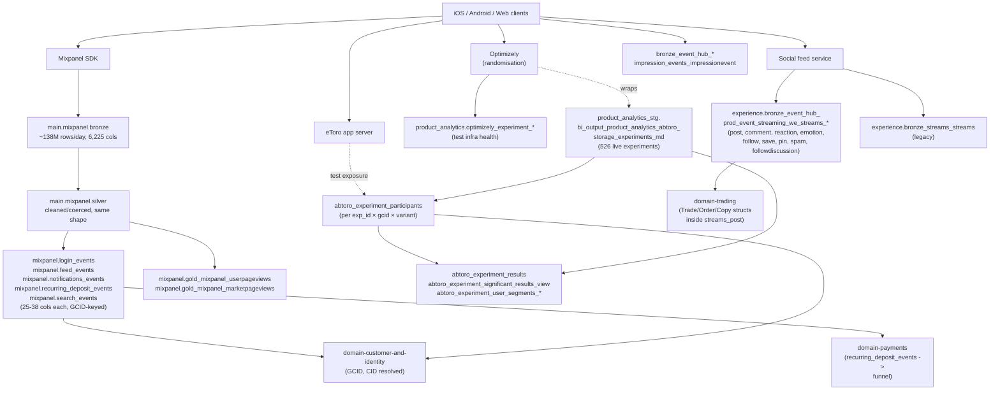

# Product Analytics Super-Domain

Product analytics at eToro is the **measurement layer for the apps**: every click, page view, login, search, deposit attempt, reaction, follow, and A/B-test exposure that flows out of the iOS / Android / Web clients. It has three independent producers, each with a different shape, identity scheme, and analytical mental model. This hub tells you which one to point at.

| Producer | What it captures | Anchor | Daily volume |
|---|---|---|---|
| **Mixpanel** | App / web UI events: clicks, page views, navigation, form fills, A/B exposure pings, login attempts, search terms, deposit-funnel steps, feature usage | `main.mixpanel.silver` (raw + cleaned, 6,225 cols) + curated event-type slices (`login_events`, `feed_events`, etc.) + pageview marts | ~138M rows/day on silver |
| **ABtoro** | A/B-test exposure + per-test results + significance + segment splits + LLM-generated test descriptions + early-alerting (YEAST) safety algorithm | `main.product_analytics_stg.bi_output_product_analytics_abtoro_*` (12 tables) — `storage_experiments_md` is the metadata index, `experiment_participants` is per-(exp_id, gcid, variant) | 526 live experiments; ~5.5M participations / 2.2M GCIDs in last 30 days |
| **Social-feed event hub** | Server-side feed engagement events: post creation, reactions, comments, follows, saves, pins, spam reports — including the trade/order/copy nested struct payloads that explain WHAT the user reacted to | `main.experience.bronze_event_hub_prod_event_streaming_we_streams_*` family (10 sibling tables) + legacy `bronze_streams_streams` + impression events | Hundreds of posts/day; reactions / comments / follows ~10× that |

**Three independent things, three different keys, three different partition conventions.** Knowing which producer you're querying is the single most important decision in this domain.

## When to Use

Load when the question is about:

- "How many users did X in the app/web?", "what's the daily volume of event Y?", "show me page-view breakdowns" — see [`mixpanel-events-and-pageviews.md`](mixpanel-events-and-pageviews.md)
- "Which A/B tests are running on surface X?", "is variant B beating control on CVR to Trade?", "what's the LLM summary of test Z?", "what does YEAST early-alerting say?" — see [`ab-testing-and-experimentation.md`](ab-testing-and-experimentation.md)
- "How many posts / reactions / comments yesterday?", "which markets are mentioned in feed posts?", "what's the per-Requester vs per-Entity_Owner split?", "feed-ranking simulation outputs" — see [`feed-and-social-analytics.md`](feed-and-social-analytics.md)
- Cross-stream join questions ("which AB variant did the users in this Mixpanel cohort see?") — start at the most-restrictive producer, then bridge: `experiment_participants` carries `gcid`, Mixpanel `silver` carries `cid`/`gcid`, streams_post carries `EventPayloadRowData_Requester` (Id is GCID-like)
- Mixpanel-derived behavioural panels (feature adoption, retention curves, opt-in monitoring) — see [`mixpanel-events-and-pageviews.md`](mixpanel-events-and-pageviews.md) §Derived panels

Do **not** load for:

- Customer-static attributes (country, club, regulation) — `domain-customer-and-identity/customer-master-record.md`
- Customer-cluster / LTV / SCD models — `domain-customer-and-identity/customer-models-and-segmentation.md` (those tables are DERIVED from Mixpanel events but documented under the customer hub because they expose customer-level features, not event-level data)
- Marketing-attribution funnels (paid Google/social campaigns, affiliate referrals, SFMC email engagement) — when `domain-marketing-and-acquisition` exists, those go there; until then they're in `domain-customer-and-identity/registration-to-ftd-funnel.md`
- Trade / position events themselves (the act of trading, not the Mixpanel UI ping about it) — `domain-trading`
- Deposit / withdraw business events — `domain-payments` (Mixpanel `recurring_deposit_events` captures the UI funnel; the actual money flow is in `domain-payments/deposits-and-withdrawals.md`)

## Scope

In scope: the three event-producer streams above and their identity keys (`cid`, `gcid`, `distinct_id`, `mp_anon_id`, `mp_distinct_id`, `i_identify_user_id`, `mp_device_id`); the 6,225-column EAV-flattened shape of `mixpanel.silver` and the implications for query design (column-projection mandatory, partition filter mandatory, type-suffix duplicate columns, device-id-in-column-name corruption); the curated event-type tables (`login_events`, `feed_events`, `notifications_events`, `recurring_deposit_events`, `search_events`) as the preferred slice for high-traffic single-event-type questions; the `etr_y` / `etr_ym` / `etr_ymd` STRING-typed dashed partition convention (`'2026'` / `'2026-05'` / `'2026-05-28'`) shared by all event tables under `mixpanel.*` and `experience.bronze_event_hub_*streams_*` and easy to miss when porting filters from Synapse/DWH `DateID` integer queries; the ABtoro 14 `exp_type` taxonomy (Home/Login, Deposit/MIMO, Trading, Feed, Market Page, KYC, Discover, Watchlist, Copy/User Page, Portfolio, Search, Notifications, Refer a Friend, "Exclude from Meta-analysis"); the ABtoro / Optimizely / userflow / journey_campaign distinction in `participants_source_type`; the YEAST early-alerting safety algorithm (degradation detection on the OEC metric); the social-feed nested-struct payload shape (`EventPayloadRowData_Entity` for the post being acted upon, `EventPayloadRowData_Requester` for the actor); cross-references to the valid-users filter contract for any per-CID rollup.

Out of scope: customer-attribute SCD walks and the IsValidCustomer filter mechanics (`_shared/valid-users-filter-contract.md`); customer-level cluster / LTV models (`domain-customer-and-identity/customer-models-and-segmentation.md`); paid marketing channels and affiliate attribution; raw trade or deposit business events (only the Mixpanel UI events that surround them are in scope); the actual app codebases producing the events; the ML pipelines consuming Mixpanel (recommendation, ranking, anomaly-detection model training — only their OUTPUT panels in `product_analytics_stg.bi_output_product_analytics_*` are scoped).

Last verified: 2026-05-28

## Critical Warnings

> **Tier 0 — Filter Contract (cross-cutting).** Every per-customer product-analytics aggregate in this domain (DAU / WAU / MAU by club tier, experiment participants by regulation, feed-poster count by country, Mixpanel event-rate per customer cohort, retention curves, ABtoro arm-size by segment) MUST follow [`../_shared/valid-users-filter-contract.md`](../_shared/valid-users-filter-contract.md): silent SCD-2 walk on `V_Fact_SnapshotCustomer_FromDateID` with `IsValidCustomer = 1` and `<event-date> BETWEEN snap.FromDateID AND snap.ToDateID` (period-correct — never current-state `Dim_Customer` for period queries); mandatory one-line scope footer on every numeric output. Mixpanel / ABtoro / streams_* events are NOT pre-filtered upstream — apply the contract every time the rollup is per-customer. The carve-out: pure event-count aggregates that don't roll up per-customer ("how many Page Views yesterday", "how many comments on post X", "total event volume per `mp_event_name` last week", "screen view count per app version") do NOT need the per-customer filter. The moment the question rolls up per-CID, the contract kicks in. The regulatory variant (`IsCreditReportValidCB = 1`) fires ONLY when the user explicitly says "CB valid" / "Client Balance valid" / "credit-report valid" — never on topic heuristics. Opt-out (unfiltered, include non-valids / internals / etorians / test) only on explicit user request. Never pre-flight.

1. **Tier 1 — `mixpanel.silver` and `bronze` each have 6,225 columns. `SELECT *` is catastrophic.** Daily volume is ~138M rows. Always project the specific columns you need (`event_name` / `mp_event_name`, identity columns, `etr_ymd`, plus a handful of context columns). Always include a partition filter (`etr_y`, `etr_ym`, or `etr_ymd`). Even an exploratory `LIMIT 10 SELECT *` on a single partition is borderline unsafe. For exploratory event-level analysis on a known event type, prefer the curated slices (`mixpanel.login_events`, `feed_events`, `notifications_events`, `recurring_deposit_events`, `search_events`) which carry 25-38 cols.

2. **Tier 1 — Partition columns are STRING-typed and use dashed format (`YYYY-MM-DD`), not integer `YYYYMMDD`.** Across this domain — `mixpanel.silver`/`bronze`, all curated `mixpanel.*_events` slices, the pageview marts, and the `experience.bronze_event_hub_*streams_*` family — `etr_y='2026'`, `etr_ym='2026-05'`, `etr_ymd='2026-05-28'` are the canonical formats. **Filters using integer `YYYYMMDD` (`WHERE etr_ymd > 20260501`) or no-dash strings (`WHERE etr_ymd >= '20260525'`) silently return zero rows** because both forms lexicographically sort below `'2026-05-28'`. Compare to the Synapse/DWH `DateID` integer convention (`20260528`) used in `Dim_Date` joins — different system, different convention. Always check `SELECT DISTINCT etr_ymd FROM <table> WHERE etr_y='2026' ORDER BY etr_ymd DESC LIMIT 3` when designing a date filter on any table in this domain.

3. **Tier 1 — `mp_event_name` is the event name on `mixpanel.silver`/`bronze`, NOT `event_name`.** `event_name` exists but is populated on <0.001% of rows (sample: 134 non-null rows on a day with 137,570,941 total). The data team's curated slices (`login_events`, `feed_events`, etc.) reverse the convention and use `EventName` (PascalCase) instead. When porting a query between `mixpanel.silver` and a curated slice, this column-name swap is a frequent silent-zero-result bug.

4. **Tier 1 — Mixpanel identity has FIVE keys; they are not interchangeable.** `distinct_id` = Mixpanel's persistent ID, sometimes a device ID, sometimes an internal CID-like alias. `mp_anon_id` and `mp_anon_distinct_id` = pre-login anonymous ID. `i_identify_user_id` = the eToro user ID that was passed to Mixpanel's `identify()` call. `cid` (DOUBLE) and `gcid` (DOUBLE) = the platform-internal Customer ID and Group Customer ID resolved upstream by Fivetran/the cleanup job. **For joining to any other eToro table use `gcid` first, then `cid`. `distinct_id` is Mixpanel-internal — do NOT use it as a join key against `Dim_Customer`.** Pre-login events have `cid IS NULL` and only `mp_anon_id` / `distinct_id` populated — drop them unless you specifically want anonymous-funnel analysis.

5. **Tier 2 — `mixpanel.silver` has hundreds of corrupt `mp_device_id`-prefixed and `mp_initial_referrer`-prefixed columns (`mp_device_id01569188566`, `mp_device_id027246352378305`, etc.) — they are not real properties.** These were created by a Mixpanel upstream bug that injected device-ID values into the column-name namespace via a malformed property schema. They contain near-zero non-null data and should be ignored. There's no clean way to drop them without breaking the Fivetran sync; the cleanup is being negotiated.

6. **Tier 2 — Same logical Mixpanel property can have multiple type-suffixed columns (`cid`, `cid_string`, `cid_1`, `cid_1_2`).** When a property was sent over the years with different types (a `cid` value sometimes as a number, sometimes as a string), Mixpanel-via-Fivetran creates type-discriminated columns. The unsuffixed `cid` is usually the type the data team standardised on, but the `_string` / `_numeric` / `_blob` / `_boolean` variants may carry rows that the canonical column doesn't. When a Mixpanel query returns a suspicious zero or undercount on `cid`, also check `cid_string` / `cid_1_2` before concluding the event genuinely lacks the property.

7. **Tier 2 — ABtoro `exp_type = 'Exclude from Meta-analysis'` is a real bucket (~84 experiments). Filter it out when rolling up "experiments by surface".** It's the dumping ground for tests that produced unreliable data, ran too short, or had a known confound. Including it in surface-level counts overstates active testing volume.

8. **Tier 2 — `exp_id` in ABtoro is the lowercased `exp_name` with special characters removed. `exp_name` is the human-readable string.** Always JOIN on `exp_id`; DISPLAY `exp_name`. Joining ABtoro tables on `exp_name` will work most of the time but silently lose joins where the name was re-cased or had a stray comma stripped. `control_key` and `variant_keys` are Optimizely-internal codes that you usually do NOT use directly — join via `exp_id` and use `control_key = 'control'` / non-control values from `variant_names` for display.

9. **Tier 2 — ABtoro `primary_metrics` is an array of metric CODE-names, not display names.** Always join to `main.product_analytics_stg.bi_output_product_analytics_abtoro_metrics_md` for human-readable names before showing results. `early_alerting_metric` is similarly a code-name carrying the OEC ("overall evaluation criterion") metric — typically CVR-to-Trade, CVR-to-Copy, CVR-to-Deposit, or CVR-to-Trade-or-Copy.

10. **Tier 2 — `participants_source_type` partitions test types and matters for interpretation.** `optimizely` = product A/B test wrapped from Optimizely (~most tests). `userflow` = product marketing test changing a promotional banner. `journey_campaign` = SFMC email-template test. Mixing all three in a single "% of users in A/B tests" rollup is meaningless — at least split by source.

11. **Tier 2 — Social-feed events carry TWO user IDs: `_Requester` (who did the action) and `_Entity_Owner` (who owns the entity being acted on).** On a Reaction event, `_Requester` is the reactor, `_Entity_Owner` is the post author. On a Follow event, `_Requester` is the follower, `_Entity_Owner` is the followed. Confusing them flips the analysis. Both are GCID-like strings in `EventPayloadRowData_Requester_Id` and `EventPayloadRowData_Entity_Owner_Id` (note: stored as STRING, may need CAST to BIGINT before joining to Mixpanel `gcid` DOUBLE).

12. **Tier 2 — Streams events have ~50 nested-struct top-level columns and ~hundreds of leaf fields.** The schema is `EventPayloadRowData.Entity.Metadata.{Trade,Order,Copy,Poll,MarketEvent,Share}` — only one of those sub-structs is non-null per row, depending on the post type. For a post mentioning a trade, `EventPayloadRowData_Entity_Metadata_Trade_Type / _PositionId / _Market / _Gain / _Rate / _Direction` will be populated and the others null. Always check `EventPayloadRowData_Entity_Type` first to know which sub-struct to read.

13. **Tier 3 — `mixpanel.bronze` is RAW Fivetran output; `mixpanel.silver` is the same data after type-coercion and de-duplication.** They have IDENTICAL schemas (6,225 cols each). For 99% of analysis use `silver`. `bronze` is only useful when validating a Fivetran-side issue.

14. **Tier 3 — Optimizely tables are upstream of ABtoro. ABtoro's `storage_experiments_md.optimizely_rule_names` array links the two.** A test that exists in Optimizely but not in ABtoro is either too new, too small, or was excluded from ABtoro tracking. Use the Optimizely tables (`main.product_analytics.optimizely_experiment_health`, `_issues`, plus `main.product_analytics_stg.bi_output_product_analytics_experiment_tracker_*`) for infra-level test health; use ABtoro tables for business-result interpretation.

15. **Tier 3 — `feed_ranking_formulas_simulations_*` are MODEL outputs, not actual events.** They simulate alternative feed-ranking weight schemes against historical events. Do not mistake them for "users actually saw this feed" data — use the streams_* event-hub tables or `mixpanel.feed_events` for actual feed engagement.

## Mental model — three streams converging on a customer

## Sub-skill routing

| Question pattern | Load |
|---|---|
| "Mixpanel events / pageviews / sessions / app usage / clickstream / funnel / mp_event_name X" | [`mixpanel-events-and-pageviews.md`](mixpanel-events-and-pageviews.md) |
| "A/B test / experiment / variant / lift / CVR / ABtoro / Optimizely / YEAST / early alerting" | [`ab-testing-and-experimentation.md`](ab-testing-and-experimentation.md) |
| "Feed post / reaction / comment / follow / save / pin / streams_* / Requester / Entity_Owner / nested struct payload" | [`feed-and-social-analytics.md`](feed-and-social-analytics.md) |

## Cross-domain federation

| When question crosses into | Route or co-load |
|---|---|
| Customer cluster / LTV / segmentation that USES Mixpanel-derived features (ClusterDetail, ClusterSF, customer_segments_v, BI_DB_CID_DailyPanel_FullData) | `domain-customer-and-identity/customer-models-and-segmentation.md` (those outputs live there; the source events live here) |
| Customer master attributes (regulation, country, club tier) for per-CID rollup of Mixpanel/ABtoro data | `domain-customer-and-identity/SKILL.md` + `_shared/valid-users-filter-contract.md` |
| Trading / position struct inside `streams_post.EventPayloadRowData_Entity_Metadata_Trade` | `domain-trading/position-state-and-grain.md` for what `PositionId`, `Direction`, `Rate`, `Gain` mean |
| Mixpanel `recurring_deposit_events` feeding the deposit funnel | `domain-payments/deposits-and-withdrawals.md` for the downstream money flow |
| Compliance gating on test-eligible customers | `domain-compliance-and-aml/SKILL.md` |
| Marketing-attribution joins (paid channel → Mixpanel funnel) | `domain-customer-and-identity/registration-to-ftd-funnel.md` until `domain-marketing-and-acquisition` lands |
| Refer-a-Friend test exposure (`exp_type='Refer a Friend'`) | `domain-customer-and-identity/registration-to-ftd-funnel.md` (RAF view set there) |

## Cross-cutting facts (memorise these)

1. **Three producers, three identity primaries.** Mixpanel: `gcid` (resolved upstream from `i_identify_user_id`), with `cid` as the secondary. ABtoro: `gcid` only (no CID). Streams event-hub: `EventPayloadRowData_Requester_Id` as STRING, GCID-like, may need CAST.
2. **One partition convention, easy to get wrong.** All event tables under `mixpanel.*` and `experience.bronze_event_hub_*streams_*` use STRING-typed dashed format: `etr_y='2026'`, `etr_ym='2026-05'`, `etr_ymd='2026-05-28'`. Integer comparisons (`etr_ymd > 20260501`) and no-dash strings (`etr_ymd >= '20260525'`) BOTH silently return zero rows. Do not confuse with the Synapse/DWH `DateID` integer convention used in `Dim_Date`.
3. **Two event-name columns.** `mp_event_name` on Mixpanel raw layer (`silver`/`bronze`); `EventName` (PascalCase) on curated slices (`login_events`, `feed_events`, etc.).
4. **ABtoro is downstream of Optimizely.** Optimizely randomises; ABtoro wraps with metadata + LLM commentary + YEAST safety + per-experiment views.
5. **`exp_type = 'Exclude from Meta-analysis'` filtered out for active-test counts** (~84 tests; otherwise inflates totals by ~16%).
6. **Streams events: Requester ≠ Entity_Owner.** Reactor vs post-author distinction is the one analytical mistake everyone makes once.
7. **Anonymous events.** Mixpanel rows with `cid IS NULL` are pre-login or logged-out users. Drop them for any per-customer rollup; keep them for funnel-top analysis.
8. **Per-customer rollup → filter contract.** Always `IsValidCustomer = 1` via the SCD-2 walk unless the question is purely event-level.

## What this skill is NOT

- Not customer master data (`domain-customer-and-identity/customer-master-record.md`).
- Not customer cluster / LTV / segmentation outputs (`domain-customer-and-identity/customer-models-and-segmentation.md`) — those tables live there because they expose customer-level features, even though they're DERIVED from these Mixpanel events.
- Not paid marketing channels, affiliate attribution, SFMC content (will be `domain-marketing-and-acquisition`).
- Not trade / position / deposit business events themselves (`domain-trading`, `domain-payments`) — only the Mixpanel UI events surrounding them.
- Not the cross-product valid-users filter contract (`_shared/valid-users-filter-contract.md`).
- Not the app codebases producing the events.
- Not the ML training pipelines consuming Mixpanel — only the published `product_analytics_stg.bi_output_product_analytics_*` panels.

## Skill provenance

- **Primary sources.** UC live probes against `main.mixpanel.*` (9 tables — silver/bronze/login_events/feed_events/notifications_events/recurring_deposit_events/search_events/gold_mixpanel_userpageviews/gold_mixpanel_marketpageviews), `main.product_analytics_stg.bi_output_product_analytics_abtoro_*` (12 tables), `main.product_analytics.optimizely_*` (2 tables), `main.experience.bronze_event_hub_prod_event_streaming_we_streams_*` (10 tables, ~52 top-level columns each), `main.product_analytics_stg.bi_output_product_analytics_feed_ranking_formulas_simulations_*` (3 tables).
- **Usage data.** `audits/_usage_trigger_xref_20260525T155320Z/report.md` — Mixpanel queried 237× by 5 users / Genie space ABtoro Genie (125), Feed Analytics Genie (27), Customer Segmentation (123 partial).
- **Live volume probes.** Single day 2026-05-27 on `mixpanel.silver`: 137,570,941 rows / 42,599 distinct CIDs / `mp_event_name` non-null on 99.999% of rows. ABtoro: 526 distinct experiments across 14 exp_types; 5.5M participations / 2.2M distinct GCIDs in last 30 days.
- **Federation references.** `domain-customer-and-identity/customer-models-and-segmentation.md` (consumes Mixpanel-derived cluster features); `_shared/valid-users-filter-contract.md` (per-CID rollup contract).
