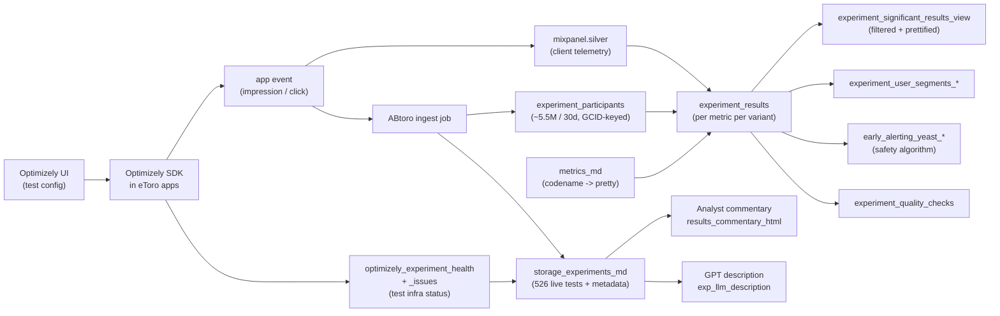

# A/B testing & experimentation (ABtoro)

ABtoro is the **business-results layer** for eToro experimentation. Optimizely (and a few other randomisers) decides who sees what; ABtoro tracks the exposure, calculates results, applies the YEAST safety algorithm to detect mid-flight degradation, and surfaces analyst-written and LLM-generated interpretation. Most analytical questions land here; only test-infra-health questions go to Optimizely directly.

## When to Use

Load for questions about:

- Which tests are running, where, on whom (`storage_experiments_md`)
- Which variant a specific GCID is in (`experiment_participants`)
- Test results / lifts / p-values / confidence intervals (`experiment_results`, `experiment_significant_results_view`)
- Which user segments drove a significant lift (`experiment_user_segments_*`)
- YEAST early-alerting violations and bounds
- Analyst commentary or LLM-generated test descriptions
- Cross-referencing tests to JIRA / GitHub via `jira_growth_issue_key`
- Test infra health (Optimizely health/issues tables)

Do NOT load for:

- The actual Mixpanel event being measured ג€” see [`mixpanel-events-and-pageviews.md`](mixpanel-events-and-pageviews.md). `early_alerting_mp_event_name` tells you WHICH event; the event volume question is a Mixpanel question.
- Feed-engagement events under test ג€” see [`feed-and-social-analytics.md`](feed-and-social-analytics.md). ABtoro tells you who was in which variant; the feed-event response is in the server-side stream tables.
- Customer attribute filtering for the participants ג€” apply the [valid-users filter contract](../cross-cutting/valid-users-filter-contract.md) when rolling up by customer attributes.

## Scope

In scope: the 12 ABtoro tables under `main.product_analytics_stg.bi_output_product_analytics_abtoro_*`; the 4 Optimizely-source tables (`optimizely_experiment_health`, `_issues` under `main.product_analytics`; `experiment_tracker_optimizely_experiments`, `_gcid_level_experiments` under `main.product_analytics_stg.bi_output_product_analytics_*`); the exp_id / exp_name / control_key / variant_keys identifier scheme; the 14 `exp_type` buckets and the `Exclude from Meta-analysis` filter convention; the `participants_source_type` taxonomy (optimizely / userflow / journey_campaign); the YEAST early-alerting algorithm output columns; the metric-codename ג†’ pretty-name mapping via `metrics_md`; the cross-stream bridge through `early_alerting_mp_event_name` and `experiment_participants.gcid`.

Out of scope: Mixpanel raw event data (`mixpanel-events-and-pageviews.md`); social-feed events (`feed-and-social-analytics.md`); the Optimizely UI / configuration itself; the ABtoro UI / codebase; the test design rationale (rationale captured by analysts in `results_commentary_html` and `exp_llm_description`, not enumerated here); the YEAST algorithm's statistical derivation (only its output columns are scoped); the airdrop A/B-test variants ג€” the `experiment_variation_id` column on `bronze_marketperformance_airdrop_configuration` links INTO this hub via `exp_variation_id`, but the airdrop allocation lifecycle and per-customer airdrop status live in [`../domain-marketing-and-acquisition/raf-and-incentives.md`](../domain-marketing-and-acquisition/raf-and-incentives.md).

Last verified: 2026-05-28

## Critical Warnings

1. **Tier 1 ג€” Always JOIN on `exp_id`, DISPLAY `exp_name`.** `exp_id` is the lowercased `exp_name` with special characters removed ג€” used as primary key and foreign key across every ABtoro table. `exp_name` is the human-readable string. Joining on `exp_name` works most of the time but silently loses joins where casing differs or a stray comma was stripped. `control_key` and `variant_keys` are Optimizely-internal codes ג€” usually you DON'T query on them; use `control_key = 'control'` (or whatever variant the `control_key` value is) plus `variant_names` from `storage_experiments_md` for display.

2. **Tier 1 ג€” Filter `exp_type = 'Exclude from Meta-analysis'` OUT of any active-test rollup.** Sample at 2026-05-28: 84 such tests of 526 total (~16%). They're tests the analyst flagged as having unreliable data (too-short run, audience drift, sample-ratio mismatch, known confound, etc.). Including them in "active tests by surface" inflates totals by 16%. Including them in "average lift on metric X" introduces noise.

3. **Tier 1 ג€” `primary_metrics` is an array of metric CODE-names; join to `metrics_md` for pretty names before showing analysts.** Sample primary_metric value: `'sum_total_volume_trimmed_99'`. Pretty: `'Sum total trading volume (99% trimmed for variance reduction)'`. The data team standardised on code-names because they're stable across pipeline changes; display-names live in `metrics_md.metric_pretty_name`. `metrics_md.metric_agg_domain` categorises into Trading / Mimo / Retention etc ג€” useful for cross-cutting rollups.

4. **Tier 1 ג€” `mw_p_val` is INTERNAL ONLY ג€” do not display to users.** It's the Mann-Whitney p-value computed for internal sensitivity-checks. The data team explicitly marked it `DO NOT SHOW TO USERS internal only`. Use `p_val` (t-test or proportions test) for any user-facing significance display.

5. **Tier 2 ג€” `participants_source_type` carries the randomisation provenance. Don't mix the three blindly.** Values: `optimizely` (most product A/B tests ג€” randomised in Optimizely, wrapped in ABtoro), `userflow` (product-marketing tests, usually promotional banners), `journey_campaign` (Salesforce Marketing Cloud journey-based email-template tests). Rolling up "% of users in A/B tests" across all three is meaningless ג€” at minimum split by source; usually filter to one.

6. **Tier 2 ג€” YEAST early-alerting is a SAFETY mechanism, not the primary results.** It detects degradation on the OEC mid-flight. Columns: `early_alerting_yeast_bound` (the degradation threshold), `early_alerting_yeast_latest_check_max_value` (latest observed), `early_alerting_yeast_latest_check_violating_variants` (which variants crossed). If `_max_value > _bound` the test is flagged for closure. **Don't use YEAST output as the primary "is this test a winner" signal ג€” that's `experiment_results` + `experiment_significant_results_view`.** YEAST is "is this test SAFE to keep running?"

7. **Tier 2 ג€” `experiment_significant_results_view` already filters to statistically-significant only AND prettifies metric names. Use it for "what won".** `experiment_results` is the full readout including non-significant rows and code-name metrics. For a quick "which tests had significant lift on CVR to Trade" question, use the significant-results view. For full statistical details (p_vals, conf intervals on non-significant metrics) use `experiment_results`.

8. **Tier 2 ג€” `delta_perc` is a fractional decimal, not a percentage point.** `delta_perc = 0.2` means a +20% lift, not +0.2 pp. The same convention applies to `delta_perc_conf_low` / `_high`, `variant_val`, `control_val` (CVR metrics ג€” `0.2` = 20% conversion rate; for non-CVR metrics it's average per user).

9. **Tier 2 ג€” `experiment_participants` partition column is `exp_id`. Filter on a specific exp_id when possible.** Full-table scans of ~5.5M participations are wasteful when you know the test. `WHERE exp_id = 'your_exp_id'` is the cheap path.

10. **Tier 3 ג€” `optimizely_rule_names` array in `storage_experiments_md` links a test to its Optimizely rule(s).** Used for cross-checking that ABtoro is tracking the right Optimizely rule. A test that exists in Optimizely but not in ABtoro is either too new (not yet wrapped), too small, or excluded. Use `optimizely_experiment_health` and `_issues` for the infra-side; use ABtoro for the business-results side.

11. **Tier 3 ג€” `exp_llm_description` is GPT-generated from JIRA / docs / commentary.** Useful for a quick "what does this test do?" but DO NOT cite it as authoritative ג€” the analyst-written `results_commentary_html` is the source of truth for interpretation. Treat `exp_llm_description` as a search/summary aid only.

12. **Tier 3 ג€” `ab_start_application` is the platform where the user FIRST joined the test: `ReToro` = desktop web, `ReToroIOS` = iOS app, `ReToroAndroid` = Android app, NULL = unknown / journey-campaign source. Not all sources record this. Don't reject NULL silently ג€” `participants_source_type = 'journey_campaign'` legitimately leaves it NULL.**

## Mental model ג€” the ABtoro pipeline



## Reference: exp_type distribution (2026-05-28)

| exp_type | Live tests |
|---|---:|
| Exclude from Meta-analysis | 84 |
| Home/Login | 72 |
| Deposit/MIMO | 57 |
| Trading | 51 |
| Feed | 44 |
| Market Page | 40 |
| KYC | 39 |
| Discover | 35 |
| Watchlist | 27 |
| Copy/User Page | 26 |
| Portfolio | 17 |
| Search | 16 |
| Notifications | 10 |
| Refer a Friend | 8 |

## Canonical query patterns

```sql
-- Active tests on the Deposit/MIMO surface
SELECT exp_id, exp_name, start_ts, end_ts, primary_metrics, exp_llm_description
FROM main.product_analytics_stg.bi_output_product_analytics_abtoro_storage_experiments_md
WHERE exp_type = 'Deposit/MIMO'
  AND start_ts <= current_timestamp()
  AND (end_ts IS NULL OR end_ts > current_timestamp())
ORDER BY start_ts DESC;

-- Significant lifts on a specific metric across all currently-active tests
SELECT s.exp_id, m.exp_name, s.variant, s.metric, s.delta_perc, s.p_val,
       s.variant_participants, s.control_participants
FROM main.product_analytics_stg.bi_output_product_analytics_abtoro_experiment_significant_results_view s
JOIN main.product_analytics_stg.bi_output_product_analytics_abtoro_storage_experiments_md m
  ON s.exp_id = m.exp_id
WHERE s.metric ILIKE '%CVR to Trade%'
  AND s.primary = TRUE
  AND m.exp_type <> 'Exclude from Meta-analysis'
ORDER BY s.delta_perc DESC;

-- Variant assignment for a specific GCID
SELECT exp_id, variant, ab_start_date_time, ab_start_application
FROM main.product_analytics_stg.bi_output_product_analytics_abtoro_experiment_participants
WHERE gcid = <YOUR_GCID>
ORDER BY ab_start_date_time DESC;

-- YEAST violators right now
SELECT m.exp_id, m.exp_name, m.early_alerting_metric,
       m.early_alerting_yeast_bound, m.early_alerting_yeast_latest_check_max_value,
       m.early_alerting_yeast_latest_check_violating_variants
FROM main.product_analytics_stg.bi_output_product_analytics_abtoro_storage_experiments_md m
WHERE m.early_alerting_yeast_latest_check_max_value > m.early_alerting_yeast_bound
  AND m.exp_type <> 'Exclude from Meta-analysis'
ORDER BY (m.early_alerting_yeast_latest_check_max_value - m.early_alerting_yeast_bound) DESC;
```

## Skill provenance

- **Primary sources.** Live UC probes on 2026-05-28: `storage_experiments_md` confirmed 526 distinct exp_id; `experiment_participants` 5.5M rows / 2.2M distinct GCIDs in last 30 days; `experiment_results` schema confirmed (delta_perc, p_val, mw_p_val internal-only, ate, conf_low/high, variant_val vs control_val, primary boolean); `metrics_md` schema confirmed (metric, metric_pretty_name, metric_domain, metric_agg_domain); column comments on `storage_experiments_md` provided by the data team (`exp_id` description, `exp_llm_description` semantics, `participants_source_type` taxonomy, `mw_p_val` DO-NOT-SHOW marker, YEAST column descriptions).
- **Usage data.** `audits/_usage_trigger_xref_20260525T155320Z/`: `abtoro_experiment_participants` queried 92ֳ—; ABtoro Genie (space `01f1380bddbf1f39918a6ff73748f082`) ran 125 queries on `mixpanel.silver` + `abtoro_experiment_participants` + `abtoro_storage_experiments_md` + experiment-segment views.
- **Bridge.** `experiment_participants.gcid` ג†’ mixpanel and customer; `storage_experiments_md.early_alerting_mp_event_name` ג†’ mixpanel.silver `mp_event_name`; `storage_experiments_md.optimizely_rule_names` ג†’ Optimizely upstream.
