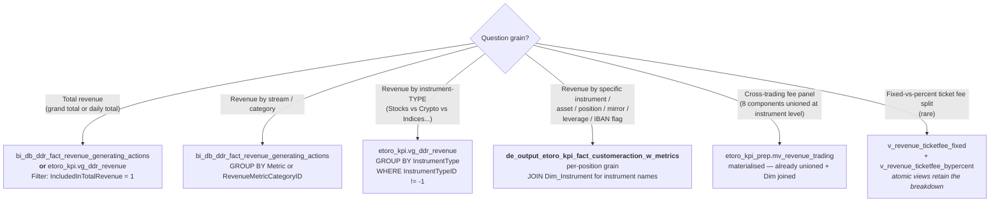

# H.1 — Trading revenue & fees (and the per-action drill-down)


## When to Use
Load when the question is about trading-platform fees — commission, rollover, ticket fees, admin fees, spot adjustment, dividends, SDRT — or when per-position / per-asset / per-copy revenue drill-down is needed.

## Scope
In scope: FullCommission, Commission, TicketFees, RollOverFee, AdminFee, SpotPriceAdjustment, Dividends, SDRT, per-position/per-action drill via fact_customeraction_w_metrics, mv_revenue_trading materialised view, DDR fact for daily aggregation
Out of scope: MIMO-side fees (ConversionFee, Cashout, TransferCoin, C2F) → fees-deposit-withdraw-fx.md; Share lending + staking → revenue-staking-and-share-lending.md; Dormant/Options/Interest → fees-misc.md; Regional platforms → spaceship/moneyfarm/options sub-skills
Last verified: 2026-05-10

This is the most-used sub-skill of the Revenue & Fees super-domain. It owns ALL **trading-platform fees** — the fees eToro charges when a customer opens, holds, or closes a position on the eToro trading platform — and the routing decision between the three canonical anchor objects.

## The 3 canonical anchors — when to use which



**Default routing:**

| If the question asks about… | Reach for | Why |
|------------------------------|-----------|-----|
| Total Net Revenue grand totals or daily totals | **DDR fact** + `IncludedInTotalRevenue = 1` | Pre-aggregated, smallest, fastest for aggregated queries. |
| Breakdown by metric / by category | **`vg_ddr_revenue`** (gives the name labels) | Adds `InstrumentType` and `RevenueMetricCategory` as resolved strings — saves a `Dim_Revenue_Metrics` join. |
| Breakdown by instrument TYPE (stocks vs crypto vs indices...) | **`vg_ddr_revenue`** + `WHERE InstrumentTypeID != -1` | Exclude account-level fees (sentinel -1) from the breakdown. |
| Drill to specific instrument / asset / position / copy / leverage / IBAN | **`fact_customeraction_w_metrics`** | Per-position grain. DDR has lost this dimension. |
| Cross-fee trading rollup at instrument-level (with position flags) | **`mv_revenue_trading`** | 8 components already unioned with `Dim_Instrument` / `Dim_Position` enrichment baked in. |
| Fixed-vs-percent ticket-fee split | `v_revenue_ticketfee_fixed` + `v_revenue_ticketfee_bypercent` | Atomic views are the only place that distinction still lives going forward (see TicketFees consolidation). |

## `de_output_etoro_kpi_fact_customeraction_w_metrics` — the per-action granular source

Inside this sub-skill, the per-action source gets headline placement. Below is the 98-column inventory grouped by purpose, so you can `SELECT` the right columns without falling into the traps in Critical Warning #1, #2, #6 of the hub.

### Identity & event keys
| Column | Type | Purpose |
|--------|------|---------|
| `GCID` | INT | Global customer ID (cross-platform anchor) |
| `RealCID` | INT | DWH customer ID |
| `PositionID` | LONG | Position primary key — the row's primary unit |
| `OriginalPositionID` | LONG | If this is a partial close, the parent position |
| `ReopenForPositionID` | LONG | Re-opened position chain |
| `Occurred` | TIMESTAMP | Event timestamp |
| `DateID` | INT | YYYYMMDD; use for partition filters |
| `OpenDateID`, `CloseDateID` | INT | Position lifecycle dates |
| `etr_y`, `etr_ym`, `etr_ymd` | STRING | Pre-computed date partitions (year / year-month / year-month-day) |

### Event-type discriminators
| Column | Notes |
|--------|-------|
| `ActionTypeID` | 1/2/3/39 = open; 4/5/6/28/40 = close; 30 = cashout; 35 = fee/dividend; 36 = compensation/admin |
| `IsFeeDividend` | For ActionTypeID = 35: 1 = Rollover, 2 = Dividend, 4 = TicketFee, 5 = SDRT |
| `CompensationReasonID` | For ActionTypeID = 36: 30 = Dormant, 117 = Admin, 118 = SpotAdjust, 119 = ShareLending |
| `SettlementTypeID` | 0=CFD, 1=Real, 2=TRS, 3=CMT, 4=RealFutures, 5=Margin |
| `MoveMoneyReasonID` | For deposits / withdrawals through eMoney |
| `PaymentStatusID` | Payment status enum |

### Trading-platform direct-action fees (the headline columns)
| Column | Maps to DDR metric |
|--------|--------------------|
| `Commission` | `Commission` (partner-share-excluded) — INFORMATIONAL, NOT in Total Net Revenue |
| `CommissionOnClose` | Closing-leg `Commission` |
| `CommissionTotal` | `Commission + CommissionOnClose` (pre-summed) |
| `FullCommission` | `FullCommission` (partner-share-included) — counts toward Total Net Revenue |
| `FullCommissionOnClose` | Closing-leg `FullCommission` |
| `FullCommissionTotal` | `FullCommission + FullCommissionOnClose` (pre-summed) |
| `CommissionByUnits`, `FullCommissionByUnits` | Per-unit decomposition (rare use) |
| `CommissionCloseAdjustment`, `FullCommissionCloseAdjustment` | Manual close-side adjustments |
| `CommissionOnCloseOrig`, `FullCommissionOnCloseOrig` | Original close-leg values before adjustment |
| `TicketFeeOpen` | Opening-leg `TicketFees` *(consolidated — see below)* |
| `TicketFeeClose` | Closing-leg `TicketFees` *(consolidated — see below)* |
| `TicketFeeAction` | Distinguishes fixed vs percent at the action-string level (legacy — going away) |
| `RollOverFee` | `RollOverFee` |
| `Dividend` | `Dividends` (pass-through, can be negative) |
| `SDRT` | `SDRT` (UK stamp duty, pass-through) |
| `AdminFee` | `AdminFee` |
| `SpotAdjustFee` | `SpotPriceAdjustment` |
| `OpenMarkupByUnits` | Per-unit markup at open |

### TicketFees consolidation — the escape hatch

**Going forward** in `fact_customeraction_w_metrics` (and later in the DDR fact), `TicketFee` and `TicketFeeByPercent` are CONSOLIDATED into a single `TicketFees` metric. There is no fixed-vs-percent split in the canonical fact at the row level.

**If a question explicitly requires the fixed-vs-percent breakdown:**
```sql
SELECT 'Fixed'   AS ticket_kind, SUM(Amount) AS revenue
FROM main.etoro_kpi_prep.v_revenue_ticketfee_fixed
WHERE DateID BETWEEN 20260101 AND 20260331
UNION ALL
SELECT 'Percent' AS ticket_kind, SUM(Amount)
FROM main.etoro_kpi_prep.v_revenue_ticketfee_bypercent
WHERE DateID BETWEEN 20260101 AND 20260331;
```

The two atomic views in `etoro_kpi_prep` retain the old breakdown as a permanent escape hatch — but the canonical fact going forward only carries `TicketFees`. Do NOT `GROUP BY` a `Metric IN ('TicketFee', 'TicketFeeByPercent')` distinction inside `w_metrics` going forward — that distinction is being collapsed there.

### MIMO-side fees (per-action grain, owned editorially by H.2 but PHYSICALLY in this table)
| Column | Maps to DDR metric |
|--------|--------------------|
| `ConversionFeeDeposit` | `ConversionFee` (deposit-side) |
| `ConversionFeeWithdraw` | `ConversionFee` (withdraw-side) |
| `ConversionFeeReversal` | `ConversionFee` (reversal-side) — sum of the three = DDR `ConversionFee` |
| `CashoutFeeExludingRedeem` | `CashoutFeeExclRedeem` |
| `TransferCoinFee` | `TransferCoinFee` |
| `DormantFee` | `DormantFee` |

### Share-lending revenue (per-action grain, owned editorially by H.3 but PHYSICALLY in this table)
| Column | Notes |
|--------|-------|
| `ShareLendingFeeEtoroShare` | eToro's 40% share |
| `ShareLendingFeeUserShare` | User's 40% share |
| `ShareLendingFeeBrokerShare` | Broker's 20% share |
| `ShareLendingGrossAmount` | Gross before the split |

### Position context & flags (these are why this table is the granular hero)
| Column | Notes |
|--------|-------|
| `InstrumentID` | Foreign key to `Dim_Instrument` — JOIN to get name / asset class / type |
| `Amount` | Position notional / fee event amount in USD |
| `Leverage` | Position leverage |
| `IsBuy` | BOOLEAN — direction |
| `NetProfit` | P&L on close |
| `MirrorID` | Copy-source CID; `MirrorID > 0` means this position is a copy of someone else's |
| `FundingTypeID` | Funding source enum |
| `IsSettled` | Real asset (1) vs CFD (0) |
| `IsActiveTrade` | Counts toward "active trade" metric |
| `IsSQF` | Sustainable & Quality-Focused instrument |
| `Is_245_Instrument` | Instrument-group flag |
| `IsCopyFund` | Smart Portfolio |
| `IsFTD` | First-time deposit flag |
| `IsAirDrop` | Free-share airdrop |
| `IsDiscounted` | Discounted-fee event |
| `IsRedeem`, `RedeemStatus`, `RedeemID` | Crypto redeem |
| `IsReOpen`, `IsPartialCloseParent`, `IsPartialCloseChild` | Position lifecycle flags |
| `IsFeeDividend` | Disambiguates ActionTypeID=35 rows |
| `IsOpenFromIBAN`, `IsClosedToIBAN` | eMoney IBAN flags |
| `IsRecurring` | Recurring investment |
| `IsC2P` | Copy-to-Portfolio |
| `ParentCID`, `ParentUserName` | Hierarchical account linkage |
| `WithdrawID`, `DepositID`, `WithdrawPaymentID`, `DividendID`, `CreditID` | FKs to related transactions |
| `DLTOpen`, `DLTClose` | Daily LP turnover flags |
| `VolumeOpen`, `VolumeClose` | Notional in instrument units |
| `InvestedAmountIn`, `InvestedAmountOut`, `BonusCompensation`, `PnLAdjustment`, `CashoutAdjustment`, `CryptoToPosition` | Various adjustment / classification amount fields |
| `NewCopyAmount`, `StopCopyAmount`, `AddToCopyAmount`, `RemoveFromCopyAmount` | Copy-trade lifecycle amounts (mirror balance changes) |
| `Description` | Free-text — last resort for disambiguation |
| `UpdateDate` | ETL load timestamp |

### Why this table beats the DDR fact for granular questions

- **Per-position grain preserved.** DDR aggregates at `(date × RealCID × metric × instrument-type × flags)` — `PositionID` is GONE there. `w_metrics` keeps it.
- **Asset-specific drill-down is a column-pick, not a `GROUP BY`.** Every direct fee is a column — `SUM(FullCommissionTotal)` per `InstrumentID` is one `JOIN Dim_Instrument` away.
- **Fast for per-position queries** — partitioned for analytical access, much smaller working set than scanning the DDR fact for `Metric = X`.
- **Copy / leverage / IBAN context inline.** No need to join to `BI_DB_CopyFund_Positions`, `External_*_opened_from_iban_parquet`, or `V_C2P_Positions` separately — the flags are pre-resolved.

## Query patterns

### Pattern 1 — Total Net Revenue (use DDR fact)
```sql
SELECT SUM(Amount) AS total_net_revenue
FROM main.bi_db.gold_sql_dp_prod_we_bi_db_dbo_bi_db_ddr_fact_revenue_generating_actions
WHERE IncludedInTotalRevenue = 1
  AND DateID BETWEEN 20260101 AND 20260331;
```

### Pattern 2 — Revenue by stream (use vg_ddr_revenue for category name)
```sql
SELECT Metric, RevenueMetricCategory, SUM(Amount) AS revenue
FROM main.etoro_kpi.vg_ddr_revenue
WHERE IncludedInTotalRevenue = 1
  AND DateID BETWEEN 20260101 AND 20260331
GROUP BY Metric, RevenueMetricCategory
ORDER BY revenue DESC;
```

### Pattern 3 — Trading vs Non-Trading split
```sql
SELECT
    CASE WHEN RevenueMetricCategoryID IN (1, 2) THEN 'Trading' ELSE 'Non-Trading' END AS split,
    SUM(Amount) AS revenue
FROM main.etoro_kpi.vg_ddr_revenue
WHERE IncludedInTotalRevenue = 1
  AND DateID BETWEEN 20260101 AND 20260331
GROUP BY split;
```

### Pattern 4 — Revenue by SPECIFIC asset (`fact_customeraction_w_metrics` granular)
```sql
SELECT
    di.Name           AS instrument_name,
    di.InstrumentType AS asset_class,
    SUM(w.FullCommissionTotal) AS commission_revenue,
    SUM(w.RollOverFee)         AS rollover_revenue,
    SUM(w.TicketFeeOpen + w.TicketFeeClose) AS ticket_fee_revenue,
    SUM(w.AdminFee + w.SpotAdjustFee)       AS overnight_admin_revenue,
    COUNT(DISTINCT w.PositionID) AS n_positions
FROM main.de_output.de_output_etoro_kpi_fact_customeraction_w_metrics w
JOIN main.dwh.gold_sql_dp_prod_we_dwh_dbo_dim_instrument di
  ON di.InstrumentID = w.InstrumentID
WHERE w.DateID BETWEEN 20260101 AND 20260331
  AND w.InstrumentID > 0
GROUP BY di.Name, di.InstrumentType
ORDER BY commission_revenue DESC
LIMIT 50;
```
**Use when:** "Top-50 assets by trading revenue", "How much did we earn from Tesla / Bitcoin / [specific instrument]?"

### Pattern 5 — Copy-trade revenue (only `w_metrics` has `MirrorID` inline)
```sql
SELECT
    CASE WHEN w.MirrorID > 0 THEN 'Copy trade' ELSE 'Direct trade' END AS trade_kind,
    COUNT(DISTINCT w.PositionID) AS n_positions,
    SUM(w.FullCommissionTotal)   AS commission_revenue,
    SUM(w.RollOverFee)           AS rollover_revenue
FROM main.de_output.de_output_etoro_kpi_fact_customeraction_w_metrics w
WHERE w.DateID BETWEEN 20260101 AND 20260331
GROUP BY trade_kind;
```
**Use when:** "Revenue from copy trades vs direct trades", "What % of our revenue comes from copy?"

### Pattern 6 — Leveraged-trade fee profile
```sql
SELECT
    CASE
        WHEN w.Leverage <= 1 THEN '1x (no leverage)'
        WHEN w.Leverage <= 5 THEN '2x-5x'
        WHEN w.Leverage <= 10 THEN '6x-10x'
        ELSE '>10x'
    END AS leverage_bucket,
    SUM(w.FullCommissionTotal) AS commission,
    SUM(w.RollOverFee)         AS rollover,
    COUNT(DISTINCT w.PositionID) AS positions
FROM main.de_output.de_output_etoro_kpi_fact_customeraction_w_metrics w
WHERE w.DateID BETWEEN 20260101 AND 20260331
GROUP BY leverage_bucket
ORDER BY positions DESC;
```
**Use when:** "Rollover fee revenue by leverage", "What's the commission profile of leveraged vs unleveraged positions?"

### Pattern 7 — IBAN-opened-position fee revenue
```sql
SELECT
    CASE WHEN w.IsOpenFromIBAN = 1 THEN 'Opened from IBAN' ELSE 'Opened from card / other' END AS funding_funnel,
    SUM(w.FullCommissionTotal) AS commission,
    COUNT(DISTINCT w.PositionID) AS positions
FROM main.de_output.de_output_etoro_kpi_fact_customeraction_w_metrics w
WHERE w.DateID BETWEEN 20260101 AND 20260331
  AND w.ActionTypeID IN (1, 2, 3, 39)  -- opens only
GROUP BY funding_funnel;
```
**Use when:** "Revenue from IBAN-funded positions", "Are eMoney users more / less profitable?"

### Pattern 8 — `mv_revenue_trading` cross-fee trading rollup
```sql
SELECT
    InstrumentType,
    IsSettled,
    IsCopy,
    SUM(Amount) AS revenue
FROM main.etoro_kpi_prep.mv_revenue_trading
WHERE DateID BETWEEN 20260101 AND 20260331
  AND InstrumentTypeID != -1
GROUP BY InstrumentType, IsSettled, IsCopy
ORDER BY revenue DESC;
```
**Use when:** "Trading revenue split by Real vs CFD vs Copy", "What's our revenue per instrument type with the flags broken out?"

## Critical Warnings (specific to trading fees)

1. **Never sum `Commission` and `FullCommission` together** — `Commission` is a subset of `FullCommission` (excludes the partner / affiliate share). Sum ONE family per KPI. `FullCommissionTotal` is the right column for Total Net Revenue purposes.
2. **`TicketFeeOpen` and `TicketFeeClose` are mutually exclusive per row** (a position-open row populates Open; a position-close row populates Close). To get total ticket fees per position, `SUM(TicketFeeOpen + TicketFeeClose)`. Going forward they are both `TicketFees` (no fixed/percent split).
3. **`Dividends` and `SDRT` are pass-through** — they are NOT eToro revenue. Filter them out of Total Net Revenue with `IncludedInTotalRevenue = 1`. Inside `w_metrics`, do NOT include `Dividend` or `SDRT` columns in revenue summations unless you've labelled them as pass-through.
4. **`MirrorID = 0` means "direct trade" (not a copy)** — `IsCopy` is just `CASE WHEN MirrorID > 0 THEN 1 ELSE 0 END`. Inside `mv_revenue_trading` the `IsCopy` flag is pre-computed.
5. **`AdminFee` and `SpotAdjustFee` are NOT trading fees in the strict sense** — they are admin-side and only flow on `ActionTypeID = 36` (compensation). The DDR fact and `mv_revenue_trading` bucket them under Overnight (category 2) by convention, but they don't have an instrument tied to them — `InstrumentTypeID = -1`.
6. **`DateID` partition is mandatory** on `w_metrics`, DDR, and `mv_revenue_trading`. All three are billions of rows.
7. **Use `vg_ddr_revenue` over the raw DDR fact when possible** — saves a `Dim_Revenue_Metrics` join and gives `InstrumentType` and `RevenueMetricCategory` as resolved string columns.
8. **Closed positions only have `CloseDateID` populated**, opens only have `OpenDateID`. For per-position lifecycle questions (open through close), you may need `WHERE OpenDateID BETWEEN ... OR CloseDateID BETWEEN ...` or split the query.

## Cluster provenance

- `fact_customeraction_w_metrics` — Cluster 13 (DDR family — sits alongside the DDR fact).
- `BI_DB_DDR_Fact_Revenue_Generating_Actions` — Cluster 13.
- `mv_revenue_trading` — Cluster 47 (Finance Recon, outflow).
- `v_revenue_*` atomic views — `etoro_kpi_prep` schema, scattered across multiple clusters by their join partners.

## Source of truth

- DDR table: derived from Synapse SP `SP_DDR_Fact_Revenue_Generating_Actions` (see Tier-2 comments on every column).
- `mv_revenue_trading`: defined in `/Users/guyman@etoro.com/a_semantic_etoro_kpi_prep/` (canonical view scripts repo).
- `fact_customeraction_w_metrics`: maintained by the DE / KPI team; canonical action-grain fee panel.
- `Dim_Revenue_Metrics`: the 18-row dictionary — always join for human-readable labels.
