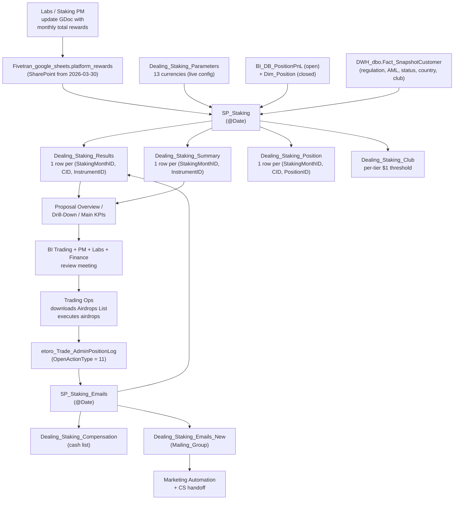

# Staking Distribution & Operations Super-Domain

Staking at eToro is a **monthly distribution program**: customers who hold one of 13 supported cryptocurrencies over a calendar month receive a share of the network rewards eToro earned by staking the pooled holdings. The math is straightforward (avg daily eligible units × monthly yield × club revenue share), but the operational machinery around it is not: four stored procedures, eight eligibility gates, two parallel opt-in conventions (ETH is opt-out by default; every other coin is opt-in), nine output tables, seven FailReasonID codes, a 6-vs-7-digit `StakingMonthID` re-run trap, and a multi-team monthly cycle (Labs → Staking PM → BI Trading → Trading Ops → Marketing → CS).

This super-domain is about **HOW rewards are calculated and distributed**. It is not about:

- **eToro's booked staking revenue / accounting lag** — that's `domain-revenue-and-fees/revenue-staking-and-share-lending.md`. The DDR `Metric = 'StakingLagOneMonth'` rows land in the FOLLOWING month's `DateID` (e.g. February's rewards distribute and book in March); that one-month lag is documented there. **The operational lens (this hub) answers the "how" and "why CID X"; the revenue lens answers "how much did eToro book and when".**
- **The trading positions feeding the calculation** — `Dim_Position` (closed) and `BI_DB_PositionPnL` (still open at the period end) are the inputs to SP_Staking. Position lifecycle and metadata live in `domain-trading/position-state-and-grain.md`.
- **The eligibility-source columns themselves** (RegulationID, AccountTypeID, PlayerLevelID, PlayerStatusID, CountryID semantics) — those master-data definitions live in `domain-customer-and-identity/customer-master-record.md` and `customer-models-and-segmentation.md`. SP_Staking READS those columns; the per-column definitions are owned elsewhere.
- **AML screening operations** — `domain-compliance-and-aml/SKILL.md`. SP_Staking uses `IsAML_Restricted` as a hard gate but does not define it.
- **Customer wallet / EXW staking operations** (OLTP-layer truth in `Wallet.dbo.Staking_*`) — those are the on-chain settlement and customer-balance side, owned by `domain-payments/crypto-wallet.md`.

## The four lenses on staking — pick the right one

| Lens | Anchor | When to load |
|---|---|---|
| **Distribution & calculation** (this hub) | `Dealing_dbo.Dealing_Staking_*` family (9 tables); `SP_Staking`, `SP_Staking_Emails`, `SP_Staking_DailyPool`, `SP_Staking_WelcomeEmail` | "How are rewards calculated?", "Why did CID X get $Y?", "What does the pipeline do?", "What does StakingMonthID 2025030 mean?" |
| **Revenue accounting** | `etoro_kpi_prep.v_revenue_stakingfee`, DDR `StakingLagOneMonth` rows, `general.gold_tres_staking_data_staking_data` (treasury report) | "How much did eToro book in staking revenue for Q1?", "Why is February's revenue showing March's number?" — route to `domain-revenue-and-fees/revenue-staking-and-share-lending.md` |
| **Customer wallet / OLTP truth** | `wallet.bronze_walletdb_staking_*` family | "What rewards landed in customer X's wallet?", on-chain settlement, audit drill-downs — route to `domain-payments/crypto-wallet.md` |
| **Trading position lineage** | `Dim_Position`, `BI_DB_PositionPnL` | "What positions fed into this CID's staking pool?", "How long was the position open?" — route to `domain-trading/position-state-and-grain.md`. SP_Staking joins these as INPUTS; the position lifecycle itself is trading's domain. |

## When to Use

Load when the question is about:

- "How are staking rewards calculated for [coin/tier/CID]?" — see [`rewards-formula-and-calculation.md`](rewards-formula-and-calculation.md)
- "Why isn't CID X eligible?", "what eligibility gates apply?", "what blocks ETH for opted-in clients?" — see [`eligibility-and-gates.md`](eligibility-and-gates.md)
- "What's the IntroDays / LiquidityBuffer for [coin]?", "when did [coin] launch?", "what's the EUR variant InstrumentID?" — see [`currency-catalog-and-parameters.md`](currency-catalog-and-parameters.md)
- "Walk me through SP_Staking → SP_Staking_Emails", "what FailReasonID means X?", "what Mailing_Group does this row belong to?" — see [`distribution-pipeline.md`](distribution-pipeline.md)
- "Why is MAX(StakingMonthID) returning 7 digits?", "what does StakingMonthID 2025030 mean?", "how does the delta airdrop work after a re-run?" — see [`staking-month-id-and-reruns.md`](staking-month-id-and-reruns.md)
- "Which CountryIDs receive cash instead of crypto?", "what's the cash-equivalent country list?"
- "How much was the total monthly pool / yield / RevShareCommission for [month]?"
- "What's the difference between Dealing_Staking_Position and Dealing_Staking_Results?"

Do **not** load for:

- eToro-side staking revenue, the 1-month lag, share-lending split — `domain-revenue-and-fees/revenue-staking-and-share-lending.md`
- On-chain settlement / wallet-level staking truth — `domain-payments/crypto-wallet.md`
- The crypto position itself / asset class semantics — `domain-trading/instruments-and-asset-classes.md`
- Customer master attributes feeding eligibility (CountryID labels, AccountTypeID definitions) — `domain-customer-and-identity/customer-master-record.md`
- AML screening operations — `domain-compliance-and-aml/SKILL.md`

## Scope

In scope: the four staking SPs (`SP_Staking`, `SP_Staking_Emails`, `SP_Staking_DailyPool`, `SP_Staking_WelcomeEmail`); the nine output / reference tables under `Dealing_dbo.Dealing_Staking_*` (Parameters, Summary, Results, Position, Club, DailyPool, OptedOut, OptedOut_PerCID, Emails_New, Compensation); the 13-currency catalogue with `IntroDays` / `LiquidityBuffer` / `Distribution_StartDate` / EUR-variant remapping rules; the reward formula end-to-end (daily snapshot → IntroDays haircut → avg daily eligible → monthly yield → club RevShare 0.45–0.90 → USD conversion) and the $1 USD eligibility floor; the eight eligibility gates (US regulation, Tangany custody, no regulation, Smart Portfolio, Etorian, ~80 ineligible CountryIDs, AML restricted, inactive); the ETH opt-out-by-default vs every-other-coin opt-in-by-default convention; the cash-equivalent CountryIDs (63, 67, 94, 96, 105, 148, 167); the seven FailReasonID codes; the seven Mailing_Groups; the 6-digit-vs-7-digit `StakingMonthID` re-run convention and the shadow-direction rule (broken rows → 7-digit, new authoritative → 6-digit); the delta-airdrop pattern after a re-run; cross-references to UC mirror tables and the revenue-side StakingLagOneMonth metric.
Out of scope: booked eToro staking revenue / DDR `StakingLagOneMonth` accounting (`domain-revenue-and-fees/revenue-staking-and-share-lending.md`); on-chain settlement and customer wallet truth (`domain-payments/crypto-wallet.md`); the position lifecycle feeding SP_Staking as input (`domain-trading/position-state-and-grain.md`); per-column master-data semantics for RegulationID / AccountTypeID / PlayerLevelID / PlayerStatusID / CountryID (`domain-customer-and-identity/customer-master-record.md`); AML screening operations (`domain-compliance-and-aml/SKILL.md`); the FLR quarterly rewards program (separate cadence, not yet on this hub).
Last verified: 2026-05-28

## Critical Warnings

> **Tier 0 — Filter Contract (cross-cutting).** Every per-customer staking aggregate in this domain (staking-eligible customers per regulation, average reward per club tier, eligible-customer churn between StakingMonthIDs, staking-active-customers per coin × jurisdiction, per-CID reward totals) MUST follow [`../cross-cutting/valid-users-filter-contract.md`](../cross-cutting/valid-users-filter-contract.md): silent SCD-2 walk on `V_Fact_SnapshotCustomer_FromDateID` with `IsValidCustomer = 1` and `DateID BETWEEN snap.FromDateID AND snap.ToDateID` (period-correct — never current-state `Dim_Customer` for period queries; for staking, derive `DateID` from `StakingEndDate` or the distribution date, not from the raw `StakingMonthID` which is YYYYMM-shaped and includes 7-digit re-run sentinels — see Tier-1); mandatory one-line scope footer on every numeric output. The carve-out: pure per-coin / per-StakingMonthID aggregates from `Dealing_Staking_Summary` ("total ETH staked in 2024-10", "reward yield per coin per month", "currency-catalog coverage by tier") are not per-customer and do NOT need the filter. The moment the question rolls up per-CID, the contract kicks in. The regulatory variant (`IsCreditReportValidCB = 1`) fires ONLY when the user explicitly says "CB valid" / "Client Balance valid" / "credit-report valid" — never on topic heuristics. Opt-out (unfiltered, include non-valids / internals / etorians / test) only on explicit user request. Never pre-flight.

1. **Tier 1 — `MAX(StakingMonthID)` lands on shadow re-runs, not the latest real month.** `StakingMonthID` is usually 6-digit `YYYYMM` (e.g. `202604` = April 2026), but re-runs after distribution incidents use 7-digit IDs of the form `YYYYMM0` (`2025030` = March 2025 re-run after MICA; `2024100` = October 2024 ETH re-run). Because `7-digit > 6-digit` numerically, naive `MAX(StakingMonthID)` returns a re-run. **Always filter `WHERE StakingMonthID < 1000000`** OR use `MAX(StakingEndDate)` instead. The full re-run convention (including the shadow-direction rule below) lives in [`staking-month-id-and-reruns.md`](staking-month-id-and-reruns.md).

2. **Tier 1 — Shadow direction is counter-intuitive: BROKEN rows move to the 7-digit ID; the NEW authoritative numbers land under the original 6-digit ID.** When a re-run happens, an UPDATE statement rewrites the old, incorrect rows' `StakingMonthID` from `202503` to `2025030` (broken → shadow), then SP_Staking re-runs and writes the corrected rows into a clean `202503`. So `WHERE StakingMonthID < 1000000` always returns the authoritative numbers; the 7-digit IDs are an audit trail only. Most analysts guess the opposite — confirm with the SQL in `Issues/<month>/SPs/1- Store old results.sql` before designing a query against either ID.

3. **Tier 1 — `AirdropOccurred = '1900-01-01'` AND `NULL` both mean "no airdrop happened".** Pre-August-2025 rows use the `1900-01-01` sentinel; newer rows use `NULL`. Always filter out BOTH when querying real distributions: `WHERE AirdropOccurred IS NOT NULL AND AirdropOccurred <> '1900-01-01'`. Forgetting either gives inflated airdrop counts and totally wrong "last airdrop date" results.

4. **Tier 1 — ETH is opt-OUT by default; every other coin is opt-IN by default.** ETH uses `UserProgramID = 3` (opt-out default); all other coins use `UserProgramID = 2` (opt-in default). This single inversion has caused two of the five historical incidents — including the October 2024 incident where SP_Staking failed to correctly enroll explicitly-opted-IN ETH clients. The `IsOptedIn_ETH` flag was added to `Dealing_Staking_Position` after Nov 2024 to make ETH eligibility queryable without re-deriving the inversion. **When querying ETH eligibility, always check `IsOptedIn_ETH = 1` explicitly; for every other coin, the default opt-in is implicit and the flag does not apply.**

5. **Tier 2 — Platform consent flows can silently reset opt-in timestamps and re-trigger the IntroDays gate for long-standing users.** This is the March 2025 MICA incident pattern: an EU regulatory consent pop-up forced users to re-acknowledge, and the platform recorded the click-through as a *new* opt-in. For non-ETH coins (opt-in by default), long-standing eligible CIDs were re-stamped as "first-time opted-in" on their pop-up date, then failed SP_Staking's `IntroDays` gate (which requires N days of opt-in before a position starts counting — see `Dealing_Staking_Parameters.IntroDays`). **Audit pattern**: when proposal-review numbers show an unexpected MoM drop in eligible CIDs or units, compare `MIN(OptedInDate)` per CID against expected program start dates and recent UI/consent-flow change windows before assuming an SP bug. Any new pop-up or consent change must be reviewed against this gate.

6. **Tier 2 — Upstream data staleness invalidates SP_Staking output even when the SP code is correct.** AML status (`DWH_dbo.Fact_SnapshotCustomer.IsAML_Restricted`) and the opt-in timestamps SP_Staking joins to MUST be current. The December 2024 incident pattern was exactly this: SP_Staking logic unchanged, but stale AML inputs let restricted CIDs through the gate. **Audit pattern**: when staking numbers look off but no SP change was deployed, check the upstream freshness — `MAX(UpdateDate)` on the source tables and the Fivetran sync log — before opening an SP bug.

7. **Tier 2 — `SP_Staking_Emails` has no "all airdrops failed" guard.** Its trigger is (a) airdrop rows present in `etoro_Trade_AdminPositionLog` for the month with `OpenActionType = 11`, (b) latest airdrop arrived > 3 hours ago, (c) `Dealing_Staking_Compensation` empty for that month. If every airdrop FAILED (`State <> 3` on every row), the SP still fires on bad data and writes a wrong Compensation table that classifies everyone as Cash-or-None. **Audit pattern**: before trusting post-airdrop `Compensation` data, verify at least one row in `etoro_Trade_AdminPositionLog` for the month has `State = 3` (= success). If zero successes, the Compensation table for that month is suspect.

8. **Tier 2 — Delta-only second airdrop after a re-run: don't double-count.** Trading Ops only airdrops `new_USD − old_USD` above the $1 threshold; CIDs whose original payout already exceeded the corrected amount keep what they got and are marked `ActualCompensationType = 'Already received <reRunID>'` (e.g. `'Already received 2025030'`). When computing total distributed for a month that had a re-run, UNION the 6-digit and 7-digit `StakingMonthID` rows then de-duplicate by `(CID, InstrumentID)` taking the max payout. Don't sum both blindly.

9. **Tier 2 — The `< $1` USD eligibility floor.** If `Client_Airdrop × USD_ConversionRate < $1`, the row is flagged `IsEligible = 0` with `NonEligible_PrimaryReason = 'Less than $1'`, `Client_Airdrop` is set to 0, and the would-be reward accrues to `Etoro_Amount` instead. Tiny positions (a handful of TRX, small DOT holdings) routinely show `USD_Compensation` near zero and no airdrop. The floor has been in effect since August 2024.

10. **Tier 3 — `Dealing_Staking_Parameters` is the LIVE config snapshot, not history.** It has one row per supported coin with the CURRENT `IntroDays` and `LiquidityBuffer`. For historical analyses (what value was actually used in March 2025?) use `Dealing_Staking_Summary.IntroDays` and `Dealing_Staking_OptedOut.LiquidityBuffer` — those are frozen per-month. Use `Parameters` only when asking about current settings or program launch dates.

11. **Tier 3 — EUR-variant InstrumentIDs are remapped to their USD-denominated equivalents for the calculation.** `ETHEUR (100110) → ETH (100001)`, `SOLEUR (100456) → SOL (100063)`, `ADAEUR (100458) → ADA (100017)`. The EUR variants get their own rows in `Dealing_Staking_Parameters` (so you'll see 13 rows there), but downstream `Position` / `Results` / `Summary` use the remapped USD InstrumentID. When filtering by `InstrumentID` for ADA across both variants, use `InstrumentID = 100017` and `Currency LIKE 'ADA%'` — but be aware most analytical queries care about coin, not denomination.

12. **Tier 3 — Synapse has nine staking tables; Unity Catalog has only five.** Mirrored to UC: `Parameters` → `main.finance.*`, `Summary` → `main.dealing.*`, `Results` → `main.bi_db.*`, `DailyPool` → `main.finance.*`, `OptedOut` → `main.finance.*`. **NOT in UC** (Synapse-only): `Dealing_Staking_Position` (~174.5M rows; eligibility flags per position), `Dealing_Staking_Club` (864 rows; per-tier `Avg_Daily_Holdings_Threshold`), `Dealing_Staking_OptedOut_PerCID` (~661M rows; per-CID daily opt-in detail), `Dealing_Staking_Emails_New` (~2.07M rows; mailing groups + per-CID per-coin payout), `Dealing_Staking_Compensation` (cash compensation list). For per-position eligibility, per-CID opt-in history, or cash-compensation analytics, route through Synapse. For per-coin × month aggregates and per-(CID, coin, month) Results queries, Databricks UC suffices.

13. **Tier 3 — `Dealing_Staking_OptedOut_PerCID` is 661M rows; always filter by Date and/or CID.** Full scans of this table are an outage waiting to happen.

14. **Tier 3 — `Emails_New` uses `GCID`, not `CID`.** Subtle grain shift — a client can have multiple CIDs but one GCID. When joining `Emails_New` to `Results`, decide explicitly which key to use. `Results` carries both; `Emails_New` carries only `GCID`.

15. **Tier 3 — The eligibility cascade is hard-coded and shared across SPs.** Any change to one stored procedure (country list, regulation list, account-status list) must be replicated in `SP_Staking`, `SP_Staking_Emails`, and `SP_Staking_DailyPool`. The Tableau workbook custom queries (Proposal Overview, Drill-Down, Airdrops List, Opted-Out Monitoring) embed the same lists and need to be reviewed in lockstep. When adding a new currency, see the "Process of Adding a New Currency" table in [`currency-catalog-and-parameters.md`](currency-catalog-and-parameters.md).

## Mental model — the monthly distribution cycle

**Routing rules**:

- "What rewards did CID X get for month M, coin C?" → `Dealing_Staking_Results` row at `(M, X, C)`.
- "What did clients collectively get for coin C in month M?" → `Dealing_Staking_Summary` (178 rows, fast). Avoid `Results` scans of 22M rows for per-coin aggregates.
- "Why was CID X not eligible?" → `Dealing_Staking_Position` (Synapse only) — has every eligibility flag per (Month, CID, PositionID).
- "What was the daily opt-in trajectory for CID X across the month?" → `Dealing_Staking_OptedOut_PerCID` (Synapse only) filtered by `(CID, Date)`.
- "Which CIDs received a cash compensation instead of airdrop?" → `Dealing_Staking_Compensation` (Synapse only).
- "What did Marketing send and to whom?" → `Dealing_Staking_Emails_New` (Synapse only) — note `GCID` not `CID`.
- "What's the current IntroDays for AVAX?" → `Dealing_Staking_Parameters`.
- "What were the parameters used for the March 2025 distribution?" → `Dealing_Staking_Summary` for `IntroDays`, `Dealing_Staking_OptedOut` for `LiquidityBuffer` — both frozen per-month.

## Sub-skill routing

| Sub-skill | Anchor (UC or Synapse) | When to load |
|---|---|---|
| [`rewards-formula-and-calculation.md`](rewards-formula-and-calculation.md) | `Dealing_Staking_Summary`, `Dealing_Staking_Results`, `Dealing_Staking_OptedOut_PerCID`, `Dealing_Staking_Position` | The full reward formula end-to-end, the six-tier RevShare ladder (Bronze 0.45 → Diamond 0.90), the `IntroDays` haircut mechanics, the `$1 USD` floor, the EUR-variant remapping, a worked CID example, the "why is my number lower than expected" diagnostic chain. |
| [`eligibility-and-gates.md`](eligibility-and-gates.md) | `Dealing_Staking_Position` (Synapse), `DWH_dbo.Fact_SnapshotCustomer` | The eight exclusion rules (US regulation 6/7/8/14, Tangany, no regulation, Smart Portfolio AccountTypeID 9, Etorian CountryID 250, ~80 ineligible CountryIDs, AML restricted, inactive), the cash-equivalent country list (63, 67, 94, 96, 105, 148, 167), the ETH-opt-out-by-default inversion (`UserProgramID = 3` vs `= 2`), the `IsOptedIn_ETH` flag, the MICA consent-pop-up gotcha (forward-looking pattern), waiver mechanics. |
| [`currency-catalog-and-parameters.md`](currency-catalog-and-parameters.md) | `Dealing_Staking_Parameters` | The 13 currencies with `InstrumentID` / `IntroDays` / `LiquidityBuffer` / `Distribution_StartDate`; ETH's dynamic 15–70 day intro; EUR variants (ETHEUR / SOLEUR / ADAEUR) and their USD-equivalent remapping; the "Process of Adding a New Currency" cascade (Synapse parameters → SP_Staking_Emails columns → 4 Tableau views). |
| [`distribution-pipeline.md`](distribution-pipeline.md) | All 9 `Dealing_Staking_*` tables, `etoro_Trade_AdminPositionLog`, `Fivetran_google_sheets.platform_rewards` | The four stored procedures (`SP_Staking`, `SP_Staking_Emails`, `SP_Staking_DailyPool`, `SP_Staking_WelcomeEmail`), their triggers, step-by-step logic, output tables; the seven `FailReasonID` codes and their compensation mappings; the seven `Mailing_Group` categories; the monthly operational timeline (Reconciliation → Rewards Calculation → Distribution → Compensation → Post Distribution). |
| [`staking-month-id-and-reruns.md`](staking-month-id-and-reruns.md) | `Dealing_Staking_Results`, `Dealing_Staking_Summary`, `Dealing_Staking_Position`, `Dealing_Staking_Compensation` | The 6-vs-7-digit convention; shadow direction (broken → 7-digit, new → 6-digit); the `MAX(StakingMonthID)` trap; the delta-airdrop pattern (`new_USD − old_USD > $1`); the `'Already received <reRunID>'` ActualCompensationType marker; query patterns for "last completed month" / "all-time" / "specific re-run audit"; AML-staleness pattern and the SP_Staking_Emails-on-failed-airdrop pattern as forward-looking gotchas. |

## Cross-domain federation

| Cross-domain | Connects | When to load |
|---|---|---|
| `../domain-revenue-and-fees/revenue-staking-and-share-lending.md` | This hub (HOW rewards calculate) ↔ revenue lens (WHEN eToro books the revenue, with 1-month lag) | Whenever a question crosses "how was X calculated" + "how does X show up in revenue reports". The DDR `Metric = 'StakingLagOneMonth'` row for booking-month M sources from the staking distribution in month M-1. |
| `../domain-payments/crypto-wallet.md` | This hub (eToro-side calculation of distribution) ↔ wallet OLTP (the actual airdrop landing in the customer's crypto wallet) | "Did CID X's airdrop hit their wallet?" — Results says the airdrop was made; wallet shows the on-chain confirmation. |
| `../domain-trading/position-state-and-grain.md` | This hub (uses BI_DB_PositionPnL and Dim_Position as INPUTS) ↔ trading hub (owns the position lifecycle) | "What positions fed into CID X's March pool?" — route to trading for the lifecycle answer, then back here for the staking-side use of those positions. |
| `../domain-customer-and-identity/customer-master-record.md` | This hub (reads `RegulationID`, `AccountTypeID`, `PlayerLevelID`, `PlayerStatusID`, `CountryID` for eligibility) ↔ customer hub (owns the master-data semantics) | When the question is about WHAT a regulation/status/club ID means, route to customer-master-record. When it's about HOW staking eligibility uses those IDs, stay here. |
| `../domain-compliance-and-aml/SKILL.md` | This hub (reads `IsAML_Restricted`) ↔ compliance hub (owns AML screening operations) | The December 2024 AML-stale incident pattern straddles both — the SP is correct, the upstream is stale. |

## Cross-cutting facts

- **The grain hierarchy** (smallest → largest):
  - `Dealing_Staking_OptedOut_PerCID` — 1 row per (Date, CID, InstrumentID). ~661M rows. Synapse only.
  - `Dealing_Staking_Position` — 1 row per (StakingMonthID, CID, PositionID). ~174.5M rows. Synapse only.
  - `Dealing_Staking_Results` — 1 row per (StakingMonthID, CID, InstrumentID). ~22.3M rows. In UC (`main.bi_db.gold_*`).
  - `Dealing_Staking_Emails_New` — 1 row per (StakingMonthID, GCID, Currency). ~2.07M rows. Synapse only.
  - `Dealing_Staking_Club` — 1 row per (StakingMonthID, InstrumentID, PlayerLevel). 864 rows. Synapse only.
  - `Dealing_Staking_OptedOut` — 1 row per (Date, InstrumentID, Regulation). ~34.8K rows. In UC.
  - `Dealing_Staking_DailyPool` — 1 row per (Date, InstrumentID). ~5.9K rows. In UC.
  - `Dealing_Staking_Summary` — 1 row per (StakingMonthID, InstrumentID). ~178 rows. In UC. **Use this for fast aggregate questions.**
  - `Dealing_Staking_Parameters` — 1 row per supported coin. 13 rows. In UC. **Live config snapshot, not history.**

- **USD values live directly on the tables — no FX join needed.** `Results.USD_Compensation` and `Results.Etoro_Amount_USD`; `Summary.ClientUSD`, `Summary.EtoroUSD`, `Summary.USD_ConversionRate`; `Position.Total_USD`; `OptedOut.EligibleValue` / `OptedInValue` / `OptedOutValue`; `OptedOut_PerCID.EligibleValue`. Pull the conversion rate from `Summary.USD_ConversionRate` if a historical conversion is needed.

- **`Summary` is per-coin × month; `Results` is per-(CID, coin, month).** Use `Summary` for "how much did clients collectively get for coin C in month M?" (178 rows) — answers in milliseconds. Drop to `Results` only when the question needs a CID, country, club tier, or any other below-coin-aggregate breakdown (22.3M rows).

- **The reward formula in one line:** `USD_Compensation = (Σ daily_eligible_units / days_in_month) × monthly_yield × RevShare × USD_ConversionRate`, where `daily_eligible_units` excludes positions still inside their `IntroDays` window, `monthly_yield = AnnualizedYield / 12` and `RevShare` is `{Bronze: 0.45, Silver: 0.55, Gold: 0.65, Platinum: 0.75, Platinum Plus: 0.85, Diamond: 0.90}` from `PlayerLevelID`.

- **`Mar 2025` and `Oct 2024` are the two re-run months that left visible shadow IDs.** Be aware of `StakingMonthID IN (202503, 2025030, 202410, 2024100)` whenever scanning all-time staking data. The April 2024 and May 2024 incidents were corrected in place (no shadow ID). The December 2024 AML incident did not produce a Results re-write — CS handled compensation case-by-case.

## What this skill is NOT

- It does not own the eToro-side revenue booking — `domain-revenue-and-fees/revenue-staking-and-share-lending.md` does. That sub-skill already lists the `Dealing_Staking_*` UC tables in `required_tables`; the operational lens here complements (not replaces) the revenue lens.
- It does not own the OLTP wallet truth (`wallet.bronze_walletdb_staking_*`) — that's `domain-payments/crypto-wallet.md`.
- It does not contain SQL — the sub-skills do. The hub routes only.
- It is not a wiki — per-column detail for the `Dealing_Staking_*` tables lives in `knowledge/synapse/Wiki/Dealing_dbo/Tables/Dealing_Staking_*.md` (once authored).

## Skill provenance

- **Source corpus**: `eToro/Staking` private repo (default branch `main`, last pushed 2026-05-13). Distilled from `README.md` (22.3 KB), `How are staking rewards calculated.md`, `Staking_Presentation.md`, the four files under `agent/context/` (`glossary.md`, `tables.md`, `issues.md`, `dashboards.md`) and the two files under `agent/examples/`. The repo's `agent/context/` folder was pre-distilled by the repo owner (Ziv Shtizer) for a Claude-powered staking-ops bot; this skill is a second-stage distillation specifically scoped to the operational lens.
- **UC table mapping** queried live on 2026-05-28 against `main.information_schema.tables`. Five of nine `Dealing_Staking_*` tables are mirrored to UC; four (Position, Club, OptedOut_PerCID, Emails_New, Compensation) remain Synapse-only.
- **Forward-looking gotchas** derived from five documented incident postmortems (April 2024, May 2024, October 2024 ETH, December 2024 AML, March 2025 MICA) — encoded as patterns and audit queries in the Critical Warnings here and in `staking-month-id-and-reruns.md` / `eligibility-and-gates.md`, not as a static incident log (user preference: "this could always happen again, so a static history isn't useful as a skill — should be knowledge + gotchas + query filters to apply or avoid").
- **Federates with** the existing `domain-revenue-and-fees/revenue-staking-and-share-lending.md` (revenue lens, 1-month lag, share-lending 40/40/20 split). A cross-link is added to that sub-skill pointing here for operational questions.
- **v1 (2026-05-28)**: initial hub, five sub-skills, no `id:` field (post-DD-1747 schema). Personal-workspace only; not yet pushed to DataPlatform.
