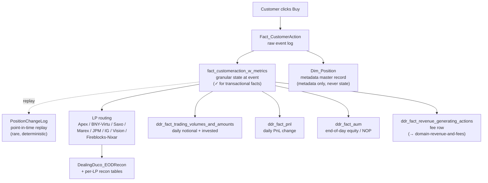

# Trading & Markets Super-Domain

A trade on eToro is **not one row in one table** — it is a lifecycle. A customer clicks Buy on Tesla, that triggers an opening `Fact_CustomerAction` row, which creates a `Dim_Position` master record, which gets enriched into `fact_customeraction_w_metrics`, which routes through one or more liquidity providers (Apex for US equity, BNY/Virtu for non-US equity, Marex / JPM / IG / Vision for CFDs, Fireblocks / Nixar for crypto settlement), gets reconciled end-of-day in `Dealing.DealingDuco_EODRecon`, contributes to volume in `bi_db_ddr_fact_trading_volumes_and_amounts`, accrues PnL in `bi_db_ddr_fact_pnl`, sits in the customer's end-of-day equity in `bi_db_ddr_fact_aum`, and finally throws off a fee row in `bi_db_ddr_fact_revenue_generating_actions`. Different questions live at different points in that lifecycle — and the **same position has different "states" at each point**.

This super-domain is about **WHAT customers traded and HOW the trade was executed**. It is **not** about:

- **Who the customer is, their identifiers, jurisdiction, club tier, segment** → Customer & Identity super-domain (`../domain-customer-and-identity/SKILL.md`).
- **Money flow into / out of the customer wallet** (deposits, withdrawals, MIMO, IBAN flows, FTDs) → Payments super-domain (`../domain-payments/SKILL.md`). Trading IS the destination of those funds — but the deposit-side question routes there.
- **Fee revenue or fee composition on a trade** → Revenue & Fees super-domain (`../domain-revenue-and-fees/SKILL.md`). The trade VOLUME stays here; the COMMISSION/ROLLOVER/TICKET_FEE revenue lives there. The two are linked by `PositionID` / `ActionID`.
- **AML risk classification, sanctions, PEP, watchlist alerts on a trade** → Compliance super-domain (planned).

When a question is about **the trade itself** (what instrument, what volume, what price, was it a copy, did it fill, what was the slippage), it stays here. When it is about **the fee that trade generated** ("how much commission did Tesla trades produce?"), route to Revenue & Fees and use `PositionID` to link back.

## The Broker-Dealer model — the governing principle inside this super-domain

eToro's trading platform is a **Broker-Dealer**. That word is two roles glued together, and the split runs through this whole super-domain:

| Side | Faces | What it owns | Primary UC schemas | Primary Synapse schemas |
|---|---|---|---|---|
| **BROKER** | The customer | Position state (open/close/modify), the trade as the customer experiences it, the fee they pay, P&L they see, copy/mirror configuration, customer-side flags | `main.dwh.*` (Dim_Position, Fact_CustomerAction, Dim_Mirror, Dim_Instrument), `main.de_output.*` (w_metrics), `main.bi_db.*` (DDR facts: AUM, PnL, trading volumes, revenue-generating actions) | `DWH_dbo`, `BI_DB_dbo`, `Trade` (the customer-visible tables: PositionTbl, OpenedPositions, ClosedPositions), `History` (OrderEntry/Exit, customer-visible order tables) |
| **DEALER** | The LP / market | Execution events, hedge orders, fill prices, slippage, latency, LP reconciliation, settlement shortfalls, hedge cost, FIX routing, EMS/HBC plumbing | `main.dealing.*` (bestexecution_results, bronze hedge logs, per-LP recon tables, Nixar crypto), `main.bi_db.gold_*_dealing_*` (bridge views) | `Hedge` (ExecutionLog, HBCExecutionLog, ManualOrderExecutionLog, Netting, all the Report_* SPs), `Dealing_dbo`, `History.Orders` (provider-side hedge orders — distinct from customer orders) |

**The bridge nuance** (the thing that tripped up the prior best-execution skill): the **dealer side** routinely **reaches DOWN to broker-side artifacts** in its own SPs — `SP_DataForDuco` joins `Hedge.Netting` to `BI_DB_PositionPnL` and `Dim_Instrument`; `Hedge.Report_TCA` joins to `Trade.LiquidityAccounts`; `bestexecution_results` carries `PositionID`, `CID`, `OrderID`, `ExecutionID`, `PriceRateID` all in the same row. These dealer artifacts are **bridge tables**: they look broker-shaped on one side and dealer-shaped on the other.

The reverse does NOT happen. Broker-side tables (`Dim_Position`, `Fact_CustomerAction`, `fact_customeraction_w_metrics`, the DDR facts) do NOT carry `OrderID` / `ExecutionID` / `PriceRateID` / LP routing metadata — and that is **by design**, not an omission. Asking a broker-side table for slippage / NBBO / latency / fill state is a category error.

### Routing rules driven by the model

| Question shape | Side | Anchor type |
|---|---|---|
| "What did the customer trade?" / "what position?" / "what fee did they pay?" / "what's their P&L?" | **Broker** | Pure broker-side tables (Dim_Position, w_metrics, DDR facts). |
| "How was the trade executed?" / "what was the slippage / latency / fill price?" / "did it route to which LP?" / "what was the hedge cost?" | **Dealer** | Pure dealer-side tables (bestexecution_results, Hedge.ExecutionLog, Dealing_Duco_EODRecon, LP recons). |
| "Which positions failed to settle on the Apex side?" / "tie the customer's trade to the LP execution that filled it" | **Bridge** (dealer → broker) | Bridge tables ONLY: bestexecution_results (carries PositionID + ExecutionID), Dealing_Duco_EODRecon (carries InstrumentID + ClientUnits + LiquidityAccountID), the per-LP recons. |
| "What was the customer experience of this trade?" / "did the customer see a delay or a re-quote?" | **Bridge** (broker view of dealer events) | bi_output_dealing_latency_compensation (the customer-pays-back register), or bestexecution_results filtered to customer-impacting outcomes. |

**Mnemonic**: if the question mentions an LP name, an OrderID/ExecutionID/PriceRateID, a hedge server, a fill, a quote, slippage, latency, TCA, or "broker break" → **dealer**. If it mentions a position, a fee, the customer's P&L, AUM, copy/mirror, settlement type, instrument metadata → **broker**. If it mentions both ("did position X's slippage cause compensation?") → **bridge table**, not a custom join.

## When to Use

Load when the question concerns position state, instrument selection, trade volume, end-of-day portfolio value, copy trading, dealing operations, liquidity-provider flow, or execution quality:

- "What's position 12345's state right now?", "what was it at open?"
- "Total notional trading volume this quarter", "real vs CFD breakdown", "volume by asset class"
- "Platform AUM today", "NOP trend this month", "unrealized PnL by instrument"
- "Tesla revenue / volume / PnL" — anything filtered by a specific instrument
- "How many trades were copies?", "Smart Portfolio AUM", "Popular Investor trade share"
- "Apex / Saxo / BNY-Virtu / Marex / JPM / IG / Vision EOD recon", "broker break", "LP discrepancy"
- "ExecutionLog for position X", "manual order audit", "HBC execution trail"
- "USD/JPY rate at 14:00 yesterday", "spot price for ETH on March 1"
- "Crypto hedge cost", "LP contract fee", "what did we pay liquidity providers"
- "Hedge cost YTD", "ICC HC last month", "net trading revenue by asset class", "why was Real Stocks HC big on date X" — route to [`hedge-cost-recon.md`](hedge-cost-recon.md), the canonical HC source (`main.bi_dealing_stg.bi_output_dealing_HC_auto_agent_v1`)
- "Slippage report", "NBBO compliance", "trade fails report", "execution latency", "Best Execution Committee output"

Do **not** load for:

- Customer master attributes (jurisdiction, club, PI status) → Customer & Identity
- Deposit / withdrawal / MIMO → Payments
- Fee revenue composition / `Total Net Revenue` math → Revenue & Fees
- Spaceship / MoneyFarm AUM (those are acquired-platform owned products) → Revenue & Fees per-product sub-skills

## Scope

In scope: position lifecycle, `Dim_Position` metadata, `fact_customeraction_w_metrics` granular state, `PositionChangeLog` point-in-time reconstruction, `Dim_Instrument` and the enriched view (asset class, suffix, IsFuture, Tradeable, IsSQF), notional & invested trading volumes (`bi_db_ddr_fact_trading_volumes_and_amounts`), AUM / NOP / equity snapshots (`bi_db_ddr_fact_aum`), daily PnL changes (`bi_db_ddr_fact_pnl`), copy-trading semantics (MirrorID / MirrorTypeID / IsCopy / IsCopyFund), broker & liquidity-provider reconciliation (Duco EOD, Apex, BNY-Virtu, Saxo, Marex, JPM, IG, Vision), dealing investigation feeds (ExecutionLog, HBCExecutionLog, EMSOrders), pricing history (`History.CurrencyPrice`, market currency price logs), liquidity-provider contracts and the cost-of-goods-sold side of trading, **hedge cost reconstruction (`main.bi_dealing_stg.bi_output_dealing_HC_auto_agent_v1` — canonical daily HC ledger from the `eToro/HedgeCostAgent` pipeline; 9 asset classes; ICC = CFD Indices+Commodities+FX; formula `HC = Client_Zero − Account_PnL − LP_Financing`)**, crypto trading ops (Nixar pipelines, Fireblocks settlement), best-execution analytics (NBBO, slippage, fails, latency, Best Execution Committee output).
Out of scope: customer master record (Customer & Identity), deposit/withdrawal flows (Payments), fee revenue composition (Revenue & Fees), AML risk classification (Compliance), acquired-platform product AUM / fees (Revenue & Fees per-product sub-skills — `revenue-spaceship`, `revenue-moneyfarm`, `revenue-options`).
Last verified: 2026-05-12

## Critical Warnings

> **Tier 0 — Filter Contract (cross-cutting).** Every per-customer aggregate in this domain (AUM, NOP, equity, volumes, positions, P&L, hedge cost rolled to customer, per-CID trade counts) MUST follow [`../_shared/valid-users-filter-contract.md`](../_shared/valid-users-filter-contract.md): silent SCD-2 walk on `V_Fact_SnapshotCustomer_FromDateID` with `IsValidCustomer = 1` and `DateID BETWEEN snap.FromDateID AND snap.ToDateID` (period-correct); mandatory one-line scope footer on every numeric output. Hedge-cost / LP-recon / TCA / NBBO queries are typically per-position or per-instrument and don't need the per-customer filter — but the moment the question rolls up per-customer or per-segment, the contract kicks in. The regulatory variant (`IsCreditReportValidCB = 1`) fires ONLY when the user explicitly says "CB valid" / "Client Balance valid" / "credit-report valid" — never on topic heuristics (ASIC / CySEC / FINRA / broker-recon questions still get the default valid-users filter). Opt-out (unfiltered, include non-valids / internals / etorians / test) only on explicit user request. Never pre-flight.

1. **Tier 1 — Broker ≠ Dealer. Route by which side the question is about, not by superficial table name.** Execution-quality / hedge-cost / LP-routing / NBBO / slippage / latency / TCA / settlement-shortfall questions belong on the **dealer** side (`main.dealing.*`, `Hedge.*` schemas) and MUST NOT be routed to broker-side tables — even if the broker-side table sounds related. Examples of the trap: routing slippage to `fact_customeraction_w_metrics` (it carries fees, not fills); routing LP recon to `Dim_Position` (it carries customer state, not LP holdings); routing TCA to `bi_db_ddr_fact_revenue_generating_actions` (revenue ≠ cost of execution). The dealer side has its own complete data stack (`bestexecution_results`, `Hedge.ExecutionLog`, `Dealing_Duco_EODRecon`, the per-LP recons) — use it. Bridge tables (most live on the dealer side: `bestexecution_results`, `Duco_EODRecon`) carry BOTH PositionID/CID (broker keys) AND OrderID/ExecutionID/PriceRateID (dealer keys) in the same row, and are the ONLY supported way to span the two sides — don't try to invent the join yourself. See the "Broker-Dealer model" section above for the full mapping.
2. **Tier 1 — `fact_customeraction_w_metrics` is the source of truth for transactional state; `Dim_Position` is metadata only.** `Dim_Position` stores the *current* value of metadata fields and overwrites on update — so asking it "was this position opened as a copy?" or "what mirror was it under at open?" returns the *current* `MirrorID` (often `0` if the position has since been detached from the mirror), NOT the value at open. The fact (`main.de_output.de_output_etoro_kpi_fact_customeraction_w_metrics`) captures the value at each action event and is the only place to ask state-at-event-time questions. Use `Dim_Position` ONLY to enrich the fact with attributes that don't change over the position's lifetime (instrument-pinned metadata, fill prices at open, spread snapshot at open). Anything else: the fact wins. **Both are broker-side** — neither carries execution/LP fields.
3. **Tier 1 — `w_metrics` is the authoritative source for volume + invested-amount lineage; the DDR `Fact_Trading_Volumes_And_Amounts` has a SEMANTIC divergence on `InvestedAmountClosed`.** `w_metrics.InvestedAmountOut` = actual cash returned to wallet on close (signed, from `Fact_CustomerAction.Amount` → `History.Credit`). DDR `InvestedAmountClosed` = original capital invested in positions that closed today (`Dim_Position.Amount` of close legs). Live diff: up to $11.5M/day on the May 2026 sample. Volumes match between the two; only invested-amount-close diverges. When the DDR build switches to a Databricks SP on top of `w_metrics`, the divergence will close. **Until then**: trust `w_metrics` for true cash flow; use DDR only for "capital originally invested in closed positions" or for pre-aggregated 17-flag slicing. **Also**: `w_metrics.InvestedAmountIn` is **NEGATIVE** on opens (cash leaving wallet) and `InvestedAmountOut` is **POSITIVE** on closes — the DDR fact stores both as positive magnitudes. Wrap in `ABS()` if you want unsigned. Full multi-day diff table and the lineage view chain (`Fact_CustomerAction → v_fact_customeraction_enriched → v_fact_customeraction_w_metrics → de_output_*`) lives in [`trading-volumes.md`](trading-volumes.md) Warning #1+#2 and the "w_metrics lineage chain" section.
4. **Tier 2 — `PositionChangeLog` is the only deterministic source for point-in-time position state.** When you need "what was position X's state on 2026-03-15?" the fact captures the events, but the change-log (`main.dwh.gold_sql_dp_prod_we_dwh_dbo_positionchangelog` or its equivalent in the trade schema) is the only place that records every mutation with a timestamp. Rarely needed for routine analytics, but it is the authoritative point-in-time replay table. Don't reach for it for "current state" questions — use the fact + dim instead.
5. **Tier 2 — Instrument filters require the two-part `Symbol`/`Name` + `InstrumentTypeID` pattern.** A filter on `Symbol LIKE 'ETH%'` alone matches an Italian stock (Eurotech SpA, `InstrumentTypeID = 5`), not Ethereum. A filter on `Symbol = 'TSLA'` alone misses 7 of Tesla's 8 InstrumentIDs (RTH session, 24-7 session, EUR-denominated, options chain). Always pair the ticker with `InstrumentTypeID` and (when filtering for tradeable assets) `IsFuture = 0` + `Tradeable = 1`. The full rule set lives in [`instruments-and-asset-classes.md`](instruments-and-asset-classes.md).
6. **Tier 3 — AUM/NOP are snapshots; never `SUM` across `DateID`.** `bi_db_ddr_fact_aum` stores one row per customer per day = end-of-day state. `SUM(TotalEquityTP)` across a date range gives `N × actual AUM`. Use a single `DateID` or `AVG`. Same rule for `NOP`. The PnL fact is different — `UnrealizedPnLChange` and `NetProfit` are daily deltas and DO sum.
7. **Tier 3 — Volume, Invested, and Equity are three different units; never divide.** `TotalVolume` (notional, post-leverage) ÷ `InvestedAmountOpen` (capital pre-leverage) does NOT give you leverage — they aggregate at different grains. Same for `Equity` vs `TotalVolume`. If a question requires leverage, take it from `Dim_Position.Leverage` directly.

## Mental model — the position lifecycle

**Routing rules**:

- "What did this position look like when opened?" → fact (`fact_customeraction_w_metrics`), filtered on the opening `ActionTypeID` (1/2/3/39).
- "What does this position look like right now?" → fact for state values, dim for fill price / spread snapshots / instrument metadata.
- "What did this position look like on date X (not now, not at open)?" → `PositionChangeLog` (rare, slow, but deterministic).
- "How much did we trade in stocks last quarter?" → DDR volumes fact, not the granular fact.
- "What's our AUM trend?" → DDR AUM fact.
- "Did this customer copy someone on this trade?" → fact (`MirrorID` at the open event), NOT dim.

## Sub-skill routing

`Side`: **B** = broker (customer-facing), **D** = dealer (LP/market-facing), **Bridge** = artifact that joins both sides in one row.

| Sub-skill | Side | Anchor (UC FQN) | When to load |
|---|---|---|---|
| [`position-state-and-grain.md`](position-state-and-grain.md) | **B** | `main.de_output.de_output_etoro_kpi_fact_customeraction_w_metrics`, `main.dwh.gold_sql_dp_prod_we_dwh_dbo_dim_position` | The fact-vs-dim rule, `ActionTypeID` map, position lifecycle, `IsActiveTrade` / `IsSettled` / `MirrorID` semantics, what to ask each table for, point-in-time replay via `PositionChangeLog`. **Read first** for any position-state question. |
| [`instruments-and-asset-classes.md`](instruments-and-asset-classes.md) | **B** | `main.etoro_kpi_prep.v_dim_instrument_enriched`, `main.dwh.gold_sql_dp_prod_we_dwh_dbo_dim_instrument`, `main.bi_output.bi_ouput_v_dim_instrumenttype` | The two-part filter pattern, the `InstrumentTypeID` map (1=FX, 5=Stocks, 6=ETF, 10=Crypto, …), the ETH collision trap, suffix meanings (.RTH, .24-7, .EUR, .CALL/.PUT, .JAN26), enriched flags (`IsFuture`, `Tradeable`, `IsSQF`). Load for "by instrument" or "by ticker" anywhere. |
| [`trading-volumes.md`](trading-volumes.md) | **B** | `main.bi_db.gold_sql_dp_prod_we_bi_db_dbo_bi_db_ddr_fact_trading_volumes_and_amounts` | Notional trading volume, invested amount, trade counts, position flags (`IsSettled`, `IsCopy`, `IsCopyFund`, `IsRecurring`, `IsOpenedFromIBAN`), real vs CFD, by asset class. The `IsOpenedFromIBAN` STRING gotcha. |
| [`portfolio-value-aum-pnl.md`](portfolio-value-aum-pnl.md) | **B** | `main.bi_db.gold_sql_dp_prod_we_bi_db_dbo_bi_db_ddr_fact_aum`, `main.bi_db.gold_sql_dp_prod_we_bi_db_dbo_bi_db_ddr_fact_pnl` | End-of-day equity, NOP, invested amount, daily PnL change (unrealized + realized), copy equity split. The two-fact split (AUM = snapshot, PnL = delta). |
| `copy-trading-and-mirror.md` *(pending — fills when dealing-analyst skill lands)* | **B** | `main.dwh.gold_sql_dp_prod_we_dwh_dbo_dim_mirror`, `main.trade.positiontbl` | Mirror types (Smart Portfolio = 4, copy-trade = others), Popular Investor (PI) economics, copy chain, MirrorID semantics over time. **Placeholder** — load `position-state-and-grain` for the MirrorID-at-open rule in the interim. |
| [`broker-and-lp-reconciliation.md`](broker-and-lp-reconciliation.md) | **Bridge** | `main.bi_db.gold_sql_dp_prod_we_dealing_dbo_dealing_duco_eodrecon`, plus per-LP recon tables | Duco end-of-day recon, Apex recon (US equity + Options), BNY-Mellon / Virtu (non-US equity), Saxo, Marex, JPM, IG, Vision. Broker breaks, position discrepancies, settlement state. **Bridge**: Duco SP joins broker-side `BI_DB_PositionPnL` + `Dim_Instrument` to dealer-side `Hedge.Netting`. |
| [`dealing-investigation-and-execution.md`](dealing-investigation-and-execution.md) | **D** | `main.dealing.bronze_etoro_hedge_executionlog`, `main.dealing.bronze_etoro_hedge_hbcexecutionlog`, `main.dealing.bronze_etoro_hedge_manualorderexecutionlog` | Per-execution forensic drill-down, manual order log, EMS investigation tool. Operator-side audit. Recent `ExecutionLog` data is 100% EMS-path (`OrderID = -1`, key is `EMSOrderID`); HBC archive ends 2024-02-29. |
| [`pricing-and-currency-history.md`](pricing-and-currency-history.md) | **B** | `main.dwh.gold_sql_dp_prod_we_dwh_dbo_fact_currencypricewithsplit`, market currency price logs | Spot FX rates over time, instrument price history, intraday pricing log, mark-to-market inputs. Mostly broker-side mark-to-market; intra-day tick archive used by best-exec for NBBO. |
| [`lp-contracts-and-cogs.md`](lp-contracts-and-cogs.md) | **D** | `main.trade.liquidityprovidercontracts`, plus LP cost-of-goods tables | LP **configuration** — contract terms, unit conversion ratios, hedge-strategy thresholds, routing. **Cost-of-trading CONFIG, not realised HC** — for realised hedge cost go to `hedge-cost-recon.md`. |
| [`hedge-cost-recon.md`](hedge-cost-recon.md) | **D** | `main.bi_dealing_stg.bi_output_dealing_HC_auto_agent_v1` | **CANONICAL HEDGE COST.** Daily EOD HC ledger from the `eToro/HedgeCostAgent` pipeline. 9 asset classes (CFD Stocks / FX / Commodities / Indices / ETF-Futures + Real Stocks + Crypto Real / CFD / Nostro). Formula `HC = Client_Zero − Account_PnL − LP_Financing`. ICC = `AssetClass IN ('CFD Indices', 'CFD Commodities', 'CFD FX')`. Shallow questions (asset-class / ICC / per-instrument HC, net trading revenue when joined to `domain-revenue-and-fees`) live here; deep methodology (decision trees, auto-rules, per-asset-class Account_PnL construction) lives in `eToro/HedgeCostAgent` repo. |
| `crypto-trading-ops-nixar.md` *(pending — fills when dealing-analyst skill lands)* | **D** | `main.dealing.gold_*_nixar_*` family, plus Fireblocks settlement views | Crypto-settlement pipeline (Nixar), Fireblocks custody, hedge book, on-chain confirmation flow. **Placeholder** — see `/Workspace/Repos/dealing/BI-Dealing/databricks/Nixar/` for production code reference. |
| [`best-execution.md`](best-execution.md) | **D** (with bridge anchors) | `main.dealing.bestexecution_results`, `main.dealing.bi_output_dealing_bestexecution_report`, `main.dealing.bi_output_dealing_latency_compensation`, `Hedge.Report_TCA`, `Hedge.SSRS_Latency_Report` | NBBO, slippage, fails, latency, **TCA** (SpreadCost + Slippage + InternalCost + ExternalCost = TotalTransactionCost). The four pillars of execution quality plus TCA cost decomposition. Anchored on the dealing-team-curated UC stack (`bestexecution_results` is a bridge table carrying PositionID + ExecutionID + CID + OrderID together). Routes into `/Workspace/Shared/(Clone) Execution Quality Presentation/` and the dealing repo at `/Workspace/Repos/dealing/BI-Dealing/databricks/Dealing_Tasks/`. |

## Cross-domain skills

| Cross-domain | Connects | When to load |
|---|---|---|
| (none yet — Trading↔Revenue link via `PositionID` is mechanical, no cross-domain skill required) | — | A future B↔A cross-domain (customer-trading) is a likely candidate for "all trades by this customer with their attributes" patterns. Today the join is direct via `RealCID`. |

## Cross-cutting facts

These hold whether you load any sub-skill or not:

- **The grain hierarchy** (smallest → largest, all on the trading platform):
  - `fact_customeraction_w_metrics` — 1 row per customer action event (open, close, modify, fee, cashout, …). Asset-specific, transactional, ~billions of rows. **Most granular source.**
  - `Dim_Position` — 1 row per `PositionID` (lifetime master). Metadata only.
  - `bi_db_ddr_fact_revenue_generating_actions` — 1 row per (customer × date × metric) — fee aggregation.
  - `bi_db_ddr_fact_trading_volumes_and_amounts` — 1 row per (customer × date × flags) — volume aggregation.
  - `bi_db_ddr_fact_pnl` — 1 row per (customer × date × instrument × copy × settled) — PnL aggregation.
  - `bi_db_ddr_fact_aum` — 1 row per (customer × date) — end-of-day snapshot.

- **`fact_customeraction_w_metrics` > `Dim_Position` for transactional state, every time.** See Critical Warning #1. The fact captures the value at each event; the dim overwrites on update. The fact is also FAST — partitioned, narrow-row, no joins needed for the common "tickerwise" question. Reach for the dim ONLY when you need a metadata field that isn't in the fact (the dim has ~75 columns; the fact has the ~25 most-asked).

- **The instrument-filter rule is universal.** Symbol/Name + `InstrumentTypeID` — every time. `ETH` collides across 5 type-IDs including an Italian stock. `TSLA` has 8 InstrumentIDs across sessions. The discovery query lives in [`instruments-and-asset-classes.md`](instruments-and-asset-classes.md) — run it before authoring a filter.

- **AUM/NOP/equity are snapshot units; volume and invested are flow units; PnL changes are delta units.** Never divide across categories. Never `SUM` snapshots across dates. The unit-cheat-sheet:

  | Concept | Unit | Aggregation rule | Source (authoritative) |
  |---|---|---|---|
  | `TotalVolume` | notional, leveraged | `SUM` across rows + dates | volumes fact (or `w_metrics.VolumeOpen+VolumeClose`) |
  | `VolumeOpen` / `VolumeClose` | notional per side | `SUM` across rows + dates | **`w_metrics`** (QA-recomputed from `Units × FX × Conversion`); DDR matches in aggregate |
  | `InvestedAmountOpen` | capital pre-leverage at open | `SUM` across rows + dates | volumes fact OR `ABS(w_metrics.InvestedAmountIn)` — match within rounding |
  | `InvestedAmountClosed` / cash returned on close | cash flow at close | `SUM` across rows + dates | **`w_metrics.InvestedAmountOut`** (= `History.Credit.Amount`, signed) — **DDR's `InvestedAmountClosed` answers a different question** (original capital invested in closed positions, from `Dim_Position.Amount`) — see Warning #7 |
  | `NetInvestedAmount` (wallet flow) | net cash deployed | `SUM(InvestedAmountIn + InvestedAmountOut)` signed | **`w_metrics`** (true cash flow); DDR proxy uses unsigned diff |
  | `TotalEquityTP` | end-of-day stock | `SUM` across customers (single date); `AVG` over dates | AUM fact |
  | `NOP` | end-of-day stock | `SUM` across customers (single date); `AVG` over dates | AUM fact |
  | `UnrealizedPnLChange` | daily mark-to-market delta | `SUM` across rows + dates | PnL fact |
  | `NetProfit` | daily realized delta | `SUM` across rows + dates | PnL fact OR `w_metrics.NetProfit` per event |
  | `TotalPositionPNL` | cumulative unrealized | `SUM` across customers (single date) | AUM fact |
  | `Amount` (revenue) | per-event fee | `SUM` filtered by `IncludedInTotalRevenue=1` | revenue fact (→ domain-revenue-and-fees) |

- **Copy-trade identification is on the FACT, not the DIM.** `MirrorID > 0` at the **opening event** in `fact_customeraction_w_metrics` = it was opened as a copy. `Dim_Position.MirrorID` is the *current* mirror linkage and changes over the position's life. The dim and the fact will disagree the moment a customer stops a Smart Portfolio but keeps the position (the dim updates `MirrorTypeID` to detach; the fact preserves the open event).

- **The IBAN gotcha**: `IsOpenedFromIBAN` is STRING in the volumes fact — `WHERE IsOpenedFromIBAN = 1` returns zero rows. Use `WHERE IsOpenedFromIBAN = '1'`. See `trading-volumes.md`.

## What this skill is NOT

- It does not contain SQL — sub-skills do. The hub routes only.
- It does not own fee revenue composition — that's in `domain-revenue-and-fees`. Volume stays here; revenue lives there; link by `PositionID` / `ActionID`.
- It does not own customer master attributes (jurisdiction, club, PI status) — those route to `domain-customer-and-identity`. The PI economics that DO touch trading (copy mechanics, mirror types) stay here in `copy-trading-and-mirror.md`.
- It does not own deposit/withdrawal/MIMO — that's `domain-payments`. The `IsOpenedFromIBAN` flag on a TRADE stays here; the IBAN flow itself routes there.
- It is not a wiki — it routes to per-table wikis under `knowledge/synapse/Wiki/<schema>/Tables/<obj>.md` for full column-level detail.

## Skill provenance

- Cluster source: Louvain super-domain A in [`_CHECKPOINT_A.md`](../_CHECKPOINT_A.md). Local sub-skills derived from clusters 0, 4, 7, 8, 9, 11, 13, 14, 15 (per `_domain_candidates.md`).
- Anchor objects (per `_router.md` legacy + the 67-row UC harvest run on 2026-05-11): `fact_customeraction_w_metrics`, `Dim_Position`, `Dim_Instrument`, `PositionChangeLog`, the DDR fact family (`fact_aum`, `fact_pnl`, `fact_trading_volumes_and_amounts`), the dealing recon family (`DealingDuco_EODRecon`, Apex / BNY-Virtu / Saxo / Marex / JPM / IG / Vision per-LP recons), `Dim_Mirror`, `Trade.LiquidityProviderContracts`, `History.CurrencyPrice`.
- Three DE workspace-root skills are deeply incorporated and superseded by sub-skills here: `instruments` → [`instruments-and-asset-classes.md`](instruments-and-asset-classes.md); `trading-volumes` → [`trading-volumes.md`](trading-volumes.md); `portfolio-value` → [`portfolio-value-aum-pnl.md`](portfolio-value-aum-pnl.md). The originals at `/Workspace/.assistant/skills/{instruments,trading-volumes,portfolio-value}/` are scheduled for removal once these are validated.
- UC FQN resolution: queried against `main.system.information_schema.tables` on 2026-05-11 (67 trading-relevant rows verified). Tableau dashboard graph contributed dealing-side dashboard names that surface in the routing table (Best Execution Committee, Weekly Dealing).
- Pending content: two placeholder sub-skills (`copy-trading-and-mirror`, `crypto-trading-ops-nixar`) await dealing-analyst-authored content.
- **v2 (2026-05-11):** Promoted the Broker-Dealer split to a top-level routing principle. Driven by the `best-execution.md` rebuild and the user-confirmed observation that dealer-side SPs (e.g. `SP_DataForDuco`, `Hedge.Report_TCA`, `bestexecution_results` ETL) routinely join broker-side artifacts (`Dim_Position`, `Fact_CustomerAction`, `BI_DB_PositionPnL`) to dealer-side keys (`OrderID`, `ExecutionID`, `PriceRateID`) — making those dealer artifacts the only legitimate bridge tables for cross-side joins. Broker-side tables never carry dealer keys (by design, not omission). New Critical Warning #1 enforces this routing rule; new sub-skill routing column tags each sub-skill as **B** / **D** / **Bridge**.
- **v3 (2026-05-11):** Promoted `w_metrics` to the authoritative source for volume + invested-amount lineage at the router level. Driven by the user-confirmed observation that the DDR `Fact_Trading_Volumes_And_Amounts` has a documented semantic divergence on `InvestedAmountClosed` (uses `Dim_Position.Amount` = original capital, not actual cash returned). Live UC reconciliation showed up to $11.5M/day diff on May 2026 data. New Critical Warning #7 documents the divergence + signed wallet-flow convention. Unit cheat-sheet updated to mark `w_metrics` as the authoritative source for cash-flow quantities and call out the DDR semantic mismatch. The forthcoming DDR rebuild as a Databricks SP on top of `w_metrics` will close the divergence.
