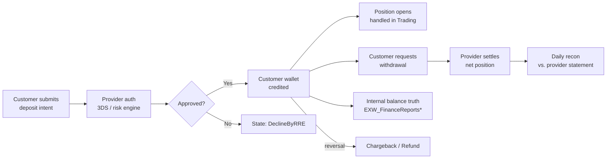

# Payments Super-Domain

eToro's payments stack is **not** a single ledger. It is five loosely-coupled
systems that all touch a customer's money but at different lifecycle stages,
on different platforms, and with different reconciliation partners. Routing
the question to the right sub-skill is the difference between a one-table
answer and a six-table mistake.

**This super-domain is about MONEY MOVEMENT** — money entering, leaving,
moving between platforms, sitting on customer balances. It is **not** about:
- **Fee revenue or fee composition** → Revenue & Fees super-domain (anchored
  on `BI_DB_DDR_Fact_Revenue_Generating_Actions`). Fees touch payments but
  the math, aggregation, and per-product variants (deposit fee, withdraw
  fee, FX/conversion, cashout, transfercoin/redeem, staking, spaceship,
  moneyfarm, commission, rollover, dividend, dormant, share-lending) all
  live there.
- **Bonuses** (deposit bonus, refer-a-friend, club, campaign) → Compensation
  super-domain. Bonuses are pay-OUT to customers, accounted differently.
- **BackOffice manual operations** (operator-driven adjustments, refunds,
  manual credits) → Operations super-domain (`Fact_CustomerAction`).
- **Tribe / eMoney audit trail** → Compliance super-domain. Tribe is the
  SOC2 audit log; consumers are risk/compliance teams. Useful proxy for
  Tribe lookups: the corresponding `eMoney_Dim_Account` /
  `eMoney_Dim_Transaction` row in C.3.
- **Broker recon** (Dealing IG / Saxo / Duco EOD position holdings) →
  Trading super-domain.

## Routing waypoint — read this first

**If the question is "how much money flowed in / out" across the business
(volumes, FTD counts, MIMO trends, daily/monthly customer money status),
default to [`mimo-panel-and-ddr.md`](mimo-panel-and-ddr.md) (C.2) FIRST.**
The DDR/MIMO panel is the BI team's pre-aggregated cross-platform view; it
already UNION-ALLs trading-platform / eMoney / Options / Crypto. Going
straight to the raw billing facts is only correct when you need
platform-specific drill-down: provider/MID, IBAN, on-chain hash, state
machine drill, fee composition, single-deposit forensics. **When in doubt
between C.1/C.3/C.4 and C.2, choose C.2.**

## Mental model — the money lifecycle

**Out of scope here**: position-vs-broker EOD recon (`Dealing_IGRecon*`)
lives in the Trading super-domain. SOC2 audit-trail (`FiatDwhDB.Tribe`,
`eMoney_Tribe.*`) lives in the Compliance super-domain.

Every sub-skill below owns **one slice** of that lifecycle. The slices are
designed so that:

1. **Intra-slice joins** are dense (4-15 tables that always go together).
2. **Inter-slice joins** are explicit and sparse (a deposit reaches a trade
   only via the recurring-deposit bridge; a fiat deposit reaches eMoney IBAN
   only via FlowID/IsIBANTrade flag; etc.).

## Sub-skill routing

| Sub-skill | Anchor | When to load |
|-----------|--------|--------------|
| [`mimo-panel-and-ddr.md`](mimo-panel-and-ddr.md) _(planned)_ | `BI_DB_DDR_Fact_MIMO_AllPlatforms`, `BI_DB_DDR_Customer_Daily_Status`, `BI_DB_DDR_Customer_Periodic_Status`, `etoro_kpi_prep.v_mimo_*`, `v_ddr_mimo_*` | **DEFAULT for "money flowed" Qs.** Pre-aggregated panel layer above raw billing. Use when the question is "net MIMO last month", "daily/monthly customer money-in money-out by platform", "global FTD across platforms (`IsGlobalFTD`)", DDR-style queries. NEVER join raw billing tables here. |
| [`deposits-and-withdrawals.md`](deposits-and-withdrawals.md) | `Fact_BillingDeposit`, `Fact_BillingWithdraw`, `Fact_Deposit_State`, `Fact_Cashout_State` | Trading-platform fiat deposits and withdrawals — the raw billing facts and their state machines. Use for FTD detection at row-level, payment status lifecycle drill, reversals, refunds, chargebacks, funding-type/depot/BIN routing, single-deposit forensics. |
| [`emoney-accounts-and-cards.md`](emoney-accounts-and-cards.md) _(planned)_ | `eMoney_Dim_Account`, `eMoney_Dim_Transaction`, `eMoney_Fact_Transaction_Status`, `eMoneyClientBalance`, `eMoney_Panel_FirstDates` | eMoney IBAN/card accounts and their transactions. Distinct platform from trading-platform billing — has its own state machine, ledger, and balance table. |
| [`crypto-wallet.md`](crypto-wallet.md) _(planned)_ | `EXW_Wallet.CryptoTypes`, `CustomerWalletsView`, `SentTransactions`, `ReceivedTransactions` | Crypto wallet operations on the EXW platform. On-chain sends, receives, holdings. Bridge to fiat is via the C2F skill. |
| [`finance-recon-and-balances.md`](finance-recon-and-balances.md) _(planned)_ | `EXW_FinanceReportsBalancesNew`, balance-by-depot/MID views | Internal customer balance reconciliation — the source of truth for "what does the company owe each customer right now". Owned by the Finance team. Genie space `ido ezra space` covers 10/10 of its tables. |

## Bridges (load these instead of two parents)

| Bridge | Connects | When to load |
|--------|----------|--------------|
| [`../bridges/crypto-to-fiat.md`](../bridges/crypto-to-fiat.md) _(planned)_ | C.4 ↔ C.3 via `EXW_C2F_E2E` | "Crypto came into wallet then converted to EUR/USD on IBAN" — answer needs both wallet and eMoney tables. |
| [`../bridges/recurring-deposit-to-trade.md`](../bridges/recurring-deposit-to-trade.md) _(planned)_ | C.1 ↔ A. Trading | "Customer deposited via recurring plan → opened first position within N days" — bridges payments and trading. |
| [`../bridges/provider-reconciliation.md`](../bridges/provider-reconciliation.md) _(planned)_ | C.1/C.5 ↔ external providers | Settlement-level recon: `ExternalTransactionID` matching against provider statement files (Worldpay/SafeCharge/Nuvei/etc.). |
| [`../bridges/refund-chargeback-chain.md`](../bridges/refund-chargeback-chain.md) _(planned)_ | C.1 ↔ D. Compliance/AML | Investigating a single dispute end-to-end: original deposit → refund/chargeback → AML flag → resolution. |

## Cross-cutting facts

These hold whether you load any sub-skill or not:

- **`CID` is `RealCID` everywhere.** All payments tables key on `CID` and join
  to `DWH_dbo.Dim_Customer` on `CID = RealCID`. The exception is production
  OLTP `Customer.CustomerStatic` which uses `RealCID` directly.
- **Amounts are in *deposit currency* unless the column ends in `USD`.**
  USD conversion already applied; do NOT multiply by `ExchangeRate` again.
- **Dates come in two flavors**: `*DateID` is `INT YYYYMMDD` (joins to
  `DWH_dbo.Dim_Date`), `*Date` is `DATETIME`. Filter on `*DateID` for big
  scans (it's the partition/HASH key on most fact tables).
- **Reversals are amount-signed.** `BI_DB_DepositWithdrawFee_Reversals` already
  has refunds/chargebacks as negative; do NOT negate again. See its wiki for
  the per-`TransactionType` direction map.
- **Platforms inside Payments**: `MIMOPlatform IN ('TradingPlatform',
  'eMoney', 'Options', 'Crypto')`. Each platform has its own raw fact tables;
  the MIMO panel UNION-ALLs them.

## What this skill is NOT

- It does not contain any SQL — sub-skills do.
- It is not a wiki — it routes to the per-table wikis under
  `knowledge/synapse/Wiki/<schema>/Tables/<obj>.md` for full column-level
  detail, lineage, and source attribution.
- It does not cover **fee revenue** of any kind. All fees, all products,
  all aggregations live in the [Revenue & Fees super-domain](../revenue-and-fees/SKILL.md).
- It does not cover **bonuses** — those are pay-OUT to customers, owned by
  Compensation.
- It does not cover **broker EOD position recon** — that's Trading.
- It does not cover **operator audit trail** (`Fact_CustomerAction`) — that's
  Operations.

## Skill provenance

- Cluster source: 5 Louvain clusters (7, 13, 17, 28, 45) collapsed into
  5 sub-skills + 1 horizontal (fees) + 4 bridges. Two original clusters
  moved out: cluster 47 (Tribe → Compliance) and cluster 49 (Dealing IG
  → Trading).
- Total nodes covered: ~377 (was 421 before the two moves).
- Genie space coverage: `ido ezra space` (10/10 — finance recon), `UK BA
  space [WIP]` (19/30 — broad payments analytics), `eMoney Adoption &
  Trading` (7/7 of relevant tables), `New Space (1)` and `(2)`.
- KPI view coverage: 18 views across `etoro_kpi[_prep[_stg]]` — primarily
  the `v_mimo_*` and `v_ddr_mimo_*` family.
- Detail trail: [`../_payments_subgraph.md`](../_payments_subgraph.md),
  [`../_brief_cluster_7.md`](../_brief_cluster_7.md),
  [`../_CHECKPOINT_A.md`](../_CHECKPOINT_A.md).
