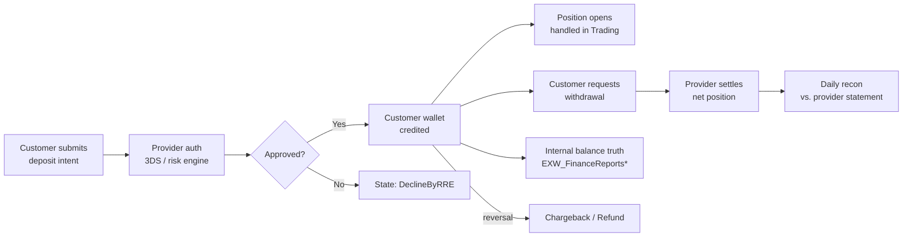

# Payments Super-Domain

eToro's payments stack is **not** a single ledger. It is five loosely-coupled
systems that all touch a customer's money but at different lifecycle stages,
on different platforms, and with different reconciliation partners. Routing
the question to the right sub-skill is the difference between a one-table
answer and a six-table mistake.

**This super-domain is about MONEY MOVEMENT** — money entering, leaving,
moving between platforms, sitting on customer balances. It is **not** about:
- **Fee revenue or fee composition** → Revenue & Fees super-domain (anchored
  on `BI_DB_DDR_Fact_Revenue_Generating_Actions`). Fees touch payments but
  the math, aggregation, and per-product variants (deposit fee, withdraw
  fee, FX/conversion, cashout, transfercoin/redeem, staking, spaceship,
  moneyfarm, commission, rollover, dividend, dormant, share-lending) all
  live there.
- **Bonuses** (deposit bonus, refer-a-friend, club, campaign) → Compensation
  regular domain (planned, NOT a super-domain). Bonuses are pay-OUT to
  customers, accounted differently.
- **BackOffice manual operations** (operator-driven adjustments, refunds,
  manual credits) → Operations regular domain (planned, NOT a super-domain;
  data is too sprawled across `Trading.*`, `Billing.*`, `UserAPIDB.*`,
  `Settings.*`). For the audit-trail piece, anchor on `Fact_CustomerAction`.
- **Tribe / FiatDwh / eMoney audit trail** → [`cross/tribe-emoney-audit.md`](../cross/tribe-emoney-audit.md).
  Tribe is the **Treezor XML audit envelope feed**; FiatDwhDB is Treezor's
  operational fiat mirror. The cross-domain skill owns the audit-trail map and supplies
  the recon patterns. C.3 (eMoney) supplies the join keys (`AccountID`,
  `GCID`, `CardID`, `TransactionID`).
- **Broker recon** (Dealing IG / Saxo / Duco EOD position holdings) and
  **broker / LP identity** (hedge server, LP IDs) → Trading & Markets
  super-domain (`dealing_dbo`). Payment-side `BankName` / `MID` /
  `PaymentProviderName` are PSP identities, NOT broker identities — do
  not conflate.

## Routing waypoint — read this first

**If the question is "how much money flowed in / out" across the business
(volumes, FTD counts, MIMO trends, daily/monthly customer money status),
default to [`mimo-panel-and-ddr.md`](mimo-panel-and-ddr.md) (C.2) FIRST.**
The DDR/MIMO panel is the BI team's pre-aggregated cross-platform view; it
already UNION-ALLs trading-platform / eMoney / Options / Crypto. Going
straight to the raw billing facts is only correct when you need
platform-specific drill-down: provider/MID, IBAN, on-chain hash, state
machine drill, fee composition, single-deposit forensics. **When in doubt
between C.1/C.3/C.4 and C.2, choose C.2.**

## Mental model — the money lifecycle

**Out of scope here**: position-vs-broker EOD recon (`Dealing_IGRecon*`)
and broker / LP identity (`dealing_dbo`) live in the Trading super-domain.
Treezor SOC2 audit envelopes (`FiatDwhDB.Tribe`, `eMoney_Tribe.*`,
`bronze_fiatdwhdb_tribe_*`) live in the [`tribe-emoney-audit`](../cross/tribe-emoney-audit.md)
cross-domain skill; Compliance super-domain owns the interpretation rules when built.

Every sub-skill below owns **one slice** of that lifecycle. The slices are
designed so that:

1. **Intra-slice joins** are dense (4-15 tables that always go together).
2. **Inter-slice joins** are explicit and sparse (a deposit reaches a trade
   only via the recurring-deposit cross-domain skill; a fiat deposit reaches eMoney IBAN
   only via FlowID/IsIBANTrade flag; etc.).

## Sub-skill routing

| Sub-skill | Anchor | When to load |
|-----------|--------|--------------|
| [`mimo-panel-and-ddr.md`](mimo-panel-and-ddr.md) | `BI_DB_DDR_Fact_MIMO_AllPlatforms`, `BI_DB_DDR_Customer_Daily_Status`, `BI_DB_DDR_Customer_Periodic_Status`, `etoro_kpi_prep.v_mimo_*`, `v_ddr_mimo_*` | **DEFAULT for "money flowed" Qs.** Pre-aggregated panel layer above raw billing. Use when the question is "net MIMO last month", "daily/monthly customer money-in money-out by platform", "global FTD across platforms (`IsGlobalFTD`)", DDR-style queries. NEVER join raw billing tables here. |
| [`deposits-and-withdrawals.md`](deposits-and-withdrawals.md) | **`BI_DB_DepositWithdrawFee`** + `BI_DB_DepositWithdrawFee_Reversals`, `Fact_CustomerAction`, `de_output.de_output_etoro_kpi_fact_customeraction_w_metrics`, `Fact_BillingDeposit`, `Fact_BillingWithdraw` (`Fact_*_State` are QA-only) | Trading-platform fiat deposits and withdrawals — ranking + routing layer. `BI_DB_DepositWithdrawFee` is the canonical analyst-facing TP table; reach into `Fact_Billing*` only for XML detail not in BI; reach into `Fact_*_State` only for QA. |
| [`emoney-accounts-and-cards.md`](emoney-accounts-and-cards.md) | `BI_DB_DDR_Fact_MIMO_eMoney_Platform`, `eMoney_Dim_Account`, `eMoney_Dim_Transaction`, `eMoneyClientBalance`, `eMoney_Card_Instance_Summary`, `eMoney_Panel_FirstDates`, `eMoney_Reports_AcquisitionFunnel` | eMoney IBAN/card accounts and transactions. Distinct platform — own state machine, ledger, balance, provider partner (Treezor). For audit-trail (Tribe), use the `tribe-emoney-audit` cross-domain skill instead. |
| [`crypto-wallet.md`](crypto-wallet.md) | `BI_DB_DDR_Fact_MIMO_Crypto_Platform`, `EXW_dbo.EXW_FactTransactions / EXW_FactRedeemTransactions / EXW_FactConversions`, `EXW_DimUser`, `EXW_WalletInventory`, `EXW_Wallet.CustomerWalletsView` + `SentTransactions` + `ReceivedTransactions` + `Conversions` + `Redemptions` | Crypto wallet operations on the EXW platform. On-chain sends, receives, swaps, redemptions. C2F off-ramp is delegated to the `crypto-to-fiat` cross-domain skill (which owns `EXW_C2F_E2E`). |
| [`finance-recon-and-balances.md`](finance-recon-and-balances.md) | `EXW_FinanceReportsBalancesNew`, `etoro_kpi_prep.v_population_*`, `BI_DB_Client_Balance_CID_Level_New`, Apex SOD recon feeds | Internal customer balance source-of-truth + Finance-team external recon. Owned by Finance; Genie space `ido ezra space` covers 9/10 of its tables. |

## Cross-domain skills (load these instead of two parents)

| Cross-domain | Connects | When to load |
|--------|----------|--------------|
| [`../cross/crypto-to-fiat.md`](../cross/crypto-to-fiat.md) | C.4 ↔ C.3 via `EXW_C2F_E2E` | "Crypto came into wallet then converted to EUR/USD on IBAN" — cross-domain skill owns the E2E underbelly map. |
| [`../cross/recurring-deposit-to-trade.md`](../cross/recurring-deposit-to-trade.md) | C.1 ↔ A. Trading | "Customer deposited via recurring plan → opened first position within N days". Canonical pre-stitched table: `de_output.de_output_etoro_kpi_fact_customeraction_w_metrics`. |
| [`../cross/provider-reconciliation.md`](../cross/provider-reconciliation.md) | C.1/C.5 ↔ external providers | Settlement-level recon: `ExternalTransactionID` matching against provider statement files (Worldpay/SafeCharge/Nuvei/etc.). |
| [`../cross/refund-chargeback-chain.md`](../cross/refund-chargeback-chain.md) | C.1 ↔ H. Revenue & Fees ↔ D. Compliance | Investigating a single dispute end-to-end: original deposit → refund/chargeback → AML flag → resolution. |
| [`../cross/tribe-emoney-audit.md`](../cross/tribe-emoney-audit.md) | D. Compliance ↔ C.3 eMoney | Treezor XML audit envelopes (`eMoney_Tribe.*`) + FiatDwhDB operational mirrors. SOC2 audit trail / "who authorized this" / operator-action forensics on eMoney accounts/cards/IBAN. C.3 supplies join keys; cross-domain skill supplies the audit map. |

## Cross-cutting facts

These hold whether you load any sub-skill or not:

- **`CID` is `RealCID` everywhere.** All payments tables key on `CID` and join
  to `DWH_dbo.Dim_Customer` on `CID = RealCID`. The exception is production
  OLTP `Customer.CustomerStatic` which uses `RealCID` directly.
- **Amounts are in *deposit currency* unless the column ends in `USD`.**
  USD conversion already applied; do NOT multiply by `ExchangeRate` again.
- **Dates come in two flavors**: `*DateID` is `INT YYYYMMDD` (joins to
  `DWH_dbo.Dim_Date`), `*Date` is `DATETIME`. Filter on `*DateID` for big
  scans (it's the partition/HASH key on most fact tables).
- **Reversals are amount-signed.** `BI_DB_DepositWithdrawFee_Reversals` already
  has refunds/chargebacks as negative; do NOT negate again. See its wiki for
  the per-`TransactionType` direction map.
- **Platforms inside Payments**: `MIMOPlatform IN ('TradingPlatform',
  'eMoney', 'Options', 'Crypto')`. Each platform has its own raw fact tables;
  the MIMO panel UNION-ALLs them.

- **XML-shredded columns on DWH Fact tables**: `Fact_BillingDeposit` (139 cols), `Fact_BillingWithdraw`, and similar DWH Fact tables are wide because the ETL pre-parses provider-specific structured fields from source billing tables (e.g., `PaymentData` XML on `Billing.Deposit`, `FundingData` on `Billing.Funding`) into individual typed columns with `*AsString` / `*AsInteger` / `*AsDecimal` / `*AsJson` suffixes. Column names mirror the original node paths. For "where is field X" questions about billing/payment attributes → scan the DWH Fact table columns first. If not present, the raw structured field still exists on the corresponding `bronze_etoro_billing_*` table and can be parsed with SQL JSON/XML functions.

## What this skill is NOT

- It does not contain any SQL — sub-skills do.
- It is not a wiki — it routes to the per-table wikis under
  `knowledge/synapse/Wiki/<schema>/Tables/<obj>.md` for full column-level
  detail, lineage, and source attribution.
- It does not cover **fee revenue** of any kind. All fees, all products,
  all aggregations live in the [Revenue & Fees super-domain](../revenue-and-fees/SKILL.md).
- It does not cover **bonuses** — those are pay-OUT to customers, owned by
  Compensation.
- It does not cover **broker EOD position recon** or **broker / LP identity** — those are Trading & Markets (`dealing_dbo`).
- It does not cover **operator audit trail** (`Fact_CustomerAction` for back-office actions) — that's the planned Operations regular domain.
- It does not cover **Treezor / Tribe / FiatDwhDB audit envelopes** — that's the [`tribe-emoney-audit`](../cross/tribe-emoney-audit.md) cross-domain skill.

## Skill provenance

- Cluster source: Louvain clusters covering raw billing, MIMO/DDR, eMoney,
  crypto wallet, and finance-recon collapsed into 5 sub-skills + 5 cross-domain skills.
  Tribe (Treezor audit envelopes) was originally co-located with eMoney but
  promoted to its own cross-domain skill (`tribe-emoney-audit`). Dealing IG /
  Saxo / Duco broker recon was moved out to Trading & Markets. Fees /
  revenue was lifted into its own super-domain (H. Revenue & Fees).
- Total nodes covered: ~377 (was 421 before the two moves).
- Genie space coverage: `ido ezra space` (10/10 — finance recon), `UK BA
  space [WIP]` (19/30 — broad payments analytics), `eMoney Adoption &
  Trading` (7/7 of relevant tables), `New Space (1)` and `(2)`.
- KPI view coverage: 18 views across `etoro_kpi[_prep[_stg]]` — primarily
  the `v_mimo_*` and `v_ddr_mimo_*` family.
- Detail trail: [`../_payments_subgraph.md`](../_payments_subgraph.md),
  [`../_brief_cluster_7.md`](../_brief_cluster_7.md),
  [`../_CHECKPOINT_A.md`](../_CHECKPOINT_A.md).
