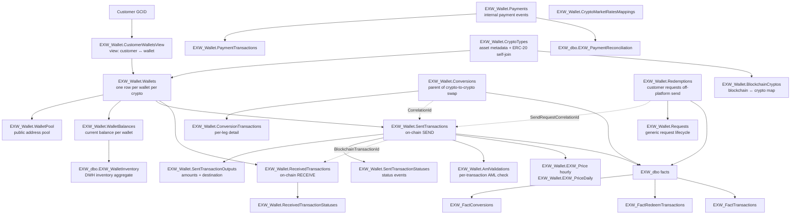

# C.4 — Crypto Wallet (EXW / on-chain)

eToro's crypto wallet (EXW) is a **separate platform** from trading-platform
crypto CFDs. It is a real on-chain wallet system with public addresses,
blockchain transactions, gas fees, ERC-20 tokens, and conversions/swaps.

The data model has **two tiers**:
- `EXW_Wallet` schema — production-side ledger (mirrors of Wallet OLTP)
- `EXW_dbo` schema — DWH-side aggregated fact tables (built from the above
  by `SP_EXW_*` stored procs)

For row-level forensics use `EXW_Wallet`; for analytical aggregation use
`EXW_dbo` fact tables.

## Mental model



## Primary objects

### EXW_Wallet (production-side ledger)

| Object | Grain | Notes |
|--------|-------|-------|
| [`CryptoTypes`](../../synapse/Wiki/EXW_Wallet/Tables/CryptoTypes.md) | One row per supported crypto asset | Symbol, name, decimals, `BlockchainCryptoId` (self-join: ERC-20 → parent blockchain). |
| [`CustomerWalletsView`](../../synapse/Wiki/EXW_Wallet/Tables/CustomerWalletsView.md) | View — one row per customer-wallet pair | Joins Wallets + WalletPool to expose `GCID` ↔ `WalletId` ↔ public address. |
| [`Wallets`](../../synapse/Wiki/EXW_Wallet/Tables/Wallets.md) | One row per wallet | One wallet per (GCID, BlockchainCryptoId) typically. `WalletTypeId` decodes via `EXW_Dictionary.WalletTypes`. |
| [`WalletPool`](../../synapse/Wiki/EXW_Wallet/Tables/WalletPool.md) | Public-address pool entries | Public address, provider (Tangany / Simplex / etc.). |
| [`WalletBalances`](../../synapse/Wiki/EXW_Wallet/Tables/WalletBalances.md) | Current balance per wallet | Real-time balance source. |
| [`SentTransactions`](../../synapse/Wiki/EXW_Wallet/Tables/SentTransactions.md) | One row per on-chain SEND | Has `Id`, `WalletId`, `BlockchainTransactionId`, `CryptoId`, `CorrelationId`, `TransactionTypeId`. **CorrelationId is the cross-table linker** (to Conversions, Redemptions). |
| [`SentTransactionOutputs`](../../synapse/Wiki/EXW_Wallet/Tables/SentTransactionOutputs.md) | One row per send-output | Per-destination amount + address (one send can have multiple outputs). |
| [`SentTransactionStatuses`](../../synapse/Wiki/EXW_Wallet/Tables/SentTransactionStatuses.md) | One row per status event per send | Status timeline. |
| [`ReceivedTransactions`](../../synapse/Wiki/EXW_Wallet/Tables/ReceivedTransactions.md) | One row per on-chain RECEIVE | Has `BlockchainTransactionId` — match to `SentTransactions.BlockchainTransactionId` for sent↔received reconciliation. |
| [`ReceivedTransactionStatuses`](../../synapse/Wiki/EXW_Wallet/Tables/ReceivedTransactionStatuses.md) | Status events for receives | |
| [`Conversions`](../../synapse/Wiki/EXW_Wallet/Tables/Conversions.md) | One row per crypto-crypto swap (parent) | The "I want to swap BTC for ETH" intent. `CorrelationId` links to underlying SentTransactions. |
| [`ConversionTransactions`](../../synapse/Wiki/EXW_Wallet/Tables/ConversionTransactions.md) | One row per conversion leg | Per-asset detail of a swap. |
| [`Redemptions`](../../synapse/Wiki/EXW_Wallet/Tables/Redemptions.md) | One row per customer redemption (off-platform send) | `SendRequestCorrelationId` → SentTransactions for blockchain detail. |
| [`Requests`](../../synapse/Wiki/EXW_Wallet/Tables/Requests.md) | Generic request lifecycle | Mostly used to drive Redemptions; status events. |
| [`Payments`](../../synapse/Wiki/EXW_Wallet/Tables/Payments.md) | Internal payment events | |
| [`PaymentTransactions`](../../synapse/Wiki/EXW_Wallet/Tables/PaymentTransactions.md) | Per-payment detail | |
| [`AmlValidations`](../../synapse/Wiki/EXW_Wallet/Tables/AmlValidations.md) | One row per transaction AML check | Pre-send AML decision (allow/block/review). |
| [`EXW_Price`](../../synapse/Wiki/EXW_Wallet/Tables/EXW_Price.md) | Hourly price per instrument | 24 rows per day per instrument. |
| [`EXW_PriceDaily`](../../synapse/Wiki/EXW_Wallet/Tables/EXW_PriceDaily.md) | Daily aggregated price | One row per day per instrument. |
| [`ETL_InstrumentRates_ByHour`](../../synapse/Wiki/EXW_Wallet/Tables/ETL_InstrumentRates_ByHour.md) | Hourly rate aggregates | ETL bridge between EXW_Price and downstream rates. |
| [`CryptoMarketRatesMappings`](../../synapse/Wiki/EXW_Wallet/Tables/CryptoMarketRatesMappings.md) | Crypto ↔ market-rate symbol map | |
| [`BlockchainCryptos`](../../synapse/Wiki/EXW_Wallet/Tables/BlockchainCryptos.md) | Blockchain ↔ canonical crypto record | Parent blockchain for ERC-20 tokens. |
| [`TransactionsView`](../../synapse/Wiki/EXW_Wallet/Tables/TransactionsView.md) | Unified view of sent + received + conversions | Convenience view; per-transaction grain. |

### EXW_dbo (DWH-side fact tables)

| Object | Grain | Notes |
|--------|-------|-------|
| [`EXW_DimUser`](../../synapse/Wiki/EXW_dbo/Tables/EXW_DimUser.md) | One row per user | The EXW customer dim. `GCID` is primary; joins to `Dim_Customer.GCID` for trading-side context. |
| [`EXW_WalletInventory`](../../synapse/Wiki/EXW_dbo/Tables/EXW_WalletInventory.md) | Per-wallet inventory aggregate | DWH-side balance/holdings. |
| [`EXW_FactRedeemTransactions`](../../synapse/Wiki/EXW_dbo/Tables/EXW_FactRedeemTransactions.md) | One row per redemption | Enriched with sent + received correlation. `RedeemID = Redemptions.Id`. |
| [`EXW_FactConversions`](../../synapse/Wiki/EXW_dbo/Tables/EXW_FactConversions.md) | One row per conversion | Enriched with sent transaction details. `SendingGCID`, `ToEtoroSentTXID`. |
| [`EXW_FactTransactions`](../../synapse/Wiki/EXW_dbo/Tables/EXW_FactTransactions.md) | Unified transaction fact | DWH consolidation across Sent / Received / Conversion / Redemption. |
| [`EXW_PaymentReconciliation`](../../synapse/Wiki/EXW_dbo/Tables/EXW_PaymentReconciliation.md) | Reconciliation table for Payments | Provider-side reconciliation. |
| [`EXW_EthFeeSent_Blockchain`](../../synapse/Wiki/EXW_dbo/Tables/EXW_EthFeeSent_Blockchain.md) | ETH gas fee per send | (Fee data — primarily owned by Revenue & Fees super-domain.) |
| [`EXW_ETH_FeeData_Blockchain`](../../synapse/Wiki/EXW_dbo/Tables/EXW_ETH_FeeData_Blockchain.md) | ETH gas fee history | (Same — Revenue & Fees.) |

Dictionaries: `EXW_Dictionary.TransactionTypes`, `EXW_Dictionary.ReceivedTransactionTypes`, `EXW_Dictionary.WalletTypes`.

## Canonical joins

```sql
-- Customer ↔ wallet ↔ current crypto balances
FROM EXW_Wallet.CustomerWalletsView cwv
JOIN EXW_Wallet.WalletBalances wb       ON wb.WalletId = cwv.Id
JOIN EXW_Wallet.CryptoTypes ct          ON ct.CryptoID  = cwv.CryptoId
LEFT JOIN EXW_Wallet.BlockchainCryptos bc ON bc.Id        = ct.BlockchainCryptoId
JOIN DWH_dbo.Dim_Customer dc            ON dc.GCID      = cwv.Gcid
WHERE cwv.Gcid = @gcid
```

```sql
-- All on-chain SENDS for a customer with status + amount
FROM EXW_Wallet.SentTransactions st
JOIN EXW_Wallet.SentTransactionOutputs so   ON so.SentTransactionId = st.Id
JOIN EXW_Wallet.SentTransactionStatuses sts ON sts.SentTransactionId = st.Id
JOIN EXW_Wallet.CryptoTypes ct              ON ct.CryptoID = st.CryptoId
JOIN EXW_Wallet.CustomerWalletsView cwv     ON cwv.Id = st.WalletId
JOIN EXW_Dictionary.TransactionTypes tt     ON tt.Id = st.TransactionTypeId
WHERE cwv.Gcid = @gcid
ORDER BY st.CreatedDate
```

```sql
-- Match sent → received (on-chain reconciliation across wallets)
FROM EXW_Wallet.SentTransactions s
JOIN EXW_Wallet.ReceivedTransactions r
       ON r.BlockchainTransactionId = s.BlockchainTransactionId
WHERE s.BlockchainTransactionId = @hash
```

```sql
-- Redemption full chain (off-platform withdraw)
FROM EXW_Wallet.Redemptions r
JOIN EXW_Wallet.Requests req     ON req.CorrelationId = r.SendRequestCorrelationId
JOIN EXW_Wallet.SentTransactions s ON s.CorrelationId = r.SendRequestCorrelationId
JOIN EXW_dbo.EXW_FactRedeemTransactions f ON f.RedeemID = r.Id
JOIN EXW_Wallet.CryptoTypes ct   ON ct.CryptoID = r.CryptoId
WHERE r.Id = @redemptionId
```

```sql
-- Conversion (swap) end-to-end
FROM EXW_Wallet.Conversions c
JOIN EXW_Wallet.ConversionTransactions ct ON ct.ConversionId = c.Id
LEFT JOIN EXW_Wallet.SentTransactions s   ON s.CorrelationId = c.CorrelationId
LEFT JOIN EXW_dbo.EXW_FactConversions fc  ON fc.ConversionID = c.Id
WHERE c.SendingGCID = @gcid
ORDER BY c.CreatedDate
```

```sql
-- DWH-side aggregations (wallet inventory + user demographics)
FROM EXW_dbo.EXW_WalletInventory wi
JOIN EXW_dbo.EXW_DimUser du ON du.GCID = wi.GCID
WHERE wi.AsOfDate = @date
```

## KPI / pattern catalog

| Question | Pattern |
|----------|---------|
| **Crypto holdings per customer right now** | `EXW_Wallet.WalletBalances` joined to `CustomerWalletsView`, sum by CryptoId. For aggregated picture use `EXW_dbo.EXW_WalletInventory`. |
| **On-chain transactions for a customer over a window** | `EXW_Wallet.SentTransactions` + `ReceivedTransactions` UNIONed via `CustomerWalletsView`. For DWH-side use `EXW_FactTransactions`. |
| **Volume of crypto deposits (RECEIVED into our wallets)** | `ReceivedTransactions GROUP BY DateID, CryptoId, ReceivedTransactionTypeId`. **Cross-platform crypto deposit volume → C.2 MIMO `WHERE MIMOPlatform='Crypto'`.** |
| **Off-platform withdrawals (redemptions)** | `EXW_FactRedeemTransactions` (DWH side) — fully enriched. |
| **Crypto-to-crypto swap volume** | `EXW_FactConversions` (DWH) or `Conversions + ConversionTransactions` (production). |
| **Reconcile sent → received for one specific blockchain hash** | Join on `BlockchainTransactionId`. |
| **AML-blocked sends** | `EXW_Wallet.AmlValidations` joined to `SentTransactions` filter on AML decision. |
| **Crypto-to-Fiat conversion (off-ramp to IBAN)** | → bridge `crypto-to-fiat` (`EXW_C2F_E2E`). |
| **Crypto staking rewards / staking platform fees** | → Revenue & Fees super-domain (`Staking.*`, `EXW_dbo.Staking_*`). |
| **Gas fee paid for an ETH send** | `EXW_dbo.EXW_EthFeeSent_Blockchain` — but this is a fee analysis question; route to Revenue & Fees. |

## Gotchas

1. **`Wallet.*` (no `EXW_` prefix) is the OLTP schema mirror.** `EXW_Wallet.*` is the DWH-mirrored copy. They have the same table names and almost identical schemas. **Use `EXW_Wallet.*` for analytical work** — it has the ETL-applied transformations and is what the canonical joins assume.
2. **`BlockchainCryptoId` self-joins on `CryptoTypes`** for ERC-20 tokens. ERC-20 tokens have a `BlockchainCryptoId` pointing to the parent blockchain's `CryptoID` (e.g. USDT-on-ETH points to ETH). When showing "blockchain", join to the parent.
3. **`CorrelationId` is the cross-table linker.** `Conversions.CorrelationId = SentTransactions.CorrelationId`; `Redemptions.SendRequestCorrelationId = SentTransactions.CorrelationId`. Use it instead of trying to join on amounts/timestamps.
4. **`BlockchainTransactionId` matches sent ↔ received** (same on-chain hash). Use this for reconciliation.
5. **Multiple SentTransactionOutputs per Sent** — one send can have multiple destinations. SUM `OutputAmount` if you want total send volume.
6. **GCID is the EXW-side primary identifier**, same as eMoney. `Dim_Customer.GCID` for trading-side context. `CID = RealCID` only on DWH side.
7. **EXW_Price has 24 rows/day per instrument**. `EXW_PriceDaily` has 1 row/day. Pick by query intent.
8. **Status tables (`SentTransactionStatuses`, `ReceivedTransactionStatuses`) are TRUE event logs** (unlike `Fact_Deposit_State`). Useful for "when did this transaction confirm" / "how long was it pending" / "did it fail and retry".
9. **`AmlValidations` runs PRE-send.** A send may exist with an AmlValidation row that blocked it — check status.
10. **DWH `EXW_dbo` Fact tables are populated by `SP_EXW_*` procs.** Names: `SP_EXW_Fact_Transactions`, `SP_EXW_FactRedeemTransactions`, `SP_EXW_UserCalculatedBalance`, `SP_EXW_FactBalance_EXT`, `SP_EXW_Transactions_Monthly`. If a fact looks stale, check the SP run.
11. **Tangany / Simplex are wallet providers** (custodial backends). Not all wallets are with the same provider; check `WalletPool.Provider`.

## When to bridge / drill out

| If the question also asks about… | …go to… |
|---------------------------------|---------|
| Cross-platform money flow (TP + eMoney + Crypto) | [`mimo-panel-and-ddr.md`](mimo-panel-and-ddr.md) (C.2) |
| Crypto came in → converted to EUR/USD on IBAN (C2F off-ramp) | [`../bridges/crypto-to-fiat.md`](../bridges/crypto-to-fiat.md) |
| **Crypto staking rewards / staking fees / staking platform compensation** | [revenue-and-fees](../revenue-and-fees/SKILL.md) |
| Customer total balance (crypto + fiat + open positions) | [`finance-recon-and-balances.md`](finance-recon-and-balances.md) (C.5) |
| Crypto CFD trading (positions, P&L on ETH/BTC pair) | A. Trading (NOT here — CFD is a derivative on price, not a wallet position) |
| AML high-risk wallet investigation | D. Compliance & AML |
| Operator action on a wallet (manual freeze etc.) | J. Operations *(planned)* (`Fact_CustomerAction`) |

## Deep reads

- [`CryptoTypes.md`](../../synapse/Wiki/EXW_Wallet/Tables/CryptoTypes.md)
- [`SentTransactions.md`](../../synapse/Wiki/EXW_Wallet/Tables/SentTransactions.md)
- [`ReceivedTransactions.md`](../../synapse/Wiki/EXW_Wallet/Tables/ReceivedTransactions.md)
- [`CustomerWalletsView.md`](../../synapse/Wiki/EXW_Wallet/Tables/CustomerWalletsView.md)
- [`Conversions.md`](../../synapse/Wiki/EXW_Wallet/Tables/Conversions.md)
- [`Redemptions.md`](../../synapse/Wiki/EXW_Wallet/Tables/Redemptions.md)
- [`EXW_FactConversions.md`](../../synapse/Wiki/EXW_dbo/Tables/EXW_FactConversions.md)
- [`EXW_FactRedeemTransactions.md`](../../synapse/Wiki/EXW_dbo/Tables/EXW_FactRedeemTransactions.md)

## Cluster provenance

- Cluster 45 from the Louvain partition (97 members, intra-cluster weight 594.0).
- Schema mix: `EXW_Wallet:27, EXW_dbo:29, Wallet:24, EXW_Dictionary:4, Staking:3, CopyFromLake:3, EXW_Currency:2`, others.
- Edge sources: 100% wiki — no Genie space coverage and no KPI views.
- Top out-cluster bridges: `EXW_dbo.EXW_DimUser` (26.0 — already inside our primary objects), `Dim_Customer` (5.0), `EXW_FinanceReportsBalancesNew` (2.0 → C.5 finance recon).
- See [`../_brief_cluster_45.md`](../_brief_cluster_45.md) for full member list.
