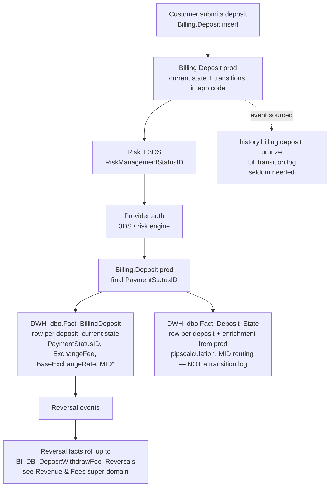

# Deposits & Withdrawals (Trading Platform)

The trading-platform fiat-money facts plus their production-side enrichment.
**Two intent + current-state tables** (`Fact_BillingDeposit`,
`Fact_BillingWithdraw`) carry the row-level deposit/withdrawal record with
its CURRENT state (`PaymentStatusID`, `CashoutStatusID`). Two enrichment
tables (`Fact_Deposit_State`, `Fact_Cashout_State`) are NOT
state-transition logs — despite the name. They exist to bring accurate
**conversion-fee (`pipscalculation`)** and **MID routing** straight from
production (`Billing.Deposit`, `Billing.Withdraw`) rather than recomputing
them in DWH. Rollbacks live in `Fact_Cashout_Rollback`. Fees and reversals
get rolled up by the BI layer (which is owned by the Revenue & Fees
super-domain).

> **Aside on true historical state**: if you genuinely need the full
> transition history of a deposit (every state change, who changed it, when)
> — go to bronze `history.billing.deposit` / `history.billing.withdraw` in
> Unity Catalog. Those are the historical event-sourced versions. They are
> rich and elaborate but **rarely needed for analytical work** — for almost
> every analytical question, the current-state row in `Fact_BillingDeposit`
> + the enrichment columns in `Fact_Deposit_State` are sufficient.

## Mental model



The withdrawal side mirrors this exactly: `Fact_BillingWithdraw` carries
intent + current `CashoutStatusID`, `Fact_Cashout_State` brings
production-side fee/MID enrichment, and `Fact_Cashout_Rollback` captures
rollbacks. Reversals roll up to the same fee table family (Revenue & Fees
super-domain).

**Key clarification**: `PaymentStatusID` on `Fact_BillingDeposit` IS the
current state. The state ID enum is canonical (2=Approved, 35=DeclineByRRE,
etc.). What `Fact_Deposit_State` adds is NOT a list of past transitions —
it's a single enrichment row per deposit with the production-side
`pipscalculation` (used for accurate conversion-fee accounting) and MID
routing (used to know which physical Worldpay/SafeCharge/Nuvei MID handled
the transaction).

## Primary objects

| Object | Grain | Rows | Notes |
|--------|-------|------|-------|
| [`DWH_dbo.Fact_BillingDeposit`](../../synapse/Wiki/DWH_dbo/Tables/Fact_BillingDeposit.md) | One row per deposit attempt, **current state** | 73.9M | HASH(DepositID), NC on `(PaymentStatusID, ExpirationDateID)`. ~91 XML-extracted columns from `PaymentData`/`FundingData`. `PaymentStatusID` IS the current state. |
| [`DWH_dbo.Fact_BillingWithdraw`](../../synapse/Wiki/DWH_dbo/Tables/Fact_BillingWithdraw.md) | One row per withdrawal request, **current state** | — | HASH(WithdrawID). Mirrors deposit. **Dedupe on `WithdrawPaymentID` before joining** — BankName field creates duplicates (~200 rows/day). `CashoutStatusID` IS the current state. |
| [`DWH_dbo.Fact_Deposit_State`](../../synapse/Wiki/DWH_dbo/Tables/Fact_Deposit_State.md) | **One enrichment row per deposit** | — | **MIS-NAMED.** Not a state-transition log. Brings `pipscalculation` (production conversion-fee math) and MID routing straight from `Billing.Deposit` rather than re-deriving in DWH. Filter `TransactionType='Deposit'` for primary deposits (other transaction types feed reversal/rollback enrichment). |
| [`DWH_dbo.Fact_Cashout_State`](../../synapse/Wiki/DWH_dbo/Tables/Fact_Cashout_State.md) | **One enrichment row per cashout** | — | Same role as `Fact_Deposit_State` for the withdraw side. Brings `pipscalculation` + MID routing from `Billing.Withdraw`. `TransactionType='Withdraw'` for primary; rest for rollbacks. |
| [`DWH_dbo.Fact_Cashout_Rollback`](../../synapse/Wiki/DWH_dbo/Tables/Fact_Cashout_Rollback.md) | One row per rollback event | — | Rollback (cancel-withdrawal) lifecycle. |
| [`BI_DB_dbo.BI_DB_AllDeposits`](../../synapse/Wiki/BI_DB_dbo/Tables/BI_DB_AllDeposits.md) | One row per approved deposit, dim-resolved | — | Convenience view for cross-platform deposit dashboards. |
| `history.billing.deposit` *(UC bronze)* | Full event-sourced transition log per deposit | very large | True historical state. Rarely needed for analytical work. Reach for it only when you need "show me every state this deposit went through with timestamps". |
| `history.billing.withdraw` *(UC bronze)* | Same for withdrawals | very large | Same caveat. |

**Note on fee tables**: `BI_DB_dbo.BI_DB_DepositWithdrawFee` and
`BI_DB_dbo.BI_DB_DepositWithdrawFee_Reversals` are part of the **Revenue
& Fees super-domain**, not this one. C.1 owns the deposit/withdrawal facts;
the fee skill owns the fee aggregations. They share `DepositID` /
`WithdrawPaymentID` keys.

Dim tables you'll always need:

- `DWH_dbo.Dim_FundingType` (FundingTypeID → "CreditCard" / "Wire" / "PayPal" / "Skrill" / "Neteller" / …)
- `DWH_dbo.Dim_BillingDepot` (DepotID → "MoneyBookers USD" / "Neteller" / "Wire" / …)
- `DWH_dbo.Dim_PaymentStatus` (PaymentStatusID → "Approved" / "DeclineByRRE" / "Refund" / …)
- `DWH_dbo.Dim_CashoutStatus` (CashoutStatusID, withdraw side)
- `DWH_dbo.Dim_BillingProtocolMIDSettingsID` (ProtocolMIDSettingsID → MID config)
- `DWH_dbo.Dim_CardType` (CarTypeID → "Visa" / "MasterCard" / "Maestro")

## Canonical joins (use these, not your own invention)

```sql
-- Deposit + customer + dims (90% of analyst queries)
FROM DWH_dbo.Fact_BillingDeposit fbd
JOIN DWH_dbo.Dim_Customer dc       ON dc.RealCID = fbd.CID
JOIN DWH_dbo.Dim_Currency dcur     ON dcur.CurrencyID = fbd.CurrencyID
JOIN DWH_dbo.Dim_FundingType dft   ON dft.FundingTypeID = fbd.FundingTypeID
JOIN DWH_dbo.Dim_BillingDepot db   ON db.DepotID = fbd.DepotID
JOIN DWH_dbo.Dim_PaymentStatus ps  ON ps.PaymentStatusID = fbd.PaymentStatusID
LEFT JOIN DWH_dbo.Dim_Platform dp  ON dp.PlatformID = fbd.PlatformID  -- nullable
WHERE fbd.ModificationDateID BETWEEN @from AND @to
  AND fbd.PaymentStatusID = 2  -- approved only
```

```sql
-- Withdraw + customer + dims, with mandatory dedup
FROM (SELECT DISTINCT ON (WithdrawPaymentID) * FROM DWH_dbo.Fact_BillingWithdraw) fbw
JOIN DWH_dbo.Dim_Customer dc      ON dc.RealCID = fbw.CID
JOIN DWH_dbo.Dim_Currency dcur    ON dcur.CurrencyID = fbw.CurrencyID
JOIN DWH_dbo.Dim_CashoutStatus cs ON cs.CashoutStatusID = fbw.CashoutStatusID
JOIN DWH_dbo.Dim_FundingType dft  ON dft.FundingTypeID = fbw.FundingTypeID_Withdraw  -- NB: NOT FundingTypeID
WHERE fbw.ModificationDateID BETWEEN @from AND @to
```

```sql
-- Deposit + production-side fee/MID enrichment (when you need the actual MID
-- the provider used, or the production pipscalculation rather than the
-- DWH-computed ExchangeFee approximation)
FROM DWH_dbo.Fact_BillingDeposit fbd
LEFT JOIN DWH_dbo.Fact_Deposit_State fds
       ON fds.DepositID = fbd.DepositID
      AND fds.TransactionType = 'Deposit'  -- primary; other types are reversal enrichment
JOIN DWH_dbo.Dim_BillingProtocolMIDSettingsID dmid
       ON dmid.ProtocolMIDSettingsID = fds.ProtocolMIDSettingsID
WHERE fbd.ModificationDateID BETWEEN @from AND @to
  AND fbd.PaymentStatusID = 2
```

```sql
-- Single-deposit forensics (one customer, one deposit, full picture)
SELECT fbd.DepositID, fbd.CID, fbd.PaymentStatusID, ps.Status,
       fbd.Amount, fbd.AmountUSD, fbd.ExchangeRate, fbd.BaseExchangeRate,
       fds.pipscalculation, dmid.MIDName, dmid.MIDValue,
       fbd.RiskManagementStatusID, fbd.ThreeDsResponseType
FROM DWH_dbo.Fact_BillingDeposit fbd
LEFT JOIN DWH_dbo.Fact_Deposit_State fds ON fds.DepositID = fbd.DepositID AND fds.TransactionType = 'Deposit'
LEFT JOIN DWH_dbo.Dim_PaymentStatus    ps ON ps.PaymentStatusID = fbd.PaymentStatusID
LEFT JOIN DWH_dbo.Dim_BillingProtocolMIDSettingsID dmid ON dmid.ProtocolMIDSettingsID = fds.ProtocolMIDSettingsID
WHERE fbd.DepositID = @depositId
```

```sql
-- Reversal investigation lives in the Revenue & Fees super-domain.
-- See: knowledge/skills/revenue-and-fees/SKILL.md (BI_DB_DepositWithdrawFee_Reversals)
```

## KPI / pattern catalog

| Question | Pattern |
|----------|---------|
| **Daily approved deposit volume** | `SELECT ModificationDateID, SUM(AmountUSD) FROM Fact_BillingDeposit WHERE PaymentStatusID=2 AND ModificationDateID BETWEEN @from AND @to GROUP BY ModificationDateID` |
| **FTD (first-time deposit) detection** | `WHERE IsFTD=1 AND PaymentStatusID=2`. **Do NOT join other tables to find FTDs** — `IsFTD` is the source of truth from production (monotonic per CID). For *cross-platform* FTD use `IsGlobalFTD` from `BI_DB_DDR_Fact_MIMO_AllPlatforms` (route to MIMO sub-skill). |
| **Decline-by-risk-engine rate** | `COUNT_IF(PaymentStatusID=35) * 1.0 / COUNT(*)` over a date window. ~10.2% baseline. Drill via `RiskManagementStatusID` (69 distinct codes). |
| **Funding-method mix by regulation** | Join `Fact_BillingDeposit` to `Dim_FundingType` + `Dim_Regulation` and group. (For dim-resolved volume aggregation across platforms use C.2 MIMO/DDR.) |
| **Recurring-deposit subscribers** | `WHERE IsRecurring = 1 AND PaymentStatusID = 2` — count distinct CID per period. For "how many of these turned into trades" → bridge skill. |
| **Provider / MID drill (which MID handled this)** | Join `Fact_BillingDeposit` → `Fact_Deposit_State` (TransactionType='Deposit') → `Dim_BillingProtocolMIDSettingsID` for `MIDName`/`MIDValue`/`MOPCountry`. |
| **3DS outcome breakdown** | `JOIN Dim_ThreeDsResponseTypes ON TRY_CAST(ThreeDsResponseType AS INT) = ResponseTypeID` — `ThreeDsResponseType` is XML-extracted nvarchar so the cast is mandatory. |
| **Withdraw rollback investigation** | Start from `Fact_Cashout_Rollback` (one row per rollback) → join to `Fact_Cashout_State ON CID, WithdrawID` for fee/MID enrichment; finally to `Fact_BillingWithdraw ON WithdrawID` for current state. |
| **Per-row accurate conversion fee from prod** | Join to `Fact_Deposit_State.pipscalculation` instead of recomputing from `(ExchangeRate - BaseExchangeRate) * Amount`. The DWH-computed value is an approximation; pipscalculation is the production-truth value. |
| **Fee REVENUE aggregation (any fee, any product)** | → [Revenue & Fees super-domain](../revenue-and-fees/SKILL.md). Don't reinvent fee math here. |
| **Reversal / refund / chargeback aggregation** | → Revenue & Fees super-domain (`BI_DB_DepositWithdrawFee_Reversals` lives there). For the FORENSIC chain across one specific dispute → bridge `refund-chargeback-chain`. |

## Gotchas (these will bite you)

1. **`Fact_Deposit_State` / `Fact_Cashout_State` are NOT state-transition logs** despite the name. They have one row per deposit/cashout (filter `TransactionType='Deposit'` / `'Withdraw'` for primary). Their job is to bring `pipscalculation` (production conversion-fee) and MID routing from `Billing.*` straight through to DWH. If you want true historical state transitions, go to bronze `history.billing.deposit/withdraw` (rarely needed).
2. **`PaymentStatusID` on `Fact_BillingDeposit` IS the current state.** Don't try to derive it from the State tables.
3. **`FundingTypeID` on the withdraw side is `FundingTypeID_Withdraw` or `FundingTypeID_Funding`** — NOT a column literally named `FundingTypeID`. Look at the `Fact_BillingWithdraw` wiki §3.3 if unsure.
4. **`AmountUSD` is ETL-computed** (`Amount × ExchangeRate`). For reconciliation against production, recompute from `Amount × ExchangeRate` directly. For accurate conversion-fee accounting, use `Fact_Deposit_State.pipscalculation` instead of `(ExchangeRate - BaseExchangeRate) * Amount`.
5. **Amount is capped** as of 2025-04-17 to prevent outliers. Aggregations exclude extreme tails.
6. **`PlatformID` is from a second ETL pass** (JOIN `Fact_CustomerAction` ON `SessionID` WHERE `ActionTypeID=14`) and may be NULL. Don't assume it's populated.
7. **`IsFTD` is integer not bit**. `WHERE IsFTD=1`, never `WHERE IsFTD`.
8. **Withdraw dedup is mandatory**. `Fact_BillingWithdraw` has ~200 dup rows/day from BankName variation. SPs already DISTINCT on `WithdrawPaymentID`; if you query directly, do the same.
9. **MID routing belongs to `Fact_Deposit_State`, not `Fact_BillingDeposit`.** If you need to know which physical Worldpay/SafeCharge/Nuvei MID handled a deposit, you must join to the State table → `Dim_BillingProtocolMIDSettingsID`.
10. **`ThreeDsResponseType` is XML-extracted nvarchar.** Always `TRY_CAST(... AS INT)` before joining to `Dim_ThreeDsResponseTypes`.

## When to bridge out

| If the question also asks about… | …load… |
|---------------------------------|--------|
| Net MIMO across all platforms / DDR-style daily customer money flows | [`mimo-panel-and-ddr.md`](mimo-panel-and-ddr.md) (instead — don't join raw billing to a panel) |
| eMoney IBAN deposits, card transactions on eMoney | [`emoney-accounts-and-cards.md`](emoney-accounts-and-cards.md) |
| Customer balance after deposit | [`finance-recon-and-balances.md`](finance-recon-and-balances.md) |
| **Fee revenue / fee aggregation / reversal aggregation** | [Revenue & Fees super-domain](../revenue-and-fees/SKILL.md) |
| **Bonuses (deposit / refer-a-friend / club / campaign)** | Compensation super-domain *(planned)* — bonuses are NOT payments. |
| **BackOffice manual deposit / operator action** | Operations super-domain *(planned)* — `Fact_CustomerAction` lives there. |
| First trade after first deposit, recurring-plan-driven trades | [`../bridges/recurring-deposit-to-trade.md`](../bridges/recurring-deposit-to-trade.md) |
| Chargeback investigation including AML flag history | [`../bridges/refund-chargeback-chain.md`](../bridges/refund-chargeback-chain.md) |
| Provider statement matching (Worldpay/SafeCharge/Nuvei) | [`../bridges/provider-reconciliation.md`](../bridges/provider-reconciliation.md) |

## Deep reads (load only when you need column-level detail)

- [`Fact_BillingDeposit.md`](../../synapse/Wiki/DWH_dbo/Tables/Fact_BillingDeposit.md) — full 91-column XML schema, complete `PaymentStatusID` enum, ETL pattern.
- [`Fact_BillingWithdraw.md`](../../synapse/Wiki/DWH_dbo/Tables/Fact_BillingWithdraw.md) — withdraw column map, `FundingTypeID_Withdraw` vs `_Funding`.
- [`Fact_Deposit_State.md`](../../synapse/Wiki/DWH_dbo/Tables/Fact_Deposit_State.md) — `pipscalculation`, MID routing source, `TransactionType` enum.
- [`Fact_Cashout_State.md`](../../synapse/Wiki/DWH_dbo/Tables/Fact_Cashout_State.md) — withdraw-side enrichment.
- [`Dim_FundingType.md`](../../synapse/Wiki/DWH_dbo/Tables/Dim_FundingType.md) — full payment method enum.
- [`Dim_BillingProtocolMIDSettingsID.md`](../../synapse/Wiki/DWH_dbo/Tables/Dim_BillingProtocolMIDSettingsID.md) — MID configuration (provider × MID name × value × MOPCountry).

## Cluster provenance

- Cluster 7 from the Louvain partition (115 members, intra-cluster weight
  641.5, schema mix `BI_DB_dbo:50, DWH_dbo:28, Dictionary:14, Billing:7,
  etoro_kpi_prep:5+4`).
- KPI views referencing this cluster: `v_mimo_allplatforms`,
  `v_mimo_first_deposit_all_platforms`, `v_mimo_tradingplatform`,
  `v_mimo_emoneyplatform`, `v_mimo_optionsplatform`, plus
  `v_ddr_mimo_*` (these belong to MIMO sub-skill but reference these tables).
- See [`../_brief_cluster_7.md`](../_brief_cluster_7.md) for the full member
  list, all wiki §3.3 join tables, and out-cluster bridge candidates.
